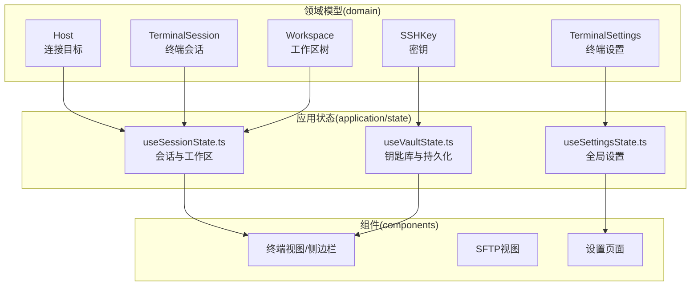
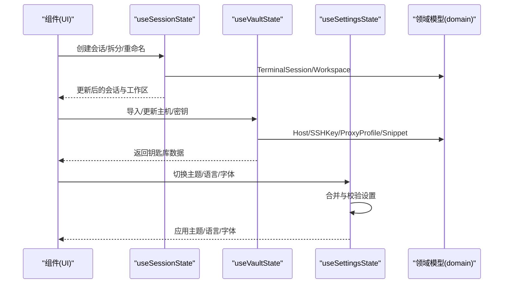
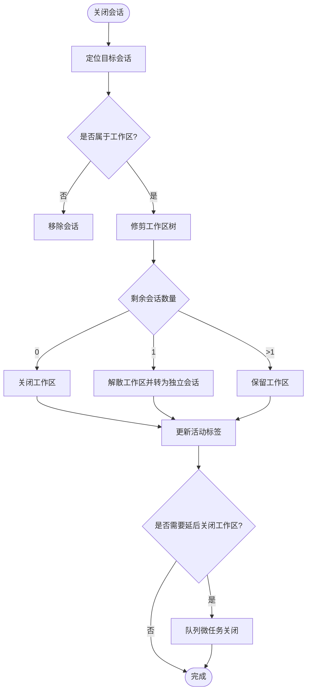
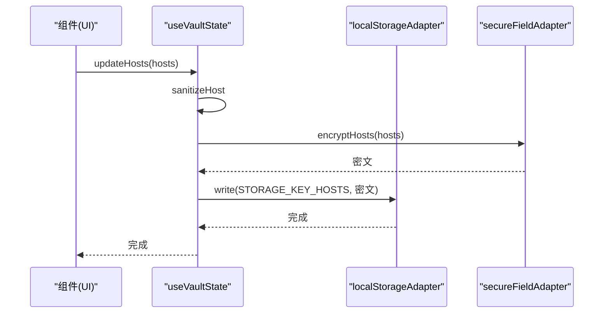
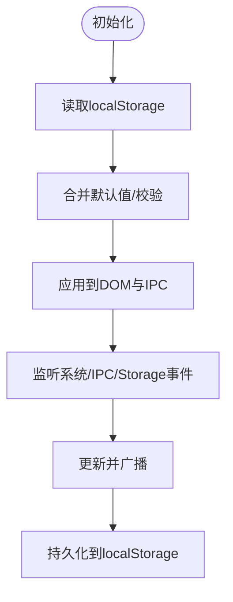
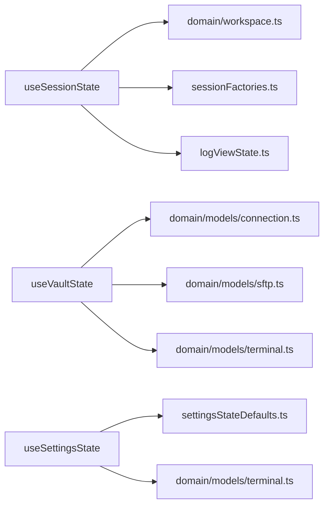

# 核心模块详解

<cite>
**本文档引用的文件**
- [application/state/useSessionState.ts](file://application/state/useSessionState.ts)
- [application/state/useVaultState.ts](file://application/state/useVaultState.ts)
- [application/state/useSettingsState.ts](file://application/state/useSettingsState.ts)
- [domain/models/terminal.ts](file://domain/models/terminal.ts)
- [domain/models/connection.ts](file://domain/models/connection.ts)
- [domain/models/sftp.ts](file://domain/models/sftp.ts)
- [application/state/sessionFactories.ts](file://application/state/sessionFactories.ts)
- [domain/workspace.ts](file://domain/workspace.ts)
- [application/state/logViewState.ts](file://application/state/logViewState.ts)
- [application/state/settingsStateDefaults.ts](file://application/state/settingsStateDefaults.ts)
</cite>

## 目录
1. [简介](#简介)
2. [项目结构](#项目结构)
3. [核心组件](#核心组件)
4. [架构总览](#架构总览)
5. [详细组件分析](#详细组件分析)
6. [依赖关系分析](#依赖关系分析)
7. [性能考虑](#性能考虑)
8. [故障排除指南](#故障排除指南)
9. [结论](#结论)

## 简介
本文件聚焦于Netcatty应用的状态管理与领域模型，系统性解析以下核心能力：
- 应用程序状态管理：useSessionState、useVaultState、useSettingsState三大Hook的实现原理、数据流与使用方式
- 领域模型设计：Host、TerminalSession、SSHKey等核心数据结构的职责边界与演算规则
- 组件架构模式：Hooks、高阶组件（HOC）、render props在状态与UI解耦中的应用
- 核心算法与工具：会话工作区树操作、加密持久化、键位绑定同步、主题与字体应用等
- 性能优化与内存管理：并发写入版本控制、跨窗口事件去重、渲染节流与存储压缩

## 项目结构
Netcatty采用“领域驱动 + Hooks状态管理”的分层组织：
- domain层：定义不可变的领域模型与算法（如工作区树、终端设置、连接配置）
- application/state层：封装应用级状态逻辑（会话、钥匙库、设置），提供可复用的Hook
- components层：基于状态Hook构建UI，遵循Hooks优先、必要时使用HOC或render props

**图表来源**
- [application/state/useSessionState.ts:22-800](file://application/state/useSessionState.ts#L22-L800)
- [application/state/useVaultState.ts:112-811](file://application/state/useVaultState.ts#L112-L811)
- [application/state/useSettingsState.ts:99-970](file://application/state/useSettingsState.ts#L99-L970)
- [domain/models/connection.ts:84-179](file://domain/models/connection.ts#L84-L179)
- [domain/models/terminal.ts:316-339](file://domain/models/terminal.ts#L316-L339)
- [domain/models/sftp.ts:1-79](file://domain/models/sftp.ts#L1-L79)
- [domain/workspace.ts:1-489](file://domain/workspace.ts#L1-L489)

**章节来源**
- [application/state/useSessionState.ts:22-800](file://application/state/useSessionState.ts#L22-L800)
- [application/state/useVaultState.ts:112-811](file://application/state/useVaultState.ts#L112-L811)
- [application/state/useSettingsState.ts:99-970](file://application/state/useSettingsState.ts#L99-L970)
- [domain/models/connection.ts:84-179](file://domain/models/connection.ts#L84-L179)
- [domain/models/terminal.ts:316-339](file://domain/models/terminal.ts#L316-L339)
- [domain/models/sftp.ts:1-79](file://domain/models/sftp.ts#L1-L79)
- [domain/workspace.ts:1-489](file://domain/workspace.ts#L1-L489)

## 核心组件
本节从“状态Hook + 领域模型 + 工具算法”三个维度，梳理三大核心模块。

- useSessionState.ts
  - 职责：管理TerminalSession列表、Workspace树、标签页顺序、日志回放视图、拖拽与重命名、广播模式、焦点切换等
  - 关键点：通过workspacesRef确保并发关闭场景下的存在性检查；严格区分“会话级”与“工作区级”状态更新；提供splitSession、appendHostToWorkspace等原子操作
  - 复杂度：会话增删改查O(n)，工作区树操作基于递归遍历，平均O(h)（h为树高）

- useVaultState.ts
  - 职责：管理Host、SSHKey、Identity、ProxyProfile、Snippet、KnownHost、ShellHistory、ConnectionLog等“钥匙库”数据
  - 关键点：写入版本计数器防止乱序覆盖；跨窗口storage事件序列号去重；敏感字段加密存储；支持导入/导出与迁移（如旧版SSHKey格式）
  - 复杂度：读写O(n)；加密/解密异步开销；初始化阶段多路并行读取后合并

- useSettingsState.ts
  - 职责：统一管理UI主题、语言、字体、终端设置、热键方案、SFTP行为、编辑器与会话日志等全局偏好
  - 关键点：外观变更批量通知IPC；终端设置签名避免重复广播；键位绑定版本与来源防冲突；系统偏好监听与动态适配
  - 复杂度：多数为常量时间写入与DOM属性设置；IPC通知按需触发

**章节来源**
- [application/state/useSessionState.ts:22-800](file://application/state/useSessionState.ts#L22-L800)
- [application/state/useVaultState.ts:112-811](file://application/state/useVaultState.ts#L112-L811)
- [application/state/useSettingsState.ts:99-970](file://application/state/useSettingsState.ts#L99-L970)

## 架构总览
下图展示三大Hook如何与领域模型交互，并驱动组件渲染：

**图表来源**
- [application/state/useSessionState.ts:22-800](file://application/state/useSessionState.ts#L22-L800)
- [application/state/useVaultState.ts:112-811](file://application/state/useVaultState.ts#L112-L811)
- [application/state/useSettingsState.ts:99-970](file://application/state/useSettingsState.ts#L99-L970)
- [domain/models/terminal.ts:316-339](file://domain/models/terminal.ts#L316-L339)
- [domain/models/connection.ts:84-179](file://domain/models/connection.ts#L84-L179)

## 详细组件分析

### useSessionState：会话与工作区状态管理
- 数据结构
  - sessions: TerminalSession[]
  - workspaces: Workspace[]
  - logViews: LogView[]
  - activeTabId: 由外部store维护
- 核心能力
  - 会话生命周期：创建本地/串口/主机会话、更新状态、关闭会话并自动清理空工作区
  - 工作区树操作：插入/追加/拆分、重排焦点顺序、计算焦点移动、更新分割尺寸
  - 批量操作：从主机批量创建会话并进入focus模式工作区（用于脚本执行）
  - 日志回放：打开/关闭连接日志回放标签页
- 并发与一致性
  - 使用workspacesRef保存最新快照，避免React并发调度导致的竞态
  - 在setWorkspaces更新器内部再setSessions，保证“先匹配目标工作区再提交会话”，防止孤儿会话
- 复杂度与性能
  - pruneWorkspaceNode/insertPaneIntoWorkspace基于树递归，单次操作O(h)
  - focus移动通过收集所有pane位置并计算几何距离，O(n)

**图表来源**
- [application/state/useSessionState.ts:89-183](file://application/state/useSessionState.ts#L89-L183)
- [domain/workspace.ts:12-52](file://domain/workspace.ts#L12-L52)

**章节来源**
- [application/state/useSessionState.ts:22-800](file://application/state/useSessionState.ts#L22-L800)
- [domain/workspace.ts:1-489](file://domain/workspace.ts#L1-L489)
- [application/state/sessionFactories.ts:1-90](file://application/state/sessionFactories.ts#L1-L90)
- [application/state/logViewState.ts:1-25](file://application/state/logViewState.ts#L1-L25)

### useVaultState：钥匙库与持久化
- 数据域
  - Hosts、SSHKeys、Identities、ProxyProfiles、Snippets、CustomGroups、SnippetPackages、KnownHosts、ShellHistory、ConnectionLogs、ManagedSources、GroupConfigs
- 加密与迁移
  - 写入前对敏感字段加密，读取时解密；支持旧版SSHKey格式迁移与不兼容类型过滤
  - 初始化阶段按需并行读取，避免阻塞
- 版本与去重
  - 每个数据域维护writeVersion与readSeq，防止乱序写入与过期解密覆盖
  - 跨窗口storage事件监听，仅当序列号匹配才应用
- 导入/导出
  - 支持结构化导出与字符串导入，内部并行加密写入

**图表来源**
- [application/state/useVaultState.ts:146-154](file://application/state/useVaultState.ts#L146-L154)
- [application/state/useVaultState.ts:405-426](file://application/state/useVaultState.ts#L405-L426)

**章节来源**
- [application/state/useVaultState.ts:112-811](file://application/state/useVaultState.ts#L112-L811)

### useSettingsState：全局设置与外观
- 设置域
  - 主题/语言/字体/终端主题/热键方案/自定义键位/编辑器/会话日志/SFTP行为等
- 同步与广播
  - 通过IPC向其他窗口/进程广播设置变更；终端设置采用签名避免重复广播
  - 键位绑定携带版本与来源，避免冲突与回环
- 动态适配
  - 监听系统颜色偏好变化；根据平台自动选择热键方案；应用主题令牌到DOM变量
- 重水合
  - 提供rehydrateAllFromStorage统一从localStorage恢复全部设置

**图表来源**
- [application/state/useSettingsState.ts:418-489](file://application/state/useSettingsState.ts#L418-L489)
- [application/state/settingsStateDefaults.ts:101-159](file://application/state/settingsStateDefaults.ts#L101-L159)

**章节来源**
- [application/state/useSettingsState.ts:99-970](file://application/state/useSettingsState.ts#L99-L970)
- [application/state/settingsStateDefaults.ts:1-159](file://application/state/settingsStateDefaults.ts#L1-L159)

### 领域模型设计

#### Host：连接目标
- 字段要点：协议、端口、用户名、代理/链式跳转、环境变量、字符集、Mosh开关、主题/字体覆盖、关键字高亮规则、遗留算法与keepalive覆盖等
- 设计意图：将“连接配置”抽象为可序列化、可继承、可覆盖的实体，便于跨模块共享与同步

**章节来源**
- [domain/models/connection.ts:84-179](file://domain/models/connection.ts#L84-L179)

#### TerminalSession：终端会话
- 字段要点：连接状态、协议、主机信息、启动命令、串口配置、本地Shell参数、字符集等
- 设计意图：统一“会话”概念，屏蔽底层协议差异，支持本地/串口/SSH等多协议

**章节来源**
- [domain/models/terminal.ts:316-339](file://domain/models/terminal.ts#L316-L339)

#### SSHKey：密钥
- 字段要点：类型、私钥/公钥/证书、口令、来源（生成/导入/引用）、分类（key/certificate/identity）、创建时间、文件路径
- 设计意图：集中管理密钥与证书，支持安全存储与引用

**章节来源**
- [domain/models/connection.ts:186-200](file://domain/models/connection.ts#L186-L200)

#### Workspace与工作区树算法
- 核心算法：插入/追加/修剪/重排/焦点移动，均基于递归树遍历
- 设计意图：以不可变树结构表达布局与焦点，保证状态可预测与可回溯

**章节来源**
- [domain/workspace.ts:1-489](file://domain/workspace.ts#L1-L489)

## 依赖关系分析
- useSessionState依赖
  - domain/models：TerminalSession、Host、SerialConfig
  - domain/workspace：工作区树操作API
  - application/state/sessionFactories：会话工厂
  - application/state/logViewState：日志回放标签
- useVaultState依赖
  - domain/models：Host、SSHKey、Identity、ProxyProfile、Snippet、KnownHost、ShellHistory、ConnectionLog、GroupConfig
  - infrastructure/persistence：localStorageAdapter、secureFieldAdapter
  - infrastructure/config：storageKeys、defaultData
- useSettingsState依赖
  - domain/models：TerminalSettings、HotkeyScheme、CustomKeyBindings、UILanguage、SessionLogFormat
  - infrastructure/config：uiThemes、fonts、i18n、storageKeys
  - infrastructure/services：netcattyBridge

**图表来源**
- [application/state/useSessionState.ts:1-44](file://application/state/useSessionState.ts#L1-L44)
- [application/state/useVaultState.ts:1-50](file://application/state/useVaultState.ts#L1-L50)
- [application/state/useSettingsState.ts:1-98](file://application/state/useSettingsState.ts#L1-L98)
- [domain/workspace.ts:1-10](file://domain/workspace.ts#L1-L10)
- [application/state/sessionFactories.ts:1-9](file://application/state/sessionFactories.ts#L1-L9)
- [application/state/logViewState.ts:1-7](file://application/state/logViewState.ts#L1-L7)
- [application/state/settingsStateDefaults.ts:1-9](file://application/state/settingsStateDefaults.ts#L1-L9)

**章节来源**
- [application/state/useSessionState.ts:1-44](file://application/state/useSessionState.ts#L1-L44)
- [application/state/useVaultState.ts:1-50](file://application/state/useVaultState.ts#L1-L50)
- [application/state/useSettingsState.ts:1-98](file://application/state/useSettingsState.ts#L1-L98)

## 性能考虑
- 并发写入与乱序覆盖
  - useVaultState为每个数据域维护writeVersion，写入回调仅在版本匹配时落盘，避免异步写入乱序覆盖
  - 跨窗口storage事件采用readSeq序列号，丢弃过期解密结果
- 渲染与DOM更新
  - useSettingsState对主题/语言/字体等变更进行批量通知与去重，避免重复IPC与昂贵DOM操作
  - applyThemeTokens仅在必要时更新DOM变量，减少重绘
- 存储与网络
  - useVaultState对敏感字段加密后再写入localStorage，降低泄露风险；并行读取多个域，缩短初始化时间
- 计算复杂度
  - 工作区树操作为O(h)，focus移动为O(n)；建议在大工作区中限制同时会话数量或采用虚拟化

[本节为通用指导，无需特定文件引用]

## 故障排除指南
- 会话关闭后出现“空白标签”
  - 检查activeTabId是否被正确重定向至最近的工作区或独立会话
  - 确认closeWorkspace与closeSession的调用顺序与workspacesRef的快照一致性
- 工作区拆分后焦点错乱
  - 使用getNextFocusSessionId计算焦点移动，确认方向与几何重叠判断
- 钥匙库导入失败或显示异常
  - 确认旧版SSHKey迁移流程已执行；检查isLegacyUnsupportedKey过滤逻辑
  - 查看writeVersion/readSeq是否被新事件推进，避免过期解密覆盖
- 设置未生效或重复广播
  - 检查serializeTerminalSettings签名与broadcastedLocalTerminalSettingsVersionRef
  - 确认customKeyBindings版本与origin来源防冲突逻辑

**章节来源**
- [application/state/useSessionState.ts:89-183](file://application/state/useSessionState.ts#L89-L183)
- [domain/workspace.ts:378-488](file://domain/workspace.ts#L378-L488)
- [application/state/useVaultState.ts:566-690](file://application/state/useVaultState.ts#L566-L690)
- [application/state/useSettingsState.ts:640-653](file://application/state/useSettingsState.ts#L640-L653)

## 结论
Netcatty的核心模块通过清晰的领域模型与严谨的状态管理，实现了：
- 会话与工作区的高可用布局与焦点控制
- 钥匙库的安全持久化与跨窗口一致性
- 全局设置的动态适配与低开销广播
配合严格的版本控制、去重与异步加密策略，整体具备良好的扩展性与稳定性。建议在大规模工作区场景中进一步引入虚拟化与懒加载，以优化内存占用与渲染性能。