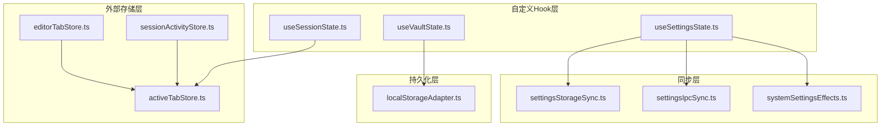
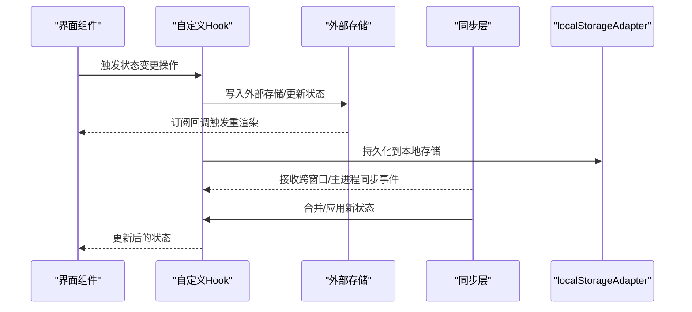
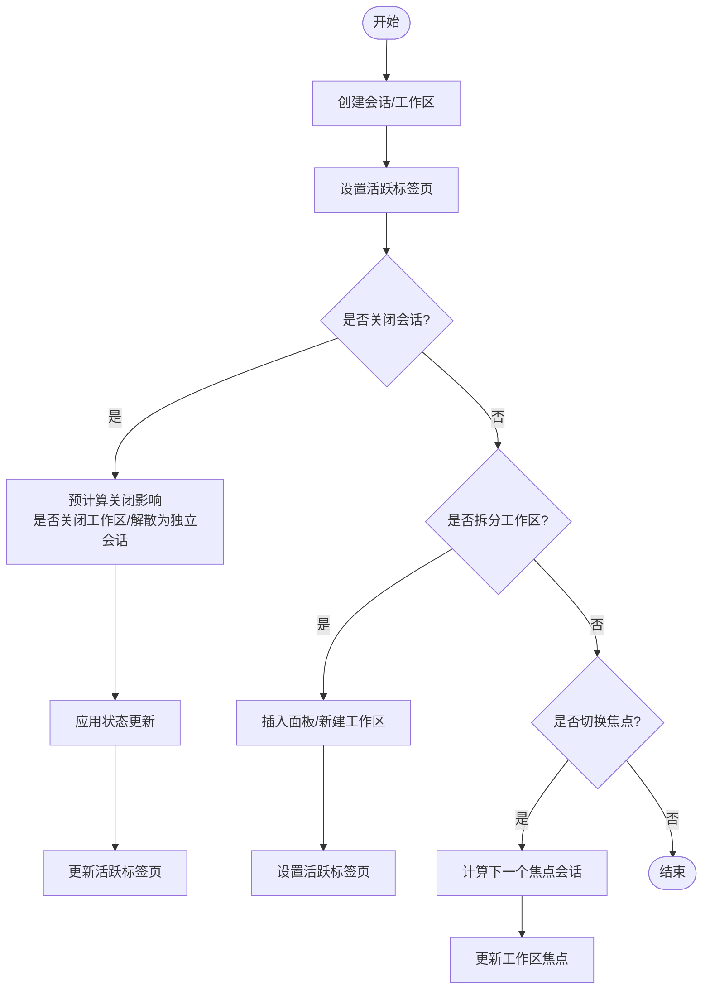
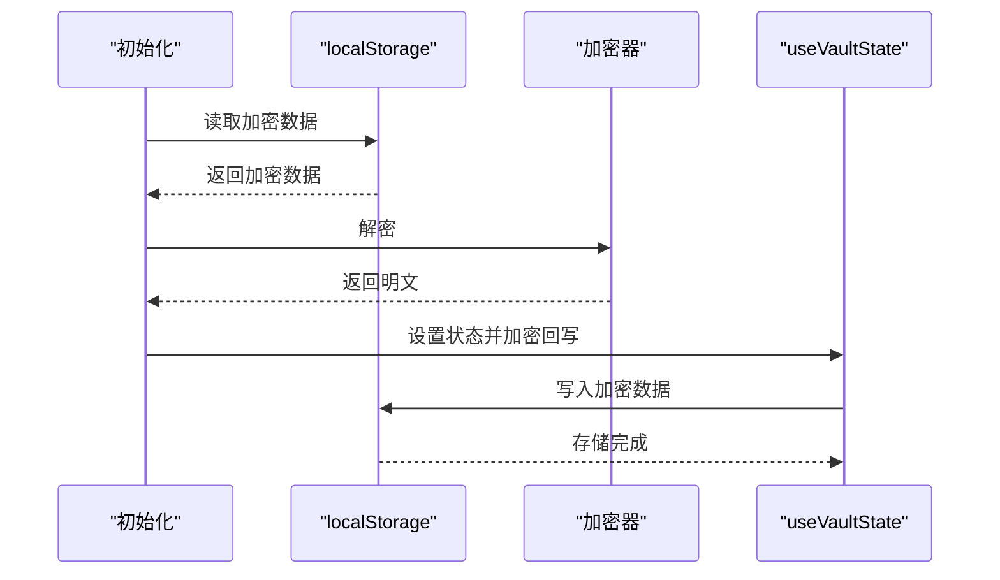
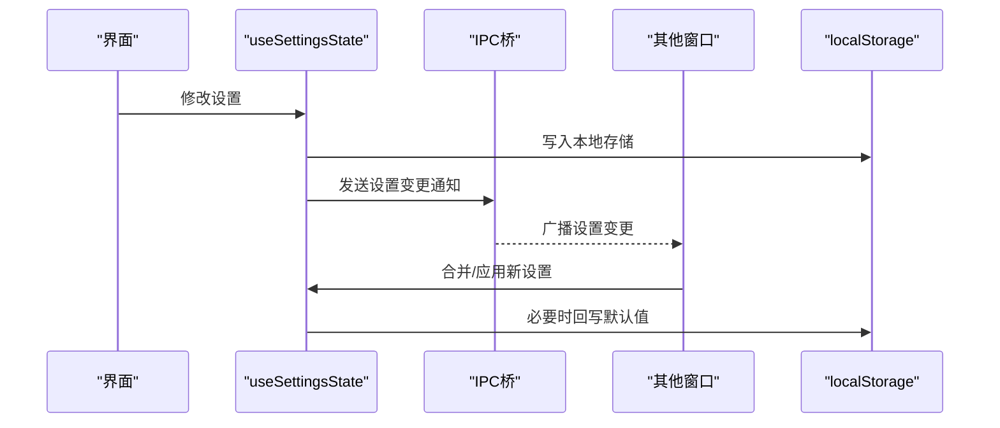
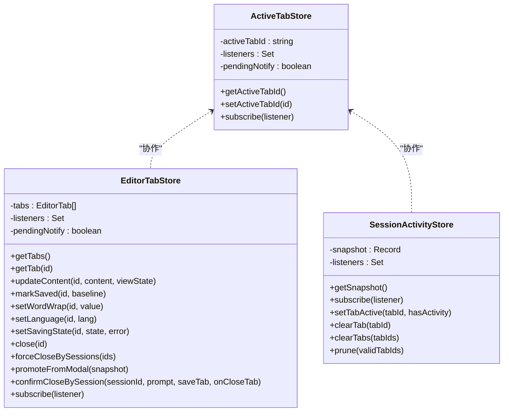
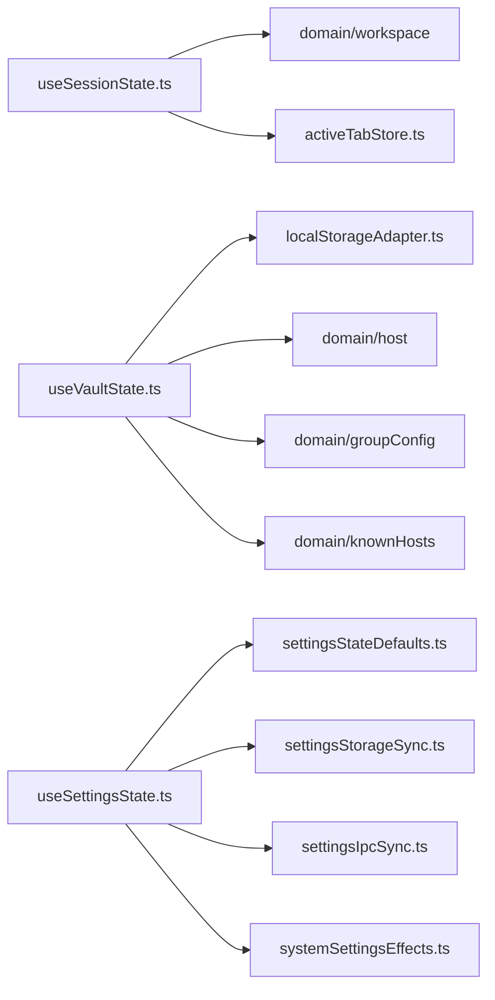

# 状态管理

<cite>
**本文档引用的文件**
- [useSessionState.ts](file://application/state/useSessionState.ts)
- [useVaultState.ts](file://application/state/useVaultState.ts)
- [useSettingsState.ts](file://application/state/useSettingsState.ts)
- [activeTabStore.ts](file://application/state/activeTabStore.ts)
- [sessionActivityStore.ts](file://application/state/sessionActivityStore.ts)
- [sessionActivity.ts](file://application/state/sessionActivity.ts)
- [logViewState.ts](file://application/state/logViewState.ts)
- [editorTabStore.ts](file://application/state/editorTabStore.ts)
- [settingsStateDefaults.ts](file://application/state/settingsStateDefaults.ts)
- [settingsStorageSync.ts](file://application/state/settingsStorageSync.ts)
- [settingsIpcSync.ts](file://application/state/settingsIpcSync.ts)
- [systemSettingsEffects.ts](file://application/state/systemSettingsEffects.ts)
- [useStoredBoolean.ts](file://application/state/useStoredBoolean.ts)
- [useStoredNumber.ts](file://application/state/useStoredNumber.ts)
- [useStoredString.ts](file://application/state/useStoredString.ts)
- [useStoredViewMode.ts](file://application/state/useStoredViewMode.ts)
</cite>

## 目录
1. [简介](#简介)
2. [项目结构](#项目结构)
3. [核心组件](#核心组件)
4. [架构总览](#架构总览)
5. [详细组件分析](#详细组件分析)
6. [依赖关系分析](#依赖关系分析)
7. [性能考量](#性能考量)
8. [故障排查指南](#故障排查指南)
9. [结论](#结论)
10. [附录](#附录)

## 简介
本文件系统性梳理 Netcatty 的状态管理体系，重点覆盖以下方面：
- React Hooks 在状态管理中的应用：useSessionState、useVaultState、useSettingsState 等自定义 Hook 的设计模式与实现技巧
- 集中式状态与局部状态的结合策略：状态更新触发机制、状态持久化方案、跨窗口/跨进程同步策略
- workspacesRef 引用的作用与竞态条件处理
- 状态流转图：会话创建、工作区管理、标签页切换的完整状态变化过程
- 调试技巧与性能优化建议（并发调度与 StrictMode 处理）

## 项目结构
Netcatty 的状态管理采用“自定义 Hook + 外部存储 + 同步桥”的分层设计：
- 自定义 Hook 层：封装业务状态与交互逻辑（如会话、设置、库（Vault））
- 外部存储层：ActiveTabStore、EditorTabStore、SessionActivityStore 等，提供细粒度订阅与跨组件共享
- 同步层：settingsStorageSync、settingsIpcSync、systemSettingsEffects 实现跨窗口与主进程的同步
- 持久化层：localStorageAdapter 提供统一的本地存储访问

图表来源
- [useSessionState.ts:22-800](file://application/state/useSessionState.ts#L22-L800)
- [useVaultState.ts:112-811](file://application/state/useVaultState.ts#L112-L811)
- [useSettingsState.ts:99-970](file://application/state/useSettingsState.ts#L99-L970)
- [activeTabStore.ts:18-103](file://application/state/activeTabStore.ts#L18-L103)
- [editorTabStore.ts:40-247](file://application/state/editorTabStore.ts#L40-L247)
- [sessionActivityStore.ts:5-79](file://application/state/sessionActivityStore.ts#L5-L79)
- [settingsStorageSync.ts:114-413](file://application/state/settingsStorageSync.ts#L114-L413)
- [settingsIpcSync.ts:65-236](file://application/state/settingsIpcSync.ts#L65-L236)
- [systemSettingsEffects.ts:22-124](file://application/state/systemSettingsEffects.ts#L22-L124)

章节来源
- [useSessionState.ts:22-800](file://application/state/useSessionState.ts#L22-L800)
- [useVaultState.ts:112-811](file://application/state/useVaultState.ts#L112-L811)
- [useSettingsState.ts:99-970](file://application/state/useSettingsState.ts#L99-L970)
- [activeTabStore.ts:18-103](file://application/state/activeTabStore.ts#L18-L103)
- [editorTabStore.ts:40-247](file://application/state/editorTabStore.ts#L40-L247)
- [sessionActivityStore.ts:5-79](file://application/state/sessionActivityStore.ts#L5-L79)
- [settingsStorageSync.ts:114-413](file://application/state/settingsStorageSync.ts#L114-L413)
- [settingsIpcSync.ts:65-236](file://application/state/settingsIpcSync.ts#L65-L236)
- [systemSettingsEffects.ts:22-124](file://application/state/systemSettingsEffects.ts#L22-L124)

## 核心组件
- useSessionState：集中管理终端会话、工作区、标签页顺序、广播模式、日志视图等，提供会话创建、关闭、重命名、工作区拆分与合并、焦点切换等能力
- useVaultState：集中管理主机、密钥、代理配置、片段、已知主机、Shell 历史、连接日志、托管源、分组配置等，提供加密持久化、导入导出、跨窗口同步、版本控制等
- useSettingsState：集中管理主题、UI 字体、热键方案、终端设置、SFTP 行为、编辑器设置、会话日志等，提供跨窗口/跨进程同步、系统设置联动、严格模式下的幂等写入
- ActiveTabStore：外部存储，提供活跃标签页 ID 的细粒度订阅，避免渲染阶段 setState
- EditorTabStore：外部存储，管理编辑器标签页集合，支持脏检查、批量关闭、强制关闭等
- SessionActivityStore：外部存储，维护会话活动标记，支持清理与裁剪
- 通用存储 Hook：useStoredBoolean/Number/String/ViewMode，提供轻量级状态持久化与跨组件同步

章节来源
- [useSessionState.ts:22-800](file://application/state/useSessionState.ts#L22-L800)
- [useVaultState.ts:112-811](file://application/state/useVaultState.ts#L112-L811)
- [useSettingsState.ts:99-970](file://application/state/useSettingsState.ts#L99-L970)
- [activeTabStore.ts:18-103](file://application/state/activeTabStore.ts#L18-L103)
- [editorTabStore.ts:40-247](file://application/state/editorTabStore.ts#L40-L247)
- [sessionActivityStore.ts:5-79](file://application/state/sessionActivityStore.ts#L5-L79)
- [useStoredBoolean.ts:12-56](file://application/state/useStoredBoolean.ts#L12-L56)
- [useStoredNumber.ts:11-30](file://application/state/useStoredNumber.ts#L11-L30)
- [useStoredString.ts:11-29](file://application/state/useStoredString.ts#L11-L29)
- [useStoredViewMode.ts:9-24](file://application/state/useStoredViewMode.ts#L9-L24)

## 架构总览
Netcatty 的状态管理遵循“Hook 封装 + 外部存储 + 同步桥 + 持久化”的分层架构：
- Hook 层负责业务状态与交互逻辑，暴露稳定的方法签名
- 外部存储层通过 useSyncExternalStore 提供订阅能力，避免不必要的重渲染
- 同步层通过 storage 事件与 IPC 事件实现跨窗口与主进程的数据一致性
- 持久化层统一使用 localStorageAdapter，确保数据安全与可移植性

图表来源
- [useSettingsState.ts:539-582](file://application/state/useSettingsState.ts#L539-L582)
- [settingsStorageSync.ts:158-410](file://application/state/settingsStorageSync.ts#L158-L410)
- [settingsIpcSync.ts:91-236](file://application/state/settingsIpcSync.ts#L91-L236)
- [activeTabStore.ts:18-44](file://application/state/activeTabStore.ts#L18-L44)

## 详细组件分析

### useSessionState 组件分析
- 设计要点
  - 使用 workspacesRef 保存 workspaces 最新快照，解决 React 18 并发调度下 updater 执行时机不确定导致的竞态问题
  - 使用外部 activeTabStore 替代 useState 管理活跃标签页，避免 StrictMode 双次调用导致的状态不一致
  - 会话与工作区的增删改查通过不可变更新与树操作函数组合，保证状态一致性
  - 支持会话复制、工作区拆分、焦点切换、日志视图等复杂交互
- 关键流程
  - 会话创建：生成唯一 ID，追加到 sessions，设置为当前活跃标签
  - 工作区创建：基于会话 ID 列表构建工作区，分配 workspaceId
  - 会话关闭：计算是否需要关闭工作区或解散为独立会话，更新活跃标签
  - 工作区拆分：在同一工作区内插入新面板，或新建工作区并绑定两个会话
  - 焦点切换：根据方向计算下一个聚焦会话，更新工作区焦点

图表来源
- [useSessionState.ts:45-183](file://application/state/useSessionState.ts#L45-L183)
- [useSessionState.ts:395-444](file://application/state/useSessionState.ts#L395-L444)
- [useSessionState.ts:702-731](file://application/state/useSessionState.ts#L702-L731)

章节来源
- [useSessionState.ts:22-800](file://application/state/useSessionState.ts#L22-L800)

### useVaultState 组件分析
- 设计要点
  - 为每类实体维护 writeVersion/readSeq 序列号，防止异步写入与跨窗口事件交错导致的覆盖
  - 对敏感字段进行加密存储，非敏感字段直接持久化
  - 初始化时按需迁移旧格式数据，保证向后兼容
  - 提供导入/导出能力，支持批量写入与加密写入
- 关键流程
  - 初始化：从 localStorage 读取并解密，必要时回写加密结果；对旧数据进行迁移
  - 写入：更新内存状态，递增写入版本号，异步加密并写入 localStorage
  - 跨窗口同步：监听 storage 事件，解析并应用新值，使用序列号与版本号避免过期数据覆盖

图表来源
- [useVaultState.ts:405-564](file://application/state/useVaultState.ts#L405-L564)
- [useVaultState.ts:566-690](file://application/state/useVaultState.ts#L566-L690)

章节来源
- [useVaultState.ts:112-811](file://application/state/useVaultState.ts#L112-L811)

### useSettingsState 组件分析
- 设计要点
  - 使用多个 Ref 与快照，避免每次状态变更都重新挂载/卸载 storage 监听器
  - 严格区分本地变更与来自 IPC/Storage 的变更，通过版本号与来源标记避免循环广播
  - 主题、字体、语言等外观设置通过一次性 IPC 通知全窗口，减少多次广播
  - 系统设置（全局热键、托盘行为、自动更新）通过系统 Effects 与主进程联动
- 关键流程
  - 初始加载：从 localStorage 读取并校验，必要时回写默认值
  - 本地变更：更新内存状态，序列化并写入 localStorage，发送 IPC 通知
  - 跨窗口/主进程同步：接收 IPC 或 storage 事件，合并新值，避免重复广播

图表来源
- [useSettingsState.ts:539-582](file://application/state/useSettingsState.ts#L539-L582)
- [settingsStorageSync.ts:158-410](file://application/state/settingsStorageSync.ts#L158-L410)
- [settingsIpcSync.ts:91-236](file://application/state/settingsIpcSync.ts#L91-L236)

章节来源
- [useSettingsState.ts:99-970](file://application/state/useSettingsState.ts#L99-L970)
- [settingsStorageSync.ts:114-413](file://application/state/settingsStorageSync.ts#L114-L413)
- [settingsIpcSync.ts:65-236](file://application/state/settingsIpcSync.ts#L65-L236)
- [systemSettingsEffects.ts:22-124](file://application/state/systemSettingsEffects.ts#L22-L124)
- [settingsStateDefaults.ts:37-159](file://application/state/settingsStateDefaults.ts#L37-L159)

### 外部存储与订阅机制
- ActiveTabStore：提供活跃标签页 ID 的细粒度订阅，内部使用 pendingNotify 防止渲染阶段 setState
- EditorTabStore：管理编辑器标签页集合，支持脏检查、批量关闭、强制关闭，与活跃标签页协同
- SessionActivityStore：维护会话活动标记，支持清理与裁剪，配合 sessionActivity 工具函数使用

图表来源
- [activeTabStore.ts:18-103](file://application/state/activeTabStore.ts#L18-L103)
- [editorTabStore.ts:40-247](file://application/state/editorTabStore.ts#L40-L247)
- [sessionActivityStore.ts:5-79](file://application/state/sessionActivityStore.ts#L5-L79)

章节来源
- [activeTabStore.ts:18-103](file://application/state/activeTabStore.ts#L18-L103)
- [editorTabStore.ts:40-247](file://application/state/editorTabStore.ts#L40-L247)
- [sessionActivityStore.ts:5-79](file://application/state/sessionActivityStore.ts#L5-L79)
- [sessionActivity.ts:5-47](file://application/state/sessionActivity.ts#L5-L47)
- [logViewState.ts:3-25](file://application/state/logViewState.ts#L3-L25)

### 通用存储 Hook 分析
- useStoredBoolean：提供布尔值持久化，支持同窗口自定义事件与跨窗口 storage 事件同步
- useStoredNumber：提供数字持久化，强调显式 persist，避免高频更新刷写 localStorage
- useStoredString：提供字符串持久化，支持可选校验函数
- useStoredViewMode：提供视图模式持久化，限定合法值

章节来源
- [useStoredBoolean.ts:12-56](file://application/state/useStoredBoolean.ts#L12-L56)
- [useStoredNumber.ts:11-30](file://application/state/useStoredNumber.ts#L11-L30)
- [useStoredString.ts:11-29](file://application/state/useStoredString.ts#L11-L29)
- [useStoredViewMode.ts:9-24](file://application/state/useStoredViewMode.ts#L9-L24)

## 依赖关系分析
- useSessionState 依赖 domain/workspace 中的工作区树操作工具，依赖 activeTabStore 管理活跃标签
- useVaultState 依赖 localStorageAdapter 与加密适配器，依赖 domain/host、domain/groupConfig、domain/knownHosts 等模型清洗
- useSettingsState 依赖 settingsStateDefaults、settingsStorageSync、settingsIpcSync、systemSettingsEffects，形成完整的同步闭环
- 外部存储层通过 useSyncExternalStore 与 React 订阅机制集成，避免不必要的重渲染

图表来源
- [useSessionState.ts:1-20](file://application/state/useSessionState.ts#L1-L20)
- [useVaultState.ts:1-50](file://application/state/useVaultState.ts#L1-L50)
- [useSettingsState.ts:1-98](file://application/state/useSettingsState.ts#L1-L98)

章节来源
- [useSessionState.ts:1-20](file://application/state/useSessionState.ts#L1-L20)
- [useVaultState.ts:1-50](file://application/state/useVaultState.ts#L1-L50)
- [useSettingsState.ts:1-98](file://application/state/useSettingsState.ts#L1-L98)

## 性能考量
- 并发调度与 StrictMode
  - useSessionState 使用 workspacesRef 与预计算策略，避免 StrictMode 双次调用导致的状态不一致
  - useSettingsState 使用 persistMountedRef 与版本号/序列号，避免初始挂载时的冗余广播与跨窗口覆盖
- 渲染优化
  - 外部存储使用 useSyncExternalStore，仅在订阅值变化时触发重渲染
  - useSettingsState 将多字段外观设置合并为一次 IPC 通知，减少广播次数
- I/O 优化
  - useVaultState 采用 writeVersion/readSeq 防止异步写入覆盖，加密写入延迟到版本确认
  - useStoredNumber 显式 persist，避免拖拽等高频更新频繁写入 localStorage

## 故障排查指南
- 会话/工作区状态异常
  - 检查 workspacesRef 是否正确更新，确认关闭会话时是否正确判断工作区是否需要关闭或解散
  - 关注 closeWorkspace 与 closeSession 的回调链路，确保活跃标签页切换逻辑正确
- Vault 数据不同步或丢失
  - 检查 writeVersion/readSeq 是否被正确递增与比较，确认 storage 事件处理是否及时
  - 核对加密写入路径，确保版本匹配后再写入
- 设置不同步或循环广播
  - 检查版本号与来源标记，确认 incoming 与 local 的分支逻辑
  - 确认 persistMountedRef 是否在所有持久化 effect 之后才置位
- 活动标记与焦点问题
  - 使用 sessionActivityStore 的 prune 与 clear 方法清理无效标记
  - 结合 sessionActivity 工具函数验证活动标记的生成与清理逻辑

章节来源
- [useSessionState.ts:89-183](file://application/state/useSessionState.ts#L89-L183)
- [useVaultState.ts:127-145](file://application/state/useVaultState.ts#L127-L145)
- [useVaultState.ts:566-690](file://application/state/useVaultState.ts#L566-L690)
- [useSettingsState.ts:269-276](file://application/state/useSettingsState.ts#L269-L276)
- [useSettingsState.ts:793-799](file://application/state/useSettingsState.ts#L793-L799)
- [sessionActivityStore.ts:53-68](file://application/state/sessionActivityStore.ts#L53-L68)
- [sessionActivity.ts:16-32](file://application/state/sessionActivity.ts#L16-L32)

## 结论
Netcatty 的状态管理以自定义 Hook 为核心，结合外部存储与同步桥，实现了高内聚、低耦合的状态体系。通过 workspacesRef、版本号/序列号、useSyncExternalStore 等技术手段，有效解决了并发调度、StrictMode、跨窗口同步与性能优化等关键挑战。该架构既满足了复杂业务场景的需求，又保持了良好的可维护性与扩展性。

## 附录
- 状态调试建议
  - 使用浏览器开发者工具的 Redux DevTools 或 React DevTools 追踪状态变化
  - 在 useSettingsState 中利用 incomingTerminalSettingsSignatureRef 与版本号定位广播冲突
  - 在 useVaultState 中通过 writeVersion/readSeq 定位异步覆盖问题
- 性能优化清单
  - 避免在渲染阶段调用 setState，优先使用外部存储的 pendingNotify 机制
  - 对高频更新使用显式 persist（如 useStoredNumber），减少 localStorage 写入频率
  - 合并跨窗口通知，尽量一次广播多个设置项