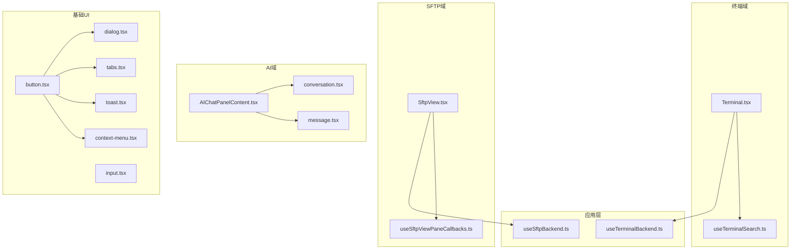
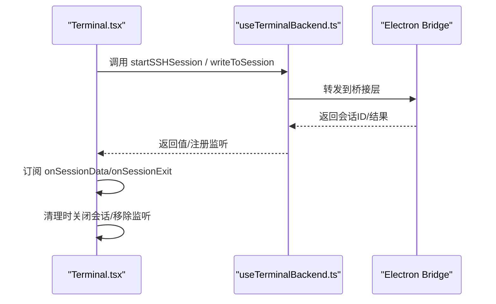
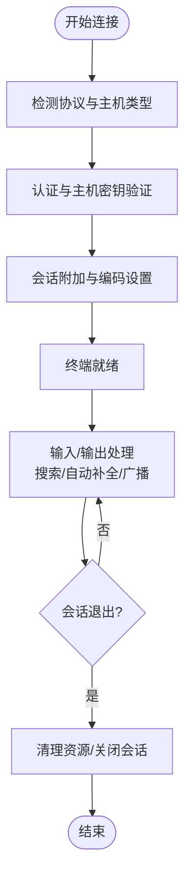
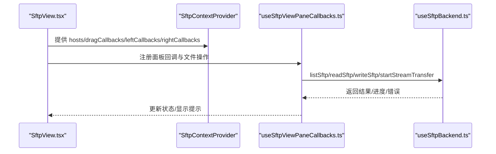
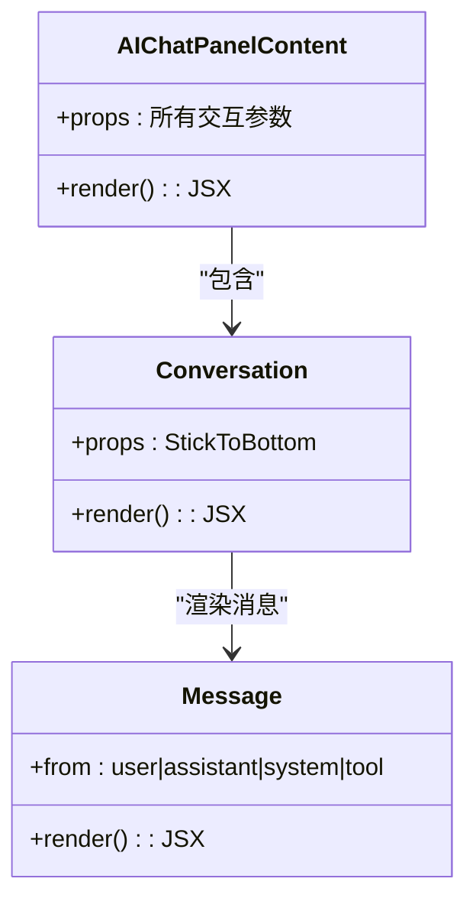
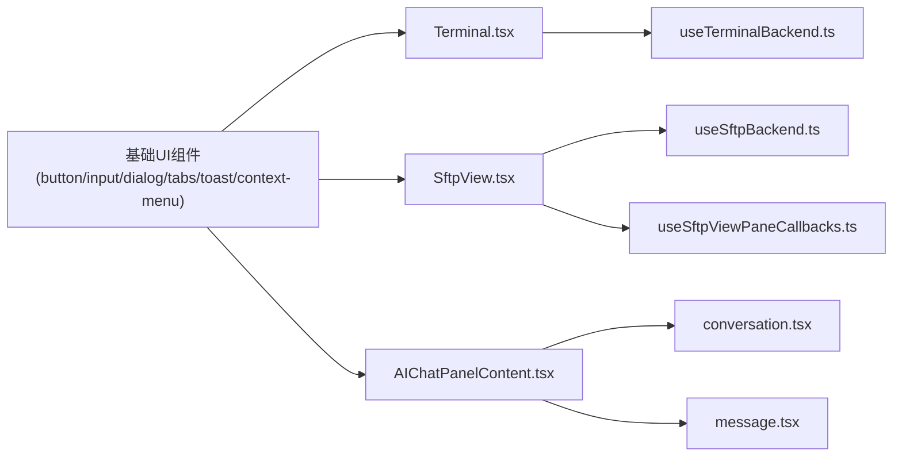

# 组件架构

<cite>
**本文引用的文件**
- [components/ui/button.tsx](file://components/ui/button.tsx)
- [components/ui/input.tsx](file://components/ui/input.tsx)
- [components/ui/dialog.tsx](file://components/ui/dialog.tsx)
- [components/ui/tabs.tsx](file://components/ui/tabs.tsx)
- [components/ui/toast.tsx](file://components/ui/toast.tsx)
- [components/ui/context-menu.tsx](file://components/ui/context-menu.tsx)
- [components/Terminal.tsx](file://components/Terminal.tsx)
- [components/SftpView.tsx](file://components/SftpView.tsx)
- [components/AIChatPanelContent.tsx](file://components/AIChatPanelContent.tsx)
- [components/ai-elements/conversation.tsx](file://components/ai-elements/conversation.tsx)
- [components/ai-elements/message.tsx](file://components/ai-elements/message.tsx)
- [components/terminal/hooks/useTerminalSearch.ts](file://components/terminal/hooks/useTerminalSearch.ts)
- [components/sftp/hooks/useSftpViewPaneCallbacks.ts](file://components/sftp/hooks/useSftpViewPaneCallbacks.ts)
- [application/state/useTerminalBackend.ts](file://application/state/useTerminalBackend.ts)
- [application/state/useSftpBackend.ts](file://application/state/useSftpBackend.ts)
</cite>

## 目录
1. [引言](#引言)
2. [项目结构](#项目结构)
3. [核心组件](#核心组件)
4. [架构总览](#架构总览)
5. [详细组件分析](#详细组件分析)
6. [依赖分析](#依赖分析)
7. [性能考量](#性能考量)
8. [故障排查指南](#故障排查指南)
9. [结论](#结论)
10. [附录](#附录)

## 引言
本文件系统性梳理 Netcatty 的组件架构与设计模式，覆盖基础 UI 组件、业务组件与复合组件的组织方式，以及组件间通信、生命周期管理、状态与副作用处理、测试策略与性能优化建议。目标是帮助开发者快速理解并高效扩展组件体系。

## 项目结构
- 组件分层清晰：基础 UI 组件位于 components/ui，业务组件位于 components 下的领域模块（如 terminal、sftp、ai），复合组件负责编排与状态桥接。
- 状态与后端桥接：应用层 Hook 将 UI 与 Electron 桥接服务解耦，统一暴露稳定方法签名，降低渲染层重渲染成本。
- 国际化与主题：组件广泛使用 I18nProvider 与主题变量，确保一致的本地化体验与视觉风格。

图表来源
- [components/Terminal.tsx:1-987](file://components/Terminal.tsx#L1-L987)
- [components/SftpView.tsx:1-613](file://components/SftpView.tsx#L1-L613)
- [components/AIChatPanelContent.tsx:1-249](file://components/AIChatPanelContent.tsx#L1-L249)
- [components/terminal/hooks/useTerminalSearch.ts:1-103](file://components/terminal/hooks/useTerminalSearch.ts#L1-L103)
- [components/sftp/hooks/useSftpViewPaneCallbacks.ts:1-250](file://components/sftp/hooks/useSftpViewPaneCallbacks.ts#L1-L250)
- [application/state/useTerminalBackend.ts:1-263](file://application/state/useTerminalBackend.ts#L1-L263)
- [application/state/useSftpBackend.ts:1-294](file://application/state/useSftpBackend.ts#L1-L294)
- [components/ui/button.tsx:1-39](file://components/ui/button.tsx#L1-L39)
- [components/ui/dialog.tsx:1-132](file://components/ui/dialog.tsx#L1-L132)
- [components/ui/tabs.tsx:1-54](file://components/ui/tabs.tsx#L1-L54)
- [components/ui/toast.tsx:1-164](file://components/ui/toast.tsx#L1-L164)
- [components/ui/context-menu.tsx:1-273](file://components/ui/context-menu.tsx#L1-L273)

章节来源
- [components/Terminal.tsx:1-987](file://components/Terminal.tsx#L1-L987)
- [components/SftpView.tsx:1-613](file://components/SftpView.tsx#L1-L613)
- [components/AIChatPanelContent.tsx:1-249](file://components/AIChatPanelContent.tsx#L1-L249)
- [components/terminal/hooks/useTerminalSearch.ts:1-103](file://components/terminal/hooks/useTerminalSearch.ts#L1-L103)
- [components/sftp/hooks/useSftpViewPaneCallbacks.ts:1-250](file://components/sftp/hooks/useSftpViewPaneCallbacks.ts#L1-L250)
- [application/state/useTerminalBackend.ts:1-263](file://application/state/useTerminalBackend.ts#L1-L263)
- [application/state/useSftpBackend.ts:1-294](file://application/state/useSftpBackend.ts#L1-L294)
- [components/ui/button.tsx:1-39](file://components/ui/button.tsx#L1-L39)
- [components/ui/dialog.tsx:1-132](file://components/ui/dialog.tsx#L1-L132)
- [components/ui/tabs.tsx:1-54](file://components/ui/tabs.tsx#L1-L54)
- [components/ui/toast.tsx:1-164](file://components/ui/toast.tsx#L1-L164)
- [components/ui/context-menu.tsx:1-273](file://components/ui/context-menu.tsx#L1-L273)

## 核心组件
- 基础 UI 组件：以 Radix UI 为基础，封装样式与可访问性，统一尺寸与变体；通过 forwardRef 与 className 合并与透传属性，保证可组合性与一致性。
- 业务组件：Terminal、SftpView、AIChatPanelContent 等承担复杂交互与状态编排，内部拆分为子组件与 Hooks，降低单体复杂度。
- 复合组件：通过 Context 提供状态共享，结合 memo 与稳定回调，避免无关重渲染。

章节来源
- [components/ui/button.tsx:1-39](file://components/ui/button.tsx#L1-L39)
- [components/ui/input.tsx:1-25](file://components/ui/input.tsx#L1-L25)
- [components/ui/dialog.tsx:1-132](file://components/ui/dialog.tsx#L1-L132)
- [components/ui/tabs.tsx:1-54](file://components/ui/tabs.tsx#L1-L54)
- [components/ui/toast.tsx:1-164](file://components/ui/toast.tsx#L1-L164)
- [components/ui/context-menu.tsx:1-273](file://components/ui/context-menu.tsx#L1-L273)
- [components/Terminal.tsx:1-987](file://components/Terminal.tsx#L1-L987)
- [components/SftpView.tsx:1-613](file://components/SftpView.tsx#L1-L613)
- [components/AIChatPanelContent.tsx:1-249](file://components/AIChatPanelContent.tsx#L1-L249)

## 架构总览
- 组件通信路径
  - Props 传递：从父组件向子组件单向传递数据与回调。
  - 事件处理：通过回调在子组件触发，父组件更新状态或调用后端接口。
  - Context 共享：在 SFTP 视图中通过 ContextProvider 提供主机、拖拽、面板回调等上下文，减少跨层级 props。
  - 自定义 Hook：TerminalSearch、SftpViewPaneCallbacks 等封装副作用与状态，返回稳定引用，降低渲染抖动。
- 生命周期管理
  - 初始化：在组件挂载时创建运行时实例（如 xterm、addon）、订阅后端事件、建立 refs 与稳定回调。
  - 副作用：通过 useEffect/useLayoutEffect 管理 DOM 变更、焦点、主题切换、渲染追踪等。
  - 资源清理：在卸载或状态变更时释放资源（addon、监听器、会话句柄）。
- 状态与后端桥接
  - useTerminalBackend/useSftpBackend 将 Electron 桥接能力抽象为稳定方法集合，避免每次渲染产生新对象导致的依赖链抖动。

图表来源
- [components/Terminal.tsx:1-987](file://components/Terminal.tsx#L1-L987)
- [application/state/useTerminalBackend.ts:1-263](file://application/state/useTerminalBackend.ts#L1-L263)

章节来源
- [components/Terminal.tsx:1-987](file://components/Terminal.tsx#L1-L987)
- [application/state/useTerminalBackend.ts:1-263](file://application/state/useTerminalBackend.ts#L1-L263)

## 详细组件分析

### 基础 UI 组件库（button、input、dialog、tabs、toast、context-menu）
- 设计要点
  - 使用 forwardRef 与 className 合并，支持变体与尺寸参数，保持一致的视觉与交互语义。
  - 对话框与上下文菜单采用 Portal 容器，确保层级与可访问性。
  - Toast 通过 Context 提供全局通知能力，并在 Provider 内部自动管理过期与点击行为。
- 最佳实践
  - 优先使用变体与尺寸枚举，避免内联样式污染。
  - 在需要无障碍支持的组件上，保留默认标签与角色，必要时补充 aria-* 属性。
  - 将样式合并逻辑集中在工具函数中，便于统一维护。

章节来源
- [components/ui/button.tsx:1-39](file://components/ui/button.tsx#L1-L39)
- [components/ui/input.tsx:1-25](file://components/ui/input.tsx#L1-L25)
- [components/ui/dialog.tsx:1-132](file://components/ui/dialog.tsx#L1-L132)
- [components/ui/tabs.tsx:1-54](file://components/ui/tabs.tsx#L1-L54)
- [components/ui/toast.tsx:1-164](file://components/ui/toast.tsx#L1-L164)
- [components/ui/context-menu.tsx:1-273](file://components/ui/context-menu.tsx#L1-L273)

### Terminal 组件（终端域）
- 职责划分
  - 运行时管理：创建 xterm 实例、addon（fit、serialize、search）、主题与字体解析。
  - 会话生命周期：连接、认证、写入、退出、编码设置、日志捕获。
  - 交互增强：搜索、自动补全、广播输入、ZMODEM 传输、服务器统计。
- 关键流程
  - 连接阶段：根据协议选择 SSH/MOSH/TELNET/LOCAL/ SERIAL，处理主机密钥验证与链式跳转。
  - 输入输出：处理多行粘贴、回车换行、本地回显、广播同步。
  - UI 协同：与 Toolbar、ComposeBar、ContextMenu、Autocomplete 等协作，提供一致的用户体验。

图表来源
- [components/Terminal.tsx:1-987](file://components/Terminal.tsx#L1-L987)

章节来源
- [components/Terminal.tsx:1-987](file://components/Terminal.tsx#L1-L987)
- [components/terminal/hooks/useTerminalSearch.ts:1-103](file://components/terminal/hooks/useTerminalSearch.ts#L1-L103)

### SftpView 组件（SFTP 域）
- 职责划分
  - 双面板文件浏览：左右面板独立状态与操作，支持拖拽、排序、隐藏文件切换。
  - 会话与文件操作：连接/断开、列表、读写、权限修改、上传下载、压缩传输。
  - 上下文共享：通过 ContextProvider 提供主机、拖拽、回调等，避免深层 props。
- 关键流程
  - 面板焦点与选择：点击面板容器聚焦对应侧，切换焦点时清理另一侧选择。
  - 文件操作：根据行为配置（双击打开/传输）与自动同步策略执行具体动作。
  - 传输队列：展示最近传输任务，支持定位目标目录与复制路径。

图表来源
- [components/SftpView.tsx:1-613](file://components/SftpView.tsx#L1-L613)
- [components/sftp/hooks/useSftpViewPaneCallbacks.ts:1-250](file://components/sftp/hooks/useSftpViewPaneCallbacks.ts#L1-L250)
- [application/state/useSftpBackend.ts:1-294](file://application/state/useSftpBackend.ts#L1-L294)

章节来源
- [components/SftpView.tsx:1-613](file://components/SftpView.tsx#L1-L613)
- [components/sftp/hooks/useSftpViewPaneCallbacks.ts:1-250](file://components/sftp/hooks/useSftpViewPaneCallbacks.ts#L1-L250)
- [application/state/useSftpBackend.ts:1-294](file://application/state/useSftpBackend.ts#L1-L294)

### AIChatPanelContent 与 AI 元素（AI 域）
- 职责划分
  - 会话与消息：Agent 选择、历史会话、消息列表、导出、文件附件、用户技能。
  - 响应渲染：使用 Streamdown 插件进行代码高亮与 Markdown 渲染，支持粘滞底部。
- 关键流程
  - 输入处理：文本/文件/模型/权限配置，发送或停止流式响应。
  - 历史管理：抽屉式历史面板，支持选择、删除与批量操作。

图表来源
- [components/AIChatPanelContent.tsx:1-249](file://components/AIChatPanelContent.tsx#L1-L249)
- [components/ai-elements/conversation.tsx:1-55](file://components/ai-elements/conversation.tsx#L1-L55)
- [components/ai-elements/message.tsx:1-86](file://components/ai-elements/message.tsx#L1-L86)

章节来源
- [components/AIChatPanelContent.tsx:1-249](file://components/AIChatPanelContent.tsx#L1-L249)
- [components/ai-elements/conversation.tsx:1-55](file://components/ai-elements/conversation.tsx#L1-L55)
- [components/ai-elements/message.tsx:1-86](file://components/ai-elements/message.tsx#L1-L86)

## 依赖分析
- 组件耦合
  - Terminal 与 SFTP 作为独立域，通过各自 Backend Hook 与 Context 解耦，避免相互直接依赖。
  - AI 组件与终端/文件操作无直接耦合，通过会话摘要与文件列表等轻量数据交互。
- 外部依赖
  - xterm 及其 addon：终端渲染与功能扩展。
  - Radix UI：对话框、上下文菜单、标签页等通用控件。
  - Streamdown：Markdown 渲染与代码高亮。
- 循环依赖
  - 通过 Hooks 抽象后端能力，避免组件间循环引用；Context 仅向下提供数据，不反向依赖。

图表来源
- [components/Terminal.tsx:1-987](file://components/Terminal.tsx#L1-L987)
- [components/SftpView.tsx:1-613](file://components/SftpView.tsx#L1-L613)
- [components/AIChatPanelContent.tsx:1-249](file://components/AIChatPanelContent.tsx#L1-L249)
- [components/ai-elements/conversation.tsx:1-55](file://components/ai-elements/conversation.tsx#L1-L55)
- [components/ai-elements/message.tsx:1-86](file://components/ai-elements/message.tsx#L1-L86)
- [application/state/useTerminalBackend.ts:1-263](file://application/state/useTerminalBackend.ts#L1-L263)
- [application/state/useSftpBackend.ts:1-294](file://application/state/useSftpBackend.ts#L1-L294)
- [components/ui/button.tsx:1-39](file://components/ui/button.tsx#L1-L39)
- [components/ui/dialog.tsx:1-132](file://components/ui/dialog.tsx#L1-L132)
- [components/ui/tabs.tsx:1-54](file://components/ui/tabs.tsx#L1-L54)
- [components/ui/toast.tsx:1-164](file://components/ui/toast.tsx#L1-L164)
- [components/ui/context-menu.tsx:1-273](file://components/ui/context-menu.tsx#L1-L273)

章节来源
- [components/Terminal.tsx:1-987](file://components/Terminal.tsx#L1-L987)
- [components/SftpView.tsx:1-613](file://components/SftpView.tsx#L1-L613)
- [components/AIChatPanelContent.tsx:1-249](file://components/AIChatPanelContent.tsx#L1-L249)
- [components/ai-elements/conversation.tsx:1-55](file://components/ai-elements/conversation.tsx#L1-L55)
- [components/ai-elements/message.tsx:1-86](file://components/ai-elements/message.tsx#L1-L86)
- [application/state/useTerminalBackend.ts:1-263](file://application/state/useTerminalBackend.ts#L1-L263)
- [application/state/useSftpBackend.ts:1-294](file://application/state/useSftpBackend.ts#L1-L294)
- [components/ui/button.tsx:1-39](file://components/ui/button.tsx#L1-L39)
- [components/ui/dialog.tsx:1-132](file://components/ui/dialog.tsx#L1-L132)
- [components/ui/tabs.tsx:1-54](file://components/ui/tabs.tsx#L1-L54)
- [components/ui/toast.tsx:1-164](file://components/ui/toast.tsx#L1-L164)
- [components/ui/context-menu.tsx:1-273](file://components/ui/context-menu.tsx#L1-L273)

## 性能考量
- 渲染优化
  - 使用 memo 包裹重型视图（如 SftpView），基于浅比较与稳定比较器减少重渲染。
  - 将稳定回调与 refs 用于高频事件（如搜索、拖拽、键盘快捷键），避免闭包抖动。
- 虚拟化与懒加载
  - 列表组件可引入虚拟滚动（如 react-window 或 react-virtual）以提升大数据集渲染性能。
  - 对于大文件预览与编辑，采用懒加载与按需渲染，避免一次性加载全部内容。
- 资源管理
  - 在组件卸载或状态变更时及时释放 xterm addon、监听器与会话句柄，防止内存泄漏。
  - 对于频繁触发的副作用（如搜索、缩放），使用防抖/节流与 requestAnimationFrame 优化。
- 主题与国际化
  - 通过主题与字体栈计算缓存，避免重复计算；对 I18n 文案使用稳定引用，减少不必要的翻译函数重建。

## 故障排查指南
- 终端连接问题
  - 检查协议可用性与桥接方法是否可用；确认主机密钥验证请求是否被正确响应。
  - 关注连接超时、链式跳转进度与会话退出事件，确保清理流程完整。
- SFTP 传输异常
  - 校验会话 ID 与连接映射；检查文件编码与权限；关注自动同步错误与文件监视失败。
- 通知与提示
  - 使用 toast 组件统一提示，确认 Provider 已正确注入；检查点击回调与自动消失时间。
- 上下文菜单层级
  - 确保 Portal 根节点存在且层级足够高，避免被其他元素遮挡；注意 aria-hidden 的处理。

章节来源
- [components/Terminal.tsx:1-987](file://components/Terminal.tsx#L1-L987)
- [components/SftpView.tsx:1-613](file://components/SftpView.tsx#L1-L613)
- [components/ui/toast.tsx:1-164](file://components/ui/toast.tsx#L1-L164)
- [components/ui/context-menu.tsx:1-273](file://components/ui/context-menu.tsx#L1-L273)

## 结论
Netcatty 的组件架构以“基础 UI + 业务组件 + 复合组件”的分层设计为核心，配合稳定的自定义 Hook 与 Context，实现了高内聚、低耦合的前端体系。通过明确的通信机制、生命周期管理与性能优化策略，既保障了复杂交互的可维护性，也为后续扩展提供了清晰的演进路径。

## 附录
- 组件设计最佳实践清单
  - 函数组件优先，合理使用 useMemo/useCallback/useRef 管理稳定引用。
  - Props 保持不可变，事件回调通过回调参数传递，避免在渲染期间创建新对象。
  - 使用 forwardRef 与 className 合并，统一尺寸与变体，提升可复用性。
  - 通过 Context 提供跨层级共享，但控制作用域，避免过度共享导致的渲染风暴。
  - 对外部依赖（xterm、Radix UI、Streamdown）进行封装与版本管理，确保升级可控。
- 测试策略建议
  - 单元测试：针对 Hooks（如 useTerminalSearch、useSftpViewPaneCallbacks）进行纯函数与副作用隔离测试。
  - 集成测试：模拟后端桥接层，验证组件在不同协议与文件操作下的行为。
  - UI 测试：使用快照与交互测试，覆盖关键流程（连接、传输、消息渲染）。
- 性能优化清单
  - 使用 memo 与稳定比较器；对高频事件使用防抖/节流。
  - 虚拟滚动与懒加载；主题与字体计算缓存。
  - 资源清理：在卸载或状态变更时释放 addon、监听器与会话句柄。