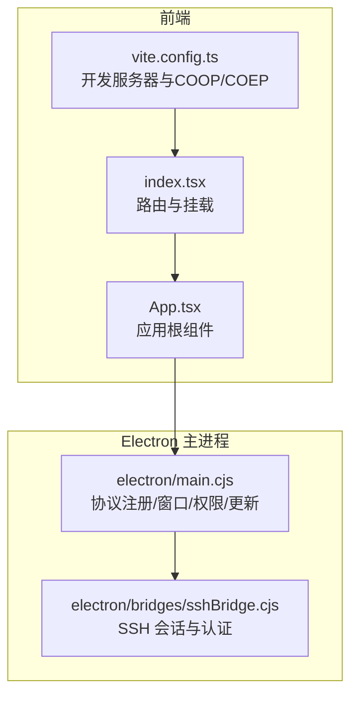
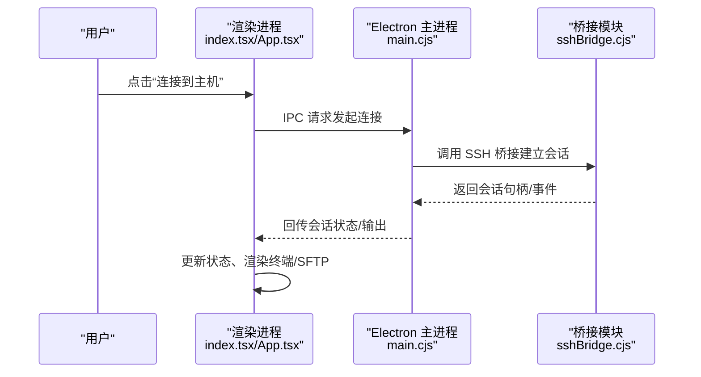
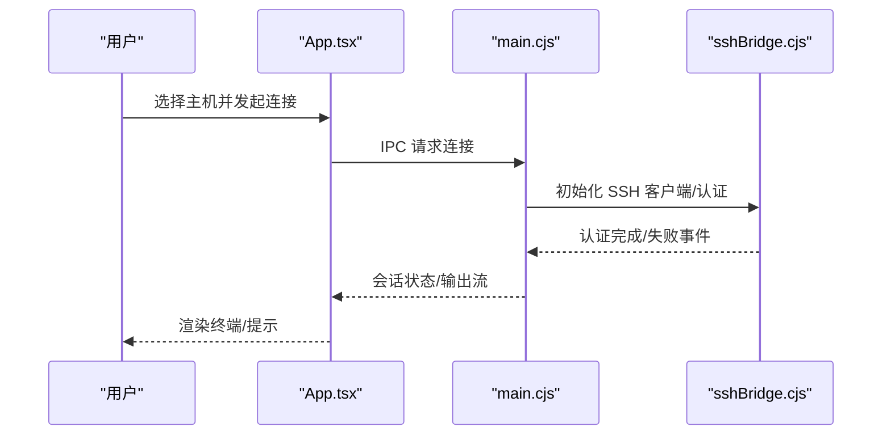
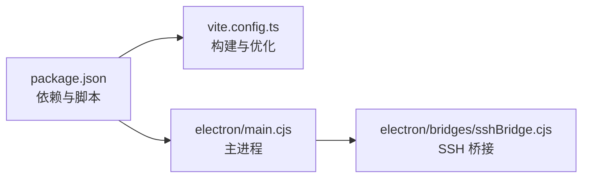

# 快速开始

<cite>
**本文引用的文件**
- [README.md](file://README.md)
- [package.json](file://package.json)
- [vite.config.ts](file://vite.config.ts)
- [index.tsx](file://index.tsx)
- [App.tsx](file://App.tsx)
- [electron/main.cjs](file://electron/main.cjs)
- [electron/bridges/sshBridge.cjs](file://electron/bridges/sshBridge.cjs)
- [domain/host.ts](file://domain/host.ts)
</cite>

## 目录
1. [简介](#简介)
2. [项目结构](#项目结构)
3. [核心组件](#核心组件)
4. [架构总览](#架构总览)
5. [详细组件分析](#详细组件分析)
6. [依赖关系分析](#依赖关系分析)
7. [性能注意事项](#性能注意事项)
8. [故障排除指南](#故障排除指南)
9. [结论](#结论)
10. [附录](#附录)

## 简介
Netcatty 是一款现代化的 SSH 客户端与终端管理器，支持 SSH、Telnet、Mosh、本地终端与串口连接，内置 SFTP 文件浏览器、终端分屏、主题与关键字高亮、AI 助手等特性。它基于 Electron + React + xterm.js 构建，适用于 macOS、Windows 和 Linux。

本“快速开始”面向初学者，覆盖以下内容：
- 下载与安装：从 GitHub Releases 获取预构建版本，或从源码构建开发版本
- 系统要求：Node.js 18+、支持的操作系统
- 开发环境搭建：克隆仓库、安装依赖、启动开发服务器
- 首次运行配置：创建保管库、添加主机、配置连接参数
- 基本使用：建立 SSH 连接、使用终端功能、进行文件传输
- 常见问题与故障排除

## 项目结构
Netcatty 采用前端（React/Vite）+ Electron 主进程 + 多个桥接模块（IPC）的分层架构：
- 应用入口与路由：index.tsx 负责根据 URL hash 切换主界面、设置窗口与托盘面板
- 主应用视图与状态：App.tsx 组织全局状态、会话管理、同步与热键处理
- 开发服务器与跨域隔离：vite.config.ts 提供 HMR、COOP/COEP 头以启用 SharedArrayBuffer/WASM
- Electron 主进程：electron/main.cjs 注册 app:// 协议、窗口管理、权限控制、自动更新与桥接注册
- 桥接模块：electron/bridges/* 实现 SSH、SFTP、本地文件系统、端口转发、终端会话等能力

图表来源
- [index.tsx:88-134](file://index.tsx#L88-L134)
- [App.tsx:78-134](file://App.tsx#L78-L134)
- [vite.config.ts:21-84](file://vite.config.ts#L21-L84)
- [electron/main.cjs:225-278](file://electron/main.cjs#L225-L278)
- [electron/bridges/sshBridge.cjs:1-200](file://electron/bridges/sshBridge.cjs#L1-L200)

章节来源
- [README.md:280-333](file://README.md#L280-L333)
- [package.json:14-36](file://package.json#L14-L36)
- [vite.config.ts:21-84](file://vite.config.ts#L21-L84)
- [index.tsx:88-134](file://index.tsx#L88-L134)
- [App.tsx:78-134](file://App.tsx#L78-L134)
- [electron/main.cjs:225-278](file://electron/main.cjs#L225-L278)
- [electron/bridges/sshBridge.cjs:1-200](file://electron/bridges/sshBridge.cjs#L1-L200)

## 核心组件
- 应用入口与路由：index.tsx 基于 URL hash 决定渲染主应用、设置页或托盘面板，并提供简单骨架屏回退
- 主应用根组件：App.tsx 管理主题、字体、会话、工作区、云同步、热键、键盘交互与密钥口令请求队列
- 开发服务器：vite.config.ts 启用 HMR、COOP/COEP 头，优化打包分块，抑制 Monaco 源映射告警
- Electron 主进程：electron/main.cjs 注册 app:// 协议、窗口生命周期、权限白名单、自动更新与错误监控
- SSH 桥接：electron/bridges/sshBridge.cjs 提供 SSH 连接、认证（私钥/代理/键盘交互）、算法与代理支持、日志流与 ZMODEM 支持

章节来源
- [index.tsx:88-134](file://index.tsx#L88-L134)
- [App.tsx:78-134](file://App.tsx#L78-L134)
- [vite.config.ts:21-84](file://vite.config.ts#L21-L84)
- [electron/main.cjs:225-278](file://electron/main.cjs#L225-L278)
- [electron/bridges/sshBridge.cjs:1-200](file://electron/bridges/sshBridge.cjs#L1-L200)

## 架构总览
下图展示了从用户操作到后端桥接的整体调用链路，以及关键数据流（会话、SFTP、同步、更新检查）：

图表来源
- [index.tsx:88-134](file://index.tsx#L88-L134)
- [App.tsx:512-545](file://App.tsx#L512-L545)
- [electron/main.cjs:352-397](file://electron/main.cjs#L352-L397)
- [electron/bridges/sshBridge.cjs:1-200](file://electron/bridges/sshBridge.cjs#L1-L200)

## 详细组件分析

### 安装与运行（预构建版本）
- 从 GitHub Releases 下载最新版本，支持 macOS（通用）、Windows（x64/arm64）、Linux（x64/arm64）
- macOS 用户若遇到 Gatekeeper 警告，请确认从官方发布页面下载最新构建

章节来源
- [README.md:283-296](file://README.md#L283-L296)

### 安装与运行（从源码构建开发版本）
- 克隆仓库、安装依赖、启动开发模式
- 开发模式同时启动 Vite 前端与 Electron 主进程，自动拉取 Mosh 二进制资源

章节来源
- [README.md:301-313](file://README.md#L301-L313)
- [package.json:14-36](file://package.json#L14-L36)
- [vite.config.ts:21-84](file://vite.config.ts#L21-L84)

### 系统要求
- Node.js 18+
- 支持的操作系统：macOS、Windows 10+、Linux

章节来源
- [README.md:297-299](file://README.md#L297-L299)

### 首次运行与基础配置
- 创建保管库：首次启动时应用会初始化本地存储与已知主机列表；可通过导入或手动添加主机
- 添加主机：在保管库中新增主机，填写标签、主机名、端口、认证方式（用户名/密码/私钥/代理/键盘交互）
- 配置连接参数：选择协议（SSH/Telnet/Mosh/本地/串口），必要时配置代理、算法、端口转发、X11 转发等

章节来源
- [domain/host.ts:157-174](file://domain/host.ts#L157-L174)
- [domain/host.ts:205-210](file://domain/host.ts#L205-L210)
- [electron/bridges/sshBridge.cjs:1-200](file://electron/bridges/sshBridge.cjs#L1-L200)

### 基本使用教程

#### 建立 SSH 连接
- 在保管库选择主机，点击连接
- 若使用私钥且被加密，应用会弹出口令请求队列；也可通过参考密钥自动填充
- 连接成功后进入终端会话，支持分屏、复制粘贴、关键字高亮与日志捕获

图表来源
- [App.tsx:547-674](file://App.tsx#L547-L674)
- [electron/main.cjs:352-397](file://electron/main.cjs#L352-L397)
- [electron/bridges/sshBridge.cjs:1-200](file://electron/bridges/sshBridge.cjs#L1-L200)

#### 使用终端功能
- 分屏与切换：支持水平/垂直分屏，多会话并行
- 快捷键与热键：可自定义热键方案，支持全局热键触发应用级动作
- 日志与捕获：可开启会话日志记录，便于审计与复盘

章节来源
- [App.tsx:724-749](file://App.tsx#L724-L749)
- [App.tsx:138-145](file://App.tsx#L138-L145)

#### 进行文件传输（SFTP）
- 在 SFTP 视图中浏览远程目录，支持拖放上传/下载
- 可直接在内置编辑器中修改文件，支持自动保存与冲突处理

章节来源
- [README.md:145-147](file://README.md#L145-L147)

### 依赖关系分析
- 前端依赖：React、xterm.js、TailwindCSS、Monaco 编辑器等
- Electron 与桥接：ssh2、ssh2-sftp-client、node-pty、serialport 等
- 构建工具：Vite、Electron Builder
- 自动更新：electron-updater

图表来源
- [package.json:38-118](file://package.json#L38-L118)
- [vite.config.ts:21-84](file://vite.config.ts#L21-L84)
- [electron/main.cjs:102-126](file://electron/main.cjs#L102-L126)
- [electron/bridges/sshBridge.cjs:1-200](file://electron/bridges/sshBridge.cjs#L1-L200)

章节来源
- [package.json:38-118](file://package.json#L38-L118)
- [vite.config.ts:21-84](file://vite.config.ts#L21-L84)
- [electron/main.cjs:102-126](file://electron/main.cjs#L102-L126)
- [electron/bridges/sshBridge.cjs:1-200](file://electron/bridges/sshBridge.cjs#L1-L200)

## 性能注意事项
- 开发模式下启用 HMR 与 COOP/COEP 头，提升调试体验
- 构建阶段按功能拆分 vendor 包，减少重复缓存与首屏体积
- Electron 主进程启用硬件加速开关，必要时可禁用沙箱用于调试（不建议生产）

章节来源
- [vite.config.ts:21-84](file://vite.config.ts#L21-L84)
- [electron/main.cjs:128-139](file://electron/main.cjs#L128-L139)

## 故障排除指南
- 无法加载 UI 或提示缺少渲染文件
  - 重新安装或重建应用，确保 dist 资源完整
- macOS 启动时出现 Gatekeeper 警告
  - 请从官方发布页面下载最新构建
- SSH 连接失败或超时
  - 检查主机可达性、端口与防火墙策略
  - 如使用代理或算法受限，调整代理配置或算法列表
- 私钥加密导致认证失败
  - 确认口令正确；应用会弹出口令请求队列；也可通过参考密钥迁移
- Mosh 无法连接
  - 确认系统已拉取 Mosh 二进制资源；开发模式下会自动解析发布版本

章节来源
- [electron/main.cjs:489-502](file://electron/main.cjs#L489-L502)
- [README.md:295-296](file://README.md#L295-L296)
- [electron/bridges/sshBridge.cjs:71-118](file://electron/bridges/sshBridge.cjs#L71-L118)
- [App.tsx:554-674](file://App.tsx#L554-L674)
- [README.md:18-29](file://README.md#L18-L29)

## 结论
通过本快速开始指南，你可以在几分钟内完成 Netcatty 的安装与首次运行，掌握创建主机、建立 SSH 连接、使用终端与 SFTP 的基本流程。随着对应用的深入使用，你可以进一步探索主题定制、热键配置、云同步与 AI 助手等功能。

## 附录

### 术语表
- 保管库：存放主机、密钥、代理配置与片段的本地数据库
- 会话：一次 SSH/Telnet/Mosh/本地/串口的连接实例
- SFTP：安全文件传输协议，支持双面板文件浏览与拖放传输
- 端口转发：将本地端口映射到目标主机端口，常用于访问内网服务