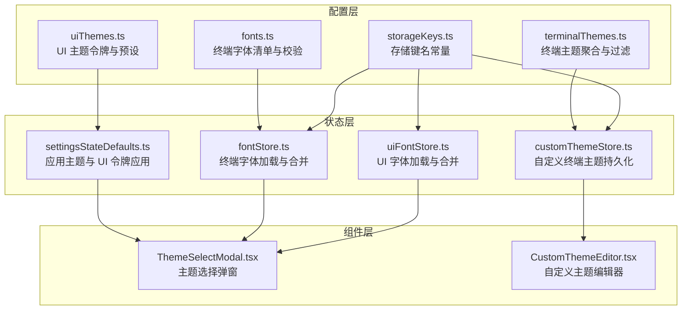
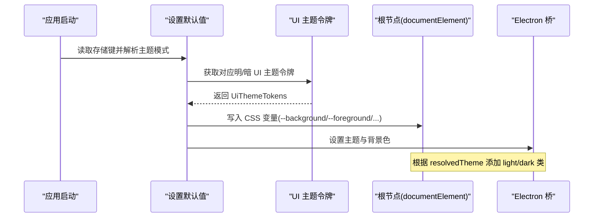
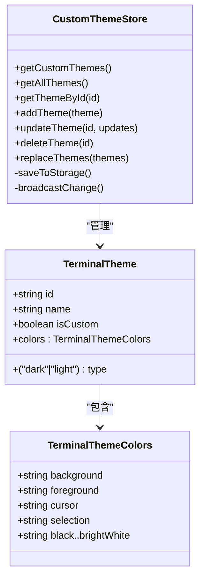
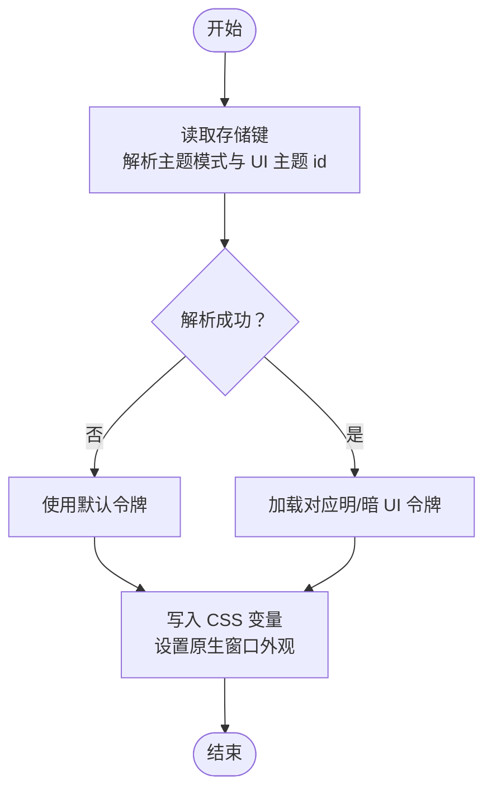
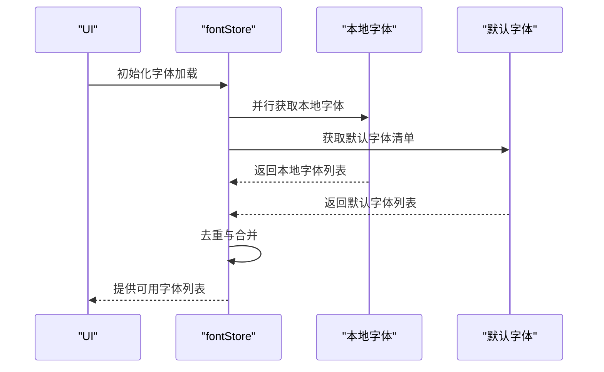
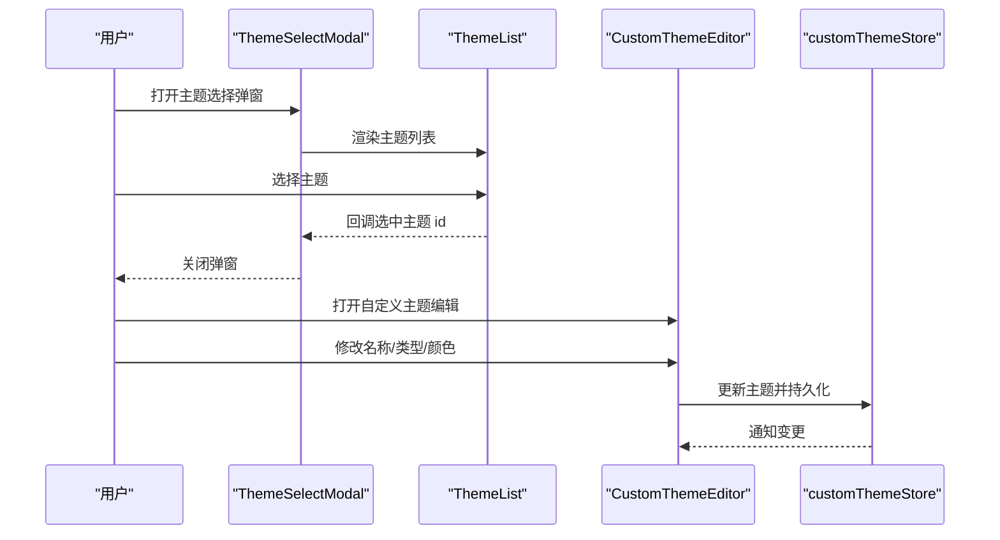
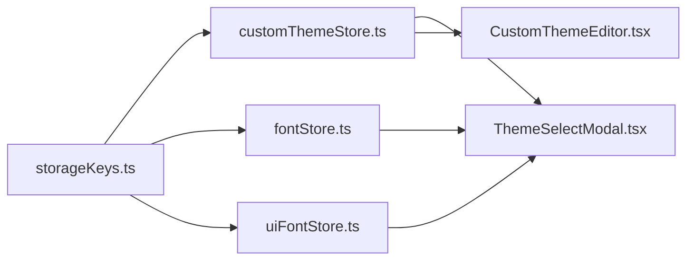

# 主题定制

<cite>
**本文引用的文件**
- [uiThemes.ts](file://infrastructure/config/uiThemes.ts)
- [terminalThemes.ts](file://infrastructure/config/terminalThemes.ts)
- [classic.ts](file://infrastructure/config/terminalThemes/classic.ts)
- [core.ts](file://infrastructure/config/terminalThemes/core.ts)
- [fonts.ts](file://infrastructure/config/fonts.ts)
- [storageKeys.ts](file://infrastructure/config/storageKeys.ts)
- [customThemeStore.ts](file://application/state/customThemeStore.ts)
- [fontStore.ts](file://application/state/fontStore.ts)
- [uiFontStore.ts](file://application/state/uiFontStore.ts)
- [settingsStateDefaults.ts](file://application/state/settingsStateDefaults.ts)
- [ThemeSelectModal.tsx](file://components/settings/ThemeSelectModal.tsx)
- [CustomThemeEditor.tsx](file://components/terminal/CustomThemeEditor.tsx)
- [terminal.ts](file://domain/models/terminal.ts)
</cite>

## 目录
1. [简介](#简介)
2. [项目结构](#项目结构)
3. [核心组件](#核心组件)
4. [架构总览](#架构总览)
5. [详细组件分析](#详细组件分析)
6. [依赖关系分析](#依赖关系分析)
7. [性能考量](#性能考量)
8. [故障排查指南](#故障排查指南)
9. [结论](#结论)
10. [附录](#附录)

## 简介
本指南面向希望为 Netcatty 定制主题的开发者与高级用户，系统讲解主题系统的架构与实现，覆盖以下方面：
- 终端主题：内置主题、UI 匹配主题、自定义主题的组织与持久化
- UI 主题：基于令牌（tokens）的明暗两套主题体系，以及与系统主题的联动
- 字体系统：终端字体与 UI 字体的加载、合并与回退策略
- 配置与存储：主题与字体在本地存储中的键值规范与迁移策略
- 动态切换与持久化：跨窗口同步、即时生效与恢复
- 开发与调试：从创建到验证的全流程，含兼容性测试建议
- 发布与最佳实践：主题质量与用户体验保障

## 项目结构
主题系统由“配置层”“状态层”“组件层”三部分组成：
- 配置层：集中定义主题与字体数据结构、默认集合、存储键名与迁移逻辑
- 状态层：以 React useSyncExternalStore 模式封装全局状态，负责加载、合并、变更广播与持久化
- 组件层：提供主题选择、自定义编辑与 UI 呈现

图表来源
- [uiThemes.ts:1-390](file://infrastructure/config/uiThemes.ts#L1-L390)
- [terminalThemes.ts:1-43](file://infrastructure/config/terminalThemes.ts#L1-L43)
- [fonts.ts:1-103](file://infrastructure/config/fonts.ts#L1-L103)
- [storageKeys.ts:1-169](file://infrastructure/config/storageKeys.ts#L1-L169)
- [settingsStateDefaults.ts:1-159](file://application/state/settingsStateDefaults.ts#L1-L159)
- [fontStore.ts:1-161](file://application/state/fontStore.ts#L1-L161)
- [uiFontStore.ts:1-208](file://application/state/uiFontStore.ts#L1-L208)
- [customThemeStore.ts:1-187](file://application/state/customThemeStore.ts#L1-L187)
- [ThemeSelectModal.tsx:1-115](file://components/settings/ThemeSelectModal.tsx#L1-L115)
- [CustomThemeEditor.tsx:1-188](file://components/terminal/CustomThemeEditor.tsx#L1-L188)

章节来源
- [uiThemes.ts:1-390](file://infrastructure/config/uiThemes.ts#L1-L390)
- [terminalThemes.ts:1-43](file://infrastructure/config/terminalThemes.ts#L1-L43)
- [fonts.ts:1-103](file://infrastructure/config/fonts.ts#L1-L103)
- [storageKeys.ts:1-169](file://infrastructure/config/storageKeys.ts#L1-L169)
- [customThemeStore.ts:1-187](file://application/state/customThemeStore.ts#L1-L187)
- [fontStore.ts:1-161](file://application/state/fontStore.ts#L1-L161)
- [uiFontStore.ts:1-208](file://application/state/uiFontStore.ts#L1-L208)
- [settingsStateDefaults.ts:1-159](file://application/state/settingsStateDefaults.ts#L1-L159)
- [ThemeSelectModal.tsx:1-115](file://components/settings/ThemeSelectModal.tsx#L1-L115)
- [CustomThemeEditor.tsx:1-188](file://components/terminal/CustomThemeEditor.tsx#L1-L188)

## 核心组件
- UI 主题令牌与预设
  - 定义 UI 主题令牌接口与明暗两套预设数组，并提供按 id 查找的工具函数
- 终端主题聚合与过滤
  - 聚合多类内置主题，导出可展示列表与 UI 匹配主题集合
- 自定义终端主题存储
  - 使用 useSyncExternalStore 管理自定义主题，持久化至本地存储并跨窗口同步
- 字体加载与合并
  - 终端字体与 UI 字体分别维护加载、去重与回退策略，支持本地字体发现与合并
- 应用主题与 UI 令牌应用
  - 将解析后的 UI 令牌写入根元素 CSS 变量，驱动组件样式与原生窗口外观

章节来源
- [uiThemes.ts:1-390](file://infrastructure/config/uiThemes.ts#L1-L390)
- [terminalThemes.ts:1-43](file://infrastructure/config/terminalThemes.ts#L1-L43)
- [customThemeStore.ts:1-187](file://application/state/customThemeStore.ts#L1-L187)
- [fontStore.ts:1-161](file://application/state/fontStore.ts#L1-L161)
- [uiFontStore.ts:1-208](file://application/state/uiFontStore.ts#L1-L208)
- [settingsStateDefaults.ts:115-157](file://application/state/settingsStateDefaults.ts#L115-L157)

## 架构总览
主题系统的关键流程：
- 启动时读取存储键，解析当前主题模式与 UI 主题 id
- 解析 UI 令牌并应用到根节点 CSS 变量，同时设置原生窗口外观
- 加载字体资源，合并内置与本地字体，提供可用字体列表
- 终端主题通过聚合配置与自定义存储合并，提供选择与编辑能力
- 所有变更通过本地存储与跨窗口 IPC 广播，保证多窗口一致

图表来源
- [settingsStateDefaults.ts:115-157](file://application/state/settingsStateDefaults.ts#L115-L157)

章节来源
- [settingsStateDefaults.ts:115-157](file://application/state/settingsStateDefaults.ts#L115-L157)

## 详细组件分析

### 终端主题系统
- 数据结构
  - TerminalTheme：包含 id、name、type（dark/light）、是否自定义标记与完整的 16 色表
- 主题聚合
  - 通过模块化文件组织不同风格的主题集合，最终统一导出
- UI 匹配主题
  - 通过集合标识区分 UI 匹配型终端主题，避免在普通列表中重复展示
- 自定义主题
  - 使用 useSyncExternalStore 管理自定义主题集合，持久化于本地存储，支持增删改与批量替换
  - 通过跨窗口 IPC 广播变更，确保多窗口一致

图表来源
- [terminal.ts:287-314](file://domain/models/terminal.ts#L287-L314)
- [customThemeStore.ts:22-138](file://application/state/customThemeStore.ts#L22-L138)

章节来源
- [terminal.ts:287-314](file://domain/models/terminal.ts#L287-L314)
- [terminalThemes.ts:1-43](file://infrastructure/config/terminalThemes.ts#L1-L43)
- [classic.ts:1-653](file://infrastructure/config/terminalThemes/classic.ts#L1-L653)
- [core.ts:1-59](file://infrastructure/config/terminalThemes/core.ts#L1-L59)
- [customThemeStore.ts:1-187](file://application/state/customThemeStore.ts#L1-L187)

### UI 主题系统
- 令牌与预设
  - UiThemeTokens 定义背景、前景、卡片、弹出层、主色、次色、强调色、破坏性、边框、输入、环形等令牌
  - 明/暗两套预设数组，提供多种风格
- 解析与应用
  - settingsStateDefaults 提供解析与应用函数，将令牌写入根节点 CSS 变量，并设置原生窗口主题与背景色
- 交互与回退
  - 若存在沉浸式覆盖样式，不覆盖根节点的明/暗类；根据强调色明度自动计算强调前景色

图表来源
- [settingsStateDefaults.ts:115-157](file://application/state/settingsStateDefaults.ts#L115-L157)
- [uiThemes.ts:1-390](file://infrastructure/config/uiThemes.ts#L1-L390)

章节来源
- [uiThemes.ts:1-390](file://infrastructure/config/uiThemes.ts#L1-L390)
- [settingsStateDefaults.ts:115-157](file://application/state/settingsStateDefaults.ts#L115-L157)

### 字体系统
- 终端字体
  - fonts.ts 定义 TerminalFont 接口与内置字体清单，提供字体 id 校验与废弃 id 迁移
  - fontStore.ts 负责初始化字体加载，合并内置与本地字体，去重并暴露查询接口
- UI 字体
  - uiFontStore.ts 支持通过 Local Font Access API 查询本地字体，合并内置字体，提供回退构造
- CJK 与图标回退
  - 字体配置注释说明了拉丁字体与 CJK/图标回退的组合策略，实际回退逻辑在运行时处理

图表来源
- [fontStore.ts:55-106](file://application/state/fontStore.ts#L55-L106)
- [fonts.ts:1-103](file://infrastructure/config/fonts.ts#L1-L103)

章节来源
- [fonts.ts:1-103](file://infrastructure/config/fonts.ts#L1-L103)
- [fontStore.ts:1-161](file://application/state/fontStore.ts#L1-L161)
- [uiFontStore.ts:1-208](file://application/state/uiFontStore.ts#L1-L208)

### 主题选择与自定义编辑
- 主题选择弹窗
  - ThemeSelectModal.tsx 提供主题列表选择、过滤与自动选项支持，点击选中后回调关闭
- 自定义主题编辑器
  - CustomThemeEditor.tsx 提供名称、类型切换与颜色分组编辑，使用原生颜色输入控件，支持十六进制文本输入与标准化

图表来源
- [ThemeSelectModal.tsx:1-115](file://components/settings/ThemeSelectModal.tsx#L1-L115)
- [CustomThemeEditor.tsx:1-188](file://components/terminal/CustomThemeEditor.tsx#L1-L188)
- [customThemeStore.ts:109-137](file://application/state/customThemeStore.ts#L109-L137)

章节来源
- [ThemeSelectModal.tsx:1-115](file://components/settings/ThemeSelectModal.tsx#L1-L115)
- [CustomThemeEditor.tsx:1-188](file://components/terminal/CustomThemeEditor.tsx#L1-L188)
- [customThemeStore.ts:1-187](file://application/state/customThemeStore.ts#L1-L187)

## 依赖关系分析
- 存储键与主题/字体的关系
  - 终端主题与 UI 主题、字体、尺寸等均通过 storageKeys.ts 中的键名进行持久化与读取
- 跨窗口同步
  - customThemeStore 通过 Electron 桥广播变更，其他窗口监听后重新从本地存储加载，保持一致性
- 字体加载依赖
  - fontStore 与 uiFontStore 在首次使用时触发初始化，避免重复加载与阻塞渲染

图表来源
- [storageKeys.ts:1-169](file://infrastructure/config/storageKeys.ts#L1-L169)
- [customThemeStore.ts:1-187](file://application/state/customThemeStore.ts#L1-L187)
- [fontStore.ts:1-161](file://application/state/fontStore.ts#L1-L161)
- [uiFontStore.ts:1-208](file://application/state/uiFontStore.ts#L1-L208)
- [ThemeSelectModal.tsx:1-115](file://components/settings/ThemeSelectModal.tsx#L1-L115)
- [CustomThemeEditor.tsx:1-188](file://components/terminal/CustomThemeEditor.tsx#L1-L188)

章节来源
- [storageKeys.ts:1-169](file://infrastructure/config/storageKeys.ts#L1-L169)
- [customThemeStore.ts:1-187](file://application/state/customThemeStore.ts#L1-L187)
- [fontStore.ts:1-161](file://application/state/fontStore.ts#L1-L161)
- [uiFontStore.ts:1-208](file://application/state/uiFontStore.ts#L1-L208)

## 性能考量
- 字体加载
  - 使用并行查询本地字体与系统字体族，减少等待时间；加载完成后缓存结果，避免重复请求
- 自定义主题存储
  - 使用 useSyncExternalStore 与缓存快照，降低订阅者通知成本；变更仅在必要时写入本地存储
- 应用主题令牌
  - 仅在主题切换或令牌变化时更新 CSS 变量，避免频繁重排

## 故障排查指南
- 自定义主题未显示
  - 检查自定义主题是否正确持久化到本地存储键；确认跨窗口 IPC 是否正常广播
- 字体未生效或显示异常
  - 确认字体 id 是否在可用字体列表中；对于本地字体，检查 Local Font Access API 是否可用
- UI 主题未随系统主题切换
  - 检查主题模式是否设置为“系统”，并确认系统偏好检测逻辑是否返回预期值
- 颜色编辑无效
  - 确认颜色输入格式符合要求；编辑器会标准化简写十六进制颜色

章节来源
- [customThemeStore.ts:34-52](file://application/state/customThemeStore.ts#L34-L52)
- [fontStore.ts:55-106](file://application/state/fontStore.ts#L55-L106)
- [uiFontStore.ts:53-93](file://application/state/uiFontStore.ts#L53-L93)
- [settingsStateDefaults.ts:12-16](file://application/state/settingsStateDefaults.ts#L12-L16)

## 结论
Netcatty 的主题系统以清晰的分层设计实现了终端主题、UI 主题与字体的解耦与扩展。通过统一的存储键与跨窗口同步机制，用户可以在多窗口环境中获得一致的主题体验。开发者可通过自定义主题编辑器与主题选择弹窗快速构建与发布高质量主题，并结合内置的字体加载与令牌应用机制，实现稳定且高性能的主题定制。

## 附录

### 主题配置文件与参数定义
- 终端主题
  - TerminalTheme：包含 id、name、type、isCustom 与 colors 对象
  - colors：包含 background、foreground、cursor、selection 与 16 色（含明亮版）
- UI 主题
  - UiThemeTokens：包含 background、foreground、card、popover、primary、secondary、muted、accent、destructive、border、input、ring 等
  - 预设：明/暗两套主题数组，提供多种风格
- 字体
  - TerminalFont：包含 id、name、family、description、category
  - 支持废弃字体 id 迁移与本地字体发现

章节来源
- [terminal.ts:287-314](file://domain/models/terminal.ts#L287-L314)
- [uiThemes.ts:1-390](file://infrastructure/config/uiThemes.ts#L1-L390)
- [fonts.ts:10-16](file://infrastructure/config/fonts.ts#L10-L16)

### 自定义主题开发流程
- 创建
  - 使用自定义主题编辑器填写名称、类型与颜色
- 编辑
  - 在颜色面板中调整各色通道，支持十六进制文本输入与标准化
- 保存
  - 通过自定义主题存储的添加/更新接口持久化
- 选择
  - 在主题选择弹窗中浏览与应用新主题
- 分发
  - 将主题 id 与颜色配置纳入主题包，遵循命名规范与兼容性要求

章节来源
- [CustomThemeEditor.tsx:1-188](file://components/terminal/CustomThemeEditor.tsx#L1-L188)
- [customThemeStore.ts:109-137](file://application/state/customThemeStore.ts#L109-L137)
- [ThemeSelectModal.tsx:1-115](file://components/settings/ThemeSelectModal.tsx#L1-L115)

### 动态切换与持久化
- 切换机制
  - 通过设置默认值模块解析主题模式与 UI 主题 id，应用到根节点 CSS 变量
- 持久化
  - 使用存储键常量统一管理键名，变更通过本地存储与跨窗口 IPC 广播

章节来源
- [settingsStateDefaults.ts:115-157](file://application/state/settingsStateDefaults.ts#L115-L157)
- [storageKeys.ts:7-25](file://infrastructure/config/storageKeys.ts#L7-L25)
- [customThemeStore.ts:60-83](file://application/state/customThemeStore.ts#L60-L83)

### 工具链与调试方法
- 实时预览
  - 在主题选择弹窗中直接预览效果；编辑器支持即时颜色输入与标准化
- 兼容性测试
  - 在不同平台与系统主题下验证 UI 主题令牌与字体回退行为
- 调试要点
  - 检查根节点 CSS 变量是否正确写入；确认 Electron 桥设置主题与背景色是否生效

章节来源
- [ThemeSelectModal.tsx:1-115](file://components/settings/ThemeSelectModal.tsx#L1-L115)
- [CustomThemeEditor.tsx:1-188](file://components/terminal/CustomThemeEditor.tsx#L1-L188)
- [settingsStateDefaults.ts:154-156](file://application/state/settingsStateDefaults.ts#L154-L156)

### 主题与系统主题集成及暗色模式
- 系统主题联动
  - 当主题模式为“系统”时，依据系统偏好自动选择明/暗 UI 主题
- 原生窗口外观
  - 通过 Electron 桥设置窗口主题与背景色，提升一致性

章节来源
- [settingsStateDefaults.ts:12-16](file://application/state/settingsStateDefaults.ts#L12-L16)
- [settingsStateDefaults.ts:154-156](file://application/state/settingsStateDefaults.ts#L154-L156)

### 发布标准与最佳实践
- 质量保障
  - 提供明/暗两套主题，确保对比度与可读性；颜色应符合无障碍设计原则
- 用户体验
  - 提供 UI 匹配型终端主题，使终端主题与 UI 主题风格一致；提供自动选项与一键切换
- 兼容性
  - 遵循字体 id 规范与废弃 id 迁移策略；确保在不同操作系统与字体环境下稳定显示
- 版本与存储
  - 使用统一存储键常量；对历史版本进行迁移处理，避免数据损坏

章节来源
- [uiThemes.ts:1-390](file://infrastructure/config/uiThemes.ts#L1-L390)
- [terminalThemes.ts:11-42](file://infrastructure/config/terminalThemes.ts#L11-L42)
- [fonts.ts:72-102](file://infrastructure/config/fonts.ts#L72-L102)
- [storageKeys.ts:116-117](file://infrastructure/config/storageKeys.ts#L116-L117)