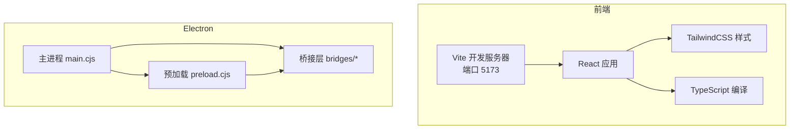
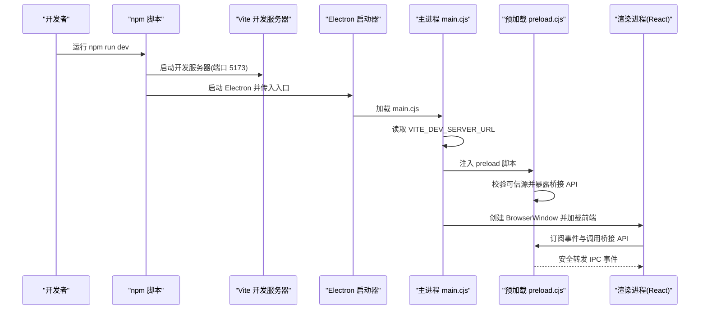
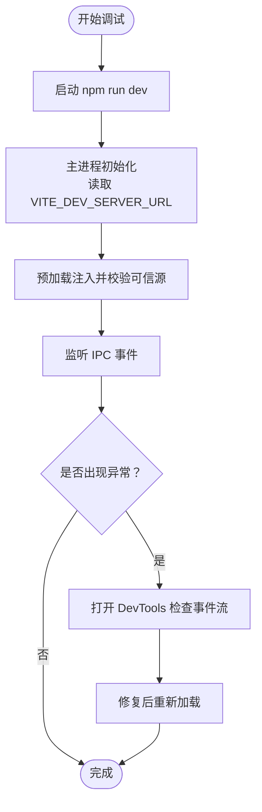
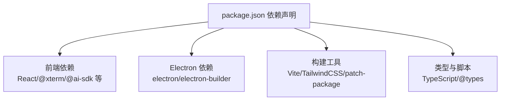

# 开发环境设置

<cite>
**本文档引用的文件**
- [package.json](file://package.json)
- [tsconfig.json](file://tsconfig.json)
- [vite.config.ts](file://vite.config.ts)
- [eslint.config.js](file://eslint.config.js)
- [electron-builder.config.cjs](file://electron-builder.config.cjs)
- [electron/.dev-config.json](file://electron/.dev-config.json)
- [electron/launch.cjs](file://electron/launch.cjs)
- [electron/main.cjs](file://electron/main.cjs)
- [electron/preload.cjs](file://electron/preload.cjs)
- [scripts/fetch-mosh-binaries.cjs](file://scripts/fetch-mosh-binaries.cjs)
- [scripts/resolve-mosh-bin-release.cjs](file://scripts/resolve-mosh-bin-release.cjs)
- [scripts/patch-xterm-webgl-atlas.cjs](file://scripts/patch-xterm-webgl-atlas.cjs)
- [README.md](file://README.md)
</cite>

## 目录
1. [简介](#简介)
2. [项目结构](#项目结构)
3. [核心组件](#核心组件)
4. [架构总览](#架构总览)
5. [详细组件分析](#详细组件分析)
6. [依赖关系分析](#依赖关系分析)
7. [性能考虑](#性能考虑)
8. [故障排除指南](#故障排除指南)
9. [结论](#结论)
10. [附录](#附录)

## 简介
本指南面向参与 Netcatty 开发的工程师，提供从零开始搭建开发环境的完整步骤与最佳实践。内容涵盖 Node.js 版本要求、依赖安装、环境变量配置、构建系统与开发工具链（Vite、TypeScript、ESLint）、调试配置（Electron 调试、IPC 通信调试、性能分析）、代码规范与提交规范、测试环境搭建、IDE 配置建议以及常见问题排查。

## 项目结构
Netcatty 是基于 Electron + React + Vite 的桌面应用，前端使用 TypeScript 和 TailwindCSS，后端桥接层通过 Electron 的主进程与渲染进程通信。项目采用模块化组织，核心目录包括：
- application：React 应用与状态管理、国际化资源
- components：UI 组件库
- domain：领域模型与业务逻辑
- infrastructure：基础设施服务与适配器
- electron：Electron 主进程、预加载脚本、桥接层与打包配置
- scripts：构建与打包辅助脚本
- public：静态资源与图标

图表来源
- [vite.config.ts:21-82](file://vite.config.ts#L21-L82)
- [electron/main.cjs:1-120](file://electron/main.cjs#L1-L120)
- [electron/preload.cjs:1-50](file://electron/preload.cjs#L1-L50)

章节来源
- [README.md:315-333](file://README.md#L315-L333)

## 核心组件
- 构建系统：Vite 7 作为开发服务器与打包工具，支持 ESNext 目标与 Rollup 分包策略
- 类型系统：TypeScript 5.9，启用 JSX 支持与严格路径别名
- 代码质量：ESLint + TypeScript ESLint 插件，配合 unused-imports 与 React Hooks 规则
- 打包分发：electron-builder，支持多平台产物（DMG、ZIP、NSIS、AppImage、DEB、RPM）
- 运行时：Electron 40，主进程负责窗口管理、协议注册、权限控制与桥接注册；预加载脚本负责安全暴露 API

章节来源
- [package.json:14-36](file://package.json#L14-L36)
- [tsconfig.json:1-36](file://tsconfig.json#L1-L36)
- [vite.config.ts:1-84](file://vite.config.ts#L1-L84)
- [eslint.config.js:1-199](file://eslint.config.js#L1-L199)
- [electron-builder.config.cjs:1-165](file://electron-builder.config.cjs#L1-L165)

## 架构总览
下图展示开发模式下的请求与数据流：Vite 启动前端开发服务器，Electron 主进程在启动时读取开发服务器地址，预加载脚本在可信源内暴露桥接 API，渲染进程通过 IPC 与主进程交互。

图表来源
- [package.json:14-23](file://package.json#L14-L23)
- [electron/.dev-config.json:1-1](file://electron/.dev-config.json#L1-L1)
- [electron/launch.cjs:1-18](file://electron/launch.cjs#L1-L18)
- [electron/main.cjs:169-184](file://electron/main.cjs#L169-L184)
- [electron/preload.cjs:659-707](file://electron/preload.cjs#L659-L707)

章节来源
- [README.md:280-314](file://README.md#L280-L314)

## 详细组件分析

### Node.js 与依赖安装
- Node.js 版本要求：根据 README 的“Prerequisites”，需要 Node.js 18+ 与 npm
- 安装步骤：
  1) 克隆仓库并进入目录
  2) 执行 npm install 安装依赖
  3) 若首次运行，会触发 postinstall 阶段自动执行 electron-builder install-app-deps、patch-package 与 xterm WebGL 图集隔离补丁
- 常见依赖要点：
  - Electron 主进程与桥接层使用 CommonJS（.cjs）
  - 前端使用 ES 模块（.ts/.tsx），由 Vite 管理
  - 通过 overrides 对部分依赖进行覆盖以兼容性优化

章节来源
- [README.md:297-314](file://README.md#L297-L314)
- [package.json:31-37](file://package.json#L31-L37)
- [scripts/patch-xterm-webgl-atlas.cjs:1-75](file://scripts/patch-xterm-webgl-atlas.cjs#L1-L75)

### 环境变量配置
- 开发服务器地址：VITE_DEV_SERVER_URL（用于 Electron 主进程识别前端开发服务器）
- 开发配置文件：electron/.dev-config.json 中默认指向本地 5173 端口
- 运行时开关：
  - NETCATTY_NO_SANDBOX=1 可临时禁用沙箱（仅调试场景）
- Mosh 客户端二进制：
  - MOSH_BIN_RELEASE：指定 mosh 客户端发布标签，未设置时脚本会跳过下载
  - MOSH_BIN_BASE_URL：自定义镜像或测试仓库
  - MOSH_BIN_ALLOW_UNVERIFIED：允许无 SHA256 校验的镜像（仅本地测试）

章节来源
- [electron/.dev-config.json:1-1](file://electron/.dev-config.json#L1-L1)
- [electron/main.cjs:131-136](file://electron/main.cjs#L131-L136)
- [scripts/fetch-mosh-binaries.cjs:15-33](file://scripts/fetch-mosh-binaries.cjs#L15-L33)

### 构建系统与开发工具链
- Vite 配置要点：
  - 服务器：端口 5173，启用 HMR，设置 COOP/COEP 头以支持 SharedArrayBuffer/WASM
  - 构建：目标 ESNext，禁用 SourceMap，手动拆分 vendor 包（Radix UI、xterm、AI 相关）
  - 插件：React、TailwindCSS、自定义抑制 Monaco SourceMap 警告插件
  - 别名：@ 指向项目根目录
- TypeScript 配置要点：
  - 目标 ES2022，启用装饰器与 defineForClassFields
  - 模块解析：bundler，允许 TS 扩展名导入
  - 路径映射：@/*
  - JSX：react-jsx
- ESLint 配置要点：
  - 使用 @typescript-eslint 解析器与插件
  - 禁用与 TS 冲突的基础规则，启用 no-explicit-any、unused-imports
  - 限制 window.netcatty 直接访问，禁止在组件中直接 import 基础设施层
  - 仅对 electron/bridges/**/*.cjs 启用 no-undef 校验

章节来源
- [vite.config.ts:1-84](file://vite.config.ts#L1-L84)
- [tsconfig.json:1-36](file://tsconfig.json#L1-L36)
- [eslint.config.js:1-199](file://eslint.config.js#L1-L199)

### 调试环境配置
- Electron 调试：
  - 使用 npm run dev 同时启动 Vite 与 Electron
  - 在主进程与渲染进程均可启用 DevTools（主进程已内置静音噪音日志）
  - 如需禁用沙箱，设置 NETCATTY_NO_SANDBOX=1
- IPC 通信调试：
  - 预加载脚本集中监听并转发大量 IPC 事件（数据流、传输进度、认证事件等）
  - 通过订阅对应事件 ID（如 netcatty:data、netcatty:transfer:*）定位问题
  - 预加载脚本仅在可信源（app://netcatty 或开发服务器）暴露桥接 API
- 性能分析：
  - Vite 构建目标 ESNext，利于 Wasm 与 SharedArrayBuffer
  - xterm WebGL 图集隔离补丁避免 split panes 渲染损坏
  - 构建阶段关闭 SourceMap 以减少调试开销

图表来源
- [package.json:14-23](file://package.json#L14-L23)
- [electron/main.cjs:169-184](file://electron/main.cjs#L169-L184)
- [electron/preload.cjs:659-707](file://electron/preload.cjs#L659-L707)

章节来源
- [electron/launch.cjs:1-18](file://electron/launch.cjs#L1-L18)
- [electron/preload.cjs:1-708](file://electron/preload.cjs#L1-L708)

### 代码规范与提交规范
- Git 工作流：
  - Fork 仓库 -> 新建特性分支 -> 提交变更 -> 推送到远程 -> 发起 Pull Request
- 代码风格：
  - ESLint 规则：禁用冲突基础规则，启用 no-explicit-any、unused-imports、React Hooks 规则
  - 组件层禁止直接导入基础设施层持久化与服务层，应通过应用状态钩子访问
  - 禁止直接访问 window.netcatty，统一通过 netcattyBridge 或应用状态后端
- 提交规范：
  - 遵循项目贡献流程，确保通过 ESLint 与测试检查

章节来源
- [README.md:370-382](file://README.md#L370-L382)
- [eslint.config.js:127-175](file://eslint.config.js#L127-L175)

### 测试环境搭建
- 单元测试与集成测试：
  - 使用 Node.js 内置测试框架（--test），通过 tsx 导入 .ts/.tsx 文件
  - 覆盖范围：electron/bridges 下的 .cjs 测试、application/state 下的状态测试、domain 与 infrastructure 层测试
- 端到端测试：
  - 项目未提供专用 E2E 框架配置；可结合现有 IPC 事件监听与桥接 API 进行行为验证
- 运行方式：
  - npm run test 执行所有测试文件

章节来源
- [package.json:36-36](file://package.json#L36-L36)

### IDE 配置建议与插件推荐
- VS Code 推荐扩展：
  - ESLint：实时语法与规则检查
  - Prettier：格式化（若启用）
  - Tailwind CSS IntelliSense：样式类智能提示
  - TypeScript Importer：自动导入
  - Bracket Pair Colorizer：括号匹配高亮
- 设置建议：
  - 将工作区根目录设为项目根，启用 ESLint 自动修复
  - 配置 TypeScript 项目为当前工作区，启用路径映射（@/*）
  - 在终端中使用 npm scripts 启动开发（dev、dev:electron）

章节来源
- [eslint.config.js:1-199](file://eslint.config.js#L1-L199)
- [tsconfig.json:23-28](file://tsconfig.json#L23-L28)

## 依赖关系分析
- 前端依赖：React 19、@xterm/*、@ai-sdk/*、Lucide React、Monaco Editor 等
- Electron 依赖：electron、electron-builder、electron-updater
- 构建与打包：Vite、TailwindCSS、patch-package、wait-on
- 语言与类型：TypeScript、@types/node、tsx

图表来源
- [package.json:38-111](file://package.json#L38-L111)

章节来源
- [package.json:1-120](file://package.json#L1-L120)

## 性能考虑
- 构建优化：
  - Vite 目标 ESNext，Rollup 手动分包 vendor 以提升缓存命中率
  - 关闭 SourceMap 减少调试开销
- 运行时优化：
  - xterm WebGL 图集隔离补丁避免 split panes 渲染损坏
  - GPU 开关：强制硬件加速，忽略 GPU 黑名单，启用零拷贝与 GPU 光栅化
- 网络与协议：
  - 主进程与预加载脚本均设置 COOP/COEP，支持 SharedArrayBuffer 与 WASM

章节来源
- [vite.config.ts:38-76](file://vite.config.ts#L38-L76)
- [scripts/patch-xterm-webgl-atlas.cjs:1-75](file://scripts/patch-xterm-webgl-atlas.cjs#L1-L75)
- [electron/main.cjs:131-139](file://electron/main.cjs#L131-L139)
- [electron/main.cjs:179-184](file://electron/main.cjs#L179-L184)

## 故障排除指南
- 无法启动开发环境
  - 确认 Node.js 版本满足 18+ 要求
  - 清理 node_modules 与 package-lock.json 后重装依赖
  - 检查端口 5173 是否被占用
- Electron 无法连接前端开发服务器
  - 确认 VITE_DEV_SERVER_URL 指向正确地址
  - 检查 .dev-config.json 与主进程读取逻辑
- Mosh 客户端缺失
  - 设置 MOSH_BIN_RELEASE 并运行脚本下载二进制
  - 若使用镜像，可设置 MOSH_BIN_ALLOW_UNVERIFIED=true（仅本地测试）
- xterm WebGL 渲染异常（split panes 花屏）
  - 确认已执行 postinstall 补丁脚本
  - 升级 @xterm/addon-webgl 后需更新补丁字符串
- 打包失败或平台特定错误
  - 检查 electron-builder 配置与平台资源
  - 确保 npmRebuild 与 node-pty ABI 适配

章节来源
- [README.md:297-314](file://README.md#L297-L314)
- [electron/.dev-config.json:1-1](file://electron/.dev-config.json#L1-L1)
- [electron/main.cjs:169-184](file://electron/main.cjs#L169-L184)
- [scripts/fetch-mosh-binaries.cjs:15-33](file://scripts/fetch-mosh-binaries.cjs#L15-L33)
- [scripts/patch-xterm-webgl-atlas.cjs:1-75](file://scripts/patch-xterm-webgl-atlas.cjs#L1-L75)
- [electron-builder.config.cjs:27-32](file://electron-builder.config.cjs#L27-L32)

## 结论
通过以上步骤，您可以快速搭建 Netcatty 的开发环境，并掌握构建系统、调试方法、代码规范与测试策略。建议在开发过程中持续关注 ESLint 规则与 TypeScript 类型约束，利用 Vite 的热更新与 Electron 的 IPC 事件体系进行高效迭代。

## 附录
- 打包命令参考：
  - 生产构建：npm run build
  - 当前平台打包：npm run pack
  - 指定平台打包：npm run pack:mac / pack:win / pack:linux
- 脚本用途速览：
  - fetch-mosh-binaries：下载 mosh 客户端二进制
  - resolve-mosh-bin-release：解析最新 mosh 发布标签
  - patch-xterm-webgl-atlas：隔离 WebGL 图集避免渲染损坏

章节来源
- [README.md:336-350](file://README.md#L336-L350)
- [scripts/fetch-mosh-binaries.cjs:1-465](file://scripts/fetch-mosh-binaries.cjs#L1-L465)
- [scripts/resolve-mosh-bin-release.cjs:1-187](file://scripts/resolve-mosh-bin-release.cjs#L1-L187)
- [scripts/patch-xterm-webgl-atlas.cjs:1-75](file://scripts/patch-xterm-webgl-atlas.cjs#L1-L75)