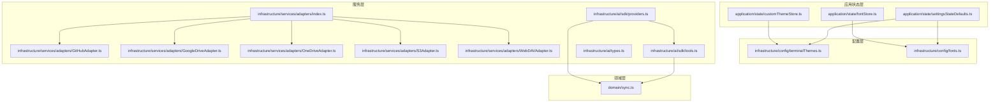
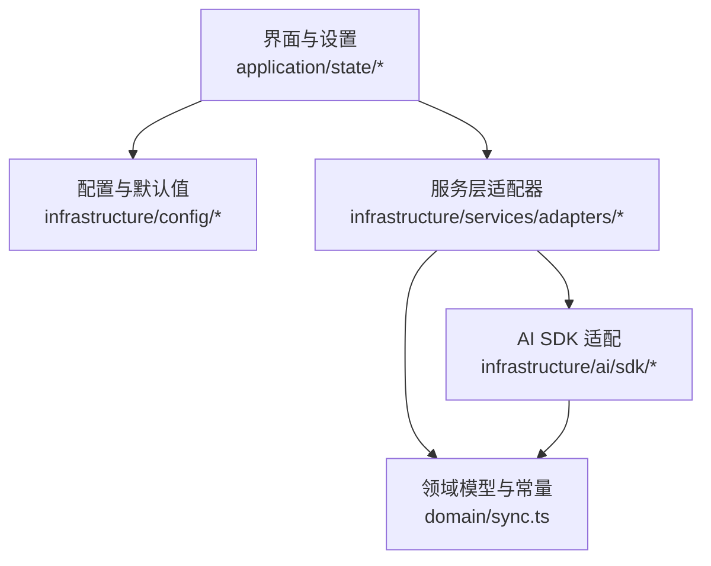
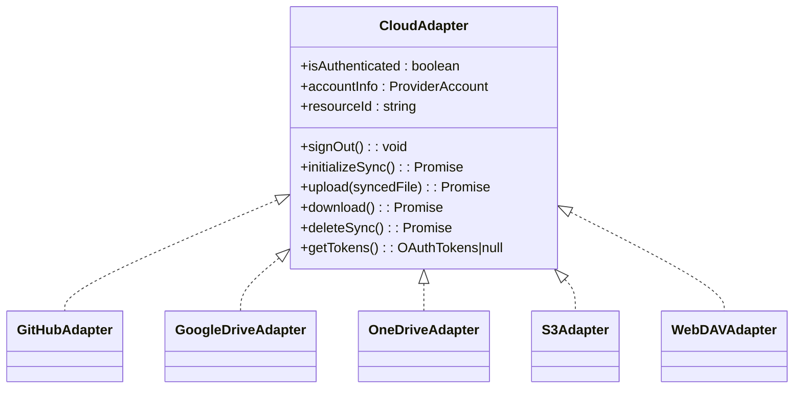
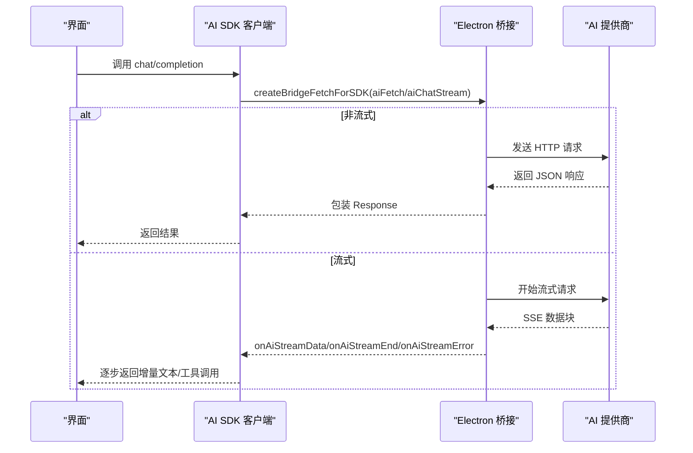
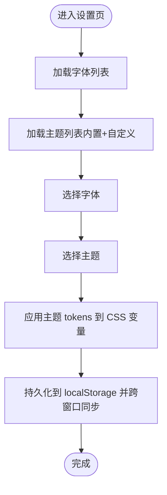
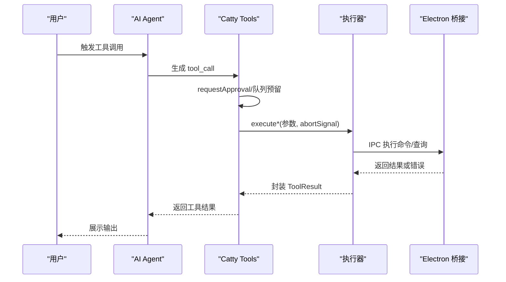
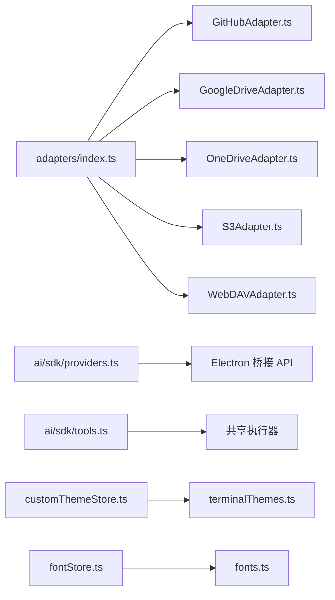

# 扩展开发

<cite>
**本文引用的文件**
- [application/state/customThemeStore.ts](file://application/state/customThemeStore.ts)
- [application/state/fontStore.ts](file://application/state/fontStore.ts)
- [infrastructure/services/adapters/index.ts](file://infrastructure/services/adapters/index.ts)
- [infrastructure/services/adapters/GitHubAdapter.ts](file://infrastructure/services/adapters/GitHubAdapter.ts)
- [infrastructure/services/adapters/GoogleDriveAdapter.ts](file://infrastructure/services/adapters/GoogleDriveAdapter.ts)
- [infrastructure/services/adapters/OneDriveAdapter.ts](file://infrastructure/services/adapters/OneDriveAdapter.ts)
- [infrastructure/services/adapters/S3Adapter.ts](file://infrastructure/services/adapters/S3Adapter.ts)
- [infrastructure/services/adapters/WebDAVAdapter.ts](file://infrastructure/services/adapters/WebDAVAdapter.ts)
- [infrastructure/ai/sdk/providers.ts](file://infrastructure/ai/sdk/providers.ts)
- [infrastructure/ai/sdk/tools.ts](file://infrastructure/ai/sdk/tools.ts)
- [infrastructure/ai/types.ts](file://infrastructure/ai/types.ts)
- [domain/sync.ts](file://domain/sync.ts)
- [infrastructure/config/terminalThemes.ts](file://infrastructure/config/terminalThemes.ts)
- [infrastructure/config/fonts.ts](file://infrastructure/config/fonts.ts)
- [application/state/settingsStateDefaults.ts](file://application/state/settingsStateDefaults.ts)
</cite>

## 目录
1. [简介](#简介)
2. [项目结构](#项目结构)
3. [核心组件](#核心组件)
4. [架构总览](#架构总览)
5. [详细组件分析](#详细组件分析)
6. [依赖分析](#依赖分析)
7. [性能考虑](#性能考虑)
8. [故障排查指南](#故障排查指南)
9. [结论](#结论)
10. [附录](#附录)

## 简介
本指南面向希望在 Netcatty 中进行扩展开发的工程师与高级用户，系统讲解如何：
- 开发与集成 AI 提供商插件（适配新模型/协议）
- 开发云存储适配器（接入新云厂商）
- 扩展主题与字体系统（自定义主题与字体）
- 集成脚本与外部工具（工具函数与权限控制）
- 搭建开发环境、调试技巧与测试方法
- 发布与分发插件与扩展

Netcatty 的扩展点主要集中在“状态层”“配置层”“服务层”“领域层”四个维度：通过统一的状态存储与持久化策略、可插拔的服务适配器、标准化的领域模型与类型约束，以及 Electron 主进程桥接，形成清晰的扩展边界。

## 项目结构
从扩展开发视角，以下目录与文件是关键：
- 应用状态层（React 状态与持久化）：application/state/*
- 配置层（主题、字体、UI 主题等）：infrastructure/config/*
- 服务层（云同步适配器、AI SDK 桥接）：infrastructure/services/*
- 领域层（类型与常量）：domain/*

图示来源
- [application/state/customThemeStore.ts:1-187](file://application/state/customThemeStore.ts#L1-L187)
- [application/state/fontStore.ts:1-161](file://application/state/fontStore.ts#L1-L161)
- [infrastructure/services/adapters/index.ts:1-64](file://infrastructure/services/adapters/index.ts#L1-L64)
- [infrastructure/services/adapters/GitHubAdapter.ts:1-698](file://infrastructure/services/adapters/GitHubAdapter.ts#L1-L698)
- [infrastructure/services/adapters/GoogleDriveAdapter.ts:1-658](file://infrastructure/services/adapters/GoogleDriveAdapter.ts#L1-L658)
- [infrastructure/services/adapters/OneDriveAdapter.ts:1-678](file://infrastructure/services/adapters/OneDriveAdapter.ts#L1-L678)
- [infrastructure/services/adapters/S3Adapter.ts:1-235](file://infrastructure/services/adapters/S3Adapter.ts#L1-L235)
- [infrastructure/services/adapters/WebDAVAdapter.ts:1-254](file://infrastructure/services/adapters/WebDAVAdapter.ts#L1-L254)
- [infrastructure/ai/sdk/providers.ts:1-478](file://infrastructure/ai/sdk/providers.ts#L1-L478)
- [infrastructure/ai/sdk/tools.ts:1-177](file://infrastructure/ai/sdk/tools.ts#L1-L177)
- [infrastructure/ai/types.ts:1-343](file://infrastructure/ai/types.ts#L1-L343)
- [domain/sync.ts:1-562](file://domain/sync.ts#L1-L562)

章节来源
- [application/state/customThemeStore.ts:1-187](file://application/state/customThemeStore.ts#L1-L187)
- [application/state/fontStore.ts:1-161](file://application/state/fontStore.ts#L1-L161)
- [infrastructure/services/adapters/index.ts:1-64](file://infrastructure/services/adapters/index.ts#L1-L64)
- [infrastructure/ai/sdk/providers.ts:1-478](file://infrastructure/ai/sdk/providers.ts#L1-L478)
- [infrastructure/ai/sdk/tools.ts:1-177](file://infrastructure/ai/sdk/tools.ts#L1-L177)
- [domain/sync.ts:1-562](file://domain/sync.ts#L1-L562)

## 核心组件
- 自定义主题存储（CustomThemeStore）：提供 React useSyncExternalStore 模式管理用户自定义终端主题，并与本地存储与跨窗口 IPC 同步。
- 字体存储（FontStore）：统一加载与缓存可用字体，合并内置与系统字体，暴露查询与懒加载能力。
- 云同步适配器（CloudAdapter 抽象与多实现）：统一 OAuth/凭据管理、初始化、上传/下载/删除、历史版本等接口，屏蔽不同云厂商差异。
- AI SDK 适配（providers.ts 与 tools.ts）：封装 Vercel AI SDK 的 fetch 适配、流式传输桥接、工具函数（terminal_execute、workspace_*、web_search、url_fetch）与权限门控。
- 领域模型与常量（domain/sync.ts、infrastructure/ai/types.ts）：定义云同步数据结构、加密参数、安全状态机、AI 提供商与工具类型等。

章节来源
- [application/state/customThemeStore.ts:22-141](file://application/state/customThemeStore.ts#L22-L141)
- [application/state/fontStore.ts:19-118](file://application/state/fontStore.ts#L19-L118)
- [infrastructure/services/adapters/index.ts:17-63](file://infrastructure/services/adapters/index.ts#L17-L63)
- [infrastructure/ai/sdk/providers.ts:247-477](file://infrastructure/ai/sdk/providers.ts#L247-L477)
- [infrastructure/ai/sdk/tools.ts:33-176](file://infrastructure/ai/sdk/tools.ts#L33-L176)
- [domain/sync.ts:18-508](file://domain/sync.ts#L18-L508)
- [infrastructure/ai/types.ts:23-343](file://infrastructure/ai/types.ts#L23-L343)

## 架构总览
Netcatty 的扩展架构以“状态层 + 配置层 + 服务层 + 领域层”四层协同：
- 状态层负责 UI 与设置的响应式状态与持久化（如主题、字体、设置项）。
- 配置层提供默认值、校验与主题/字体映射。
- 服务层通过适配器模式对接第三方服务（云存储、AI 提供商），并通过 Electron 桥接处理网络受限场景。
- 领域层定义数据结构、常量与业务规则（加密、冲突、权限模式等）。

图示来源
- [application/state/customThemeStore.ts:1-187](file://application/state/customThemeStore.ts#L1-L187)
- [application/state/fontStore.ts:1-161](file://application/state/fontStore.ts#L1-L161)
- [infrastructure/services/adapters/index.ts:1-64](file://infrastructure/services/adapters/index.ts#L1-L64)
- [infrastructure/ai/sdk/providers.ts:1-478](file://infrastructure/ai/sdk/providers.ts#L1-L478)
- [infrastructure/ai/sdk/tools.ts:1-177](file://infrastructure/ai/sdk/tools.ts#L1-L177)
- [domain/sync.ts:1-562](file://domain/sync.ts#L1-L562)

## 详细组件分析

### 组件一：云存储适配器扩展（接入新云提供商）
目标：新增一种云存储适配器，遵循统一接口，支持认证、初始化、上传/下载/删除、历史版本等。

- 统一接口与工厂
  - CloudAdapter 接口定义了认证状态、账户信息、资源标识、签名登出、初始化、上传/下载/删除、令牌读取等方法。
  - createAdapter 工厂根据 provider 类型动态导入并实例化具体适配器。
- 典型实现对比
  - GitHubAdapter：设备码授权（Device Flow）、Gist 存储、鉴权轮询、用户信息获取。
  - GoogleDriveAdapter：PKCE 授权、Loopback 回调、Drive API 操作、刷新令牌。
  - OneDriveAdapter：MSAL 风格 PKCE、Graph API 操作、重试与鉴权错误处理。
  - S3Adapter：AWS SDK 客户端、Head/Put/Get/Delete 对象、端点与路径规范。
  - WebDAVAdapter：webdav 客户端、多种认证方式（Basic/Digest/Token）、错误上下文包装。
- 开发步骤
  1) 在 adapters 目录新增适配器文件，实现 CloudAdapter 接口。
  2) 在 adapters/index.ts 中注册该适配器到 createAdapter 分支。
  3) 在 domain/sync.ts 中扩展 CloudProvider 类型与相关常量。
  4) 在 UI 设置页中增加该提供商的配置表单与图标。
  5) 在 Electron 桥接层补充必要的主进程 IPC 能力（如需要）。
  6) 编写单元测试与集成测试，覆盖认证、上传/下载、错误处理与重试逻辑。

图示来源
- [infrastructure/services/adapters/index.ts:17-63](file://infrastructure/services/adapters/index.ts#L17-L63)
- [infrastructure/services/adapters/GitHubAdapter.ts:522-698](file://infrastructure/services/adapters/GitHubAdapter.ts#L522-L698)
- [infrastructure/services/adapters/GoogleDriveAdapter.ts:483-658](file://infrastructure/services/adapters/GoogleDriveAdapter.ts#L483-L658)
- [infrastructure/services/adapters/OneDriveAdapter.ts:495-678](file://infrastructure/services/adapters/OneDriveAdapter.ts#L495-L678)
- [infrastructure/services/adapters/S3Adapter.ts:47-235](file://infrastructure/services/adapters/S3Adapter.ts#L47-L235)
- [infrastructure/services/adapters/WebDAVAdapter.ts:28-254](file://infrastructure/services/adapters/WebDAVAdapter.ts#L28-L254)

章节来源
- [infrastructure/services/adapters/index.ts:17-63](file://infrastructure/services/adapters/index.ts#L17-L63)
- [infrastructure/services/adapters/GitHubAdapter.ts:1-698](file://infrastructure/services/adapters/GitHubAdapter.ts#L1-L698)
- [infrastructure/services/adapters/GoogleDriveAdapter.ts:1-658](file://infrastructure/services/adapters/GoogleDriveAdapter.ts#L1-L658)
- [infrastructure/services/adapters/OneDriveAdapter.ts:1-678](file://infrastructure/services/adapters/OneDriveAdapter.ts#L1-L678)
- [infrastructure/services/adapters/S3Adapter.ts:1-235](file://infrastructure/services/adapters/S3Adapter.ts#L1-L235)
- [infrastructure/services/adapters/WebDAVAdapter.ts:1-254](file://infrastructure/services/adapters/WebDAVAdapter.ts#L1-L254)
- [domain/sync.ts:49-117](file://domain/sync.ts#L49-L117)

### 组件二：AI 提供商插件开发（集成新 AI 服务与工具调用）
目标：通过 providers.ts 与 tools.ts 扩展新的 AI 提供商与工具集，保持与现有权限门控、流式传输、工具队列一致的行为。

- 提供商适配
  - createBridgeFetchForSDK：将 Vercel AI SDK 的 fetch 请求路由到 Electron IPC，避免 CORS；支持非流式与流式两种路径。
  - createModelFromConfig：根据 ProviderConfig 与 ProviderStyle 创建对应 SDK 客户端（OpenAI/Anthropic/Google），并注入自定义 fetch。
  - resolveProviderEndpoint：对特定提供商（如 Ollama/OpenRouter）做 URL 与密钥兼容处理。
- 工具函数
  - createCattyTools：封装 terminal_execute、workspace_get_info、workspace_get_session_info、web_search、url_fetch 等工具，统一执行前的权限审批、会话槽位排队、取消信号处理。
  - 工具执行器与审批门控：requestApproval、reserveSessionSlot、execute* 系列函数保证并发有序与安全。
- 开发步骤
  1) 在 infrastructure/ai/types.ts 中完善 ProviderConfig 与 ProviderStyle 的类型约束。
  2) 在 providers.ts 中扩展 createModelFromConfig 与 resolveProviderEndpoint，以支持新提供商的端点与鉴权。
  3) 在 tools.ts 中按需新增工具定义与执行器，确保输入参数使用 zod 校验、输出结果统一封装。
  4) 在 UI 设置页中增加提供商配置入口与图标。
  5) 编写单元测试与端到端测试，覆盖流式传输、工具调用、权限模式与错误处理。

图示来源
- [infrastructure/ai/sdk/providers.ts:247-477](file://infrastructure/ai/sdk/providers.ts#L247-L477)
- [infrastructure/ai/sdk/tools.ts:33-176](file://infrastructure/ai/sdk/tools.ts#L33-L176)

章节来源
- [infrastructure/ai/sdk/providers.ts:1-478](file://infrastructure/ai/sdk/providers.ts#L1-L478)
- [infrastructure/ai/sdk/tools.ts:1-177](file://infrastructure/ai/sdk/tools.ts#L1-L177)
- [infrastructure/ai/types.ts:1-343](file://infrastructure/ai/types.ts#L1-L343)

### 组件三：主题系统扩展（自定义主题与字体）
目标：在现有主题与字体体系上，支持用户自定义主题与字体选择。

- 自定义主题存储（CustomThemeStore）
  - 使用 useSyncExternalStore 模式，维护用户自定义主题列表，合并内置主题，持久化到 localStorage，并通过 IPC 同步跨窗口变更。
  - 提供 add/update/delete/replace 等操作与稳定快照缓存，避免渲染抖动。
- 字体存储（FontStore）
  - 初始化时并行加载系统与内置字体，去重后暴露可用字体集合；提供按 ID 查询与懒加载能力。
- 配置与默认值（settingsStateDefaults）
  - 提供主题/字体/语言等默认值解析与校验，应用主题 tokens 到根节点 CSS 变量，联动原生窗口标题栏。
- 开发步骤
  1) 在 UI 中添加“自定义主题编辑器”，调用 CustomThemeStore 的增删改接口。
  2) 在设置页中展示“所有主题（内置+自定义）”，支持切换与预览。
  3) 在字体选择器中结合 FontStore 与 UI 字体列表，提供字体预览与应用。
  4) 在 settingsStateDefaults 中扩展主题 tokens 应用逻辑，确保暗色/亮色与自定义强调色正确生效。

图示来源
- [application/state/customThemeStore.ts:22-141](file://application/state/customThemeStore.ts#L22-L141)
- [application/state/fontStore.ts:19-118](file://application/state/fontStore.ts#L19-L118)
- [application/state/settingsStateDefaults.ts:115-157](file://application/state/settingsStateDefaults.ts#L115-L157)
- [infrastructure/config/terminalThemes.ts:28-43](file://infrastructure/config/terminalThemes.ts#L28-L43)
- [infrastructure/config/fonts.ts:10-103](file://infrastructure/config/fonts.ts#L10-L103)

章节来源
- [application/state/customThemeStore.ts:1-187](file://application/state/customThemeStore.ts#L1-L187)
- [application/state/fontStore.ts:1-161](file://application/state/fontStore.ts#L1-L161)
- [application/state/settingsStateDefaults.ts:1-159](file://application/state/settingsStateDefaults.ts#L1-L159)
- [infrastructure/config/terminalThemes.ts:1-43](file://infrastructure/config/terminalThemes.ts#L1-L43)
- [infrastructure/config/fonts.ts:1-103](file://infrastructure/config/fonts.ts#L1-L103)

### 组件四：脚本与外部工具集成
目标：在 AI 工具链中安全地集成脚本与外部工具，支持命令执行、工作区信息获取、网页搜索与 URL 抓取。

- 工具定义与执行
  - terminal_execute：在指定会话中执行命令，支持审批门控、并发队列、取消信号与超时控制。
  - workspace_get_info / workspace_get_session_info：获取当前工作区与会话信息。
  - web_search：基于配置的搜索引擎提供商进行检索。
  - url_fetch：抓取 HTTPS URL 内容并限制最大长度。
- 权限与安全
  - AIPermissionMode：observer/confirm/autonomous 三种模式，配合 requestApproval 与命令黑名单（commandBlocklist）。
  - 会话级执行队列：reserveSessionSlot 保证工具调用顺序与串行化。
- 开发步骤
  1) 在 tools.ts 中新增工具定义，使用 zod 校验输入参数。
  2) 实现工具执行器，调用共享的 execute* 函数，处理错误与超时。
  3) 在 UI 中启用/禁用工具开关，配置 web_search 参数。
  4) 在 settings 中配置命令黑名单与超时时间，确保安全可控。

图示来源
- [infrastructure/ai/sdk/tools.ts:33-176](file://infrastructure/ai/sdk/tools.ts#L33-L176)

章节来源
- [infrastructure/ai/sdk/tools.ts:1-177](file://infrastructure/ai/sdk/tools.ts#L1-L177)
- [infrastructure/ai/types.ts:178-294](file://infrastructure/ai/types.ts#L178-L294)

## 依赖分析
- 适配器耦合关系
  - CloudAdapter 是统一抽象，各云适配器实现仅依赖 domain/sync.ts 中的类型与常量。
  - createAdapter 工厂集中管理分支，新增适配器只需在分支中注册。
- AI 适配器依赖
  - providers.ts 依赖 Electron 桥接 API（aiFetch/aiChatStream 等）与 Vercel AI SDK。
  - tools.ts 依赖共享工具执行器与审批门控，统一行为。
- 配置与状态依赖
  - CustomThemeStore 与 FontStore 依赖基础设施配置（主题/字体列表）与本地存储。
  - settingsStateDefaults 依赖 UI 主题与字体列表，应用 tokens 到根节点。

图示来源
- [infrastructure/services/adapters/index.ts:1-64](file://infrastructure/services/adapters/index.ts#L1-L64)
- [infrastructure/services/adapters/GitHubAdapter.ts:1-698](file://infrastructure/services/adapters/GitHubAdapter.ts#L1-L698)
- [infrastructure/services/adapters/GoogleDriveAdapter.ts:1-658](file://infrastructure/services/adapters/GoogleDriveAdapter.ts#L1-L658)
- [infrastructure/services/adapters/OneDriveAdapter.ts:1-678](file://infrastructure/services/adapters/OneDriveAdapter.ts#L1-L678)
- [infrastructure/services/adapters/S3Adapter.ts:1-235](file://infrastructure/services/adapters/S3Adapter.ts#L1-L235)
- [infrastructure/services/adapters/WebDAVAdapter.ts:1-254](file://infrastructure/services/adapters/WebDAVAdapter.ts#L1-L254)
- [infrastructure/ai/sdk/providers.ts:1-478](file://infrastructure/ai/sdk/providers.ts#L1-L478)
- [infrastructure/ai/sdk/tools.ts:1-177](file://infrastructure/ai/sdk/tools.ts#L1-L177)
- [application/state/customThemeStore.ts:1-187](file://application/state/customThemeStore.ts#L1-L187)
- [application/state/fontStore.ts:1-161](file://application/state/fontStore.ts#L1-L161)
- [infrastructure/config/terminalThemes.ts:1-43](file://infrastructure/config/terminalThemes.ts#L1-L43)
- [infrastructure/config/fonts.ts:1-103](file://infrastructure/config/fonts.ts#L1-L103)

章节来源
- [infrastructure/services/adapters/index.ts:1-64](file://infrastructure/services/adapters/index.ts#L1-L64)
- [infrastructure/ai/sdk/providers.ts:1-478](file://infrastructure/ai/sdk/providers.ts#L1-L478)
- [infrastructure/ai/sdk/tools.ts:1-177](file://infrastructure/ai/sdk/tools.ts#L1-L177)
- [application/state/customThemeStore.ts:1-187](file://application/state/customThemeStore.ts#L1-L187)
- [application/state/fontStore.ts:1-161](file://application/state/fontStore.ts#L1-L161)

## 性能考虑
- 字体加载
  - FontStore 并行加载系统与内置字体，去重后缓存，避免重复渲染与抖动。
- 流式传输
  - providers.ts 中的流式路径通过 SSE 包装与 TextEncoder，尽量减少额外拷贝与内存占用。
- 会话执行队列
  - tools.ts 中的 reserveSessionSlot 保证工具调用串行化，降低并发竞争与资源争用。
- 云同步
  - 适配器实现中采用最小必要网络往返与错误快速失败策略，减少无效重试。

## 故障排查指南
- 云同步适配器
  - 认证失败：检查客户端 ID/密钥、回调地址、scope 与 PKCE/设备码流程是否正确。
  - API 错误：查看 buildWebdavError 或各适配器中的错误上下文，定位状态码、URL、方法与原因。
  - OneDrive 404 延迟一致性：利用 retryOnNotFound 处理短暂不可见问题。
- AI SDK 适配器
  - 流式传输中断：确认 onAiStreamData/onAiStreamEnd/onAiStreamError 是否正确订阅与清理。
  - 工具调用被拒：检查 AIPermissionMode 与命令黑名单，确认审批弹窗是否被忽略。
- 主题与字体
  - 主题不生效：确认 CSS 变量是否正确写入根节点，以及是否被沉浸模式样式覆盖。
  - 字体未显示：检查 FontStore 初始化状态与 isLoaded/isLoading 标志。

章节来源
- [infrastructure/services/adapters/WebDAVAdapter.ts:184-234](file://infrastructure/services/adapters/WebDAVAdapter.ts#L184-L234)
- [infrastructure/services/adapters/OneDriveAdapter.ts:322-334](file://infrastructure/services/adapters/OneDriveAdapter.ts#L322-L334)
- [infrastructure/ai/sdk/providers.ts:290-398](file://infrastructure/ai/sdk/providers.ts#L290-L398)
- [infrastructure/ai/sdk/tools.ts:53-114](file://infrastructure/ai/sdk/tools.ts#L53-L114)
- [application/state/settingsStateDefaults.ts:115-157](file://application/state/settingsStateDefaults.ts#L115-L157)
- [application/state/fontStore.ts:55-106](file://application/state/fontStore.ts#L55-L106)

## 结论
Netcatty 的扩展开发围绕“统一抽象 + 可插拔实现 + 安全可控”的设计展开。通过 CloudAdapter、AI SDK 适配器与主题/字体系统，开发者可以以较低成本接入新云提供商、新 AI 服务与新外观体验。建议在新增扩展时严格遵循类型约束、错误处理与权限门控，确保用户体验与安全性。

## 附录
- 开发环境设置
  - 安装依赖：使用包管理器安装项目依赖。
  - 运行应用：启动 Electron 主进程与前端开发服务器。
  - 调试技巧：利用浏览器开发者工具检查网络请求与流式事件；在主进程日志中定位桥接问题。
- 测试方法
  - 单元测试：针对适配器与工具函数编写独立测试，覆盖正常路径与异常路径。
  - 集成测试：模拟真实认证流程与云同步场景，验证端到端行为。
- 发布与分发
  - 云适配器：在 adapters/index.ts 注册后，更新 UI 设置页与图标资源，打包 Electron 应用。
  - AI 插件：在 providers.ts 与 tools.ts 中扩展后，完善设置页与权限配置，进行回归测试。
  - 主题与字体：确保主题 tokens 与字体列表正确加载，提供默认值迁移逻辑。