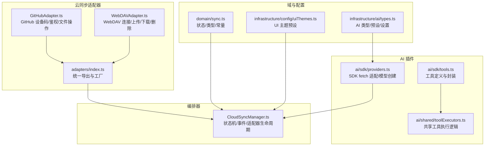
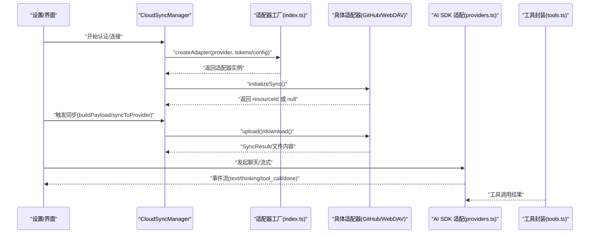
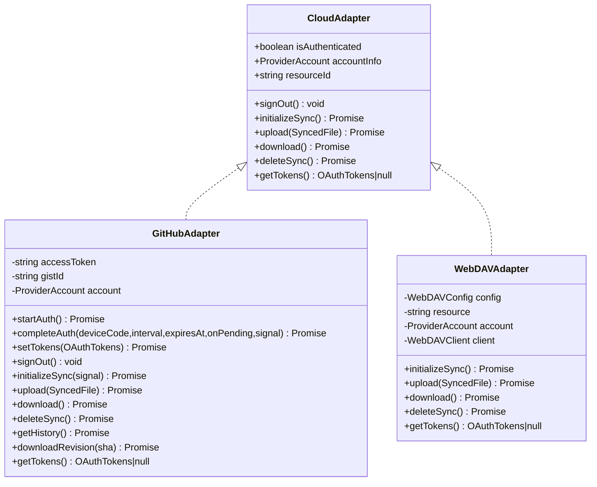
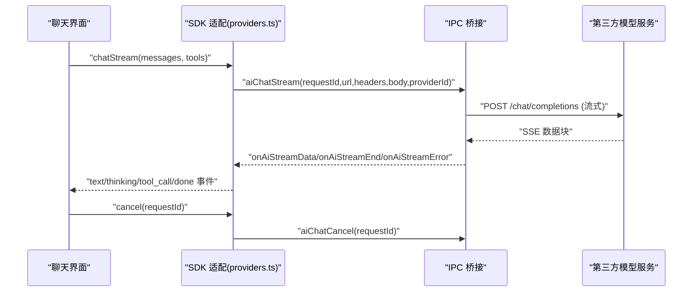
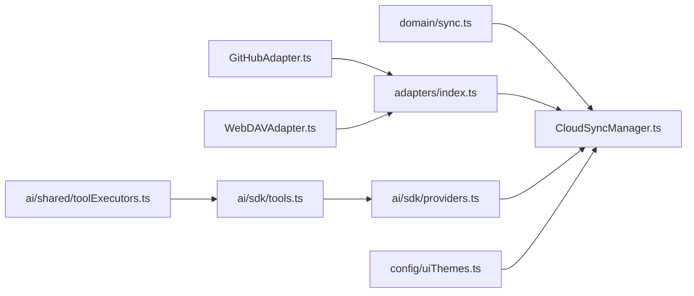

# 插件开发

<cite>
**本文引用的文件**
- [index.ts](file://infrastructure/services/adapters/index.ts)
- [CloudSyncManager.ts](file://infrastructure/services/CloudSyncManager.ts)
- [GitHubAdapter.ts](file://infrastructure/services/adapters/GitHubAdapter.ts)
- [WebDAVAdapter.ts](file://infrastructure/services/adapters/WebDAVAdapter.ts)
- [sync.ts](file://domain/sync.ts)
- [providers.ts](file://infrastructure/ai/sdk/providers.ts)
- [tools.ts](file://infrastructure/ai/sdk/tools.ts)
- [types.ts](file://infrastructure/ai/types.ts)
- [toolExecutors.ts](file://infrastructure/ai/shared/toolExecutors.ts)
- [uiThemes.ts](file://infrastructure/config/uiThemes.ts)
</cite>

## 目录
1. [简介](#简介)
2. [项目结构](#项目结构)
3. [核心组件](#核心组件)
4. [架构总览](#架构总览)
5. [详细组件分析](#详细组件分析)
6. [依赖关系分析](#依赖关系分析)
7. [性能考量](#性能考量)
8. [故障排查指南](#故障排查指南)
9. [结论](#结论)
10. [附录](#附录)

## 简介
本指南面向希望在 Netcatty 中扩展能力的开发者，系统讲解三类“插件”或适配层的开发方法：
- AI 提供商插件：对接不同大模型服务（OpenAI、Anthropic、Google、Ollama、OpenRouter 等），统一请求路由、流式传输、认证与错误处理。
- 云存储适配器插件：对接多云/自建存储（GitHub Gist、Google Drive、OneDrive、WebDAV、S3 兼容），统一上传/下载/删除/鉴权流程。
- 主题插件：基于 UI 主题预设扩展界面风格，提供明暗主题集合与可定制令牌映射。

文档覆盖接口规范、生命周期管理、注册机制、配置与动态加载、错误处理、性能优化与安全注意事项，并提供调试与测试建议。

## 项目结构
Netcatty 将插件化能力分布在以下层次：
- 域模型与常量：定义云同步状态机、加密结构、事件类型等（domain/sync.ts）。
- 云同步适配器：抽象统一接口并按提供商实现（infrastructure/services/adapters/）。
- 云同步编排器：集中管理安全态、同步态、适配器实例与事件分发（infrastructure/services/CloudSyncManager.ts）。
- AI SDK 与工具：封装 Vercel AI SDK 的 fetch 适配、模型创建、工具定义与执行（infrastructure/ai/sdk/ 与 infrastructure/ai/shared/）。
- 配置与主题：AI 提供商预设、Web 搜索配置、UI 主题集合（infrastructure/ai/types.ts、infrastructure/config/uiThemes.ts）。

图表来源
- [sync.ts:18-508](file://domain/sync.ts#L18-L508)
- [index.ts:17-63](file://infrastructure/services/adapters/index.ts#L17-L63)
- [CloudSyncManager.ts:166-800](file://infrastructure/services/CloudSyncManager.ts#L166-L800)
- [GitHubAdapter.ts:27-698](file://infrastructure/services/adapters/GitHubAdapter.ts#L27-L698)
- [WebDAVAdapter.ts:28-254](file://infrastructure/services/adapters/WebDAVAdapter.ts#L28-L254)
- [providers.ts:47-477](file://infrastructure/ai/sdk/providers.ts#L47-L477)
- [tools.ts:33-176](file://infrastructure/ai/sdk/tools.ts#L33-L176)
- [toolExecutors.ts:28-240](file://infrastructure/ai/shared/toolExecutors.ts#L28-L240)
- [uiThemes.ts:23-390](file://infrastructure/config/uiThemes.ts#L23-L390)

章节来源
- [sync.ts:18-508](file://domain/sync.ts#L18-L508)
- [index.ts:17-63](file://infrastructure/services/adapters/index.ts#L17-L63)
- [CloudSyncManager.ts:166-800](file://infrastructure/services/CloudSyncManager.ts#L166-L800)
- [GitHubAdapter.ts:27-698](file://infrastructure/services/adapters/GitHubAdapter.ts#L27-L698)
- [WebDAVAdapter.ts:28-254](file://infrastructure/services/adapters/WebDAVAdapter.ts#L28-L254)
- [providers.ts:47-477](file://infrastructure/ai/sdk/providers.ts#L47-L477)
- [tools.ts:33-176](file://infrastructure/ai/sdk/tools.ts#L33-L176)
- [toolExecutors.ts:28-240](file://infrastructure/ai/shared/toolExecutors.ts#L28-L240)
- [uiThemes.ts:23-390](file://infrastructure/config/uiThemes.ts#L23-L390)

## 核心组件
- 云存储适配器统一接口：所有适配器需实现认证状态、账户信息、资源标识、登出、初始化同步、上传、下载、删除、获取令牌等方法。
- 云同步编排器：维护全局安全态（未设密钥/已锁定/已解锁）、同步态（空闲/同步中/冲突/阻塞/错误），并以 Provider 为键管理适配器实例与事件订阅。
- AI SDK 适配：通过桥接 fetch 实现跨进程请求，支持流式与非流式，自动注入占位 API Key 并由主进程替换真实密钥；根据 ProviderStyle 选择对应 SDK 客户端。
- 工具执行：统一的工具执行器封装命令安全检查、会话范围校验、权限模式控制、网络设备/串口特殊处理、Web 搜索与 URL 抓取等。
- UI 主题：提供明/暗主题预设集合，支持按 ID 获取主题，便于主题插件扩展。

章节来源
- [index.ts:17-28](file://infrastructure/services/adapters/index.ts#L17-L28)
- [CloudSyncManager.ts:116-150](file://infrastructure/services/CloudSyncManager.ts#L116-L150)
- [providers.ts:247-477](file://infrastructure/ai/sdk/providers.ts#L247-L477)
- [toolExecutors.ts:66-240](file://infrastructure/ai/shared/toolExecutors.ts#L66-L240)
- [uiThemes.ts:23-390](file://infrastructure/config/uiThemes.ts#L23-L390)

## 架构总览
下图展示云同步与 AI 插件的关键交互路径：编排器负责生命周期与事件，适配器负责具体提供商操作，SDK 适配器负责请求路由与流式处理。

图表来源
- [CloudSyncManager.ts:327-721](file://infrastructure/services/CloudSyncManager.ts#L327-L721)
- [index.ts:33-63](file://infrastructure/services/adapters/index.ts#L33-L63)
- [GitHubAdapter.ts:522-698](file://infrastructure/services/adapters/GitHubAdapter.ts#L522-L698)
- [WebDAVAdapter.ts:28-254](file://infrastructure/services/adapters/WebDAVAdapter.ts#L28-L254)
- [providers.ts:247-477](file://infrastructure/ai/sdk/providers.ts#L247-L477)
- [tools.ts:33-176](file://infrastructure/ai/sdk/tools.ts#L33-L176)

## 详细组件分析

### 云存储适配器插件开发指南
- 接口规范
  - 必须实现：isAuthenticated、accountInfo、resourceId、signOut、initializeSync、upload、download、deleteSync、getTokens。
  - 初始化与资源定位：initializeSync 应发现或创建云端资源并返回 resourceId；upload/download/deleteSync 使用该标识进行读写。
  - 认证与令牌：getTokens 返回 OAuth 令牌（如适用）；对于无令牌的配置型适配器（如 WebDAV），返回 null。
- 生命周期管理
  - 创建：通过工厂函数 createAdapter(provider, tokens?, resourceId?, config?) 动态导入并实例化。
  - 连接：initializeSync 成功后，适配器进入已连接状态；失败抛出异常并记录错误。
  - 同步：upload/download 在编排器中被调用；若需要历史版本，可扩展 getHistory/downloadRevision。
  - 断开：signOut 清空令牌与资源标识；deleteSync 可选地清理云端数据。
- 注册机制
  - 在适配器工厂中新增分支，映射新提供商到具体类；确保默认分支抛出“未知提供商”错误。
- 错误处理
  - 统一捕获网络/鉴权/超时等错误，构造带上下文的错误对象（含状态码、URL、方法等），便于 UI 展示与日志追踪。
- 配置管理
  - GitHub：使用设备码授权（无需客户端密钥），轮询令牌，用户在浏览器完成授权。
  - WebDAV：支持 Basic/Digest/Token 三种认证方式，自动补全协议前缀与路径斜杠，支持不安全证书。
  - S3：需提供端点、区域、桶名、凭据与可选前缀/路径样式。
- 性能与安全
  - 上传/下载采用覆盖写入，避免重复写入；对大文件可结合压缩上传策略。
  - 对于第三方 API，遵循速率限制与重试退避；对私有端点启用 TLS 校验，谨慎开启跳过校验选项。
- 调试与测试
  - 使用编排器提供的事件回调监听同步进度与错误；对适配器方法添加单元测试，覆盖成功/失败/取消场景。

图表来源
- [index.ts:17-28](file://infrastructure/services/adapters/index.ts#L17-L28)
- [GitHubAdapter.ts:522-698](file://infrastructure/services/adapters/GitHubAdapter.ts#L522-L698)
- [WebDAVAdapter.ts:28-254](file://infrastructure/services/adapters/WebDAVAdapter.ts#L28-L254)

章节来源
- [index.ts:17-63](file://infrastructure/services/adapters/index.ts#L17-L63)
- [GitHubAdapter.ts:522-698](file://infrastructure/services/adapters/GitHubAdapter.ts#L522-L698)
- [WebDAVAdapter.ts:28-254](file://infrastructure/services/adapters/WebDAVAdapter.ts#L28-L254)
- [CloudSyncManager.ts:327-721](file://infrastructure/services/CloudSyncManager.ts#L327-L721)

### AI 提供商插件开发指南
- 接口与模型创建
  - 使用 createBridgeFetchForSDK 包装 fetch，支持流式与非流式；在流式场景下，将服务器事件包装为 SSE，注入工具调用规范化与字段捕获。
  - 使用 createModelFromConfig 根据 ProviderConfig 与 ProviderStyle 创建对应 SDK 客户端（OpenAI/Anthropic/Google），自动注入占位 API Key，由主进程替换真实密钥。
  - 支持自定义 baseURL 与模型发现端点；对特定提供商（如 Ollama/OpenRouter）做 URL/密钥兼容处理。
- 工具定义与执行
  - 通过 createCattyTools 定义工具：终端执行、工作区信息、会话信息、Web 搜索、URL 抓取。
  - 执行器封装：统一的安全检查、会话范围校验、权限模式（观察者/确认/自主）、网络设备/串口特殊处理、Web 搜索与 URL 抓取。
  - 工具调用结果统一为 { ok: true, data } 或 { ok: false, error }，便于 SDK 正确解析。
- 认证与错误处理
  - 占位 API Key：SDK 使用占位符构建认证头，主进程在发送前替换为真实密钥，避免渲染进程直接持有明文。
  - 错误分类：网络/鉴权/超时/提供商/代理/未知，区分是否可重试，用于 UI 与重试策略。
- 请求/响应格式
  - 流式：SSE 数据块，SDK 解析 choices/tool_calls 等字段；工具调用规范化确保 id 一致性。
  - 非流式：JSON 响应体，包含错误消息时返回标准 OpenAI 风格错误结构以便 SDK 处理。
- 生命周期与注册
  - 编排：在 AI 会话中，先解析 ProviderStyle 与 Endpoint，再创建模型实例；工具按需启用（如 Web 搜索需配置）。
  - 动态加载：SDK 适配器通过工厂函数按提供商动态导入，避免不必要的依赖。
- 最佳实践
  - 参数校验：温度、采样参数、最大令牌数等应在调用前校验。
  - 超时与取消：为长请求设置合理超时与 AbortSignal，确保及时释放资源。
  - 日志与可观测性：记录关键事件（文本增量、思考块、工具调用、结束/错误）与耗时指标。

图表来源
- [providers.ts:247-477](file://infrastructure/ai/sdk/providers.ts#L247-L477)
- [tools.ts:33-176](file://infrastructure/ai/sdk/tools.ts#L33-L176)
- [toolExecutors.ts:66-240](file://infrastructure/ai/shared/toolExecutors.ts#L66-L240)

章节来源
- [providers.ts:47-477](file://infrastructure/ai/sdk/providers.ts#L47-L477)
- [tools.ts:33-176](file://infrastructure/ai/sdk/tools.ts#L33-L176)
- [toolExecutors.ts:28-240](file://infrastructure/ai/shared/toolExecutors.ts#L28-L240)
- [types.ts:23-343](file://infrastructure/ai/types.ts#L23-L343)

### 主题插件开发指南
- 接口与规范
  - UI 主题预设：提供明/暗主题列表，每项包含 id、name、tokens（背景/前景/卡片/弹出/主色/次色/强调/破坏/边框/输入/环等）。
  - 获取主题：按主题类型与 id 查找预设，找不到回退到默认项。
- 扩展方式
  - 新增主题：在现有列表中添加新条目，确保 tokens 字段完整；或在运行时动态注入新主题集合。
  - 自定义令牌：允许用户自定义主色、强调色与字体，结合内置主题生成器实现。
- 生命周期
  - 加载：应用启动时加载默认主题集合；用户可在设置中切换。
  - 应用：根据系统/用户偏好与当前主题 id 更新 UI。
  - 卸载：移除自定义主题不影响内置主题集合。
- 最佳实践
  - 保持语义化命名与一致的色彩空间；为高对比度场景预留备用色。
  - 提供预览与一键恢复默认的能力。

章节来源
- [uiThemes.ts:23-390](file://infrastructure/config/uiThemes.ts#L23-L390)

## 依赖关系分析
- 云同步适配器依赖
  - domain/sync.ts：提供状态机、类型、常量与存储键。
  - CloudSyncManager.ts：集中管理适配器生命周期、事件与状态快照。
  - 适配器实现：GitHubAdapter/WebDAVAdapter 等。
- AI 插件依赖
  - ai/sdk/providers.ts：SDK fetch 适配与模型创建。
  - ai/sdk/tools.ts：工具定义与封装。
  - ai/shared/toolExecutors.ts：共享工具执行逻辑。
  - ai/types.ts：AI 配置、模型与工具类型。
- 主题依赖
  - config/uiThemes.ts：主题预设与获取逻辑。

图表来源
- [sync.ts:18-508](file://domain/sync.ts#L18-L508)
- [CloudSyncManager.ts:166-800](file://infrastructure/services/CloudSyncManager.ts#L166-L800)
- [index.ts:17-63](file://infrastructure/services/adapters/index.ts#L17-L63)
- [GitHubAdapter.ts:522-698](file://infrastructure/services/adapters/GitHubAdapter.ts#L522-L698)
- [WebDAVAdapter.ts:28-254](file://infrastructure/services/adapters/WebDAVAdapter.ts#L28-L254)
- [providers.ts:247-477](file://infrastructure/ai/sdk/providers.ts#L247-L477)
- [tools.ts:33-176](file://infrastructure/ai/sdk/tools.ts#L33-L176)
- [toolExecutors.ts:28-240](file://infrastructure/ai/shared/toolExecutors.ts#L28-L240)
- [uiThemes.ts:23-390](file://infrastructure/config/uiThemes.ts#L23-L390)

章节来源
- [sync.ts:18-508](file://domain/sync.ts#L18-L508)
- [CloudSyncManager.ts:166-800](file://infrastructure/services/CloudSyncManager.ts#L166-L800)
- [index.ts:17-63](file://infrastructure/services/adapters/index.ts#L17-L63)

## 性能考量
- 云同步
  - 合并写入顺序：先保存同步基线再推进锚点，避免崩溃窗口导致的不一致。
  - 冲突检测：严格区分检查错误与冲突，失败时抛出而非返回假阳性。
  - 自动同步：设置合理的间隔与节流，避免频繁轮询造成带宽与成本压力。
- AI 插件
  - 流式传输：最小化事件拼接与字符串转换，使用 TextEncoder/ReadableStream 降低内存占用。
  - 工具并发：为每个会话保留执行槽位，保证工具调用顺序与串行化，避免竞态。
  - 超时与取消：为长请求设置超时与 AbortSignal，及时中断无响应的请求。
- 主题
  - 预设缓存：主题切换时复用已计算的 CSS 变量，减少重绘。
  - 字体与图标：优先使用系统字体与矢量图标，降低资源体积。

[本节为通用指导，无需列出章节来源]

## 故障排查指南
- 云同步
  - 认证失败：检查设备码授权流程、轮询间隔与过期时间；对慢请求增加等待时间。
  - 权限问题：确认 GitHub/GitLab/OneDrive 的作用域与令牌有效期；WebDAV 端点与认证方式正确。
  - 冲突与阻塞：查看收缩检测告警与历史版本；必要时强制推送或恢复远程版本。
- AI 插件
  - 流式断流：检查 SSE 事件完整性与规范化处理；确保 onAiStreamData/onAiStreamEnd/onAiStreamError 回调正确绑定。
  - 工具执行失败：核对会话范围、权限模式与命令黑名单；网络设备 CLI 不返回退出码时需特殊处理。
  - 错误分类：区分网络/鉴权/超时/提供商/代理/未知，按类型采取重试或提示。
- 主题
  - 切换无效：确认主题 id 存在且 tokens 完整；检查 CSS 变量覆盖顺序。

章节来源
- [GitHubAdapter.ts:162-260](file://infrastructure/services/adapters/GitHubAdapter.ts#L162-L260)
- [WebDAVAdapter.ts:184-234](file://infrastructure/services/adapters/WebDAVAdapter.ts#L184-L234)
- [CloudSyncManager.ts:558-680](file://infrastructure/services/CloudSyncManager.ts#L558-L680)
- [providers.ts:290-398](file://infrastructure/ai/sdk/providers.ts#L290-L398)
- [toolExecutors.ts:66-116](file://infrastructure/ai/shared/toolExecutors.ts#L66-L116)
- [uiThemes.ts:385-390](file://infrastructure/config/uiThemes.ts#L385-L390)

## 结论
Netcatty 的插件化架构通过统一接口与编排器实现了云存储与 AI 能力的可扩展性。开发者可按本文档的接口规范与最佳实践快速接入新的提供商或适配器，并在保证安全性与性能的前提下提升用户体验。建议在开发过程中重视错误分类与可观测性，完善单元测试与集成测试，确保插件质量与稳定性。

[本节为总结性内容，无需列出章节来源]

## 附录
- 关键类型与常量参考
  - 云同步状态机与事件：见 domain/sync.ts 中的 SecurityState、SyncState、SyncEvent。
  - 适配器接口与工厂：见 infrastructure/services/adapters/index.ts。
  - AI 提供商与工具类型：见 infrastructure/ai/types.ts。
  - SDK 适配与工具封装：见 infrastructure/ai/sdk/providers.ts、infrastructure/ai/sdk/tools.ts。
  - UI 主题预设：见 infrastructure/config/uiThemes.ts。

章节来源
- [sync.ts:18-508](file://domain/sync.ts#L18-L508)
- [index.ts:17-63](file://infrastructure/services/adapters/index.ts#L17-L63)
- [types.ts:23-343](file://infrastructure/ai/types.ts#L23-L343)
- [providers.ts:47-477](file://infrastructure/ai/sdk/providers.ts#L47-L477)
- [tools.ts:33-176](file://infrastructure/ai/sdk/tools.ts#L33-L176)
- [uiThemes.ts:23-390](file://infrastructure/config/uiThemes.ts#L23-L390)