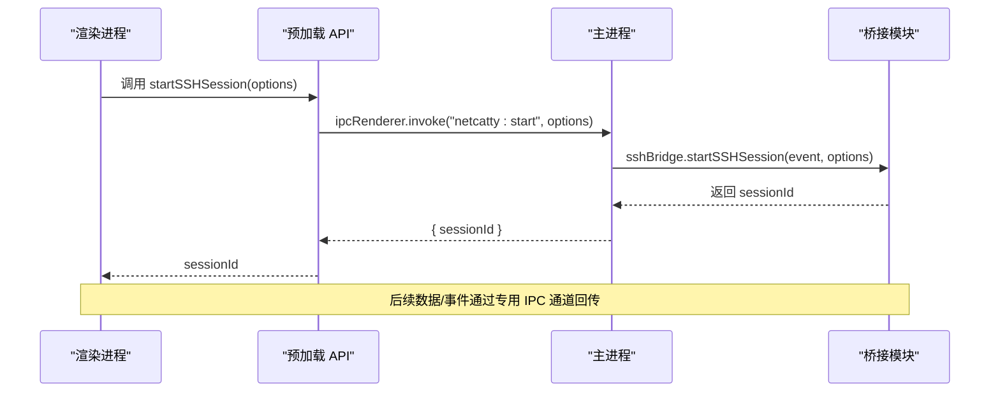
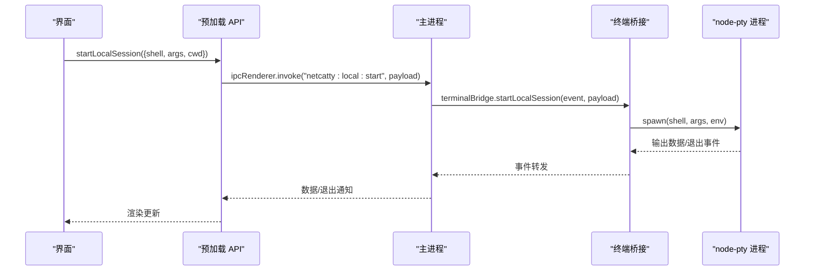
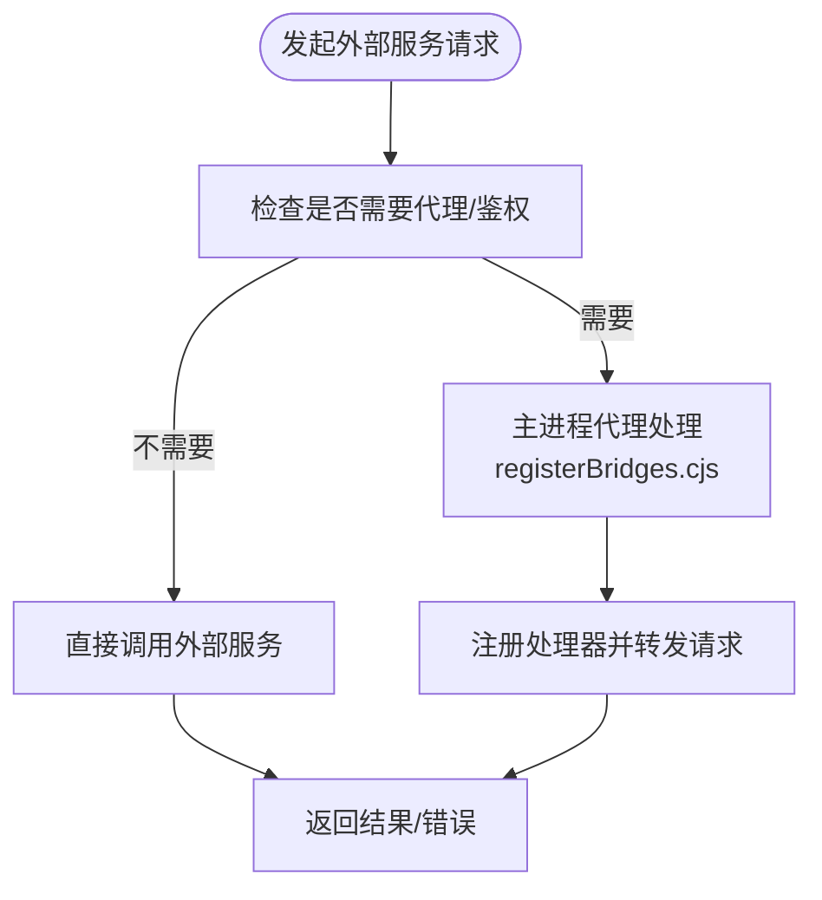
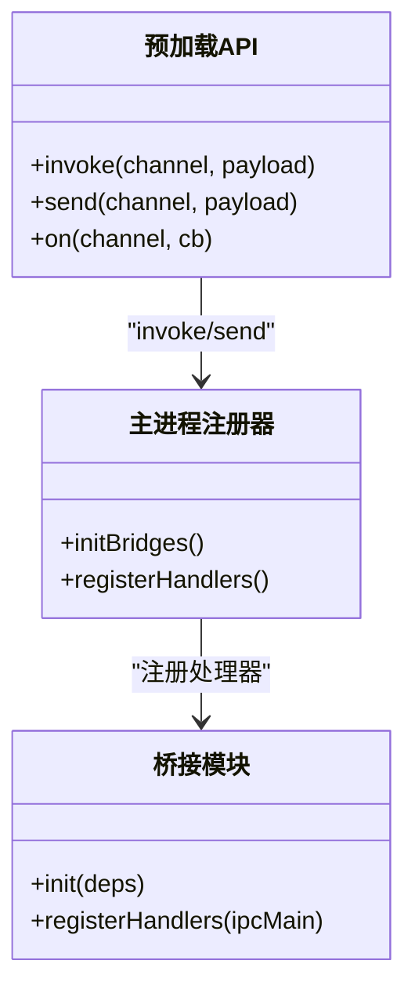
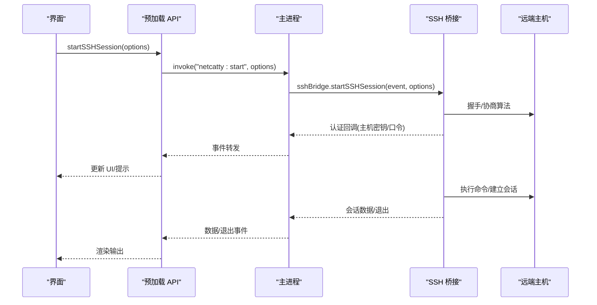
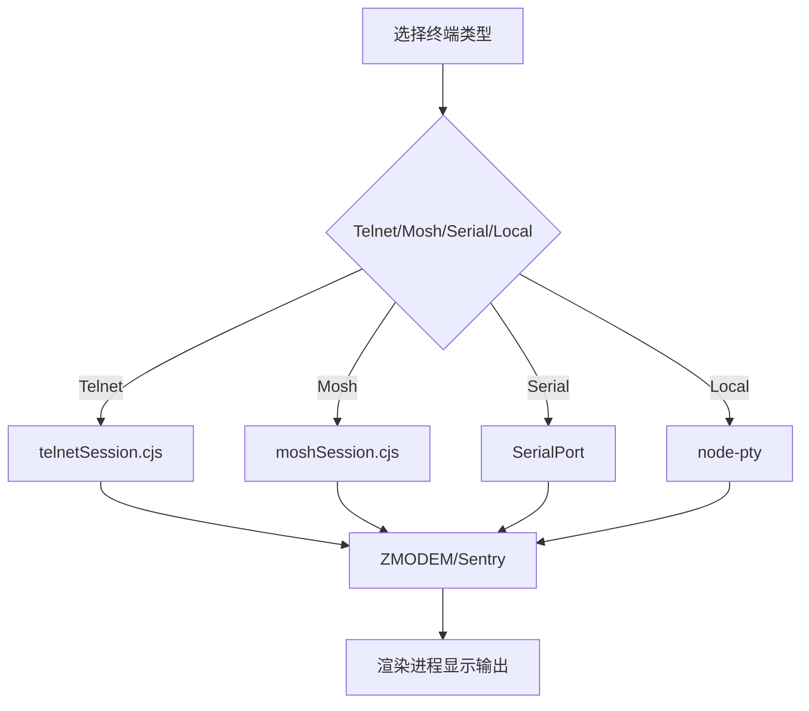
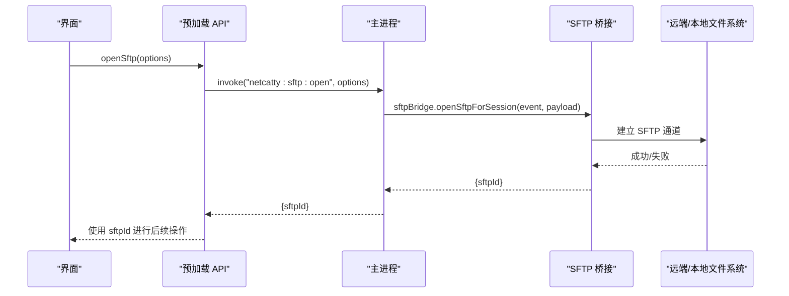
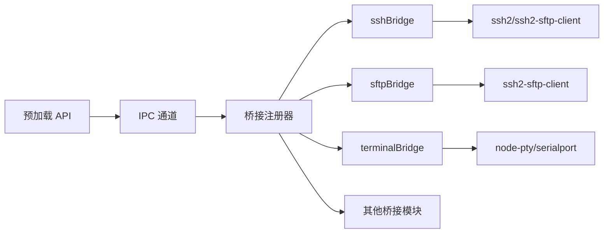

# 第三方集成

<cite>
**本文引用的文件**
- [README.md](file://README.md)
- [api.cjs](file://electron/preload/api.cjs)
- [registerBridges.cjs](file://electron/main/registerBridges.cjs)
- [netcatty-bridge-session.d.ts](file://types/global/netcatty-bridge-session.d.ts)
- [netcatty-bridge-sftp.d.ts](file://types/global/netcatty-bridge-sftp.d.ts)
- [sshBridge.cjs](file://electron/bridges/sshBridge.cjs)
- [sftpBridge.cjs](file://electron/bridges/sftpBridge.cjs)
- [terminalBridge.cjs](file://electron/bridges/terminalBridge.cjs)
- [useTerminalBackend.ts](file://application/state/useTerminalBackend.ts)
- [useSftpBackend.ts](file://application/state/useSftpBackend.ts)
</cite>

## 目录
1. [简介](#简介)
2. [项目结构](#项目结构)
3. [核心组件](#核心组件)
4. [架构总览](#架构总览)
5. [详细组件分析](#详细组件分析)
6. [依赖关系分析](#依赖关系分析)
7. [性能考量](#性能考量)
8. [故障排查指南](#故障排查指南)
9. [结论](#结论)
10. [附录](#附录)

## 简介
本指南面向希望在 Netcatty 中进行第三方集成的开发者，覆盖命令行工具、脚本与外部服务的集成模式；IPC 桥接的扩展机制（新增系统服务与硬件设备）；SSH 客户端扩展（新认证方式与协议支持）；终端扩展（自定义终端模拟器与增强功能）；文件系统扩展（新存储后端与访问协议）；以及集成测试与兼容性验证方法、工具链与调试技巧。目标是帮助你在不破坏现有安全与稳定性前提下，平滑地扩展 Netcatty 的能力边界。

## 项目结构
Netcatty 采用前端 React + Electron 主进程的分层架构，通过预加载脚本暴露统一的 IPC 接口给渲染进程，主进程再将请求路由到各“桥接模块”（bridges），完成与系统或外部服务的交互。

```mermaid
graph TB
subgraph "渲染进程"
UI["React 组件<br/>应用状态与视图"]
Preload["预加载 API<br/>electron/preload/api.cjs"]
end
subgraph "Electron 主进程"
Registrar["桥接注册器<br/>electron/main/registerBridges.cjs"]
Bridges["桥接模块集合<br/>electron/bridges/*"]
end
subgraph "外部系统/服务"
SSH["SSH 服务器"]
SFTP["SFTP 服务"]
Telnet["Telnet 服务"]
Mosh["Mosh 服务"]
Serial["串口设备"]
LocalFS["本地文件系统"]
Cloud["云同步/对象存储"]
end
UI --> Preload
Preload <- --> Registrar
Registrar --> Bridges
Bridges --> SSH
Bridges --> SFTP
Bridges --> Telnet
Bridges --> Mosh
Bridges --> Serial
Bridges --> LocalFS
Bridges --> Cloud
```

图表来源
- [api.cjs](file://electron/preload/api.cjs)
- [registerBridges.cjs](file://electron/main/registerBridges.cjs)

章节来源
- [README.md](file://README.md)
- [api.cjs](file://electron/preload/api.cjs)
- [registerBridges.cjs](file://electron/main/registerBridges.cjs)

## 核心组件
- 预加载 API：在渲染进程中提供统一的桥接入口，封装所有 IPC 调用与事件监听，屏蔽底层细节。
- 主进程桥接注册器：集中初始化并注册各类桥接处理器，负责跨进程通信与业务编排。
- 桥接模块：按功能拆分（SSH、SFTP、终端、本地文件系统、传输、认证等），每个模块职责单一、可独立扩展。
- 应用层状态钩子：在 React 层以 hooks 形式暴露桥接能力，便于组件直接使用。

章节来源
- [api.cjs](file://electron/preload/api.cjs)
- [registerBridges.cjs](file://electron/main/registerBridges.cjs)
- [useTerminalBackend.ts](file://application/state/useTerminalBackend.ts)
- [useSftpBackend.ts](file://application/state/useSftpBackend.ts)

## 架构总览
渲染进程通过预加载 API 发起调用，主进程根据通道名分发到对应桥接模块；桥接模块执行具体逻辑（如启动会话、读写文件、处理认证回调等），并通过事件回传结果或状态变更。



图表来源
- [api.cjs](file://electron/preload/api.cjs)
- [registerBridges.cjs](file://electron/main/registerBridges.cjs)
- [sshBridge.cjs](file://electron/bridges/sshBridge.cjs)

## 详细组件分析

### 命令行工具与脚本集成
- 在渲染层通过预加载 API 调用本地 shell 或外部工具（例如列出/发现可用 shell、执行命令等）。
- 典型流程：UI 触发 -> 预加载 API -> 主进程桥接注册器 -> 终端桥接模块 -> node-pty 子进程 -> 输出回传。



图表来源
- [api.cjs](file://electron/preload/api.cjs)
- [registerBridges.cjs](file://electron/main/registerBridges.cjs)
- [terminalBridge.cjs](file://electron/bridges/terminalBridge.cjs)

章节来源
- [api.cjs](file://electron/preload/api.cjs)
- [terminalBridge.cjs](file://electron/bridges/terminalBridge.cjs)

### 外部服务集成（HTTP/REST/OAuth）
- 预加载 API 提供网络相关能力（如打开外部链接、OAuth 回调、Google/OneDrive 等第三方登录代理），避免渲染进程直接访问受限环境。
- 主进程桥接注册器集中注册这些处理器，确保统一的安全策略与错误处理。



图表来源
- [api.cjs](file://electron/preload/api.cjs)
- [registerBridges.cjs](file://electron/main/registerBridges.cjs)

章节来源
- [api.cjs](file://electron/preload/api.cjs)
- [registerBridges.cjs](file://electron/main/registerBridges.cjs)

### IPC 桥接扩展机制（新增系统服务/硬件设备）
- 新增桥接步骤
  1) 在主进程桥接注册器中初始化并注册新桥接模块的处理器。
  2) 在预加载 API 中添加对应的 invoke/send 方法与事件监听器。
  3) 在应用层状态钩子中暴露新能力，供组件使用。
- 设计要点
  - 统一通道命名规范（如 "netcatty:newsvc:*"）。
  - 明确错误传播与清理逻辑（异常捕获、资源释放）。
  - 对敏感操作（如系统级权限、硬件访问）增加校验与用户确认。



图表来源
- [api.cjs](file://electron/preload/api.cjs)
- [registerBridges.cjs](file://electron/main/registerBridges.cjs)

章节来源
- [api.cjs](file://electron/preload/api.cjs)
- [registerBridges.cjs](file://electron/main/registerBridges.cjs)

### SSH 客户端扩展（新认证方式与协议支持）
- 认证扩展
  - 支持键盘交互认证、主机密钥校验、密钥口令请求等回调通道。
  - 可在桥接模块中扩展新的认证源（如基于票据的认证），并通过统一的认证处理器接入。
- 协议扩展
  - 通过算法配置与握手流程扩展（如支持特定 KEX/Cipher/HMAC）。
  - 支持跳转主机链路（多跳跳板）与代理隧道。
- 关键接口参考
  - 会话生命周期：startSSHSession、execCommand、closeSession。
  - 认证回调：onHostKeyVerification、respondHostKeyVerification、onPassphraseRequest、respondPassphrase。
  - 编码设置：setSessionEncoding。
  - 事件监听：onSessionData、onSessionExit、onChainProgress。



图表来源
- [api.cjs](file://electron/preload/api.cjs)
- [registerBridges.cjs](file://electron/main/registerBridges.cjs)
- [sshBridge.cjs](file://electron/bridges/sshBridge.cjs)

章节来源
- [netcatty-bridge-session.d.ts](file://types/global/netcatty-bridge-session.d.ts)
- [sshBridge.cjs](file://electron/bridges/sshBridge.cjs)

### 终端扩展（自定义终端模拟器与增强功能）
- 支持本地 Shell、Telnet、Mosh、Serial 等多种终端类型。
- 可扩展点
  - 新增协议：在终端桥接模块中实现握手与数据流处理。
  - 新增编码/字符集：通过标准化的编码转换函数适配。
  - ZMODEM 文件传输：复用现有 Sentry 机制，保证传输可靠性。
  - 会话日志与空闲提示：统一的日志流管理与空闲检测。
- 关键接口参考
  - 会话控制：startLocalSession、startTelnetSession、startMoshSession、startSerialSession。
  - 写入/调整大小/暂停/关闭：writeToSession、resizeSession、setSessionFlowPaused、closeSession。
  - 事件监听：onSessionData、onSessionExit、onTelnetAutoLoginComplete/Cancelled。



图表来源
- [terminalBridge.cjs](file://electron/bridges/terminalBridge.cjs)
- [api.cjs](file://electron/preload/api.cjs)

章节来源
- [terminalBridge.cjs](file://electron/bridges/terminalBridge.cjs)
- [useTerminalBackend.ts](file://application/state/useTerminalBackend.ts)

### 文件系统扩展（新存储后端与访问协议）
- SFTP 能力
  - 打开/关闭会话、目录/文件操作、权限修改、统计信息。
  - 支持二进制读写、进度回调、取消上传、同机复制优化。
  - 文件名编码自动识别与切换（UTF-8/GB18030）。
- 本地文件系统
  - 列表/读写/重命名/删除/创建目录/统计/驱动器枚举等。
- 传输与压缩
  - 流式传输、进度/完成/错误回调、取消。
  - 压缩打包上传（支持本地/远程 tar 能力检测）。



图表来源
- [api.cjs](file://electron/preload/api.cjs)
- [registerBridges.cjs](file://electron/main/registerBridges.cjs)
- [sftpBridge.cjs](file://electron/bridges/sftpBridge.cjs)

章节来源
- [netcatty-bridge-sftp.d.ts](file://types/global/netcatty-bridge-sftp.d.ts)
- [sftpBridge.cjs](file://electron/bridges/sftpBridge.cjs)
- [useSftpBackend.ts](file://application/state/useSftpBackend.ts)

## 依赖关系分析
- 预加载 API 依赖 Electron IPC 通道与事件管理，向上提供统一方法签名。
- 主进程桥接注册器集中管理各桥接模块的初始化与处理器注册，降低耦合度。
- 桥接模块内部依赖第三方库（ssh2、ssh2-sftp-client、node-pty、serialport 等）与系统能力（进程树、临时目录、剪贴板等）。
- 应用层状态钩子对桥接能力进行二次封装，提供稳定的 React 使用体验。



图表来源
- [api.cjs](file://electron/preload/api.cjs)
- [registerBridges.cjs](file://electron/main/registerBridges.cjs)

章节来源
- [api.cjs](file://electron/preload/api.cjs)
- [registerBridges.cjs](file://electron/main/registerBridges.cjs)

## 性能考量
- 会话背压控制：终端桥接在渲染侧水位过高时暂停上游输出，避免内存压力。
- 编码解码缓存：按会话维护解码器，减少重复初始化成本。
- 传输优化：SFTP 写入采用分块与管道，支持取消与进度回调；同机复制走专用路径。
- 日志与空闲检测：统一的日志流管理与空闲提示，减少无效刷新。

## 故障排查指南
- 常见问题定位
  - 会话无法建立：检查主机密钥校验、认证回调、代理/跳板配置。
  - 传输中断：查看进度/错误回调与取消逻辑，确认网络波动与权限问题。
  - 编码乱码：确认远端文件名编码检测与切换，必要时强制指定编码。
- 调试建议
  - 启用 SSH 调试日志（环境变量开关），收集握手与算法协商信息。
  - 使用会话日志流记录输出，便于回放与分析。
  - 在预加载 API 中增加事件监听，观察数据/退出/认证事件的触发顺序。

章节来源
- [sshBridge.cjs](file://electron/bridges/sshBridge.cjs)
- [terminalBridge.cjs](file://electron/bridges/terminalBridge.cjs)
- [sftpBridge.cjs](file://electron/bridges/sftpBridge.cjs)

## 结论
通过清晰的桥接分层与统一的 IPC 接口，Netcatty 为第三方集成提供了高内聚、低耦合的扩展框架。遵循本文的接口规范与最佳实践，你可以在保持安全与稳定的同时，快速扩展命令行工具、脚本、外部服务、系统服务与硬件设备的集成能力，并实现 SSH、终端与文件系统的深度定制。

## 附录
- 工具链与调试
  - 使用预加载 API 的事件监听辅助定位问题。
  - 在主进程启用 SSH 调试日志，收集握手与算法信息。
  - 利用会话日志流进行输出回放与分析。
- 兼容性验证清单
  - 跨平台（macOS/Windows/Linux）行为一致性。
  - 不同编码（UTF-8/GB18030）与字符集下的显示与传输正确性。
  - 大文件/高并发场景下的稳定性与性能表现。
  - 权限与安全策略（如剪贴板、系统对话框、外部链接打开）的一致性。