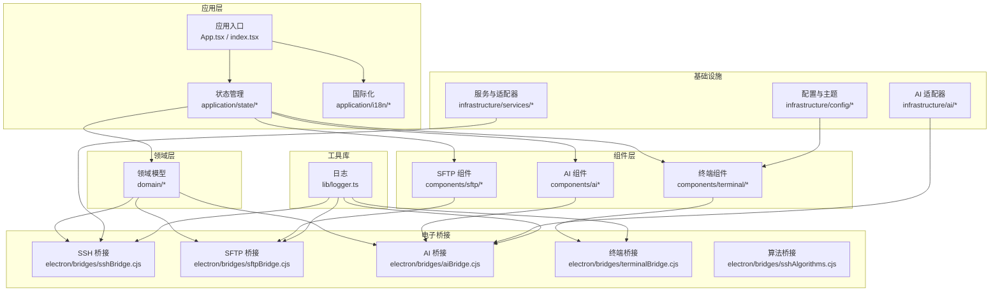
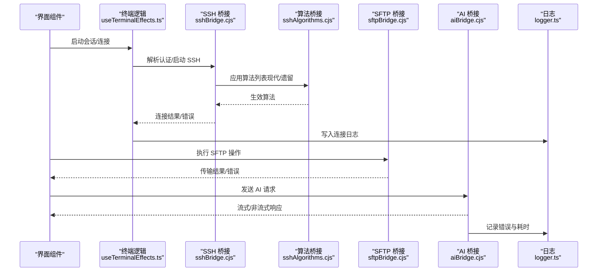
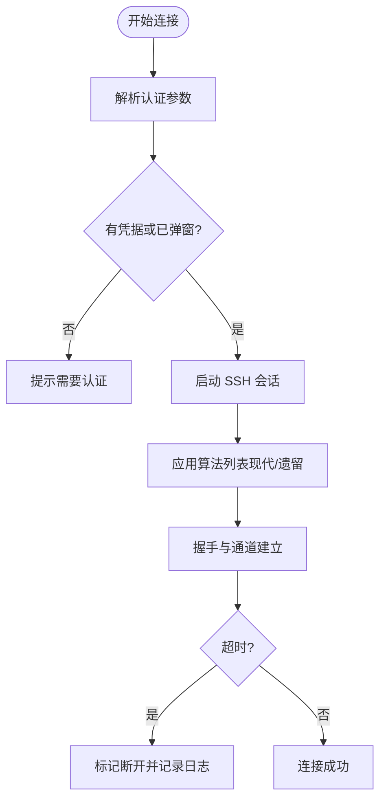
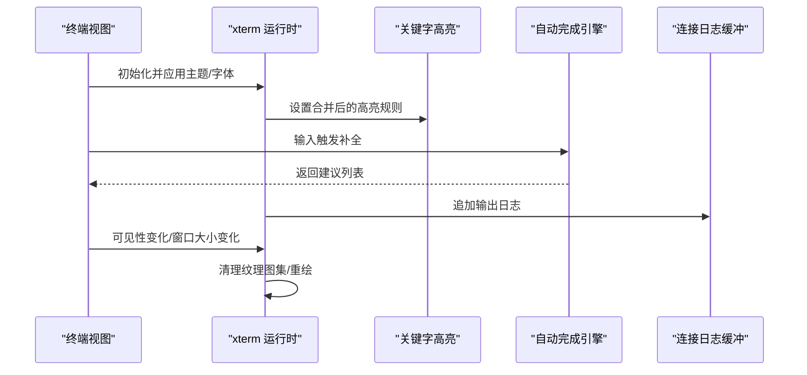
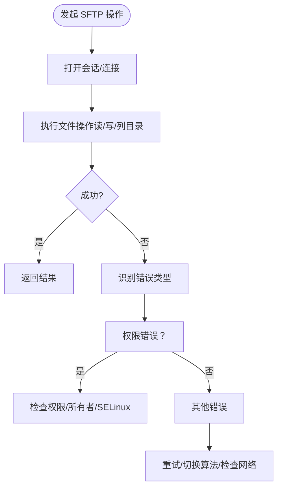
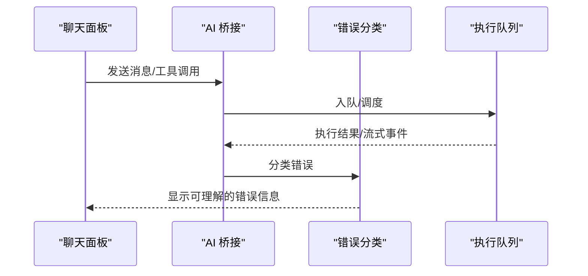
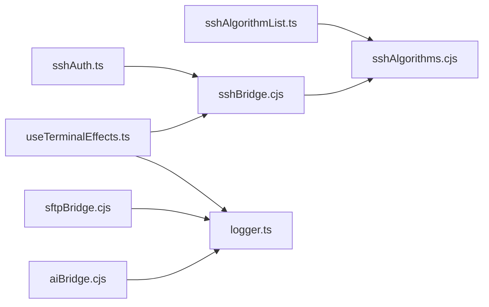

# 故障排除与常见问题

<cite>
**本文引用的文件**   
- [README.md](file://README.md)
- [application/state/sftp/errors.ts](file://application/state/sftp/errors.ts)
- [domain/sshAuth.ts](file://domain/sshAuth.ts)
- [domain/sshAlgorithmList.ts](file://domain/sshAlgorithmList.ts)
- [components/terminal/autocomplete/completionEngine.ts](file://components/terminal/autocomplete/completionEngine.ts)
- [components/terminal/useTerminalEffects.ts](file://components/terminal/useTerminalEffects.ts)
- [components/terminal/connectionLogBuffer.ts](file://components/terminal/connectionLogBuffer.ts)
- [infrastructure/ai/errorClassifier.ts](file://infrastructure/ai/errorClassifier.ts)
- [infrastructure/ai/sessionExecutionQueue.test.ts](file://infrastructure/ai/sessionExecutionQueue.test.ts)
- [electron/bridges/sshAlgorithms.cjs](file://electron/bridges/sshAlgorithms.cjs)
- [electron/bridges/sshBridge.cjs](file://electron/bridges/sshBridge.cjs)
- [electron/bridges/sftpBridge.cjs](file://electron/bridges/sftpBridge.cjs)
- [electron/bridges/aiBridge.cjs](file://electron/bridges/aiBridge.cjs)
- [electron/bridges/terminalBridge.cjs](file://electron/bridges/terminalBridge.cjs)
- [lib/logger.ts](file://lib/logger.ts)
</cite>

## 目录
1. [简介](#简介)
2. [项目结构](#项目结构)
3. [核心组件](#核心组件)
4. [架构总览](#架构总览)
5. [详细组件分析](#详细组件分析)
6. [依赖关系分析](#依赖关系分析)
7. [性能考虑](#性能考虑)
8. [故障排除指南](#故障排除指南)
9. [结论](#结论)
10. [附录](#附录)

## 简介
本指南面向使用 Netcatty 的用户，聚焦于常见问题的诊断与解决，覆盖 SSH 连接、终端功能（xterm.js 渲染、自动完成）、SFTP 文件传输、AI 代理（模型连接、响应超时、工具调用）以及日志与性能优化。内容基于仓库中的实现细节进行归纳总结，提供可操作的排查步骤与最佳实践。

## 项目结构
Netcatty 采用前端 React + Electron 主进程的分层架构，核心模块包括：
- 应用层：状态管理与国际化（application）
- 领域模型：主机、认证、算法、SFTP 等（domain）
- 基础设施：AI 适配器、云同步、主题与字体配置（infrastructure）
- 组件层：终端、SFTP、AI 聊天、设置等（components）
- 电子桥接：IPC 桥接各子系统（electron/bridges）
- 工具库：日志、上传、字体检测等（lib）

**图表来源**
- [README.md:315-332](file://README.md#L315-L332)

**章节来源**
- [README.md:315-332](file://README.md#L315-L332)

## 核心组件
- SSH 认证与算法：负责主机认证解析、算法列表与兼容性控制（domain 层），并在桥接层生效（electron/bridges）。
- 终端与自动完成：xterm.js 运行时、关键字高亮、字体与渲染修复、自动完成引擎（components/terminal）。
- SFTP：会话错误识别、书签与缓存、传输队列与冲突处理（application/state/sftp 与 electron/bridges/sftpBridge.cjs）。
- AI 代理：错误分类、会话执行队列、工具调用与流式输出（infrastructure/ai 与 electron/bridges/aiBridge.cjs）。
- 日志与诊断：连接日志缓冲区、统一日志记录（components/terminal/connectionLogBuffer.ts 与 lib/logger.ts）。

**章节来源**
- [domain/sshAuth.ts:44-103](file://domain/sshAuth.ts#L44-L103)
- [domain/sshAlgorithmList.ts:186-206](file://domain/sshAlgorithmList.ts#L186-L206)
- [components/terminal/useTerminalEffects.ts:58-98](file://components/terminal/useTerminalEffects.ts#L58-L98)
- [components/terminal/autocomplete/completionEngine.ts:163-323](file://components/terminal/autocomplete/completionEngine.ts#L163-L323)
- [application/state/sftp/errors.ts:1-20](file://application/state/sftp/errors.ts#L1-L20)
- [infrastructure/ai/errorClassifier.ts:1-200](file://infrastructure/ai/errorClassifier.ts#L1-L200)
- [components/terminal/connectionLogBuffer.ts:18-94](file://components/terminal/connectionLogBuffer.ts#L18-L94)
- [lib/logger.ts:1-200](file://lib/logger.ts#L1-L200)

## 架构总览
下图展示 SSH、SFTP、终端与 AI 的关键交互路径，以及日志与错误分类如何贯穿各层。

**图表来源**
- [components/terminal/useTerminalEffects.ts:255-275](file://components/terminal/useTerminalEffects.ts#L255-L275)
- [electron/bridges/sshBridge.cjs:1-200](file://electron/bridges/sshBridge.cjs#L1-L200)
- [electron/bridges/sshAlgorithms.cjs:1-200](file://electron/bridges/sshAlgorithms.cjs#L1-L200)
- [electron/bridges/sftpBridge.cjs:1-200](file://electron/bridges/sftpBridge.cjs#L1-L200)
- [electron/bridges/aiBridge.cjs:1-200](file://electron/bridges/aiBridge.cjs#L1-L200)
- [lib/logger.ts:1-200](file://lib/logger.ts#L1-L200)

## 详细组件分析

### SSH 连接与算法兼容性
- 认证解析：支持显式选择密码/密钥/证书，尊重用户覆盖项；当无凭据且未触发键盘交互时，会提示需要认证。
- 算法列表：提供现代优先的默认算法集，并根据“遗留模式”动态追加兼容算法；超出 ssh2 支持集合会导致“不支持的算法”错误。
- 连接超时：本地/串口连接不参与超时 UI；其他协议在连接阶段有倒计时与进度条，超时会标记为断开并记录日志。

**图表来源**
- [domain/sshAuth.ts:44-103](file://domain/sshAuth.ts#L44-L103)
- [domain/sshAlgorithmList.ts:186-206](file://domain/sshAlgorithmList.ts#L186-L206)
- [components/terminal/useTerminalEffects.ts:255-336](file://components/terminal/useTerminalEffects.ts#L255-L336)

**章节来源**
- [domain/sshAuth.ts:44-103](file://domain/sshAuth.ts#L44-L103)
- [domain/sshAlgorithmList.ts:186-206](file://domain/sshAlgorithmList.ts#L186-L206)
- [components/terminal/useTerminalEffects.ts:255-336](file://components/terminal/useTerminalEffects.ts#L255-L336)

### 终端渲染与自动完成
- 关键字高亮：全局与主机级规则独立开关，运行时合并生效；首次连接后对粗细权重做一次回写以修复 WebGL 字形差异。
- 字体与渲染：等待字体加载完成后重测度与适配；可见性恢复时清理纹理图集并强制同步重绘，避免“花屏”。
- 自动完成：多数据源（历史、Fig 规范、路径、片段）上下文感知，按分数排序去重；路径补全在本地或远程会话中启用。
- 日志缓冲：连接日志采用块级缓冲，限制内存占用，便于最终回放与诊断。

**图表来源**
- [components/terminal/useTerminalEffects.ts:19-37](file://components/terminal/useTerminalEffects.ts#L19-L37)
- [components/terminal/useTerminalEffects.ts:43-55](file://components/terminal/useTerminalEffects.ts#L43-L55)
- [components/terminal/useTerminalEffects.ts:461-458](file://components/terminal/useTerminalEffects.ts#L461-L458)
- [components/terminal/autocomplete/completionEngine.ts:163-323](file://components/terminal/autocomplete/completionEngine.ts#L163-L323)
- [components/terminal/connectionLogBuffer.ts:18-94](file://components/terminal/connectionLogBuffer.ts#L18-L94)

**章节来源**
- [components/terminal/useTerminalEffects.ts:19-37](file://components/terminal/useTerminalEffects.ts#L19-L37)
- [components/terminal/useTerminalEffects.ts:43-55](file://components/terminal/useTerminalEffects.ts#L43-L55)
- [components/terminal/useTerminalEffects.ts:461-458](file://components/terminal/useTerminalEffects.ts#L461-L458)
- [components/terminal/autocomplete/completionEngine.ts:163-323](file://components/terminal/autocomplete/completionEngine.ts#L163-L323)
- [components/terminal/connectionLogBuffer.ts:18-94](file://components/terminal/connectionLogBuffer.ts#L18-L94)

### SFTP 文件传输
- 错误识别：通过消息关键词判断会话丢失、通道关闭、连接重置、超时等，便于统一处理与提示。
- 传输流程：桥接层封装打开连接与文件操作；应用层维护书签、缓存、冲突策略与传输队列。
- 常见问题：权限不足、传输中断、文件被锁定（目标文件正被占用）。

**图表来源**
- [application/state/sftp/errors.ts:1-20](file://application/state/sftp/errors.ts#L1-L20)
- [electron/bridges/sftpBridge.cjs:1-200](file://electron/bridges/sftpBridge.cjs#L1-L200)

**章节来源**
- [application/state/sftp/errors.ts:1-20](file://application/state/sftp/errors.ts#L1-L20)
- [electron/bridges/sftpBridge.cjs:1-200](file://electron/bridges/sftpBridge.cjs#L1-L200)

### AI 代理功能
- 错误分类：对不同来源的错误进行归类，区分网络、鉴权、工具调用、流式状态等，辅助 UI 提示与重试策略。
- 执行队列：会话执行队列保障并发与顺序，结合流式状态错误处理，提升稳定性。
- 工具调用：工具执行器与 Web 搜索提供器作为扩展点，需关注工具可用性与权限。

**图表来源**
- [infrastructure/ai/errorClassifier.ts:1-200](file://infrastructure/ai/errorClassifier.ts#L1-L200)
- [infrastructure/ai/sessionExecutionQueue.test.ts:1-200](file://infrastructure/ai/sessionExecutionQueue.test.ts#L1-L200)
- [electron/bridges/aiBridge.cjs:1-200](file://electron/bridges/aiBridge.cjs#L1-L200)

**章节来源**
- [infrastructure/ai/errorClassifier.ts:1-200](file://infrastructure/ai/errorClassifier.ts#L1-L200)
- [infrastructure/ai/sessionExecutionQueue.test.ts:1-200](file://infrastructure/ai/sessionExecutionQueue.test.ts#L1-L200)
- [electron/bridges/aiBridge.cjs:1-200](file://electron/bridges/aiBridge.cjs#L1-L200)

## 依赖关系分析
- 终端与算法：useTerminalEffects 在连接前应用算法；sshAlgorithms.cjs 提供算法构建与兼容性开关。
- SSH 认证：resolveHostAuth 从主机、身份、钥匙集中解析最终认证参数。
- 日志：连接日志缓冲在组件层创建，统一由 logger.ts 记录到主进程。

**图表来源**
- [domain/sshAuth.ts:44-103](file://domain/sshAuth.ts#L44-L103)
- [domain/sshAlgorithmList.ts:186-206](file://domain/sshAlgorithmList.ts#L186-L206)
- [components/terminal/useTerminalEffects.ts:255-275](file://components/terminal/useTerminalEffects.ts#L255-L275)
- [lib/logger.ts:1-200](file://lib/logger.ts#L1-L200)
- [electron/bridges/sftpBridge.cjs:1-200](file://electron/bridges/sftpBridge.cjs#L1-L200)
- [electron/bridges/aiBridge.cjs:1-200](file://electron/bridges/aiBridge.cjs#L1-L200)

**章节来源**
- [domain/sshAuth.ts:44-103](file://domain/sshAuth.ts#L44-L103)
- [domain/sshAlgorithmList.ts:186-206](file://domain/sshAlgorithmList.ts#L186-L206)
- [components/terminal/useTerminalEffects.ts:255-275](file://components/terminal/useTerminalEffects.ts#L255-L275)
- [lib/logger.ts:1-200](file://lib/logger.ts#L1-L200)
- [electron/bridges/sftpBridge.cjs:1-200](file://electron/bridges/sftpBridge.cjs#L1-L200)
- [electron/bridges/aiBridge.cjs:1-200](file://electron/bridges/aiBridge.cjs#L1-L200)

## 性能考虑
- 终端渲染：启用平滑滚动与对比度阈值，合理设置滚动回溯；在隐藏标签页恢复时强制同步重绘，避免 WebGL 缓冲污染导致的“花屏”。
- 字体与测量：等待字体加载完成后重测度与适配，减少因字体不可用导致的布局抖动。
- 日志缓冲：块级缓冲限制内存增长，适合长连接场景下的诊断回放。
- 算法选择：优先现代安全算法，必要时开启遗留模式以兼容旧服务器；避免暴露不被 ssh2 支持的算法，防止握手失败。

**章节来源**
- [components/terminal/useTerminalEffects.ts:417-458](file://components/terminal/useTerminalEffects.ts#L417-L458)
- [components/terminal/useTerminalEffects.ts:461-525](file://components/terminal/useTerminalEffects.ts#L461-L525)
- [components/terminal/connectionLogBuffer.ts:18-94](file://components/terminal/connectionLogBuffer.ts#L18-L94)
- [domain/sshAlgorithmList.ts:186-206](file://domain/sshAlgorithmList.ts#L186-L206)

## 故障排除指南

### SSH 连接问题
- 认证失败
  - 检查用户名/密码/密钥是否正确，确认覆盖项是否生效。
  - 若出现“需要键盘交互”，确保已在弹窗中完成交互。
  - 参考：[domain/sshAuth.ts:44-103](file://domain/sshAuth.ts#L44-L103)
- 连接超时
  - 查看连接进度与倒计时；超时后会标记断开并记录日志。
  - 尝试提高超时阈值或检查网络质量。
  - 参考：[components/terminal/useTerminalEffects.ts:302-336](file://components/terminal/useTerminalEffects.ts#L302-L336)
- 算法不兼容
  - 使用现代算法优先；若服务器较旧，开启遗留模式并谨慎勾选兼容算法。
  - 避免选择 ssh2 不支持的算法，否则会在握手前抛出“不支持的算法”。
  - 参考：[domain/sshAlgorithmList.ts:186-206](file://domain/sshAlgorithmList.ts#L186-L206)，[electron/bridges/sshAlgorithms.cjs:1-200](file://electron/bridges/sshAlgorithms.cjs#L1-L200)

### 终端功能问题
- xterm.js 渲染异常（花屏/字形错乱）
  - 切换或调整字体，等待字体加载后再适配；必要时手动触发重绘。
  - 参考：[components/terminal/useTerminalEffects.ts:417-458](file://components/terminal/useTerminalEffects.ts#L417-L458)
- 字体显示异常
  - 确认字体存在且权重可用；若粗体不可用，系统会回退到常规粗细。
  - 参考：[components/terminal/useTerminalEffects.ts:378-404](file://components/terminal/useTerminalEffects.ts#L378-L404)
- 自动完成失效
  - 检查输入上下文与数据源（历史、Fig 规范、路径、片段）；确认当前会话协议允许路径补全。
  - 参考：[components/terminal/autocomplete/completionEngine.ts:163-323](file://components/terminal/autocomplete/completionEngine.ts#L163-L323)

### SFTP 文件传输问题
- 权限错误
  - 检查远端文件/目录权限、所有者与 SELinux 状态；尝试使用更高权限账户或临时禁用 SELinux 进行验证。
  - 参考：[application/state/sftp/errors.ts:1-20](file://application/state/sftp/errors.ts#L1-L20)
- 传输中断
  - 重试操作；若服务器启用严格算法，尝试切换到兼容算法。
  - 参考：[domain/sshAlgorithmList.ts:186-206](file://domain/sshAlgorithmList.ts#L186-L206)
- 文件锁定
  - 确认目标文件未被占用；关闭占用进程或等待释放后再试。

### AI 代理问题
- 模型连接失败
  - 检查网络连通性与代理设置；查看错误分类结果，区分网络/鉴权/工具问题。
  - 参考：[infrastructure/ai/errorClassifier.ts:1-200](file://infrastructure/ai/errorClassifier.ts#L1-L200)
- 响应超时
  - 减少并发请求，延长超时时间；观察执行队列状态。
  - 参考：[infrastructure/ai/sessionExecutionQueue.test.ts:1-200](file://infrastructure/ai/sessionExecutionQueue.test.ts#L1-L200)
- 工具调用错误
  - 确认工具可用性与权限；检查工具执行器与搜索提供器配置。

### 日志分析与调试
- 连接日志
  - 使用连接日志缓冲区保存最近输出，便于最终回放与诊断。
  - 参考：[components/terminal/connectionLogBuffer.ts:18-94](file://components/terminal/connectionLogBuffer.ts#L18-L94)
- 统一日志
  - 在桥接层与组件层统一写入日志，包含错误堆栈与上下文。
  - 参考：[lib/logger.ts:1-200](file://lib/logger.ts#L1-L200)

### 性能问题与优化
- 终端卡顿
  - 降低滚动回溯、关闭不必要的关键字高亮规则、减少字体复杂度。
- 字体加载慢
  - 预加载关键字体，避免在连接后频繁测量。
- 算法握手慢
  - 优先现代算法，减少协商轮次；仅在必要时启用遗留算法。

**章节来源**
- [components/terminal/useTerminalEffects.ts:360-428](file://components/terminal/useTerminalEffects.ts#L360-L428)
- [components/terminal/connectionLogBuffer.ts:18-94](file://components/terminal/connectionLogBuffer.ts#L18-L94)
- [lib/logger.ts:1-200](file://lib/logger.ts#L1-L200)

## 结论
通过结合领域模型（认证与算法）、组件层（终端与自动完成）、桥接层（IPC 通信）与基础设施（AI 与日志），Netcatty 提供了完整的排障与优化路径。建议在日常使用中：
- 优先使用现代安全算法与合适的字体配置；
- 建立日志留存与回放机制；
- 针对不同协议（SSH/SFTP/Telnet/Mosh/Serial）分别排查；
- 对 AI 代理进行错误分类与执行队列治理。

## 附录
- 快速检查清单
  - SSH：凭据正确、算法兼容、网络稳定、超时合理
  - 终端：字体可用、渲染修复、自动完成数据源正常
  - SFTP：权限/SELinux 正常、算法兼容、文件未被占用
  - AI：网络/鉴权/工具可用、队列与流式状态健康
  - 日志：缓冲区容量足够、统一记录、可回放