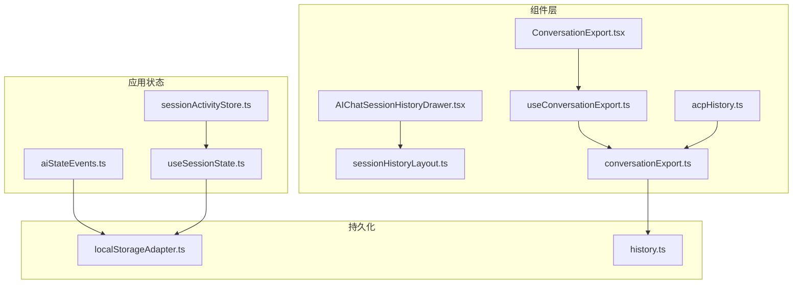
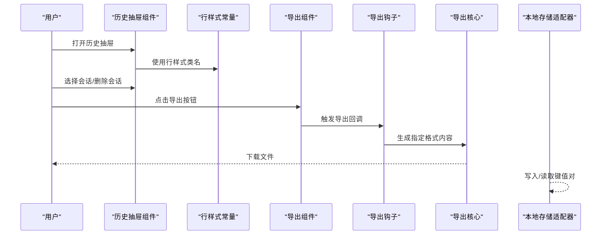
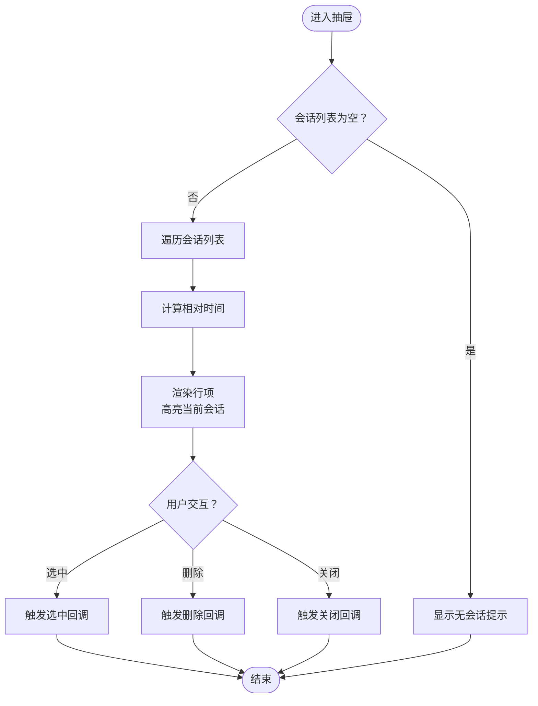
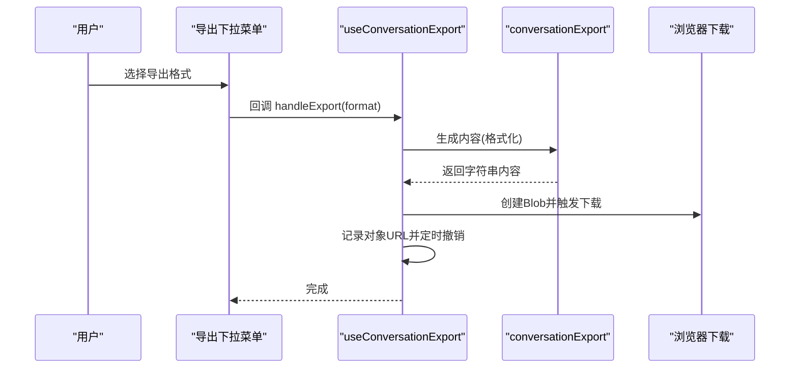
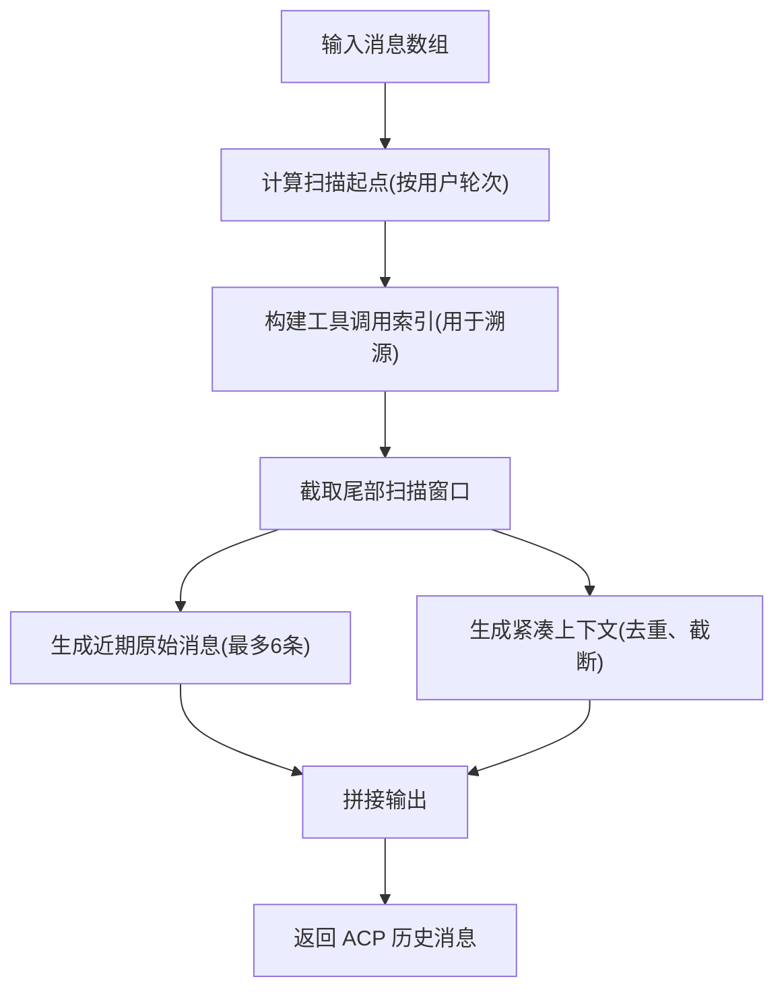
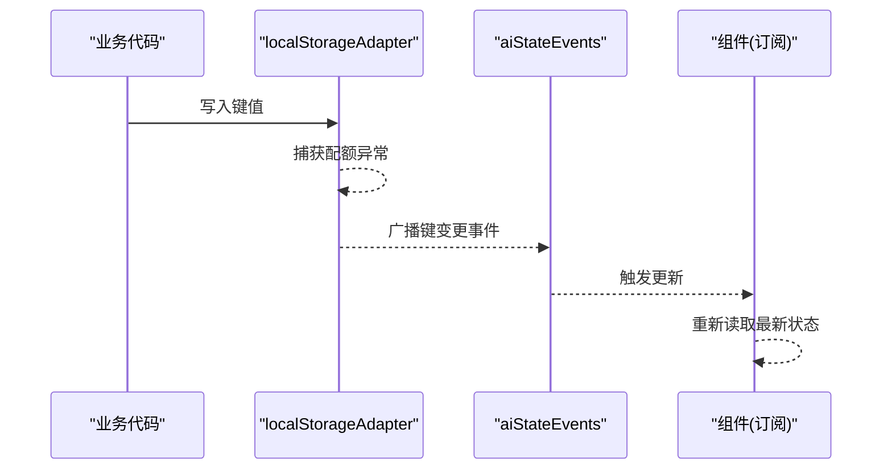
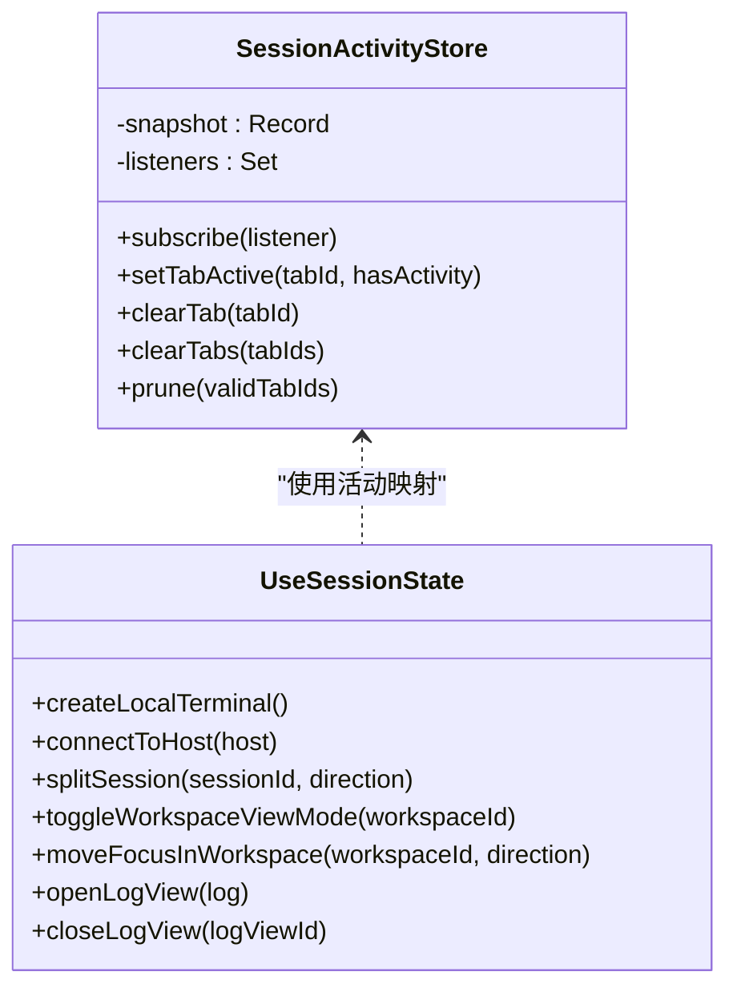
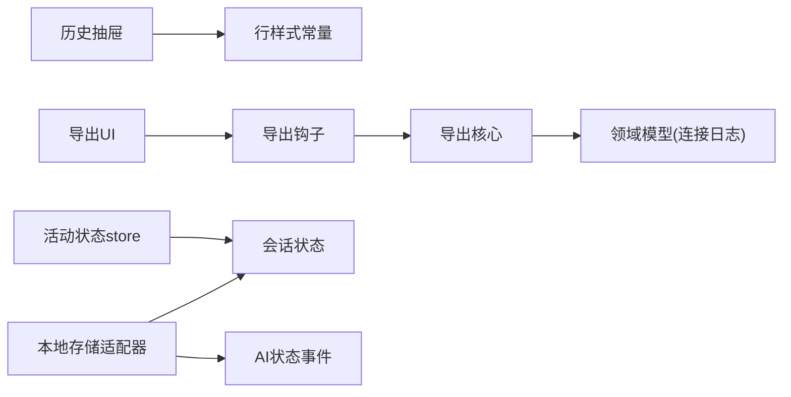

# 会话历史管理

<cite>
**本文引用的文件**
- [AIChatSessionHistoryDrawer.tsx](file://components/AIChatSessionHistoryDrawer.tsx)
- [sessionHistoryLayout.ts](file://components/ai/sessionHistoryLayout.ts)
- [ConversationExport.tsx](file://components/ai/ConversationExport.tsx)
- [useConversationExport.ts](file://components/ai/hooks/useConversationExport.ts)
- [conversationExport.ts](file://infrastructure/ai/conversationExport.ts)
- [acpHistory.ts](file://components/ai/acpHistory.ts)
- [history.ts](file://domain/models/history.ts)
- [localStorageAdapter.ts](file://infrastructure/persistence/localStorageAdapter.ts)
- [aiStateEvents.ts](file://application/state/aiStateEvents.ts)
- [sessionActivityStore.ts](file://application/state/sessionActivityStore.ts)
- [useSessionState.ts](file://application/state/useSessionState.ts)
</cite>

## 目录
1. [简介](#简介)
2. [项目结构](#项目结构)
3. [核心组件](#核心组件)
4. [架构总览](#架构总览)
5. [详细组件分析](#详细组件分析)
6. [依赖关系分析](#依赖关系分析)
7. [性能考量](#性能考量)
8. [故障排查指南](#故障排查指南)
9. [结论](#结论)
10. [附录](#附录)

## 简介
本文件系统性阐述“会话历史管理”功能的技术实现，覆盖以下方面：
- 会话历史抽屉：历史列表渲染、会话筛选、快速导航、批量操作
- 会话状态持久化：数据存储格式、同步策略、版本迁移、备份恢复
- 会话导出：多格式支持（Markdown、JSON、TXT）、内容过滤、元数据保留
- 会话视图状态管理：面板显示控制、布局切换、响应式适配
- 会话事件监听：状态变更通知、实时更新、冲突解决
- 最佳实践：存储优化、性能调优、隐私保护

## 项目结构
围绕会话历史管理的关键模块分布如下：
- 组件层
  - 历史抽屉与行样式：AIChatSessionHistoryDrawer.tsx、sessionHistoryLayout.ts
  - 导出入口与导出逻辑：ConversationExport.tsx、useConversationExport.ts、conversationExport.ts
  - ACP 历史摘要：acpHistory.ts
- 领域模型：history.ts（包含连接日志、会话日志设置等）
- 应用状态与事件：sessionActivityStore.ts、aiStateEvents.ts、useSessionState.ts
- 持久化与同步：localStorageAdapter.ts

**图表来源**
- [AIChatSessionHistoryDrawer.tsx:1-113](file://components/AIChatSessionHistoryDrawer.tsx#L1-L113)
- [sessionHistoryLayout.ts:1-8](file://components/ai/sessionHistoryLayout.ts#L1-L8)
- [ConversationExport.tsx:1-88](file://components/ai/ConversationExport.tsx#L1-L88)
- [useConversationExport.ts:1-77](file://components/ai/hooks/useConversationExport.ts#L1-L77)
- [conversationExport.ts:1-126](file://infrastructure/ai/conversationExport.ts#L1-L126)
- [acpHistory.ts:1-439](file://components/ai/acpHistory.ts#L1-L439)
- [sessionActivityStore.ts:1-79](file://application/state/sessionActivityStore.ts#L1-L79)
- [aiStateEvents.ts:1-21](file://application/state/aiStateEvents.ts#L1-L21)
- [useSessionState.ts:1-800](file://application/state/useSessionState.ts#L1-L800)
- [localStorageAdapter.ts:1-107](file://infrastructure/persistence/localStorageAdapter.ts#L1-L107)
- [history.ts:1-57](file://domain/models/history.ts#L1-L57)

**章节来源**
- [AIChatSessionHistoryDrawer.tsx:1-113](file://components/AIChatSessionHistoryDrawer.tsx#L1-L113)
- [sessionHistoryLayout.ts:1-8](file://components/ai/sessionHistoryLayout.ts#L1-L8)
- [ConversationExport.tsx:1-88](file://components/ai/ConversationExport.tsx#L1-L88)
- [useConversationExport.ts:1-77](file://components/ai/hooks/useConversationExport.ts#L1-L77)
- [conversationExport.ts:1-126](file://infrastructure/ai/conversationExport.ts#L1-L126)
- [acpHistory.ts:1-439](file://components/ai/acpHistory.ts#L1-L439)
- [history.ts:1-57](file://domain/models/history.ts#L1-L57)
- [localStorageAdapter.ts:1-107](file://infrastructure/persistence/localStorageAdapter.ts#L1-L107)
- [aiStateEvents.ts:1-21](file://application/state/aiStateEvents.ts#L1-L21)
- [sessionActivityStore.ts:1-79](file://application/state/sessionActivityStore.ts#L1-L79)
- [useSessionState.ts:1-800](file://application/state/useSessionState.ts#L1-L800)

## 核心组件
- 会话历史抽屉：负责渲染历史会话列表、展示相对时间、删除按钮交互、关闭抽屉等
- 行样式常量：统一历史项的网格布局、标题、时间、删除按钮的类名
- 会话导出：提供导出下拉菜单，支持 Markdown、JSON、TXT；导出钩子负责对象 URL 生命周期管理
- ACP 历史摘要：构建紧凑上下文与近期原始消息，用于代理回放或补充 UI 上下文
- 领域模型：定义连接日志、会话日志设置等，支撑导出与历史记录
- 持久化与事件：本地存储适配器、同窗事件广播、活动标签页状态存储

**章节来源**
- [AIChatSessionHistoryDrawer.tsx:14-94](file://components/AIChatSessionHistoryDrawer.tsx#L14-L94)
- [sessionHistoryLayout.ts:1-8](file://components/ai/sessionHistoryLayout.ts#L1-L8)
- [ConversationExport.tsx:20-85](file://components/ai/ConversationExport.tsx#L20-L85)
- [useConversationExport.ts:28-76](file://components/ai/hooks/useConversationExport.ts#L28-L76)
- [conversationExport.ts:6-126](file://infrastructure/ai/conversationExport.ts#L6-L126)
- [acpHistory.ts:398-439](file://components/ai/acpHistory.ts#L398-L439)
- [history.ts:24-41](file://domain/models/history.ts#L24-L41)
- [localStorageAdapter.ts:70-106](file://infrastructure/persistence/localStorageAdapter.ts#L70-L106)
- [aiStateEvents.ts:15-20](file://application/state/aiStateEvents.ts#L15-L20)
- [sessionActivityStore.ts:5-71](file://application/state/sessionActivityStore.ts#L5-L71)

## 架构总览
会话历史管理采用“组件-状态-持久化”的分层设计：
- 组件层：抽屉渲染、导出 UI、行样式
- 状态层：会话活动状态、AI 状态事件、会话状态管理
- 持久化层：本地存储适配器、事件广播、导出内容生成

**图表来源**
- [AIChatSessionHistoryDrawer.tsx:30-93](file://components/AIChatSessionHistoryDrawer.tsx#L30-L93)
- [sessionHistoryLayout.ts:1-8](file://components/ai/sessionHistoryLayout.ts#L1-L8)
- [ConversationExport.tsx:32-84](file://components/ai/ConversationExport.tsx#L32-L84)
- [useConversationExport.ts:43-70](file://components/ai/hooks/useConversationExport.ts#L43-L70)
- [conversationExport.ts:6-126](file://infrastructure/ai/conversationExport.ts#L6-L126)
- [localStorageAdapter.ts:70-106](file://infrastructure/persistence/localStorageAdapter.ts#L70-L106)

## 详细组件分析

### 会话历史抽屉
- 职责：渲染会话列表、显示相对时间、删除按钮、关闭抽屉
- 渲染逻辑：空态提示、循环渲染、高亮当前会话、键盘可访问性
- 交互：点击选中、删除按钮带工具提示、关闭按钮

**图表来源**
- [AIChatSessionHistoryDrawer.tsx:40-93](file://components/AIChatSessionHistoryDrawer.tsx#L40-L93)
- [sessionHistoryLayout.ts:1-8](file://components/ai/sessionHistoryLayout.ts#L1-L8)

**章节来源**
- [AIChatSessionHistoryDrawer.tsx:14-113](file://components/AIChatSessionHistoryDrawer.tsx#L14-L113)
- [sessionHistoryLayout.ts:1-8](file://components/ai/sessionHistoryLayout.ts#L1-L8)

### 会话导出功能
- 支持格式：Markdown、JSON、TXT
- 元数据：标题、代理、作用域、创建/更新时间
- 内容过滤：跳过 system 角色消息；工具调用与工具结果单独段落
- 文件命名：基于标题与日期生成唯一文件名
- 对象 URL 生命周期：创建、下载、延迟撤销、卸载清理

**图表来源**
- [ConversationExport.tsx:32-84](file://components/ai/ConversationExport.tsx#L32-L84)
- [useConversationExport.ts:43-70](file://components/ai/hooks/useConversationExport.ts#L43-L70)
- [conversationExport.ts:6-126](file://infrastructure/ai/conversationExport.ts#L6-L126)

**章节来源**
- [ConversationExport.tsx:1-88](file://components/ai/ConversationExport.tsx#L1-L88)
- [useConversationExport.ts:1-77](file://components/ai/hooks/useConversationExport.ts#L1-L77)
- [conversationExport.ts:1-126](file://infrastructure/ai/conversationExport.ts#L1-L126)

### ACP 历史摘要
- 目标：在会话恢复或代理回放时，提供紧凑且可追溯的历史上下文
- 策略：扫描最近若干轮次，提取重要用户请求与助手上下文，合并近期工具结果摘要
- 输出：以 user 角色消息形式返回，便于注入到对话流

**图表来源**
- [acpHistory.ts:398-439](file://components/ai/acpHistory.ts#L398-L439)

**章节来源**
- [acpHistory.ts:1-439](file://components/ai/acpHistory.ts#L1-L439)

### 会话状态持久化与事件监听
- 本地存储适配器：安全读写、配额溢出捕获、同窗事件广播
- AI 状态事件：同窗内手动触发事件，避免“写入者不感知”的问题
- 会话活动状态：外部订阅 store，维护活动标签映射，支持清理与修剪

**图表来源**
- [localStorageAdapter.ts:51-68](file://infrastructure/persistence/localStorageAdapter.ts#L51-L68)
- [aiStateEvents.ts:17-20](file://application/state/aiStateEvents.ts#L17-L20)

**章节来源**
- [localStorageAdapter.ts:1-107](file://infrastructure/persistence/localStorageAdapter.ts#L1-L107)
- [aiStateEvents.ts:1-21](file://application/state/aiStateEvents.ts#L1-L21)
- [sessionActivityStore.ts:1-79](file://application/state/sessionActivityStore.ts#L1-L79)

### 会话视图状态管理
- 工作区与会话：创建、拆分、聚焦、重排、关闭、复制
- 视图模式：split/focus 切换，焦点会话管理
- 日志视图：打开/关闭连接日志回放标签页
- 活动标签映射：维护活跃会话集合，支持清理与修剪

**图表来源**
- [sessionActivityStore.ts:5-71](file://application/state/sessionActivityStore.ts#L5-L71)
- [useSessionState.ts:22-800](file://application/state/useSessionState.ts#L22-L800)

**章节来源**
- [useSessionState.ts:1-800](file://application/state/useSessionState.ts#L1-L800)
- [sessionActivityStore.ts:1-79](file://application/state/sessionActivityStore.ts#L1-L79)

## 依赖关系分析
- 组件依赖
  - 历史抽屉依赖行样式常量以保证一致的网格布局与交互反馈
  - 导出 UI 通过钩子封装导出流程，核心导出逻辑独立于 UI
- 状态与持久化
  - 会话活动状态通过外部 store 提供订阅能力
  - 本地存储适配器统一处理读写与事件广播，避免跨窗不一致
- 领域模型
  - 连接日志与会话日志设置为导出与历史记录提供基础数据

**图表来源**
- [AIChatSessionHistoryDrawer.tsx:1-113](file://components/AIChatSessionHistoryDrawer.tsx#L1-L113)
- [sessionHistoryLayout.ts:1-8](file://components/ai/sessionHistoryLayout.ts#L1-L8)
- [ConversationExport.tsx:1-88](file://components/ai/ConversationExport.tsx#L1-L88)
- [useConversationExport.ts:1-77](file://components/ai/hooks/useConversationExport.ts#L1-L77)
- [conversationExport.ts:1-126](file://infrastructure/ai/conversationExport.ts#L1-L126)
- [history.ts:24-41](file://domain/models/history.ts#L24-L41)
- [sessionActivityStore.ts:1-79](file://application/state/sessionActivityStore.ts#L1-L79)
- [useSessionState.ts:1-800](file://application/state/useSessionState.ts#L1-L800)
- [localStorageAdapter.ts:1-107](file://infrastructure/persistence/localStorageAdapter.ts#L1-L107)
- [aiStateEvents.ts:1-21](file://application/state/aiStateEvents.ts#L1-L21)

**章节来源**
- [AIChatSessionHistoryDrawer.tsx:1-113](file://components/AIChatSessionHistoryDrawer.tsx#L1-L113)
- [sessionHistoryLayout.ts:1-8](file://components/ai/sessionHistoryLayout.ts#L1-L8)
- [ConversationExport.tsx:1-88](file://components/ai/ConversationExport.tsx#L1-L88)
- [useConversationExport.ts:1-77](file://components/ai/hooks/useConversationExport.ts#L1-L77)
- [conversationExport.ts:1-126](file://infrastructure/ai/conversationExport.ts#L1-L126)
- [history.ts:1-57](file://domain/models/history.ts#L1-L57)
- [sessionActivityStore.ts:1-79](file://application/state/sessionActivityStore.ts#L1-L79)
- [useSessionState.ts:1-800](file://application/state/useSessionState.ts#L1-L800)
- [localStorageAdapter.ts:1-107](file://infrastructure/persistence/localStorageAdapter.ts#L1-L107)
- [aiStateEvents.ts:1-21](file://application/state/aiStateEvents.ts#L1-L21)

## 性能考量
- 渲染与交互
  - 历史抽屉使用滚动区域与轻量类名控制，避免大列表重排
  - 导出钩子延迟撤销对象 URL，减少内存占用
- 计算复杂度
  - ACP 历史摘要限制扫描轮次与消息数量，确保 O(N) 扫描成本可控
  - 工具调用溯源索引仅在尾部窗口构建，降低整体开销
- 存储与事件
  - 本地存储写入失败时静默降级并记录告警，避免阻塞主线程
  - 同窗事件广播延迟批量化派发，减少重复更新

[本节为通用性能建议，无需特定文件引用]

## 故障排查指南
- 导出失败或无法下载
  - 检查导出钩子是否正确创建对象 URL 并触发下载
  - 确认浏览器下载权限与 MIME 类型设置
  - 参考路径：[useConversationExport.ts:43-70](file://components/ai/hooks/useConversationExport.ts#L43-L70)
- 本地存储配额不足
  - 观察配额异常日志并清理冗余键
  - 参考路径：[localStorageAdapter.ts:51-68](file://infrastructure/persistence/localStorageAdapter.ts#L51-L68)
- 同窗状态不同步
  - 确保通过事件广播触发更新，避免“写入者不感知”
  - 参考路径：[aiStateEvents.ts:17-20](file://application/state/aiStateEvents.ts#L17-L20)
- 历史抽屉不显示或点击无效
  - 检查会话列表是否为空、相对时间计算逻辑
  - 参考路径：[AIChatSessionHistoryDrawer.tsx:40-93](file://components/AIChatSessionHistoryDrawer.tsx#L40-L93)

**章节来源**
- [useConversationExport.ts:43-70](file://components/ai/hooks/useConversationExport.ts#L43-L70)
- [localStorageAdapter.ts:51-68](file://infrastructure/persistence/localStorageAdapter.ts#L51-L68)
- [aiStateEvents.ts:17-20](file://application/state/aiStateEvents.ts#L17-L20)
- [AIChatSessionHistoryDrawer.tsx:40-93](file://components/AIChatSessionHistoryDrawer.tsx#L40-L93)

## 结论
会话历史管理通过清晰的分层设计实现了：
- 易用的抽屉式历史浏览与交互
- 多格式导出与对象 URL 生命周期管理
- 高效的 ACP 历史摘要与上下文注入
- 稳健的本地存储与同窗事件同步
- 可扩展的工作区与会话视图状态管理

这些能力共同构成了稳定、可维护且高性能的会话历史管理方案。

## 附录
- 数据模型参考：连接日志与会话日志设置
  - 参考路径：[history.ts:24-41](file://domain/models/history.ts#L24-L41)
- 会话状态管理 API 摘要
  - 创建/连接/拆分/聚焦/重排/关闭/复制/打开/关闭日志视图
  - 参考路径：[useSessionState.ts:45-800](file://application/state/useSessionState.ts#L45-L800)