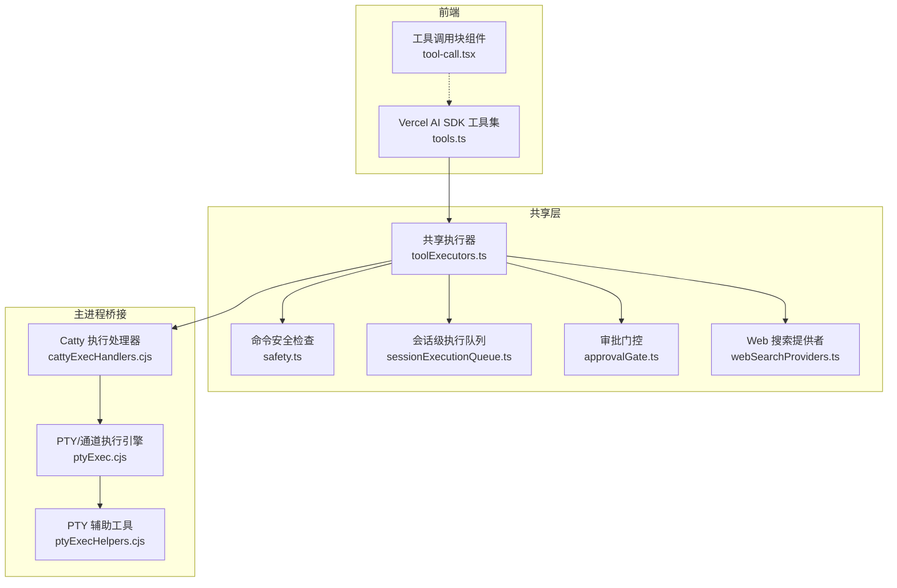
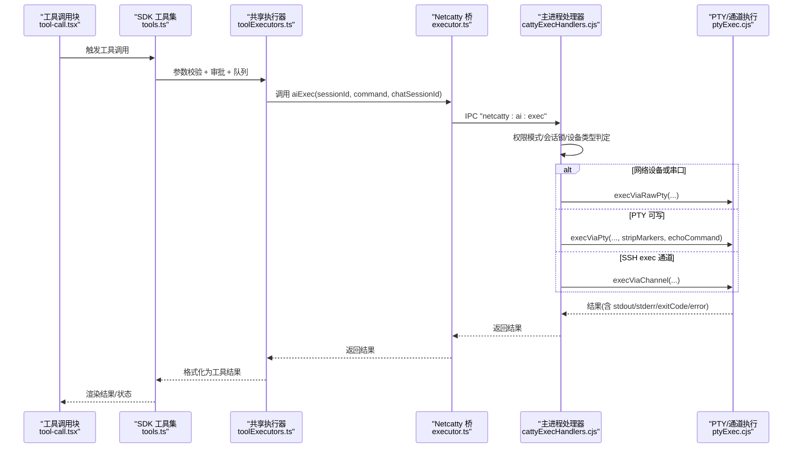
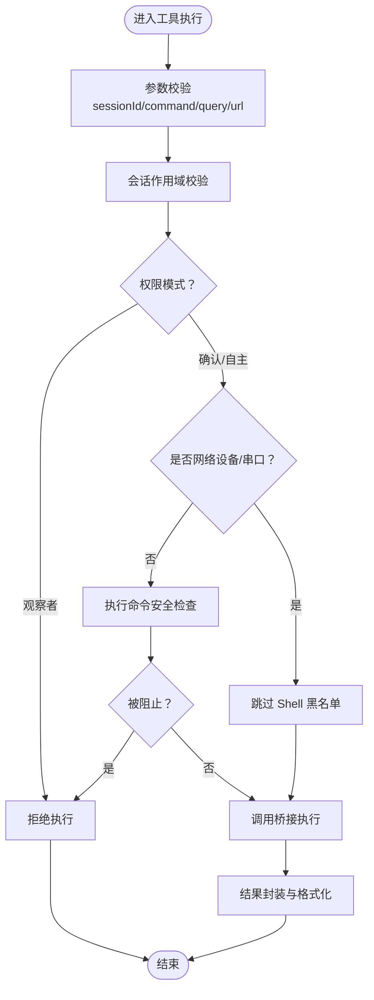
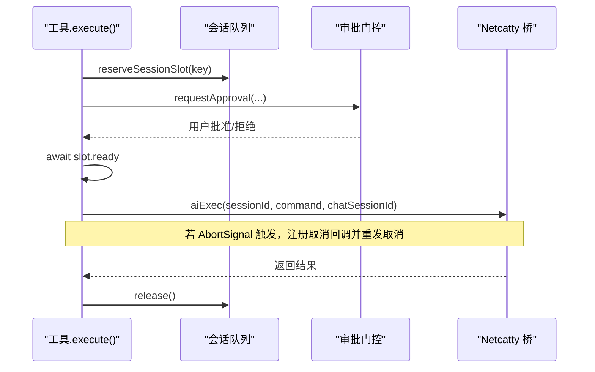
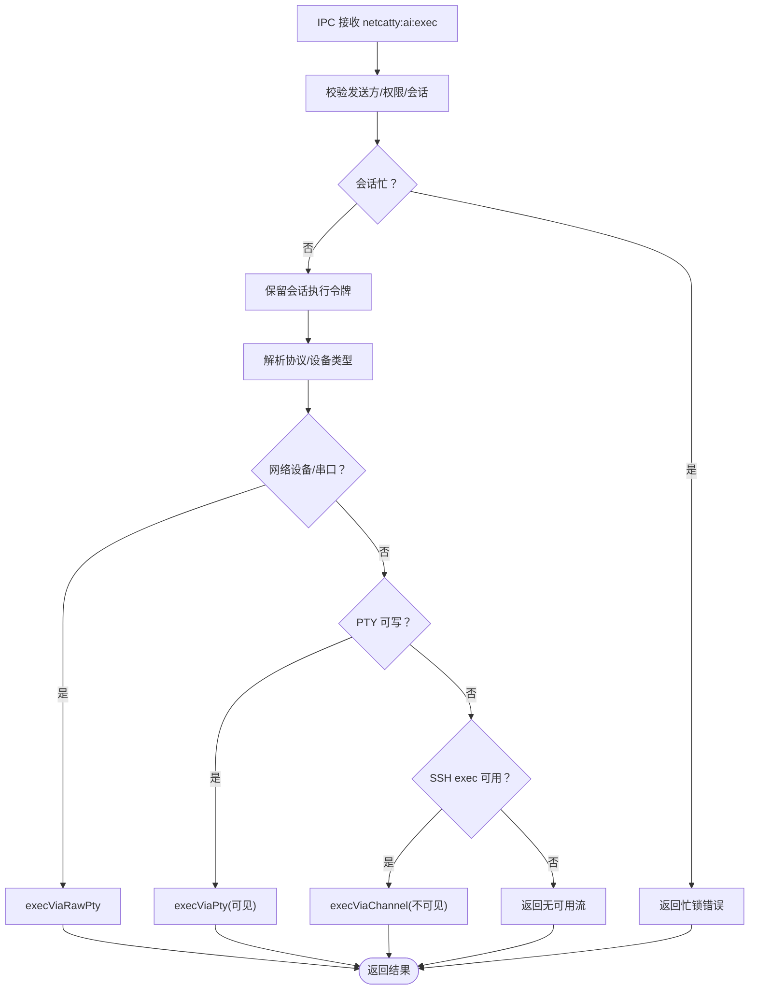
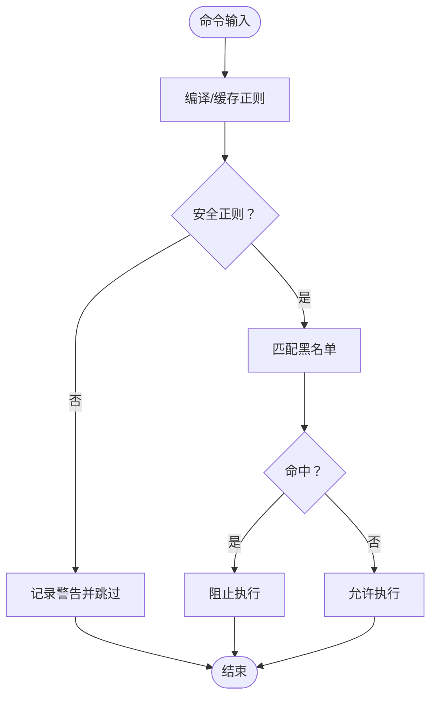
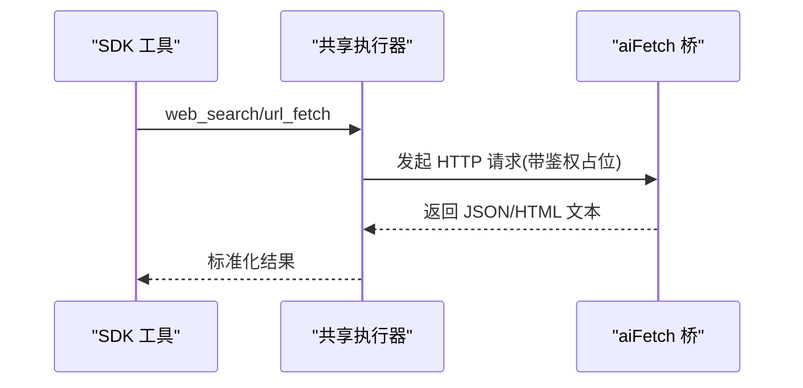
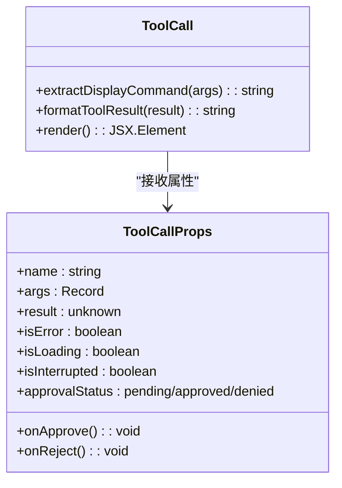
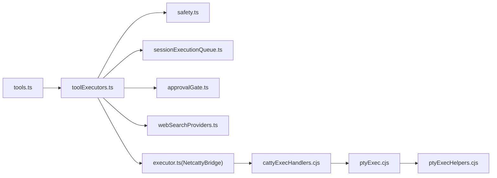
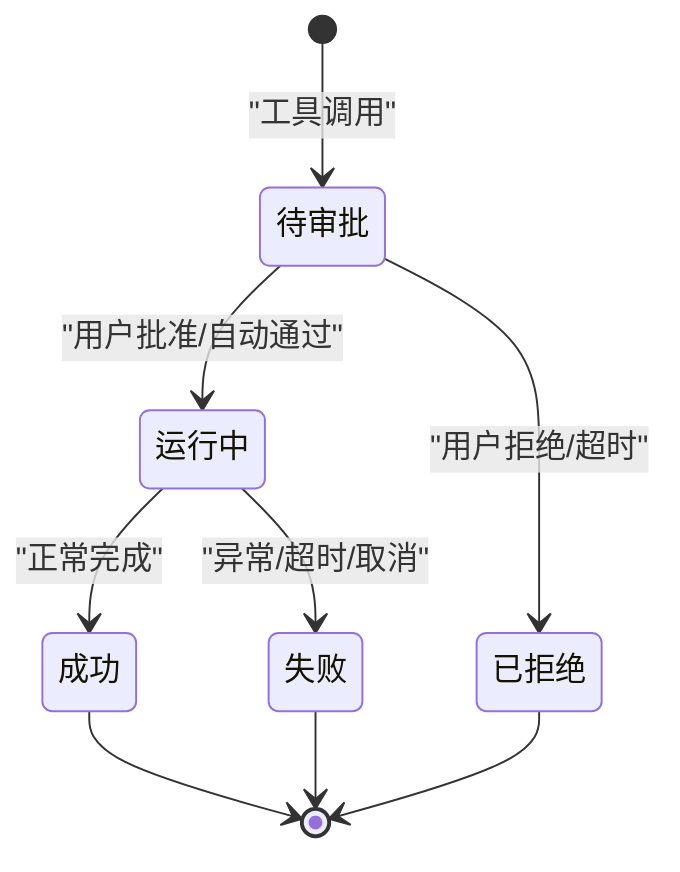

# 工具调用执行

<cite>
**本文引用的文件**
- [infrastructure/ai/shared/toolExecutors.ts](file://infrastructure/ai/shared/toolExecutors.ts)
- [infrastructure/ai/cattyAgent/executor.ts](file://infrastructure/ai/cattyAgent/executor.ts)
- [infrastructure/ai/sdk/tools.ts](file://infrastructure/ai/sdk/tools.ts)
- [infrastructure/ai/cattyAgent/safety.ts](file://infrastructure/ai/cattyAgent/safety.ts)
- [lib/commandBlocklist.cjs](file://lib/commandBlocklist.cjs)
- [lib/commandBlocklist.json](file://lib/commandBlocklist.json)
- [infrastructure/ai/types.ts](file://infrastructure/ai/types.ts)
- [infrastructure/ai/shared/approvalGate.ts](file://infrastructure/ai/shared/approvalGate.ts)
- [infrastructure/ai/shared/sessionExecutionQueue.ts](file://infrastructure/ai/shared/sessionExecutionQueue.ts)
- [infrastructure/ai/shared/webSearchProviders.ts](file://infrastructure/ai/shared/webSearchProviders.ts)
- [electron/bridges/ai/ptyExec.cjs](file://electron/bridges/ai/ptyExec.cjs)
- [electron/bridges/ai/ptyExecHelpers.cjs](file://electron/bridges/ai/ptyExecHelpers.cjs)
- [electron/bridges/aiBridge/cattyExecHandlers.cjs](file://electron/bridges/aiBridge/cattyExecHandlers.cjs)
- [components/ai-elements/tool-call.tsx](file://components/ai-elements/tool-call.tsx)
- [skills/netcatty-tool-cli/SKILL.md](file://skills/netcatty-tool-cli/SKILL.md)
</cite>

## 目录
1. [简介](#简介)
2. [项目结构](#项目结构)
3. [核心组件](#核心组件)
4. [架构总览](#架构总览)
5. [详细组件分析](#详细组件分析)
6. [依赖关系分析](#依赖关系分析)
7. [性能考量](#性能考量)
8. [故障排查指南](#故障排查指南)
9. [结论](#结论)
10. [附录](#附录)

## 简介
本文件围绕“工具调用执行”能力进行系统化技术文档编写，覆盖工具注册、参数校验、执行调度、结果处理、生命周期管理、安全控制、可视化呈现与开发指南。重点聚焦于终端命令执行、工作区信息查询、网络设备/串口执行、Web 搜索与 URL 抓取等内置工具在前端 SDK 与后端 Electron 主进程之间的协作机制。

## 项目结构
工具调用执行涉及三层：前端 Vercel AI SDK 工具层、共享执行器层（跨 SDK 与 Catty Agent）、Electron 主进程桥接层。下图展示关键模块与交互路径：

**图表来源**
- [infrastructure/ai/sdk/tools.ts:33-176](file://infrastructure/ai/sdk/tools.ts#L33-L176)
- [infrastructure/ai/shared/toolExecutors.ts:1-240](file://infrastructure/ai/shared/toolExecutors.ts#L1-L240)
- [infrastructure/ai/cattyAgent/safety.ts:1-99](file://infrastructure/ai/cattyAgent/safety.ts#L1-L99)
- [infrastructure/ai/shared/sessionExecutionQueue.ts:1-128](file://infrastructure/ai/shared/sessionExecutionQueue.ts#L1-L128)
- [infrastructure/ai/shared/approvalGate.ts:1-261](file://infrastructure/ai/shared/approvalGate.ts#L1-L261)
- [infrastructure/ai/shared/webSearchProviders.ts:1-215](file://infrastructure/ai/shared/webSearchProviders.ts#L1-L215)
- [electron/bridges/aiBridge/cattyExecHandlers.cjs:1-163](file://electron/bridges/aiBridge/cattyExecHandlers.cjs#L1-L163)
- [electron/bridges/ai/ptyExec.cjs:1-916](file://electron/bridges/ai/ptyExec.cjs#L1-L916)
- [electron/bridges/ai/ptyExecHelpers.cjs:1-353](file://electron/bridges/ai/ptyExecHelpers.cjs#L1-L353)

**章节来源**
- [infrastructure/ai/sdk/tools.ts:33-176](file://infrastructure/ai/sdk/tools.ts#L33-L176)
- [infrastructure/ai/shared/toolExecutors.ts:1-240](file://infrastructure/ai/shared/toolExecutors.ts#L1-L240)
- [electron/bridges/aiBridge/cattyExecHandlers.cjs:1-163](file://electron/bridges/aiBridge/cattyExecHandlers.cjs#L1-L163)

## 核心组件
- 共享执行器（Shared Tool Executors）
  - 提供统一的工具执行逻辑封装，包含参数校验、安全策略、桥接调用与结果格式化。
  - 内置工具：终端命令执行、工作区信息查询、会话信息查询、Web 搜索、URL 抓取。
- 前端 SDK 工具集（Vercel AI SDK）
  - 使用 `tool()` 包装共享执行器，支持参数模式校验、审批门控、会话级串行队列、中止信号与取消桥接。
- 审批门控（Approval Gate）
  - 统一的用户审批请求/响应机制，支持超时自动拒绝、跨会话清理、MCP/ACP 审批桥接。
- 会话执行队列（Session Execution Queue）
  - 针对同一会话的工具调用进行串行化，保证 LLM 多并发工具调用在桥接侧按顺序执行。
- 命令安全（Safety）
  - 默认与用户自定义命令黑名单，正则编译缓存与安全正则检测，避免 ReDoS。
- 主进程桥接（Catty Exec Handlers）
  - 负责 IPC 接收、权限模式校验、会话锁、网络设备/串口/PTY/SSH 通道执行分发。
- PTY 执行引擎（ptyExec.cjs）
  - 统一封装 PTY/SSH/串口执行，标记检测、提示符驱动完成、超时与取消、输出裁剪与规范化。
- 可视化工具调用块（tool-call.tsx）
  - 展示工具名、参数、结果、状态图标、审批状态与内联批准按钮。

**章节来源**
- [infrastructure/ai/shared/toolExecutors.ts:66-240](file://infrastructure/ai/shared/toolExecutors.ts#L66-L240)
- [infrastructure/ai/sdk/tools.ts:43-176](file://infrastructure/ai/sdk/tools.ts#L43-L176)
- [infrastructure/ai/shared/approvalGate.ts:53-185](file://infrastructure/ai/shared/approvalGate.ts#L53-L185)
- [infrastructure/ai/shared/sessionExecutionQueue.ts:58-95](file://infrastructure/ai/shared/sessionExecutionQueue.ts#L58-L95)
- [infrastructure/ai/cattyAgent/safety.ts:76-98](file://infrastructure/ai/cattyAgent/safety.ts#L76-L98)
- [electron/bridges/aiBridge/cattyExecHandlers.cjs:4-148](file://electron/bridges/aiBridge/cattyExecHandlers.cjs#L4-L148)
- [electron/bridges/ai/ptyExec.cjs:27-564](file://electron/bridges/ai/ptyExec.cjs#L27-L564)
- [components/ai-elements/tool-call.tsx:132-315](file://components/ai-elements/tool-call.tsx#L132-L315)

## 架构总览
下图展示从前端工具调用到主进程执行的关键序列：

**图表来源**
- [infrastructure/ai/sdk/tools.ts:53-114](file://infrastructure/ai/sdk/tools.ts#L53-L114)
- [infrastructure/ai/shared/toolExecutors.ts:66-116](file://infrastructure/ai/shared/toolExecutors.ts#L66-L116)
- [infrastructure/ai/cattyAgent/executor.ts:97-162](file://infrastructure/ai/cattyAgent/executor.ts#L97-L162)
- [electron/bridges/aiBridge/cattyExecHandlers.cjs:4-148](file://electron/bridges/aiBridge/cattyExecHandlers.cjs#L4-L148)
- [electron/bridges/ai/ptyExec.cjs:583-585](file://electron/bridges/ai/ptyExec.cjs#L583-L585)

## 详细组件分析

### 组件一：共享执行器（工具注册与执行）
- 工具注册
  - Catty Agent 执行器通过 switch-case 注册工具名称到具体执行函数。
  - SDK 工具集通过 `tool()` 包装共享执行器，提供参数模式校验与可选审批。
- 参数验证与安全
  - 终端执行：校验会话存在性、权限模式、网络设备/串口豁免、命令安全策略。
  - Web 搜索：校验配置可用性与查询参数。
  - URL 抓取：校验 URL 协议与长度限制。
- 结果格式化
  - 终端执行：标准化 STDOUT/STDERR/退出码文本块；网络设备返回 null 退出码。
  - 其他工具：默认 JSON 序列化。

**图表来源**
- [infrastructure/ai/shared/toolExecutors.ts:66-116](file://infrastructure/ai/shared/toolExecutors.ts#L66-L116)
- [infrastructure/ai/cattyAgent/safety.ts:76-98](file://infrastructure/ai/cattyAgent/safety.ts#L76-L98)
- [infrastructure/ai/types.ts:178-180](file://infrastructure/ai/types.ts#L178-L180)

**章节来源**
- [infrastructure/ai/cattyAgent/executor.ts:110-162](file://infrastructure/ai/cattyAgent/executor.ts#L110-L162)
- [infrastructure/ai/sdk/tools.ts:43-176](file://infrastructure/ai/sdk/tools.ts#L43-L176)
- [infrastructure/ai/shared/toolExecutors.ts:66-240](file://infrastructure/ai/shared/toolExecutors.ts#L66-L240)

### 组件二：前端 SDK 工具集（参数校验、审批、队列与取消）
- 参数校验：使用 Zod Schema 对输入进行严格校验。
- 审批门控：在确认模式下弹出审批卡片，支持超时自动拒绝与键盘快捷键。
- 会话级串行队列：先保留槽位，再等待审批与中止信号，确保顺序一致性。
- 取消与中止：监听 AbortSignal 并在必要时重发取消 IPC，避免竞态。

**图表来源**
- [infrastructure/ai/sdk/tools.ts:53-114](file://infrastructure/ai/sdk/tools.ts#L53-L114)
- [infrastructure/ai/shared/approvalGate.ts:53-108](file://infrastructure/ai/shared/approvalGate.ts#L53-L108)
- [infrastructure/ai/shared/sessionExecutionQueue.ts:58-95](file://infrastructure/ai/shared/sessionExecutionQueue.ts#L58-L95)

**章节来源**
- [infrastructure/ai/sdk/tools.ts:43-176](file://infrastructure/ai/sdk/tools.ts#L43-L176)
- [infrastructure/ai/shared/approvalGate.ts:53-185](file://infrastructure/ai/shared/approvalGate.ts#L53-L185)
- [infrastructure/ai/shared/sessionExecutionQueue.ts:58-95](file://infrastructure/ai/shared/sessionExecutionQueue.ts#L58-L95)

### 组件三：主进程桥接与执行引擎（会话锁、设备类型、执行分发）
- IPC 接收与校验：校验发送方、权限模式、会话存在与忙锁。
- 设备类型判定：区分网络设备（SSH/串口）与普通会话，决定执行路径。
- 执行分发：
  - 网络设备/串口：原始命令执行，无 Shell 包装，空退出码语义。
  - PTY 可写：可见终端执行，带标记检测与提示符驱动完成。
  - SSH exec 通道：不可见执行，适合后台任务。
- 取消与超时：统一的超时、中断与强制取消策略，保证会话不被卡死。

**图表来源**
- [electron/bridges/aiBridge/cattyExecHandlers.cjs:4-148](file://electron/bridges/aiBridge/cattyExecHandlers.cjs#L4-L148)
- [electron/bridges/ai/ptyExec.cjs:583-696](file://electron/bridges/ai/ptyExec.cjs#L583-L696)

**章节来源**
- [electron/bridges/aiBridge/cattyExecHandlers.cjs:4-148](file://electron/bridges/aiBridge/cattyExecHandlers.cjs#L4-L148)
- [electron/bridges/ai/ptyExec.cjs:583-696](file://electron/bridges/ai/ptyExec.cjs#L583-L696)

### 组件四：命令安全与黑名单（ReDoS 防护）
- 默认黑名单来自本地 JSON，包含危险命令与模式组合。
- 正则安全检测：拒绝嵌套量词与重叠交替等高风险模式。
- 编译缓存：默认黑名单预编译，用户自定义模式按需编译并缓存。

**图表来源**
- [infrastructure/ai/cattyAgent/safety.ts:76-98](file://infrastructure/ai/cattyAgent/safety.ts#L76-L98)
- [lib/commandBlocklist.json:1-18](file://lib/commandBlocklist.json#L1-L18)

**章节来源**
- [infrastructure/ai/cattyAgent/safety.ts:1-99](file://infrastructure/ai/cattyAgent/safety.ts#L1-L99)
- [lib/commandBlocklist.cjs:1-7](file://lib/commandBlocklist.cjs#L1-L7)
- [lib/commandBlocklist.json:1-18](file://lib/commandBlocklist.json#L1-L18)

### 组件五：Web 搜索与 URL 抓取（只读、跨进程安全）
- Web 搜索：根据配置选择提供者，统一结果结构，通过桥接 HTTP 请求避免 CORS。
- URL 抓取：HTTPS 校验、长度截断、UA 与 Accept 设置，返回状态码与内容。

**图表来源**
- [infrastructure/ai/shared/toolExecutors.ts:172-239](file://infrastructure/ai/shared/toolExecutors.ts#L172-L239)
- [infrastructure/ai/shared/webSearchProviders.ts:203-215](file://infrastructure/ai/shared/webSearchProviders.ts#L203-L215)

**章节来源**
- [infrastructure/ai/shared/toolExecutors.ts:172-239](file://infrastructure/ai/shared/toolExecutors.ts#L172-L239)
- [infrastructure/ai/shared/webSearchProviders.ts:1-215](file://infrastructure/ai/shared/webSearchProviders.ts#L1-L215)

### 组件六：可视化工具调用块（渲染、状态与交互）
- 命令提取：从不同工具表面提取用户可读命令，支持 CLI 包装解包。
- 结果格式化：优先解析结构化输出（stdout/stderr/exitCode），否则回退 JSON。
- 状态指示：待审批、加载中、中断、错误、成功等状态图标与颜色。
- 交互：展开/折叠、内联批准/拒绝按钮、键盘快捷键。

**图表来源**
- [components/ai-elements/tool-call.tsx:116-315](file://components/ai-elements/tool-call.tsx#L116-L315)

**章节来源**
- [components/ai-elements/tool-call.tsx:132-315](file://components/ai-elements/tool-call.tsx#L132-L315)

## 依赖关系分析
- 前端 SDK 工具集依赖共享执行器与审批门控；共享执行器依赖安全策略、会话队列与 Web 搜索提供者；主进程桥接依赖 PTY 执行引擎与辅助工具。
- 关键耦合点：
  - NetcattyBridge 接口在执行器与主进程之间传递。
  - 会话级队列与审批门控共同保证并发一致性与用户可控性。
  - PTY 引擎负责跨协议（POSIX/PowerShell/cmd/fish/串口）的统一执行与完成检测。

**图表来源**
- [infrastructure/ai/sdk/tools.ts:33-176](file://infrastructure/ai/sdk/tools.ts#L33-L176)
- [infrastructure/ai/shared/toolExecutors.ts:1-240](file://infrastructure/ai/shared/toolExecutors.ts#L1-L240)
- [infrastructure/ai/cattyAgent/executor.ts:16-36](file://infrastructure/ai/cattyAgent/executor.ts#L16-L36)
- [electron/bridges/aiBridge/cattyExecHandlers.cjs:1-163](file://electron/bridges/aiBridge/cattyExecHandlers.cjs#L1-L163)
- [electron/bridges/ai/ptyExec.cjs:1-916](file://electron/bridges/ai/ptyExec.cjs#L1-L916)
- [electron/bridges/ai/ptyExecHelpers.cjs:1-353](file://electron/bridges/ai/ptyExecHelpers.cjs#L1-L353)

**章节来源**
- [infrastructure/ai/sdk/tools.ts:33-176](file://infrastructure/ai/sdk/tools.ts#L33-L176)
- [infrastructure/ai/shared/toolExecutors.ts:1-240](file://infrastructure/ai/shared/toolExecutors.ts#L1-L240)
- [infrastructure/ai/cattyAgent/executor.ts:16-36](file://infrastructure/ai/cattyAgent/executor.ts#L16-L36)
- [electron/bridges/aiBridge/cattyExecHandlers.cjs:1-163](file://electron/bridges/aiBridge/cattyExecHandlers.cjs#L1-L163)

## 性能考量
- 输出缓冲与裁剪：PTY 引擎采用有界缓冲与可见输出裁剪，避免长时间运行命令导致内存膨胀。
- 超时与墙钟限制：支持输出空闲超时与可选墙钟超时，防止挂起作业占用资源。
- 执行串行化：会话级队列避免并发 PTY 写入竞争，减少错误与重复执行。
- 正则缓存：默认黑名单预编译，用户自定义模式按需编译并缓存，降低重复计算成本。
- 网络搜索与抓取：统一通过桥接 HTTP 访问，避免渲染进程 CORS 问题与阻塞。

[本节为通用指导，无需特定文件引用]

## 故障排查指南
- 命令被阻止
  - 检查权限模式与命令黑名单；网络设备/串口会跳过 Shell 黑名单。
  - 参考：[infrastructure/ai/cattyAgent/safety.ts:76-98](file://infrastructure/ai/cattyAgent/safety.ts#L76-L98)
- 无可用执行流
  - 确认会话协议与流状态；网络设备需要可写 PTY 或串口。
  - 参考：[electron/bridges/aiBridge/cattyExecHandlers.cjs:75-140](file://electron/bridges/aiBridge/cattyExecHandlers.cjs#L75-L140)
- 执行卡住或无法取消
  - 检查取消回调是否正确注册与触发；主进程会维护活跃执行映射。
  - 参考：[electron/bridges/ai/ptyExec.cjs:160-200](file://electron/bridges/ai/ptyExec.cjs#L160-L200)
- 审批未出现或超时
  - 确认审批门控订阅与 UI 渲染；检查会话作用域与超时设置。
  - 参考：[infrastructure/ai/shared/approvalGate.ts:53-108](file://infrastructure/ai/shared/approvalGate.ts#L53-L108)
- Web 搜索失败
  - 校验配置可用性、API Key、API Host；查看桥接返回错误。
  - 参考：[infrastructure/ai/shared/toolExecutors.ts:172-193](file://infrastructure/ai/shared/toolExecutors.ts#L172-L193)

**章节来源**
- [infrastructure/ai/cattyAgent/safety.ts:76-98](file://infrastructure/ai/cattyAgent/safety.ts#L76-L98)
- [electron/bridges/aiBridge/cattyExecHandlers.cjs:75-140](file://electron/bridges/aiBridge/cattyExecHandlers.cjs#L75-L140)
- [electron/bridges/ai/ptyExec.cjs:160-200](file://electron/bridges/ai/ptyExec.cjs#L160-L200)
- [infrastructure/ai/shared/approvalGate.ts:53-108](file://infrastructure/ai/shared/approvalGate.ts#L53-L108)
- [infrastructure/ai/shared/toolExecutors.ts:172-193](file://infrastructure/ai/shared/toolExecutors.ts#L172-L193)

## 结论
该工具调用执行体系以“共享执行器 + 前端 SDK + 主进程桥接”的分层设计实现了高内聚、低耦合的工具执行闭环。通过会话级串行队列、审批门控与命令安全策略，既保障了易用性也强化了安全性。PTY 执行引擎统一了多协议与多设备场景下的执行体验，并通过超时、取消与输出裁剪提升了稳定性与性能。

[本节为总结性内容，无需特定文件引用]

## 附录

### 工具调用生命周期管理
- 发起：前端工具调用触发，参数校验与审批（如需）。
- 调度：会话级队列保留槽位，等待审批与中止信号。
- 执行：主进程根据会话类型与设备类型选择执行路径。
- 回传：结果经桥接返回，统一格式化后渲染。
- 错误处理：超时、取消、权限、配置错误均有明确反馈。

[本图为概念流程，无需图表来源]

### 安全控制机制
- 权限模式：观察者（仅读）、确认（需审批）、自主（直接执行）。
- 命令白名单/黑名单：默认与用户自定义正则，安全正则检测。
- 资源限制：超时、墙钟超时、输出缓冲上限、最大结果数。
- 审计日志：审批超时与取消事件由门控统一管理，便于追踪。

**章节来源**
- [infrastructure/ai/types.ts:178-180](file://infrastructure/ai/types.ts#L178-L180)
- [infrastructure/ai/cattyAgent/safety.ts:76-98](file://infrastructure/ai/cattyAgent/safety.ts#L76-L98)
- [infrastructure/ai/shared/approvalGate.ts:53-108](file://infrastructure/ai/shared/approvalGate.ts#L53-L108)

### 自定义工具开发指南
- 在共享执行器中新增工具函数，遵循统一返回结构与错误处理。
- 在 SDK 工具集中使用 `tool()` 包装新工具，添加参数模式与可选审批。
- 在主进程桥接中注册 IPC 处理器，确保会话锁与设备类型判断正确。
- 在 UI 中通过工具调用块渲染新工具的结果与状态。

**章节来源**
- [infrastructure/ai/shared/toolExecutors.ts:19-35](file://infrastructure/ai/shared/toolExecutors.ts#L19-L35)
- [infrastructure/ai/sdk/tools.ts:43-176](file://infrastructure/ai/sdk/tools.ts#L43-L176)
- [electron/bridges/aiBridge/cattyExecHandlers.cjs:4-148](file://electron/bridges/aiBridge/cattyExecHandlers.cjs#L4-L148)
- [components/ai-elements/tool-call.tsx:132-315](file://components/ai-elements/tool-call.tsx#L132-L315)

### 技术要点与最佳实践
- 会话级串行化：避免并发 PTY 写入引发的竞态与错误。
- 审批前置：在保留槽位后再进行审批，保证顺序一致性。
- 取消幂等：主进程取消接口幂等，前端可在 IPC 传输窗口重发。
- 输出裁剪：对长输出进行长度限制与标记剥离，提升渲染性能。
- 配置校验：Web 搜索与 URL 抓取均进行严格参数校验与错误归一化。

**章节来源**
- [infrastructure/ai/shared/sessionExecutionQueue.ts:58-95](file://infrastructure/ai/shared/sessionExecutionQueue.ts#L58-L95)
- [infrastructure/ai/sdk/tools.ts:100-110](file://infrastructure/ai/sdk/tools.ts#L100-L110)
- [electron/bridges/ai/ptyExec.cjs:27-564](file://electron/bridges/ai/ptyExec.cjs#L27-L564)
- [infrastructure/ai/shared/toolExecutors.ts:202-239](file://infrastructure/ai/shared/toolExecutors.ts#L202-L239)