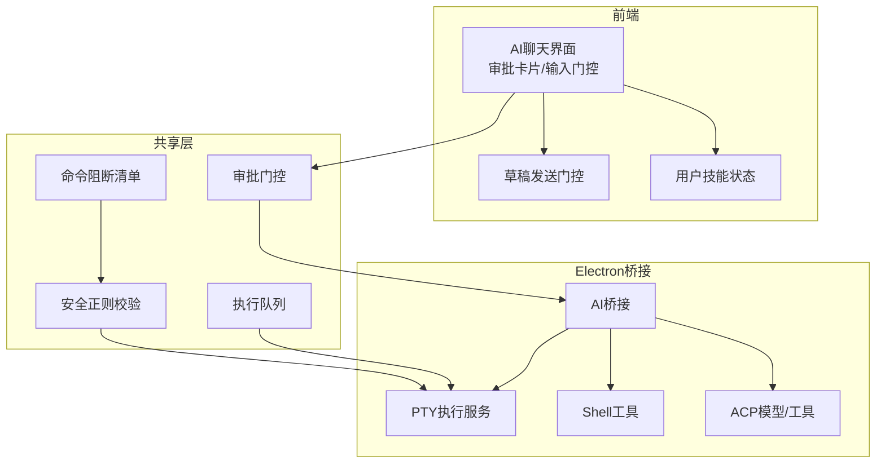
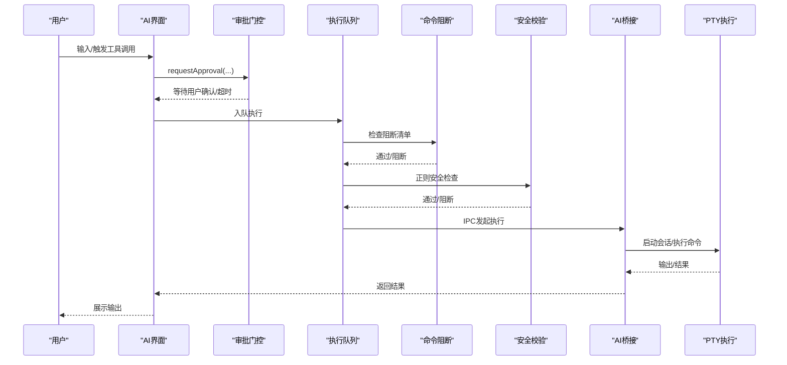
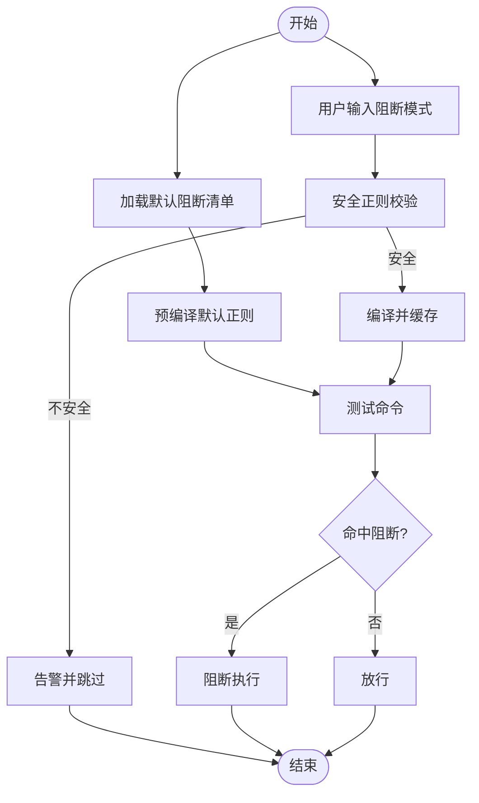
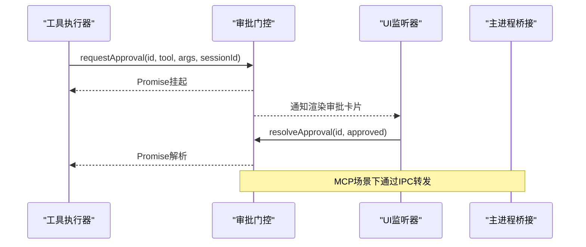
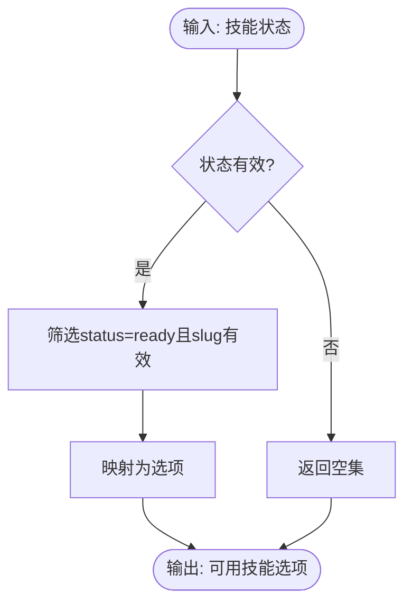
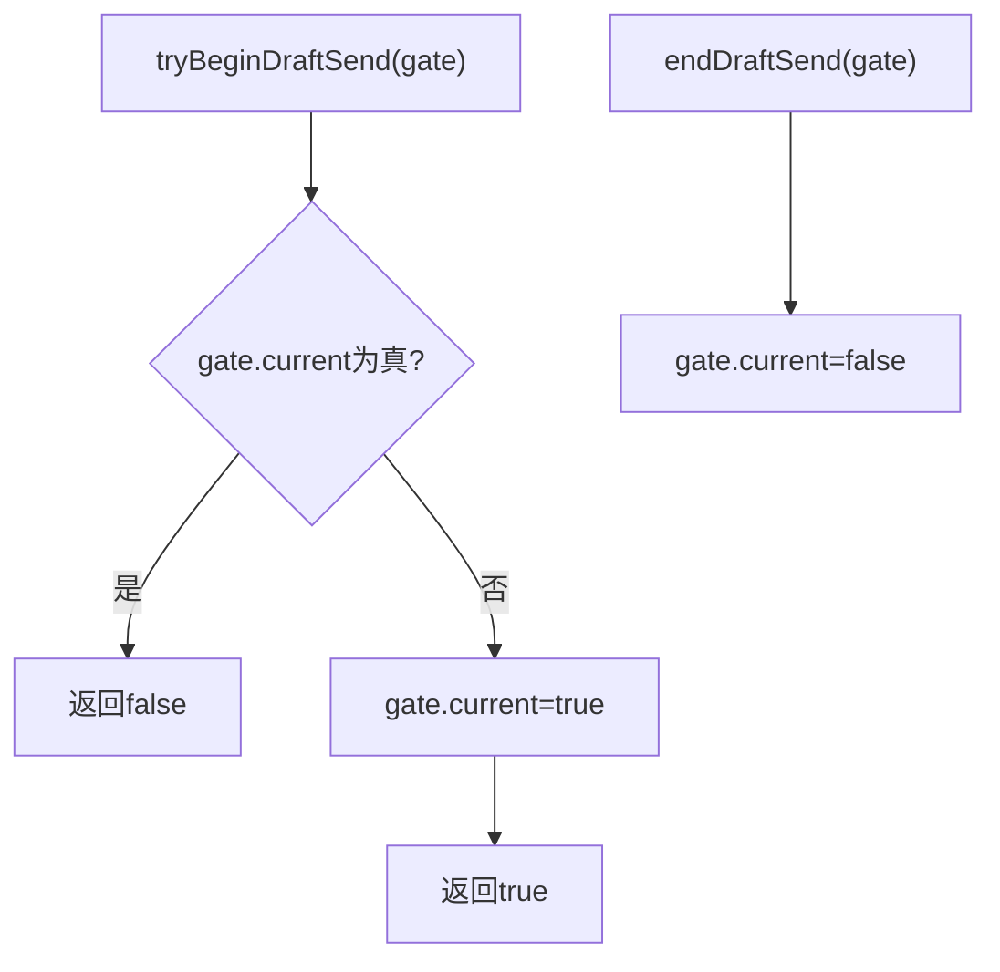
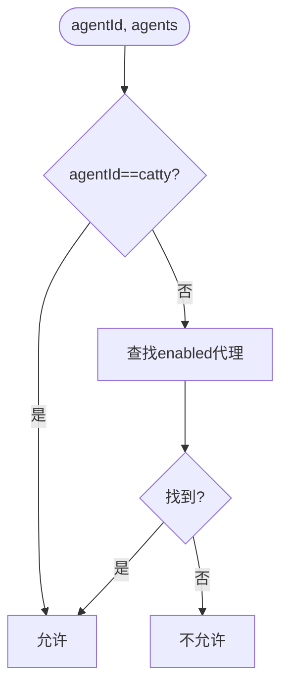
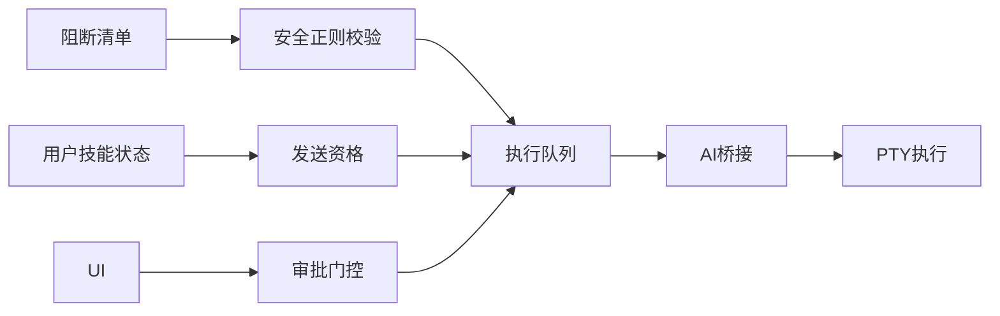

# 权限安全控制

<cite>
**本文引用的文件**
- [safety.ts](file://infrastructure/ai/cattyAgent/safety.ts)
- [commandBlocklist.cjs](file://lib/commandBlocklist.cjs)
- [commandBlocklist.json](file://lib/commandBlocklist.json)
- [approvalGate.ts](file://infrastructure/ai/shared/approvalGate.ts)
- [userSkillsState.ts](file://components/ai/userSkillsState.ts)
- [draftSendGate.ts](file://components/ai/draftSendGate.ts)
- [agentSendEligibility.ts](file://components/ai/agentSendEligibility.ts)
- [aiScopeCleanup.ts](file://application/state/aiScopeCleanup.ts)
- [sessionExecutionQueue.ts](file://infrastructure/ai/shared/sessionExecutionQueue.ts)
- [acpModels.cjs](file://electron/bridges/ai/acpModels.cjs)
- [ptyExec.cjs](file://electron/bridges/ai/ptyExec.cjs)
- [shellUtils.cjs](file://electron/bridges/ai/shellUtils.cjs)
- [aiBridge.cjs](file://electron/bridges/aiBridge.cjs)
- [aiBridge.acpRecovery.test.cjs](file://electron/bridges/aiBridge.acpRecovery.test.cjs)
- [aiBridge.cjs](file://electron/bridges/aiBridge.cjs)
- [aiBridge.test.cjs](file://electron/bridges/aiBridge.test.cjs)
- [aiBridge.acpStream.test.cjs](file://electron/bridges/aiBridge.acpStream.test.cjs)
- [aiBridge.cjs](file://electron/bridges/aiBridge.cjs)
- [aiBridge.acpRecovery.test.cjs](file://electron/bridges/aiBridge.acpRecovery.test.cjs)
- [aiBridge.cjs](file://electron/bridges/aiBridge.cjs)
- [aiBridge.test.cjs](file://electron/bridges/aiBridge.test.cjs)
- [aiBridge.acpStream.test.cjs](file://electron/bridges/aiBridge.acpStream.test.cjs)
- [aiBridge.cjs](file://electron/bridges/aiBridge.cjs)
- [aiBridge.acpRecovery.test.cjs](file://electron/bridges/aiBridge.acpRecovery.test.cjs)
- [aiBridge.cjs](file://electron/bridges/aiBridge.cjs)
- [aiBridge.test.cjs](file://electron/bridges/aiBridge.test.cjs)
- [aiBridge.acpStream.test.cjs](file://electron/bridges/aiBridge.acpStream.test.cjs)
- [aiBridge.cjs](file://electron/bridges/aiBridge.cjs)
- [aiBridge.acpRecovery.test.cjs](file://electron/bridges/aiBridge.acpRecovery.test.cjs)
- [aiBridge.cjs](file://electron/bridges/aiBridge.cjs)
- [aiBridge.test.cjs](file://electron/bridges/aiBridge.test.cjs)
- [aiBridge.acpStream.test.cjs](file://electron/bridges/aiBridge.acpStream.test.cjs)
- [aiBridge.cjs](file://electron/bridges/aiBridge.cjs)
- [aiBridge.acpRecovery.test.cjs](file://electron/bridges/aiBridge.acpRecovery.test.cjs)
- [aiBridge.cjs](file://electron/bridges/aiBridge.cjs)
- [aiBridge.test.cjs](file://electron/bridges/aiBridge.test.cjs)
- [aiBridge.acpStream.test.cjs](file://electron/bridges/aiBridge.acpStream.test.cjs)
- [aiBridge.cjs](file://electron/bridges/aiBridge.cjs)
- [aiBridge.acpRecovery.test.cjs](file://electron/bridges/aiBridge.acpRecovery.test.cjs)
- [aiBridge.cjs](file://electron/bridges/aiBridge.cjs)
- [aiBridge.test.cjs](file://electron/bridges/aiBridge.test.cjs)
- [aiBridge.acpStream.test.cjs](file://electron/bridges/aiBridge.acpStream.test.cjs)
- [aiBridge.cjs](file://electron/bridges/aiBridge.cjs)
- [aiBridge.acpRecovery.test.cjs](file://electron/bridges/aiBridge.acpRecovery.test.cjs)
- [aiBridge......](file://electron/bridges/aiBridge.cjs)
</cite>

## 目录
1. 引言
2. 项目结构
3. 核心组件
4. 架构总览
5. 详细组件分析
6. 依赖关系分析
7. 性能考量
8. 故障排查指南
9. 结论
10. 附录

## 引言
本文件面向权限与安全控制主题，系统化梳理本仓库中与“权限门控、访问控制、审批流程、审计追踪、AI代理安全防护、用户技能状态管理、作用域清理、安全策略配置”相关的实现与设计。文档以代码为依据，结合可视化图示，帮助读者从高层到细节全面理解系统的安全设计与运行机制。

## 项目结构
围绕权限与安全控制的关键目录与文件如下：
- 命令过滤与阻断清单：lib/commandBlocklist.* 与 infrastructure/ai/cattyAgent/safety.ts
- 审批门控：infrastructure/ai/shared/approvalGate.ts
- 用户技能状态管理：components/ai/userSkillsState.ts
- 发送门控（防重复提交）：components/ai/draftSendGate.ts
- 代理发送资格校验：components/ai/agentSendEligibility.ts
- 会话作用域清理：application/state/aiScopeCleanup.ts
- 会话执行队列：infrastructure/ai/shared/sessionExecutionQueue.ts
- AI桥接与主进程交互：electron/bridges/aiBridge.cjs 及其子桥（如 ptyExec.cjs、shellUtils.cjs）
- ACP模型与工具调用：electron/bridges/ai/acpModels.cjs

图表来源
- [approvalGate.ts](file://infrastructure/ai/shared/approvalGate.ts)
- [safety.ts](file://infrastructure/ai/cattyAgent/safety.ts)
- [commandBlocklist.cjs](file://lib/commandBlocklist.cjs)
- [aiBridge.cjs](file://electron/bridges/aiBridge.cjs)
- [ptyExec.cjs](file://electron/bridges/ai/ptyExec.cjs)
- [shellUtils.cjs](file://electron/bridges/ai/shellUtils.cjs)
- [acpModels.cjs](file://electron/bridges/ai/acpModels.cjs)

章节来源
- [approvalGate.ts](file://infrastructure/ai/shared/approvalGate.ts)
- [safety.ts](file://infrastructure/ai/cattyAgent/safety.ts)
- [commandBlocklist.cjs](file://lib/commandBlocklist.cjs)
- [aiBridge.cjs](file://electron/bridges/aiBridge.cjs)

## 核心组件
- 命令阻断与安全正则校验：通过默认阻断清单与安全正则检测，避免危险命令与ReDoS风险；支持默认与用户自定义模式。
- 审批门控：统一的工具执行审批请求/响应机制，支持超时自动拒绝、跨会话作用域清理、MCP/ACP桥接。
- 用户技能状态管理：对可用技能进行筛选、裁剪与映射，保障技能选择与状态一致。
- 草稿发送门控：防止重复提交，确保消息发送状态机正确。
- 代理发送资格：基于外部代理配置判断是否允许发送。
- 会话作用域清理：在会话结束或切换时清理审批、日志与临时资源，确保隐私与资源回收。
- 执行队列：串行化工具执行，降低并发风险与资源竞争。
- 桥接与执行：主进程侧通过桥接执行命令，配合安全策略与日志净化。

章节来源
- [safety.ts](file://infrastructure/ai/cattyAgent/safety.ts)
- [commandBlocklist.cjs](file://lib/commandBlocklist.cjs)
- [commandBlocklist.json](file://lib/commandBlocklist.json)
- [approvalGate.ts](file://infrastructure/ai/shared/approvalGate.ts)
- [userSkillsState.ts](file://components/ai/userSkillsState.ts)
- [draftSendGate.ts](file://components/ai/draftSendGate.ts)
- [agentSendEligibility.ts](file://components/ai/agentSendEligibility.ts)
- [aiScopeCleanup.ts](file://application/state/aiScopeCleanup.ts)
- [sessionExecutionQueue.ts](file://infrastructure/ai/shared/sessionExecutionQueue.ts)
- [ptyExec.cjs](file://electron/bridges/ai/ptyExec.cjs)
- [shellUtils.cjs](file://electron/bridges/ai/shellUtils.cjs)
- [aiBridge.cjs](file://electron/bridges/aiBridge.cjs)

## 架构总览
下图展示从用户输入到命令执行的端到端安全路径，包括审批、阻断、执行与清理：

图表来源
- [approvalGate.ts](file://infrastructure/ai/shared/approvalGate.ts)
- [sessionExecutionQueue.ts](file://infrastructure/ai/shared/sessionExecutionQueue.ts)
- [safety.ts](file://infrastructure/ai/cattyAgent/safety.ts)
- [commandBlocklist.cjs](file://lib/commandBlocklist.cjs)
- [aiBridge.cjs](file://electron/bridges/aiBridge.cjs)
- [ptyExec.cjs](file://electron/bridges/ai/ptyExec.cjs)

## 详细组件分析

### 命令阻断与安全正则校验
- 默认阻断清单来源于JSON文件，包含常见高危命令与模式，加载后预编译为正则集合，提升匹配性能。
- 安全正则校验用于规避ReDoS风险，识别嵌套量词、重叠分支等高风险模式，不安全的模式会被跳过并告警。
- 用户自定义阻断模式按需编译并缓存，避免重复开销与异常。

图表来源
- [safety.ts](file://infrastructure/ai/cattyAgent/safety.ts)
- [commandBlocklist.cjs](file://lib/commandBlocklist.cjs)
- [commandBlocklist.json](file://lib/commandBlocklist.json)

章节来源
- [safety.ts](file://infrastructure/ai/cattyAgent/safety.ts)
- [commandBlocklist.cjs](file://lib/commandBlocklist.cjs)
- [commandBlocklist.json](file://lib/commandBlocklist.json)

### 审批门控（Approval Gate）
- 统一的工具执行审批接口，支持超时自动拒绝、跨会话作用域清理、MCP/ACP桥接。
- 提供监听器订阅与重放机制，保证界面在卸载/重建后不会丢失审批状态。
- 支持全局清理与按会话清理，避免交叉干扰。

图表来源
- [approvalGate.ts](file://infrastructure/ai/shared/approvalGate.ts)

章节来源
- [approvalGate.ts](file://infrastructure/ai/shared/approvalGate.ts)

### 用户技能状态管理
- 对技能状态进行筛选与裁剪，仅保留“就绪”的可用技能，并生成选项映射。
- 支持按作用域清理无效技能，避免越权或陈旧配置导致的误用。

图表来源
- [userSkillsState.ts](file://components/ai/userSkillsState.ts)

章节来源
- [userSkillsState.ts](file://components/ai/userSkillsState.ts)

### 草稿发送门控
- 防止重复提交，通过布尔门控标记当前发送状态，确保消息发送过程中的幂等性。

图表来源
- [draftSendGate.ts](file://components/ai/draftSendGate.ts)

章节来源
- [draftSendGate.ts](file://components/ai/draftSendGate.ts)

### 代理发送资格
- 基于外部代理配置判断是否允许使用某代理发送，内置代理与外部启用代理均受控。

图表来源
- [agentSendEligibility.ts](file://components/ai/agentSendEligibility.ts)

章节来源
- [agentSendEligibility.ts](file://components/ai/agentSendEligibility.ts)

### 会话作用域清理
- 在会话结束或切换时，清理审批、日志与临时资源，确保隐私与资源回收。
- 清理范围可按会话作用域限定，避免跨会话干扰。

章节来源
- [aiScopeCleanup.ts](file://application/state/aiScopeCleanup.ts)

### 执行队列
- 将工具执行串行化，降低并发风险与资源竞争，配合阻断与审批共同构成执行前安全防线。

章节来源
- [sessionExecutionQueue.ts](file://infrastructure/ai/shared/sessionExecutionQueue.ts)

### 桥接与执行
- 主进程桥接负责实际命令执行与系统交互，前端通过审批与阻断策略进行前置控制。
- 桥接模块包括PTY执行、Shell工具、ACP模型等，形成完整的执行链路。

章节来源
- [aiBridge.cjs](file://electron/bridges/aiBridge.cjs)
- [ptyExec.cjs](file://electron/bridges/ai/ptyExec.cjs)
- [shellUtils.cjs](file://electron/bridges/ai/shellUtils.cjs)
- [acpModels.cjs](file://electron/bridges/ai/acpModels.cjs)

## 依赖关系分析
- 命令阻断依赖默认清单与安全正则校验；安全正则校验依赖默认清单与用户自定义模式。
- 审批门控被工具执行器依赖，同时向UI与主进程桥接提供统一接口。
- 执行队列串联审批与阻断，最终由桥接与PTY执行完成。
- 用户技能状态影响可选工具与发送资格，间接影响执行路径。

图表来源
- [safety.ts](file://infrastructure/ai/cattyAgent/safety.ts)
- [commandBlocklist.cjs](file://lib/commandBlocklist.cjs)
- [sessionExecutionQueue.ts](file://infrastructure/ai/shared/sessionExecutionQueue.ts)
- [aiBridge.cjs](file://electron/bridges/aiBridge.cjs)
- [ptyExec.cjs](file://electron/bridges/ai/ptyExec.cjs)
- [userSkillsState.ts](file://components/ai/userSkillsState.ts)
- [agentSendEligibility.ts](file://components/ai/agentSendEligibility.ts)

## 性能考量
- 预编译默认阻断正则，减少每次匹配的编译开销。
- 缓存用户自定义阻断正则，避免重复编译与异常捕获成本。
- 审批超时自动拒绝，防止长时间挂起占用资源。
- 执行队列串行化，降低并发带来的资源竞争与上下文切换成本。
- 桥接层采用IPC异步通信，避免阻塞UI线程。

## 故障排查指南
- 命令被误阻断
  - 检查默认阻断清单与自定义模式是否过于宽泛或存在安全风险模式。
  - 使用安全正则校验逻辑定位问题模式。
- 审批卡住或丢失
  - 确认审批监听器是否正确订阅与重放。
  - 检查会话作用域清理是否误清除了相关审批。
- 执行无响应
  - 检查执行队列是否正常推进。
  - 核对桥接与PTY执行状态。
- 技能选项异常
  - 检查技能状态是否更新，确认“就绪”状态与slug有效性。

章节来源
- [safety.ts](file://infrastructure/ai/cattyAgent/safety.ts)
- [approvalGate.ts](file://infrastructure/ai/shared/approvalGate.ts)
- [aiScopeCleanup.ts](file://application/state/aiScopeCleanup.ts)
- [sessionExecutionQueue.ts](file://infrastructure/ai/shared/sessionExecutionQueue.ts)

## 结论
本仓库在权限与安全控制方面采用了“多层防御”的设计思路：以命令阻断与安全正则作为第一道防线，以审批门控实现人机协同决策，以执行队列与会话清理保障执行过程可控与资源回收，辅以用户技能状态与代理资格管理实现细粒度的权限收敛。整体方案兼顾安全性、可观测性与可维护性，适合在复杂终端与AI交互场景中部署与扩展。

## 附录
- 设计原则建议
  - 最小权限：仅授予完成任务所需的最低权限与能力。
  - 纵深防御：阻断、审批、日志、清理等多层协同，任一层被突破仍有其他防线。
  - 透明度：审批与阻断规则应可配置、可审计、可回溯。
  - 可追溯性：完整记录工具调用、审批动作、执行结果与清理行为，便于审计与复盘。