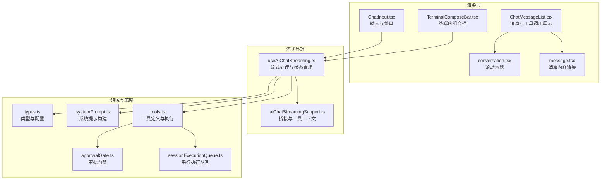
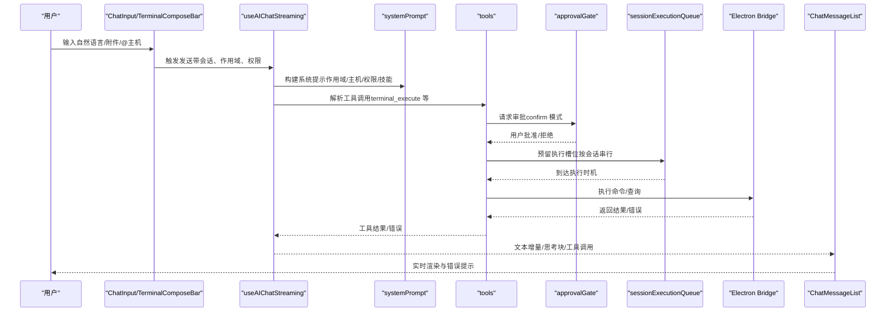
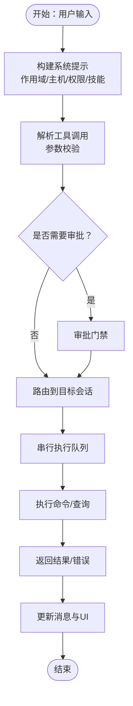
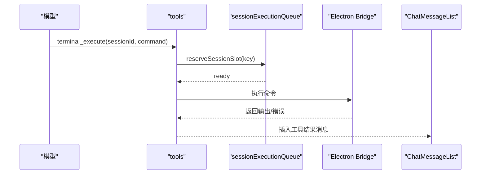
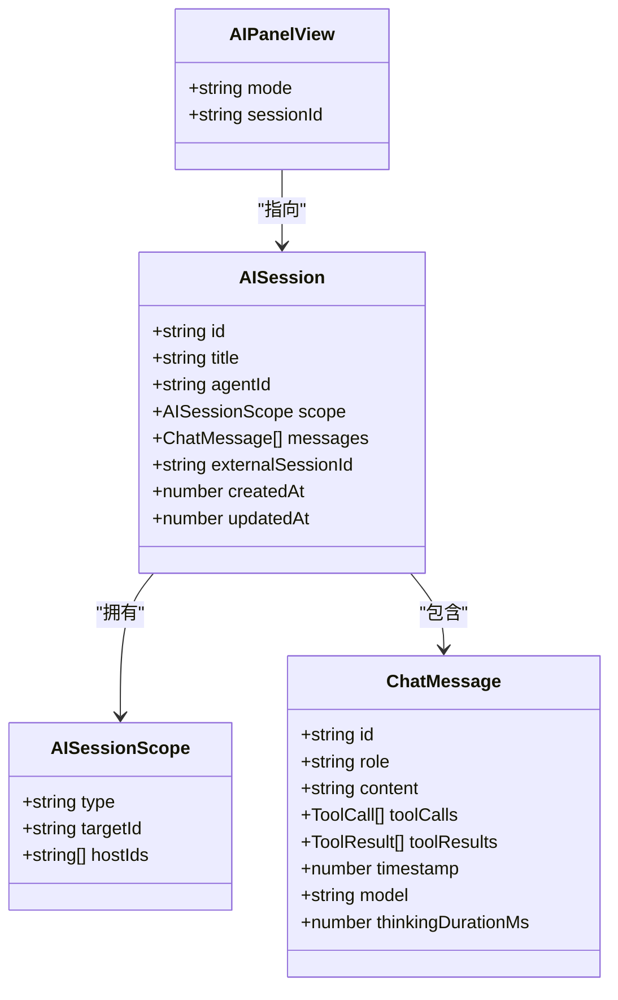
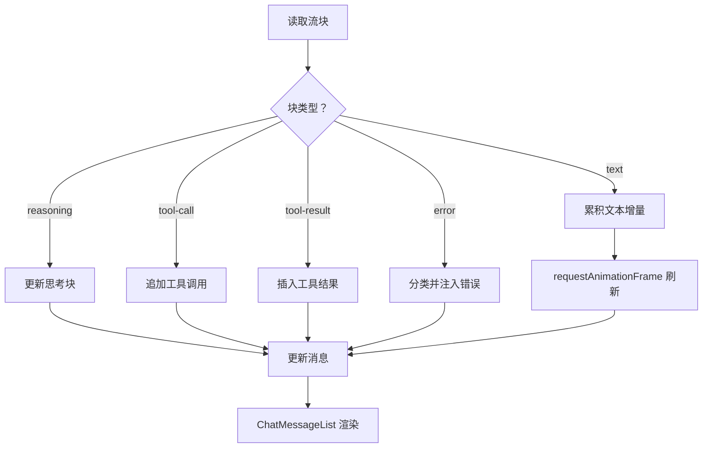
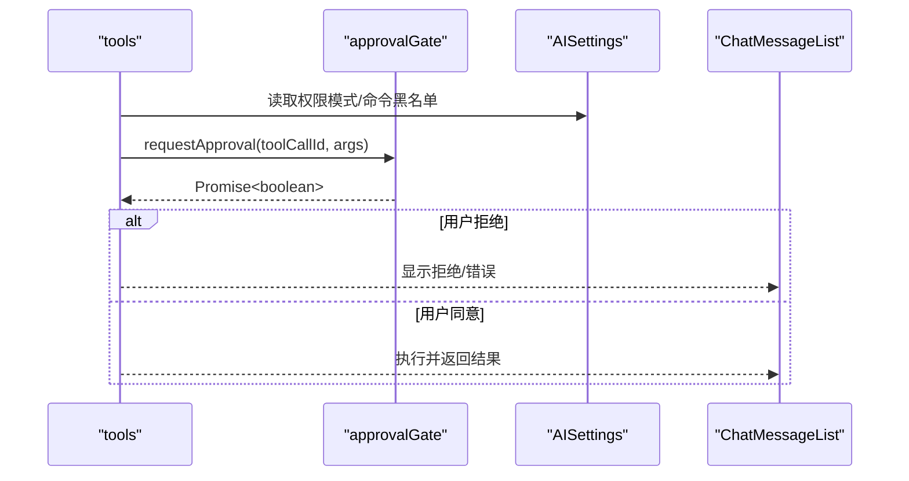
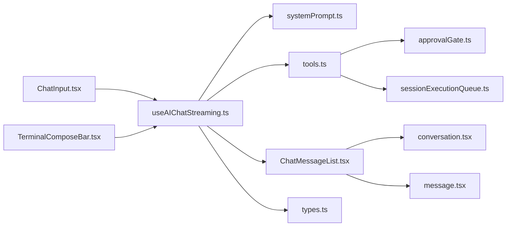

# 自然语言交互

<cite>
**本文引用的文件**
- [ChatInput.tsx](file://components/ai/ChatInput.tsx)
- [ChatMessageList.tsx](file://components/ai/ChatMessageList.tsx)
- [useAIChatStreaming.ts](file://components/ai/hooks/useAIChatStreaming.ts)
- [aiChatStreamingSupport.ts](file://components/ai/hooks/aiChatStreamingSupport.ts)
- [TerminalComposeBar.tsx](file://components/terminal/TerminalComposeBar.tsx)
- [systemPrompt.ts](file://infrastructure/ai/cattyAgent/systemPrompt.ts)
- [tools.ts](file://infrastructure/ai/sdk/tools.ts)
- [approvalGate.ts](file://infrastructure/ai/shared/approvalGate.ts)
- [sessionExecutionQueue.ts](file://infrastructure/ai/shared/sessionExecutionQueue.ts)
- [conversation.tsx](file://components/ai-elements/conversation.tsx)
- [message.tsx](file://components/ai-elements/message.tsx)
- [types.ts](file://infrastructure/ai/types.ts)
- [agentSendEligibility.ts](file://components/ai/agentSendEligibility.ts)
- [aiPanelViewState.ts](file://components/ai/aiPanelViewState.ts)
</cite>

## 目录
1. [简介](#简介)
2. [项目结构](#项目结构)
3. [核心组件](#核心组件)
4. [架构总览](#架构总览)
5. [详细组件分析](#详细组件分析)
6. [依赖关系分析](#依赖关系分析)
7. [性能考量](#性能考量)
8. [故障排查指南](#故障排查指南)
9. [结论](#结论)
10. [附录](#附录)

## 简介
本文件面向“自然语言交互”能力，系统化阐述从自然语言到命令执行的完整链路：包括意图识别与参数抽取、语法解析与工具调用、多主机操作的路由与聚合、上下文理解（会话状态、历史引用、环境感知）、流式响应的增量渲染与错误恢复、以及发送权限控制（代理可用性、命令安全校验、用户确认）。文档同时给出设计原则与最佳实践，帮助开发者在保证安全与体验的前提下扩展与优化该能力。

## 项目结构
自然语言交互由前端聊天面板、流式处理钩子、系统提示构建器、工具集、权限审批门禁、执行队列与终端组合栏等模块协同完成。整体采用“渲染层（UI）—流式处理（Hook）—领域模型（Types）—工具与策略（Approval/Queue）—系统提示（System Prompt）—终端集成（ComposeBar）”的分层组织方式。

**图表来源**
- [ChatInput.tsx:1-955](file://components/ai/ChatInput.tsx#L1-L955)
- [ChatMessageList.tsx:1-468](file://components/ai/ChatMessageList.tsx#L1-L468)
- [useAIChatStreaming.ts:1-927](file://components/ai/hooks/useAIChatStreaming.ts#L1-L927)
- [aiChatStreamingSupport.ts:1-206](file://components/ai/hooks/aiChatStreamingSupport.ts#L1-L206)
- [TerminalComposeBar.tsx:1-149](file://components/terminal/TerminalComposeBar.tsx#L1-L149)
- [systemPrompt.ts:1-142](file://infrastructure/ai/cattyAgent/systemPrompt.ts#L1-L142)
- [tools.ts:1-177](file://infrastructure/ai/sdk/tools.ts#L1-L177)
- [approvalGate.ts:1-261](file://infrastructure/ai/shared/approvalGate.ts#L1-L261)
- [sessionExecutionQueue.ts:1-128](file://infrastructure/ai/shared/sessionExecutionQueue.ts#L1-L128)
- [conversation.tsx:1-55](file://components/ai-elements/conversation.tsx#L1-L55)
- [message.tsx:1-86](file://components/ai-elements/message.tsx#L1-L86)
- [types.ts:1-348](file://infrastructure/ai/types.ts#L1-L348)

**章节来源**
- [ChatInput.tsx:1-955](file://components/ai/ChatInput.tsx#L1-L955)
- [ChatMessageList.tsx:1-468](file://components/ai/ChatMessageList.tsx#L1-L468)
- [useAIChatStreaming.ts:1-927](file://components/ai/hooks/useAIChatStreaming.ts#L1-L927)
- [aiChatStreamingSupport.ts:1-206](file://components/ai/hooks/aiChatStreamingSupport.ts#L1-L206)
- [TerminalComposeBar.tsx:1-149](file://components/terminal/TerminalComposeBar.tsx#L1-L149)
- [systemPrompt.ts:1-142](file://infrastructure/ai/cattyAgent/systemPrompt.ts#L1-L142)
- [tools.ts:1-177](file://infrastructure/ai/sdk/tools.ts#L1-L177)
- [approvalGate.ts:1-261](file://infrastructure/ai/shared/approvalGate.ts#L1-L261)
- [sessionExecutionQueue.ts:1-128](file://infrastructure/ai/shared/sessionExecutionQueue.ts#L1-L128)
- [conversation.tsx:1-55](file://components/ai-elements/conversation.tsx#L1-L55)
- [message.tsx:1-86](file://components/ai-elements/message.tsx#L1-L86)
- [types.ts:1-348](file://infrastructure/ai/types.ts#L1-L348)

## 核心组件
- 输入与上下文增强：ChatInput 提供多菜单（模型、附件、@主机、/技能）、占位符与扩展态；支持拖拽/粘贴附件、@主机提及、/技能插入等。
- 消息与工具调用展示：ChatMessageList 渲染消息、思考块、工具调用与结果，并处理待审批与错误状态。
- 流式处理与状态：useAIChatStreaming 负责 Catty Agent 与外部代理的流式处理、文本批处理刷新、错误分类上报、会话级 Abort 控制。
- 工具与权限：tools 定义 terminal_execute/workspace_get_info/url_fetch/web_search 等工具，结合 approvalGate 与 sessionExecutionQueue 实现串行与审批。
- 系统提示：systemPrompt 构建当前作用域、主机列表、权限规则与用户技能上下文，指导模型行为。
- 终端内交互：TerminalComposeBar 在终端内提供无边框输入条，Enter 发送、Esc 关闭，支持广播指示。

**章节来源**
- [ChatInput.tsx:1-955](file://components/ai/ChatInput.tsx#L1-L955)
- [ChatMessageList.tsx:1-468](file://components/ai/ChatMessageList.tsx#L1-L468)
- [useAIChatStreaming.ts:1-927](file://components/ai/hooks/useAIChatStreaming.ts#L1-L927)
- [tools.ts:1-177](file://infrastructure/ai/sdk/tools.ts#L1-L177)
- [approvalGate.ts:1-261](file://infrastructure/ai/shared/approvalGate.ts#L1-L261)
- [sessionExecutionQueue.ts:1-128](file://infrastructure/ai/shared/sessionExecutionQueue.ts#L1-L128)
- [systemPrompt.ts:1-142](file://infrastructure/ai/cattyAgent/systemPrompt.ts#L1-L142)
- [TerminalComposeBar.tsx:1-149](file://components/terminal/TerminalComposeBar.tsx#L1-L149)

## 架构总览
自然语言交互以“输入—解析—决策—执行—反馈”的闭环运行。输入层通过 ChatInput/ComposeBar 获取自然语言与上下文；流式处理层 useAIChatStreaming 将请求转为系统提示与工具调用；工具层 tools 基于 approvalGate 进行权限控制，借助 sessionExecutionQueue 保证同一会话串行执行；结果通过 ChatMessageList 实时增量渲染，错误经分类后上浮至 UI。

**图表来源**
- [useAIChatStreaming.ts:1-927](file://components/ai/hooks/useAIChatStreaming.ts#L1-L927)
- [systemPrompt.ts:1-142](file://infrastructure/ai/cattyAgent/systemPrompt.ts#L1-L142)
- [tools.ts:1-177](file://infrastructure/ai/sdk/tools.ts#L1-L177)
- [approvalGate.ts:1-261](file://infrastructure/ai/shared/approvalGate.ts#L1-L261)
- [sessionExecutionQueue.ts:1-128](file://infrastructure/ai/shared/sessionExecutionQueue.ts#L1-L128)
- [ChatMessageList.tsx:1-468](file://components/ai/ChatMessageList.tsx#L1-L468)
- [ChatInput.tsx:1-955](file://components/ai/ChatInput.tsx#L1-L955)
- [TerminalComposeBar.tsx:1-149](file://components/terminal/TerminalComposeBar.tsx#L1-L149)

## 详细组件分析

### 自然语言到命令的转换机制
- 意图识别与参数抽取：模型根据系统提示与历史消息判断任务类型（读取、执行、搜索），并通过工具调用参数（如 sessionId、command）精确化目标与动作。
- 语法解析与工具调用：工具定义使用 zod 校验，确保输入合法性；工具执行内部封装了审批、串行队列与取消信号处理。
- 多主机操作路由：工具调用携带 sessionId，系统提示包含主机列表与连接状态，便于模型在多会话间做路由决策。

**图表来源**
- [systemPrompt.ts:1-142](file://infrastructure/ai/cattyAgent/systemPrompt.ts#L1-L142)
- [tools.ts:1-177](file://infrastructure/ai/sdk/tools.ts#L1-L177)
- [approvalGate.ts:1-261](file://infrastructure/ai/shared/approvalGate.ts#L1-L261)
- [sessionExecutionQueue.ts:1-128](file://infrastructure/ai/shared/sessionExecutionQueue.ts#L1-L128)
- [useAIChatStreaming.ts:1-927](file://components/ai/hooks/useAIChatStreaming.ts#L1-L927)

**章节来源**
- [systemPrompt.ts:1-142](file://infrastructure/ai/cattyAgent/systemPrompt.ts#L1-L142)
- [tools.ts:1-177](file://infrastructure/ai/sdk/tools.ts#L1-L177)
- [approvalGate.ts:1-261](file://infrastructure/ai/shared/approvalGate.ts#L1-L261)
- [sessionExecutionQueue.ts:1-128](file://infrastructure/ai/shared/sessionExecutionQueue.ts#L1-L128)
- [useAIChatStreaming.ts:1-927](file://components/ai/hooks/useAIChatStreaming.ts#L1-L927)

### 多主机操作指令处理流程
- 目标主机选择：系统提示包含所有已连接会话的元信息（主机名、标签、协议、设备类型、连接状态），模型据此选择目标。
- 命令路由：工具调用明确指定 sessionId，确保命令只在目标会话执行。
- 结果聚合：工具结果作为独立消息插入，UI 展示工具调用与结果的对应关系；对于多工具并发场景，串行队列保证顺序一致性。

**图表来源**
- [tools.ts:1-177](file://infrastructure/ai/sdk/tools.ts#L1-L177)
- [sessionExecutionQueue.ts:1-128](file://infrastructure/ai/shared/sessionExecutionQueue.ts#L1-L128)
- [ChatMessageList.tsx:1-468](file://components/ai/ChatMessageList.tsx#L1-L468)

**章节来源**
- [tools.ts:1-177](file://infrastructure/ai/sdk/tools.ts#L1-L177)
- [sessionExecutionQueue.ts:1-128](file://infrastructure/ai/shared/sessionExecutionQueue.ts#L1-L128)
- [ChatMessageList.tsx:1-468](file://components/ai/ChatMessageList.tsx#L1-L468)

### 上下文理解与会话状态
- 会话状态维护：AI 会话包含标题、代理、作用域、消息与外部会话标识；面板视图解析逻辑支持草稿与历史会话的切换与持久化。
- 历史信息引用：系统提示包含历史消息中的工具调用与结果，确保模型能基于上下文进行推理。
- 环境感知：系统提示包含主机的协议、设备类型、连接状态等，避免对断开或特殊设备（串口/网络设备）发出不兼容命令。

**图表来源**
- [types.ts:160-177](file://infrastructure/ai/types.ts#L160-L177)
- [types.ts:93-123](file://infrastructure/ai/types.ts#L93-L123)
- [aiPanelViewState.ts:1-95](file://components/ai/aiPanelViewState.ts#L1-L95)

**章节来源**
- [types.ts:160-177](file://infrastructure/ai/types.ts#L160-L177)
- [types.ts:93-123](file://infrastructure/ai/types.ts#L93-L123)
- [aiPanelViewState.ts:1-95](file://components/ai/aiPanelViewState.ts#L1-L95)

### 流式响应处理机制
- 实时数据传输：useAIChatStreaming 使用 Vercel AI SDK 的 fullStream，按文本增量与思考块推送；同时支持外部代理的 ACP 流式回调。
- 增量更新：文本增量采用 requestAnimationFrame 批处理刷新，减少重绘；思考块与工具调用分别更新对应消息。
- 错误恢复：错误被分类并注入到最新助手消息中，支持重试提示；Abort 控制与超时清理防止资源泄漏。

**图表来源**
- [useAIChatStreaming.ts:243-514](file://components/ai/hooks/useAIChatStreaming.ts#L243-L514)
- [ChatMessageList.tsx:1-468](file://components/ai/ChatMessageList.tsx#L1-L468)

**章节来源**
- [useAIChatStreaming.ts:243-514](file://components/ai/hooks/useAIChatStreaming.ts#L243-L514)
- [ChatMessageList.tsx:1-468](file://components/ai/ChatMessageList.tsx#L1-L468)

### 发送权限控制
- 代理可用性检查：支持内置 Catty Agent 与外部 ACP 代理；发送前检查代理启用状态与可用性。
- 命令安全性验证：全局命令黑名单与工具层安全检查双重保障；web_search 仅在配置就绪时启用。
- 用户确认流程：在 confirm 模式下，工具执行前弹出审批卡片，支持超时自动拒绝与跨会话清理。

**图表来源**
- [tools.ts:1-177](file://infrastructure/ai/sdk/tools.ts#L1-L177)
- [approvalGate.ts:1-261](file://infrastructure/ai/shared/approvalGate.ts#L1-L261)
- [types.ts:264-277](file://infrastructure/ai/types.ts#L264-L277)
- [agentSendEligibility.ts:1-16](file://components/ai/agentSendEligibility.ts#L1-L16)

**章节来源**
- [tools.ts:1-177](file://infrastructure/ai/sdk/tools.ts#L1-L177)
- [approvalGate.ts:1-261](file://infrastructure/ai/shared/approvalGate.ts#L1-L261)
- [types.ts:264-277](file://infrastructure/ai/types.ts#L264-L277)
- [agentSendEligibility.ts:1-16](file://components/ai/agentSendEligibility.ts#L1-L16)

### 设计原则与最佳实践
- 用户体验优化：输入栏支持多菜单、附件、@主机与/技能；消息列表自动滚动到底，工具调用与结果清晰分层。
- 响应时间控制：文本增量批处理与思考块分离渲染，降低 UI 抖动；串行队列避免会话拥塞。
- 错误处理：统一错误分类与可重试提示；Abort 与超时清理确保资源回收；审批超时自动拒绝防止卡死。

**章节来源**
- [ChatInput.tsx:1-955](file://components/ai/ChatInput.tsx#L1-L955)
- [ChatMessageList.tsx:1-468](file://components/ai/ChatMessageList.tsx#L1-L468)
- [useAIChatStreaming.ts:1-927](file://components/ai/hooks/useAIChatStreaming.ts#L1-L927)
- [approvalGate.ts:1-261](file://infrastructure/ai/shared/approvalGate.ts#L1-L261)

## 依赖关系分析
- 组件耦合：ChatInput/ComposeBar 与 useAIChatStreaming 强耦合；ChatMessageList 与 approvalGate 通过事件订阅弱耦合。
- 外部依赖：Vercel AI SDK 的 streamText 与 fullStream；Electron Bridge 提供 IPC 能力；Streamdown 用于 Markdown 渲染。
- 循环依赖：未发现循环导入；工具与审批门禁通过函数调用解耦。

**图表来源**
- [ChatInput.tsx:1-955](file://components/ai/ChatInput.tsx#L1-L955)
- [TerminalComposeBar.tsx:1-149](file://components/terminal/TerminalComposeBar.tsx#L1-L149)
- [useAIChatStreaming.ts:1-927](file://components/ai/hooks/useAIChatStreaming.ts#L1-L927)
- [systemPrompt.ts:1-142](file://infrastructure/ai/cattyAgent/systemPrompt.ts#L1-L142)
- [tools.ts:1-177](file://infrastructure/ai/sdk/tools.ts#L1-L177)
- [approvalGate.ts:1-261](file://infrastructure/ai/shared/approvalGate.ts#L1-L261)
- [sessionExecutionQueue.ts:1-128](file://infrastructure/ai/shared/sessionExecutionQueue.ts#L1-L128)
- [ChatMessageList.tsx:1-468](file://components/ai/ChatMessageList.tsx#L1-L468)
- [conversation.tsx:1-55](file://components/ai-elements/conversation.tsx#L1-L55)
- [message.tsx:1-86](file://components/ai-elements/message.tsx#L1-L86)
- [types.ts:1-348](file://infrastructure/ai/types.ts#L1-L348)

**章节来源**
- [ChatInput.tsx:1-955](file://components/ai/ChatInput.tsx#L1-L955)
- [TerminalComposeBar.tsx:1-149](file://components/terminal/TerminalComposeBar.tsx#L1-L149)
- [useAIChatStreaming.ts:1-927](file://components/ai/hooks/useAIChatStreaming.ts#L1-L927)
- [systemPrompt.ts:1-142](file://infrastructure/ai/cattyAgent/systemPrompt.ts#L1-L142)
- [tools.ts:1-177](file://infrastructure/ai/sdk/tools.ts#L1-L177)
- [approvalGate.ts:1-261](file://infrastructure/ai/shared/approvalGate.ts#L1-L261)
- [sessionExecutionQueue.ts:1-128](file://infrastructure/ai/shared/sessionExecutionQueue.ts#L1-L128)
- [ChatMessageList.tsx:1-468](file://components/ai/ChatMessageList.tsx#L1-L468)
- [conversation.tsx:1-55](file://components/ai-elements/conversation.tsx#L1-L55)
- [message.tsx:1-86](file://components/ai-elements/message.tsx#L1-L86)
- [types.ts:1-348](file://infrastructure/ai/types.ts#L1-L348)

## 性能考量
- 文本渲染批处理：使用 requestAnimationFrame 合并多次文本增量更新，降低重排与重绘成本。
- 串行执行队列：同一会话内串行化命令执行，避免 PTY 竞态与错误序列导致的 API 拒绝。
- 内存与资源：Abort 控制与超时清理确保长时间流式过程不会泄漏；审批超时自动拒绝避免 UI 卡顿。
- UI 滚动：使用“粘底”滚动容器，仅在底部时显示“回到底部”按钮，减少不必要的滚动计算。

[本节为通用性能建议，无需特定文件引用]

## 故障排查指南
- 流式错误分类：查看错误信息的类型与可重试标记，定位网络、认证、超时或供应商问题。
- 审批超时：若审批卡片长时间存在，检查 approvalGate 的超时设置与会话清理逻辑。
- 工具结果异常：检查工具返回的错误对象或字符串化 JSON 中的 error 字段，确认是否为阻断式错误。
- 会话串行阻塞：若命令迟迟不执行，确认 sessionExecutionQueue 是否有积压任务或会话已被关闭。

**章节来源**
- [useAIChatStreaming.ts:212-237](file://components/ai/hooks/useAIChatStreaming.ts#L212-L237)
- [approvalGate.ts:18-261](file://infrastructure/ai/shared/approvalGate.ts#L18-L261)
- [aiChatStreamingSupport.ts:49-73](file://components/ai/hooks/aiChatStreamingSupport.ts#L49-L73)
- [sessionExecutionQueue.ts:58-95](file://infrastructure/ai/shared/sessionExecutionQueue.ts#L58-L95)

## 结论
该自然语言交互体系以系统提示与工具调用为核心，结合审批门禁与串行执行队列，在保证安全与一致性的前提下实现了多主机命令的自然语言编排。通过流式渲染与上下文感知，系统在易用性与可靠性之间取得平衡。后续可在代理生态、Web 搜索与用户技能上下文方面进一步扩展，同时持续优化流式性能与错误恢复策略。

[本节为总结性内容，无需特定文件引用]

## 附录
- 终端内组合栏：提供沉浸式输入体验，支持广播指示与主题色适配。
- 面板视图解析：支持草稿与历史会话的自动切换与持久化，提升会话连续性。

**章节来源**
- [TerminalComposeBar.tsx:1-149](file://components/terminal/TerminalComposeBar.tsx#L1-L149)
- [aiPanelViewState.ts:1-95](file://components/ai/aiPanelViewState.ts#L1-L95)