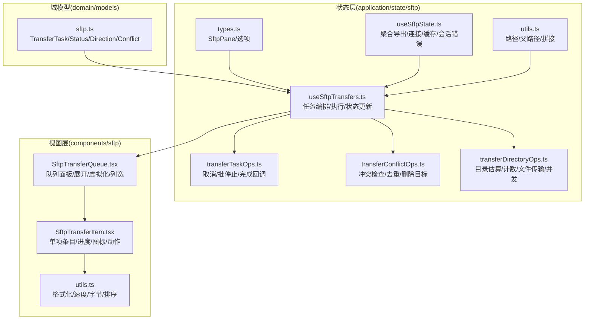
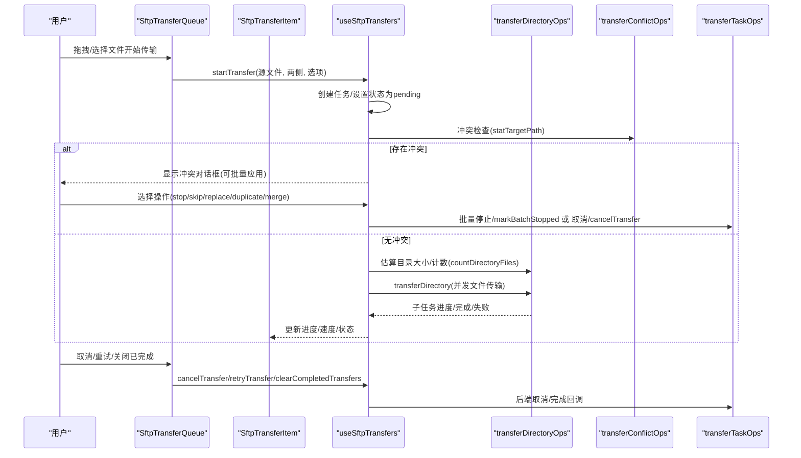
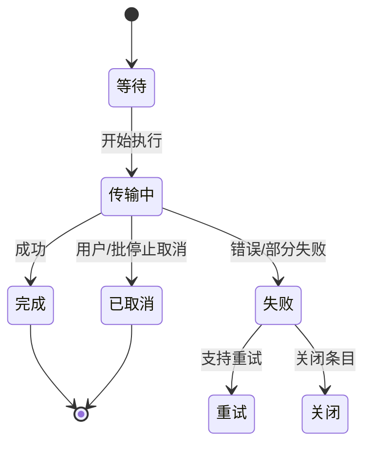
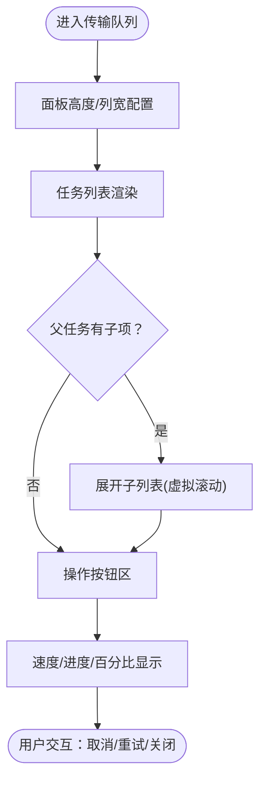
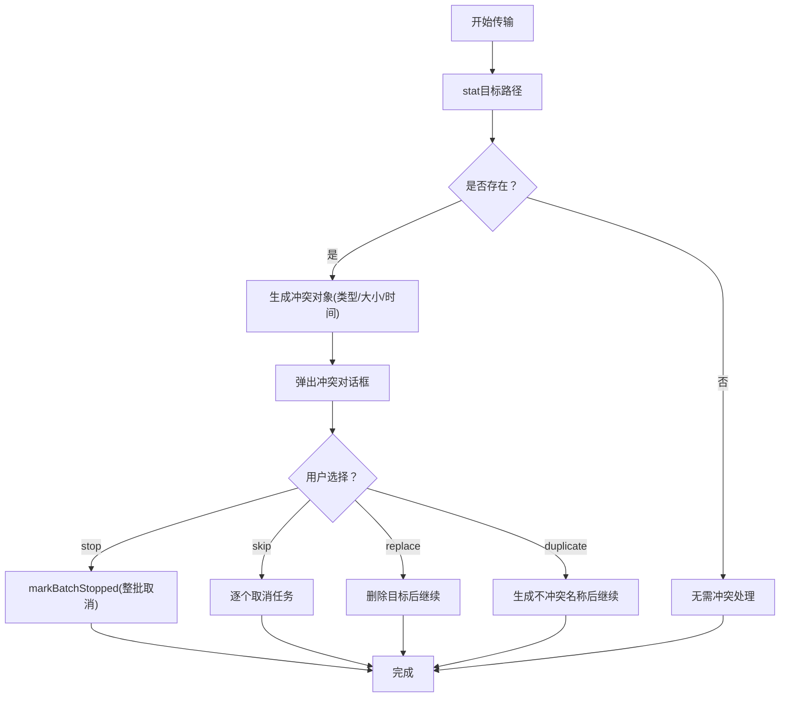
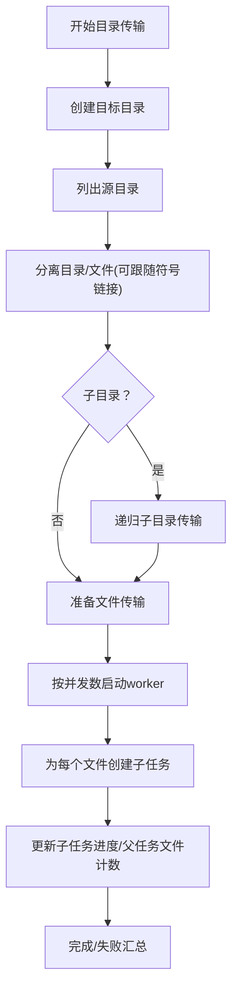
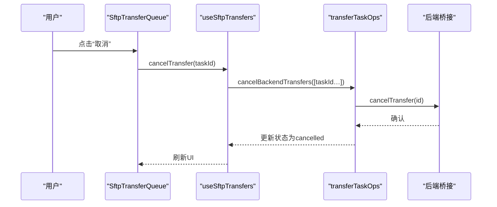
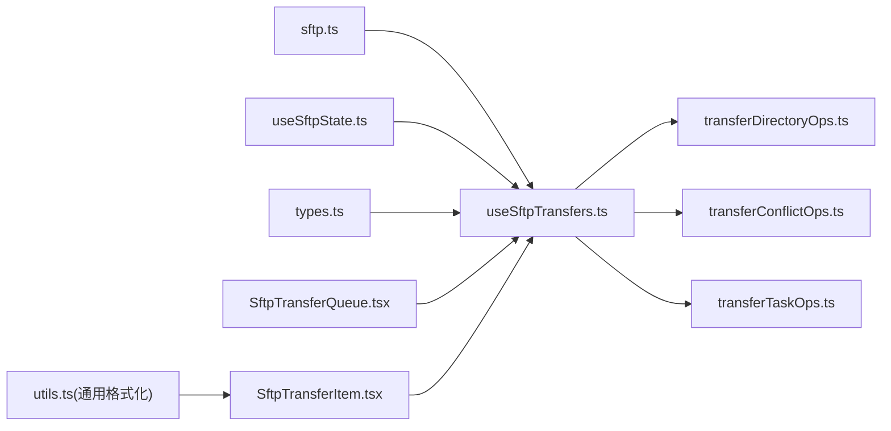

# 传输队列管理

<cite>
**本文引用的文件**
- [useSftpTransfers.ts](file://application/state/sftp/useSftpTransfers.ts)
- [useSftpTransfers.types.ts](file://application/state/sftp/useSftpTransfers.types.ts)
- [transferTaskOps.ts](file://application/state/sftp/transferTaskOps.ts)
- [transferConflictOps.ts](file://application/state/sftp/transferConflictOps.ts)
- [transferDirectoryOps.ts](file://application/state/sftp/transferDirectoryOps.ts)
- [types.ts](file://application/state/sftp/types.ts)
- [useSftpState.ts](file://application/state/useSftpState.ts)
- [SftpTransferQueue.tsx](file://components/sftp/SftpTransferQueue.tsx)
- [SftpTransferItem.tsx](file://components/sftp/SftpTransferItem.tsx)
- [sftp.ts](file://domain/models/sftp.ts)
- [utils.ts（SFTP工具）](file://application/state/sftp/utils.ts)
- [utils.ts（通用格式化）](file://components/sftp/utils.ts)
</cite>

## 目录
1. [简介](#简介)
2. [项目结构](#项目结构)
3. [核心组件](#核心组件)
4. [架构总览](#架构总览)
5. [详细组件分析](#详细组件分析)
6. [依赖关系分析](#依赖关系分析)
7. [性能考量](#性能考量)
8. [故障排查指南](#故障排查指南)
9. [结论](#结论)
10. [附录](#附录)

## 简介
本指南面向SFTP传输队列管理功能的使用者与维护者，系统讲解传输任务从创建到完成的全生命周期管理、界面交互与状态可视化、操作能力（暂停/恢复、取消、重试、删除已完成）、冲突处理与错误机制、以及性能优化与最佳实践。通过代码级分析与可视化图示，帮助读者快速理解并高效使用传输队列。

## 项目结构
传输队列相关代码主要分布在以下区域：
- 域模型：定义传输任务、状态、方向、冲突等数据结构
- 状态层：负责任务编排、冲突检测、目录递归传输、并发控制
- 视图层：传输队列面板与单项条目渲染、进度与状态展示、交互按钮

图表来源
- [sftp.ts:29-79](file://domain/models/sftp.ts#L29-L79)
- [useSftpTransfers.ts:19-600](file://application/state/sftp/useSftpTransfers.ts#L19-L600)
- [transferTaskOps.ts:16-115](file://application/state/sftp/transferTaskOps.ts#L16-L115)
- [transferConflictOps.ts:7-105](file://application/state/sftp/transferConflictOps.ts#L7-L105)
- [transferDirectoryOps.ts:17-455](file://application/state/sftp/transferDirectoryOps.ts#L17-L455)
- [types.ts:3-44](file://application/state/sftp/types.ts#L3-L44)
- [useSftpState.ts:33-200](file://application/state/useSftpState.ts#L33-L200)
- [SftpTransferQueue.tsx:150-455](file://components/sftp/SftpTransferQueue.tsx#L150-L455)
- [SftpTransferItem.tsx:81-495](file://components/sftp/SftpTransferItem.tsx#L81-L495)
- [utils.ts（通用格式化）:182-222](file://components/sftp/utils.ts#L182-L222)

章节来源
- [useSftpTransfers.ts:19-600](file://application/state/sftp/useSftpTransfers.ts#L19-L600)
- [SftpTransferQueue.tsx:150-455](file://components/sftp/SftpTransferQueue.tsx#L150-L455)
- [SftpTransferItem.tsx:81-495](file://components/sftp/SftpTransferItem.tsx#L81-L495)

## 核心组件
- 传输任务模型：包含任务ID、批次ID、源/目标路径、方向、状态、总大小、已传输、速度、开始/结束时间、是否目录、进度模式、父子关系、冲突标记、可否重试等字段。
- 传输状态：pending（等待）、transferring（传输中）、completed（完成）、failed（失败）、cancelled（已取消）
- 队列UI：支持面板高度拖拽、子项列宽调整、虚拟滚动、展开/折叠父任务、批量清理已完成/已取消任务
- 单项条目：显示文件名、目标目录、进度条、百分比、速度、剩余时间估算提示、图标与状态、操作按钮（打开目标、复制路径、重试、取消、关闭）

章节来源
- [sftp.ts:32-61](file://domain/models/sftp.ts#L32-L61)
- [SftpTransferQueue.tsx:150-455](file://components/sftp/SftpTransferQueue.tsx#L150-L455)
- [SftpTransferItem.tsx:81-495](file://components/sftp/SftpTransferItem.tsx#L81-L495)

## 架构总览
传输队列采用“状态层驱动UI”的架构：状态层负责任务生命周期、冲突处理、目录递归与并发控制；UI层负责展示与交互；域模型统一数据契约。

图表来源
- [useSftpTransfers.ts:508-600](file://application/state/sftp/useSftpTransfers.ts#L508-L600)
- [transferDirectoryOps.ts:240-451](file://application/state/sftp/transferDirectoryOps.ts#L240-L451)
- [transferConflictOps.ts:18-101](file://application/state/sftp/transferConflictOps.ts#L18-L101)
- [transferTaskOps.ts:43-111](file://application/state/sftp/transferTaskOps.ts#L43-L111)
- [SftpTransferQueue.tsx:408-423](file://components/sftp/SftpTransferQueue.tsx#L408-L423)

## 详细组件分析

### 传输任务生命周期与状态机
- 创建：收集源文件、推断方向、生成任务、加入队列、注册完成回调
- 排队：pending状态，等待执行或冲突处理
- 执行：transferring，实时更新已传输字节、速度、进度条
- 完成：completed，若目录传输存在部分失败则标记failed但保留已完成数量
- 失败：failed，记录错误信息，可重试（非不可重试类型）
- 已取消：cancelled，支持后端取消与批停止

图表来源
- [useSftpTransfers.ts:101-506](file://application/state/sftp/useSftpTransfers.ts#L101-L506)
- [transferDirectoryOps.ts:347-451](file://application/state/sftp/transferDirectoryOps.ts#L347-L451)

章节来源
- [useSftpTransfers.ts:96-506](file://application/state/sftp/useSftpTransfers.ts#L96-L506)
- [sftp.ts:29-31](file://domain/models/sftp.ts#L29-L31)

### 传输队列界面与交互
- 面板特性：顶部拖拽调整高度、标题栏显示活动任务数、一键清空已完成/已取消
- 展开/折叠：父任务展开显示子文件列表，子列表支持虚拟滚动
- 列宽调整：子项名称列宽度可拖拽或键盘微调，持久化存储
- 操作按钮：打开目标目录、复制目标路径、重试、取消、关闭
- 进度与速度：父任务进度条、子任务进度条、速度格式化显示、准备阶段显示“计算总量”提示

图表来源
- [SftpTransferQueue.tsx:150-455](file://components/sftp/SftpTransferQueue.tsx#L150-L455)
- [SftpTransferItem.tsx:81-495](file://components/sftp/SftpTransferItem.tsx#L81-L495)

章节来源
- [SftpTransferQueue.tsx:150-455](file://components/sftp/SftpTransferQueue.tsx#L150-L455)
- [SftpTransferItem.tsx:81-495](file://components/sftp/SftpTransferItem.tsx#L81-L495)

### 冲突处理与去重
- 冲突检测：在目标路径上进行stat，比较类型/大小/修改时间
- 冲突类型：文件/目录/符号链接；新旧大小/修改时间对比
- 处理策略：stop（整批停止）、skip（跳过）、replace（替换前删除）、duplicate（自动重命名）、merge（未在当前实现中使用）
- 批量应用：可对同一批次、同类型（文件/目录）的任务一次性应用

图表来源
- [useSftpTransfers.ts:224-318](file://application/state/sftp/useSftpTransfers.ts#L224-L318)
- [transferConflictOps.ts:18-101](file://application/state/sftp/transferConflictOps.ts#L18-L101)
- [transferTaskOps.ts:78-111](file://application/state/sftp/transferTaskOps.ts#L78-L111)

章节来源
- [useSftpTransfers.ts:224-318](file://application/state/sftp/useSftpTransfers.ts#L224-L318)
- [transferConflictOps.ts:18-101](file://application/state/sftp/transferConflictOps.ts#L18-L101)

### 目录传输与并发控制
- 目录估算：递归统计大小，支持跟随符号链接（下载时），避免重复遍历
- 文件计数：用于父任务“按文件数”进度显示
- 并发策略：目录内文件并发传输，受本地存储的并发数限制，默认4，范围1-16
- 子任务管理：为每个文件创建独立子任务，更新父任务“已传输文件数”
- 同主机优化：同主机场景尝试使用远程拷贝（exec-based），不支持时回退为递归传输

图表来源
- [transferDirectoryOps.ts:240-451](file://application/state/sftp/transferDirectoryOps.ts#L240-L451)
- [transferDirectoryOps.ts:188-191](file://application/state/sftp/transferDirectoryOps.ts#L188-L191)

章节来源
- [transferDirectoryOps.ts:17-455](file://application/state/sftp/transferDirectoryOps.ts#L17-L455)

### 任务操作与后端集成
- 取消：支持单任务取消与批停止；同时取消父任务及其所有未完成子任务；调用后端取消接口
- 重试：复制原任务（重置状态/时间/错误），保持端点信息不变，重新执行
- 清理：清空已完成/已取消任务；关闭：移除任务及其子任务
- 完成回调：每个任务完成后触发回调，用于外部通知或后续处理

图表来源
- [SftpTransferQueue.tsx:408-423](file://components/sftp/SftpTransferQueue.tsx#L408-L423)
- [useSftpTransfers.ts:602-629](file://application/state/sftp/useSftpTransfers.ts#L602-L629)
- [transferTaskOps.ts:43-76](file://application/state/sftp/transferTaskOps.ts#L43-L76)

章节来源
- [useSftpTransfers.ts:602-668](file://application/state/sftp/useSftpTransfers.ts#L602-L668)
- [transferTaskOps.ts:16-115](file://application/state/sftp/transferTaskOps.ts#L16-L115)

## 依赖关系分析
- useSftpTransfers.ts 为核心编排器，依赖 transferDirectoryOps、transferConflictOps、transferTaskOps 提供目录传输、冲突处理与任务操作能力
- SftpTransferQueue.tsx 与 SftpTransferItem.tsx 负责UI渲染与交互，依赖 useSftpTransfers 的状态与方法
- 域模型 sftp.ts 统一任务与冲突的数据结构
- useSftpState.ts 聚合连接、缓存、会话错误处理，为传输提供上下文

图表来源
- [useSftpTransfers.ts:19-100](file://application/state/sftp/useSftpTransfers.ts#L19-L100)
- [transferDirectoryOps.ts:17-45](file://application/state/sftp/transferDirectoryOps.ts#L17-L45)
- [transferConflictOps.ts:7-15](file://application/state/sftp/transferConflictOps.ts#L7-L15)
- [transferTaskOps.ts:7-23](file://application/state/sftp/transferTaskOps.ts#L7-L23)
- [sftp.ts:32-79](file://domain/models/sftp.ts#L32-L79)
- [useSftpState.ts:33-200](file://application/state/useSftpState.ts#L33-L200)
- [types.ts:3-44](file://application/state/sftp/types.ts#L3-L44)
- [SftpTransferQueue.tsx:150-200](file://components/sftp/SftpTransferQueue.tsx#L150-L200)
- [SftpTransferItem.tsx:81-120](file://components/sftp/SftpTransferItem.tsx#L81-L120)
- [utils.ts（通用格式化）:182-222](file://components/sftp/utils.ts#L182-L222)

章节来源
- [useSftpTransfers.ts:19-100](file://application/state/sftp/useSftpTransfers.ts#L19-L100)
- [SftpTransferQueue.tsx:150-200](file://components/sftp/SftpTransferQueue.tsx#L150-L200)

## 性能考量
- 并发控制：目录内文件传输并发数默认4，可通过本地存储键调整（1-16）。过大并发可能导致服务器限流或内存压力。
- 虚拟滚动：子任务列表超过阈值启用虚拟化，减少DOM节点数量，提升大目录渲染性能。
- 进度更新节流：文件传输进度每约100ms一次，避免频繁重渲染。
- 缓存与刷新：传输完成后清理目标连接缓存，确保下次导航加载最新数据。
- 同主机优化：同主机场景优先使用远程拷贝，避免数据往返网络，显著提升大目录传输效率。

章节来源
- [transferDirectoryOps.ts:188-191](file://application/state/sftp/transferDirectoryOps.ts#L188-L191)
- [SftpTransferQueue.tsx:82-109](file://components/sftp/SftpTransferQueue.tsx#L82-L109)
- [useSftpTransfers.ts:425-428](file://application/state/sftp/useSftpTransfers.ts#L425-L428)

## 故障排查指南
- 传输卡住/无进度
  - 检查是否处于“准备中”（未知总大小）阶段，UI会显示“计算总量”提示
  - 查看是否有冲突未处理，解决冲突后继续
- 部分文件失败
  - 目录传输中部分文件失败不会重试整目录，需单独重试失败任务或修复问题后重试
- 取消无效
  - 确认任务状态为“传输中/等待”，已取消任务无法再次取消
  - 批量停止会取消整批任务及未开始的子任务
- 重试失败
  - 某些类型任务不可重试（如外部上传），请根据任务属性选择合适操作
- 目标路径冲突
  - 使用“去重/替换/跳过/停止”策略；可批量应用以简化后续操作

章节来源
- [SftpTransferItem.tsx:137-151](file://components/sftp/SftpTransferItem.tsx#L137-L151)
- [useSftpTransfers.ts:403-423](file://application/state/sftp/useSftpTransfers.ts#L403-L423)
- [transferTaskOps.ts:78-111](file://application/state/sftp/transferTaskOps.ts#L78-L111)

## 结论
传输队列通过清晰的状态机、完善的冲突处理与并发控制、以及友好的UI交互，实现了稳定高效的SFTP传输体验。合理使用取消/重试/清理等操作，并结合并发参数与同主机优化，可在大规模文件传输中获得更佳性能与可靠性。

## 附录
- 术语
  - 父任务：目录传输的顶层任务，记录“按文件数”进度
  - 子任务：目录内每个文件对应的独立传输任务
  - 批次：一次拖拽/批量操作产生的任务集合，用于冲突批量应用
- 最佳实践
  - 大目录传输建议开启同主机优化（当两端在同一远端实例时）
  - 合理设置并发数，平衡吞吐与资源占用
  - 使用“去重”策略避免覆盖重要文件
  - 定期清理已完成/已取消任务，保持队列整洁