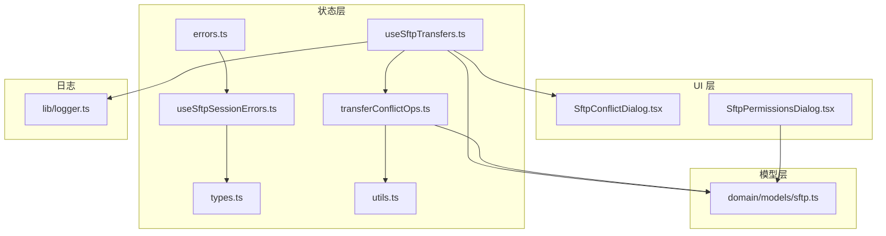
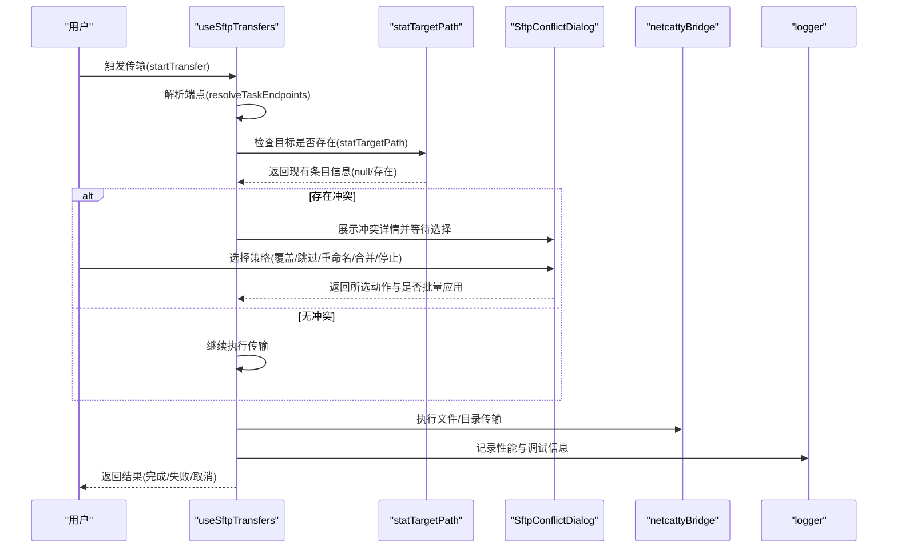
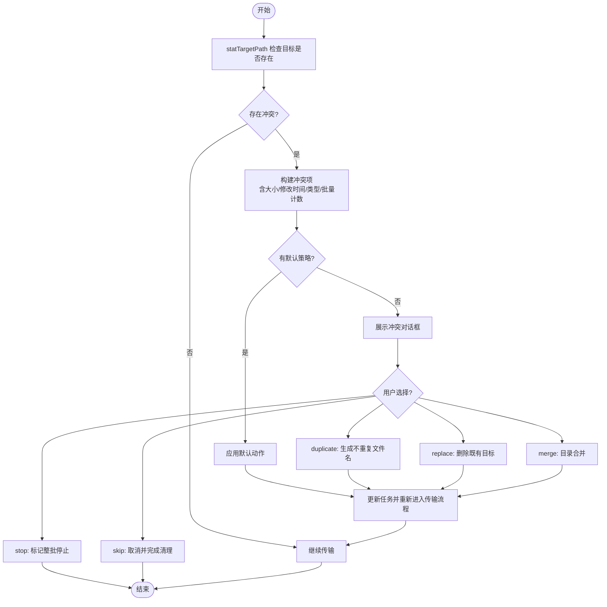
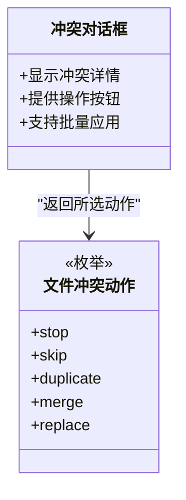
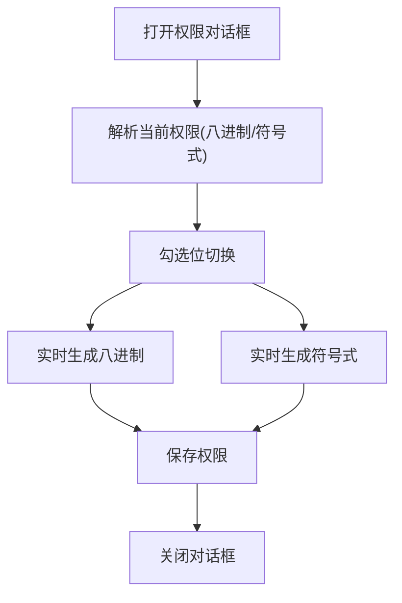
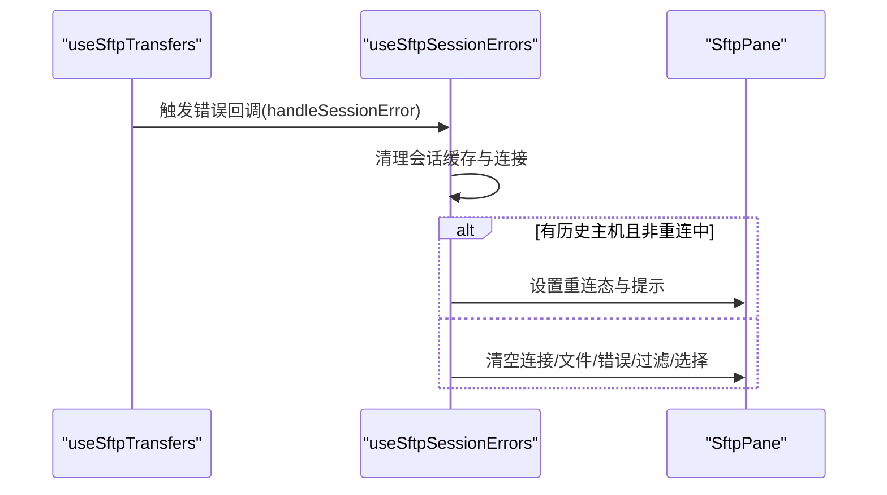
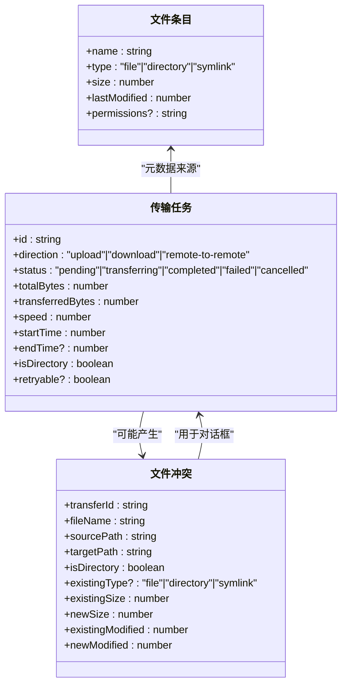
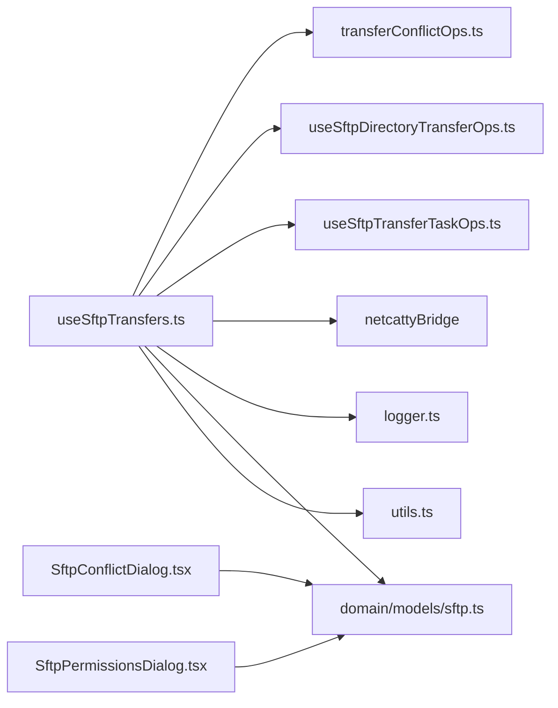

# 冲突解决和错误处理

<cite>
**本文引用的文件**
- [application/state/sftp/transferConflictOps.ts](file://application/state/sftp/transferConflictOps.ts)
- [application/state/sftp/useSftpTransfers.ts](file://application/state/sftp/useSftpTransfers.ts)
- [components/sftp/SftpConflictDialog.tsx](file://components/sftp/SftpConflictDialog.tsx)
- [components/sftp/SftpPermissionsDialog.tsx](file://components/sftp/SftpPermissionsDialog.tsx)
- [application/state/sftp/errors.ts](file://application/state/sftp/errors.ts)
- [application/state/sftp/useSftpSessionErrors.ts](file://application/state/sftp/useSftpSessionErrors.ts)
- [application/state/sftp/types.ts](file://application/state/sftp/types.ts)
- [application/state/sftp/utils.ts](file://application/state/sftp/utils.ts)
- [domain/models/sftp.ts](file://domain/models/sftp.ts)
- [lib/logger.ts](file://lib/logger.ts)
</cite>

## 目录
1. [简介](#简介)
2. [项目结构](#项目结构)
3. [核心组件](#核心组件)
4. [架构总览](#架构总览)
5. [详细组件分析](#详细组件分析)
6. [依赖关系分析](#依赖关系分析)
7. [性能考量](#性能考量)
8. [故障排除指南](#故障排除指南)
9. [结论](#结论)
10. [附录](#附录)

## 简介
本指南聚焦于 SFTP 文件传输过程中的“冲突解决”与“错误处理”。内容涵盖：
- 冲突类型：文件名冲突、权限冲突、目录合并冲突、空间不足等的识别与处理
- 冲突解决对话框的使用：覆盖、跳过、重命名（复制）、合并、停止等策略
- 错误处理机制：会话丢失、网络中断、权限不足、磁盘空间不足、文件锁定等的诊断与应对
- 日志与调试：错误信息查看、日志导出、问题报告建议
- 预防性措施与最佳实践：传输前检查、备份策略、网络稳定性要求
- 常见问题排查：结合代码实现定位问题与修复路径

## 项目结构
围绕 SFTP 冲突与错误处理的关键模块分布如下：
- 状态层：负责传输任务管理、冲突检测与默认策略、会话错误处理
- UI 层：冲突对话框、权限编辑对话框
- 模型层：SFTP 文件条目、连接、传输任务、冲突与动作类型
- 工具层：路径拼接、父路径、格式化工具
- 日志：开发环境下的调试日志输出

图表来源
- [application/state/sftp/useSftpTransfers.ts:1-990](file://application/state/sftp/useSftpTransfers.ts#L1-L990)
- [application/state/sftp/transferConflictOps.ts:1-106](file://application/state/sftp/transferConflictOps.ts#L1-L106)
- [application/state/sftp/errors.ts:1-20](file://application/state/sftp/errors.ts#L1-L20)
- [application/state/sftp/useSftpSessionErrors.ts:1-79](file://application/state/sftp/useSftpSessionErrors.ts#L1-L79)
- [application/state/sftp/types.ts:1-74](file://application/state/sftp/types.ts#L1-L74)
- [application/state/sftp/utils.ts:1-88](file://application/state/sftp/utils.ts#L1-L88)
- [components/sftp/SftpConflictDialog.tsx:1-163](file://components/sftp/SftpConflictDialog.tsx#L1-L163)
- [components/sftp/SftpPermissionsDialog.tsx:1-173](file://components/sftp/SftpPermissionsDialog.tsx#L1-L173)
- [domain/models/sftp.ts:1-79](file://domain/models/sftp.ts#L1-L79)
- [lib/logger.ts:1-25](file://lib/logger.ts#L1-L25)

章节来源
- [application/state/sftp/useSftpTransfers.ts:1-990](file://application/state/sftp/useSftpTransfers.ts#L1-L990)
- [application/state/sftp/transferConflictOps.ts:1-106](file://application/state/sftp/transferConflictOps.ts#L1-L106)
- [components/sftp/SftpConflictDialog.tsx:1-163](file://components/sftp/SftpConflictDialog.tsx#L1-L163)
- [components/sftp/SftpPermissionsDialog.tsx:1-173](file://components/sftp/SftpPermissionsDialog.tsx#L1-L173)
- [application/state/sftp/errors.ts:1-20](file://application/state/sftp/errors.ts#L1-L20)
- [application/state/sftp/useSftpSessionErrors.ts:1-79](file://application/state/sftp/useSftpSessionErrors.ts#L1-L79)
- [application/state/sftp/types.ts:1-74](file://application/state/sftp/types.ts#L1-L74)
- [application/state/sftp/utils.ts:1-88](file://application/state/sftp/utils.ts#L1-L88)
- [domain/models/sftp.ts:1-79](file://domain/models/sftp.ts#L1-L79)
- [lib/logger.ts:1-25](file://lib/logger.ts#L1-L25)

## 核心组件
- 冲突检测与处理：在传输开始前对目标路径进行存在性检查，生成冲突项；支持批量应用默认策略
- 冲突解决对话框：提供覆盖、跳过、重命名（复制）、合并、停止等操作
- 权限编辑对话框：支持八进制与符号式权限编辑，保存后更新远程文件权限
- 会话错误处理：检测会话类错误，触发断线重连或清空面板状态
- 传输任务与状态：统一的任务结构、状态机与进度统计
- 路径与格式化工具：跨平台路径拼接、父路径计算、大小与时间格式化

章节来源
- [application/state/sftp/useSftpTransfers.ts:96-506](file://application/state/sftp/useSftpTransfers.ts#L96-L506)
- [application/state/sftp/transferConflictOps.ts:18-101](file://application/state/sftp/transferConflictOps.ts#L18-L101)
- [components/sftp/SftpConflictDialog.tsx:32-159](file://components/sftp/SftpConflictDialog.tsx#L32-L159)
- [components/sftp/SftpPermissionsDialog.tsx:18-169](file://components/sftp/SftpPermissionsDialog.tsx#L18-L169)
- [application/state/sftp/useSftpSessionErrors.ts:33-66](file://application/state/sftp/useSftpSessionErrors.ts#L33-L66)
- [domain/models/sftp.ts:32-78](file://domain/models/sftp.ts#L32-L78)
- [application/state/sftp/utils.ts:3-87](file://application/state/sftp/utils.ts#L3-L87)

## 架构总览
SFTP 传输流程中，冲突检测与处理贯穿“准备阶段”和“执行阶段”，错误处理在会话异常时介入，UI 对话框提供交互入口。

图表来源
- [application/state/sftp/useSftpTransfers.ts:96-506](file://application/state/sftp/useSftpTransfers.ts#L96-L506)
- [application/state/sftp/transferConflictOps.ts:18-51](file://application/state/sftp/transferConflictOps.ts#L18-L51)
- [components/sftp/SftpConflictDialog.tsx:32-159](file://components/sftp/SftpConflictDialog.tsx#L32-L159)
- [lib/logger.ts:8-23](file://lib/logger.ts#L8-L23)

## 详细组件分析

### 冲突检测与处理（传输前）
- 目标路径存在性检查：通过 statTargetPath 获取目标类型、大小、修改时间
- 冲突项生成：包含文件名、源/目标路径、类型、大小、修改时间、批量计数等
- 默认策略：按批号与类型缓存默认动作（stop/skip/replace/duplicate/merge），支持批量应用
- 处理分支：
  - stop：标记整批停止
  - skip：取消当前任务并完成清理
  - duplicate：自动生成不重复的文件名（带“(copy)”后缀，必要时加序号或时间戳）
  - replace：删除既有目标后再写入
  - merge：仅目录类型且既有也为目录时可用，保留已有目录结构并合并新内容

图表来源
- [application/state/sftp/useSftpTransfers.ts:224-318](file://application/state/sftp/useSftpTransfers.ts#L224-L318)
- [application/state/sftp/transferConflictOps.ts:53-79](file://application/state/sftp/transferConflictOps.ts#L53-L79)
- [components/sftp/SftpConflictDialog.tsx:49-154](file://components/sftp/SftpConflictDialog.tsx#L49-L154)

章节来源
- [application/state/sftp/useSftpTransfers.ts:96-506](file://application/state/sftp/useSftpTransfers.ts#L96-L506)
- [application/state/sftp/transferConflictOps.ts:18-101](file://application/state/sftp/transferConflictOps.ts#L18-L101)

### 冲突解决对话框（策略选择与批量应用）
- 展示项：冲突文件名、现有文件与新文件的大小与修改时间对比
- 策略按钮：
  - 停止：终止同批后续所有冲突
  - 跳过：取消当前任务
  - 重命名（复制）：自动追加“(copy)”或“(copy N)”后缀
  - 合并：目录合并（仅当既有类型为目录时可用）
  - 覆盖：替换既有目标
- 批量应用：勾选“对剩余冲突应用此操作”，可一次性设置默认策略

图表来源
- [components/sftp/SftpConflictDialog.tsx:32-159](file://components/sftp/SftpConflictDialog.tsx#L32-L159)
- [domain/models/sftp.ts:63-78](file://domain/models/sftp.ts#L63-L78)

章节来源
- [components/sftp/SftpConflictDialog.tsx:32-159](file://components/sftp/SftpConflictDialog.tsx#L32-L159)
- [domain/models/sftp.ts:63-78](file://domain/models/sftp.ts#L63-L78)

### 权限编辑对话框（权限冲突场景）
- 支持两种输入格式：八进制（如 755）与符号式（如 rwxr-xr-x）
- 实时转换：根据勾选位生成八进制与符号式表示
- 保存：调用保存回调，以八进制格式写回权限

图表来源
- [components/sftp/SftpPermissionsDialog.tsx:18-169](file://components/sftp/SftpPermissionsDialog.tsx#L18-L169)

章节来源
- [components/sftp/SftpPermissionsDialog.tsx:18-169](file://components/sftp/SftpPermissionsDialog.tsx#L18-L169)

### 会话错误处理（网络/会话类错误）
- 错误识别：通过 isSessionError 判断消息关键词（会话丢失、通道未就绪、连接关闭、超时等）
- 处理策略：
  - 若存在历史连接且面板有内容且未处于重连中：标记重连态并提示“正在重连”
  - 否则：清空连接、文件列表、错误状态，重置过滤与选择

图表来源
- [application/state/sftp/useSftpSessionErrors.ts:33-66](file://application/state/sftp/useSftpSessionErrors.ts#L33-L66)
- [application/state/sftp/errors.ts:1-20](file://application/state/sftp/errors.ts#L1-L20)
- [application/state/sftp/types.ts:3-16](file://application/state/sftp/types.ts#L3-L16)

章节来源
- [application/state/sftp/useSftpSessionErrors.ts:1-79](file://application/state/sftp/useSftpSessionErrors.ts#L1-L79)
- [application/state/sftp/errors.ts:1-20](file://application/state/sftp/errors.ts#L1-L20)
- [application/state/sftp/types.ts:1-74](file://application/state/sftp/types.ts#L1-L74)

### 传输任务与状态（数据模型）
- 传输任务：包含方向、状态、字节总量/已传输、速度、时间戳、是否目录、是否可重试等
- 冲突动作：stop/skip/duplicate/merge/replace
- 文件条目：名称、类型、大小、权限、最后修改时间等

图表来源
- [domain/models/sftp.ts:32-78](file://domain/models/sftp.ts#L32-L78)

章节来源
- [domain/models/sftp.ts:1-79](file://domain/models/sftp.ts#L1-L79)

## 依赖关系分析
- useSftpTransfers 依赖：
  - transferConflictOps：冲突检测与重命名生成
  - useSftpDirectoryTransferOps：目录传输与子任务管理
  - useSftpTransferTaskOps：任务生命周期与取消/重试
  - netcattyBridge：底层 stat、传输、sameHostCopy 等能力
  - logger：性能与调试日志
- UI 依赖：
  - SftpConflictDialog：接收冲突项与回调，返回用户选择
  - SftpPermissionsDialog：接收文件条目，保存权限
- 类型与工具：
  - domain/models/sftp：统一的数据模型
  - application/state/sftp/utils：路径与格式化工具

图表来源
- [application/state/sftp/useSftpTransfers.ts:1-17](file://application/state/sftp/useSftpTransfers.ts#L1-L17)
- [application/state/sftp/transferConflictOps.ts:1-6](file://application/state/sftp/transferConflictOps.ts#L1-L6)
- [domain/models/sftp.ts:1-79](file://domain/models/sftp.ts#L1-L79)
- [application/state/sftp/utils.ts:1-88](file://application/state/sftp/utils.ts#L1-L88)
- [lib/logger.ts:1-25](file://lib/logger.ts#L1-L25)
- [components/sftp/SftpConflictDialog.tsx:1-30](file://components/sftp/SftpConflictDialog.tsx#L1-L30)
- [components/sftp/SftpPermissionsDialog.tsx:1-16](file://components/sftp/SftpPermissionsDialog.tsx#L1-L16)

章节来源
- [application/state/sftp/useSftpTransfers.ts:1-17](file://application/state/sftp/useSftpTransfers.ts#L1-L17)
- [application/state/sftp/transferConflictOps.ts:1-6](file://application/state/sftp/transferConflictOps.ts#L1-L6)
- [domain/models/sftp.ts:1-79](file://domain/models/sftp.ts#L1-L79)
- [application/state/sftp/utils.ts:1-88](file://application/state/sftp/utils.ts#L1-L88)
- [lib/logger.ts:1-25](file://lib/logger.ts#L1-L25)
- [components/sftp/SftpConflictDialog.tsx:1-30](file://components/sftp/SftpConflictDialog.tsx#L1-L30)
- [components/sftp/SftpPermissionsDialog.tsx:1-16](file://components/sftp/SftpPermissionsDialog.tsx#L1-L16)

## 性能考量
- 并行检测：冲突检查与大小发现并行执行，减少等待时间
- 缓存键：同一主机不同会话参数使用连接级缓存键，避免误判
- 同主机优化：UTF-8 兼容编码下优先使用 sameHostCopy，失败时回退递归传输
- 进度单调：对外暴露的进度值保持单调与边界约束，保证 UI 稳定
- 调试日志：仅在开发模式输出，避免生产环境性能开销

章节来源
- [application/state/sftp/useSftpTransfers.ts:224-271](file://application/state/sftp/useSftpTransfers.ts#L224-L271)
- [application/state/sftp/useSftpTransfers.ts:338-353](file://application/state/sftp/useSftpTransfers.ts#L338-L353)
- [application/state/sftp/useSftpTransfers.ts:702-716](file://application/state/sftp/useSftpTransfers.ts#L702-L716)
- [lib/logger.ts:3-6](file://lib/logger.ts#L3-L6)

## 故障排除指南

### 常见冲突类型与处理
- 文件名冲突
  - 现象：目标路径已存在同名文件/目录
  - 处理：在冲突对话框中选择“覆盖”、“跳过”、“重命名（复制）”或“合并”（目录）
  - 建议：批量传输时勾选“对剩余冲突应用此操作”，统一策略
- 权限冲突
  - 现象：无权限写入或修改目标路径
  - 处理：打开权限对话框，调整八进制或符号式权限后保存
  - 建议：先在本地预检权限，再执行传输
- 目录合并冲突
  - 现象：既有目标为目录，新内容需要合并
  - 处理：选择“合并”，保留既有结构并叠加新增内容
  - 注意：仅当既有类型为目录时可用
- 空间不足/磁盘满
  - 现象：传输失败并提示空间不足
  - 处理：清理目标磁盘空间或改用更大分区；分批传输
- 文件锁定/被占用
  - 现象：目标文件被占用导致无法覆盖
  - 处理：关闭占用进程或稍后重试；必要时选择“重命名（复制）”

章节来源
- [components/sftp/SftpConflictDialog.tsx:47-154](file://components/sftp/SftpConflictDialog.tsx#L47-L154)
- [components/sftp/SftpPermissionsDialog.tsx:28-106](file://components/sftp/SftpPermissionsDialog.tsx#L28-L106)
- [application/state/sftp/useSftpTransfers.ts:324-326](file://application/state/sftp/useSftpTransfers.ts#L324-L326)

### 错误类型与诊断
- 会话丢失/连接中断
  - 识别：isSessionError 包含“会话未找到/丢失”、“通道未就绪”、“连接关闭/重置”、“超时”等关键词
  - 处理：触发重连逻辑或清空面板状态，重新建立连接
- 网络错误
  - 识别：消息包含“无响应”、“未连接”、“客户端断开”等
  - 处理：检查网络稳定性，重试或切换更稳定的网络
- 权限错误
  - 识别：目标路径无写权限或权限不足
  - 处理：通过权限对话框调整权限或联系管理员
- 磁盘空间错误
  - 识别：传输失败并提示空间不足
  - 处理：清理空间或更换目标位置
- 文件锁定错误
  - 识别：目标文件被占用
  - 处理：关闭占用进程或延后重试

章节来源
- [application/state/sftp/errors.ts:1-20](file://application/state/sftp/errors.ts#L1-L20)
- [application/state/sftp/useSftpSessionErrors.ts:33-66](file://application/state/sftp/useSftpSessionErrors.ts#L33-L66)

### 错误日志与调试
- 开发日志：仅在开发模式输出，包含性能与调试信息
- 查看方式：在开发者工具控制台查看 debug/info/warn/error 输出
- 导出与报告：建议将控制台输出与系统日志打包，提交问题报告时附上
- 关联信息：传输任务 ID、源/目标路径、冲突项详情、错误消息

章节来源
- [lib/logger.ts:8-23](file://lib/logger.ts#L8-L23)
- [application/state/sftp/useSftpTransfers.ts:214-214](file://application/state/sftp/useSftpTransfers.ts#L214-L214)

### 预防性措施与最佳实践
- 传输前检查
  - 确认目标路径存在性与权限
  - 预估磁盘空间，确保有足够容量
- 备份策略
  - 对重要文件/目录执行覆盖前备份
  - 使用“重命名（复制）”策略避免覆盖既有内容
- 网络稳定性
  - 优先使用稳定网络，避免弱网或频繁抖动
  - 大文件/大批量传输建议分批进行
- 会话管理
  - 定期刷新会话，避免长时间无交互导致会话超时
  - 在出现会话错误时及时重连

章节来源
- [components/sftp/SftpConflictDialog.tsx:103-113](file://components/sftp/SftpConflictDialog.tsx#L103-L113)
- [application/state/sftp/useSftpTransfers.ts:338-353](file://application/state/sftp/useSftpTransfers.ts#L338-L353)

## 结论
本指南基于代码实现梳理了 SFTP 传输中的冲突识别与处理、权限编辑、会话错误处理以及日志调试机制。通过冲突对话框的多种策略与默认批量应用，用户可以高效地处理各类冲突；配合权限对话框与会话错误处理，能够快速恢复与规避常见问题。建议在实际使用中遵循预防性措施与最佳实践，以提升传输成功率与稳定性。

## 附录

### 冲突对话框操作速查
- 停止：终止同批后续冲突
- 跳过：取消当前任务
- 重命名（复制）：自动生成不重复文件名
- 合并：目录合并（既有为目录时可用）
- 覆盖：替换既有目标

章节来源
- [components/sftp/SftpConflictDialog.tsx:116-154](file://components/sftp/SftpConflictDialog.tsx#L116-L154)