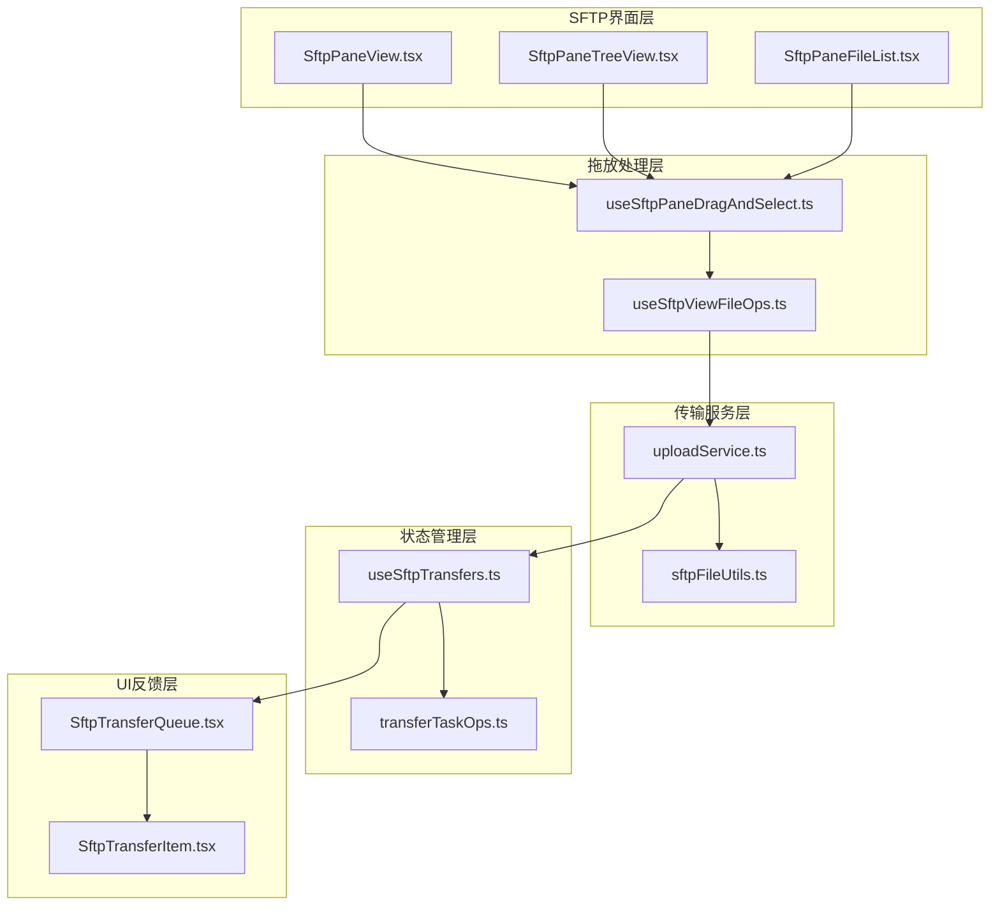
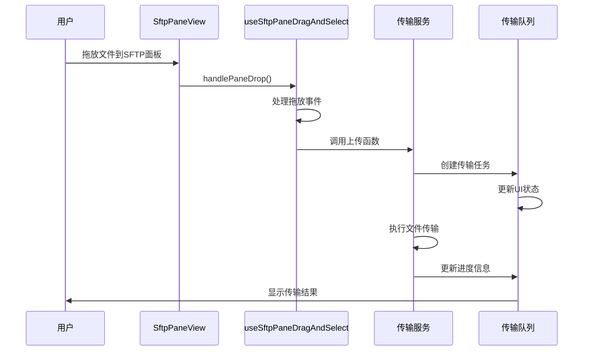
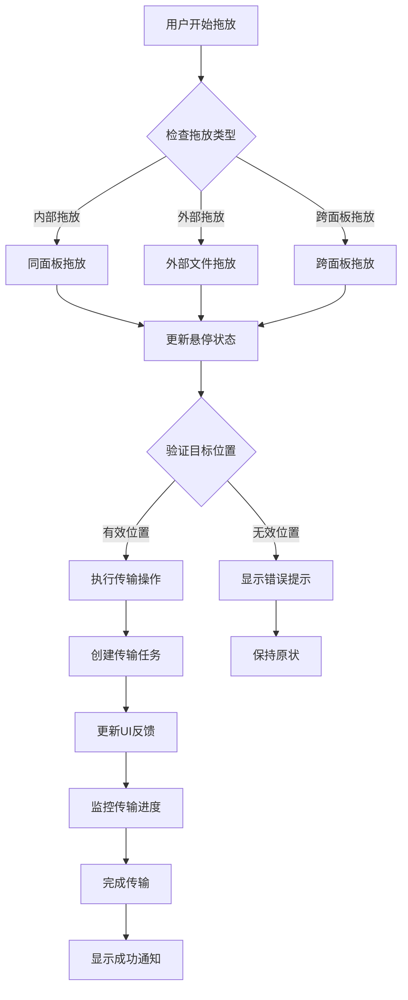
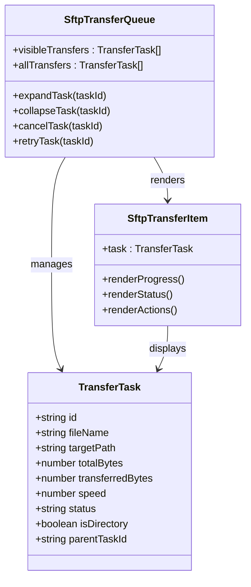
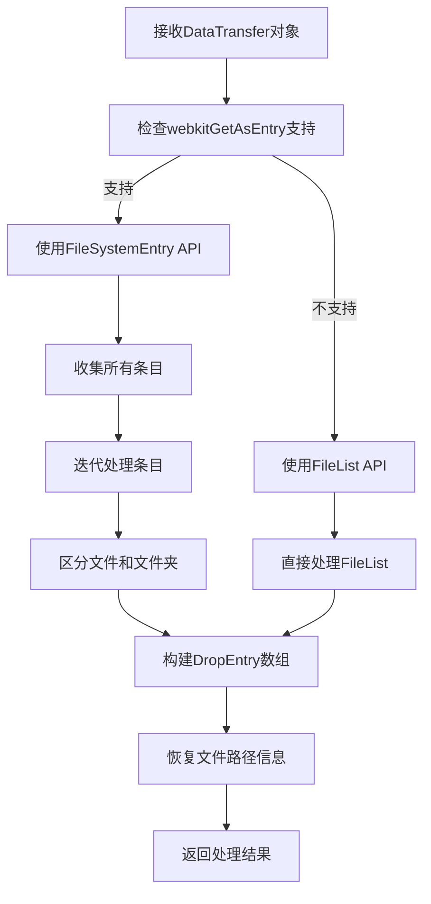
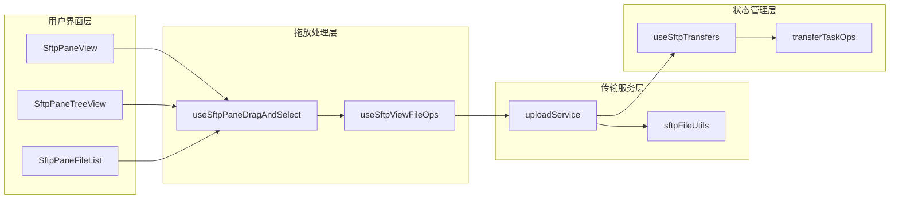
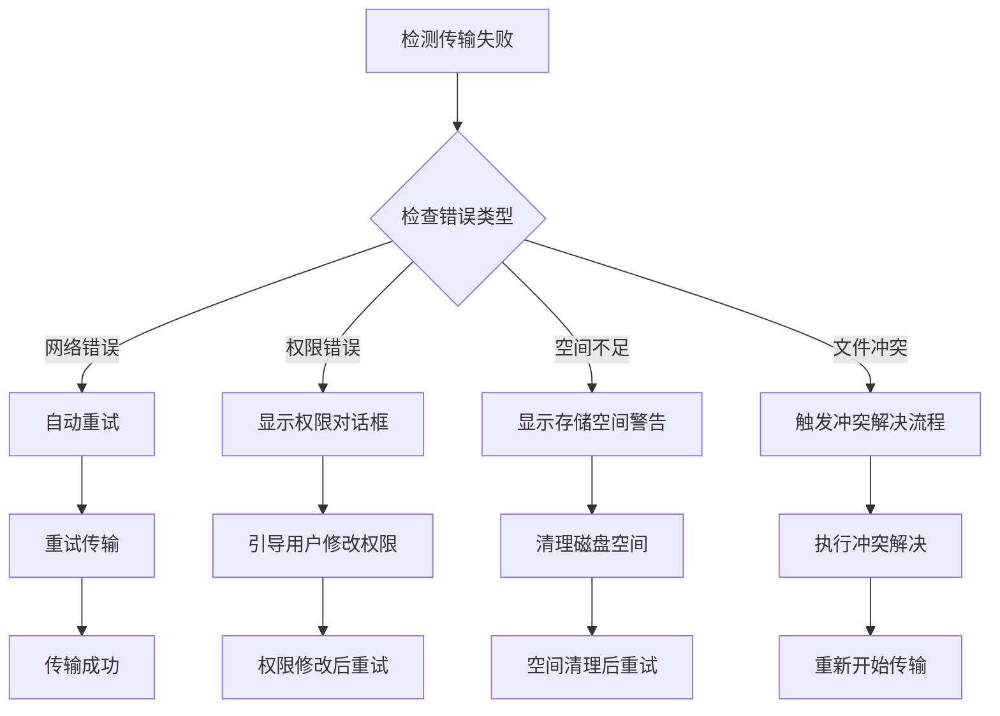

# 拖放传输功能

<cite>
**本文档引用的文件**
- [useSftpPaneDragAndSelect.ts](file://components/sftp/hooks/useSftpPaneDragAndSelect.ts)
- [SftpPaneView.tsx](file://components/sftp/SftpPaneView.tsx)
- [SftpPaneTreeView.tsx](file://components/sftp/SftpPaneTreeView.tsx)
- [SftpPaneFileList.tsx](file://components/sftp/SftpPaneFileList.tsx)
- [uploadService.ts](file://lib/uploadService.ts)
- [sftpFileUtils.ts](file://lib/sftpFileUtils.ts)
- [SftpTransferQueue.tsx](file://components/sftp/SftpTransferQueue.tsx)
- [SftpTransferItem.tsx](file://components/sftp/SftpTransferItem.tsx)
- [useSftpTransfers.ts](file://application/state/sftp/useSftpTransfers.ts)
- [transferTaskOps.ts](file://application/state/sftp/transferTaskOps.ts)
- [useSftpViewFileOps.ts](file://components/sftp/hooks/useSftpViewFileOps.ts)
</cite>

## 目录
1. [简介](#简介)
2. [项目结构](#项目结构)
3. [核心组件](#核心组件)
4. [架构概览](#架构概览)
5. [详细组件分析](#详细组件分析)
6. [依赖关系分析](#依赖关系分析)
7. [性能考虑](#性能考虑)
8. [故障排除指南](#故障排除指南)
9. [结论](#结论)

## 简介

拖放传输功能是Netcatty应用中SFTP客户端的核心特性之一，它允许用户通过直观的拖放操作在本地文件系统和远程服务器之间进行文件传输。该功能支持多种传输场景，包括本地到远程、远程到本地、以及跨面板的文件移动。

该功能的主要特点包括：
- 支持单个文件和文件夹的拖放传输
- 实时的视觉反馈和状态指示
- 批量传输和队列管理
- 完整的错误处理和故障恢复机制
- 高效的性能优化策略

## 项目结构

拖放传输功能主要分布在以下模块中：

**图表来源**
- [SftpPaneView.tsx:1-671](file://components/sftp/SftpPaneView.tsx#L1-L671)
- [useSftpPaneDragAndSelect.ts:1-289](file://components/sftp/hooks/useSftpPaneDragAndSelect.ts#L1-L289)
- [uploadService.ts:1-962](file://lib/uploadService.ts#L1-L962)

**章节来源**
- [SftpPaneView.tsx:1-671](file://components/sftp/SftpPaneView.tsx#L1-L671)
- [useSftpPaneDragAndSelect.ts:1-289](file://components/sftp/hooks/useSftpPaneDragAndSelect.ts#L1-L289)

## 核心组件

### 拖放处理钩子

`useSftpPaneDragAndSelect` 是拖放功能的核心钩子，负责处理所有拖放相关的逻辑：

- **拖放状态管理**：跟踪拖拽的文件、悬停状态和目标位置
- **跨面板拖放**：支持在同一应用内的不同SFTP面板间拖放文件
- **外部文件拖放**：处理从操作系统文件浏览器拖入的文件
- **同面板移动**：支持在同一面板内移动文件和文件夹

### 传输服务

`uploadService` 提供了完整的文件传输能力：

- **批量文件处理**：支持同时处理多个文件和文件夹
- **压缩传输**：对文件夹传输进行压缩以提高效率
- **进度跟踪**：实时监控传输进度和速度
- **冲突解决**：处理文件名冲突和覆盖策略

### 状态管理

`useSftpTransfers` 管理传输任务的状态：

- **任务队列**：组织和管理待处理、进行中和已完成的任务
- **错误处理**：捕获和报告传输过程中的错误
- **重试机制**：支持失败任务的自动重试
- **取消操作**：允许用户取消正在进行的传输

**章节来源**
- [useSftpPaneDragAndSelect.ts:39-289](file://components/sftp/hooks/useSftpPaneDragAndSelect.ts#L39-L289)
- [uploadService.ts:117-205](file://lib/uploadService.ts#L117-L205)
- [useSftpTransfers.ts:35-682](file://application/state/sftp/useSftpTransfers.ts#L35-L682)

## 架构概览

拖放传输功能采用分层架构设计，确保了功能的模块化和可维护性：

**图表来源**
- [SftpPaneView.tsx:298-349](file://components/sftp/SftpPaneView.tsx#L298-L349)
- [useSftpPaneDragAndSelect.ts:112-128](file://components/sftp/hooks/useSftpPaneDragAndSelect.ts#L112-L128)
- [uploadService.ts:125-205](file://lib/uploadService.ts#L125-L205)

## 详细组件分析

### 拖放事件处理流程

拖放功能的完整工作流程如下：

**图表来源**
- [useSftpPaneDragAndSelect.ts:89-128](file://components/sftp/hooks/useSftpPaneDragAndSelect.ts#L89-L128)
- [SftpPaneTreeView.tsx:731-781](file://components/sftp/SftpPaneTreeView.tsx#L731-L781)

### 传输队列管理系统

传输队列提供了完整的任务管理和状态跟踪：

**图表来源**
- [SftpTransferQueue.tsx:150-456](file://components/sftp/SftpTransferQueue.tsx#L150-L456)
- [SftpTransferItem.tsx:81-200](file://components/sftp/SftpTransferItem.tsx#L81-L200)

### 文件提取和处理

文件提取功能支持复杂的文件系统操作：

**图表来源**
- [sftpFileUtils.ts:586-661](file://lib/sftpFileUtils.ts#L586-L661)

**章节来源**
- [useSftpPaneDragAndSelect.ts:1-289](file://components/sftp/hooks/useSftpPaneDragAndSelect.ts#L1-L289)
- [SftpTransferQueue.tsx:1-456](file://components/sftp/SftpTransferQueue.tsx#L1-L456)
- [sftpFileUtils.ts:576-661](file://lib/sftpFileUtils.ts#L576-L661)

## 依赖关系分析

拖放传输功能的依赖关系图展示了各组件之间的交互：

**图表来源**
- [SftpPaneView.tsx:1-671](file://components/sftp/SftpPaneView.tsx#L1-L671)
- [useSftpPaneDragAndSelect.ts:1-289](file://components/sftp/hooks/useSftpPaneDragAndSelect.ts#L1-L289)
- [uploadService.ts:1-962](file://lib/uploadService.ts#L1-L962)

**章节来源**
- [SftpPaneView.tsx:1-671](file://components/sftp/SftpPaneView.tsx#L1-L671)
- [useSftpPaneDragAndSelect.ts:1-289](file://components/sftp/hooks/useSftpPaneDragAndSelect.ts#L1-L289)

## 性能考虑

拖放传输功能在设计时充分考虑了性能优化：

### 并发控制
- **传输并发限制**：默认限制为4个并发传输任务
- **内存管理**：使用流式传输避免大文件占用过多内存
- **进度更新节流**：通过requestAnimationFrame优化UI更新频率

### 内存优化
- **虚拟列表**：大量文件时使用虚拟滚动减少DOM节点数量
- **渐进式加载**：传输队列采用延迟加载策略
- **垃圾回收**：及时清理已完成任务的引用

### 网络优化
- **压缩传输**：文件夹传输时自动启用压缩
- **断点续传**：支持部分传输失败后的恢复
- **连接复用**：合理管理SFTP连接池

## 故障排除指南

### 常见问题及解决方案

#### 拖放无响应
**可能原因**：
- 浏览器不支持webkitGetAsEntry API
- 文件类型被阻止（如某些二进制文件）
- 权限不足导致无法写入目标目录

**解决步骤**：
1. 检查浏览器兼容性
2. 验证目标目录的写入权限
3. 尝试使用文件选择对话框替代拖放

#### 传输中断
**可能原因**：
- 网络连接不稳定
- 远程服务器空间不足
- 文件名冲突

**处理流程**：

#### 性能问题
**症状**：拖放响应缓慢或界面卡顿

**优化措施**：
1. 减少同时传输的文件数量
2. 关闭不必要的SFTP标签页
3. 清理传输历史记录
4. 重启SFTP会话

**章节来源**
- [useSftpTransfers.ts:446-955](file://application/state/sftp/useSftpTransfers.ts#L446-L955)
- [transferTaskOps.ts:43-76](file://application/state/sftp/transferTaskOps.ts#L43-L76)

## 结论

拖放传输功能通过精心设计的架构实现了高效、可靠的文件传输体验。其核心优势包括：

### 技术优势
- **直观的操作界面**：符合用户直觉的拖放操作
- **强大的功能支持**：涵盖所有常见的传输场景
- **完善的错误处理**：提供清晰的错误信息和恢复选项
- **优秀的性能表现**：通过多种优化技术确保流畅体验

### 用户体验
- **实时反馈**：拖放过程中的视觉提示和进度显示
- **灵活的配置**：支持多种传输模式和参数设置
- **稳定的可靠性**：经过充分测试的稳定性和容错能力

### 发展前景
该功能为未来的扩展奠定了良好基础，可以进一步增强：
- 支持更多文件格式和协议
- 集成云存储服务
- 提供更丰富的传输监控功能
- 优化移动端的拖放体验

通过持续的改进和优化，拖放传输功能将继续为用户提供卓越的文件传输体验。