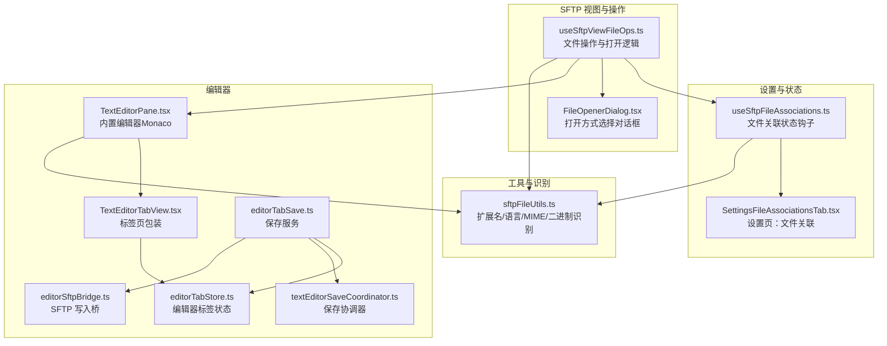
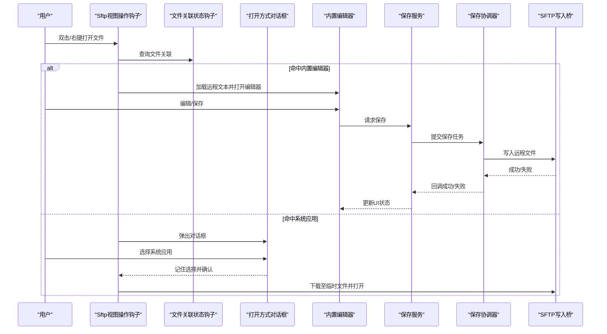
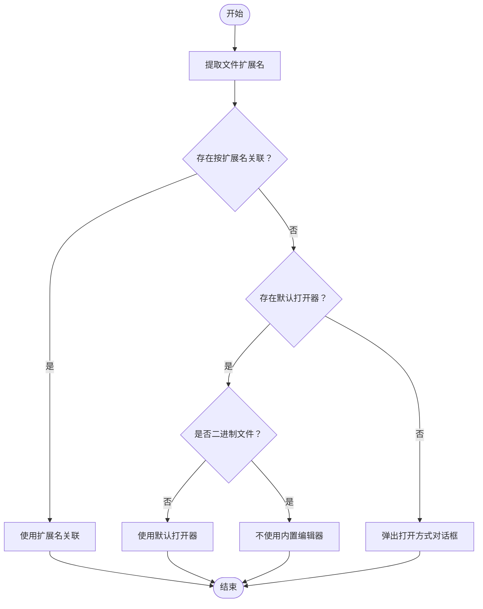
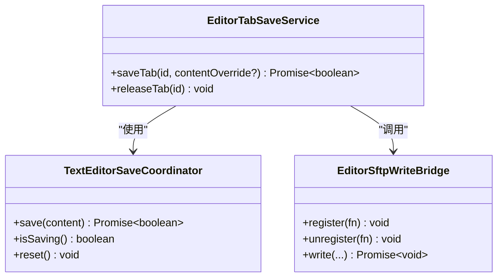
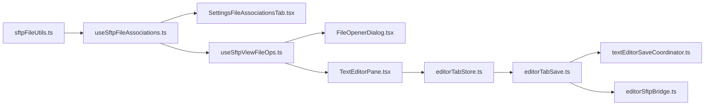

# 文件关联和编辑

<cite>
**本文引用的文件**
- [useSftpFileAssociations.ts](file://application/state/useSftpFileAssociations.ts)
- [SettingsFileAssociationsTab.tsx](file://components/settings/tabs/SettingsFileAssociationsTab.tsx)
- [TextEditorPane.tsx](file://components/editor/TextEditorPane.tsx)
- [TextEditorTabView.tsx](file://components/editor/TextEditorTabView.tsx)
- [editorTabStore.ts](file://application/state/editorTabStore.ts)
- [editorTabSave.ts](file://application/state/editorTabSave.ts)
- [textEditorSaveCoordinator.ts](file://application/state/textEditorSaveCoordinator.ts)
- [editorSftpBridge.ts](file://application/state/editorSftpBridge.ts)
- [sftpFileUtils.ts](file://lib/sftpFileUtils.ts)
- [useSftpViewFileOps.ts](file://components/sftp/hooks/useSftpViewFileOps.ts)
- [FileOpenerDialog.tsx](file://components/FileOpenerDialog.tsx)
</cite>

## 目录
1. [简介](#简介)
2. [项目结构](#项目结构)
3. [核心组件](#核心组件)
4. [架构总览](#架构总览)
5. [详细组件分析](#详细组件分析)
6. [依赖关系分析](#依赖关系分析)
7. [性能考量](#性能考量)
8. [故障排查指南](#故障排查指南)
9. [结论](#结论)
10. [附录](#附录)

## 简介
本指南面向使用者与维护者，系统讲解 SFTP 文件关联与编辑能力：如何为不同文件类型配置默认打开程序、如何添加/修改/删除文件关联规则；内置文本编辑器的功能与使用方法（语法高亮、自动补全、代码折叠、搜索替换等）；外部程序关联机制（系统程序选择对话框、程序路径配置、参数传递）；文件类型识别规则（扩展名匹配、MIME 类型识别、内容检测）；以及文件编辑的保存与同步机制（自动保存、手动保存、并发写入协调）。文末提供最佳实践与常见问题解决方案。

## 项目结构
围绕“文件关联与编辑”的关键模块分布如下：
- 关联管理：应用状态钩子负责持久化存储与跨组件共享
- 设置界面：提供图形化配置入口
- 编辑器：基于 Monaco 的内置编辑器，支持语言识别、主题、工具栏
- 保存协调：统一处理保存开始/成功/失败与并发冲突
- 桥接层：将编辑器写入动作路由到正确的 SFTP 实例
- 工具函数：文件类型识别、扩展名提取、语言映射等

图表来源
- [useSftpFileAssociations.ts:1-208](file://application/state/useSftpFileAssociations.ts#L1-L208)
- [SettingsFileAssociationsTab.tsx:1-581](file://components/settings/tabs/SettingsFileAssociationsTab.tsx#L1-L581)
- [useSftpViewFileOps.ts:1-800](file://components/sftp/hooks/useSftpViewFileOps.ts#L1-L800)
- [FileOpenerDialog.tsx:1-132](file://components/FileOpenerDialog.tsx#L1-L132)
- [TextEditorPane.tsx:1-632](file://components/editor/TextEditorPane.tsx#L1-L632)
- [TextEditorTabView.tsx:1-119](file://components/editor/TextEditorTabView.tsx#L1-L119)
- [editorTabStore.ts:1-247](file://application/state/editorTabStore.ts#L1-L247)
- [editorTabSave.ts:1-73](file://application/state/editorTabSave.ts#L1-L73)
- [textEditorSaveCoordinator.ts:1-91](file://application/state/textEditorSaveCoordinator.ts#L1-L91)
- [editorSftpBridge.ts:1-70](file://application/state/editorSftpBridge.ts#L1-L70)
- [sftpFileUtils.ts:1-661](file://lib/sftpFileUtils.ts#L1-L661)

章节来源
- [useSftpFileAssociations.ts:1-208](file://application/state/useSftpFileAssociations.ts#L1-L208)
- [SettingsFileAssociationsTab.tsx:1-581](file://components/settings/tabs/SettingsFileAssociationsTab.tsx#L1-L581)
- [useSftpViewFileOps.ts:1-800](file://components/sftp/hooks/useSftpViewFileOps.ts#L1-L800)
- [TextEditorPane.tsx:1-632](file://components/editor/TextEditorPane.tsx#L1-L632)
- [TextEditorTabView.tsx:1-119](file://components/editor/TextEditorTabView.tsx#L1-L119)
- [editorTabStore.ts:1-247](file://application/state/editorTabStore.ts#L1-L247)
- [editorTabSave.ts:1-73](file://application/state/editorTabSave.ts#L1-L73)
- [textEditorSaveCoordinator.ts:1-91](file://application/state/textEditorSaveCoordinator.ts#L1-L91)
- [editorSftpBridge.ts:1-70](file://application/state/editorSftpBridge.ts#L1-L70)
- [sftpFileUtils.ts:1-661](file://lib/sftpFileUtils.ts#L1-L661)

## 核心组件
- 文件关联状态钩子：提供读取/设置默认打开器、按扩展名设置打开器、列出/清空全部关联等能力，并通过本地存储实现跨标签页同步。
- 设置页：提供双击行为、默认视图模式、自动同步、隐藏文件显示、压缩上传、自动打开侧边栏、传输并发度等 SFTP 行为设置；同时提供文件关联列表与默认打开器设置。
- 文件打开对话框：在未命中关联时弹出，允许用户选择“内置编辑器”或“系统应用”，并可将选择设为默认。
- 文件操作钩子：根据当前文件与关联规则决定打开方式（内置编辑器或下载后用系统应用打开），并在需要时触发对话框。
- 内置编辑器：基于 Monaco，支持语言识别、主题适配、工具栏、搜索替换、自动换行、语言切换等。
- 编辑器标签状态：维护每个编辑器标签的内容、语言、换行、视图状态、保存状态等。
- 保存协调与桥接：统一处理保存生命周期回调、并发写入合并、错误格式化与传播，确保写入目标连接正确。

章节来源
- [useSftpFileAssociations.ts:98-207](file://application/state/useSftpFileAssociations.ts#L98-L207)
- [SettingsFileAssociationsTab.tsx:30-581](file://components/settings/tabs/SettingsFileAssociationsTab.tsx#L30-L581)
- [FileOpenerDialog.tsx:20-132](file://components/FileOpenerDialog.tsx#L20-L132)
- [useSftpViewFileOps.ts:107-172](file://components/sftp/hooks/useSftpViewFileOps.ts#L107-L172)
- [TextEditorPane.tsx:206-632](file://components/editor/TextEditorPane.tsx#L206-L632)
- [TextEditorTabView.tsx:31-119](file://components/editor/TextEditorTabView.tsx#L31-L119)
- [editorTabStore.ts:40-247](file://application/state/editorTabStore.ts#L40-L247)
- [editorTabSave.ts:21-73](file://application/state/editorTabSave.ts#L21-L73)
- [textEditorSaveCoordinator.ts:20-91](file://application/state/textEditorSaveCoordinator.ts#L20-L91)
- [editorSftpBridge.ts:27-70](file://application/state/editorSftpBridge.ts#L27-L70)

## 架构总览
下图展示从用户操作到文件打开与保存的关键流程：

图表来源
- [useSftpViewFileOps.ts:107-172](file://components/sftp/hooks/useSftpViewFileOps.ts#L107-L172)
- [useSftpFileAssociations.ts:123-132](file://application/state/useSftpFileAssociations.ts#L123-L132)
- [FileOpenerDialog.tsx:38-56](file://components/FileOpenerDialog.tsx#L38-L56)
- [TextEditorPane.tsx:308-311](file://components/editor/TextEditorPane.tsx#L308-L311)
- [editorTabSave.ts:52-63](file://application/state/editorTabSave.ts#L52-L63)
- [textEditorSaveCoordinator.ts:30-65](file://application/state/textEditorSaveCoordinator.ts#L30-L65)
- [editorSftpBridge.ts:47-69](file://application/state/editorSftpBridge.ts#L47-L69)

## 详细组件分析

### 组件一：文件关联与默认打开器
- 功能要点
  - 支持按扩展名设置打开器（内置编辑器或系统应用）
  - 支持设置“默认打开器”，无显式扩展名的文件回退使用
  - 自动跳过二进制文件的内置编辑器回退
  - 列出/删除/清空全部关联
  - 跨标签页同步（监听 storage 事件）
- 使用建议
  - 对于脚本/配置/源码类文件，优先设置为“内置编辑器”
  - 对于图片/视频/可执行文件等二进制文件，避免设置为“内置编辑器”
  - 将常用程序设为“默认打开器”，减少每次选择

图表来源
- [useSftpFileAssociations.ts:123-132](file://application/state/useSftpFileAssociations.ts#L123-L132)
- [sftpFileUtils.ts:298-301](file://lib/sftpFileUtils.ts#L298-L301)

章节来源
- [useSftpFileAssociations.ts:28-54](file://application/state/useSftpFileAssociations.ts#L28-L54)
- [useSftpFileAssociations.ts:123-153](file://application/state/useSftpFileAssociations.ts#L123-L153)
- [SettingsFileAssociationsTab.tsx:30-581](file://components/settings/tabs/SettingsFileAssociationsTab.tsx#L30-L581)

### 组件二：设置页中的文件关联与行为
- 双击行为：打开/传输
- 默认视图模式：列表/树形
- 自动同步：开启/关闭
- 隐藏文件显示：开启/关闭
- 压缩上传：开启/关闭
- 自动打开侧边栏：开启/关闭
- 传输并发度：滑块调节
- 文件关联列表：表格展示，支持编辑/删除
- 默认打开器：可选“询问”“内置编辑器”“系统应用”

章节来源
- [SettingsFileAssociationsTab.tsx:82-400](file://components/settings/tabs/SettingsFileAssociationsTab.tsx#L82-L400)
- [SettingsFileAssociationsTab.tsx:402-581](file://components/settings/tabs/SettingsFileAssociationsTab.tsx#L402-L581)

### 组件三：打开方式对话框
- 当未命中关联时弹出
- 可编辑文件：显示“内置编辑器”选项
- 系统应用：调用系统选择器，返回路径与名称
- “记住选择”：可将该选择作为默认打开器

章节来源
- [FileOpenerDialog.tsx:20-132](file://components/FileOpenerDialog.tsx#L20-L132)
- [useSftpViewFileOps.ts:141-172](file://components/sftp/hooks/useSftpViewFileOps.ts#L141-L172)

### 组件四：内置文本编辑器（Monaco）
- 语言识别：基于扩展名映射到 Monaco 语言 ID
- 主题适配：跟随应用深浅色主题动态定义自定义主题
- 工具栏：搜索、自动换行、语言切换、保存、最大化、关闭
- 快捷键：Ctrl+S 保存、Cmd/Ctrl+W 关闭
- 剪贴板：优先使用浏览器剪贴板，失败时回退到 Electron 桥
- 交互：内容变更实时通知父级更新状态

章节来源
- [TextEditorPane.tsx:34-81](file://components/editor/TextEditorPane.tsx#L34-L81)
- [TextEditorPane.tsx:248-285](file://components/editor/TextEditorPane.tsx#L248-L285)
- [TextEditorPane.tsx:387-440](file://components/editor/TextEditorPane.tsx#L387-L440)
- [TextEditorPane.tsx:458-464](file://components/editor/TextEditorPane.tsx#L458-L464)
- [TextEditorPane.tsx:578-628](file://components/editor/TextEditorPane.tsx#L578-L628)

### 组件五：编辑器标签与状态
- 每个标签独立实例，切换时保持 Monaco 实例以提升性能
- 状态包含：会话 ID、主机 ID、远端路径、文件名、语言、内容、基线内容、换行、视图状态、保存状态与错误信息
- 支持批量关闭与强制关闭（断开连接时）

章节来源
- [TextEditorTabView.tsx:31-119](file://components/editor/TextEditorTabView.tsx#L31-L119)
- [editorTabStore.ts:17-77](file://application/state/editorTabStore.ts#L17-L77)
- [editorTabStore.ts:116-159](file://application/state/editorTabStore.ts#L116-L159)

### 组件六：保存协调与桥接
- 保存协调器：合并重复保存、串行化并发写入、生成代数避免过期写入
- 保存服务：封装写入桥，更新标签保存状态与错误
- 写入桥：注册多个写入器，按连接 ID 分发；非当前实例抛出“连接不再可用”以便回退

图表来源
- [textEditorSaveCoordinator.ts:20-91](file://application/state/textEditorSaveCoordinator.ts#L20-L91)
- [editorTabSave.ts:21-73](file://application/state/editorTabSave.ts#L21-L73)
- [editorSftpBridge.ts:27-70](file://application/state/editorSftpBridge.ts#L27-L70)

章节来源
- [textEditorSaveCoordinator.ts:20-91](file://application/state/textEditorSaveCoordinator.ts#L20-L91)
- [editorTabSave.ts:21-73](file://application/state/editorTabSave.ts#L21-L73)
- [editorSftpBridge.ts:27-70](file://application/state/editorSftpBridge.ts#L27-L70)

### 组件七：文件类型识别与语言映射
- 扩展名识别：支持大量编程/数据/文档/脚本/系统文件扩展名
- 文本/二进制判定：扩展名 + 内容字节分析（控制字符比例、高比特比例、空字节）
- 图像 MIME：用于本地预览与下载
- 语言映射：扩展名到 Monaco 语言 ID 的映射表
- 语言名称：用户友好的语言显示名称

章节来源
- [sftpFileUtils.ts:8-84](file://lib/sftpFileUtils.ts#L8-L84)
- [sftpFileUtils.ts:184-292](file://lib/sftpFileUtils.ts#L184-L292)
- [sftpFileUtils.ts:329-428](file://lib/sftpFileUtils.ts#L329-L428)

## 依赖关系分析
- 文件关联状态钩子依赖本地存储与工具函数（扩展名、二进制判断）
- 设置页依赖关联状态钩子与设置状态
- 文件操作钩子依赖关联状态钩子、对话框与 SFTP 方法
- 编辑器依赖 Monaco、工具函数（语言映射）、标签状态
- 保存链路：编辑器 -> 保存服务 -> 协调器 -> 写入桥 -> SFTP 实例

图表来源
- [sftpFileUtils.ts:1-661](file://lib/sftpFileUtils.ts#L1-L661)
- [useSftpFileAssociations.ts:1-208](file://application/state/useSftpFileAssociations.ts#L1-L208)
- [SettingsFileAssociationsTab.tsx:1-581](file://components/settings/tabs/SettingsFileAssociationsTab.tsx#L1-L581)
- [useSftpViewFileOps.ts:1-800](file://components/sftp/hooks/useSftpViewFileOps.ts#L1-L800)
- [FileOpenerDialog.tsx:1-132](file://components/FileOpenerDialog.tsx#L1-L132)
- [TextEditorPane.tsx:1-632](file://components/editor/TextEditorPane.tsx#L1-L632)
- [editorTabStore.ts:1-247](file://application/state/editorTabStore.ts#L1-L247)
- [editorTabSave.ts:1-73](file://application/state/editorTabSave.ts#L1-L73)
- [textEditorSaveCoordinator.ts:1-91](file://application/state/textEditorSaveCoordinator.ts#L1-L91)
- [editorSftpBridge.ts:1-70](file://application/state/editorSftpBridge.ts#L1-L70)

章节来源
- 同上

## 性能考量
- Monaco 实例复用：标签页切换时隐藏而非销毁，避免重建编辑器实例
- 保存合并：并发保存请求合并为一次写入，减少网络往返
- 代数机制：防止过期写入覆盖最新内容
- 本地存储同步：监听 storage 事件，跨标签页即时刷新

章节来源
- [TextEditorTabView.tsx:31-119](file://components/editor/TextEditorTabView.tsx#L31-L119)
- [textEditorSaveCoordinator.ts:30-77](file://application/state/textEditorSaveCoordinator.ts#L30-L77)
- [useSftpFileAssociations.ts:104-117](file://application/state/useSftpFileAssociations.ts#L104-L117)

## 故障排查指南
- 无法打开文件
  - 检查是否为二进制文件（如图片/可执行），二进制文件不会回退到内置编辑器
  - 若无默认打开器，系统会弹出“打开方式”对话框，请选择“系统应用”
- 保存失败
  - 查看编辑器底部错误提示；检查网络/权限/连接是否仍在
  - 若出现“连接已更改”，请重新打开文件或确认当前连接未被重连导致主机 ID 不一致
- 保存未生效
  - 确认保存状态为“保存中”时不要重复点击；等待保存完成
  - 如发生并发保存，协调器会自动合并，最终以最新内容为准
- 外部程序无法打开
  - 确认系统程序路径正确；若系统选择器不可用，可在设置页中为该扩展名设置默认系统应用

章节来源
- [useSftpFileAssociations.ts:127-131](file://application/state/useSftpFileAssociations.ts#L127-L131)
- [useSftpViewFileOps.ts:174-180](file://components/sftp/hooks/useSftpViewFileOps.ts#L174-L180)
- [TextEditorPane.tsx:308-311](file://components/editor/TextEditorPane.tsx#L308-L311)
- [editorTabSave.ts:32-46](file://application/state/editorTabSave.ts#L32-L46)
- [textEditorSaveCoordinator.ts:34-52](file://application/state/textEditorSaveCoordinator.ts#L34-L52)

## 结论
本系统通过“文件关联 + 打开对话框 + 内置编辑器 + 保存协调 + 桥接写入”的完整链路，实现了灵活、可靠且高性能的 SFTP 文件编辑体验。用户可通过设置页便捷地配置默认打开器与行为；内置编辑器提供接近本地 IDE 的体验；保存机制兼顾并发安全与用户体验。建议结合最佳实践合理配置关联规则，以获得更高效的工作流。

## 附录
- 最佳实践
  - 为脚本/配置/源码类文件设置“内置编辑器”，便于语法高亮与搜索替换
  - 为图片/视频/可执行文件设置“系统应用”，避免误用内置编辑器
  - 对频繁使用的扩展名设置默认打开器，减少每次选择
  - 合理设置自动同步与传输并发度，平衡速度与资源占用
- 常见问题
  - 问：为什么某些文件没有“编辑”选项？
    - 答：系统仅对非二进制文件显示“编辑”选项
  - 问：保存后内容未更新？
    - 答：检查保存状态与错误提示；如发生并发保存，最终以最新内容为准
  - 问：如何为无扩展名文件设置默认打开器？
    - 答：系统会将其视为“无扩展名”虚拟扩展，可在设置页中直接设置默认打开器