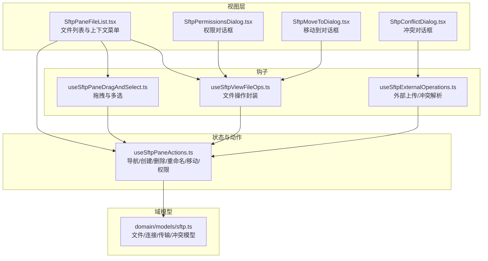
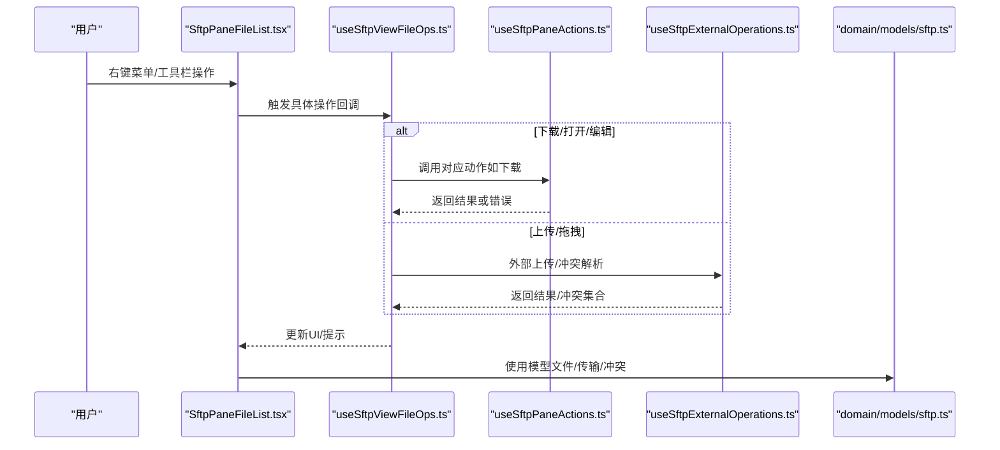
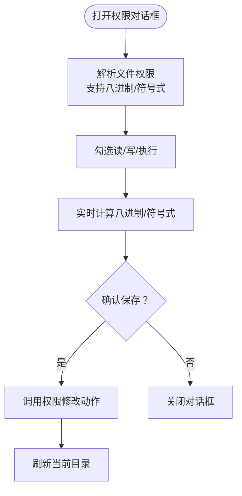
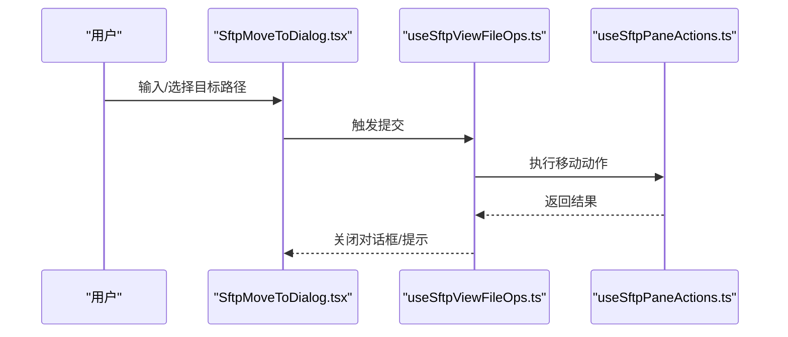
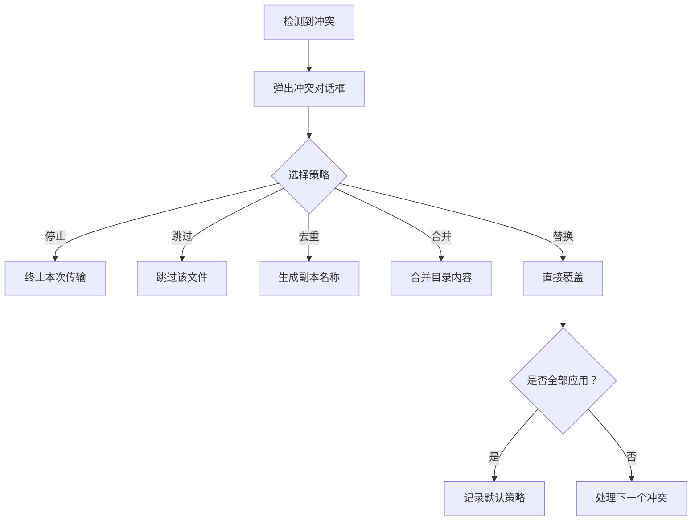
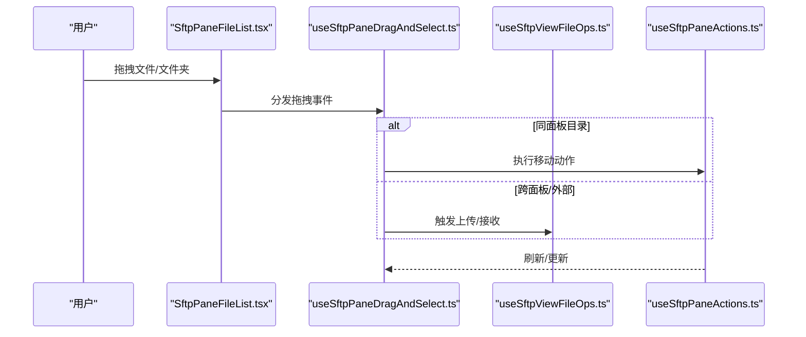
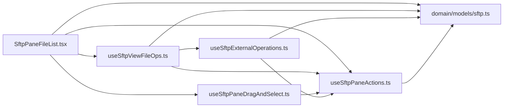

# 文件操作功能

<cite>
**本文档引用的文件**
- [SftpPaneFileList.tsx](file://components/sftp/SftpPaneFileList.tsx)
- [useSftpViewFileOps.ts](file://components/sftp/hooks/useSftpViewFileOps.ts)
- [SftpPermissionsDialog.tsx](file://components/sftp/SftpPermissionsDialog.tsx)
- [SftpMoveToDialog.tsx](file://components/sftp/SftpMoveToDialog.tsx)
- [useSftpPaneDragAndSelect.ts](file://components/sftp/hooks/useSftpPaneDragAndSelect.ts)
- [useSftpPaneActions.ts](file://application/state/sftp/useSftpPaneActions.ts)
- [useSftpExternalOperations.ts](file://application/state/sftp/useSftpExternalOperations.ts)
- [SftpConflictDialog.tsx](file://components/sftp/SftpConflictDialog.tsx)
- [sftp.ts](file://domain/models/sftp.ts)
</cite>

## 目录
1. [简介](#简介)
2. [项目结构](#项目结构)
3. [核心组件](#核心组件)
4. [架构总览](#架构总览)
5. [详细组件分析](#详细组件分析)
6. [依赖关系分析](#依赖关系分析)
7. [性能考虑](#性能考虑)
8. [故障排除指南](#故障排除指南)
9. [结论](#结论)
10. [附录](#附录)

## 简介
本指南面向使用 SFTP 文件面板的用户，系统讲解文件操作功能：复制、剪切/移动、粘贴、删除、重命名、权限修改、批量操作与冲突处理，并提供安全建议与最佳实践。文档基于代码实现进行梳理，确保操作流程与界面行为一致。

## 项目结构
SFTP 文件操作由“视图层（UI）+ 钩子（Hooks）+ 状态与动作（State/Actions）+ 模型（Domain Models）”协同完成：
- 视图层负责渲染文件列表、上下文菜单、权限对话框、移动目标对话框、冲突对话框等。
- Hooks 负责封装文件操作逻辑（打开/编辑/下载/上传/权限修改）、拖拽与多选、外部文件上传等。
- 状态与动作模块提供导航、刷新、创建/删除/重命名、移动、权限修改等核心能力。
- 域模型定义文件条目、连接、传输任务与冲突类型。

图表来源
- [SftpPaneFileList.tsx:1-704](file://components/sftp/SftpPaneFileList.tsx#L1-L704)
- [useSftpViewFileOps.ts:1-900](file://components/sftp/hooks/useSftpViewFileOps.ts#L1-L900)
- [useSftpPaneDragAndSelect.ts:1-289](file://components/sftp/hooks/useSftpPaneDragAndSelect.ts#L1-L289)
- [useSftpExternalOperations.ts:1-928](file://application/state/sftp/useSftpExternalOperations.ts#L1-L928)
- [useSftpPaneActions.ts:1-965](file://application/state/sftp/useSftpPaneActions.ts#L1-L965)
- [sftp.ts:1-79](file://domain/models/sftp.ts#L1-L79)

章节来源
- [SftpPaneFileList.tsx:1-704](file://components/sftp/SftpPaneFileList.tsx#L1-L704)
- [useSftpViewFileOps.ts:1-900](file://components/sftp/hooks/useSftpViewFileOps.ts#L1-L900)
- [useSftpPaneDragAndSelect.ts:1-289](file://components/sftp/hooks/useSftpPaneDragAndSelect.ts#L1-L289)
- [useSftpExternalOperations.ts:1-928](file://application/state/sftp/useSftpExternalOperations.ts#L1-L928)
- [useSftpPaneActions.ts:1-965](file://application/state/sftp/useSftpPaneActions.ts#L1-L965)
- [sftp.ts:1-79](file://domain/models/sftp.ts#L1-L79)

## 核心组件
- 文件列表与上下文菜单：支持打开、下载、编辑、复制到另一面板、剪切/移动、重命名、权限修改、删除、新建文件/文件夹、上传文件/文件夹等。
- 权限对话框：支持八进制与符号式权限显示与保存。
- 移动到对话框：提供路径输入、自动补全与提交。
- 冲突对话框：在上传/替换时处理覆盖、跳过、去重、合并、停止等策略。
- 拖拽与多选：支持跨面板拖放、同面板移动、范围选择、多选。
- 外部上传与冲突解析：支持从系统文件管理器拖入文件、文件夹扫描与冲突处理。
- 导航/创建/删除/重命名/移动/权限：统一的动作封装，保证一致性与错误处理。

章节来源
- [SftpPaneFileList.tsx:269-428](file://components/sftp/SftpPaneFileList.tsx#L269-L428)
- [SftpPermissionsDialog.tsx:18-172](file://components/sftp/SftpPermissionsDialog.tsx#L18-L172)
- [SftpMoveToDialog.tsx:11-115](file://components/sftp/SftpMoveToDialog.tsx#L11-L115)
- [SftpConflictDialog.tsx:32-162](file://components/sftp/SftpConflictDialog.tsx#L32-L162)
- [useSftpPaneDragAndSelect.ts:39-288](file://components/sftp/hooks/useSftpPaneDragAndSelect.ts#L39-L288)
- [useSftpExternalOperations.ts:24-928](file://application/state/sftp/useSftpExternalOperations.ts#L24-L928)
- [useSftpPaneActions.ts:35-965](file://application/state/sftp/useSftpPaneActions.ts#L35-L965)

## 架构总览
SFTP 文件操作遵循“视图触发事件 → 钩子封装逻辑 → 动作模块执行 → 域模型承载数据”的分层设计。外部上传通过桥接层与传输队列协作，冲突处理采用对话框与默认策略记忆机制。

图表来源
- [SftpPaneFileList.tsx:269-428](file://components/sftp/SftpPaneFileList.tsx#L269-L428)
- [useSftpViewFileOps.ts:13-900](file://components/sftp/hooks/useSftpViewFileOps.ts#L13-L900)
- [useSftpPaneActions.ts:35-965](file://application/state/sftp/useSftpPaneActions.ts#L35-L965)
- [useSftpExternalOperations.ts:24-928](file://application/state/sftp/useSftpExternalOperations.ts#L24-L928)
- [sftp.ts:1-79](file://domain/models/sftp.ts#L1-L79)

## 详细组件分析

### 文件列表与上下文菜单
- 支持的操作：打开、进入目录、以其他方式打开、编辑文本、下载、复制到另一面板、复制路径、剪切/移动到父级、重命名、权限修改、删除、刷新、新建文件/文件夹、上传文件/文件夹。
- 多选与范围选择：Shift 连续选择，Ctrl/Cmd 单个切换；右键菜单针对当前选集生效。
- 拖拽支持：文件/文件夹可拖入目录；跨面板拖拽时自动转为“接收并上传”。

章节来源
- [SftpPaneFileList.tsx:269-428](file://components/sftp/SftpPaneFileList.tsx#L269-L428)
- [SftpPaneFileList.tsx:467-491](file://components/sftp/SftpPaneFileList.tsx#L467-L491)
- [useSftpPaneDragAndSelect.ts:244-288](file://components/sftp/hooks/useSftpPaneDragAndSelect.ts#L244-L288)

### 权限对话框（权限修改）
- 支持两种输入格式：八进制（如 755）与符号式（如 rwxr-xr-x），自动识别并转换。
- 提供三组角色（所有者/组/其他）的读写执行勾选，实时计算八进制与符号式结果。
- 保存后调用权限修改动作，刷新当前目录。

图表来源
- [SftpPermissionsDialog.tsx:18-172](file://components/sftp/SftpPermissionsDialog.tsx#L18-L172)
- [useSftpPaneActions.ts:910-940](file://application/state/sftp/useSftpPaneActions.ts#L910-L940)

章节来源
- [SftpPermissionsDialog.tsx:18-172](file://components/sftp/SftpPermissionsDialog.tsx#L18-L172)
- [useSftpPaneActions.ts:910-940](file://application/state/sftp/useSftpPaneActions.ts#L910-L940)

### 移动到对话框（剪切/移动）
- 输入目标路径，支持上下键导航建议、Tab 选择、回车提交。
- 提交时校验路径有效性，执行移动动作，刷新受影响目录。

图表来源
- [SftpMoveToDialog.tsx:11-115](file://components/sftp/SftpMoveToDialog.tsx#L11-L115)
- [useSftpViewFileOps.ts:57-80](file://components/sftp/hooks/useSftpViewFileOps.ts#L57-L80)
- [useSftpPaneActions.ts:812-908](file://application/state/sftp/useSftpPaneActions.ts#L812-L908)

章节来源
- [SftpMoveToDialog.tsx:11-115](file://components/sftp/SftpMoveToDialog.tsx#L11-L115)
- [useSftpViewFileOps.ts:57-80](file://components/sftp/hooks/useSftpViewFileOps.ts#L57-L80)
- [useSftpPaneActions.ts:812-908](file://application/state/sftp/useSftpPaneActions.ts#L812-L908)

### 冲突处理机制
- 触发场景：上传/替换时目标已存在。
- 对话框展示“现有文件/新文件”的大小与修改时间对比，提供“停止/跳过/去重/合并/替换”等策略。
- 支持“全部应用此策略”，用于后续相同类型的冲突快速决策。

图表来源
- [SftpConflictDialog.tsx:32-162](file://components/sftp/SftpConflictDialog.tsx#L32-L162)
- [useSftpExternalOperations.ts:376-442](file://application/state/sftp/useSftpExternalOperations.ts#L376-L442)

章节来源
- [SftpConflictDialog.tsx:32-162](file://components/sftp/SftpConflictDialog.tsx#L32-L162)
- [useSftpExternalOperations.ts:376-442](file://application/state/sftp/useSftpExternalOperations.ts#L376-L442)

### 拖拽与多选
- 同面板拖拽：在目录项上可“移动”（内部重命名）。
- 跨面板拖拽：将源文件/文件夹“接收并上传”到目标目录。
- 外部文件拖拽：从系统文件管理器拖入目录，触发外部上传。
- 多选：Ctrl/Cmd 单选，Shift 连续选择，支持范围选择与全选。

图表来源
- [useSftpPaneDragAndSelect.ts:89-242](file://components/sftp/hooks/useSftpPaneDragAndSelect.ts#L89-L242)
- [useSftpViewFileOps.ts:272-321](file://components/sftp/hooks/useSftpViewFileOps.ts#L272-L321)
- [useSftpPaneActions.ts:812-908](file://application/state/sftp/useSftpPaneActions.ts#L812-L908)

章节来源
- [useSftpPaneDragAndSelect.ts:89-242](file://components/sftp/hooks/useSftpPaneDragAndSelect.ts#L89-L242)
- [useSftpViewFileOps.ts:272-321](file://components/sftp/hooks/useSftpViewFileOps.ts#L272-L321)
- [useSftpPaneActions.ts:812-908](file://application/state/sftp/useSftpPaneActions.ts#L812-L908)

### 外部上传与批量操作
- 外部上传：支持 DataTransfer（拖入）与 FileList（文件选择器）两类入口，自动扫描本地树形结构（文件夹上传）。
- 冲突解析：逐个冲突弹窗决策，支持“全部应用此策略”。
- 批量操作：多选文件后统一下载/上传，避免重复弹窗；同面板移动按源父分组减少刷新次数。

章节来源
- [useSftpViewFileOps.ts:272-425](file://components/sftp/hooks/useSftpViewFileOps.ts#L272-L425)
- [useSftpExternalOperations.ts:513-799](file://application/state/sftp/useSftpExternalOperations.ts#L513-L799)

### 数据模型与状态
- 文件条目包含名称、类型、大小、最后修改时间、权限、属主/组等字段。
- 传输任务包含方向、状态、字节进度、速度、开始/结束时间、是否目录等。
- 冲突类型包含“停止/跳过/替换/去重/合并”。

章节来源
- [sftp.ts:4-16](file://domain/models/sftp.ts#L4-L16)
- [sftp.ts:32-61](file://domain/models/sftp.ts#L32-L61)
- [sftp.ts:63-78](file://domain/models/sftp.ts#L63-L78)

## 依赖关系分析

图表来源
- [SftpPaneFileList.tsx:120-704](file://components/sftp/SftpPaneFileList.tsx#L120-L704)
- [useSftpViewFileOps.ts:13-900](file://components/sftp/hooks/useSftpViewFileOps.ts#L13-L900)
- [useSftpPaneDragAndSelect.ts:39-288](file://components/sftp/hooks/useSftpPaneDragAndSelect.ts#L39-L288)
- [useSftpExternalOperations.ts:24-928](file://application/state/sftp/useSftpExternalOperations.ts#L24-L928)
- [useSftpPaneActions.ts:35-965](file://application/state/sftp/useSftpPaneActions.ts#L35-L965)
- [sftp.ts:1-79](file://domain/models/sftp.ts#L1-L79)

章节来源
- [SftpPaneFileList.tsx:120-704](file://components/sftp/SftpPaneFileList.tsx#L120-L704)
- [useSftpViewFileOps.ts:13-900](file://components/sftp/hooks/useSftpViewFileOps.ts#L13-L900)
- [useSftpPaneDragAndSelect.ts:39-288](file://components/sftp/hooks/useSftpPaneDragAndSelect.ts#L39-L288)
- [useSftpExternalOperations.ts:24-928](file://application/state/sftp/useSftpExternalOperations.ts#L24-L928)
- [useSftpPaneActions.ts:35-965](file://application/state/sftp/useSftpPaneActions.ts#L35-L965)
- [sftp.ts:1-79](file://domain/models/sftp.ts#L1-L79)

## 性能考虑
- 虚拟化列表：大目录下启用虚拟化，仅渲染可见行，降低内存与重绘开销。
- 缓存与刷新：目录缓存与按需刷新，避免频繁请求；移动/删除后按需清理缓存并局部更新。
- 传输进度：流式传输与进度回调，避免一次性加载大文件至内存。
- 冲突处理：对话框逐个处理，配合“全部应用此策略”减少交互成本。

章节来源
- [SftpPaneFileList.tsx:467-491](file://components/sftp/SftpPaneFileList.tsx#L467-L491)
- [useSftpPaneActions.ts:812-908](file://application/state/sftp/useSftpPaneActions.ts#L812-L908)
- [useSftpExternalOperations.ts:492-511](file://application/state/sftp/useSftpExternalOperations.ts#L492-L511)

## 故障排除指南
- 连接丢失/会话异常：刷新时若无有效会话，触发重连或错误提示；后台标签页不主动重连。
- 下载失败：检查保存路径与权限；流式传输失败时查看错误提示并重试。
- 上传取消：拖拽或文件选择器上传支持取消；冲突对话框中可选择“停止/跳过/去重/替换/合并”。
- 权限修改无效：仅远程 SFTP 文件支持权限修改；本地文件不支持。
- 移动失败：目标路径不可为源路径的子路径；同名目标将被重命名或根据策略处理。

章节来源
- [useSftpPaneActions.ts:375-424](file://application/state/sftp/useSftpPaneActions.ts#L375-L424)
- [useSftpViewFileOps.ts:427-617](file://components/sftp/hooks/useSftpViewFileOps.ts#L427-L617)
- [useSftpExternalOperations.ts:376-397](file://application/state/sftp/useSftpExternalOperations.ts#L376-L397)
- [useSftpPaneActions.ts:910-940](file://application/state/sftp/useSftpPaneActions.ts#L910-L940)

## 结论
本指南梳理了 SFTP 文件面板的核心操作与实现要点：从视图到钩子再到动作与模型的完整链路清晰明确。权限对话框支持双格式输入，移动/重命名与权限修改均通过统一动作模块执行，冲突处理提供直观策略选择。结合虚拟化、缓存与流式传输等优化，整体具备良好的可用性与性能表现。

## 附录

### 常见操作步骤速查
- 复制到另一面板：在文件列表右键选择“复制到另一面板”，在目标面板目录右键“接收并上传”。
- 剪切/移动：右键选择“剪切/移动到父级”，或在目录项上拖拽；也可使用移动到对话框指定路径。
- 删除：右键选择“删除”，或在多选后统一删除。
- 重命名：右键选择“重命名”，或在文件行内触发重命名对话框。
- 修改权限：右键选择“权限”，在权限对话框中勾选读写执行，保存后刷新。
- 批量下载：多选多个文件后右键“下载”，或在远程面板中统一下载到本地。
- 批量上传：从系统文件管理器拖入目录，或在文件列表右键“上传文件/上传文件夹”。

章节来源
- [SftpPaneFileList.tsx:269-428](file://components/sftp/SftpPaneFileList.tsx#L269-L428)
- [useSftpViewFileOps.ts:272-425](file://components/sftp/hooks/useSftpViewFileOps.ts#L272-L425)
- [useSftpPaneActions.ts:536-808](file://application/state/sftp/useSftpPaneActions.ts#L536-L808)