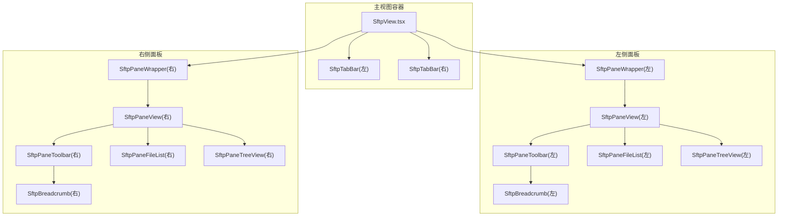
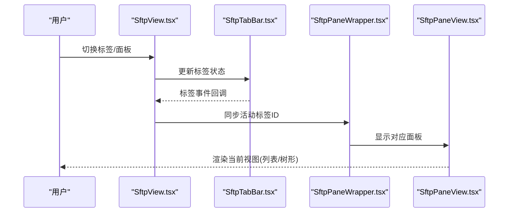
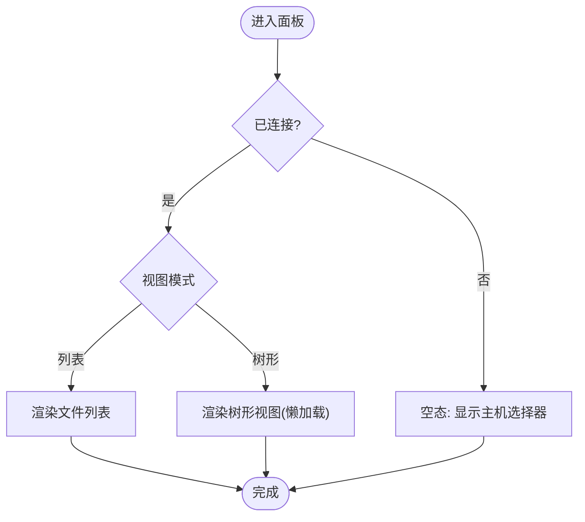
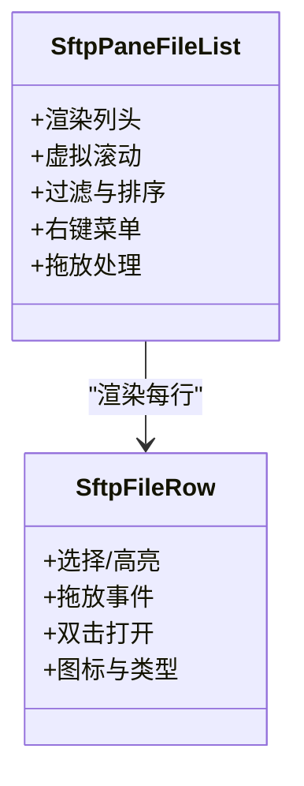
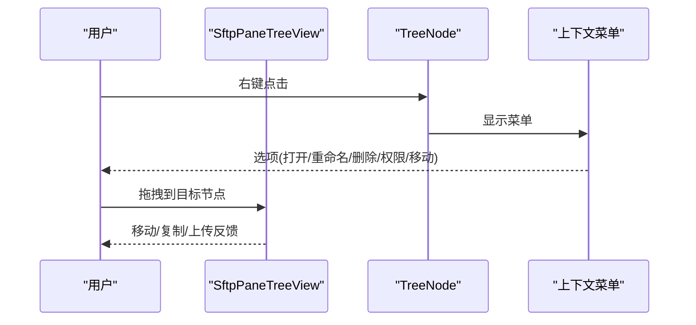
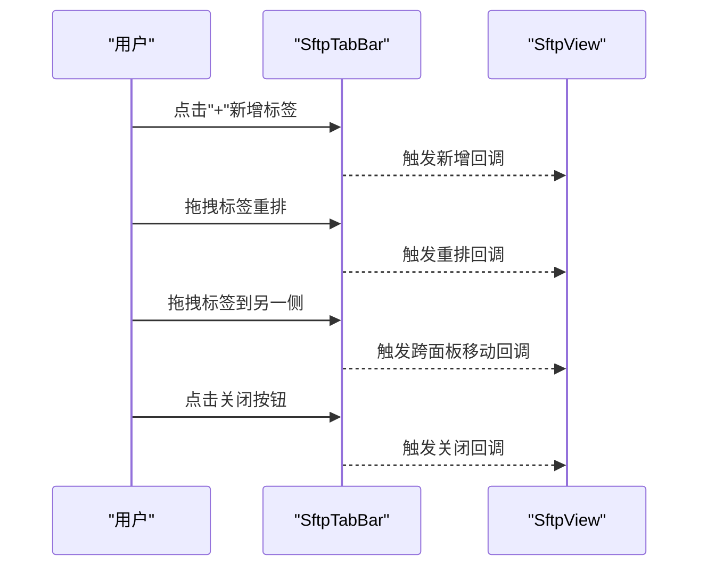
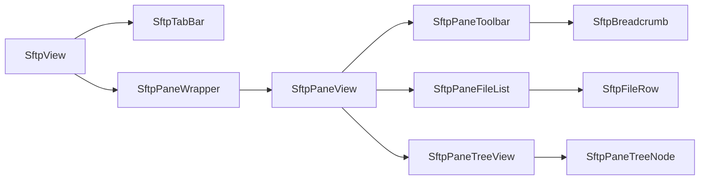

# 文件浏览器界面

<cite>
**本文档引用的文件**
- [SftpView.tsx](file://components/SftpView.tsx)
- [SftpPaneView.tsx](file://components/sftp/SftpPaneView.tsx)
- [SftpPaneFileList.tsx](file://components/sftp/SftpPaneFileList.tsx)
- [SftpPaneTreeView.tsx](file://components/sftp/SftpPaneTreeView.tsx)
- [SftpFileRow.tsx](file://components/sftp/SftpFileRow.tsx)
- [SftpBreadcrumb.tsx](file://components/sftp/SftpBreadcrumb.tsx)
- [SftpTabBar.tsx](file://components/sftp/SftpTabBar.tsx)
- [SftpPaneToolbar.tsx](file://components/sftp/SftpPaneToolbar.tsx)
- [SftpPaneTreeNode.tsx](file://components/sftp/SftpPaneTreeNode.tsx)
- [utils.ts](file://components/sftp/utils.ts)
- [useSftpViewTabs.ts](file://components/sftp/hooks/useSftpViewTabs.ts)
</cite>

## 目录
1. [简介](#简介)
2. [项目结构](#项目结构)
3. [核心组件](#核心组件)
4. [架构总览](#架构总览)
5. [详细组件分析](#详细组件分析)
6. [依赖关系分析](#依赖关系分析)
7. [性能考量](#性能考量)
8. [故障排查指南](#故障排查指南)
9. [结论](#结论)
10. [附录](#附录)

## 简介
本指南面向使用者，系统讲解 Netcatty 中的 SFTP 双面板文件浏览器界面。内容涵盖：
- 左侧本地文件系统面板与右侧远程主机面板的布局与使用
- 文件列表视图与树形视图两种显示模式的差异与切换
- 面包屑导航的作用与路径快速跳转技巧
- 文件行组件的交互：选择、右键菜单、双击行为等
- 标签页管理：多标签页操作、拖拽重排、跨面板移动、关闭等
- 实用最佳实践与效率提升技巧

## 项目结构
SFTP 文件浏览器由主视图容器与多个子组件协作构成，采用“双面板 + 多标签页 + 视图模式”的组织方式：
- 主视图容器负责左右面板布局、焦点管理、标签栏渲染与覆盖层控制
- 每个面板包含工具栏、文件列表/树形视图、对话框与空态组件
- 文件行组件承载单行文件项的渲染与交互
- 面包屑提供路径导航与快速跳转
- 标签栏支持标签页增删、拖拽重排与跨面板移动

图表来源
- [SftpView.tsx:404-587](file://components/SftpView.tsx#L404-L587)
- [SftpPaneView.tsx:42-671](file://components/sftp/SftpPaneView.tsx#L42-L671)

章节来源
- [SftpView.tsx:404-587](file://components/SftpView.tsx#L404-L587)
- [SftpPaneView.tsx:42-671](file://components/sftp/SftpPaneView.tsx#L42-L671)

## 核心组件
- 主视图容器：负责双面板布局、焦点指示器、标签栏与覆盖层管理
- 面板容器：根据活动标签控制可见性与层级，实现平滑切换
- 面板视图：统一承载工具栏、文件列表/树形视图、对话框与空态
- 文件列表：支持虚拟滚动、列宽调整、排序、过滤与上下文菜单
- 树形视图：支持展开/折叠、键盘导航、拖放移动、上下文菜单
- 文件行组件：单行渲染、选择高亮、拖放、双击打开
- 面包屑：路径导航、快速跳转、驱动器选择（本地 Windows）
- 标签栏：新增、关闭、拖拽重排、跨面板移动

章节来源
- [SftpView.tsx:404-587](file://components/SftpView.tsx#L404-L587)
- [SftpPaneView.tsx:42-671](file://components/sftp/SftpPaneView.tsx#L42-L671)
- [SftpPaneFileList.tsx:120-704](file://components/sftp/SftpPaneFileList.tsx#L120-L704)
- [SftpPaneTreeView.tsx:26-800](file://components/sftp/SftpPaneTreeView.tsx#L26-L800)
- [SftpFileRow.tsx:28-165](file://components/sftp/SftpFileRow.tsx#L28-L165)
- [SftpBreadcrumb.tsx:22-182](file://components/sftp/SftpBreadcrumb.tsx#L22-L182)
- [SftpTabBar.tsx:51-447](file://components/sftp/SftpTabBar.tsx#L51-L447)

## 架构总览
双面板文件浏览器以“主视图容器 + 面板容器 + 面板视图 + 子视图”的分层设计实现：
- 主视图容器订阅激活状态与标签状态，仅在需要时渲染
- 面板容器通过可见性与层级控制，避免频繁重渲染
- 面板视图根据连接状态与视图模式决定渲染文件列表或树形视图
- 文件列表与树形视图共享工具栏与面包屑，确保一致的导航体验

图表来源
- [SftpView.tsx:404-587](file://components/SftpView.tsx#L404-L587)
- [SftpTabBar.tsx:51-447](file://components/sftp/SftpTabBar.tsx#L51-L447)
- [SftpPaneView.tsx:42-671](file://components/sftp/SftpPaneView.tsx#L42-L671)

## 详细组件分析

### 双面板布局与焦点管理
- 左右面板各自维护独立标签集，点击面板区域可设置焦点
- 焦点切换时清理另一侧的选择，避免误操作影响
- 焦点指示器通过三角形装饰提示当前聚焦面板

章节来源
- [SftpView.tsx:186-207](file://components/SftpView.tsx#L186-L207)
- [SftpView.tsx:422-499](file://components/SftpView.tsx#L422-L499)

### 面板视图与视图模式
- 面板视图根据连接状态与视图模式渲染不同子视图
- 支持“列表”和“树形”两种模式，切换时清空过滤与选择
- 树形视图按需懒加载，首次进入才挂载

图表来源
- [SftpPaneView.tsx:445-649](file://components/sftp/SftpPaneView.tsx#L445-L649)

章节来源
- [SftpPaneView.tsx:82-124](file://components/sftp/SftpPaneView.tsx#L82-L124)
- [SftpPaneView.tsx:445-649](file://components/sftp/SftpPaneView.tsx#L445-L649)

### 文件列表视图
- 列头支持点击排序与列宽拖拽
- 虚拟滚动优化长列表性能
- 支持过滤条、隐藏文件开关、刷新、新建文件/文件夹
- 行组件支持选择、拖放、双击打开、右键菜单

图表来源
- [SftpPaneFileList.tsx:120-704](file://components/sftp/SftpPaneFileList.tsx#L120-L704)
- [SftpFileRow.tsx:28-165](file://components/sftp/SftpFileRow.tsx#L28-L165)

章节来源
- [SftpPaneFileList.tsx:120-704](file://components/sftp/SftpPaneFileList.tsx#L120-L704)
- [SftpFileRow.tsx:28-165](file://components/sftp/SftpFileRow.tsx#L28-L165)

### 树形视图
- 展开/折叠目录，支持加载中与错误状态
- 键盘导航：上下移动、Shift 扩展选择、Enter 打开/展开
- 拖放：同面板内移动、跨面板复制、外部文件上传
- 上下文菜单：打开、重命名、删除、权限编辑、移动到父级等

图表来源
- [SftpPaneTreeView.tsx:26-800](file://components/sftp/SftpPaneTreeView.tsx#L26-L800)
- [SftpPaneTreeNode.tsx:36-117](file://components/sftp/SftpPaneTreeNode.tsx#L36-L117)

章节来源
- [SftpPaneTreeView.tsx:26-800](file://components/sftp/SftpPaneTreeView.tsx#L26-L800)
- [SftpPaneTreeNode.tsx:36-117](file://components/sftp/SftpPaneTreeNode.tsx#L36-L117)

### 面包屑导航
- 支持路径双击编辑与自动补全
- Windows 驱动器选择（本地）
- 路径截断显示，保留首尾段，中间省略号提示

章节来源
- [SftpBreadcrumb.tsx:22-182](file://components/sftp/SftpBreadcrumb.tsx#L22-L182)
- [SftpPaneToolbar.tsx:424-500](file://components/sftp/SftpPaneToolbar.tsx#L424-L500)

### 文件行组件交互
- 单击选择；Shift 多选；Ctrl/Meta 多选
- 双击打开（文件下载/打开，目录进入）
- 右键菜单提供常用操作
- 拖放支持：拖出、拖入、悬停高亮

章节来源
- [SftpFileRow.tsx:28-165](file://components/sftp/SftpFileRow.tsx#L28-L165)
- [SftpPaneFileList.tsx:248-465](file://components/sftp/SftpPaneFileList.tsx#L248-L465)

### 标签页管理
- 新增标签：点击加号或选择主机
- 关闭标签：点击关闭按钮或中键点击
- 拖拽重排：在标签栏内拖拽调整顺序
- 跨面板移动：拖拽标签到另一侧面板
- 自动滚动：激活标签自动居中显示

图表来源
- [SftpTabBar.tsx:51-447](file://components/sftp/SftpTabBar.tsx#L51-L447)
- [useSftpViewTabs.ts:42-194](file://components/sftp/hooks/useSftpViewTabs.ts#L42-L194)

章节来源
- [SftpTabBar.tsx:51-447](file://components/sftp/SftpTabBar.tsx#L51-L447)
- [useSftpViewTabs.ts:42-194](file://components/sftp/hooks/useSftpViewTabs.ts#L42-L194)

## 依赖关系分析
- 主视图容器依赖标签栏与面板容器，面板容器依赖面板视图
- 面板视图依赖工具栏、文件列表/树形视图、面包屑
- 文件列表依赖文件行组件与工具栏
- 树形视图依赖节点组件与工具栏
- 工具栏依赖面包屑与视图切换按钮

图表来源
- [SftpView.tsx:404-587](file://components/SftpView.tsx#L404-L587)
- [SftpPaneView.tsx:42-671](file://components/sftp/SftpPaneView.tsx#L42-L671)
- [SftpPaneFileList.tsx:120-704](file://components/sftp/SftpPaneFileList.tsx#L120-L704)
- [SftpPaneTreeView.tsx:26-800](file://components/sftp/SftpPaneTreeView.tsx#L26-L800)
- [SftpFileRow.tsx:28-165](file://components/sftp/SftpFileRow.tsx#L28-L165)
- [SftpBreadcrumb.tsx:22-182](file://components/sftp/SftpBreadcrumb.tsx#L22-L182)
- [SftpPaneTreeNode.tsx:36-117](file://components/sftp/SftpPaneTreeNode.tsx#L36-L117)

## 性能考量
- 虚拟滚动：文件列表在长列表场景下启用虚拟化，减少 DOM 节点数量
- 懒加载树形视图：首次进入才渲染树形组件，降低初始渲染成本
- 列宽与排序：列模板与排序逻辑复用，避免重复计算
- 焦点隔离：切换面板时仅更新必要状态，减少重渲染范围

章节来源
- [SftpPaneFileList.tsx:332-339](file://components/sftp/SftpPaneFileList.tsx#L332-L339)
- [SftpPaneView.tsx:110-114](file://components/sftp/SftpPaneView.tsx#L110-L114)
- [utils.ts:260-267](file://components/sftp/utils.ts#L260-L267)

## 故障排查指南
- 连接丢失/重连：面板会显示重连遮罩，等待自动恢复
- 加载失败：文件列表显示错误与日志，支持重试
- 拖放无响应：检查目标节点是否为目录且非父级；确认拖放方向与来源面板
- 视图切换异常：切换至树形后会清除过滤与选择；重新输入过滤条件或刷新

章节来源
- [SftpPaneFileList.tsx:586-701](file://components/sftp/SftpPaneFileList.tsx#L586-L701)
- [SftpPaneTreeView.tsx:296-322](file://components/sftp/SftpPaneTreeView.tsx#L296-L322)

## 结论
该 SFTP 文件浏览器通过清晰的双面板结构、灵活的视图模式与完善的交互组件，提供了高效稳定的本地/远程文件管理体验。配合标签页管理与面包屑导航，用户可在复杂路径与多连接场景中保持高效率。

## 附录

### 文件列表与树形视图对比
- 文件列表
  - 适合快速浏览与批量操作
  - 支持列宽调整、排序、过滤
  - 虚拟滚动优化长列表
- 树形视图
  - 适合层级结构复杂的目录浏览
  - 支持展开/折叠、键盘导航
  - 拖放移动与上下文菜单更丰富

章节来源
- [SftpPaneFileList.tsx:120-704](file://components/sftp/SftpPaneFileList.tsx#L120-L704)
- [SftpPaneTreeView.tsx:26-800](file://components/sftp/SftpPaneTreeView.tsx#L26-L800)

### 面包屑导航技巧
- 双击路径进入编辑模式，支持自动补全
- Windows 下可从驱动器下拉选择磁盘
- 路径过长时自动截断，鼠标悬停查看完整路径

章节来源
- [SftpBreadcrumb.tsx:22-182](file://components/sftp/SftpBreadcrumb.tsx#L22-L182)
- [SftpPaneToolbar.tsx:424-500](file://components/sftp/SftpPaneToolbar.tsx#L424-L500)

### 文件行交互速览
- 单击：选择
- Shift + 单击：扩展选择
- Ctrl/Meta + 单击：追加/取消选择
- 双击：打开（文件下载/打开，目录进入）
- 右键：上下文菜单（打开、重命名、删除、权限、移动等）

章节来源
- [SftpFileRow.tsx:28-165](file://components/sftp/SftpFileRow.tsx#L28-L165)
- [SftpPaneFileList.tsx:248-465](file://components/sftp/SftpPaneFileList.tsx#L248-L465)

### 标签页最佳实践
- 使用拖拽重排整理常用连接顺序
- 跨面板移动标签快速切换工作区域
- 中键点击关闭标签，避免误触
- 避免同时打开过多标签导致滚动不便，可按需关闭

章节来源
- [SftpTabBar.tsx:51-447](file://components/sftp/SftpTabBar.tsx#L51-L447)
- [useSftpViewTabs.ts:42-194](file://components/sftp/hooks/useSftpViewTabs.ts#L42-L194)