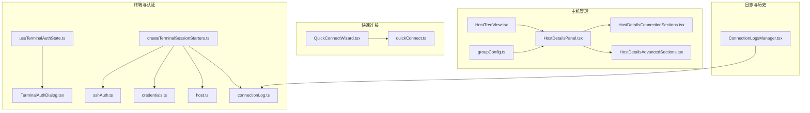
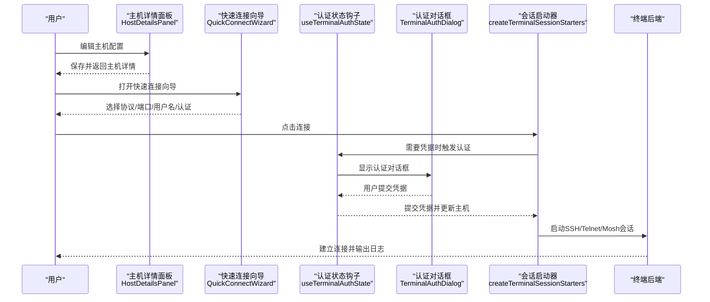
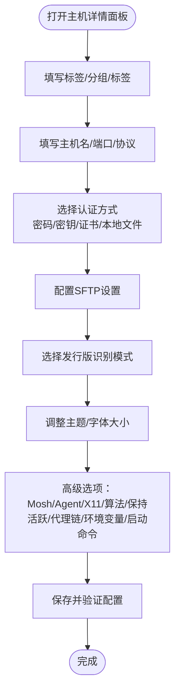
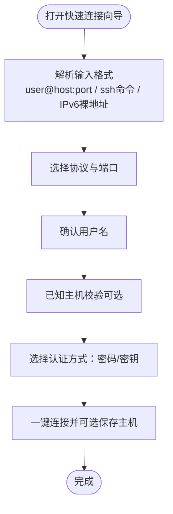
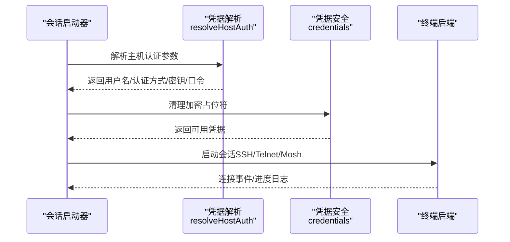
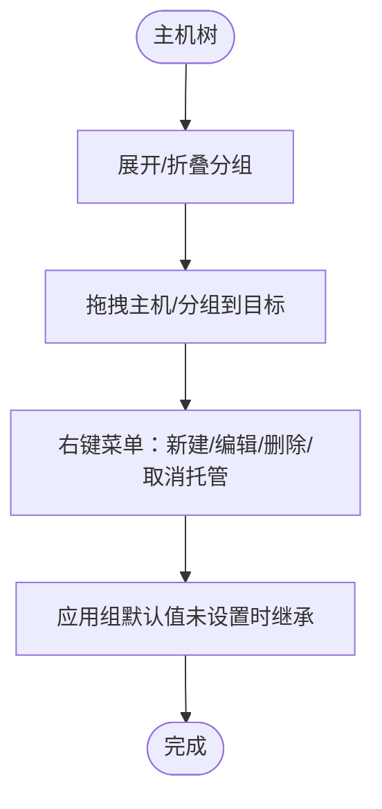
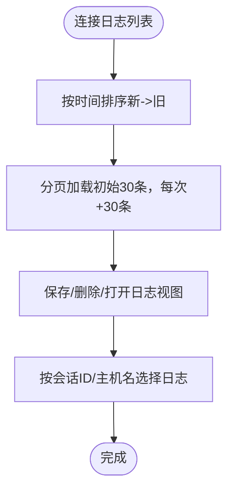
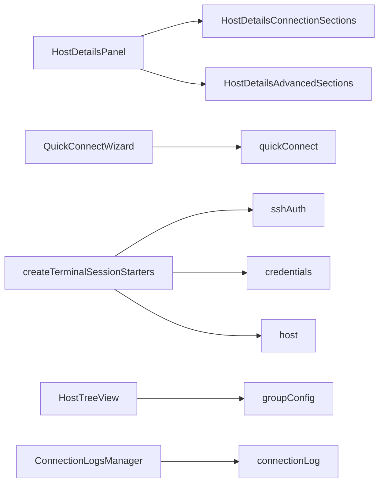

# SSH客户端管理

<cite>
**本文档引用的文件**
- [HostDetailsPanel.tsx](file://components/HostDetailsPanel.tsx)
- [HostDetailsConnectionSections.tsx](file://components/HostDetailsConnectionSections.tsx)
- [HostDetailsAdvancedSections.tsx](file://components/HostDetailsAdvancedSections.tsx)
- [QuickConnectWizard.tsx](file://components/QuickConnectWizard.tsx)
- [quickConnect.ts](file://domain/quickConnect.ts)
- [host.ts](file://domain/host.ts)
- [sshAuth.ts](file://domain/sshAuth.ts)
- [credentials.ts](file://domain/credentials.ts)
- [createTerminalSessionStarters.ts](file://components/terminal/runtime/createTerminalSessionStarters.ts)
- [useTerminalAuthState.ts](file://components/terminal/hooks/useTerminalAuthState.ts)
- [TerminalAuthDialog.tsx](file://components/terminal/TerminalAuthDialog.tsx)
- [HostTreeView.tsx](file://components/HostTreeView.tsx)
- [ConnectionLogsManager.tsx](file://components/ConnectionLogsManager.tsx)
- [connectionLog.ts](file://domain/connectionLog.ts)
- [groupConfig.ts](file://domain/groupConfig.ts)
</cite>

## 目录
1. [简介](#简介)
2. [项目结构](#项目结构)
3. [核心组件](#核心组件)
4. [架构总览](#架构总览)
5. [详细组件分析](#详细组件分析)
6. [依赖关系分析](#依赖关系分析)
7. [性能考虑](#性能考虑)
8. [故障排除指南](#故障排除指南)
9. [结论](#结论)
10. [附录](#附录)

## 简介
本指南面向需要在Netcatty中管理SSH/Telnet/Mosh主机连接的用户与管理员，涵盖从添加、配置到管理连接的完整流程。内容包括：
- 主机详情面板的各项配置项与行为
- 认证方式（密码、密钥、证书、键盘交互）与代理链路
- 协议选择（SSH、Telnet、Mosh）及特性差异
- 快速连接向导的使用方法与Quick Connect格式
- 主机组与标签管理、凭据安全存储机制
- 连接日志与历史记录查看
- 实际使用场景：批量导入主机、连接测试、故障排除
- 最佳实践与常见问题解决方案

## 项目结构
围绕SSH客户端管理的关键模块与职责如下：
- 主机详情与高级设置：HostDetailsPanel及其子面板（连接、高级）
- 快速连接向导：QuickConnectWizard与quickConnect解析器
- 终端会话与认证：createTerminalSessionStarters、useTerminalAuthState、TerminalAuthDialog
- 凭据与安全：credentials工具函数
- 主机树与分组：HostTreeView与groupConfig
- 日志与历史：ConnectionLogsManager与connectionLog选择逻辑

**图表来源**
- [HostDetailsPanel.tsx:103-442](file://components/HostDetailsPanel.tsx#L103-L442)
- [HostDetailsConnectionSections.tsx:19-756](file://components/HostDetailsConnectionSections.tsx#L19-L756)
- [HostDetailsAdvancedSections.tsx:38-630](file://components/HostDetailsAdvancedSections.tsx#L38-L630)
- [QuickConnectWizard.tsx:41-713](file://components/QuickConnectWizard.tsx#L41-L713)
- [quickConnect.ts:1-305](file://domain/quickConnect.ts#L1-L305)
- [createTerminalSessionStarters.ts:32-800](file://components/terminal/runtime/createTerminalSessionStarters.ts#L32-L800)
- [useTerminalAuthState.ts:9-155](file://components/terminal/hooks/useTerminalAuthState.ts#L9-L155)
- [TerminalAuthDialog.tsx:18-307](file://components/terminal/TerminalAuthDialog.tsx#L18-L307)
- [sshAuth.ts:44-125](file://domain/sshAuth.ts#L44-L125)
- [credentials.ts:30-111](file://domain/credentials.ts#L30-L111)
- [host.ts:151-265](file://domain/host.ts#L151-L265)
- [ConnectionLogsManager.tsx:152-266](file://components/ConnectionLogsManager.tsx#L152-L266)
- [connectionLog.ts:8-26](file://domain/connectionLog.ts#L8-L26)
- [groupConfig.ts:30-140](file://domain/groupConfig.ts#L30-L140)

**章节来源**
- [HostDetailsPanel.tsx:103-442](file://components/HostDetailsPanel.tsx#L103-L442)
- [HostDetailsConnectionSections.tsx:19-756](file://components/HostDetailsConnectionSections.tsx#L19-L756)
- [HostDetailsAdvancedSections.tsx:38-630](file://components/HostDetailsAdvancedSections.tsx#L38-L630)
- [QuickConnectWizard.tsx:41-713](file://components/QuickConnectWizard.tsx#L41-L713)
- [quickConnect.ts:1-305](file://domain/quickConnect.ts#L1-L305)
- [createTerminalSessionStarters.ts:32-800](file://components/terminal/runtime/createTerminalSessionStarters.ts#L32-L800)
- [useTerminalAuthState.ts:9-155](file://components/terminal/hooks/useTerminalAuthState.ts#L9-L155)
- [TerminalAuthDialog.tsx:18-307](file://components/terminal/TerminalAuthDialog.tsx#L18-L307)
- [sshAuth.ts:44-125](file://domain/sshAuth.ts#L44-L125)
- [credentials.ts:30-111](file://domain/credentials.ts#L30-L111)
- [host.ts:151-265](file://domain/host.ts#L151-L265)
- [ConnectionLogsManager.tsx:152-266](file://components/ConnectionLogsManager.tsx#L152-L266)
- [connectionLog.ts:8-26](file://domain/connectionLog.ts#L8-L26)
- [groupConfig.ts:30-140](file://domain/groupConfig.ts#L30-L140)

## 核心组件
- 主机详情面板：集中管理主机基本信息、地址端口、认证方式、SFTP设置、发行版识别、外观与行为、Mosh、代理链、环境变量、启动命令等。
- 快速连接向导：支持SSH/Telnet/Mosh协议选择、用户名、认证方式（密码/密钥）、端口与服务器路径输入，一键连接并可选保存主机。
- 终端会话与认证：根据主机配置与凭据解析结果，建立SSH/Telnet/Mosh会话；处理代理链、跳板主机、密钥回退、代理凭据不可用等场景。
- 凭据安全：加密占位符检测与清理，避免将设备绑定的加密凭据明文传输；同步前扫描敏感字段。
- 主机树与分组：按组层级展示主机，支持拖拽移动、多选、上下文菜单、展开/折叠控制。
- 日志与历史：连接日志列表、保存/删除、分页加载、按时间排序。

**章节来源**
- [HostDetailsPanel.tsx:103-442](file://components/HostDetailsPanel.tsx#L103-L442)
- [QuickConnectWizard.tsx:41-713](file://components/QuickConnectWizard.tsx#L41-L713)
- [createTerminalSessionStarters.ts:32-800](file://components/terminal/runtime/createTerminalSessionStarters.ts#L32-L800)
- [credentials.ts:30-111](file://domain/credentials.ts#L30-L111)
- [HostTreeView.tsx:448-634](file://components/HostTreeView.tsx#L448-L634)
- [ConnectionLogsManager.tsx:152-266](file://components/ConnectionLogsManager.tsx#L152-L266)

## 架构总览
下图展示了从用户操作到终端会话建立的整体流程，包括主机详情配置、快速连接、认证对话框、凭据安全处理与会话启动。

**图表来源**
- [HostDetailsPanel.tsx:343-442](file://components/HostDetailsPanel.tsx#L343-L442)
- [QuickConnectWizard.tsx:146-178](file://components/QuickConnectWizard.tsx#L146-L178)
- [useTerminalAuthState.ts:62-127](file://components/terminal/hooks/useTerminalAuthState.ts#L62-L127)
- [TerminalAuthDialog.tsx:41-307](file://components/terminal/TerminalAuthDialog.tsx#L41-L307)
- [createTerminalSessionStarters.ts:39-486](file://components/terminal/runtime/createTerminalSessionStarters.ts#L39-L486)

## 详细组件分析

### 主机详情面板（HostDetailsPanel）
- 功能概览
  - 通用信息：标签、分组、标签管理
  - 地址与端口：主机名、端口、协议（SSH/Telnet/Mosh）
  - 认证方式：用户名、密码、密钥/证书、本地密钥文件、凭据类型选择
  - SFTP设置：sudo权限、字符编码
  - 发行版识别：自动/手动模式、图标与名称
  - 外观与行为：主题、字体大小、回车键行为
  - 高级选项：Mosh开关、Agent转发、X11转发、网络设备模式、算法覆盖、保持活跃、代理链、环境变量、启动命令
- 关键实现要点
  - 分组默认值合并与继承：resolveGroupDefaults/applyGroupDefaults
  - 主题与字体覆盖：hasEffectiveThemeOverride/hasEffectiveFontSizeOverride
  - Telnet专用参数：resolveTelnetUsername/resolveTelnetPassword/resolveTelnetPort
  - 代理配置：normalizeManualProxyConfig/isCompleteProxyConfig
  - 跳板主机链：hostChain管理与校验
  - 保存逻辑：清理遗留主题/字体覆盖、移除不适用字段（如Mosh/X11）

**图表来源**
- [HostDetailsPanel.tsx:103-442](file://components/HostDetailsPanel.tsx#L103-L442)
- [HostDetailsConnectionSections.tsx:19-756](file://components/HostDetailsConnectionSections.tsx#L19-L756)
- [HostDetailsAdvancedSections.tsx:38-630](file://components/HostDetailsAdvancedSections.tsx#L38-L630)
- [groupConfig.ts:30-140](file://domain/groupConfig.ts#L30-L140)
- [host.ts:176-204](file://domain/host.ts#L176-L204)

**章节来源**
- [HostDetailsPanel.tsx:103-442](file://components/HostDetailsPanel.tsx#L103-L442)
- [HostDetailsConnectionSections.tsx:19-756](file://components/HostDetailsConnectionSections.tsx#L19-L756)
- [HostDetailsAdvancedSections.tsx:38-630](file://components/HostDetailsAdvancedSections.tsx#L38-L630)
- [groupConfig.ts:30-140](file://domain/groupConfig.ts#L30-L140)
- [host.ts:176-204](file://domain/host.ts#L176-L204)

### 快速连接向导（QuickConnectWizard）
- 支持格式
  - 直接格式：user@host:port 或 host:port
  - SSH命令格式：解析ssh命令中的用户名、端口、用户等选项
  - IPv6裸地址：仅含冒号且满足规则的地址
- 向导步骤
  - 协议选择：SSH/Telnet/Mosh，自动填充默认端口
  - 用户名确认：可编辑用户名
  - 已知主机校验：指纹提示与添加确认
  - 认证方式：密码或密钥选择，支持显示/隐藏密码
  - 一键连接：可选保存主机并立即连接
- 解析器
  - quickConnect.ts提供解析与警告收集，支持SSH选项解析与端口/用户覆盖

**图表来源**
- [QuickConnectWizard.tsx:41-713](file://components/QuickConnectWizard.tsx#L41-L713)
- [quickConnect.ts:24-299](file://domain/quickConnect.ts#L24-L299)

**章节来源**
- [QuickConnectWizard.tsx:41-713](file://components/QuickConnectWizard.tsx#L41-L713)
- [quickConnect.ts:24-299](file://domain/quickConnect.ts#L24-L299)

### 终端会话与认证（createTerminalSessionStarters）
- 会话启动
  - SSH：支持代理链、跳板主机、密钥回退、代理凭据不可用检测、键盘交互提示、算法覆盖、保持活跃
  - Telnet：不支持代理；支持自动登录等待与启动命令调度
  - Mosh：不支持代理与跳板主机链；支持密钥/密码认证
- 凭据解析与安全
  - resolveHostAuth：综合主机、身份、密钥与覆盖参数，推断认证方式
  - credentials：加密占位符检测与清理，避免明文传输；同步前扫描敏感字段
- 认证状态与对话框
  - useTerminalAuthState：维护认证状态、校验表单有效性、提交凭据并更新主机
  - TerminalAuthDialog：提供密码/密钥认证界面与“继续但不保存”选项

**图表来源**
- [createTerminalSessionStarters.ts:69-486](file://components/terminal/runtime/createTerminalSessionStarters.ts#L69-L486)
- [sshAuth.ts:44-125](file://domain/sshAuth.ts#L44-L125)
- [credentials.ts:30-111](file://domain/credentials.ts#L30-L111)
- [useTerminalAuthState.ts:62-127](file://components/terminal/hooks/useTerminalAuthState.ts#L62-L127)
- [TerminalAuthDialog.tsx:41-307](file://components/terminal/TerminalAuthDialog.tsx#L41-L307)

**章节来源**
- [createTerminalSessionStarters.ts:39-733](file://components/terminal/runtime/createTerminalSessionStarters.ts#L39-L733)
- [sshAuth.ts:44-125](file://domain/sshAuth.ts#L44-L125)
- [credentials.ts:30-111](file://domain/credentials.ts#L30-L111)
- [useTerminalAuthState.ts:9-155](file://components/terminal/hooks/useTerminalAuthState.ts#L9-L155)
- [TerminalAuthDialog.tsx:18-307](file://components/terminal/TerminalAuthDialog.tsx#L18-L307)

### 主机树与分组管理（HostTreeView）
- 展示与操作
  - 按组层级展开/折叠，支持展开全部/折叠全部
  - 右键菜单：新建主机/分组、重命名、删除、取消托管（托管分组）
  - 拖拽：主机/分组拖拽至目标分组，自动更新归属
  - 多选：支持多选主机进行批量操作
- 默认值应用
  - applyGroupDefaults：按祖先路径合并组默认值，仅在主机未设置时继承

**图表来源**
- [HostTreeView.tsx:448-634](file://components/HostTreeView.tsx#L448-L634)
- [groupConfig.ts:106-131](file://domain/groupConfig.ts#L106-L131)

**章节来源**
- [HostTreeView.tsx:448-634](file://components/HostTreeView.tsx#L448-L634)
- [groupConfig.ts:106-131](file://domain/groupConfig.ts#L106-L131)

### 日志与历史记录（ConnectionLogsManager）
- 功能
  - 列表展示：日期、用户、主机、协议/用户名、保存状态
  - 操作：保存/取消保存、删除、打开日志视图
  - 分页加载：初始渲染30条，每次点击加载30条
- 日志选择
  - selectConnectionLogForTerminalDataCapture：按会话ID或主机名匹配最近一次开放日志

**图表来源**
- [ConnectionLogsManager.tsx:152-266](file://components/ConnectionLogsManager.tsx#L152-L266)
- [connectionLog.ts:8-26](file://domain/connectionLog.ts#L8-L26)

**章节来源**
- [ConnectionLogsManager.tsx:152-266](file://components/ConnectionLogsManager.tsx#L152-L266)
- [connectionLog.ts:8-26](file://domain/connectionLog.ts#L8-L26)

## 依赖关系分析
- 组件耦合
  - HostDetailsPanel与HostDetailsConnectionSections/HostDetailsAdvancedSections高度内聚，统一管理主机对象状态
  - QuickConnectWizard依赖quickConnect解析器，向createTerminalSessionStarters提供临时Host
  - createTerminalSessionStarters依赖sshAuth与credentials，确保凭据安全与正确解析
  - HostTreeView与groupConfig协作，实现默认值继承与覆盖
- 外部依赖
  - 终端后端接口：SSH/Telnet/Mosh桥接、会话数据流、链路进度回调
  - 本地文件选择：用于本地密钥文件路径输入
- 循环依赖
  - 未发现循环依赖；各模块职责清晰，通过props与回调传递数据

**图表来源**
- [HostDetailsPanel.tsx:103-442](file://components/HostDetailsPanel.tsx#L103-L442)
- [HostDetailsConnectionSections.tsx:19-756](file://components/HostDetailsConnectionSections.tsx#L19-L756)
- [HostDetailsAdvancedSections.tsx:38-630](file://components/HostDetailsAdvancedSections.tsx#L38-L630)
- [QuickConnectWizard.tsx:41-713](file://components/QuickConnectWizard.tsx#L41-L713)
- [quickConnect.ts:1-305](file://domain/quickConnect.ts#L1-L305)
- [createTerminalSessionStarters.ts:32-800](file://components/terminal/runtime/createTerminalSessionStarters.ts#L32-L800)
- [sshAuth.ts:44-125](file://domain/sshAuth.ts#L44-L125)
- [credentials.ts:30-111](file://domain/credentials.ts#L30-L111)
- [HostTreeView.tsx:448-634](file://components/HostTreeView.tsx#L448-L634)
- [groupConfig.ts:30-140](file://domain/groupConfig.ts#L30-L140)
- [ConnectionLogsManager.tsx:152-266](file://components/ConnectionLogsManager.tsx#L152-L266)
- [connectionLog.ts:8-26](file://domain/connectionLog.ts#L8-L26)

**章节来源**
- [HostDetailsPanel.tsx:103-442](file://components/HostDetailsPanel.tsx#L103-L442)
- [HostDetailsConnectionSections.tsx:19-756](file://components/HostDetailsConnectionSections.tsx#L19-L756)
- [HostDetailsAdvancedSections.tsx:38-630](file://components/HostDetailsAdvancedSections.tsx#L38-L630)
- [QuickConnectWizard.tsx:41-713](file://components/QuickConnectWizard.tsx#L41-L713)
- [quickConnect.ts:1-305](file://domain/quickConnect.ts#L1-L305)
- [createTerminalSessionStarters.ts:32-800](file://components/terminal/runtime/createTerminalSessionStarters.ts#L32-L800)
- [sshAuth.ts:44-125](file://domain/sshAuth.ts#L44-L125)
- [credentials.ts:30-111](file://domain/credentials.ts#L30-L111)
- [HostTreeView.tsx:448-634](file://components/HostTreeView.tsx#L448-L634)
- [groupConfig.ts:30-140](file://domain/groupConfig.ts#L30-L140)
- [ConnectionLogsManager.tsx:152-266](file://components/ConnectionLogsManager.tsx#L152-L266)
- [connectionLog.ts:8-26](file://domain/connectionLog.ts#L8-L26)

## 性能考虑
- 虚拟化与滚动
  - ConnectionLogsManager使用滚动区域与分页加载，避免一次性渲染大量日志项
- 字体与主题覆盖
  - 仅在需要时设置覆盖，减少不必要的样式计算
- 会话启动优化
  - 代理链与跳板主机逐跳解析，失败时尽早提示，避免无效尝试
  - 保持活跃参数按主机覆盖，避免全局设置导致的误判

[本节为通用指导，无需特定文件引用]

## 故障排除指南
- 凭据不可用
  - 现象：提示“保存的凭据无法在此设备解密”
  - 处理：在认证对话框中重新输入并保存；检查加密占位符是否被清理
  - 参考：credentials.ts的加密占位符检测与清理
- 代理凭据缺失
  - 现象：提示“主机/跳板主机保存的代理缺失”
  - 处理：在主机设置中重新选择有效代理
- 键盘交互/认证失败
  - 现象：认证失败或需要键盘交互
  - 处理：在认证对话框中选择正确的认证方式；必要时启用键盘交互模式
- Telnet代理不支持
  - 现象：Telnet不支持代理连接
  - 处理：改用SSH或移除代理配置
- Mosh代理与跳板不支持
  - 现象：Mosh不支持代理与跳板主机链
  - 处理：改用SSH或移除代理与跳板主机链

**章节来源**
- [credentials.ts:30-111](file://domain/credentials.ts#L30-L111)
- [createTerminalSessionStarters.ts:103-240](file://components/terminal/runtime/createTerminalSessionStarters.ts#L103-L240)
- [createTerminalSessionStarters.ts:488-604](file://components/terminal/runtime/createTerminalSessionStarters.ts#L488-L604)
- [createTerminalSessionStarters.ts:606-733](file://components/terminal/runtime/createTerminalSessionStarters.ts#L606-L733)
- [useTerminalAuthState.ts:62-127](file://components/terminal/hooks/useTerminalAuthState.ts#L62-L127)
- [TerminalAuthDialog.tsx:41-307](file://components/terminal/TerminalAuthDialog.tsx#L41-L307)

## 结论
本指南系统性地梳理了Netcatty中SSH/Telnet/Mosh主机管理的全流程：从主机详情配置、快速连接向导、认证与安全，到会话启动、日志与历史记录。通过合理的分组与默认值继承、严格的凭据安全策略以及直观的UI交互，用户可以高效、安全地管理大量主机连接。

[本节为总结性内容，无需特定文件引用]

## 附录

### 实际使用场景与操作步骤
- 批量导入主机
  - 使用快速连接向导或主机详情面板批量创建主机，利用分组与标签进行分类
  - 参考：QuickConnectWizard.tsx、HostDetailsPanel.tsx、HostTreeView.tsx
- 连接测试
  - 在主机详情面板中配置认证方式与代理链，点击连接测试
  - 查看终端后端输出与进度日志，确认认证与代理链路
  - 参考：createTerminalSessionStarters.ts、useTerminalAuthState.ts、TerminalAuthDialog.tsx
- 故障排除
  - 检查凭据加密占位符与清理情况
  - 校验代理配置与跳板主机链完整性
  - 参考：credentials.ts、createTerminalSessionStarters.ts

**章节来源**
- [QuickConnectWizard.tsx:41-713](file://components/QuickConnectWizard.tsx#L41-L713)
- [HostDetailsPanel.tsx:103-442](file://components/HostDetailsPanel.tsx#L103-L442)
- [HostTreeView.tsx:448-634](file://components/HostTreeView.tsx#L448-L634)
- [createTerminalSessionStarters.ts:39-486](file://components/terminal/runtime/createTerminalSessionStarters.ts#L39-L486)
- [useTerminalAuthState.ts:62-127](file://components/terminal/hooks/useTerminalAuthState.ts#L62-L127)
- [TerminalAuthDialog.tsx:41-307](file://components/terminal/TerminalAuthDialog.tsx#L41-L307)
- [credentials.ts:30-111](file://domain/credentials.ts#L30-L111)

### 最佳实践建议
- 凭据安全
  - 优先使用密钥/证书认证；避免在主机上保存明文密码
  - 定期清理不再使用的密钥与代理配置
- 分组与默认值
  - 合理使用分组默认值，减少重复配置
  - 对网络设备主机启用“网络设备模式”，避免不兼容的特性
- 代理与跳板
  - 代理链与跳板主机应明确配置，避免凭据缺失导致连接失败
- 日志与审计
  - 启用会话日志以便事后审计与排障
  - 定期清理未保存的历史记录

[本节为通用指导，无需特定文件引用]