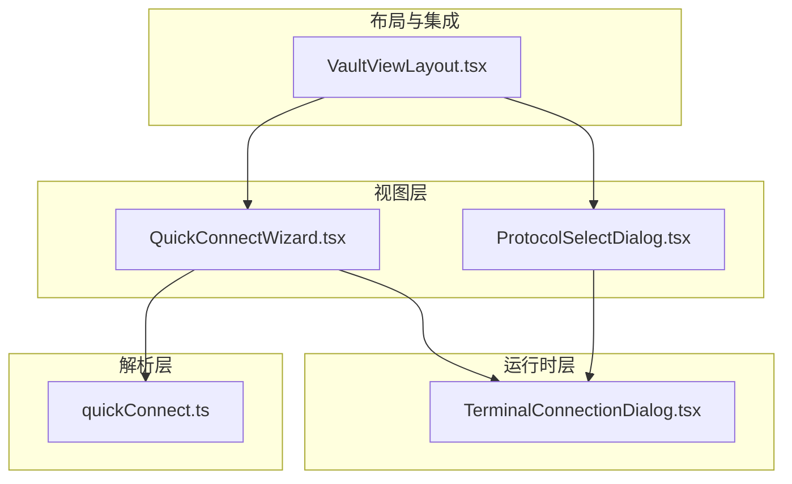
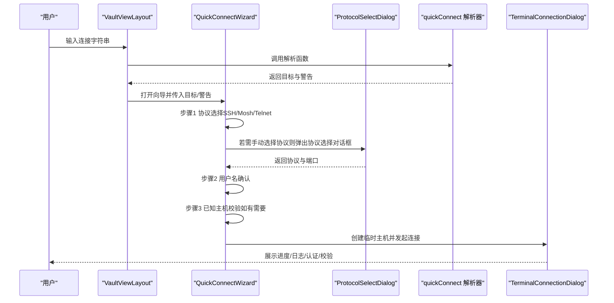
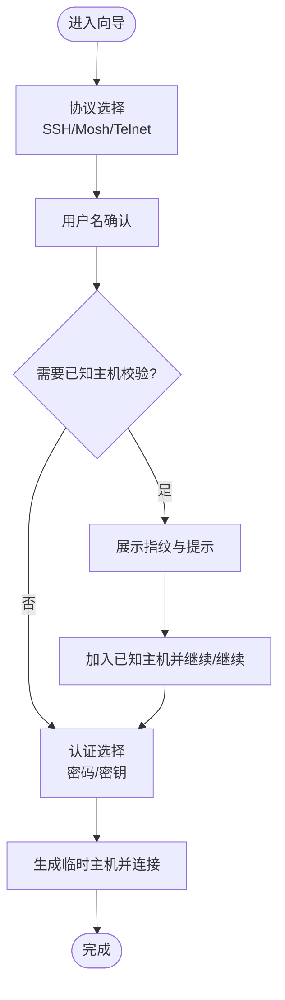
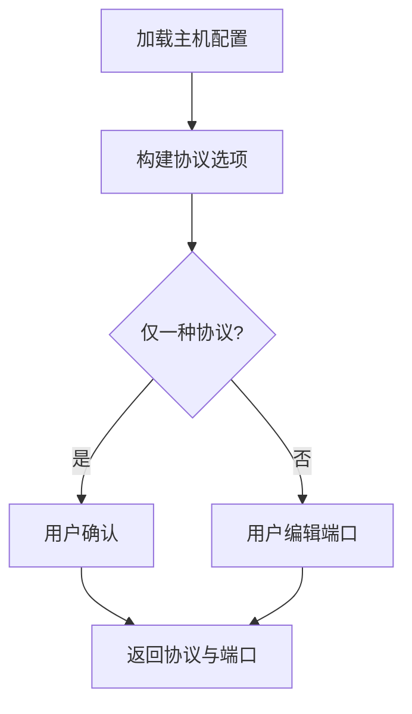
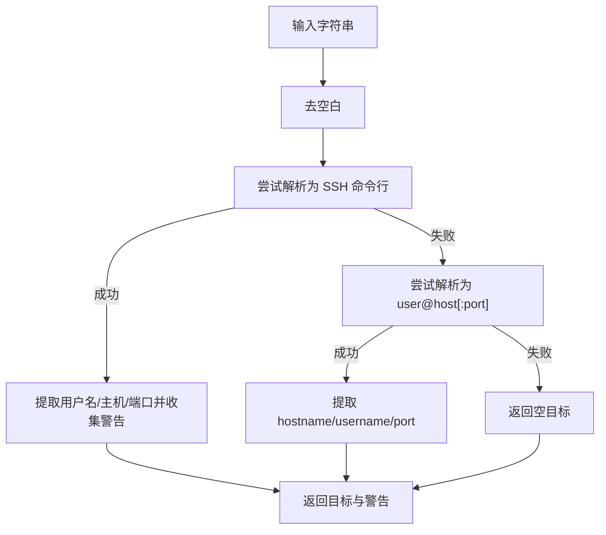
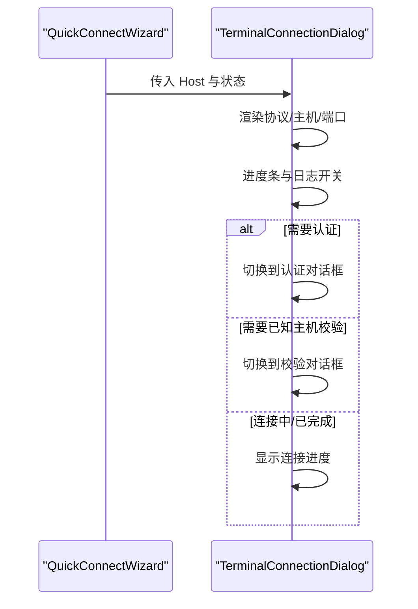
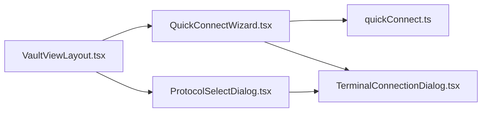

# 快速连接向导

<cite>
**本文引用的文件**
- [QuickConnectWizard.tsx](file://components/QuickConnectWizard.tsx)
- [ProtocolSelectDialog.tsx](file://components/ProtocolSelectDialog.tsx)
- [quickConnect.ts](file://domain/quickConnect.ts)
- [TerminalConnectionDialog.tsx](file://components/terminal/TerminalConnectionDialog.tsx)
- [vault.ts（中文）](file://application/i18n/locales/zh-CN/vault.ts)
- [VaultViewLayout.tsx](file://components/vault/VaultViewLayout.tsx)
</cite>

## 目录
1. [简介](#简介)
2. [项目结构](#项目结构)
3. [核心组件](#核心组件)
4. [架构总览](#架构总览)
5. [详细组件分析](#详细组件分析)
6. [依赖关系分析](#依赖关系分析)
7. [性能考量](#性能考量)
8. [故障排除指南](#故障排除指南)
9. [结论](#结论)
10. [附录](#附录)

## 简介
本文件系统性阐述“快速连接向导”的设计与实现，涵盖：
- Quick Connect 格式的语法与解析规则（标准格式、简写格式、SSH 命令行风格）
- 向导交互流程（从输入连接字符串到确认连接参数）
- 协议自动检测与手动选择（SSH、Telnet、Mosh）
- 安全检查与警告机制（已知主机校验、不安全参数提示）
- 典型使用场景（一次性连接、临时访问、批量导入）
- 常见错误与排障建议

## 项目结构
快速连接相关能力由三层协作构成：
- 解析层：负责将用户输入解析为 QuickConnectTarget，并对 SSH 命令行参数进行提取与告警
- 视图层：提供 QuickConnectWizard 与 ProtocolSelectDialog，引导用户完成协议与认证选择
- 运行时层：在连接阶段展示 TerminalConnectionDialog，处理认证与已知主机校验

**图表来源**
- [QuickConnectWizard.tsx:41-713](file://components/QuickConnectWizard.tsx#L41-L713)
- [ProtocolSelectDialog.tsx:29-212](file://components/ProtocolSelectDialog.tsx#L29-L212)
- [quickConnect.ts:1-305](file://domain/quickConnect.ts#L1-L305)
- [TerminalConnectionDialog.tsx:47-68](file://components/terminal/TerminalConnectionDialog.tsx#L47-L68)
- [VaultViewLayout.tsx:837-862](file://components/vault/VaultViewLayout.tsx#L837-L862)

**章节来源**
- [QuickConnectWizard.tsx:41-713](file://components/QuickConnectWizard.tsx#L41-L713)
- [ProtocolSelectDialog.tsx:29-212](file://components/ProtocolSelectDialog.tsx#L29-L212)
- [quickConnect.ts:1-305](file://domain/quickConnect.ts#L1-L305)
- [TerminalConnectionDialog.tsx:47-68](file://components/terminal/TerminalConnectionDialog.tsx#L47-L68)
- [VaultViewLayout.tsx:837-862](file://components/vault/VaultViewLayout.tsx#L837-L862)

## 核心组件
- QuickConnectWizard：多步骤向导，引导用户选择协议、填写用户名、处理已知主机校验、完成认证
- ProtocolSelectDialog：在已有主机配置基础上，按启用状态列出可选协议与端口
- quickConnect：解析 user@host:port 与 ssh 命令行格式，提取目标与参数，生成解析结果与警告
- TerminalConnectionDialog：连接过程中的进度、日志、认证与已知主机校验界面
- VaultViewLayout：触发 QuickConnectWizard 并传递解析后的目标与警告

**章节来源**
- [QuickConnectWizard.tsx:24-713](file://components/QuickConnectWizard.tsx#L24-L713)
- [ProtocolSelectDialog.tsx:14-212](file://components/ProtocolSelectDialog.tsx#L14-L212)
- [quickConnect.ts:1-305](file://domain/quickConnect.ts#L1-L305)
- [TerminalConnectionDialog.tsx:24-45](file://components/terminal/TerminalConnectionDialog.tsx#L24-L45)
- [VaultViewLayout.tsx:837-862](file://components/vault/VaultViewLayout.tsx#L837-L862)

## 架构总览
下图展示了从用户输入到连接建立的关键交互路径。

**图表来源**
- [VaultViewLayout.tsx:837-862](file://components/vault/VaultViewLayout.tsx#L837-L862)
- [QuickConnectWizard.tsx:101-178](file://components/QuickConnectWizard.tsx#L101-L178)
- [ProtocolSelectDialog.tsx:29-104](file://components/ProtocolSelectDialog.tsx#L29-L104)
- [quickConnect.ts:281-299](file://domain/quickConnect.ts#L281-L299)
- [TerminalConnectionDialog.tsx:70-84](file://components/terminal/TerminalConnectionDialog.tsx#L70-L84)

## 详细组件分析

### QuickConnectWizard 组件
- 多步骤流程
  - 协议选择：支持 SSH、Mosh、Telnet，默认 SSH；Mosh 支持自定义 server 路径
  - 用户名确认：允许编辑用户名，回车继续
  - 已知主机校验：展示指纹与提示，支持加入已知主机后继续
  - 认证：密码或密钥；无密钥时提供“添加密钥”入口
- 关键行为
  - 自动端口：根据协议设置默认端口；当端口与默认一致时随协议切换同步更新
  - 连接生成：构造临时 Host 对象，必要时调用保存主机回调
  - 警告展示：顶部显示解析器返回的未解析 SSH 选项警告
- 国际化文案：包含已知主机校验标题、指纹标签、添加问题、添加并继续、添加密钥、未解析选项警告等

**图表来源**
- [QuickConnectWizard.tsx:198-512](file://components/QuickConnectWizard.tsx#L198-L512)
- [QuickConnectWizard.tsx:146-178](file://components/QuickConnectWizard.tsx#L146-L178)

**章节来源**
- [QuickConnectWizard.tsx:24-713](file://components/QuickConnectWizard.tsx#L24-L713)
- [vault.ts（中文）:11-18](file://application/i18n/locales/zh-CN/vault.ts#L11-L18)

### ProtocolSelectDialog 组件
- 功能：基于主机配置动态生成协议选项（SSH、Mosh、Telnet），允许用户修改端口
- 逻辑要点
  - 依据主机字段与协议配置决定协议可用性
  - 内置端口编辑，范围校验（1~65535）
  - 单协议时保留用户确认动作，避免自动跳过

**图表来源**
- [ProtocolSelectDialog.tsx:36-104](file://components/ProtocolSelectDialog.tsx#L36-L104)

**章节来源**
- [ProtocolSelectDialog.tsx:29-212](file://components/ProtocolSelectDialog.tsx#L29-L212)

### quickConnect 解析器
- 支持的输入格式
  - 标准格式：user@host:port 或 host:port 或 user@host
  - SSH 命令行风格：以 ssh 开头，支持 -p、-l、-o 等选项；对未解析的选项生成警告
- 解析规则
  - IPv4/IPv6/域名校验；端口范围校验
  - SSH 选项解析：优先级与合并策略（命令行显式端口/用户优先于 -o 指定项）
  - IPv6 特殊处理：裸 IPv6 地址需通过方括号指定端口
- 输出
  - QuickConnectTarget：包含 hostname、username、port
  - warnings：未解析的 SSH 选项集合

**图表来源**
- [quickConnect.ts:281-299](file://domain/quickConnect.ts#L281-L299)
- [quickConnect.ts:24-78](file://domain/quickConnect.ts#L24-L78)
- [quickConnect.ts:122-279](file://domain/quickConnect.ts#L122-L279)

**章节来源**
- [quickConnect.ts:1-305](file://domain/quickConnect.ts#L1-L305)

### TerminalConnectionDialog 运行时界面
- 展示协议、主机、端口、连接进度与日志
- 在需要认证或已知主机校验时切换对应内容区域
- 支持取消连接、显示/隐藏日志、链路跳数指示

**图表来源**
- [TerminalConnectionDialog.tsx:47-68](file://components/terminal/TerminalConnectionDialog.tsx#L47-L68)
- [TerminalConnectionDialog.tsx:284-302](file://components/terminal/TerminalConnectionDialog.tsx#L284-L302)

**章节来源**
- [TerminalConnectionDialog.tsx:24-309](file://components/terminal/TerminalConnectionDialog.tsx#L24-L309)

## 依赖关系分析
- VaultViewLayout 负责触发 QuickConnectWizard，并将解析结果与警告传入
- QuickConnectWizard 依赖 quickConnect 解析器提供的目标与警告
- ProtocolSelectDialog 作为独立对话框，供需要手动选择协议时使用
- TerminalConnectionDialog 作为连接阶段的统一 UI，被 QuickConnectWizard 调用

**图表来源**
- [VaultViewLayout.tsx:837-862](file://components/vault/VaultViewLayout.tsx#L837-L862)
- [QuickConnectWizard.tsx:15-16](file://components/QuickConnectWizard.tsx#L15-L16)
- [quickConnect.ts:1-5](file://domain/quickConnect.ts#L1-L5)
- [TerminalConnectionDialog.tsx:24-45](file://components/terminal/TerminalConnectionDialog.tsx#L24-L45)
- [ProtocolSelectDialog.tsx:23-33](file://components/ProtocolSelectDialog.tsx#L23-L33)

**章节来源**
- [VaultViewLayout.tsx:837-862](file://components/vault/VaultViewLayout.tsx#L837-L862)
- [QuickConnectWizard.tsx:15-16](file://components/QuickConnectWizard.tsx#L15-L16)
- [quickConnect.ts:1-5](file://domain/quickConnect.ts#L1-L5)
- [TerminalConnectionDialog.tsx:24-45](file://components/terminal/TerminalConnectionDialog.tsx#L24-L45)
- [ProtocolSelectDialog.tsx:23-33](file://components/ProtocolSelectDialog.tsx#L23-L33)

## 性能考量
- 解析复杂度
  - 直接格式解析为线性扫描，时间复杂度 O(n)，空间复杂度 O(1)
  - SSH 命令行解析按 token 遍历，整体 O(m)，m 为 token 数量
- UI 渲染
  - 向导与对话框采用受控组件与 useMemo 优化，减少重渲染
  - 协议选择对话框内置端口缓存，避免重复计算
- 连接阶段
  - 进度条动画与日志开关按需渲染，降低不必要的 DOM 更新

[本节为通用性能讨论，无需特定文件引用]

## 故障排除指南
- 输入格式错误
  - IPv6 未加方括号且带端口：应写为 [ipv6]:port
  - IPv6 裸地址未指定端口：解析器会按默认端口处理，但建议明确指定
  - SSH 选项未生效：解析器会报告未解析选项，检查拼写与支持的选项集合
- 端口无效
  - 端口不在 1~65535 范围内将导致解析失败
- 认证失败
  - 密码为空或密钥未选择：向导在认证步骤禁用“继续”
  - 无可用密钥：可点击“添加密钥”引导导入
- 已知主机校验
  - 若指纹不匹配或变更，需在 TerminalConnectionDialog 中确认继续或拒绝
- 日志查看
  - 连接过程中可切换“显示日志”，便于定位问题

**章节来源**
- [quickConnect.ts:54-77](file://domain/quickConnect.ts#L54-L77)
- [quickConnect.ts:122-279](file://domain/quickConnect.ts#L122-L279)
- [QuickConnectWizard.tsx:180-195](file://components/QuickConnectWizard.tsx#L180-L195)
- [TerminalConnectionDialog.tsx:195-222](file://components/terminal/TerminalConnectionDialog.tsx#L195-L222)

## 结论
快速连接向导通过清晰的解析层、直观的向导界面与统一的连接对话框，实现了从任意输入到稳定连接的闭环。其特性包括：
- 多格式输入支持与智能解析
- 协议与端口的灵活选择
- 安全校验与风险提示
- 丰富的使用场景适配与故障排查指引

[本节为总结性内容，无需特定文件引用]

## 附录

### Quick Connect 语法与示例
- 标准格式
  - user@host:port
  - host:port
  - user@host
- SSH 命令行风格
  - ssh user@host -p 2222 -l admin -o Port=2222 -o User=alice
  - 未解析选项会被记录为警告
- IPv6 注意事项
  - 裸 IPv6 地址：user@[ipv6]
  - 带端口：[ipv6]:port

**章节来源**
- [quickConnect.ts:24-78](file://domain/quickConnect.ts#L24-L78)
- [quickConnect.ts:122-279](file://domain/quickConnect.ts#L122-L279)
- [vault.ts（中文）:17-18](file://application/i18n/locales/zh-CN/vault.ts#L17-L18)

### 使用场景示例
- 一次性连接
  - 直接输入 user@host:port，向导自动填充协议与端口，完成认证后连接
- 临时访问
  - 使用 SSH 命令行风格输入，覆盖默认端口或用户，解析器会提示未解析选项
- 批量导入
  - 在导入流程中复用解析器，将 token 转换为 QuickConnectTarget，再交由向导或直接连接

**章节来源**
- [quickConnect.ts:281-299](file://domain/quickConnect.ts#L281-L299)
- [VaultViewLayout.tsx:837-862](file://components/vault/VaultViewLayout.tsx#L837-L862)