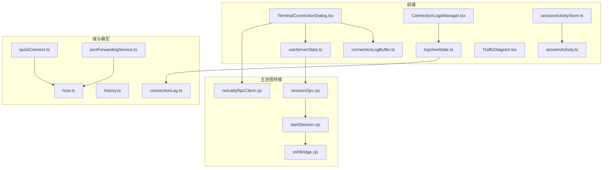
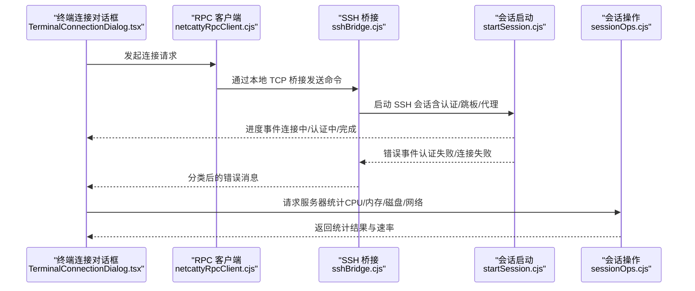
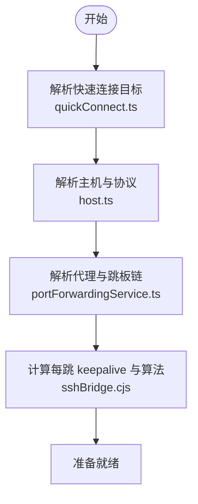
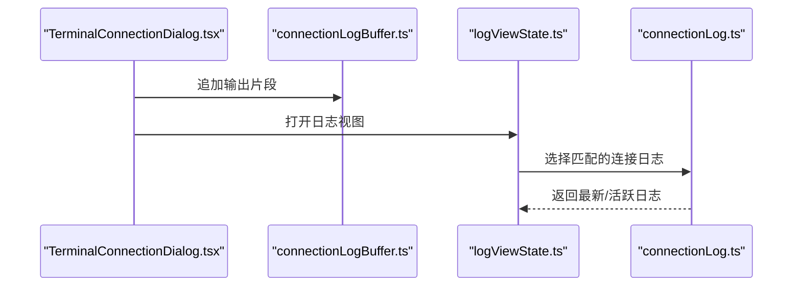
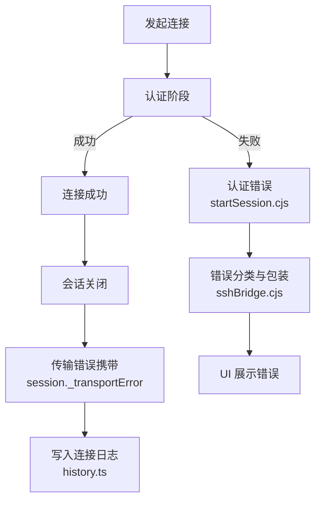
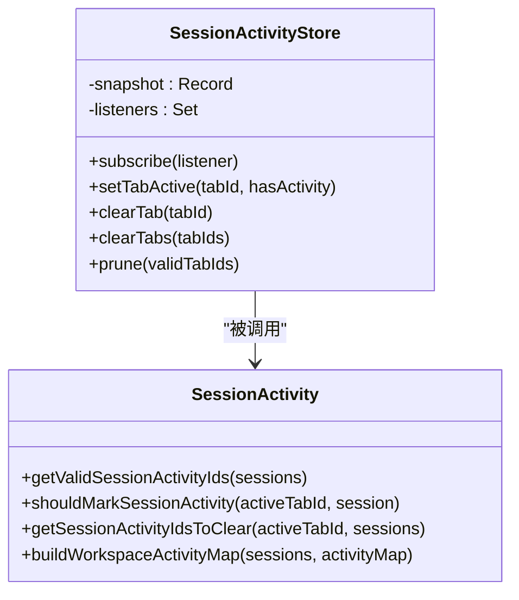
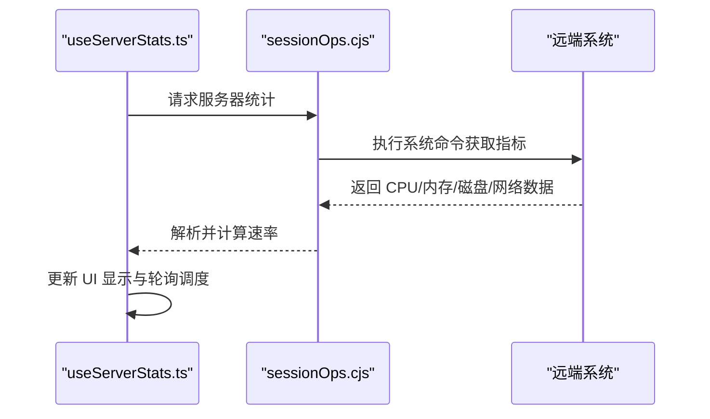
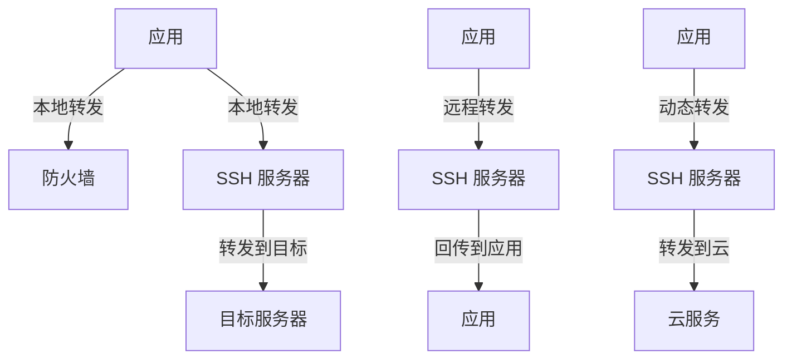
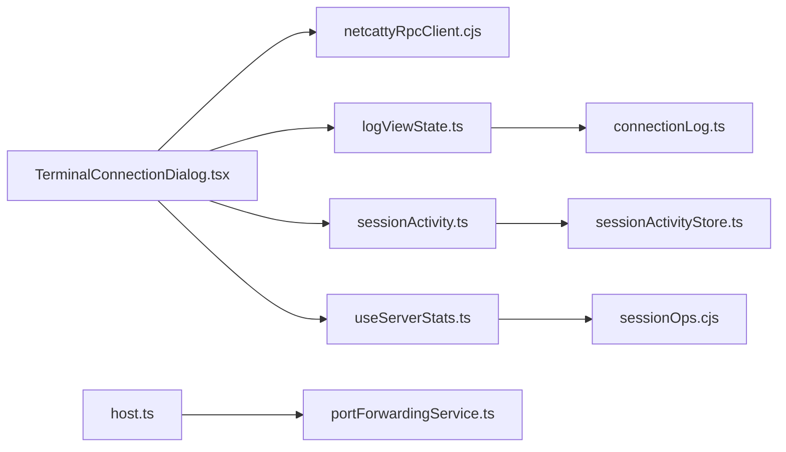

# 连接测试

<cite>
**本文引用的文件**
- [TerminalConnectionDialog.tsx](file://components/terminal/TerminalConnectionDialog.tsx)
- [connectionLogBuffer.ts](file://components/terminal/connectionLogBuffer.ts)
- [ConnectionLogsManager.tsx](file://components/ConnectionLogsManager.tsx)
- [logViewState.ts](file://application/state/logViewState.ts)
- [connectionLog.ts](file://domain/connectionLog.ts)
- [history.ts](file://domain/models/history.ts)
- [sessionActivity.ts](file://application/state/sessionActivity.ts)
- [sessionActivityStore.ts](file://application/state/sessionActivityStore.ts)
- [useServerStats.ts](file://components/terminal/hooks/useServerStats.ts)
- [sessionOps.cjs](file://electron/bridges/sshBridge/sessionOps.cjs)
- [startSession.cjs](file://electron/bridges/sshBridge/startSession.cjs)
- [sshBridge.cjs](file://electron/bridges/sshBridge.cjs)
- [TrafficDiagram.tsx](file://components/TrafficDiagram.tsx)
- [host.ts](file://domain/host.ts)
- [quickConnect.ts](file://domain/quickConnect.ts)
- [portForwardingService.ts](file://infrastructure/services/portForwardingService.ts)
- [netcattyRpcClient.cjs](file://electron/cli/netcattyRpcClient.cjs)
</cite>

## 目录
1. [简介](#简介)
2. [项目结构](#项目结构)
3. [核心组件](#核心组件)
4. [架构总览](#架构总览)
5. [详细组件分析](#详细组件分析)
6. [依赖关系分析](#依赖关系分析)
7. [性能考量](#性能考量)
8. [故障排查指南](#故障排查指南)
9. [结论](#结论)
10. [附录](#附录)

## 简介
本章节面向“连接测试”主题，系统化阐述如何在应用中进行主机连接的可用性与稳定性验证、连接前后检查流程、连接日志的查看与分析（成功、失败、认证错误等）、会话活动监控（连接状态、活动时间、异常断开检测）、以及连接性能测试与网络质量评估（延迟、带宽、丢包）。同时提供网络连通性测试、端口扫描、DNS 解析验证等实用诊断技巧，并总结常见问题的解决方案与预防措施。

## 项目结构
围绕连接测试的关键代码分布在以下层次：
- 终端连接 UI：负责连接过程展示、进度与日志开关、认证弹窗与主机密钥校验提示
- 连接日志与视图：缓冲区、选择器、视图管理与列表展示
- 会话活动监控：会话活跃度存储与映射构建
- 性能与网络质量：服务端统计采集（CPU/内存/磁盘/网络）与速率计算
- 桥接层（Electron 主进程）：SSH 会话启动、认证处理、错误分类与上报
- 域模型与工具：主机信息、快速连接解析、代理与跳板配置、端口转发服务

**图表来源**
- [TerminalConnectionDialog.tsx:1-309](file://components/terminal/TerminalConnectionDialog.tsx#L1-L309)
- [connectionLogBuffer.ts:1-95](file://components/terminal/connectionLogBuffer.ts#L1-L95)
- [ConnectionLogsManager.tsx:1-190](file://components/ConnectionLogsManager.tsx#L1-L190)
- [logViewState.ts:1-24](file://application/state/logViewState.ts#L1-L24)
- [connectionLog.ts:1-25](file://domain/connectionLog.ts#L1-L25)
- [history.ts:24-56](file://domain/models/history.ts#L24-L56)
- [sessionActivityStore.ts:1-79](file://application/state/sessionActivityStore.ts#L1-L79)
- [sessionActivity.ts:1-47](file://application/state/sessionActivity.ts#L1-L47)
- [useServerStats.ts:102-284](file://components/terminal/hooks/useServerStats.ts#L102-L284)
- [sessionOps.cjs:483-770](file://electron/bridges/sshBridge/sessionOps.cjs#L483-L770)
- [startSession.cjs:297-812](file://electron/bridges/sshBridge/startSession.cjs#L297-L812)
- [sshBridge.cjs:837-872](file://electron/bridges/sshBridge.cjs#L837-L872)
- [TrafficDiagram.tsx:1-193](file://components/TrafficDiagram.tsx#L1-L193)
- [host.ts:63-82](file://domain/host.ts#L63-L82)
- [quickConnect.ts:1-31](file://domain/quickConnect.ts#L1-L31)
- [portForwardingService.ts:392-607](file://infrastructure/services/portForwardingService.ts#L392-L607)
- [netcattyRpcClient.cjs:84-142](file://electron/cli/netcattyRpcClient.cjs#L84-L142)

**章节来源**
- [TerminalConnectionDialog.tsx:1-309](file://components/terminal/TerminalConnectionDialog.tsx#L1-L309)
- [connectionLogBuffer.ts:1-95](file://components/terminal/connectionLogBuffer.ts#L1-L95)
- [ConnectionLogsManager.tsx:1-190](file://components/ConnectionLogsManager.tsx#L1-L190)
- [logViewState.ts:1-24](file://application/state/logViewState.ts#L1-L24)
- [connectionLog.ts:1-25](file://domain/connectionLog.ts#L1-L25)
- [history.ts:24-56](file://domain/models/history.ts#L24-L56)
- [sessionActivityStore.ts:1-79](file://application/state/sessionActivityStore.ts#L1-L79)
- [sessionActivity.ts:1-47](file://application/state/sessionActivity.ts#L1-L47)
- [useServerStats.ts:102-284](file://components/terminal/hooks/useServerStats.ts#L102-L284)
- [sessionOps.cjs:483-770](file://electron/bridges/sshBridge/sessionOps.cjs#L483-L770)
- [startSession.cjs:297-812](file://electron/bridges/sshBridge/startSession.cjs#L297-L812)
- [sshBridge.cjs:837-872](file://electron/bridges/sshBridge.cjs#L837-L872)
- [TrafficDiagram.tsx:1-193](file://components/TrafficDiagram.tsx#L1-L193)
- [host.ts:63-82](file://domain/host.ts#L63-L82)
- [quickConnect.ts:1-31](file://domain/quickConnect.ts#L1-L31)
- [portForwardingService.ts:392-607](file://infrastructure/services/portForwardingService.ts#L392-L607)
- [netcattyRpcClient.cjs:84-142](file://electron/cli/netcattyRpcClient.cjs#L84-L142)

## 核心组件
- 连接对话框与进度：提供连接阶段可视化、日志开关、认证与主机密钥校验交互
- 连接日志缓冲与视图：按需保留最近字符数的日志缓冲，支持打开/关闭日志视图并定位到对应连接
- 连接日志列表管理：按时间排序、分页加载、保存/删除、清理未保存日志
- 会话活动监控：记录活跃标签页/工作区，构建会话活跃映射，清理无效项
- 服务器统计与网络质量：采集 CPU/内存/磁盘/网络接口字节与速率，计算每秒吞吐
- 桥接层错误分类：区分认证错误与连接错误，避免崩溃并反馈给渲染层
- 快速连接与主机解析：解析用户输入的目标串，支持 IPv6、用户名与端口
- 端口转发与跳板：支持多跳链路、代理与重连策略

**章节来源**
- [TerminalConnectionDialog.tsx:1-309](file://components/terminal/TerminalConnectionDialog.tsx#L1-L309)
- [connectionLogBuffer.ts:1-95](file://components/terminal/connectionLogBuffer.ts#L1-L95)
- [ConnectionLogsManager.tsx:1-190](file://components/ConnectionLogsManager.tsx#L1-L190)
- [logViewState.ts:1-24](file://application/state/logViewState.ts#L1-L24)
- [connectionLog.ts:1-25](file://domain/connectionLog.ts#L1-L25)
- [sessionActivityStore.ts:1-79](file://application/state/sessionActivityStore.ts#L1-L79)
- [sessionActivity.ts:1-47](file://application/state/sessionActivity.ts#L1-L47)
- [useServerStats.ts:102-284](file://components/terminal/hooks/useServerStats.ts#L102-L284)
- [sessionOps.cjs:483-770](file://electron/bridges/sshBridge/sessionOps.cjs#L483-L770)
- [startSession.cjs:297-812](file://electron/bridges/sshBridge/startSession.cjs#L297-L812)
- [sshBridge.cjs:837-872](file://electron/bridges/sshBridge.cjs#L837-L872)
- [quickConnect.ts:1-31](file://domain/quickConnect.ts#L1-L31)
- [host.ts:63-82](file://domain/host.ts#L63-L82)
- [portForwardingService.ts:392-607](file://infrastructure/services/portForwardingService.ts#L392-L607)

## 架构总览
下图展示了从 UI 到主进程桥接、再到服务端统计采集的整体流程，体现连接测试各环节的协作关系。

**图表来源**
- [TerminalConnectionDialog.tsx:1-309](file://components/terminal/TerminalConnectionDialog.tsx#L1-L309)
- [netcattyRpcClient.cjs:84-142](file://electron/cli/netcattyRpcClient.cjs#L84-L142)
- [sshBridge.cjs:837-872](file://electron/bridges/sshBridge.cjs#L837-L872)
- [startSession.cjs:297-812](file://electron/bridges/sshBridge/startSession.cjs#L297-L812)
- [sessionOps.cjs:483-770](file://electron/bridges/sshBridge/sessionOps.cjs#L483-L770)

## 详细组件分析

### 连接前预检查与准备
- 快速连接解析：支持形如 user@host[:port] 或 [ipv6] 的目标串，自动识别裸 IPv6、域名或括号包裹 IPv6 场景
- 主机与协议解析：根据 moshEnabled、protocol、telnetPort 等字段决定显示协议与端口
- 代理与跳板：解析代理配置与主机链（多跳），确保每跳 keepalive 与算法设置正确
- 认证准备：尝试“none”发现可用认证方式；缓存首次成功的认证方法以提升后续成功率

**图表来源**
- [quickConnect.ts:1-31](file://domain/quickConnect.ts#L1-L31)
- [host.ts:63-82](file://domain/host.ts#L63-L82)
- [portForwardingService.ts:392-607](file://infrastructure/services/portForwardingService.ts#L392-L607)
- [sshBridge.cjs:412-434](file://electron/bridges/sshBridge.cjs#L412-L434)

**章节来源**
- [quickConnect.ts:1-31](file://domain/quickConnect.ts#L1-L31)
- [host.ts:63-82](file://domain/host.ts#L63-L82)
- [portForwardingService.ts:392-607](file://infrastructure/services/portForwardingService.ts#L392-L607)
- [sshBridge.cjs:412-434](file://electron/bridges/sshBridge.cjs#L412-L434)

### 连接过程与日志
- 连接对话框：显示协议/主机/端口、连接进度、日志开关、取消连接按钮、主机密钥校验与认证弹窗
- 日志缓冲：固定块大小的追加只读缓冲，超过容量时仅丢弃最旧块，保证内存上限与 O(1) 级 trim 复杂度
- 日志视图：按最新时间排序，支持打开/关闭日志视图并定位到对应连接日志
- 日志选择：根据 sessionId 或 hostname 选择当前会话对应的连接日志，用于终端数据捕获

**图表来源**
- [TerminalConnectionDialog.tsx:1-309](file://components/terminal/TerminalConnectionDialog.tsx#L1-L309)
- [connectionLogBuffer.ts:1-95](file://components/terminal/connectionLogBuffer.ts#L1-L95)
- [logViewState.ts:1-24](file://application/state/logViewState.ts#L1-L24)
- [connectionLog.ts:1-25](file://domain/connectionLog.ts#L1-L25)

**章节来源**
- [TerminalConnectionDialog.tsx:1-309](file://components/terminal/TerminalConnectionDialog.tsx#L1-L309)
- [connectionLogBuffer.ts:1-95](file://components/terminal/connectionLogBuffer.ts#L1-L95)
- [logViewState.ts:1-24](file://application/state/logViewState.ts#L1-L24)
- [connectionLog.ts:1-25](file://domain/connectionLog.ts#L1-L25)

### 连接后验证与稳定性
- 成功连接：记录连接开始/结束时间、主机信息、协议、本地用户与主机名、是否保存
- 认证错误：桥接层将认证相关错误标记为 client-authentication，避免崩溃并反馈给 UI
- 连接错误：对非认证错误进行包装，统一错误级别与代码，便于上层处理
- 异常断开检测：会话关闭时携带传输错误信息，供日志与 UI 展示

**图表来源**
- [startSession.cjs:795-812](file://electron/bridges/sshBridge/startSession.cjs#L795-L812)
- [sshBridge.cjs:837-872](file://electron/bridges/sshBridge.cjs#L837-L872)
- [history.ts:24-56](file://domain/models/history.ts#L24-L56)

**章节来源**
- [startSession.cjs:795-812](file://electron/bridges/sshBridge/startSession.cjs#L795-L812)
- [sshBridge.cjs:837-872](file://electron/bridges/sshBridge.cjs#L837-L872)
- [history.ts:24-56](file://domain/models/history.ts#L24-L56)

### 会话活动监控
- 活跃会话映射：基于当前激活标签页/工作区，判断会话是否处于活跃状态
- 存储与订阅：使用外部存储与订阅机制，响应式更新活跃会话集合
- 工作区活跃映射：将活跃会话归并到工作区维度，便于侧边栏/标签页联动

**图表来源**
- [sessionActivityStore.ts:1-79](file://application/state/sessionActivityStore.ts#L1-L79)
- [sessionActivity.ts:1-47](file://application/state/sessionActivity.ts#L1-L47)

**章节来源**
- [sessionActivityStore.ts:1-79](file://application/state/sessionActivityStore.ts#L1-L79)
- [sessionActivity.ts:1-47](file://application/state/sessionActivity.ts#L1-L47)

### 连接性能测试与网络质量评估
- 服务器统计：采集 CPU 使用率、内存占用、磁盘使用、网络接口 RX/TX 字节
- 速率计算：基于两次采样间隔的时间差与字节差，计算每接口与聚合的吞吐速率（bytes/s）
- 轮询控制：首次连接隐藏时进行温水运行（延迟），周期性轮询，连续失败达到阈值后停止

**图表来源**
- [useServerStats.ts:102-284](file://components/terminal/hooks/useServerStats.ts#L102-L284)
- [sessionOps.cjs:483-770](file://electron/bridges/sshBridge/sessionOps.cjs#L483-L770)

**章节来源**
- [useServerStats.ts:102-284](file://components/terminal/hooks/useServerStats.ts#L102-L284)
- [sessionOps.cjs:483-770](file://electron/bridges/sshBridge/sessionOps.cjs#L483-L770)

### 端口转发与拓扑可视化
- 可视化：通过图标与连线展示本地/远程/动态转发场景，高亮当前角色与阻断路径
- 用途：辅助理解转发链路、防火墙影响与流量方向

**图表来源**
- [TrafficDiagram.tsx:1-193](file://components/TrafficDiagram.tsx#L1-L193)

**章节来源**
- [TrafficDiagram.tsx:1-193](file://components/TrafficDiagram.tsx#L1-L193)

## 依赖关系分析
- UI 与桥接：TerminalConnectionDialog 通过 netcattyRpcClient.cjs 与主进程通信，触发连接与认证流程
- 日志链路：connectionLogBuffer.ts 提供缓冲，logViewState.ts 与 connectionLog.ts 协同选择与打开日志视图
- 会话监控：sessionActivityStore.ts 与 sessionActivity.ts 共同维护活跃会话映射
- 性能采集：useServerStats.ts 依赖 sessionOps.cjs 获取远端统计并计算速率
- 主机与跳板：host.ts 与 portForwardingService.ts 决定 keepalive 与代理/跳板链

**图表来源**
- [TerminalConnectionDialog.tsx:1-309](file://components/terminal/TerminalConnectionDialog.tsx#L1-L309)
- [netcattyRpcClient.cjs:84-142](file://electron/cli/netcattyRpcClient.cjs#L84-L142)
- [logViewState.ts:1-24](file://application/state/logViewState.ts#L1-L24)
- [connectionLog.ts:1-25](file://domain/connectionLog.ts#L1-L25)
- [sessionActivity.ts:1-47](file://application/state/sessionActivity.ts#L1-L47)
- [sessionActivityStore.ts:1-79](file://application/state/sessionActivityStore.ts#L1-L79)
- [useServerStats.ts:102-284](file://components/terminal/hooks/useServerStats.ts#L102-L284)
- [sessionOps.cjs:483-770](file://electron/bridges/sshBridge/sessionOps.cjs#L483-L770)
- [host.ts:63-82](file://domain/host.ts#L63-L82)
- [portForwardingService.ts:392-607](file://infrastructure/services/portForwardingService.ts#L392-L607)

**章节来源**
- [TerminalConnectionDialog.tsx:1-309](file://components/terminal/TerminalConnectionDialog.tsx#L1-L309)
- [netcattyRpcClient.cjs:84-142](file://electron/cli/netcattyRpcClient.cjs#L84-L142)
- [logViewState.ts:1-24](file://application/state/logViewState.ts#L1-L24)
- [connectionLog.ts:1-25](file://domain/connectionLog.ts#L1-L25)
- [sessionActivity.ts:1-47](file://application/state/sessionActivity.ts#L1-L47)
- [sessionActivityStore.ts:1-79](file://application/state/sessionActivityStore.ts#L1-L79)
- [useServerStats.ts:102-284](file://components/terminal/hooks/useServerStats.ts#L102-L284)
- [sessionOps.cjs:483-770](file://electron/bridges/sshBridge/sessionOps.cjs#L483-L770)
- [host.ts:63-82](file://domain/host.ts#L63-L82)
- [portForwardingService.ts:392-607](file://infrastructure/services/portForwardingService.ts#L392-L607)

## 性能考量
- 日志缓冲：采用固定块大小的分段追加与尾部拼接，trim 仅丢弃整块，避免每次追加 O(n) 的字符串重建
- 速率计算：基于两次采样间隔的增量字节除以时间差，注意计数器回绕与正增量过滤
- 轮询频率：最小轮询间隔为 5 秒，首次连接隐藏后进行 2 秒温水运行，降低资源消耗
- 多跳链路：每跳独立 keepalive 与算法覆盖，避免互相干扰，提高整体稳定性

**章节来源**
- [connectionLogBuffer.ts:1-95](file://components/terminal/connectionLogBuffer.ts#L1-L95)
- [sessionOps.cjs:715-770](file://electron/bridges/sshBridge/sessionOps.cjs#L715-L770)
- [useServerStats.ts:257-284](file://components/terminal/hooks/useServerStats.ts#L257-L284)
- [sshBridge.cjs:412-434](file://electron/bridges/sshBridge.cjs#L412-L434)

## 故障排查指南
- 连接失败
  - 现象：UI 显示错误，日志中出现连接级错误（如超时、重置）
  - 排查：确认主机可达性、端口开放、代理/跳板链配置正确
  - 预防：启用每跳 keepalive，合理设置超时与重试
- 认证错误
  - 现象：UI 展示认证失败，桥接层标记为 client-authentication
  - 排查：核对用户名/密码/密钥；检查键盘交互认证（2FA/MFA）流程
  - 预防：缓存首次成功认证方法，避免重复尝试失败方法
- 主机密钥变更
  - 现象：UI 提示主机密钥变化，需要用户确认
  - 排查：确认是否为中间人攻击或主机更换密钥
  - 预防：定期更新已知主机列表，谨慎接受新密钥
- 会话异常断开
  - 现象：日志 endTime 存在，传输错误字段存在
  - 排查：结合网络波动、防火墙策略、keepalive 设置
  - 预防：调整 keepalive 间隔与最大次数，启用自动重连
- 网络质量差
  - 现象：吞吐低、延迟高、丢包率上升
  - 排查：对比不同接口速率、检查路由与 MTU、DNS 解析耗时
  - 预防：优化链路、减少中间节点、启用更合适的算法

**章节来源**
- [startSession.cjs:795-812](file://electron/bridges/sshBridge/startSession.cjs#L795-L812)
- [sshBridge.cjs:837-872](file://electron/bridges/sshBridge.cjs#L837-L872)
- [TerminalConnectionDialog.tsx:1-309](file://components/terminal/TerminalConnectionDialog.tsx#L1-L309)
- [sessionOps.cjs:483-770](file://electron/bridges/sshBridge/sessionOps.cjs#L483-L770)

## 结论
通过上述组件与流程，应用实现了从连接前的解析与准备、连接中的进度与日志、连接后的验证与稳定性监控，到性能与网络质量评估的完整闭环。配合会话活动监控与可视化拓扑，可有效支撑连接测试与日常运维。

## 附录
- 常用诊断技巧
  - 网络连通性：使用内置 RPC 客户端连接本地桥接端口，验证 TCP 通道可用
  - DNS 解析：在连接前解析主机名，确认解析结果与 TTL
  - 端口扫描：结合代理/跳板链逐跳探测端口可达性
  - 证书与指纹：核对主机密钥指纹，避免误信未知主机
- 最佳实践
  - 为关键设备配置专用 keepalive 与算法覆盖
  - 使用日志视图复盘连接过程，聚焦认证与握手阶段
  - 对不稳定链路启用自动重连与降级策略
  - 定期审查会话活跃映射，清理僵尸会话

**章节来源**
- [netcattyRpcClient.cjs:84-142](file://electron/cli/netcattyRpcClient.cjs#L84-L142)
- [host.ts:63-82](file://domain/host.ts#L63-L82)
- [portForwardingService.ts:392-607](file://infrastructure/services/portForwardingService.ts#L392-L607)
- [TerminalConnectionDialog.tsx:1-309](file://components/terminal/TerminalConnectionDialog.tsx#L1-L309)