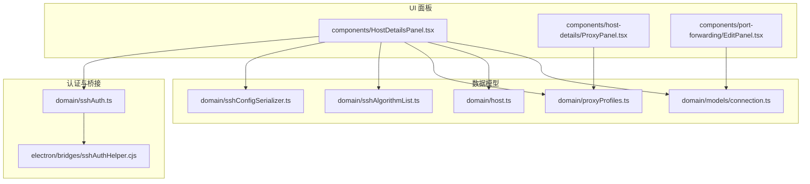
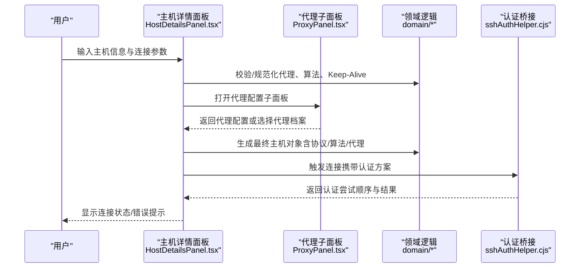
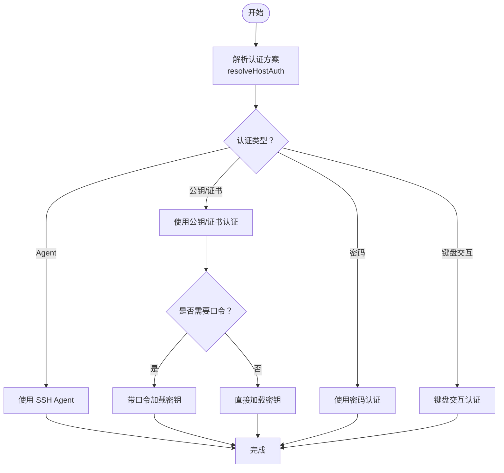
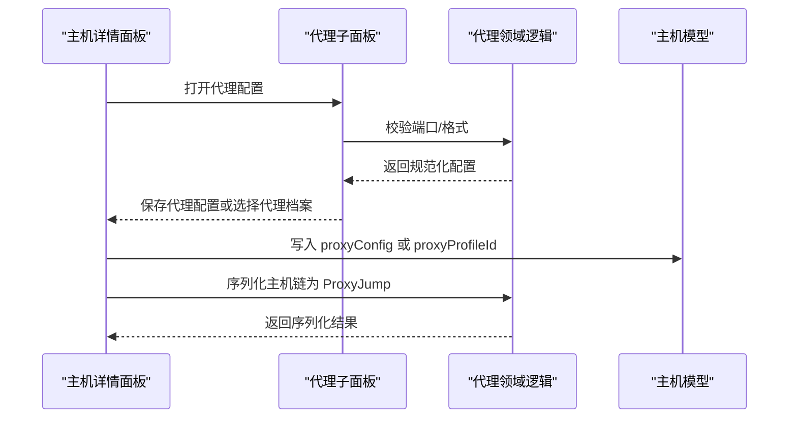
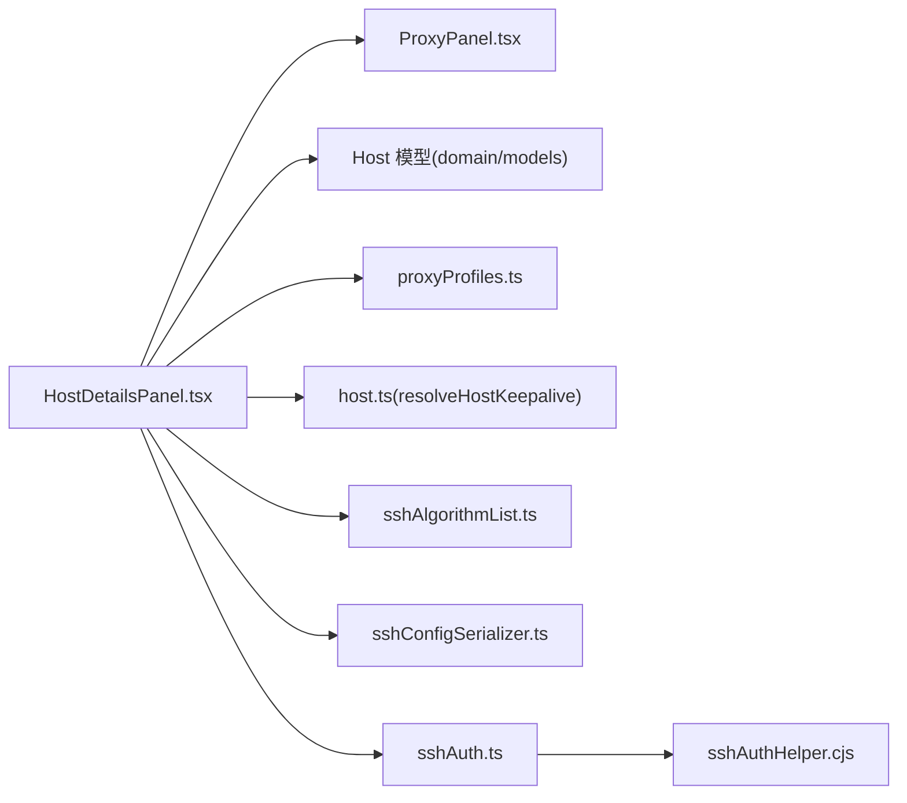

# 连接配置

<cite>
**本文引用的文件**
- [domain/models/connection.ts](file://domain/models/connection.ts)
- [domain/sshAuth.ts](file://domain/sshAuth.ts)
- [domain/proxyProfiles.ts](file://domain/proxyProfiles.ts)
- [domain/host.ts](file://domain/host.ts)
- [domain/sshConfigSerializer.ts](file://domain/sshConfigSerializer.ts)
- [domain/sshAlgorithmList.ts](file://domain/sshAlgorithmList.ts)
- [components/HostDetailsPanel.tsx](file://components/HostDetailsPanel.tsx)
- [components/host-details/ProxyPanel.tsx](file://components/host-details/ProxyPanel.tsx)
- [components/port-forwarding/EditPanel.tsx](file://components/port-forwarding/EditPanel.tsx)
- [electron/bridges/sshAuthHelper.cjs](file://electron/bridges/sshAuthHelper.cjs)
</cite>

## 目录
1. [简介](#简介)
2. [项目结构](#项目结构)
3. [核心组件](#核心组件)
4. [架构总览](#架构总览)
5. [详细组件分析](#详细组件分析)
6. [依赖关系分析](#依赖关系分析)
7. [性能考量](#性能考量)
8. [故障排查指南](#故障排查指南)
9. [结论](#结论)
10. [附录：典型场景配置示例](#附录典型场景配置示例)

## 简介
本章节面向“主机详情面板”的“连接配置”能力，系统化阐述以下主题：
- 基本连接设置与多协议支持（SSH、Telnet、Mosh）
- 高级连接选项（算法覆盖、X11 转发、启动命令、字符集等）
- 认证方式配置（密码、公钥、证书、SSH Agent、键盘交互）
- 代理与网络设置（HTTP/SOCKS5 代理、代理配置复用、跳板机链）
- 端口转发配置（本地/远程/动态，绑定地址，自动启动）
- 连接超时、重连策略、Keep-Alive 设置
- 不同使用场景（企业、开发测试、远程办公）的最佳实践

## 项目结构
围绕“连接配置”，涉及的核心模块与文件如下：
- 数据模型与解析：连接协议、代理、算法、主机与组配置
- UI 面板：主机详情面板、代理子面板、端口转发编辑面板
- 认证与桥接：认证解析、SSH 认证流程桥接
- 序列化与兼容：OpenSSH 配置导出、合并管理块

**图表来源**
- [domain/models/connection.ts:48-179](file://domain/models/connection.ts#L48-L179)
- [domain/host.ts:212-244](file://domain/host.ts#L212-L244)
- [domain/proxyProfiles.ts:1-78](file://domain/proxyProfiles.ts#L1-L78)
- [domain/sshAlgorithmList.ts:13-110](file://domain/sshAlgorithmList.ts#L13-L110)
- [domain/sshConfigSerializer.ts:84-139](file://domain/sshConfigSerializer.ts#L84-L139)
- [components/HostDetailsPanel.tsx:1-120](file://components/HostDetailsPanel.tsx#L1-L120)
- [components/host-details/ProxyPanel.tsx:1-60](file://components/host-details/ProxyPanel.tsx#L1-L60)
- [components/port-forwarding/EditPanel.tsx:1-60](file://components/port-forwarding/EditPanel.tsx#L1-L60)
- [domain/sshAuth.ts:44-103](file://domain/sshAuth.ts#L44-L103)
- [electron/bridges/sshAuthHelper.cjs:583-718](file://electron/bridges/sshAuthHelper.cjs#L583-L718)

**章节来源**
- [domain/models/connection.ts:48-179](file://domain/models/connection.ts#L48-L179)
- [domain/host.ts:212-244](file://domain/host.ts#L212-L244)
- [domain/proxyProfiles.ts:1-78](file://domain/proxyProfiles.ts#L1-L78)
- [domain/sshAlgorithmList.ts:13-110](file://domain/sshAlgorithmList.ts#L13-L110)
- [domain/sshConfigSerializer.ts:84-139](file://domain/sshConfigSerializer.ts#L84-L139)
- [components/HostDetailsPanel.tsx:1-120](file://components/HostDetailsPanel.tsx#L1-L120)
- [components/host-details/ProxyPanel.tsx:1-60](file://components/host-details/ProxyPanel.tsx#L1-L60)
- [components/port-forwarding/EditPanel.tsx:1-60](file://components/port-forwarding/EditPanel.tsx#L1-L60)
- [domain/sshAuth.ts:44-103](file://domain/sshAuth.ts#L44-L103)
- [electron/bridges/sshAuthHelper.cjs:583-718](file://electron/bridges/sshAuthHelper.cjs#L583-L718)

## 核心组件
- 主机模型与协议
  - 支持协议类型：ssh、telnet、mosh、local、serial
  - 多协议配置数组，每项包含协议、端口、启用状态、主题等
  - Telnet 可独立配置用户名/密码/端口；Mosh 可配置服务器路径
- 代理配置
  - 结构化代理配置：类型（http/socks5）、主机、端口、可选凭据
  - 代理配置档案：可复用的代理配置模板
- 算法覆盖与兼容
  - 按类别（kex/cipher/hmac/serverHostKey/compress）覆盖默认算法
  - 提供现代默认与遗留模式默认算法集合
- 认证解析
  - 解析优先级：显式覆盖 > 身份 > 主机配置 > 密码回退
  - 支持密钥/证书/SSH Agent/键盘交互
- Keep-Alive 决策
  - 支持按主机覆盖全局 Keep-Alive 参数，独立控制间隔与最大探测数

**章节来源**
- [domain/models/connection.ts:48-179](file://domain/models/connection.ts#L48-L179)
- [domain/proxyProfiles.ts:1-78](file://domain/proxyProfiles.ts#L1-L78)
- [domain/sshAlgorithmList.ts:13-110](file://domain/sshAlgorithmList.ts#L13-L110)
- [domain/sshAuth.ts:44-103](file://domain/sshAuth.ts#L44-L103)
- [domain/host.ts:212-244](file://domain/host.ts#L212-L244)

## 架构总览
主机详情面板负责收集用户输入，校验并规范化后保存到主机模型；代理与算法等高级配置通过子面板完成；认证流程由前端解析与后端桥接共同实现。

**图表来源**
- [components/HostDetailsPanel.tsx:343-442](file://components/HostDetailsPanel.tsx#L343-L442)
- [components/host-details/ProxyPanel.tsx:1-60](file://components/host-details/ProxyPanel.tsx#L1-L60)
- [domain/proxyProfiles.ts:17-31](file://domain/proxyProfiles.ts#L17-L31)
- [domain/sshAuth.ts:44-103](file://domain/sshAuth.ts#L44-L103)
- [electron/bridges/sshAuthHelper.cjs:583-718](file://electron/bridges/sshAuthHelper.cjs#L583-L718)

## 详细组件分析

### 基本连接设置与协议选择
- 协议与端口
  - 主机模型支持多协议配置数组，每项包含协议类型、端口、启用状态、主题等
  - Telnet 可单独配置用户名/密码/端口；Mosh 可指定服务器路径
- 默认端口与协议
  - SSH 默认端口 22；Telnet 默认端口 23；若协议为 Telnet 则端口取 Telnet 端口或协议端口
- 主题覆盖
  - 支持为特定主机或 Telnet 协议覆盖终端主题

**章节来源**
- [domain/models/connection.ts:67-75](file://domain/models/connection.ts#L67-L75)
- [domain/models/connection.ts:84-139](file://domain/models/connection.ts#L84-L139)
- [domain/host.ts:190-198](file://domain/host.ts#L190-L198)
- [components/HostDetailsPanel.tsx:210-214](file://components/HostDetailsPanel.tsx#L210-L214)

### 高级连接选项
- 算法覆盖（高级）
  - 支持按类别覆盖默认算法列表，确保仅暴露 ssh2 实际支持的算法
  - 提供现代默认与遗留模式默认算法集合，便于安全与兼容性平衡
- X11 转发
  - 当非 Mosh 且启用 X11 转发时，序列化至 SSH 配置
- 启动命令与字符集
  - 支持在会话建立后执行启动命令
  - 支持设置字符集以适配远端编码
- 环境变量
  - 支持为会话注入键值对环境变量

**章节来源**
- [domain/models/connection.ts:30-40](file://domain/models/connection.ts#L30-L40)
- [domain/sshAlgorithmList.ts:13-110](file://domain/sshAlgorithmList.ts#L13-L110)
- [domain/sshConfigSerializer.ts:116-127](file://domain/sshConfigSerializer.ts#L116-L127)
- [domain/models/connection.ts:42-46](file://domain/models/connection.ts#L42-L46)
- [domain/models/connection.ts:106-114](file://domain/models/connection.ts#L106-L114)

### 认证方式配置
- 认证解析规则
  - 优先级：显式覆盖 > 身份 > 主机配置 > 密码回退
  - 若选择密码认证，则不加载密钥；若未显式选择则根据密钥/证书存在推断
- 支持的认证类型
  - 密码、公钥（含证书）、SSH Agent、键盘交互
- 键盘交互认证
  - 在无提示或单密码提示场景下可自动填充；否则通过 IPC 弹窗收集用户响应
- 私钥处理
  - 对于引用型私钥，不直接暴露私钥内容，而是传递文件路径

**图表来源**
- [domain/sshAuth.ts:44-103](file://domain/sshAuth.ts#L44-L103)
- [electron/bridges/sshAuthHelper.cjs:583-718](file://electron/bridges/sshAuthHelper.cjs#L583-L718)

**章节来源**
- [domain/sshAuth.ts:44-103](file://domain/sshAuth.ts#L44-L103)
- [electron/bridges/sshAuthHelper.cjs:583-718](file://electron/bridges/sshAuthHelper.cjs#L583-L718)

### 代理配置与网络设置
- 代理类型与字段
  - 类型：http 或 socks5
  - 字段：主机、端口、可选用户名/密码
- 代理配置档案
  - 可将常用代理配置保存为档案，便于复用与迁移
- 代理校验与规范化
  - 校验端口范围、去除空白、判断完整度
- 代理与主机链
  - 支持将代理配置直接写入主机，或通过代理档案引用
  - 支持主机链（跳板机）通过 ProxyJump 序列化

**图表来源**
- [components/host-details/ProxyPanel.tsx:1-60](file://components/host-details/ProxyPanel.tsx#L1-L60)
- [domain/proxyProfiles.ts:7-31](file://domain/proxyProfiles.ts#L7-L31)
- [domain/sshConfigSerializer.ts:62-82](file://domain/sshConfigSerializer.ts#L62-L82)

**章节来源**
- [components/host-details/ProxyPanel.tsx:1-60](file://components/host-details/ProxyPanel.tsx#L1-L60)
- [domain/proxyProfiles.ts:1-78](file://domain/proxyProfiles.ts#L1-L78)
- [domain/sshConfigSerializer.ts:62-82](file://domain/sshConfigSerializer.ts#L62-L82)

### 端口转发配置
- 支持类型
  - 本地转发（local）、远程转发（remote）、动态转发（dst为中间主机）
- 关键字段
  - 标签、本地端口、绑定地址、中间主机、目标地址/端口、自动启动
- 编辑与保存
  - 通过侧边面板进行编辑，支持复制、删除、保存与取消

**章节来源**
- [components/port-forwarding/EditPanel.tsx:1-189](file://components/port-forwarding/EditPanel.tsx#L1-L189)
- [domain/models/connection.ts:48-75](file://domain/models/connection.ts#L48-L75)

### 连接超时、重连策略、Keep-Alive 设置
- Keep-Alive 决策
  - 支持按主机覆盖全局 Keep-Alive 参数
  - 每个字段可独立回退到全局值，避免全局设置与设备特性冲突
- 典型建议
  - 全局：较短间隔、较低最大探测数，适配云/NAT 环境
  - 设备端：关闭或降低间隔，提高最大探测数，避免误判断线

**章节来源**
- [domain/host.ts:212-244](file://domain/host.ts#L212-L244)
- [components/HostDetailsAdvancedSections.tsx:377-441](file://components/HostDetailsAdvancedSections.tsx#L377-L441)

## 依赖关系分析
- 组件耦合
  - 主机详情面板与代理子面板松耦合，通过回调与状态传递交互
  - 认证解析与桥接解耦，前端负责策略组合，后端负责具体尝试顺序
- 外部依赖
  - ssh2 支持的算法集合决定 UI 可见与可用的算法选项
  - OpenSSH 配置导出用于与外部工具链协同

**图表来源**
- [components/HostDetailsPanel.tsx:1-120](file://components/HostDetailsPanel.tsx#L1-L120)
- [components/host-details/ProxyPanel.tsx:1-60](file://components/host-details/ProxyPanel.tsx#L1-L60)
- [domain/models/connection.ts:48-179](file://domain/models/connection.ts#L48-L179)
- [domain/proxyProfiles.ts:1-78](file://domain/proxyProfiles.ts#L1-L78)
- [domain/host.ts:212-244](file://domain/host.ts#L212-L244)
- [domain/sshAlgorithmList.ts:13-110](file://domain/sshAlgorithmList.ts#L13-L110)
- [domain/sshConfigSerializer.ts:84-139](file://domain/sshConfigSerializer.ts#L84-L139)
- [domain/sshAuth.ts:44-103](file://domain/sshAuth.ts#L44-L103)
- [electron/bridges/sshAuthHelper.cjs:583-718](file://electron/bridges/sshAuthHelper.cjs#L583-L718)

**章节来源**
- [components/HostDetailsPanel.tsx:1-120](file://components/HostDetailsPanel.tsx#L1-L120)
- [domain/models/connection.ts:48-179](file://domain/models/connection.ts#L48-L179)
- [domain/proxyProfiles.ts:1-78](file://domain/proxyProfiles.ts#L1-L78)
- [domain/host.ts:212-244](file://domain/host.ts#L212-L244)
- [domain/sshAlgorithmList.ts:13-110](file://domain/sshAlgorithmList.ts#L13-L110)
- [domain/sshConfigSerializer.ts:84-139](file://domain/sshConfigSerializer.ts#L84-L139)
- [domain/sshAuth.ts:44-103](file://domain/sshAuth.ts#L44-L103)
- [electron/bridges/sshAuthHelper.cjs:583-718](file://electron/bridges/sshAuthHelper.cjs#L583-L718)

## 性能考量
- 算法覆盖
  - 仅覆盖有效算法集合，避免无效算法导致握手失败与重试
- Keep-Alive
  - 合理设置间隔与最大探测数，减少不必要的网络负载与误判
- 代理与主机链
  - 使用代理档案减少重复配置；主机链尽量精简，避免过多跳转带来的延迟

## 故障排查指南
- 代理端口无效
  - 现象：保存时报错“端口无效”
  - 排查：确认端口范围 1–65535，检查主机名/端口是否填写完整
- 代理档案缺失
  - 现象：显示“所选代理档案不存在”
  - 排查：重新选择或新建代理档案；清理主机上的代理档案引用
- 认证失败
  - 现象：多次尝试后仍失败
  - 排查：确认认证类型与密钥/口令匹配；查看键盘交互弹窗是否被拦截；检查 SSH Agent 是否运行
- 算法不被接受
  - 现象：连接报“不支持的算法”
  - 排查：仅选择 ssh2 支持的算法；必要时切换到遗留模式

**章节来源**
- [components/host-details/ProxyPanel.tsx:171-175](file://components/host-details/ProxyPanel.tsx#L171-L175)
- [domain/proxyProfiles.ts:7-19](file://domain/proxyProfiles.ts#L7-L19)
- [domain/sshAlgorithmList.ts:20-31](file://domain/sshAlgorithmList.ts#L20-L31)
- [electron/bridges/sshAuthHelper.cjs:828-861](file://electron/bridges/sshAuthHelper.cjs#L828-L861)

## 结论
主机详情面板提供了从基础到高级的完整连接配置能力，结合代理、算法、认证与端口转发等模块，能够满足企业、开发测试与远程办公等多样化场景需求。通过合理的 Keep-Alive 与代理策略，可在复杂网络环境中保持稳定连接；通过算法覆盖与主机链，兼顾安全与兼容。

## 附录：典型场景配置示例
- 企业内网（高安全）
  - 代理：HTTP/SOCKS5 代理档案；主机链（ProxyJump）指向堡垒机
  - 算法：使用现代默认算法；禁用过时加密套件
  - 认证：首选公钥/证书，启用 SSH Agent；禁用密码认证
  - Keep-Alive：关闭或延长间隔，降低误判风险
- 开发测试（快速验证）
  - 代理：直连或简单代理；无需主机链
  - 算法：默认即可；必要时启用遗留模式
  - 认证：密码或临时密钥；键盘交互用于一次性挑战
  - 端口转发：本地转发映射常用服务端口
- 远程办公（弱网/公网）
  - 代理：SOCKS5 代理；主机链最小化
  - 算法：现代默认；必要时放宽 HMAC/Cipher
  - 认证：公钥/证书优先；SSH Agent 自动解锁
  - Keep-Alive：全局短间隔、低最大探测数；按需在设备端关闭