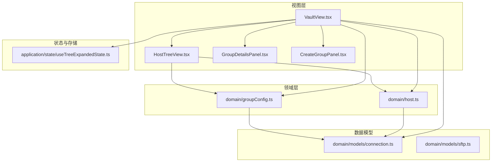
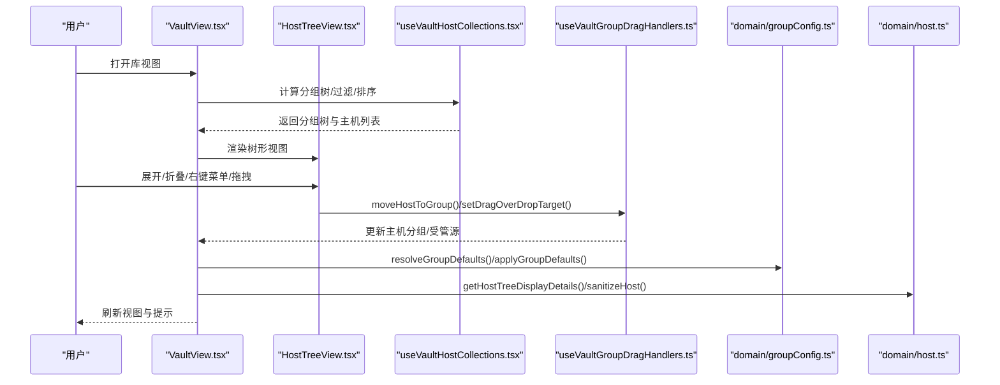
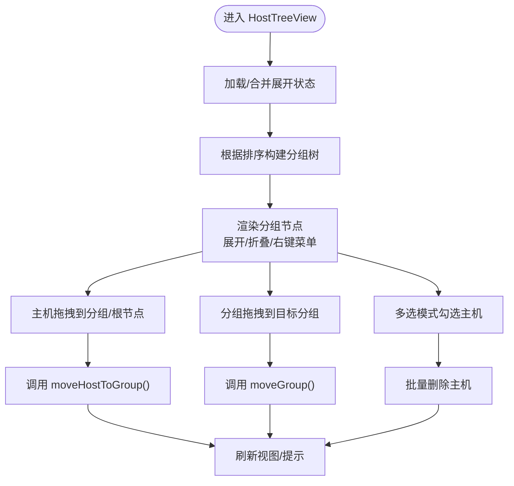
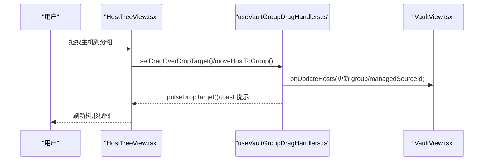
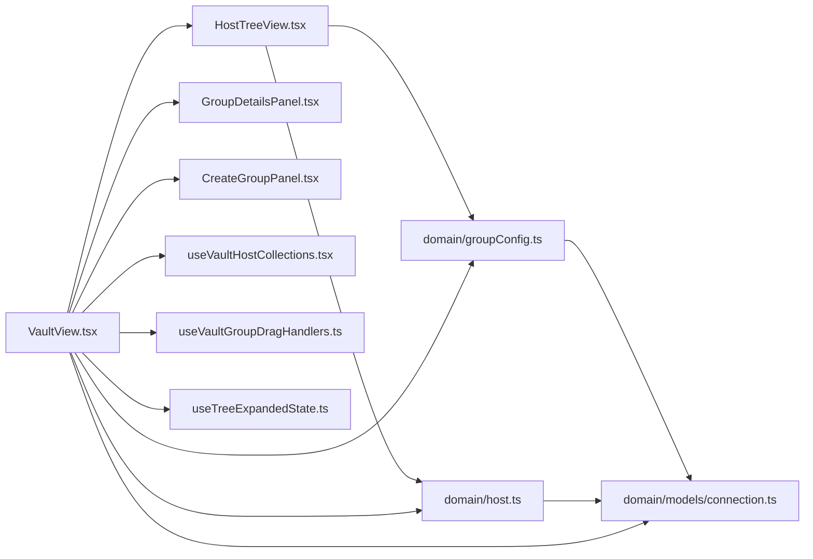

# 主机组织与分组

<cite>
**本文引用的文件**
- [components/HostTreeView.tsx](file://components/HostTreeView.tsx)
- [components/vault/useVaultHostCollections.tsx](file://components/vault/useVaultHostCollections.tsx)
- [components/vault/useVaultGroupDragHandlers.ts](file://components/vault/useVaultGroupDragHandlers.ts)
- [components/GroupDetailsPanel.tsx](file://components/GroupDetailsPanel.tsx)
- [components/host-details/CreateGroupPanel.tsx](file://components/host-details/CreateGroupPanel.tsx)
- [domain/groupConfig.ts](file://domain/groupConfig.ts)
- [domain/host.ts](file://domain/host.ts)
- [components/VaultView.tsx](file://components/VaultView.tsx)
- [domain/models/connection.ts](file://domain/models/connection.ts)
- [domain/models/sftp.ts](file://domain/models/sftp.ts)
- [application/state/useTreeExpandedState.ts](file://application/state/useTreeExpandedState.ts)
</cite>

## 目录
1. [简介](#简介)
2. [项目结构](#项目结构)
3. [核心组件](#核心组件)
4. [架构总览](#架构总览)
5. [详细组件分析](#详细组件分析)
6. [依赖分析](#依赖分析)
7. [性能考量](#性能考量)
8. [故障排查指南](#故障排查指南)
9. [结论](#结论)
10. [附录：最佳实践与配置参数](#附录最佳实践与配置参数)

## 简介
本技术文档围绕“主机组织与分组”能力进行系统化梳理，覆盖以下主题：
- 分组系统的架构设计与数据模型
- 自定义分组的创建、删除与修改流程
- 组配置管理（属性设置、继承规则、权限与代理控制）
- 主机树形视图的实现原理（节点展开/折叠、拖拽重排、批量操作）
- 分组与主机的关联关系（一对一、一对多、多对多）
- 最佳实践（命名规范、层级设计、性能优化）
- 具体代码示例与配置参数说明

## 项目结构
分组与主机组织功能由前端组件层、领域模型层与状态持久化层协同完成：
- 视图层：HostTreeView 负责树形渲染与交互；VaultView 提供宿主界面与状态编排；GroupDetailsPanel 与 CreateGroupPanel 提供组详情与新建面板。
- 领域层：groupConfig 提供组配置解析与继承合并；host 提供主机显示细节与默认值解析。
- 数据模型：connection.ts 定义 Host、GroupConfig、ProxyConfig、HostChainConfig 等核心类型。

图表来源
- [components/VaultView.tsx:182-985](file://components/VaultView.tsx#L182-L985)
- [components/HostTreeView.tsx:1-634](file://components/HostTreeView.tsx#L1-L634)
- [components/GroupDetailsPanel.tsx:1-813](file://components/GroupDetailsPanel.tsx#L1-L813)
- [components/host-details/CreateGroupPanel.tsx:1-120](file://components/host-details/CreateGroupPanel.tsx#L1-L120)
- [domain/groupConfig.ts:1-140](file://domain/groupConfig.ts#L1-L140)
- [domain/host.ts:1-265](file://domain/host.ts#L1-L265)
- [domain/models/connection.ts:84-200](file://domain/models/connection.ts#L84-L200)
- [domain/models/sftp.ts:1-79](file://domain/models/sftp.ts#L1-L79)
- [application/state/useTreeExpandedState.ts:1-200](file://application/state/useTreeExpandedState.ts#L1-L200)

章节来源
- [components/VaultView.tsx:182-985](file://components/VaultView.tsx#L182-L985)
- [components/HostTreeView.tsx:1-634](file://components/HostTreeView.tsx#L1-L634)
- [domain/groupConfig.ts:1-140](file://domain/groupConfig.ts#L1-L140)
- [domain/host.ts:1-265](file://domain/host.ts#L1-L265)
- [domain/models/connection.ts:84-200](file://domain/models/connection.ts#L84-L200)

## 核心组件
- HostTreeView：树形渲染、排序、展开/折叠、上下文菜单、拖拽事件处理、多选与批量操作。
- useVaultHostCollections：构建分组树、过滤与排序、根级显示策略、标签筛选、最近/置顶主机展示。
- useVaultGroupDragHandlers：拖拽到分组或根节点的移动逻辑、受管源联动、提示反馈。
- GroupDetailsPanel：组配置编辑（协议、代理、链路、环境变量、外观等），支持父子继承与覆盖。
- CreateGroupPanel：新建分组的表单与父分组选择。
- domain/groupConfig：组配置继承解析、默认值应用、终端主题解析。
- domain/host：主机显示细节解析（协议、用户名、端口）、主机默认值清洗与安全化。

章节来源
- [components/HostTreeView.tsx:1-634](file://components/HostTreeView.tsx#L1-L634)
- [components/vault/useVaultHostCollections.tsx:1-496](file://components/vault/useVaultHostCollections.tsx#L1-L496)
- [components/vault/useVaultGroupDragHandlers.ts:1-154](file://components/vault/useVaultGroupDragHandlers.ts#L1-L154)
- [components/GroupDetailsPanel.tsx:1-813](file://components/GroupDetailsPanel.tsx#L1-L813)
- [components/host-details/CreateGroupPanel.tsx:1-120](file://components/host-details/CreateGroupPanel.tsx#L1-L120)
- [domain/groupConfig.ts:1-140](file://domain/groupConfig.ts#L1-L140)
- [domain/host.ts:1-265](file://domain/host.ts#L1-L265)

## 架构总览
分组系统采用“视图-领域-模型-状态”的分层设计：
- 视图层负责用户交互与渲染（树形、面板、上下文菜单）。
- 领域层负责业务规则（继承、默认值、显示细节）。
- 模型层定义数据结构（Host、GroupConfig、ProxyConfig、HostChainConfig 等）。
- 状态层负责本地持久化（树展开状态、视图模式、排序方式）。

图表来源
- [components/VaultView.tsx:182-985](file://components/VaultView.tsx#L182-L985)
- [components/HostTreeView.tsx:1-634](file://components/HostTreeView.tsx#L1-L634)
- [components/vault/useVaultHostCollections.tsx:1-496](file://components/vault/useVaultHostCollections.tsx#L1-L496)
- [components/vault/useVaultGroupDragHandlers.ts:1-154](file://components/vault/useVaultGroupDragHandlers.ts#L1-L154)
- [domain/groupConfig.ts:1-140](file://domain/groupConfig.ts#L1-L140)
- [domain/host.ts:1-265](file://domain/host.ts#L1-L265)

## 详细组件分析

### 组件一：HostTreeView（树形视图）
- 功能要点
  - 支持按多种模式排序（名称、新建时间、最旧、按组）。
  - 展开/折叠使用本地持久化状态，支持“全部展开/折叠”。
  - 右键菜单提供新建主机/分组、重命名、删除、取消受管等操作。
  - 拖拽支持：从主机拖拽到分组/根节点移动主机；从分组拖拽到目标分组移动分组。
  - 多选模式下支持批量勾选与删除。
  - 显示细节：协议、用户名、端口、标签、受管标识等。
- 关键实现路径
  - 排序与展开：[HostTreeView.tsx:448-634](file://components/HostTreeView.tsx#L448-L634)
  - 节点渲染与子节点递归：[HostTreeView.tsx:74-294](file://components/HostTreeView.tsx#L74-L294)
  - 主机项渲染与拖拽事件：[HostTreeView.tsx:296-446](file://components/HostTreeView.tsx#L296-L446)
  - 显示细节解析：[HostTreeView.tsx:312-329](file://components/HostTreeView.tsx#L312-L329)

图表来源
- [components/HostTreeView.tsx:448-634](file://components/HostTreeView.tsx#L448-L634)

章节来源
- [components/HostTreeView.tsx:1-634](file://components/HostTreeView.tsx#L1-L634)

### 组件二：useVaultHostCollections（分组树与过滤）
- 功能要点
  - 将自定义分组与主机构建为分组树，统计每个节点的主机总数。
  - 支持搜索（标签、主机名、别名）、标签过滤、排序（AZ/Z-A/新建/最旧/按组）。
  - 根据当前选中分组或“仅根级未分组”显示策略决定根级展示内容。
  - 生成所有可能的分组路径用于“展开/折叠全部”。
- 关键实现路径
  - 构建分组树与计数：[useVaultHostCollections.tsx:48-75](file://components/vault/useVaultHostCollections.tsx#L48-L75)
  - 过滤与排序：[useVaultHostCollections.tsx:118-179](file://components/vault/useVaultCollections.tsx#L118-L179)
  - 树视图专用主机列表：[useVaultHostCollections.tsx:237-275](file://components/vault/useVaultHostCollections.tsx#L237-L275)
  - 树视图分组树构建：[useVaultHostCollections.tsx:297-334](file://components/vault/useVaultHostCollections.tsx#L297-L334)

章节来源
- [components/vault/useVaultHostCollections.tsx:1-496](file://components/vault/useVaultHostCollections.tsx#L1-L496)

### 组件三：useVaultGroupDragHandlers（拖拽与受管源）
- 功能要点
  - 处理拖拽悬停高亮与确认脉冲效果。
  - 移动主机到目标分组时，自动清理标签中的空格（受管源要求）并设置受管源 ID。
  - 支持取消受管：清空受管主机的受管源 ID 并移除受管源记录。
- 关键实现路径
  - 拖拽目标判定与脉冲：[useVaultGroupDragHandlers.ts:28-62](file://components/vault/useVaultGroupDragHandlers.ts#L28-L62)
  - 移动主机到分组：[useVaultGroupDragHandlers.ts:68-110](file://components/vault/useVaultGroupDragHandlers.ts#L68-L110)
  - 取消受管：[useVaultGroupDragHandlers.ts:120-143](file://components/vault/useVaultGroupDragHandlers.ts#L120-L143)

图表来源
- [components/HostTreeView.tsx:156-178](file://components/HostTreeView.tsx#L156-L178)
- [components/vault/useVaultGroupDragHandlers.ts:68-110](file://components/vault/useVaultGroupDragHandlers.ts#L68-L110)
- [components/VaultView.tsx:769-805](file://components/VaultView.tsx#L769-L805)

章节来源
- [components/vault/useVaultGroupDragHandlers.ts:1-154](file://components/vault/useVaultGroupDragHandlers.ts#L1-L154)

### 组件四：GroupDetailsPanel（组配置面板）
- 功能要点
  - 支持添加/移除协议（SSH/Telnet），协议字段按启用状态动态显示。
  - 代理配置：可选择已保存代理档案或手动输入代理配置。
  - 链路配置：为组设置跳板主机链路。
  - 环境变量：增删改环境变量。
  - 外观配置：主题、字体族、字号、字重；支持继承父组或覆盖全局。
  - 继承与覆盖：基于父组路径解析继承，支持覆盖开关。
- 关键实现路径
  - 协议启用/移除：[GroupDetailsPanel.tsx:146-188](file://components/GroupDetailsPanel.tsx#L146-L188)
  - 代理配置更新与校验：[GroupDetailsPanel.tsx:191-223](file://components/GroupDetailsPanel.tsx#L191-L223)
  - 链路配置：[GroupDetailsPanel.tsx:226-259](file://components/GroupDetailsPanel.tsx#L226-L259)
  - 环境变量增删改：[GroupDetailsPanel.tsx:262-281](file://components/GroupDetailsPanel.tsx#L262-L281)
  - 继承主题与算法标志：[GroupDetailsPanel.tsx:302-335](file://components/GroupDetailsPanel.tsx#L302-L335)
  - 保存逻辑与路径计算：[GroupDetailsPanel.tsx:342-420](file://components/GroupDetailsPanel.tsx#L342-L420)

章节来源
- [components/GroupDetailsPanel.tsx:1-813](file://components/GroupDetailsPanel.tsx#L1-L813)

### 组件五：CreateGroupPanel（新建分组）
- 功能要点
  - 输入分组名称与父分组（下拉选项来自现有分组，排除自身与子树）。
  - 保存按钮在名称非空时可用。
  - 提供云同步与协议添加入口（占位）。
- 关键实现路径
  - 表单与父分组选项：[CreateGroupPanel.tsx:36-57](file://components/host-details/CreateGroupPanel.tsx#L36-L57)
  - 保存与返回：[CreateGroupPanel.tsx:68-72](file://components/host-details/CreateGroupPanel.tsx#L68-L72)
  - 父分组选项排除逻辑：[CreateGroupPanel.tsx:291-299](file://components/host-details/CreateGroupPanel.tsx#L291-L299)

章节来源
- [components/host-details/CreateGroupPanel.tsx:1-120](file://components/host-details/CreateGroupPanel.tsx#L1-L120)

### 组件六：domain/groupConfig（组配置继承与默认值）
- 功能要点
  - 解析祖先链路继承：从根到当前分组逐层合并配置，子层覆盖父层。
  - 默认值应用：仅在主机未设置对应字段时填充；空字符串是否视为“未设置”可按键配置调整。
  - 终端主题解析：若未显式覆盖则继承父组主题。
  - 代理配置与代理档案互斥：当主机已有代理档案或主机代理配置存在时，不应用组代理配置。
- 关键实现路径
  - 继承解析：[groupConfig.ts:30-85](file://domain/groupConfig.ts#L30-L85)
  - 默认值应用：[groupConfig.ts:106-131](file://domain/groupConfig.ts#L106-L131)
  - 终端主题解析：[groupConfig.ts:133-140](file://domain/groupConfig.ts#L133-L140)

章节来源
- [domain/groupConfig.ts:1-140](file://domain/groupConfig.ts#L1-L140)

### 组件七：domain/host（主机显示细节与默认值）
- 功能要点
  - 显示细节：协议、用户名、端口（Telnet优先解析）。
  - 主机清洗：标准化主机名、去除非显示字符；迁移过时字体覆盖字段。
  - Telnet用户名/密码/端口解析。
- 关键实现路径
  - 显示细节解析：[host.ts:312-329](file://domain/host.ts#L312-L329)
  - 清洗与迁移：[host.ts:246-264](file://domain/host.ts#L246-L264)
  - Telnet解析：[host.ts:176-198](file://domain/host.ts#L176-L198)

章节来源
- [domain/host.ts:1-265](file://domain/host.ts#L1-L265)

## 依赖分析
- 组件耦合
  - HostTreeView 依赖 useTreeExpandedState 进行本地持久化展开状态管理。
  - VaultView 作为中枢协调 useVaultHostCollections、useVaultGroupDragHandlers、GroupDetailsPanel、CreateGroupPanel。
  - domain/groupConfig 与 domain/host 为纯函数，被视图层广泛调用。
- 外部依赖
  - 类型定义来自 domain/models/connection.ts 与 domain/models/sftp.ts。
  - UI 组件库与工具函数（如 cn、toast、i18n）贯穿各组件。

图表来源
- [components/VaultView.tsx:182-985](file://components/VaultView.tsx#L182-L985)
- [components/HostTreeView.tsx:1-634](file://components/HostTreeView.tsx#L1-L634)
- [components/GroupDetailsPanel.tsx:1-813](file://components/GroupDetailsPanel.tsx#L1-L813)
- [components/host-details/CreateGroupPanel.tsx:1-120](file://components/host-details/CreateGroupPanel.tsx#L1-L120)
- [components/vault/useVaultHostCollections.tsx:1-496](file://components/vault/useVaultHostCollections.tsx#L1-L496)
- [components/vault/useVaultGroupDragHandlers.ts:1-154](file://components/vault/useVaultGroupDragHandlers.ts#L1-L154)
- [domain/groupConfig.ts:1-140](file://domain/groupConfig.ts#L1-L140)
- [domain/host.ts:1-265](file://domain/host.ts#L1-L265)
- [application/state/useTreeExpandedState.ts:1-200](file://application/state/useTreeExpandedState.ts#L1-L200)
- [domain/models/connection.ts:84-200](file://domain/models/connection.ts#L84-L200)

章节来源
- [components/VaultView.tsx:182-985](file://components/VaultView.tsx#L182-L985)
- [components/HostTreeView.tsx:1-634](file://components/HostTreeView.tsx#L1-L634)
- [domain/groupConfig.ts:1-140](file://domain/groupConfig.ts#L1-L140)
- [domain/host.ts:1-265](file://domain/host.ts#L1-L265)
- [domain/models/connection.ts:84-200](file://domain/models/connection.ts#L84-L200)

## 性能考量
- 渲染优化
  - 使用 useMemo 缓存排序与树构建结果，避免重复计算。
  - HostTreeView 对子节点与主机列表进行记忆化排序，减少不必要的重渲染。
- 拖拽与状态
  - 拖拽悬停高亮与确认脉冲通过状态切换实现，避免频繁 DOM 操作。
  - 受管源移动时仅更新受影响主机，减少全量刷新。
- 存储与持久化
  - 树展开状态使用本地存储，避免每次重新计算。
- 建议
  - 大规模分组树建议限制初始展开层级，使用“展开全部”时注意性能影响。
  - 批量操作（多选删除）应结合节流/防抖，避免高频更新导致卡顿。

[本节为通用指导，无需特定文件引用]

## 故障排查指南
- 拖拽后无响应
  - 检查 moveHostToGroup 的目标路径是否为空或与原路径相同。
  - 确认受管源是否正确匹配（仅 SSH 主机可受管）。
- 无法保存组配置
  - 名称包含非法字符（斜杠）会触发错误提示。
  - 代理配置缺失或不完整会阻止保存。
- 显示细节异常
  - Telnet 用户名/端口需确保协议明确为 telnet 或通过 telnet 字段覆盖。
  - 主机清洗会去除首段空白，确保主机名合法。

章节来源
- [components/vault/useVaultGroupDragHandlers.ts:68-110](file://components/vault/useVaultGroupDragHandlers.ts#L68-L110)
- [components/GroupDetailsPanel.tsx:342-420](file://components/GroupDetailsPanel.tsx#L342-L420)
- [domain/host.ts:312-329](file://domain/host.ts#L312-L329)

## 结论
该分组系统以清晰的分层架构实现了灵活的主机组织与配置继承机制。通过树形视图、拖拽重排与受管源联动，用户可以高效地管理大规模主机集合。组配置的继承与覆盖策略保证了灵活性与一致性，同时提供了丰富的协议与外观定制能力。

[本节为总结性内容，无需特定文件引用]

## 附录：最佳实践与配置参数

### 命名规范
- 分组名称禁止包含斜杠或反斜杠。
- 受管分组下的主机标签将被清理空格，避免 SSH 配置不兼容。

章节来源
- [components/GroupDetailsPanel.tsx:342-348](file://components/GroupDetailsPanel.tsx#L342-L348)
- [components/vault/useVaultGroupDragHandlers.ts:88-92](file://components/vault/useVaultGroupDragHandlers.ts#L88-L92)

### 层级设计
- 建议按环境/区域/用途分层，避免过深嵌套。
- 使用“General”作为顶层默认分组，必要时保留或显式创建。

章节来源
- [components/vault/useVaultHostCollections.tsx:374-397](file://components/vault/useVaultHostCollections.tsx#L374-L397)

### 继承与覆盖
- 继承链：从根到当前分组逐层合并，子层覆盖父层。
- 代理配置与代理档案互斥：主机已有代理档案或代理配置时，不应用组代理。
- 主题与字体：可通过覆盖开关禁用继承，回退到全局默认。

章节来源
- [domain/groupConfig.ts:30-85](file://domain/groupConfig.ts#L30-L85)
- [domain/groupConfig.ts:106-131](file://domain/groupConfig.ts#L106-L131)
- [domain/groupConfig.ts:133-140](file://domain/groupConfig.ts#L133-L140)

### 批量操作
- 多选模式下支持批量删除主机，删除后自动清空选择集。
- “展开全部/折叠全部”适用于当前可见的分组树。

章节来源
- [components/HostTreeView.tsx:504-510](file://components/HostTreeView.tsx#L504-L510)
- [components/VaultView.tsx:582-588](file://components/VaultView.tsx#L582-L588)

### 配置参数速览（关键字段）
- Host
  - group：所属分组路径（如 A/B/C）
  - protocol：主协议（ssh/telnet/local/serial）
  - telnet*：Telnet 特定字段（端口、用户名、密码）
  - proxyProfileId/proxyConfig：代理档案或手动代理
  - hostChain：跳板主机链路
  - environmentVariables：环境变量数组
  - theme/font*：终端外观覆盖
- GroupConfig
  - path：分组路径
  - protocol/ssh/telnet 字段：协议相关默认值
  - proxyProfileId/proxyConfig：组代理默认
  - hostChain：组级链路默认
  - environmentVariables：组级环境变量默认
  - theme/*：组级外观默认

章节来源
- [domain/models/connection.ts:84-200](file://domain/models/connection.ts#L84-L200)
- [domain/models/connection.ts:25-40](file://domain/models/connection.ts#L25-L40)
- [domain/models/connection.ts:48-75](file://domain/models/connection.ts#L48-L75)