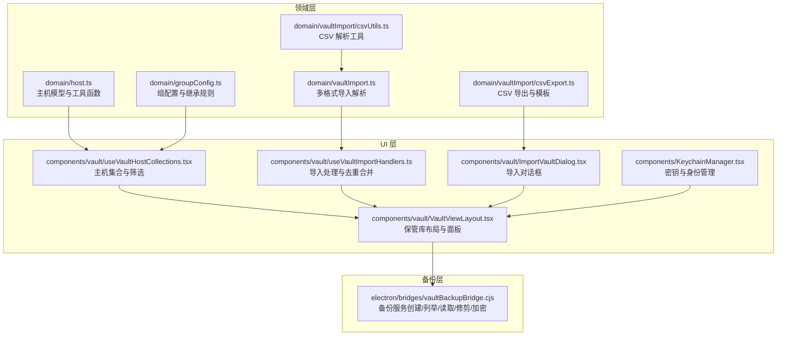
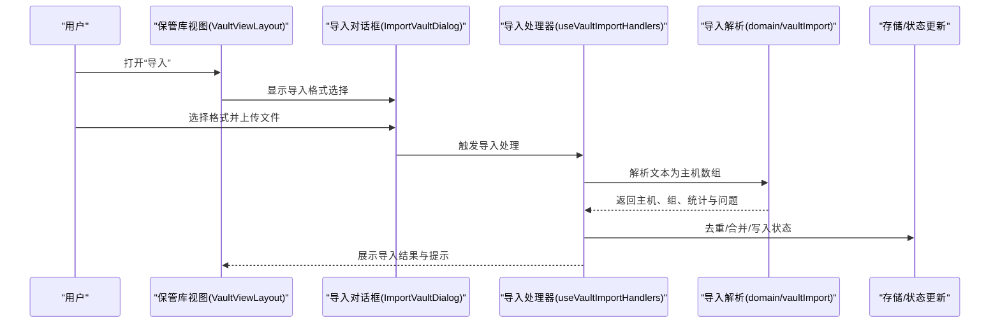
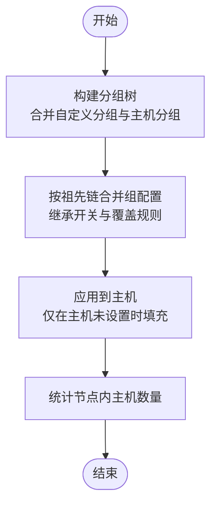
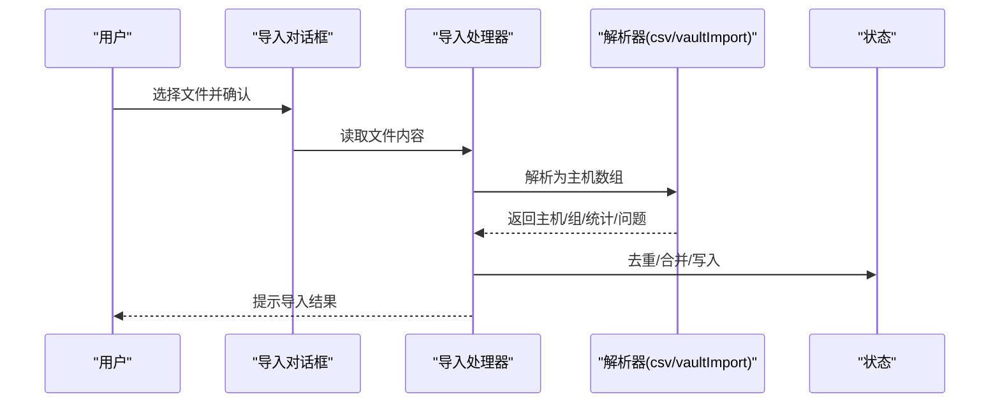
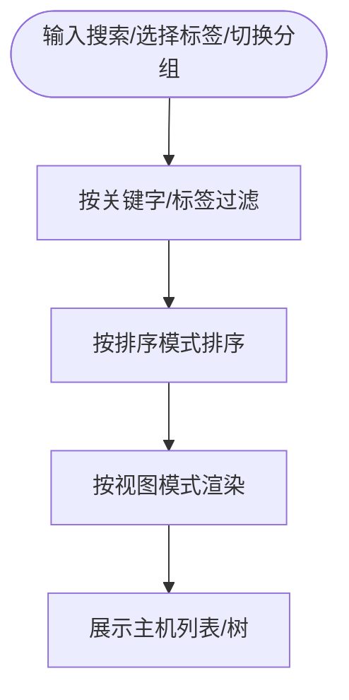
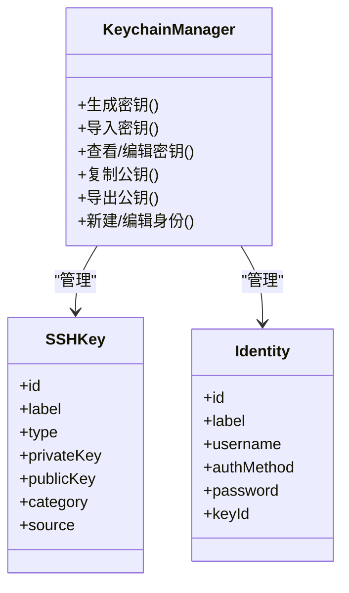
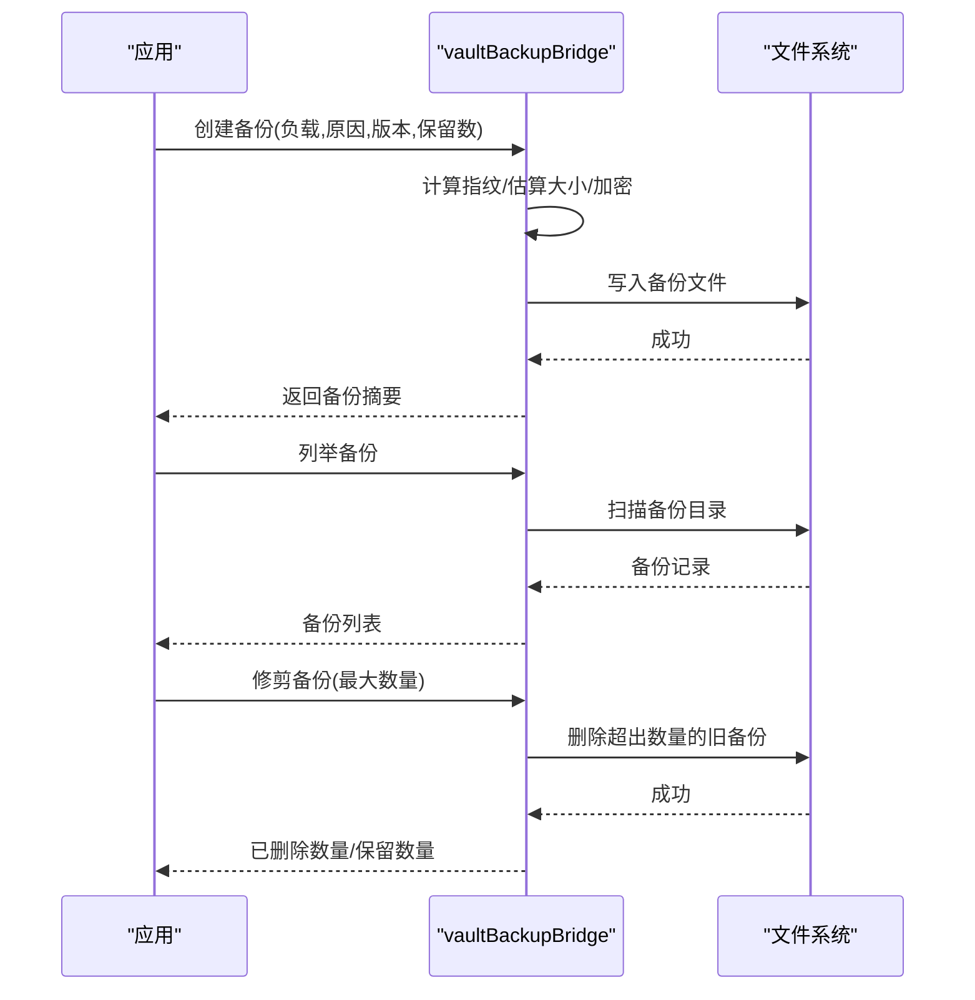
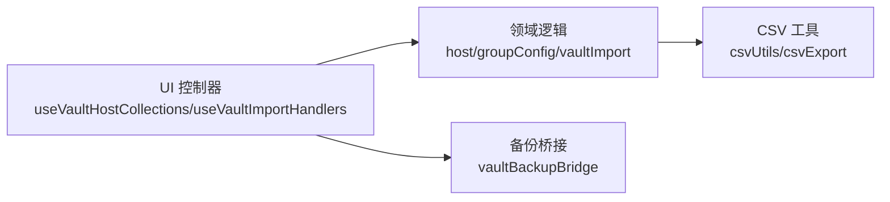

# 保管库管理

<cite>
**本文引用的文件**
- [domain/vaultImport.ts](file://domain/vaultImport.ts)
- [domain/vaultImport/csvExport.ts](file://domain/vaultImport/csvExport.ts)
- [domain/vaultImport/csvUtils.ts](file://domain/vaultImport/csvUtils.ts)
- [components/vault/useVaultImportHandlers.ts](file://components/vault/useVaultImportHandlers.ts)
- [components/vault/ImportVaultDialog.tsx](file://components/vault/ImportVaultDialog.tsx)
- [components/vault/useVaultHostCollections.tsx](file://components/vault/useVaultHostCollections.tsx)
- [components/vault/VaultViewLayout.tsx](file://components/vault/VaultViewLayout.tsx)
- [domain/groupConfig.ts](file://domain/groupConfig.ts)
- [domain/host.ts](file://domain/host.ts)
- [components/KeychainManager.tsx](file://components/KeychainManager.tsx)
- [electron/bridges/vaultBackupBridge.cjs](file://electron/bridges/vaultBackupBridge.cjs)
- [electron/bridges/vaultBackupBridge.test.cjs](file://electron/bridges/vaultBackupBridge.test.cjs)
</cite>

## 目录
1. [简介](#简介)
2. [项目结构](#项目结构)
3. [核心组件](#核心组件)
4. [架构总览](#架构总览)
5. [详细组件分析](#详细组件分析)
6. [依赖关系分析](#依赖关系分析)
7. [性能考量](#性能考量)
8. [故障排查指南](#故障排查指南)
9. [结论](#结论)
10. [附录](#附录)

## 简介
本指南面向保管库（主机与凭据）管理功能，帮助用户高效完成以下任务：
- 主机组织与分组：创建自定义分组、配置组默认项、理解继承规则
- 主机导入与导出：支持 CSV、PuTTY、MobaXterm、SecureCRT、ssh_config 等格式；支持导出 CSV；支持托管导入（ssh_config）
- 标签系统：创建、分配、过滤与重命名/删除标签
- 凭据安全：密钥生成、导入、查看、导出公钥；凭据加密存储与安全传输
- 搜索与筛选：按标签、分组、关键字、最近连接等条件筛选主机
- 保管库维护：备份与恢复、保留策略、清理无用主机、优化存储结构

## 项目结构
保管库相关能力由“领域模型与导入导出”“UI 控制器与视图”“凭据管理”“备份桥接服务”四部分协同实现：
- 领域层负责主机数据模型、分组配置、导入解析与 CSV 导出
- UI 层负责分组树、主机列表、标签过滤、导入对话框、凭据面板
- 备份桥接层负责本地备份的创建、列举、读取、修剪与加密存储

**图表来源**
- [domain/host.ts:1-265](file://domain/host.ts#L1-L265)
- [domain/groupConfig.ts:1-140](file://domain/groupConfig.ts#L1-L140)
- [domain/vaultImport.ts:1-929](file://domain/vaultImport.ts#L1-L929)
- [domain/vaultImport/csvUtils.ts:1-71](file://domain/vaultImport/csvUtils.ts#L1-L71)
- [domain/vaultImport/csvExport.ts:1-104](file://domain/vaultImport/csvExport.ts#L1-L104)
- [components/vault/useVaultHostCollections.tsx:1-496](file://components/vault/useVaultHostCollections.tsx#L1-L496)
- [components/vault/useVaultImportHandlers.ts:1-262](file://components/vault/useVaultImportHandlers.ts#L1-L262)
- [components/vault/ImportVaultDialog.tsx:1-277](file://components/vault/ImportVaultDialog.tsx#L1-L277)
- [components/vault/VaultViewLayout.tsx:1-880](file://components/vault/VaultViewLayout.tsx#L1-L880)
- [components/KeychainManager.tsx:1-966](file://components/KeychainManager.tsx#L1-L966)
- [electron/bridges/vaultBackupBridge.cjs:307-435](file://electron/bridges/vaultBackupBridge.cjs#L307-L435)

**章节来源**
- [domain/host.ts:1-265](file://domain/host.ts#L1-L265)
- [domain/groupConfig.ts:1-140](file://domain/groupConfig.ts#L1-L140)
- [domain/vaultImport.ts:1-929](file://domain/vaultImport.ts#L1-L929)
- [domain/vaultImport/csvUtils.ts:1-71](file://domain/vaultImport/csvUtils.ts#L1-L71)
- [domain/vaultImport/csvExport.ts:1-104](file://domain/vaultImport/csvExport.ts#L1-L104)
- [components/vault/useVaultHostCollections.tsx:1-496](file://components/vault/useVaultHostCollections.tsx#L1-L496)
- [components/vault/useVaultImportHandlers.ts:1-262](file://components/vault/useVaultImportHandlers.ts#L1-L262)
- [components/vault/ImportVaultDialog.tsx:1-277](file://components/vault/ImportVaultDialog.tsx#L1-L277)
- [components/vault/VaultViewLayout.tsx:1-880](file://components/vault/VaultViewLayout.tsx#L1-L880)
- [components/KeychainManager.tsx:1-966](file://components/KeychainManager.tsx#L1-L966)
- [electron/bridges/vaultBackupBridge.cjs:307-435](file://electron/bridges/vaultBackupBridge.cjs#L307-L435)

## 核心组件
- 主机与分组模型：定义主机字段、协议、端口、标签、分组路径等，并提供清洗、归一化与保持连接探测等工具函数
- 组配置与继承：支持从父到子逐级合并组配置，控制主题、字体、代理、算法等继承开关
- 导入导出：支持 PuTTY、MobaXterm、SecureCRT、CSV、ssh_config 多格式导入；CSV 导出含模板与安全转义
- 主机集合与筛选：构建分组树、计算节点总数、按关键字/标签/排序/视图模式筛选主机
- 导入处理器：去重、重复键检测、托管导入（ssh_config）路径校验与组名冲突避免
- 凭据管理：密钥生成/导入/查看/导出公钥；身份信息管理；支持证书类凭据
- 备份桥接：本地备份目录、指纹去重、加密存储、保留策略修剪、打开备份目录

**章节来源**
- [domain/host.ts:1-265](file://domain/host.ts#L1-L265)
- [domain/groupConfig.ts:1-140](file://domain/groupConfig.ts#L1-L140)
- [domain/vaultImport.ts:1-929](file://domain/vaultImport.ts#L1-L929)
- [domain/vaultImport/csvExport.ts:1-104](file://domain/vaultImport/csvExport.ts#L1-L104)
- [domain/vaultImport/csvUtils.ts:1-71](file://domain/vaultImport/csvUtils.ts#L1-L71)
- [components/vault/useVaultHostCollections.tsx:1-496](file://components/vault/useVaultHostCollections.tsx#L1-L496)
- [components/vault/useVaultImportHandlers.ts:1-262](file://components/vault/useVaultImportHandlers.ts#L1-L262)
- [components/KeychainManager.tsx:1-966](file://components/KeychainManager.tsx#L1-L966)
- [electron/bridges/vaultBackupBridge.cjs:307-435](file://electron/bridges/vaultBackupBridge.cjs#L307-L435)

## 架构总览
保管库管理采用“前端 UI + 领域逻辑 + 备份桥接”的分层设计：
- 前端 UI 负责交互与展示（分组树、主机列表、标签过滤、导入对话框、凭据面板）
- 领域逻辑负责数据模型、导入解析、CSV 导出、组配置继承
- 备份桥接在 Electron 环境下提供本地备份的持久化与安全存储

**图表来源**
- [components/vault/VaultViewLayout.tsx:1-880](file://components/vault/VaultViewLayout.tsx#L1-L880)
- [components/vault/ImportVaultDialog.tsx:1-277](file://components/vault/ImportVaultDialog.tsx#L1-L277)
- [components/vault/useVaultImportHandlers.ts:1-262](file://components/vault/useVaultImportHandlers.ts#L1-L262)
- [domain/vaultImport.ts:1-929](file://domain/vaultImport.ts#L1-L929)

## 详细组件分析

### 组件A：主机组织与分组策略
- 自定义分组创建与重命名
  - 在保管库侧边栏可创建子/根分组，支持输入名称与父路径
  - 重命名时进行路径冲突检查与错误提示
- 组配置管理与继承规则
  - 支持从祖先链逐级合并组配置（主题、字体、代理、算法等）
  - 可关闭某项覆盖以禁用继承，仅在主机未设置时生效
  - 组默认应用到主机时，仅在主机字段为空或空字符串时填充（空字符串可被显式覆盖）
- 分组树构建与节点计数
  - 将自定义分组与主机分组统一插入树中，递归统计节点内主机总数
  - 树节点支持展开/折叠、按名称排序

**图表来源**
- [components/vault/useVaultHostCollections.tsx:48-75](file://components/vault/useVaultHostCollections.tsx#L48-L75)
- [domain/groupConfig.ts:30-140](file://domain/groupConfig.ts#L30-L140)

**章节来源**
- [components/vault/VaultViewLayout.tsx:838-867](file://components/vault/VaultViewLayout.tsx#L838-L867)
- [components/vault/useVaultHostCollections.tsx:48-75](file://components/vault/useVaultHostCollections.tsx#L48-L75)
- [domain/groupConfig.ts:30-140](file://domain/groupConfig.ts#L30-L140)

### 组件B：主机导入与导出（CSV/多格式）
- 导入流程
  - 支持 PuTTY、MobaXterm、SecureCRT、CSV、ssh_config
  - CSV 导入解析列头（分组、标签、主机、协议、端口、用户名、密码），自动识别并归一化
  - ssh_config 支持托管导入：检测文件路径、生成唯一组名、将匹配主机标记为托管并移动至托管组
  - 去重策略：基于协议/主机/端口/用户名组合键去重，合并标签与补充缺失字段
- 导出流程
  - CSV 导出模板与示例行，支持公式注入防护与 IPv6 地址括号处理
  - 不支持串口（serial）导出，Mosy 主机导出为 SSH（保留标签但丢失 mosh 标志）

**图表来源**
- [components/vault/ImportVaultDialog.tsx:1-277](file://components/vault/ImportVaultDialog.tsx#L1-L277)
- [components/vault/useVaultImportHandlers.ts:57-246](file://components/vault/useVaultImportHandlers.ts#L57-L246)
- [domain/vaultImport.ts:244-341](file://domain/vaultImport.ts#L244-L341)
- [domain/vaultImport/csvExport.ts:28-104](file://domain/vaultImport/csvExport.ts#L28-L104)

**章节来源**
- [components/vault/ImportVaultDialog.tsx:1-277](file://components/vault/ImportVaultDialog.tsx#L1-L277)
- [components/vault/useVaultImportHandlers.ts:1-262](file://components/vault/useVaultImportHandlers.ts#L1-L262)
- [domain/vaultImport.ts:1-929](file://domain/vaultImport.ts#L1-L929)
- [domain/vaultImport/csvExport.ts:1-104](file://domain/vaultImport/csvExport.ts#L1-L104)

### 组件C：标签系统与搜索筛选
- 标签管理
  - 全局标签列表按字母排序，支持重命名与删除
  - 重命名会批量替换所有主机中的旧标签；删除会移除该标签
- 搜索与筛选
  - 关键字：按标签、主机名、显示名模糊匹配
  - 分组：支持“General”与自定义分组路径过滤
  - 视图：网格/列表/树三种视图模式
  - 排序：按名称正反序、按时间（新建/最旧）、按分组+名称
  - 最近连接与置顶：根视图下显示最近连接与置顶主机，尊重搜索与标签过滤

**图表来源**
- [components/vault/useVaultHostCollections.tsx:118-295](file://components/vault/useVaultHostCollections.tsx#L118-L295)

**章节来源**
- [components/vault/useVaultHostCollections.tsx:1-496](file://components/vault/useVaultHostCollections.tsx#L1-L496)

### 组件D：凭据安全管理（密钥与身份）
- 密钥管理
  - 生成标准密钥（类型与位数）、导入私钥、查看/编辑密钥、复制公钥、导出公钥到远程主机脚本
  - 支持证书类凭据（category 为 certificate）
- 身份管理
  - 新建/编辑身份（用户名、认证方式、密码/密钥关联）
- 安全性
  - 密钥生成通过后端执行，避免前端暴露敏感操作
  - 导出公钥时可自定义脚本与目标路径

**图表来源**
- [components/KeychainManager.tsx:1-966](file://components/KeychainManager.tsx#L1-L966)

**章节来源**
- [components/KeychainManager.tsx:1-966](file://components/KeychainManager.tsx#L1-L966)

### 组件E：保管库维护与备份
- 备份创建
  - 基于 payload 计算指纹，相同内容不重复创建
  - 估算 payload 大小并限制最大大小，防止磁盘填满
  - 使用系统安全存储进行加密编码
- 备份列表与读取
  - 列举备份并返回摘要信息
  - 读取指定备份并解码 payload
- 保留策略与修剪
  - 传入最大保留数量，超过部分按时间顺序删除
- 打开备份目录
  - 创建目录并调用系统打开路径

**图表来源**
- [electron/bridges/vaultBackupBridge.cjs:342-435](file://electron/bridges/vaultBackupBridge.cjs#L342-L435)
- [electron/bridges/vaultBackupBridge.test.cjs:83-117](file://electron/bridges/vaultBackupBridge.test.cjs#L83-L117)
- [electron/bridges/vaultBackupBridge.test.cjs:119-141](file://electron/bridges/vaultBackupBridge.test.cjs#L119-L141)

**章节来源**
- [electron/bridges/vaultBackupBridge.cjs:307-435](file://electron/bridges/vaultBackupBridge.cjs#L307-L435)
- [electron/bridges/vaultBackupBridge.test.cjs:83-141](file://electron/bridges/vaultBackupBridge.test.cjs#L83-L141)

## 依赖关系分析
- UI 与领域层
  - UI 通过 useVaultHostCollections 与 useVaultImportHandlers 调用领域逻辑（构建分组树、筛选主机、导入解析、CSV 模板）
  - 组配置继承通过 groupConfig.resolveGroupDefaults 实现
- 导入格式与 CSV 工具
  - vaultImport 统一解析多格式；csvUtils 提供 CSV 行解析与列头标准化
  - csvExport 提供模板与导出实现
- 备份桥接
  - vaultBackupBridge 在 Electron 环境下封装备份服务，提供 IPC 能力

**图表来源**
- [components/vault/useVaultHostCollections.tsx:1-496](file://components/vault/useVaultHostCollections.tsx#L1-L496)
- [components/vault/useVaultImportHandlers.ts:1-262](file://components/vault/useVaultImportHandlers.ts#L1-L262)
- [domain/groupConfig.ts:1-140](file://domain/groupConfig.ts#L1-L140)
- [domain/vaultImport.ts:1-929](file://domain/vaultImport.ts#L1-L929)
- [domain/vaultImport/csvUtils.ts:1-71](file://domain/vaultImport/csvUtils.ts#L1-L71)
- [domain/vaultImport/csvExport.ts:1-104](file://domain/vaultImport/csvExport.ts#L1-L104)
- [electron/bridges/vaultBackupBridge.cjs:307-435](file://electron/bridges/vaultBackupBridge.cjs#L307-L435)

**章节来源**
- [components/vault/useVaultHostCollections.tsx:1-496](file://components/vault/useVaultHostCollections.tsx#L1-L496)
- [components/vault/useVaultImportHandlers.ts:1-262](file://components/vault/useVaultImportHandlers.ts#L1-L262)
- [domain/groupConfig.ts:1-140](file://domain/groupConfig.ts#L1-L140)
- [domain/vaultImport.ts:1-929](file://domain/vaultImport.ts#L1-L929)
- [domain/vaultImport/csvUtils.ts:1-71](file://domain/vaultImport/csvUtils.ts#L1-L71)
- [domain/vaultImport/csvExport.ts:1-104](file://domain/vaultImport/csvExport.ts#L1-L104)
- [electron/bridges/vaultBackupBridge.cjs:307-435](file://electron/bridges/vaultBackupBridge.cjs#L307-L435)

## 性能考量
- 导入性能
  - CSV 解析采用单次扫描与列头标准化，避免多次遍历
  - 去重使用 Map 键值快速判断，减少重复比较
- 渲染性能
  - 分组树与主机列表使用 useMemo 缓存，降低重渲染成本
  - 树视图与列表视图分别构建，避免不必要的重复计算
- 备份性能
  - 通过指纹去重避免重复写入
  - 修剪策略按时间顺序删除，减少 IO 开销

[本节为通用指导，无需特定文件引用]

## 故障排查指南
- 导入失败或无新主机
  - 检查导入格式是否正确、CSV 列头是否包含主机名、ssh_config 是否存在无效主机
  - 查看导入提示中的首条问题消息
- 重复主机未导入
  - 导入按协议/主机/端口/用户名去重，若已有相同键则跳过
- ssh_config 托管导入异常
  - 确认文件路径可用且未被重复管理；组名冲突时会自动生成带后缀的唯一组名
- 备份无法创建或过大
  - payload 超过限制会被拒绝；确保系统安全存储可用以启用加密
- 标签重命名/删除未生效
  - 确认已在当前视图下刷新；重命名会批量替换，删除会移除对应标签

**章节来源**
- [components/vault/useVaultImportHandlers.ts:241-246](file://components/vault/useVaultImportHandlers.ts#L241-L246)
- [components/vault/ImportVaultDialog.tsx:101-118](file://components/vault/ImportVaultDialog.tsx#L101-L118)
- [electron/bridges/vaultBackupBridge.cjs:385-404](file://electron/bridges/vaultBackupBridge.cjs#L385-L404)

## 结论
保管库管理提供了完善的主机组织、导入导出、标签与凭据安全、搜索筛选以及备份维护能力。通过清晰的分组继承规则、严格的导入去重与托管导入机制、安全的密钥与身份管理、以及可靠的本地备份与保留策略，用户可以高效、安全地维护主机与凭据资产。

[本节为总结，无需特定文件引用]

## 附录
- CSV 模板下载：在导入对话框中点击“下载 CSV 模板”，用于批量导入主机
- 导入格式支持：PuTTY、MobaXterm、SecureCRT、CSV、ssh_config
- 导出格式：CSV（支持模板与安全转义）
- 备份保留：可通过最大数量参数控制保留数量，超出部分自动修剪

[本节为概要说明，无需特定文件引用]