# 凭据安全管理

<cite>
**本文引用的文件**
- [domain/credentials.ts](file://domain/credentials.ts)
- [domain/knownHosts.ts](file://domain/knownHosts.ts)
- [domain/sshAuth.ts](file://domain/sshAuth.ts)
- [electron/bridges/credentialBridge.cjs](file://electron/bridges/credentialBridge.cjs)
- [electron/bridges/hostKeyVerifier.cjs](file://electron/bridges/hostKeyVerifier.cjs)
- [electron/bridges/keyboardInteractiveHandler.cjs](file://electron/bridges/keyboardInteractiveHandler.cjs)
- [infrastructure/services/EncryptionService.ts](file://infrastructure/services/EncryptionService.ts)
- [application/state/useKeychainBackend.ts](file://application/state/useKeychainBackend.ts)
- [application/state/useKnownHostsBackend.ts](file://application/state/useKnownHostsBackend.ts)
- [components/keychain/GenerateStandardPanel.tsx](file://components/keychain/GenerateStandardPanel.tsx)
- [components/keychain/ImportKeyPanel.tsx](file://components/keychain/ImportKeyPanel.tsx)
- [components/terminal/TerminalHostKeyVerification.tsx](file://components/terminal/TerminalHostKeyVerification.tsx)
- [application/localVaultBackups.ts](file://application/localVaultBackups.ts)
</cite>

## 目录
1. [简介](#简介)
2. [项目结构](#项目结构)
3. [核心组件](#核心组件)
4. [架构总览](#架构总览)
5. [详细组件分析](#详细组件分析)
6. [依赖关系分析](#依赖关系分析)
7. [性能考量](#性能考量)
8. [故障排除指南](#故障排除指南)
9. [结论](#结论)
10. [附录](#附录)

## 简介
本文件面向凭据安全管理功能，系统化阐述SSH密钥的生成、导入、存储与管理流程；详述身份认证机制（密码认证、公钥认证、证书认证、键盘交互认证）；解释已知主机管理（主机密钥验证、指纹比较、信任管理）；介绍凭据加密存储机制（平台加密服务、零知识云同步加密、访问控制）；说明凭据备份与恢复策略（本地备份、灾难恢复、迁移流程）；并提供安全最佳实践（密钥轮换、访问审计、风险评估）与故障排除指南。

## 项目结构
凭据安全管理横跨前端React组件层、应用状态层、基础设施服务层与主进程桥接层，形成“UI-状态-服务-桥接-平台”的分层架构。关键模块包括：
- 域模型与解析：认证方法解析、凭据占位符检测、已知主机规范化
- 加密与存储：平台级凭据加密、零知识云同步加密
- 认证与交互：主机密钥验证、键盘交互认证共享状态
- 备份与恢复：本地备份能力、保护性备份、恢复屏障与中断哨兵
- UI与交互：密钥生成/导入面板、终端主机密钥确认对话框

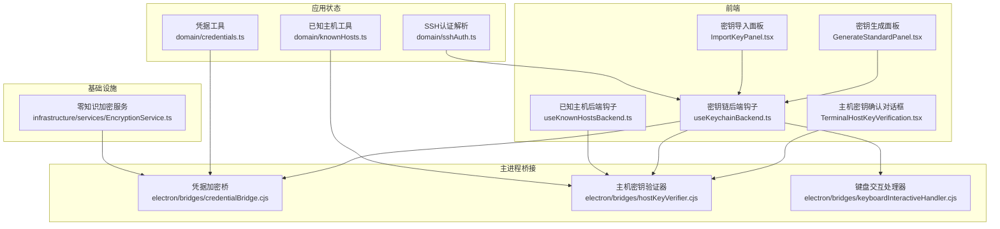

**图表来源**
- [components/keychain/GenerateStandardPanel.tsx:1-140](file://components/keychain/GenerateStandardPanel.tsx#L1-L140)
- [components/keychain/ImportKeyPanel.tsx:1-202](file://components/keychain/ImportKeyPanel.tsx#L1-L202)
- [components/terminal/TerminalHostKeyVerification.tsx:1-129](file://components/terminal/TerminalHostKeyVerification.tsx#L1-L129)
- [application/state/useKeychainBackend.ts:1-36](file://application/state/useKeychainBackend.ts#L1-L36)
- [application/state/useKnownHostsBackend.ts:1-13](file://application/state/useKnownHostsBackend.ts#L1-L13)
- [domain/credentials.ts:1-111](file://domain/credentials.ts#L1-L111)
- [domain/sshAuth.ts:1-125](file://domain/sshAuth.ts#L1-L125)
- [domain/knownHosts.ts:1-193](file://domain/knownHosts.ts#L1-L193)
- [infrastructure/services/EncryptionService.ts:1-440](file://infrastructure/services/EncryptionService.ts#L1-L440)
- [electron/bridges/credentialBridge.cjs:1-86](file://electron/bridges/credentialBridge.cjs#L1-L86)
- [electron/bridges/hostKeyVerifier.cjs:1-267](file://electron/bridges/hostKeyVerifier.cjs#L1-L267)
- [electron/bridges/keyboardInteractiveHandler.cjs:1-107](file://electron/bridges/keyboardInteractiveHandler.cjs#L1-L107)

**章节来源**
- [domain/credentials.ts:1-111](file://domain/credentials.ts#L1-L111)
- [domain/knownHosts.ts:1-193](file://domain/knownHosts.ts#L1-L193)
- [domain/sshAuth.ts:1-125](file://domain/sshAuth.ts#L1-L125)
- [electron/bridges/credentialBridge.cjs:1-86](file://electron/bridges/credentialBridge.cjs#L1-L86)
- [electron/bridges/hostKeyVerifier.cjs:1-267](file://electron/bridges/hostKeyVerifier.cjs#L1-L267)
- [electron/bridges/keyboardInteractiveHandler.cjs:1-107](file://electron/bridges/keyboardInteractiveHandler.cjs#L1-L107)
- [infrastructure/services/EncryptionService.ts:1-440](file://infrastructure/services/EncryptionService.ts#L1-L440)
- [application/state/useKeychainBackend.ts:1-36](file://application/state/useKeychainBackend.ts#L1-L36)
- [application/state/useKnownHostsBackend.ts:1-13](file://application/state/useKnownHostsBackend.ts#L1-L13)
- [components/keychain/GenerateStandardPanel.tsx:1-140](file://components/keychain/GenerateStandardPanel.tsx#L1-L140)
- [components/keychain/ImportKeyPanel.tsx:1-202](file://components/keychain/ImportKeyPanel.tsx#L1-L202)
- [components/terminal/TerminalHostKeyVerification.tsx:1-129](file://components/terminal/TerminalHostKeyVerification.tsx#L1-L129)

## 核心组件
- 凭据占位符与清理：识别并清理设备绑定的加密占位符，避免在连接边界发送加密占位符作为凭据。
- 已知主机规范化：从公钥派生指纹与密钥类型，保证主机密钥验证的稳定性与一致性。
- SSH认证解析：根据覆盖优先级、身份与主机配置推导最终认证方式（密码/私钥/证书），并处理密钥文件路径与口令。
- 平台凭据加密：基于Electron safeStorage对敏感字段进行加解密，带版本前缀以避免重复加密。
- 零知识云同步加密：使用PBKDF2+AES-256-GCM实现客户端侧加密，不向云端暴露明文。
- 主机密钥验证：分类“可信/变更/未知”，支持用户确认加入或更新信任。
- 键盘交互认证：集中式请求存储与超时清理，确保跨会话一致的交互体验。
- 本地备份与恢复：保护性备份、跨窗口恢复屏障、中断哨兵，保障破坏性操作的安全性。

**章节来源**
- [domain/credentials.ts:30-110](file://domain/credentials.ts#L30-L110)
- [domain/knownHosts.ts:100-193](file://domain/knownHosts.ts#L100-L193)
- [domain/sshAuth.ts:44-125](file://domain/sshAuth.ts#L44-L125)
- [electron/bridges/credentialBridge.cjs:25-86](file://electron/bridges/credentialBridge.cjs#L25-L86)
- [infrastructure/services/EncryptionService.ts:101-338](file://infrastructure/services/EncryptionService.ts#L101-L338)
- [electron/bridges/hostKeyVerifier.cjs:84-132](file://electron/bridges/hostKeyVerifier.cjs#L84-L132)
- [electron/bridges/keyboardInteractiveHandler.cjs:16-107](file://electron/bridges/keyboardInteractiveHandler.cjs#L16-L107)
- [application/localVaultBackups.ts:116-226](file://application/localVaultBackups.ts#L116-L226)

## 架构总览
下图展示凭据安全的关键交互路径：UI触发→状态解析→桥接调用→平台/主进程处理→持久化与回显。

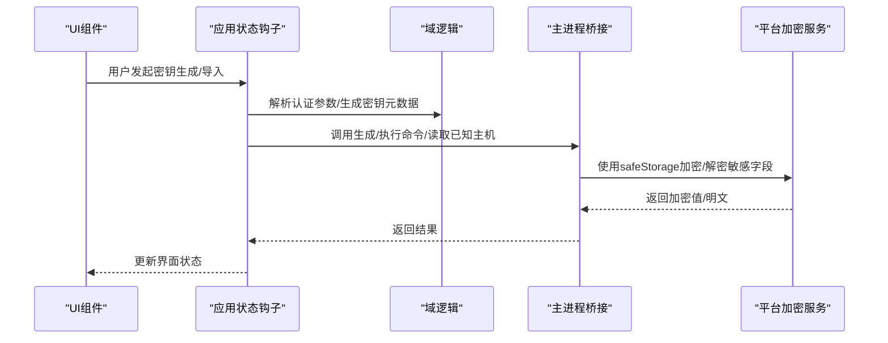

**图表来源**
- [application/state/useKeychainBackend.ts:4-34](file://application/state/useKeychainBackend.ts#L4-L34)
- [application/state/useKnownHostsBackend.ts:4-11](file://application/state/useKnownHostsBackend.ts#L4-L11)
- [domain/sshAuth.ts:44-125](file://domain/sshAuth.ts#L44-L125)
- [electron/bridges/credentialBridge.cjs:25-86](file://electron/bridges/credentialBridge.cjs#L25-L86)

## 详细组件分析

### 组件A：凭据占位符与清理
- 功能要点
  - 检测是否为加密占位符（含版本前缀与平台头部签名）
  - 清理占位符，避免在连接边界发送加密占位符
  - 同步扫描同步载荷中的敏感字段，防止推送不可解密数据
- 安全意义
  - 防止凭据泄露到服务器端
  - 防止跨设备/平台同步未解密数据

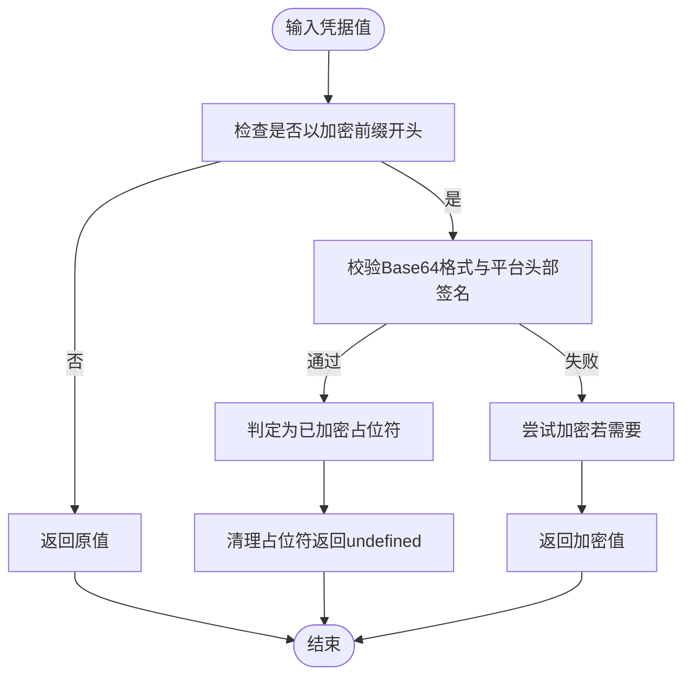

**图表来源**
- [domain/credentials.ts:30-52](file://domain/credentials.ts#L30-L52)
- [domain/credentials.ts:59-110](file://domain/credentials.ts#L59-L110)
- [electron/bridges/credentialBridge.cjs:32-60](file://electron/bridges/credentialBridge.cjs#L32-L60)

**章节来源**
- [domain/credentials.ts:30-110](file://domain/credentials.ts#L30-L110)
- [electron/bridges/credentialBridge.cjs:25-86](file://electron/bridges/credentialBridge.cjs#L25-L86)

### 组件B：已知主机管理与指纹派生
- 功能要点
  - upsert已知主机，按主机名、端口、密钥类型匹配去重
  - 从公钥派生SHA-256指纹（去除填充与大小写），兼容多种输入格式
  - 规范化记录，补全缺失的指纹与密钥类型，避免回退到脆弱的重新派生路径
- 安全意义
  - 稳定的指纹比较降低误判风险
  - 保证不同来源的公钥格式都能正确归一化

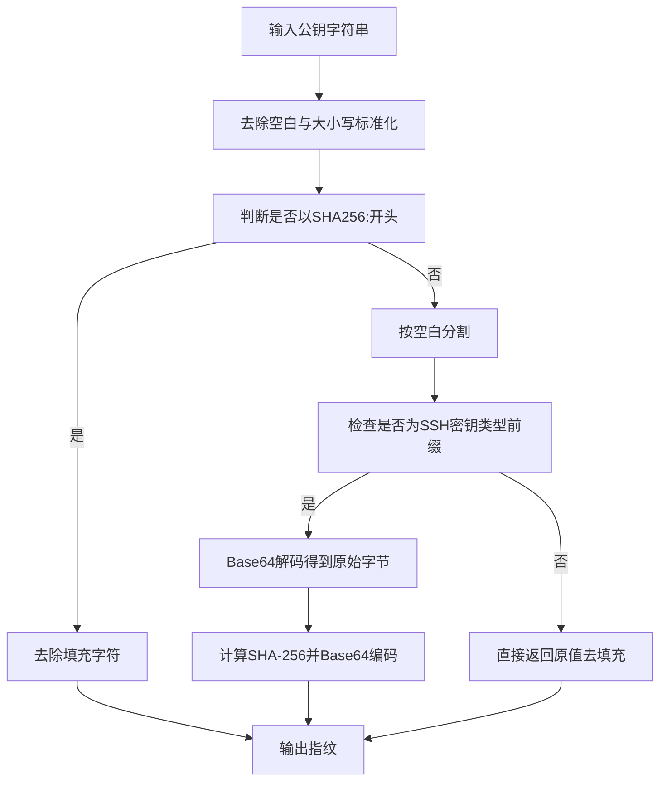

**图表来源**
- [domain/knownHosts.ts:123-139](file://domain/knownHosts.ts#L123-L139)
- [domain/knownHosts.ts:153-177](file://domain/knownHosts.ts#L153-L177)

**章节来源**
- [domain/knownHosts.ts:100-193](file://domain/knownHosts.ts#L100-L193)

### 组件C：SSH认证解析与桥接参数
- 功能要点
  - 推导认证方式：显式覆盖 > 身份配置 > 主机配置 > 密钥存在性 > 默认密码
  - 当选择密码时跳过加载密钥，严格尊重用户选择
  - 从密钥源类型决定是否返回私钥内容或外部文件路径
  - 对口令与私钥进行占位符清理，避免泄露
- 安全意义
  - 明确的优先级与最小暴露原则
  - 严格区分“引用文件”与“内联私钥”，减少明文暴露面

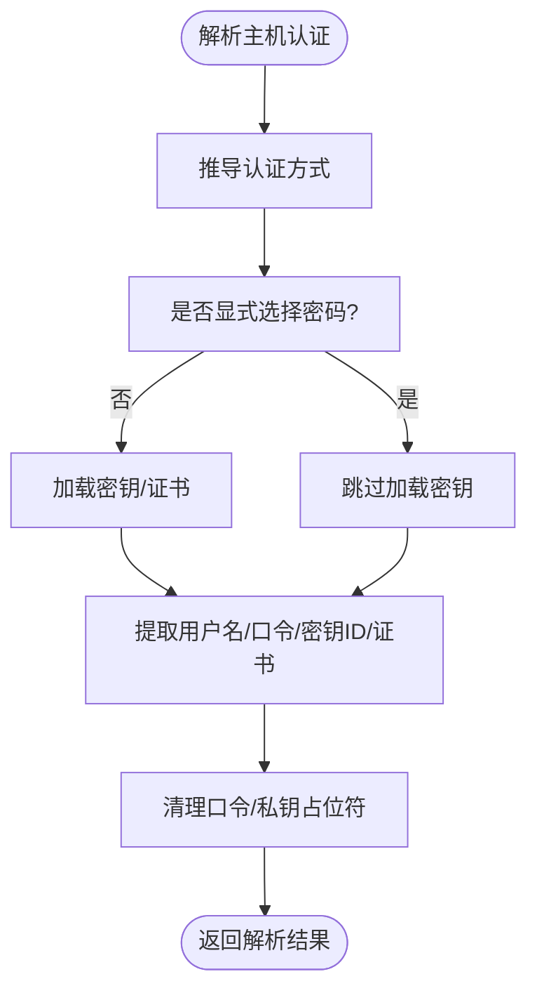

**图表来源**
- [domain/sshAuth.ts:25-42](file://domain/sshAuth.ts#L25-L42)
- [domain/sshAuth.ts:44-103](file://domain/sshAuth.ts#L44-L103)
- [domain/sshAuth.ts:105-125](file://domain/sshAuth.ts#L105-L125)

**章节来源**
- [domain/sshAuth.ts:1-125](file://domain/sshAuth.ts#L1-L125)

### 组件D：平台凭据加密桥
- 功能要点
  - 注册IPC处理器：可用性查询、加密、解密
  - 加密前先尝试解密验证，避免重复加密
  - 不可用时回退为明文（保证功能可用）
- 安全意义
  - 版本化前缀便于迁移与升级
  - 平台API不可用时仍可运行，但需注意降级风险

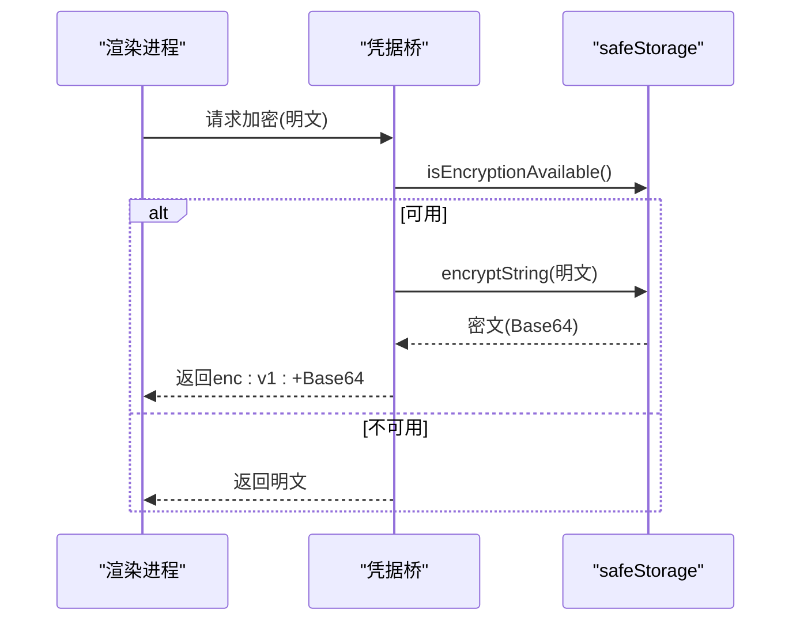

**图表来源**
- [electron/bridges/credentialBridge.cjs:25-60](file://electron/bridges/credentialBridge.cjs#L25-L60)

**章节来源**
- [electron/bridges/credentialBridge.cjs:1-86](file://electron/bridges/credentialBridge.cjs#L1-L86)

### 组件E：零知识云同步加密服务
- 功能要点
  - PBKDF2+AES-256-GCM：每份数据独立盐与IV
  - 仅保存验证哈希而非密钥，实现零知识
  - 支持创建/解锁主密钥配置、变更主密码、验证文件
- 安全意义
  - 客户端侧加密，云端无法解密
  - 迭代次数与随机性满足现代安全要求

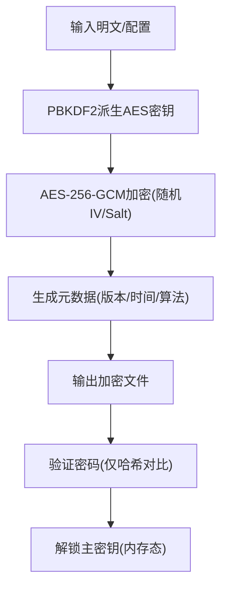

**图表来源**
- [infrastructure/services/EncryptionService.ts:101-133](file://infrastructure/services/EncryptionService.ts#L101-L133)
- [infrastructure/services/EncryptionService.ts:186-213](file://infrastructure/services/EncryptionService.ts#L186-L213)
- [infrastructure/services/EncryptionService.ts:252-288](file://infrastructure/services/EncryptionService.ts#L252-L288)
- [infrastructure/services/EncryptionService.ts:328-338](file://infrastructure/services/EncryptionService.ts#L328-L338)

**章节来源**
- [infrastructure/services/EncryptionService.ts:1-440](file://infrastructure/services/EncryptionService.ts#L1-L440)

### 组件F：主机密钥验证与用户交互
- 功能要点
  - 分类规则：指纹匹配→同类型不匹配→未知
  - 描述主机密钥：指纹、类型、公钥
  - IPC请求/响应：生成请求ID、超时清理、用户确认加入或更新
- 安全意义
  - 以指纹为绝对权威，降低误判
  - 用户明确授权加入/更新信任

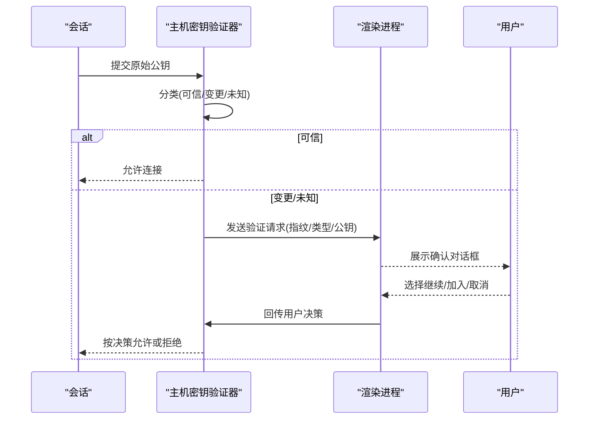

**图表来源**
- [electron/bridges/hostKeyVerifier.cjs:84-132](file://electron/bridges/hostKeyVerifier.cjs#L84-L132)
- [electron/bridges/hostKeyVerifier.cjs:175-240](file://electron/bridges/hostKeyVerifier.cjs#L175-L240)
- [components/terminal/TerminalHostKeyVerification.tsx:28-125](file://components/terminal/TerminalHostKeyVerification.tsx#L28-L125)

**章节来源**
- [electron/bridges/hostKeyVerifier.cjs:1-267](file://electron/bridges/hostKeyVerifier.cjs#L1-L267)
- [components/terminal/TerminalHostKeyVerification.tsx:1-129](file://components/terminal/TerminalHostKeyVerification.tsx#L1-L129)

### 组件G：键盘交互认证共享状态
- 功能要点
  - 集中式存储待处理请求，带TTL自动清理
  - IPC响应处理：取消/完成回调，超时自动中止
- 安全意义
  - 防止悬挂请求占用资源
  - 明确的超时与清理策略降低攻击面

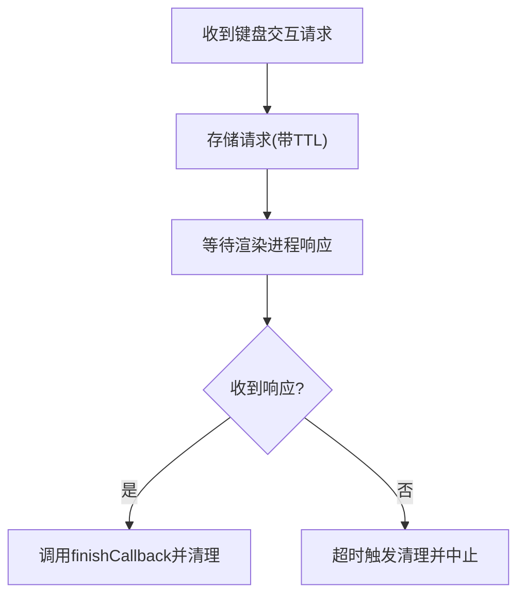

**图表来源**
- [electron/bridges/keyboardInteractiveHandler.cjs:26-84](file://electron/bridges/keyboardInteractiveHandler.cjs#L26-L84)

**章节来源**
- [electron/bridges/keyboardInteractiveHandler.cjs:1-107](file://electron/bridges/keyboardInteractiveHandler.cjs#L1-L107)

### 组件H：本地备份与恢复屏障
- 功能要点
  - 保护性备份：在破坏性应用前创建本地快照
  - 恢复屏障：跨窗口“恢复进行中”时间窗，心跳刷新
  - 中断哨兵：标记上次应用开始时间与保护性备份ID，避免半应用状态被推送
- 安全意义
  - 防止因崩溃导致的半应用状态污染云端
  - 保证恢复过程的原子性与可追踪性

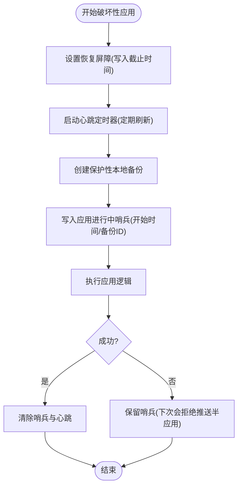

**图表来源**
- [application/localVaultBackups.ts:263-298](file://application/localVaultBackups.ts#L263-L298)
- [application/localVaultBackups.ts:393-432](file://application/localVaultBackups.ts#L393-L432)
- [application/localVaultBackups.ts:434-495](file://application/localVaultBackups.ts#L434-L495)

**章节来源**
- [application/localVaultBackups.ts:1-496](file://application/localVaultBackups.ts#L1-L496)

## 依赖关系分析
- 前端UI依赖应用状态钩子，后者通过桥接调用主进程能力
- 域逻辑（认证解析、已知主机、凭据占位符）为桥接与UI提供纯函数式能力
- 加密服务既用于本地凭据加密，也用于零知识云同步
- 主机密钥验证器与键盘交互处理器共同构成认证交互层

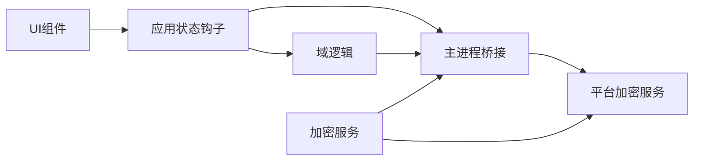

**图表来源**
- [application/state/useKeychainBackend.ts:1-36](file://application/state/useKeychainBackend.ts#L1-L36)
- [application/state/useKnownHostsBackend.ts:1-13](file://application/state/useKnownHostsBackend.ts#L1-L13)
- [domain/sshAuth.ts:1-125](file://domain/sshAuth.ts#L1-L125)
- [domain/knownHosts.ts:1-193](file://domain/knownHosts.ts#L1-L193)
- [domain/credentials.ts:1-111](file://domain/credentials.ts#L1-L111)
- [infrastructure/services/EncryptionService.ts:1-440](file://infrastructure/services/EncryptionService.ts#L1-L440)
- [electron/bridges/credentialBridge.cjs:1-86](file://electron/bridges/credentialBridge.cjs#L1-L86)
- [electron/bridges/hostKeyVerifier.cjs:1-267](file://electron/bridges/hostKeyVerifier.cjs#L1-L267)
- [electron/bridges/keyboardInteractiveHandler.cjs:1-107](file://electron/bridges/keyboardInteractiveHandler.cjs#L1-L107)

**章节来源**
- [application/state/useKeychainBackend.ts:1-36](file://application/state/useKeychainBackend.ts#L1-L36)
- [application/state/useKnownHostsBackend.ts:1-13](file://application/state/useKnownHostsBackend.ts#L1-L13)
- [domain/sshAuth.ts:1-125](file://domain/sshAuth.ts#L1-L125)
- [domain/knownHosts.ts:1-193](file://domain/knownHosts.ts#L1-L193)
- [domain/credentials.ts:1-111](file://domain/credentials.ts#L1-L111)
- [infrastructure/services/EncryptionService.ts:1-440](file://infrastructure/services/EncryptionService.ts#L1-L440)
- [electron/bridges/credentialBridge.cjs:1-86](file://electron/bridges/credentialBridge.cjs#L1-L86)
- [electron/bridges/hostKeyVerifier.cjs:1-267](file://electron/bridges/hostKeyVerifier.cjs#L1-L267)
- [electron/bridges/keyboardInteractiveHandler.cjs:1-107](file://electron/bridges/keyboardInteractiveHandler.cjs#L1-L107)

## 性能考量
- 已知主机指纹派生采用纯JS SHA-256，仅在读取时短时运行，避免影响交互流畅度
- 主机密钥验证与键盘交互均采用Map存储与TTL清理，复杂度低且可控
- 本地备份与恢复屏障使用轻量心跳与localStorage写入，尽量降低对主线程的影响
- 云同步加密采用Web Crypto API，充分利用浏览器硬件加速与异步特性

[本节为通用性能讨论，无需特定文件来源]

## 故障排除指南
- 无法加密/解密
  - 检查平台加密服务可用性与权限
  - 若不可用，系统会回退为明文，需谨慎处理敏感数据
  - 参考：[electron/bridges/credentialBridge.cjs:28-30](file://electron/bridges/credentialBridge.cjs#L28-L30)
- 连接时提示主机密钥变更
  - 查看UI对话框中的指纹差异，确认是否为合法迁移
  - 参考：[components/terminal/TerminalHostKeyVerification.tsx:28-125](file://components/terminal/TerminalHostKeyVerification.tsx#L28-L125)
- 键盘交互认证无响应
  - 检查请求是否超时（默认5分钟），查看日志清理记录
  - 参考：[electron/bridges/keyboardInteractiveHandler.cjs:13-41](file://electron/bridges/keyboardInteractiveHandler.cjs#L13-L41)
- 本地备份失败
  - 平台加密不可用或磁盘错误会导致跳过备份
  - 参考：[application/localVaultBackups.ts:155-164](file://application/localVaultBackups.ts#L155-L164)
- 云同步文件无法解密
  - 校验主密码与迭代次数，确认验证哈希一致
  - 参考：[infrastructure/services/EncryptionService.ts:156-172](file://infrastructure/services/EncryptionService.ts#L156-L172)

**章节来源**
- [electron/bridges/credentialBridge.cjs:28-30](file://electron/bridges/credentialBridge.cjs#L28-L30)
- [components/terminal/TerminalHostKeyVerification.tsx:28-125](file://components/terminal/TerminalHostKeyVerification.tsx#L28-L125)
- [electron/bridges/keyboardInteractiveHandler.cjs:13-41](file://electron/bridges/keyboardInteractiveHandler.cjs#L13-L41)
- [application/localVaultBackups.ts:155-164](file://application/localVaultBackups.ts#L155-L164)
- [infrastructure/services/EncryptionService.ts:156-172](file://infrastructure/services/EncryptionService.ts#L156-L172)

## 结论
该凭据安全体系通过“域逻辑解析+平台加密+零知识云同步+用户交互确认+本地备份屏障”的多层防护，实现了从密钥生成、导入、存储到认证与恢复的全生命周期安全。建议在生产环境中结合密钥轮换、访问审计与风险评估，持续提升整体安全性。

[本节为总结性内容，无需特定文件来源]

## 附录

### 安全配置示例（步骤说明）
- 启用平台加密
  - 在支持的平台上确保safeStorage可用，并在UI中显示可用性状态
  - 参考：[electron/bridges/credentialBridge.cjs:28-30](file://electron/bridges/credentialBridge.cjs#L28-L30)
- 设置主密码与零知识同步
  - 创建主密钥配置并保存验证哈希
  - 参考：[infrastructure/services/EncryptionService.ts:350-364](file://infrastructure/services/EncryptionService.ts#L350-L364)
- 生成SSH密钥
  - 选择类型与长度，可选设置口令与保存选项
  - 参考：[components/keychain/GenerateStandardPanel.tsx:31-139](file://components/keychain/GenerateStandardPanel.tsx#L31-L139)
- 导入现有密钥
  - 支持拖拽/文件导入，自动识别密钥类型
  - 参考：[components/keychain/ImportKeyPanel.tsx:33-201](file://components/keychain/ImportKeyPanel.tsx#L33-L201)
- 执行命令并携带算法偏好
  - 在执行命令时传递算法覆盖参数，确保兼容目标主机
  - 参考：[application/state/useKeychainBackend.ts:27-31](file://application/state/useKeychainBackend.ts#L27-L31)

**章节来源**
- [electron/bridges/credentialBridge.cjs:28-30](file://electron/bridges/credentialBridge.cjs#L28-L30)
- [infrastructure/services/EncryptionService.ts:350-364](file://infrastructure/services/EncryptionService.ts#L350-L364)
- [components/keychain/GenerateStandardPanel.tsx:31-139](file://components/keychain/GenerateStandardPanel.tsx#L31-L139)
- [components/keychain/ImportKeyPanel.tsx:33-201](file://components/keychain/ImportKeyPanel.tsx#L33-L201)
- [application/state/useKeychainBackend.ts:27-31](file://application/state/useKeychainBackend.ts#L27-L31)

### 安全最佳实践
- 密钥轮换
  - 定期更换主密码与SSH密钥，使用强口令与长密钥长度
- 访问审计
  - 记录认证事件与主机密钥变更，定期审查
- 风险评估
  - 评估第三方依赖与平台API的可用性与安全基线
- 备份策略
  - 开启保护性本地备份，限制最大备份数量，定期清理过期快照

[本节为通用最佳实践，无需特定文件来源]