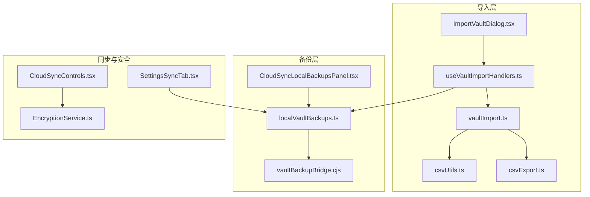
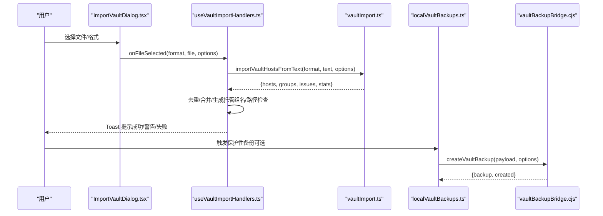
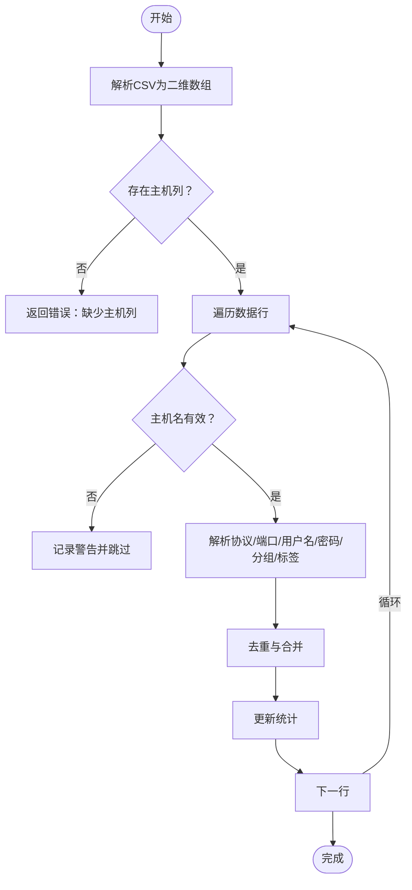
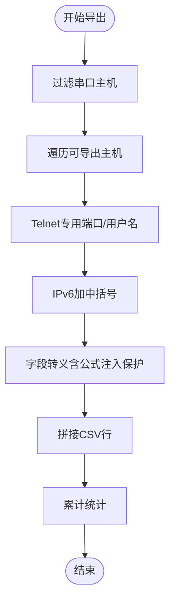
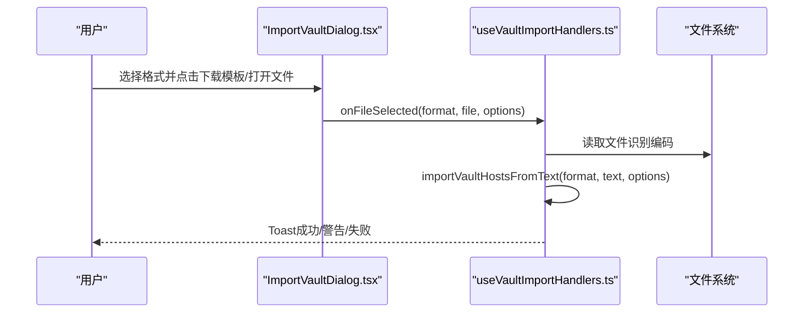
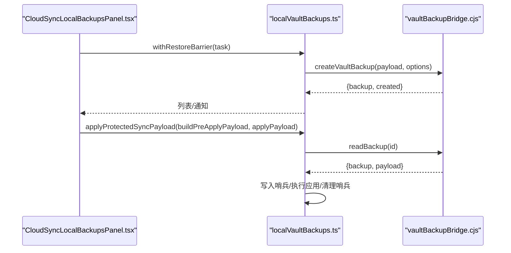
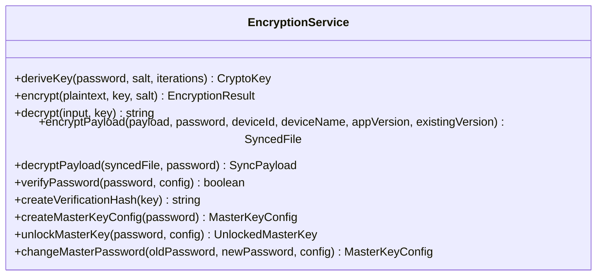
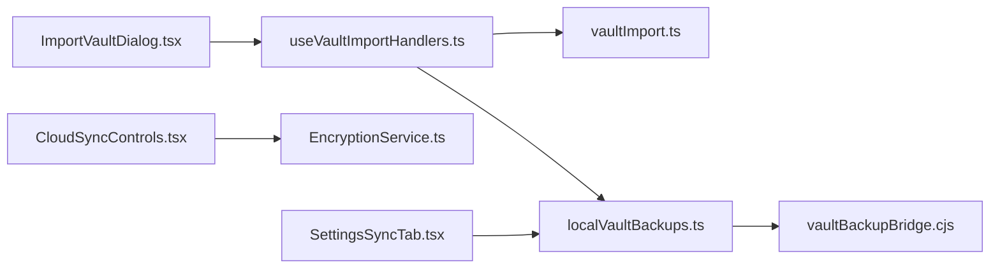

# 导入导出与备份

<cite>
**本文引用的文件**
- [csvExport.ts](file://domain/vaultImport/csvExport.ts)
- [csvUtils.ts](file://domain/vaultImport/csvUtils.ts)
- [vaultImport.ts](file://domain/vaultImport.ts)
- [ImportVaultDialog.tsx](file://components/vault/ImportVaultDialog.tsx)
- [useVaultImportHandlers.ts](file://components/vault/useVaultImportHandlers.ts)
- [localVaultBackups.ts](file://application/localVaultBackups.ts)
- [vaultBackupBridge.cjs](file://electron/bridges/vaultBackupBridge.cjs)
- [CloudSyncLocalBackupsPanel.tsx](file://components/cloud-sync/CloudSyncLocalBackupsPanel.tsx)
- [EncryptionService.ts](file://infrastructure/services/EncryptionService.ts)
- [CloudSyncControls.tsx](file://components/cloud-sync/CloudSyncControls.tsx)
- [SettingsSyncTab.tsx](file://components/settings/tabs/SettingsSyncTab.tsx)
</cite>

## 目录
1. [简介](#简介)
2. [项目结构](#项目结构)
3. [核心组件](#核心组件)
4. [架构总览](#架构总览)
5. [详细组件分析](#详细组件分析)
6. [依赖关系分析](#依赖关系分析)
7. [性能考量](#性能考量)
8. [故障排查指南](#故障排查指南)
9. [结论](#结论)
10. [附录](#附录)

## 简介
本操作指南聚焦于 Netcatty 的“导入导出与备份”能力，覆盖以下主题：
- CSV 格式导入：文件格式要求、字段映射、错误处理、批量导入与去重策略
- 配置备份机制：本地备份（自动/手动）、版本变更备份、保护性备份、恢复流程与并发防护
- 跨设备同步：端到端加密、冲突解决、版本管理与数据一致性
- 导出功能：CSV 完整导出、模板下载、字段转义与 IPv6 处理
- 数据安全与完整性：加密传输、校验机制、恢复流程与安全边界

## 项目结构
围绕导入导出与备份的关键模块分布如下：
- 域模型与解析：domain/vaultImport（CSV 解析、多源导入、去重与统计）
- 导入 UI 与交互：components/vault（导入对话框、导入处理器）
- 本地备份与恢复：application/localVaultBackups、electron/bridges/vaultBackupBridge
- 同步与加密：infrastructure/services/EncryptionService、components/cloud-sync
- 设置与应用入口：components/settings/tabs/SettingsSyncTab

图表来源
- [ImportVaultDialog.tsx:144-277](file://components/vault/ImportVaultDialog.tsx#L144-L277)
- [useVaultImportHandlers.ts:57-262](file://components/vault/useVaultImportHandlers.ts#L57-L262)
- [vaultImport.ts:906-929](file://domain/vaultImport.ts#L906-L929)
- [csvUtils.ts:1-71](file://domain/vaultImport/csvUtils.ts#L1-L71)
- [csvExport.ts:1-104](file://domain/vaultImport/csvExport.ts#L1-L104)
- [localVaultBackups.ts:116-165](file://application/localVaultBackups.ts#L116-L165)
- [vaultBackupBridge.cjs:522-596](file://electron/bridges/vaultBackupBridge.cjs#L522-L596)
- [CloudSyncLocalBackupsPanel.tsx:1-445](file://components/cloud-sync/CloudSyncLocalBackupsPanel.tsx#L1-L445)
- [EncryptionService.ts:1-440](file://infrastructure/services/EncryptionService.ts#L1-L440)
- [CloudSyncControls.tsx:1-624](file://components/cloud-sync/CloudSyncControls.tsx#L1-L624)
- [SettingsSyncTab.tsx:18-67](file://components/settings/tabs/SettingsSyncTab.tsx#L18-L67)

章节来源
- [ImportVaultDialog.tsx:144-277](file://components/vault/ImportVaultDialog.tsx#L144-L277)
- [useVaultImportHandlers.ts:57-262](file://components/vault/useVaultImportHandlers.ts#L57-L262)
- [vaultImport.ts:906-929](file://domain/vaultImport.ts#L906-L929)
- [csvUtils.ts:1-71](file://domain/vaultImport/csvUtils.ts#L1-L71)
- [csvExport.ts:1-104](file://domain/vaultImport/csvExport.ts#L1-L104)
- [localVaultBackups.ts:116-165](file://application/localVaultBackups.ts#L116-L165)
- [vaultBackupBridge.cjs:522-596](file://electron/bridges/vaultBackupBridge.cjs#L522-L596)
- [CloudSyncLocalBackupsPanel.tsx:1-445](file://components/cloud-sync/CloudSyncLocalBackupsPanel.tsx#L1-445)
- [EncryptionService.ts:1-440](file://infrastructure/services/EncryptionService.ts#L1-L440)
- [CloudSyncControls.tsx:1-624](file://components/cloud-sync/CloudSyncControls.tsx#L1-L624)
- [SettingsSyncTab.tsx:18-67](file://components/settings/tabs/SettingsSyncTab.tsx#L18-L67)

## 核心组件
- CSV 导入与导出
  - CSV 导入：支持 CSV、PuTTY 注册表、MobaXterm、SecureCRT、ssh_config 多种格式；内置字段映射、去重、跳过无效项、统计与问题报告
  - CSV 模板与导出：生成 CSV 模板、导出主机列表、字段转义与 IPv6 处理、密码列特殊处理
- 本地备份与恢复
  - 保护性备份：在可能破坏性操作前自动创建本地备份
  - 版本变更备份：应用升级时自动备份
  - 恢复流程：跨窗口屏障、中断检测、恢复后清理
- 同步与加密
  - 端到端加密：主密码派生密钥、AES-256-GCM 加解密、验证哈希
  - 冲突解决：版本号与时间戳对比，用户选择保留本地或云端
- 导入 UI 与交互
  - 多格式导入对话框、模板下载、编码识别、重复与冲突处理、托管导入（ssh_config）

章节来源
- [vaultImport.ts:906-929](file://domain/vaultImport.ts#L906-L929)
- [csvExport.ts:1-104](file://domain/vaultImport/csvExport.ts#L1-L104)
- [localVaultBackups.ts:116-165](file://application/localVaultBackups.ts#L116-L165)
- [localVaultBackups.ts:393-432](file://application/localVaultBackups.ts#L393-L432)
- [EncryptionService.ts:252-322](file://infrastructure/services/EncryptionService.ts#L252-L322)
- [CloudSyncControls.tsx:528-619](file://components/cloud-sync/CloudSyncControls.tsx#L528-L619)
- [ImportVaultDialog.tsx:144-277](file://components/vault/ImportVaultDialog.tsx#L144-L277)
- [useVaultImportHandlers.ts:57-262](file://components/vault/useVaultImportHandlers.ts#L57-L262)

## 架构总览
下图展示从导入到备份、再到同步的整体流程与关键交互点。

图表来源
- [ImportVaultDialog.tsx:144-277](file://components/vault/ImportVaultDialog.tsx#L144-L277)
- [useVaultImportHandlers.ts:57-262](file://components/vault/useVaultImportHandlers.ts#L57-L262)
- [vaultImport.ts:906-929](file://domain/vaultImport.ts#L906-L929)
- [localVaultBackups.ts:116-165](file://application/localVaultBackups.ts#L116-L165)
- [vaultBackupBridge.cjs:522-596](file://electron/bridges/vaultBackupBridge.cjs#L522-L596)

## 详细组件分析

### CSV 导入与字段映射
- 支持字段映射
  - CSV：Groups/Group/Folder/Path、Label/Name、Tags/Tag、Hostname/Host/Server、Protocol/Proto/Scheme、Port、Username/User/Login、Password/Pass/Passwd
  - 自动识别协议与端口：支持 URL 形式、proto 后缀形式、快速连接解析
- 错误处理与统计
  - 缺少 Hostname 列时报错
  - 无效主机名跳过并记录警告
  - 去重：按协议、主机、端口、用户名聚合，合并标签、密码、分组、标签
- 批量导入
  - 读取文本后解析为二维数组，逐行解析并构建 Host 对象
  - 统计解析数、导入数、跳过数、重复数

图表来源
- [vaultImport.ts:244-341](file://domain/vaultImport.ts#L244-L341)
- [csvUtils.ts:1-71](file://domain/vaultImport/csvUtils.ts#L1-L71)

章节来源
- [vaultImport.ts:244-341](file://domain/vaultImport.ts#L244-L341)
- [csvUtils.ts:1-71](file://domain/vaultImport/csvUtils.ts#L1-L71)

### CSV 模板与导出
- 模板生成
  - 包含示例行（可选），字段顺序固定
  - 字段转义：包含引号、逗号、换行符时加双引号包裹；制表符/回车开头的单元格以单引号前缀防止公式注入
- 导出策略
  - 过滤串口（serial）类型主机（不支持 CSV）
  - Telnet 主机使用专用端口与用户名
  - IPv6 地址加中括号避免被误判为“主机:端口”
  - 密码列跳过公式注入保护以保证凭据往返一致
- 统计输出
  - 返回导出条数与跳过条数（仅串口）

图表来源
- [csvExport.ts:28-104](file://domain/vaultImport/csvExport.ts#L28-L104)

章节来源
- [csvExport.ts:1-104](file://domain/vaultImport/csvExport.ts#L1-L104)

### 导入 UI 与交互（多格式）
- 支持格式
  - PuTTY、MobaXterm、CSV、SecureCRT、ssh_config
  - ssh_config 支持托管模式（基于文件路径监听变化）
- 模板下载
  - 提供 CSV 模板下载按钮
- 编码识别
  - 自动识别 UTF-8/UTF-16 BE/LE BOM 并去除 BOM
- 重复与冲突处理
  - 基于协议+主机+端口+用户名去重
  - 托管导入时更新现有主机并移动至托管组
- 托管导入限制
  - 需要有效文件路径；若已托管则提示

图表来源
- [ImportVaultDialog.tsx:144-277](file://components/vault/ImportVaultDialog.tsx#L144-L277)
- [useVaultImportHandlers.ts:30-56](file://components/vault/useVaultImportHandlers.ts#L30-L56)
- [useVaultImportHandlers.ts:57-262](file://components/vault/useVaultImportHandlers.ts#L57-L262)
- [vaultImport.ts:906-929](file://domain/vaultImport.ts#L906-L929)

章节来源
- [ImportVaultDialog.tsx:144-277](file://components/vault/ImportVaultDialog.tsx#L144-L277)
- [useVaultImportHandlers.ts:30-56](file://components/vault/useVaultImportHandlers.ts#L30-L56)
- [useVaultImportHandlers.ts:57-262](file://components/vault/useVaultImportHandlers.ts#L57-L262)
- [vaultImport.ts:906-929](file://domain/vaultImport.ts#L906-L929)

### 本地备份与恢复
- 保护性备份
  - 在可能破坏性操作前自动创建本地备份（如恢复前）
  - 若无有意义数据则跳过（不写空记录）
  - 主进程拒绝明文写入（安全存储不可用时抛错）
- 版本变更备份
  - 应用版本变更时自动备份，带源/目标版本信息
  - 仅在实际写入备份后才推进版本戳，避免失败导致“永久缺失”窗口
- 恢复流程
  - 跨窗口“恢复进行中”屏障：防止并发自动同步
  - 心跳刷新屏障，确保大容量/慢解锁场景仍保持屏障
  - 中断检测：若上次应用未清理哨兵，阻止推送半应用状态
  - 恢复完成后清理哨兵
- 主进程实现要点
  - Payload 规范化与稳定指纹（排序键、去 undefined、顶层时间戳清零）
  - Payload 上限与文件大小上限
  - 原子写入：临时文件 + fsync + 原子重命名 + 目录 fsync
  - 仅允许安全存储可用时写入，否则拒绝明文

图表来源
- [CloudSyncLocalBackupsPanel.tsx:138-176](file://components/cloud-sync/CloudSyncLocalBackupsPanel.tsx#L138-L176)
- [localVaultBackups.ts:263-298](file://application/localVaultBackups.ts#L263-L298)
- [localVaultBackups.ts:393-432](file://application/localVaultBackups.ts#L393-L432)
- [vaultBackupBridge.cjs:522-596](file://electron/bridges/vaultBackupBridge.cjs#L522-L596)

章节来源
- [localVaultBackups.ts:116-165](file://application/localVaultBackups.ts#L116-L165)
- [localVaultBackups.ts:434-495](file://application/localVaultBackups.ts#L434-L495)
- [localVaultBackups.ts:263-298](file://application/localVaultBackups.ts#L263-L298)
- [localVaultBackups.ts:393-432](file://application/localVaultBackups.ts#L393-L432)
- [vaultBackupBridge.cjs:385-520](file://electron/bridges/vaultBackupBridge.cjs#L385-L520)

### 同步与加密（端到端）
- 加密服务
  - PBKDF2 派生密钥（默认 600000 次迭代），AES-256-GCM 加密
  - 每个文件包含随机 IV 与盐，元数据记录算法与迭代次数
  - 使用 SHA-256 验证哈希确认密码正确性，不存储密钥
- 同步 UI
  - 提供主密码设置、连接/断开云服务、冲突解决弹窗
  - 冲突界面显示本地/云端版本与更新时间，支持保留本地或云端

图表来源
- [EncryptionService.ts:101-322](file://infrastructure/services/EncryptionService.ts#L101-L322)

章节来源
- [EncryptionService.ts:101-322](file://infrastructure/services/EncryptionService.ts#L101-L322)
- [CloudSyncControls.tsx:528-619](file://components/cloud-sync/CloudSyncControls.tsx#L528-L619)

### 设置中的应用与恢复入口
- 构建本地/同步 Payload
- 通过受保护的应用流程执行导入，确保恢复安全与一致性

章节来源
- [SettingsSyncTab.tsx:18-67](file://components/settings/tabs/SettingsSyncTab.tsx#L18-L67)

## 依赖关系分析
- 导入链路
  - UI 层（ImportVaultDialog、useVaultImportHandlers）调用域层（vaultImport）解析文本，再写入应用状态
  - 去重与托管导入逻辑在处理器中完成，避免重复与冲突
- 备份链路
  - 应用层封装保护性备份与恢复屏障；主进程桥负责磁盘写入、原子性与安全存储校验
- 同步链路
  - EncryptionService 提供端到端加密；CloudSyncControls 提供 UI 与冲突解决；SettingsSyncTab 将导入与恢复接入应用

图表来源
- [ImportVaultDialog.tsx:144-277](file://components/vault/ImportVaultDialog.tsx#L144-L277)
- [useVaultImportHandlers.ts:57-262](file://components/vault/useVaultImportHandlers.ts#L57-L262)
- [vaultImport.ts:906-929](file://domain/vaultImport.ts#L906-L929)
- [localVaultBackups.ts:116-165](file://application/localVaultBackups.ts#L116-L165)
- [vaultBackupBridge.cjs:522-596](file://electron/bridges/vaultBackupBridge.cjs#L522-L596)
- [CloudSyncControls.tsx:1-624](file://components/cloud-sync/CloudSyncControls.tsx#L1-L624)
- [EncryptionService.ts:1-440](file://infrastructure/services/EncryptionService.ts#L1-L440)
- [SettingsSyncTab.tsx:18-67](file://components/settings/tabs/SettingsSyncTab.tsx#L18-L67)

章节来源
- [ImportVaultDialog.tsx:144-277](file://components/vault/ImportVaultDialog.tsx#L144-L277)
- [useVaultImportHandlers.ts:57-262](file://components/vault/useVaultImportHandlers.ts#L57-L262)
- [vaultImport.ts:906-929](file://domain/vaultImport.ts#L906-L929)
- [localVaultBackups.ts:116-165](file://application/localVaultBackups.ts#L116-L165)
- [vaultBackupBridge.cjs:522-596](file://electron/bridges/vaultBackupBridge.cjs#L522-L596)
- [CloudSyncControls.tsx:1-624](file://components/cloud-sync/CloudSyncControls.tsx#L1-L624)
- [EncryptionService.ts:1-440](file://infrastructure/services/EncryptionService.ts#L1-L440)
- [SettingsSyncTab.tsx:18-67](file://components/settings/tabs/SettingsSyncTab.tsx#L18-L67)

## 性能考量
- 导入性能
  - CSV 解析为二维数组，逐行处理；建议控制单次导入行数，避免 UI 卡顿
  - 去重使用 Map 聚合，复杂度近似 O(n)
- 备份性能
  - 主进程写入采用原子文件 + fsync，确保可靠性但会增加 I/O；合理设置最大保留数量
  - Payload 规范化与指纹计算为 CPU 密集步骤，建议避免频繁触发
- 同步性能
  - AES-256-GCM 与 PBKDF2 迭代次数较高，首次加解密会有延迟；后续可利用内存解锁状态减少重复派生

## 故障排查指南
- CSV 导入失败
  - 检查是否包含 Hostname 列；确认字段名称大小写与别名匹配
  - 查看警告/错误消息，修正无效主机名或协议
- 无法创建本地备份
  - 安全存储不可用（平台不支持或环境限制）会导致拒绝明文写入
  - 检查磁盘空间与权限；确认 Payload 未超过大小限制
- 恢复失败或数据不一致
  - 检查“恢复进行中”屏障是否过期；确保没有并发窗口同时进行自动同步
  - 若上次应用未清理哨兵，需先清理后再继续
- 同步冲突
  - 使用冲突解决弹窗选择保留本地或云端；注意版本号与更新时间
- 导入托管 ssh_config
  - 确保文件路径有效且未被重复托管；必要时调整托管组名避免冲突

章节来源
- [vaultImport.ts:244-341](file://domain/vaultImport.ts#L244-L341)
- [vaultBackupBridge.cjs:188-215](file://electron/bridges/vaultBackupBridge.cjs#L188-L215)
- [localVaultBackups.ts:263-298](file://application/localVaultBackups.ts#L263-L298)
- [CloudSyncControls.tsx:528-619](file://components/cloud-sync/CloudSyncControls.tsx#L528-L619)
- [useVaultImportHandlers.ts:100-124](file://components/vault/useVaultImportHandlers.ts#L100-L124)

## 结论
本指南梳理了 Netcatty 的导入导出与备份体系：以 CSV 为核心的数据交换格式，配合多源导入与严格的字段映射；通过本地保护性备份与恢复屏障确保数据安全；结合端到端加密与冲突解决机制实现跨设备同步。遵循本文的最佳实践与排障建议，可在保证安全性的前提下高效完成数据迁移与日常维护。

## 附录
- 最佳实践
  - 导入前先下载并核对 CSV 模板，确保字段齐全
  - 使用托管导入时提供有效文件路径，并避免重复托管
  - 定期检查本地备份列表，合理设置保留数量
  - 同步前确认主密码正确，避免因密码错误导致同步失败
  - 发生冲突时优先评估版本与时间，谨慎选择保留策略