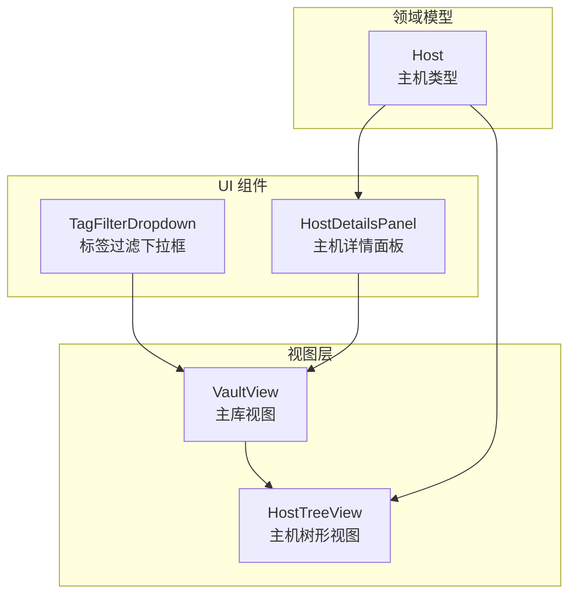
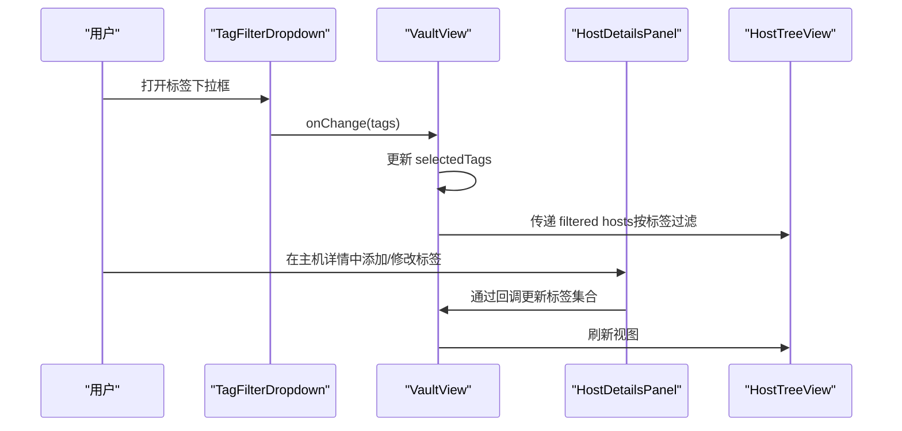
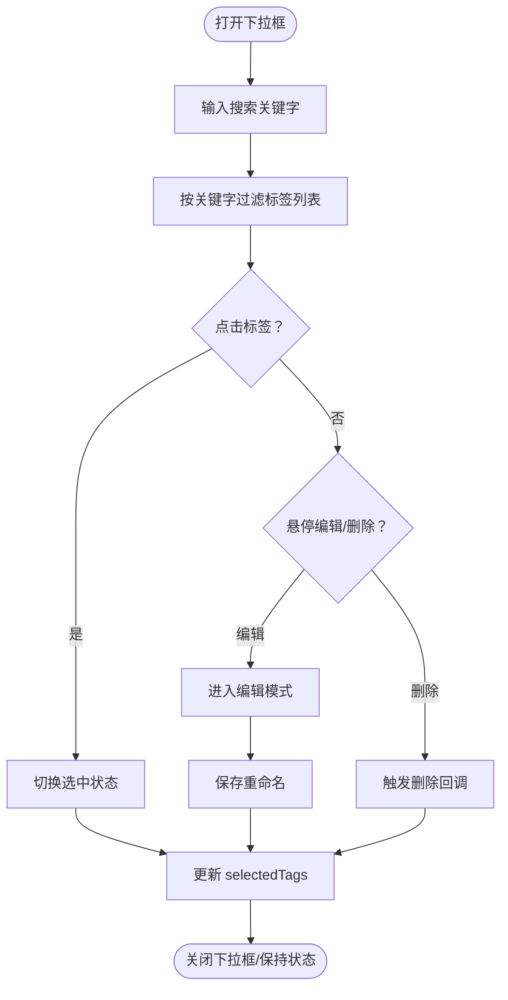
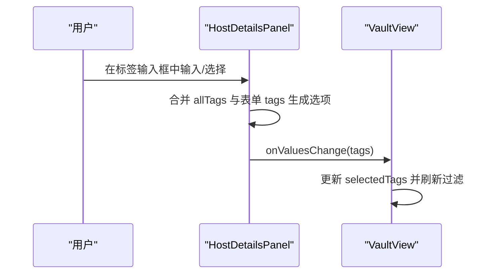
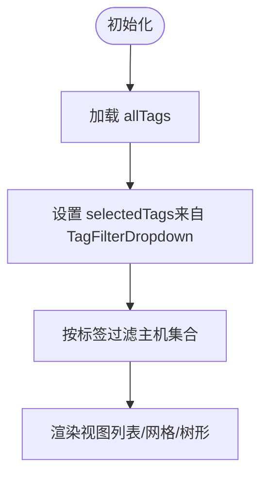
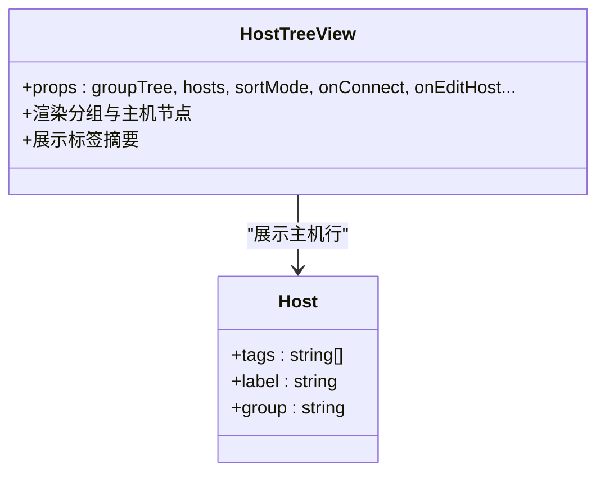
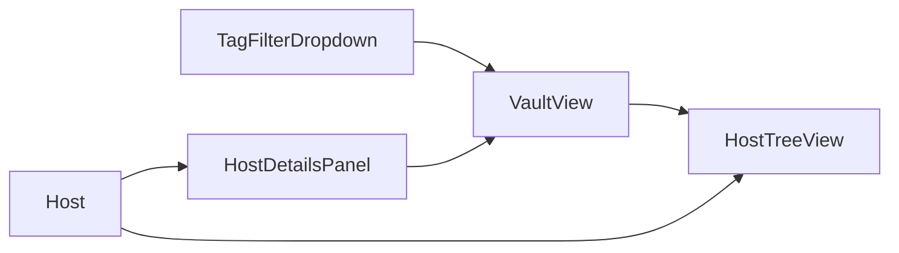

# 标签系统管理

<cite>
**本文档引用的文件**
- [components/ui/tag-filter-dropdown.tsx](file://components/ui/tag-filter-dropdown.tsx)
- [components/HostDetailsPanel.tsx](file://components/HostDetailsPanel.tsx)
- [components/VaultView.tsx](file://components/VaultView.tsx)
- [components/HostTreeView.tsx](file://components/HostTreeView.tsx)
- [domain/host.ts](file://domain/host.ts)
- [domain/models.ts](file://domain/models.ts)
</cite>

## 目录
1. [简介](#简介)
2. [项目结构](#项目结构)
3. [核心组件](#核心组件)
4. [架构总览](#架构总览)
5. [详细组件分析](#详细组件分析)
6. [依赖关系分析](#依赖关系分析)
7. [性能考量](#性能考量)
8. [故障排除指南](#故障排除指南)
9. [结论](#结论)
10. [附录](#附录)

## 简介
本文件面向“标签系统管理”功能，围绕标签的创建、编辑、删除与重命名，以及标签在主机上的分配与移除机制进行系统化说明。同时覆盖标签在不同视图（列表、网格、树形）中的展示与交互，标签的搜索与过滤能力，以及标签的分类与组织策略（如颜色标识、层级结构、命名规范）。最后提供最佳实践建议，帮助用户高效、稳定地管理标签。

## 项目结构
标签系统涉及以下关键模块：
- UI 层：标签过滤下拉组件，用于在主机详情面板中选择或创建标签
- 视图层：主库视图（VaultView）负责标签筛选、视图模式切换与主机集合展示
- 树形视图：HostTreeView 展示分组与主机，并在行内显示标签摘要
- 领域模型：Host 类型定义包含 tags 字段，支持标签数组存储

图表来源
- [components/ui/tag-filter-dropdown.tsx:1-254](file://components/ui/tag-filter-dropdown.tsx#L1-L254)
- [components/HostDetailsPanel.tsx:61-125](file://components/HostDetailsPanel.tsx#L61-L125)
- [components/VaultView.tsx:270-285](file://components/VaultView.tsx#L270-L285)
- [components/HostTreeView.tsx:349-411](file://components/HostTreeView.tsx#L349-L411)
- [domain/models.ts:1-8](file://domain/models.ts#L1-L8)

章节来源
- [components/ui/tag-filter-dropdown.tsx:1-254](file://components/ui/tag-filter-dropdown.tsx#L1-L254)
- [components/HostDetailsPanel.tsx:61-125](file://components/HostDetailsPanel.tsx#L61-L125)
- [components/VaultView.tsx:270-285](file://components/VaultView.tsx#L270-L285)
- [components/HostTreeView.tsx:349-411](file://components/HostTreeView.tsx#L349-L411)
- [domain/models.ts:1-8](file://domain/models.ts#L1-L8)

## 核心组件
- 标签过滤下拉框（TagFilterDropdown）
  - 支持搜索、多选、编辑、删除标签
  - 提供回调以同步外部状态（如 onEditTag、onDeleteTag）
- 主机详情面板（HostDetailsPanel）
  - 提供标签输入与自动补全（MultiCombobox）
  - 支持新建标签回调 onCreateTag
- 主库视图（VaultView）
  - 维护 selectedTags 状态，驱动主机集合过滤
  - 与 TagFilterDropdown 协同工作
- 树形视图（HostTreeView）
  - 在节点行内展示标签摘要，便于快速识别

章节来源
- [components/ui/tag-filter-dropdown.tsx:9-25](file://components/ui/tag-filter-dropdown.tsx#L9-L25)
- [components/HostDetailsPanel.tsx:61-125](file://components/HostDetailsPanel.tsx#L61-L125)
- [components/VaultView.tsx:270-285](file://components/VaultView.tsx#L270-L285)
- [components/HostTreeView.tsx:349-411](file://components/HostTreeView.tsx#L349-L411)

## 架构总览
标签系统采用“状态驱动 + 回调同步”的设计：
- 用户在标签过滤下拉框中选择/编辑/删除标签
- VaultView 通过 selectedTags 过滤主机集合
- HostDetailsPanel 通过 MultiCombobox 为单个主机设置标签
- HostTreeView 展示标签摘要，支持在树形结构中浏览

图表来源
- [components/ui/tag-filter-dropdown.tsx:32-42](file://components/ui/tag-filter-dropdown.tsx#L32-L42)
- [components/VaultView.tsx:281-282](file://components/VaultView.tsx#L281-L282)
- [components/HostDetailsPanel.tsx:751-760](file://components/HostDetailsPanel.tsx#L751-L760)
- [components/HostTreeView.tsx:349-411](file://components/HostTreeView.tsx#L349-L411)

## 详细组件分析

### 标签过滤下拉框（TagFilterDropdown）
- 功能要点
  - 搜索：根据输入关键字进行大小写不敏感的包含匹配
  - 多选：点击标签切换选中状态
  - 编辑：在可编辑模式下重命名标签，并同步更新已选中项
  - 删除：删除标签并从选中集合中移除
  - 清空：一键清除所有选中标签
- 关键交互
  - onEditTag/onDeleteTag 回调用于与外部状态同步
  - 选中态高亮与复选标记提示
  - 悬停显示编辑/删除按钮
- 性能与复杂度
  - 过滤为 O(n) 线性扫描 allTags
  - 编辑/删除后同步 selectedTags，避免重复渲染

图表来源
- [components/ui/tag-filter-dropdown.tsx:46-110](file://components/ui/tag-filter-dropdown.tsx#L46-L110)
- [components/ui/tag-filter-dropdown.tsx:53-101](file://components/ui/tag-filter-dropdown.tsx#L53-L101)

章节来源
- [components/ui/tag-filter-dropdown.tsx:9-254](file://components/ui/tag-filter-dropdown.tsx#L9-L254)

### 主机详情面板（HostDetailsPanel）
- 功能要点
  - MultiCombobox 支持多标签选择与新建
  - 自动补全：基于 allTags 与当前表单标签合并生成选项集
  - 新建标签：onCreateTag 回调通知外部创建新标签
- 数据流
  - 表单 tags 字段变更 -> 更新 Host 对象
  - 标签变更影响 VaultView 的过滤结果

图表来源
- [components/HostDetailsPanel.tsx:477-480](file://components/HostDetailsPanel.tsx#L477-L480)
- [components/HostDetailsPanel.tsx:751-760](file://components/HostDetailsPanel.tsx#L751-L760)

章节来源
- [components/HostDetailsPanel.tsx:61-125](file://components/HostDetailsPanel.tsx#L61-L125)
- [components/HostDetailsPanel.tsx:477-480](file://components/HostDetailsPanel.tsx#L477-L480)

### 主库视图（VaultView）
- 功能要点
  - 维护 selectedTags 状态，作为全局标签筛选器
  - 与 TagFilterDropdown 双向联动
  - 支持列表/网格/树形三种视图模式
- 过滤逻辑
  - 当 selectedTags 非空时，仅显示包含任一选中标签的主机
  - 与搜索、分组、排序等其他筛选条件共同作用

图表来源
- [components/VaultView.tsx:270-285](file://components/VaultView.tsx#L270-L285)
- [components/VaultView.tsx:600-630](file://components/VaultView.tsx#L600-L630)

章节来源
- [components/VaultView.tsx:270-285](file://components/VaultView.tsx#L270-L285)
- [components/VaultView.tsx:600-630](file://components/VaultView.tsx#L600-L630)

### 树形视图（HostTreeView）
- 功能要点
  - 在主机行内展示标签摘要（最多显示若干个，超出省略）
  - 支持展开/折叠、拖拽移动、上下文菜单等
- 与标签的关系
  - 标签作为主机属性之一参与行内展示
  - 不直接参与过滤逻辑，但受全局 selectedTags 影响

图表来源
- [components/HostTreeView.tsx:349-411](file://components/HostTreeView.tsx#L349-L411)
- [domain/models.ts:1-8](file://domain/models.ts#L1-L8)

章节来源
- [components/HostTreeView.tsx:349-411](file://components/HostTreeView.tsx#L349-L411)
- [domain/models.ts:1-8](file://domain/models.ts#L1-L8)

## 依赖关系分析
- 组件耦合
  - TagFilterDropdown 与 VaultView 通过 onChange/onEditTag/onDeleteTag 强耦合
  - HostDetailsPanel 与 VaultView 通过回调同步标签集合
  - HostTreeView 依赖 Host 类型的 tags 字段进行展示
- 外部依赖
  - Host 类型定义于领域模型，确保标签字段一致性

图表来源
- [components/ui/tag-filter-dropdown.tsx:1-254](file://components/ui/tag-filter-dropdown.tsx#L1-L254)
- [components/HostDetailsPanel.tsx:61-125](file://components/HostDetailsPanel.tsx#L61-L125)
- [components/VaultView.tsx:270-285](file://components/VaultView.tsx#L270-L285)
- [components/HostTreeView.tsx:349-411](file://components/HostTreeView.tsx#L349-L411)
- [domain/models.ts:1-8](file://domain/models.ts#L1-L8)

章节来源
- [components/ui/tag-filter-dropdown.tsx:1-254](file://components/ui/tag-filter-dropdown.tsx#L1-L254)
- [components/HostDetailsPanel.tsx:61-125](file://components/HostDetailsPanel.tsx#L61-L125)
- [components/VaultView.tsx:270-285](file://components/VaultView.tsx#L270-L285)
- [components/HostTreeView.tsx:349-411](file://components/HostTreeView.tsx#L349-L411)
- [domain/models.ts:1-8](file://domain/models.ts#L1-L8)

## 性能考量
- 标签过滤
  - TagFilterDropdown 对 allTags 做线性过滤，适合中小规模标签集
  - 若标签数量较大，建议在上游做去重与索引优化
- 视图渲染
  - VaultView 与 HostTreeView 使用 useMemo 与状态分离，减少不必要的重渲染
  - 树形视图在切换视图模式时清理无关状态，避免冗余计算
- 交互体验
  - 搜索输入防抖与即时反馈，提升响应速度

## 故障排除指南
- 标签未生效
  - 检查是否正确调用 onEditTag/onDeleteTag 回调以同步外部状态
  - 确认 selectedTags 是否被正确更新
- 标签编辑失败
  - 确保新名称非空且与原名称不同
  - 检查回调函数是否传入
- 标签删除后仍显示
  - 确认删除回调已从 selectedTags 中移除对应标签
  - 刷新视图或重新打开标签下拉框确认状态同步

章节来源
- [components/ui/tag-filter-dropdown.tsx:62-101](file://components/ui/tag-filter-dropdown.tsx#L62-L101)
- [components/VaultView.tsx:281-282](file://components/VaultView.tsx#L281-L282)

## 结论
标签系统通过“下拉筛选 + 主机详情输入 + 视图展示”的协同，实现了灵活、直观的标签管理体验。结合树形/列表/网格三种视图，用户可以高效地完成标签的创建、编辑、删除与重命名，并通过标签实现主机的快速筛选与组织。

## 附录

### 标签创建、编辑、删除与重命名操作
- 创建标签
  - 在主机详情面板的标签输入框中输入新标签并回车
  - 或在标签过滤下拉框中输入新标签并保存
- 编辑标签
  - 在标签过滤下拉框中点击“编辑”按钮，输入新名称并保存
  - 编辑会同步更新已选中标签与主机标签
- 删除标签
  - 在标签过滤下拉框中点击“删除”，确认后从集合中移除
  - 删除会同步移除已选中标签与主机标签

章节来源
- [components/HostDetailsPanel.tsx:751-760](file://components/HostDetailsPanel.tsx#L751-L760)
- [components/ui/tag-filter-dropdown.tsx:53-101](file://components/ui/tag-filter-dropdown.tsx#L53-L101)

### 标签分配与移除机制
- 单个主机标签设置
  - 在主机详情面板的标签输入框中选择或新增标签
- 批量标签操作
  - 在主库视图中通过标签筛选器选择多个标签，一次性筛选出包含任一标签的主机
- 条件筛选
  - 标签筛选与搜索、分组、排序等条件共同作用，形成复合筛选

章节来源
- [components/HostDetailsPanel.tsx:751-760](file://components/HostDetailsPanel.tsx#L751-L760)
- [components/VaultView.tsx:600-630](file://components/VaultView.tsx#L600-L630)

### 标签分类与组织策略
- 颜色标识
  - 树形视图中标签以文本形式展示，不直接支持颜色标识
- 层级结构
  - 标签本身无层级；可通过命名约定（如前缀/分组）模拟层级语义
- 命名规范
  - 建议使用简洁、一致的命名，避免重复与歧义
  - 可采用“环境/用途/地域”等维度的命名空间

章节来源
- [components/HostTreeView.tsx:406-411](file://components/HostTreeView.tsx#L406-L411)

### 标签搜索与过滤
- 精确匹配
  - 标签过滤下拉框支持关键字包含匹配
- 组合条件
  - 标签筛选与搜索、分组、排序等条件组合使用
- 多标签筛选
  - 选中多个标签时，主机需包含任一选中标签即可显示

章节来源
- [components/ui/tag-filter-dropdown.tsx:46-51](file://components/ui/tag-filter-dropdown.tsx#L46-L51)
- [components/VaultView.tsx:600-630](file://components/VaultView.tsx#L600-L630)

### 不同视图中的显示与交互
- 列表视图
  - 通过标签过滤下拉框进行筛选
- 网格视图
  - 与列表视图相同，筛选逻辑一致
- 树形视图
  - 在主机行内展示标签摘要，便于快速识别
  - 支持展开/折叠、拖拽、上下文菜单等交互

章节来源
- [components/VaultView.tsx:270-285](file://components/VaultView.tsx#L270-L285)
- [components/HostTreeView.tsx:349-411](file://components/HostTreeView.tsx#L349-L411)

### 最佳实践
- 命名约定
  - 使用统一的命名空间与分隔符，避免重复
- 使用策略
  - 将标签与业务场景绑定（如环境、用途、地域）
- 维护建议
  - 定期清理无效标签，保持标签集合整洁
  - 通过编辑/删除回调保持外部状态一致