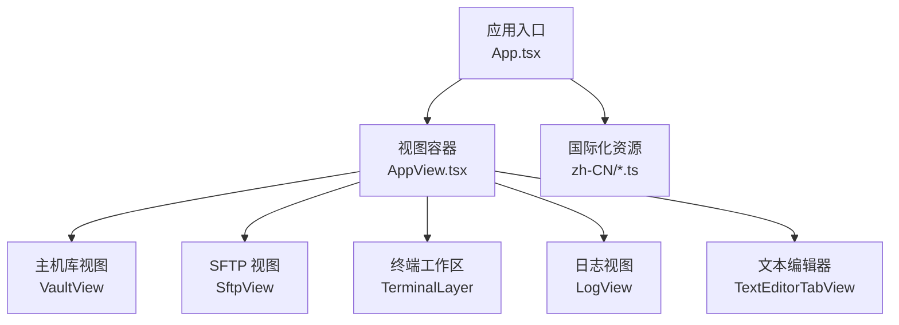
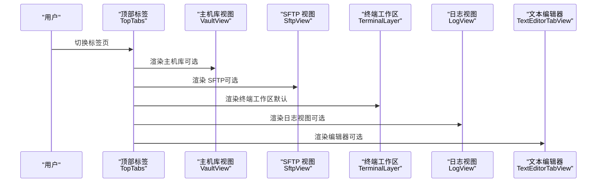
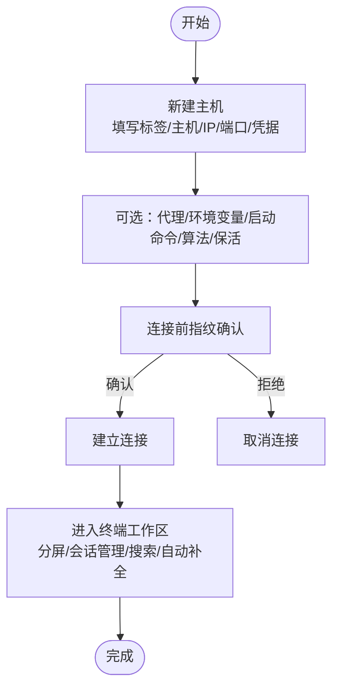
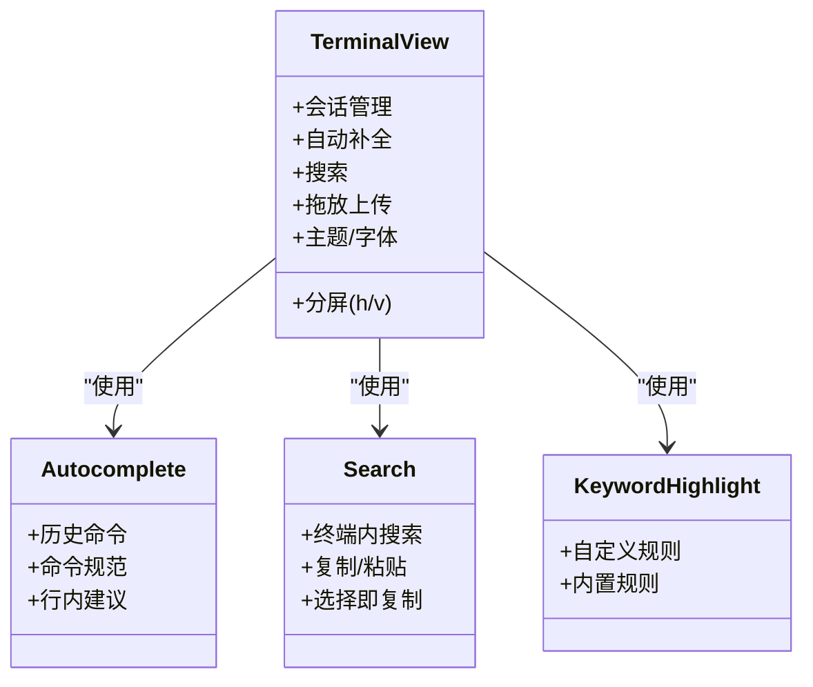
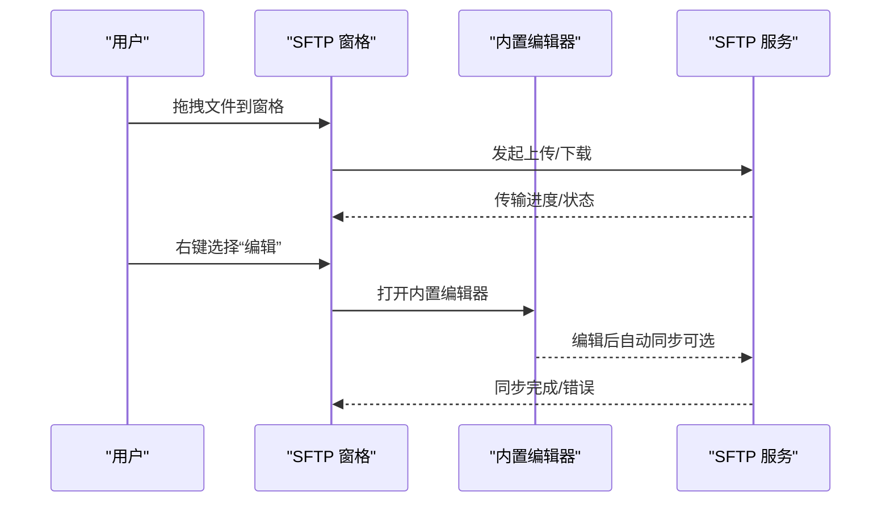
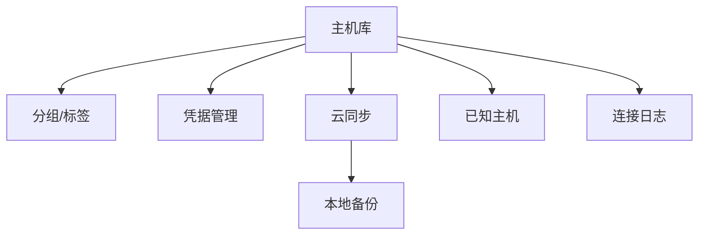
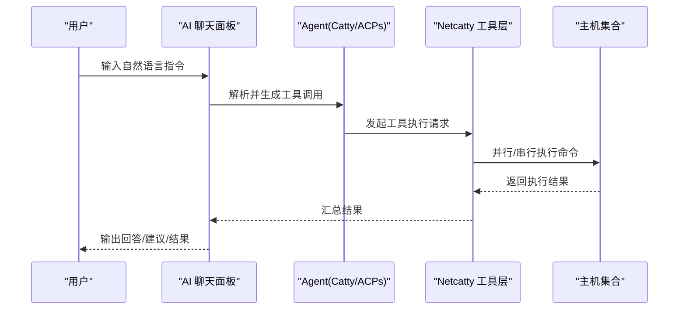
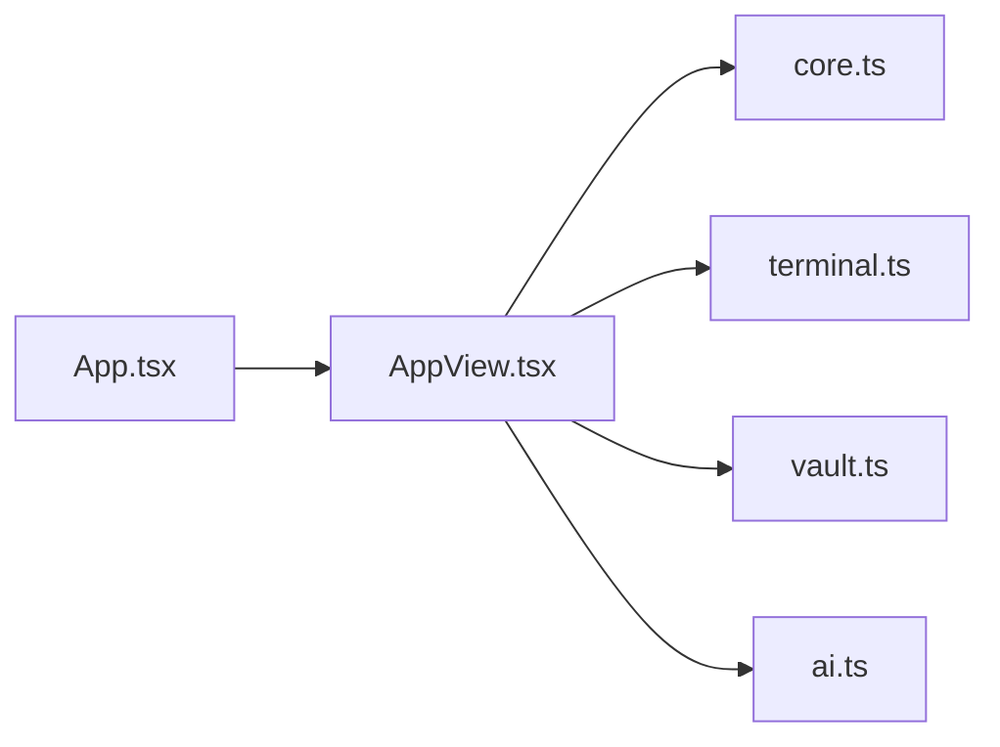

# 用户指南

<cite>
**本文引用的文件**
- [README.md](file://README.md)
- [App.tsx](file://App.tsx)
- [application/app/AppView.tsx](file://application/app/AppView.tsx)
- [application/i18n/locales/zh-CN/core.ts](file://application/i18n/locales/zh-CN/core.ts)
- [application/i18n/locales/zh-CN/terminal.ts](file://application/i18n/locales/zh-CN/terminal.ts)
- [application/i18n/locales/zh-CN/vault.ts](file://application/i18n/locales/zh-CN/vault.ts)
- [application/i18n/locales/zh-CN/ai.ts](file://application/i18n/locales/zh-CN/ai.ts)
</cite>

## 目录
1. [简介](#简介)
2. [项目结构](#项目结构)
3. [核心组件](#核心组件)
4. [架构总览](#架构总览)
5. [详细组件分析](#详细组件分析)
6. [依赖关系分析](#依赖关系分析)
7. [性能考虑](#性能考虑)
8. [故障排除指南](#故障排除指南)
9. [结论](#结论)
10. [附录](#附录)

## 简介
Netcatty 是一款基于 Electron + React + xterm.js 的现代化 SSH 客户端与终端工作区，具备内置 AI 助手、SFTP 文件浏览器、终端分屏、主题定制、云同步与本地备份等功能。本文面向使用者，提供从主机管理到终端高级操作、SFTP 文件传输、保管库组织策略，以及 AI 代理自然语言交互与多主机操作的完整使用指南。

## 项目结构
- 应用入口与状态管理：应用主入口负责初始化字体、主题、会话与同步状态，桥接主进程与渲染进程。
- 视图层：顶部标签、主机库、SFTP 视图、终端工作区、日志视图、文本编辑器等。
- 国际化：按模块划分的语言资源，覆盖核心、终端、保管库、AI 等领域。
- 功能模块：SSH/Telnet/Mosh/Serial 连接、SFTP 文件操作、AI 对话与工具接入、端口转发、云同步与本地备份。

图表来源
- [App.tsx:1-120](file://App.tsx#L1-L120)
- [application/app/AppView.tsx:130-300](file://application/app/AppView.tsx#L130-L300)

章节来源
- [App.tsx:1-120](file://App.tsx#L1-L120)
- [application/app/AppView.tsx:130-300](file://application/app/AppView.tsx#L130-L300)

## 核心组件
- 主机库（Vault）：主机、分组、代理、端口转发、代码片段、已知主机、连接日志等的统一管理入口。
- 终端工作区：分屏、会话管理、主题与字体、自动补全、搜索、拖放上传、广播模式等。
- SFTP 文件浏览器：双窗格、树形/列表视图、拖放上传下载、文件关联与内置编辑器、自动同步。
- 保管库（Vault）：主机分组、标签管理、凭据安全存储、云同步与本地备份。
- AI 代理：内置 Catty Agent 与外部 ACP Agent（Codex、Claude Code、Copilot CLI），自然语言交互与多主机操作。
- 端口转发：本地/远程/动态转发规则的可视化配置与生命周期管理。

章节来源
- [application/i18n/locales/zh-CN/core.ts:179-420](file://application/i18n/locales/zh-CN/core.ts#L179-L420)
- [application/i18n/locales/zh-CN/terminal.ts:127-277](file://application/i18n/locales/zh-CN/terminal.ts#L127-L277)
- [application/i18n/locales/zh-CN/vault.ts:120-260](file://application/i18n/locales/zh-CN/vault.ts#L120-L260)
- [application/i18n/locales/zh-CN/ai.ts:102-179](file://application/i18n/locales/zh-CN/ai.ts#L102-L179)

## 架构总览
应用采用“视图容器 + 多功能面板”的布局：顶部标签切换不同视图，中间区域按需渲染主机库、SFTP、终端工作区、日志与编辑器。状态通过 hooks 与 store 管理，快捷键与热键事件在应用层统一调度，全局模态（键盘交互认证、密钥口令）在顶层统一呈现。

图表来源
- [application/app/AppView.tsx:104-302](file://application/app/AppView.tsx#L104-L302)

章节来源
- [application/app/AppView.tsx:104-302](file://application/app/AppView.tsx#L104-L302)

## 详细组件分析

### SSH 客户端管理（从主机添加到连接建立）
- 新建主机
  - 在主机库中新建主机，填写标签、主机名/IP、端口、用户名等基础信息。
  - 可配置凭据（密码/密钥/证书）、代理、环境变量、启动命令、设备类型、SSH 算法、会话保活等。
- 连接前验证
  - 首次连接或指纹变化时，系统会弹出主机指纹确认对话，确认后加入已知主机记录。
- 连接建立
  - 选择协议（SSH/Telnet/Mosh/Serial），支持键盘交互认证与密钥口令自动处理。
  - 连接成功后进入终端工作区，支持分屏、会话重命名、复制/粘贴、搜索、自动补全等。
- 会话管理
  - 支持在同一工作区内多会话分屏，焦点切换、广播模式、会话日志导出与自动保存。

图表来源
- [application/i18n/locales/zh-CN/vault.ts:24-155](file://application/i18n/locales/zh-CN/vault.ts#L24-L155)
- [application/i18n/locales/zh-CN/terminal.ts:277-332](file://application/i18n/locales/zh-CN/terminal.ts#L277-L332)

章节来源
- [application/i18n/locales/zh-CN/vault.ts:24-155](file://application/i18n/locales/zh-CN/vault.ts#L24-L155)
- [application/i18n/locales/zh-CN/terminal.ts:277-332](file://application/i18n/locales/zh-CN/terminal.ts#L277-L332)

### 终端功能高级使用技巧
- 分屏与会话管理
  - 支持水平/垂直分屏，焦点在分屏间移动，会话重命名、复制、关闭、广播模式。
- 自动补全与行内建议
  - 历史命令与命令规范驱动的自动补全，行内建议增强输入体验。
- 搜索与关键字高亮
  - 终端内搜索、复制/粘贴、选择即复制、中键粘贴、括号粘贴模式、清空回滚历史等行为可配置。
  - 关键字高亮支持自定义规则与内置规则，便于快速定位错误、警告等。
- 拖放上传
  - 将本地文件拖入已连接的终端，自动触发 SFTP 上传；未连接时提示无法拖放。
- 主题与字体
  - 支持跟随应用主题、自定义主题、字体家族与大小、字重、行间距、光标样式与闪烁等。

图表来源
- [application/i18n/locales/zh-CN/terminal.ts:284-332](file://application/i18n/locales/zh-CN/terminal.ts#L284-L332)
- [application/i18n/locales/zh-CN/terminal.ts:127-277](file://application/i18n/locales/zh-CN/terminal.ts#L127-L277)

章节来源
- [application/i18n/locales/zh-CN/terminal.ts:127-277](file://application/i18n/locales/zh-CN/terminal.ts#L127-L277)
- [application/i18n/locales/zh-CN/terminal.ts:284-332](file://application/i18n/locales/zh-CN/terminal.ts#L284-L332)

### SFTP 文件传输工作流程
- 文件浏览器
  - 双窗格（本地/远端）与树形/列表视图，支持路径导航、刷新、筛选、新建文件/文件夹。
- 拖放上传/下载
  - 将文件拖入任一侧窗格，自动触发上传/下载；支持批量与文件夹压缩传输。
- 文件关联与内置编辑器
  - 默认打开方式（内置编辑器/系统应用），按扩展名配置文件关联；编辑后可自动同步回远程（可配置）。
- 冲突处理
  - 目标存在同名文件时，提供覆盖、跳过、保留两者、创建副本、合并等策略。
- 传输队列与进度
  - 传输任务排队、进度展示、重试与移除；支持压缩传输与解压阶段提示。

图表来源
- [application/i18n/locales/zh-CN/terminal.ts:40-126](file://application/i18n/locales/zh-CN/terminal.ts#L40-L126)
- [application/i18n/locales/zh-CN/terminal.ts:127-277](file://application/i18n/locales/zh-CN/terminal.ts#L127-L277)

章节来源
- [application/i18n/locales/zh-CN/terminal.ts:40-126](file://application/i18n/locales/zh-CN/terminal.ts#L40-L126)
- [application/i18n/locales/zh-CN/terminal.ts:127-277](file://application/i18n/locales/zh-CN/terminal.ts#L127-L277)

### 保管库管理组织策略
- 主机分组与标签
  - 通过分组与标签对主机进行逻辑归类，支持父子分组、托管同步（与 SSH config 文件双向同步）。
- 凭据安全存储
  - 支持密码、密钥、证书与本地密钥文件；凭据保护不可用时，连接前需重新输入并保存。
- 云同步与本地备份
  - 采用端到端加密，支持 WebDAV/S3/SMB 等云服务；自动在版本变化与恢复前创建本地备份，支持恢复与冲突处理。
- 已知主机与连接日志
  - 可导入系统 known_hosts，查看连接历史与收藏，支持自动保存与导出。

图表来源
- [application/i18n/locales/zh-CN/vault.ts:324-530](file://application/i18n/locales/zh-CN/vault.ts#L324-L530)
- [application/i18n/locales/zh-CN/core.ts:253-318](file://application/i18n/locales/zh-CN/core.ts#L253-L318)

章节来源
- [application/i18n/locales/zh-CN/vault.ts:324-530](file://application/i18n/locales/zh-CN/vault.ts#L324-L530)
- [application/i18n/locales/zh-CN/core.ts:253-318](file://application/i18n/locales/zh-CN/core.ts#L253-L318)

### AI 代理集成：自然语言交互与多主机操作
- 提供商与 Agent
  - 支持多种 AI 提供商（Anthropic/OpenAI/Google 兼容），可配置 API Key、Base URL、默认模型与高级参数。
  - 内置 Catty Agent 与外部 ACP Agent（Codex、Claude Code、Copilot CLI），支持 MCP 与 Skills + CLI 两种接入模式。
- 安全与权限
  - 权限模式：观察者（只读）、确认（操作前询问）、自主（自由执行）；命令超时、最大迭代次数、命令黑名单等安全策略。
- 自然语言交互
  - 支持引用上下文（@ 主机）、命令（/）与文件/图片附件；会话历史可查看与导出。
- 多主机操作
  - 在同一对话中对多台主机执行相同或差异化命令，结合工具审批与权限控制，保障安全可控。

图表来源
- [application/i18n/locales/zh-CN/ai.ts:102-179](file://application/i18n/locales/zh-CN/ai.ts#L102-L179)
- [application/i18n/locales/zh-CN/ai.ts:198-247](file://application/i18n/locales/zh-CN/ai.ts#L198-L247)

章节来源
- [application/i18n/locales/zh-CN/ai.ts:102-179](file://application/i18n/locales/zh-CN/ai.ts#L102-L179)
- [application/i18n/locales/zh-CN/ai.ts:198-247](file://application/i18n/locales/zh-CN/ai.ts#L198-L247)

## 依赖关系分析
- 应用层依赖：App.tsx 负责应用启动、状态初始化、热键与全局事件处理；AppView.tsx 负责视图容器与全局模态。
- 国际化：按模块加载 zh-CN 语言资源，覆盖核心、终端、保管库、AI 等领域。
- 功能模块：主机库、SFTP、终端、AI、云同步等模块通过统一的视图容器进行编排与切换。

图表来源
- [App.tsx:78-120](file://App.tsx#L78-L120)
- [application/app/AppView.tsx:32-55](file://application/app/AppView.tsx#L32-L55)

章节来源
- [App.tsx:78-120](file://App.tsx#L78-L120)
- [application/app/AppView.tsx:32-55](file://application/app/AppView.tsx#L32-L55)

## 性能考虑
- 终端渲染：自动模式在低内存设备上使用 DOM 渲染，新终端会话生效；合理设置回滚行数与平滑滚动可平衡性能与体验。
- SFTP 传输：文件夹压缩传输可显著降低带宽占用，但需服务器支持 tar；并发数可配置以适配不同网络环境。
- 云同步：端到端加密与本地备份在安全性与性能间取得平衡，建议定期清理本地备份并选择合适的云服务端点。

## 故障排除指南
- 凭据保护不可用
  - 当前设备无法自动解密已保存的密码与密钥，连接前需重新输入并保存。
- 云同步冲突
  - 检测到版本冲突时，可选择保留本地或云端版本；必要时使用本地备份恢复。
- SFTP 重连失败
  - 连接断开时会提示重连，若失败需手动重新连接；检查网络与服务器状态。
- AI 工具审批超时
  - 工具调用审批超时（默认 5 分钟）后可重新发送消息重试。

章节来源
- [application/i18n/locales/zh-CN/core.ts:57-60](file://application/i18n/locales/zh-CN/core.ts#L57-L60)
- [application/i18n/locales/zh-CN/core.ts:286-294](file://application/i18n/locales/zh-CN/core.ts#L286-L294)
- [application/i18n/locales/zh-CN/terminal.ts:106-114](file://application/i18n/locales/zh-CN/terminal.ts#L106-L114)
- [application/i18n/locales/zh-CN/ai.ts:172-173](file://application/i18n/locales/zh-CN/ai.ts#L172-L173)

## 结论
Netcatty 提供了从主机管理、终端分屏、SFTP 文件传输到 AI 代理的完整工作流。通过合理的保管库组织、安全的凭据存储与云同步机制，以及强大的终端与文件操作能力，能够显著提升多主机运维效率与协作体验。建议结合自身团队的运维规范，配置合适的主题、快捷键、SFTP 行为与 AI 安全策略，形成标准化的使用流程。

## 附录
- 快捷键与设置
  - 快捷键方案（Mac/PC）、自定义快捷键、终端行为（右键、粘贴、滚动、链接修饰键等）、SFTP 行为（双击行为、自动同步、默认视图模式、隐藏文件、压缩传输）等均可在设置中调整。
- 实际使用场景与案例研究
  - 单主机健康检查：通过 AI 代理自然语言查询服务器状态、日志与资源使用，快速定位问题。
  - 多主机集群部署：在一次对话中协调多台服务器执行初始化、令牌交换与节点加入，实现一键化集群搭建。
  - 文件快速编辑与同步：在 SFTP 中直接编辑远程文件并通过内置编辑器自动同步，减少往返操作。

章节来源
- [application/i18n/locales/zh-CN/terminal.ts:293-341](file://application/i18n/locales/zh-CN/terminal.ts#L293-L341)
- [application/i18n/locales/zh-CN/ai.ts:123-179](file://application/i18n/locales/zh-CN/ai.ts#L123-L179)
- [README.md:48-86](file://README.md#L48-L86)