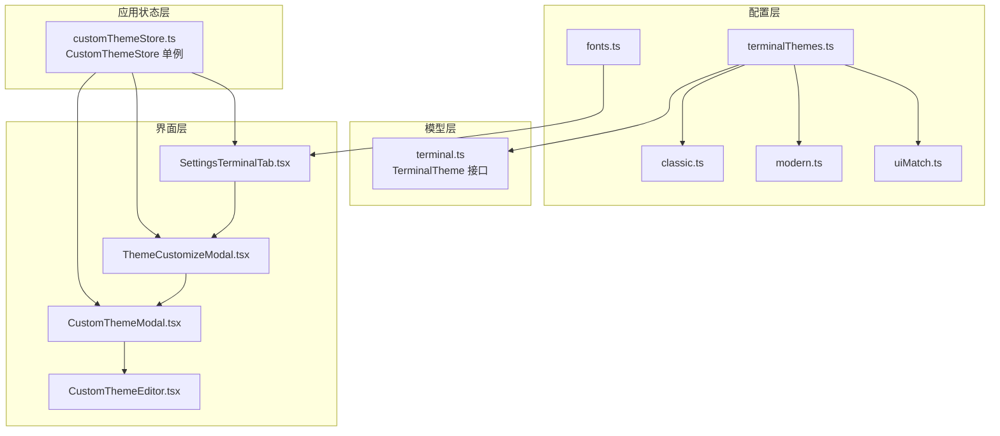
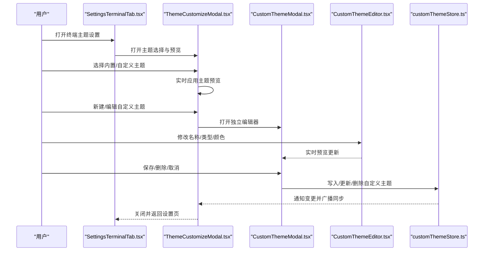
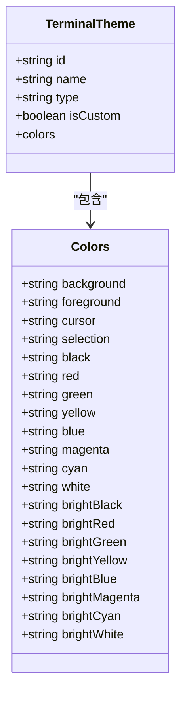
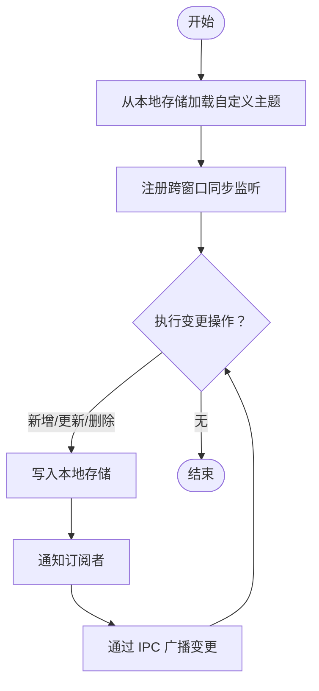
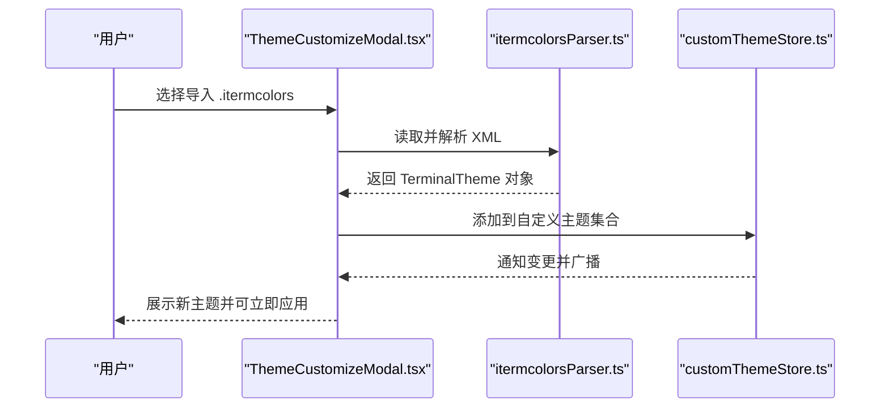
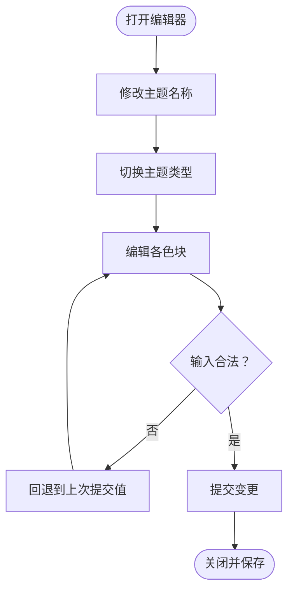
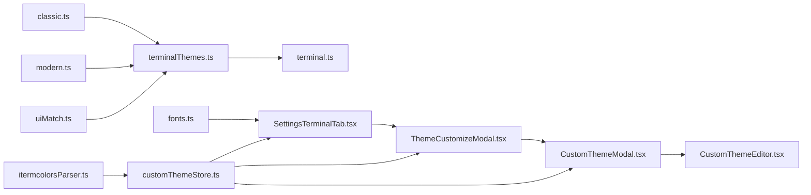

# 主题定制系统

<cite>
**本文引用的文件**
- [terminalThemes.ts](file://infrastructure/config/terminalThemes.ts)
- [classic.ts](file://infrastructure/config/terminalThemes/classic.ts)
- [modern.ts](file://infrastructure/config/terminalThemes/modern.ts)
- [uiMatch.ts](file://infrastructure/config/terminalThemes/uiMatch.ts)
- [fonts.ts](file://infrastructure/config/fonts.ts)
- [itermcolorsParser.ts](file://infrastructure/parsers/itermcolorsParser.ts)
- [terminal.ts](file://domain/models/terminal.ts)
- [customThemeStore.ts](file://application/state/customThemeStore.ts)
- [CustomThemeEditor.tsx](file://components/terminal/CustomThemeEditor.tsx)
- [CustomThemeModal.tsx](file://components/terminal/CustomThemeModal.tsx)
- [ThemeCustomizeModal.tsx](file://components/terminal/ThemeCustomizeModal.tsx)
- [SettingsTerminalTab.tsx](file://components/settings/tabs/SettingsTerminalTab.tsx)
- [SettingsTerminalTabControls.tsx](file://components/settings/tabs/SettingsTerminalTabControls.tsx)
</cite>

## 目录
1. [简介](#简介)
2. [项目结构](#项目结构)
3. [核心组件](#核心组件)
4. [架构总览](#架构总览)
5. [详细组件分析](#详细组件分析)
6. [依赖关系分析](#依赖关系分析)
7. [性能考量](#性能考量)
8. [故障排查指南](#故障排查指南)
9. [结论](#结论)
10. [附录](#附录)

## 简介
本技术文档围绕终端主题定制系统进行系统化梳理，覆盖主题定义格式、颜色方案管理、字体配置体系、内置主题特性与适用场景、自定义主题创建流程、主题预览与实时编辑、参数校验与持久化策略，以及可访问性与跨平台兼容等最佳实践。目标是帮助开发者与产品人员快速理解并高效扩展主题系统。

## 项目结构
主题系统由“配置层（内置主题与字体）—模型层（主题与设置数据结构）—应用状态层（自定义主题存储与同步）—界面层（主题选择、自定义编辑与预览）”四层协同构成：

- 配置层：集中定义内置主题与字体集合，并提供过滤与可见性控制逻辑
- 模型层：统一的主题与设置数据结构，确保前后端一致的数据契约
- 应用状态层：自定义主题的本地存储、跨窗口同步与变更通知
- 界面层：主题选择模态、自定义主题编辑器、实时预览与保存

图表来源
- [terminalThemes.ts:1-43](file://infrastructure/config/terminalThemes.ts#L1-L43)
- [classic.ts:1-653](file://infrastructure/config/terminalThemes/classic.ts#L1-L653)
- [modern.ts:1-513](file://infrastructure/config/terminalThemes/modern.ts#L1-L513)
- [uiMatch.ts:1-61](file://infrastructure/config/terminalThemes/uiMatch.ts#L1-L61)
- [fonts.ts:1-103](file://infrastructure/config/fonts.ts#L1-L103)
- [terminal.ts:287-314](file://domain/models/terminal.ts#L287-L314)
- [customThemeStore.ts:22-138](file://application/state/customThemeStore.ts#L22-L138)
- [SettingsTerminalTab.tsx:1-975](file://components/settings/tabs/SettingsTerminalTab.tsx#L1-L975)
- [ThemeCustomizeModal.tsx:1-815](file://components/terminal/ThemeCustomizeModal.tsx#L1-L815)
- [CustomThemeModal.tsx:1-231](file://components/terminal/CustomThemeModal.tsx#L1-L231)
- [CustomThemeEditor.tsx:1-188](file://components/terminal/CustomThemeEditor.tsx#L1-L188)

章节来源
- [terminalThemes.ts:1-43](file://infrastructure/config/terminalThemes.ts#L1-L43)
- [fonts.ts:1-103](file://infrastructure/config/fonts.ts#L1-L103)
- [terminal.ts:287-314](file://domain/models/terminal.ts#L287-L314)
- [customThemeStore.ts:22-138](file://application/state/customThemeStore.ts#L22-L138)
- [SettingsTerminalTab.tsx:1-975](file://components/settings/tabs/SettingsTerminalTab.tsx#L1-L975)
- [ThemeCustomizeModal.tsx:1-815](file://components/terminal/ThemeCustomizeModal.tsx#L1-L815)
- [CustomThemeModal.tsx:1-231](file://components/terminal/CustomThemeModal.tsx#L1-L231)
- [CustomThemeEditor.tsx:1-188](file://components/terminal/CustomThemeEditor.tsx#L1-L188)

## 核心组件
- 主题配置聚合：将核心、UI匹配、现代、经典与额外主题合并，并提供 UI 可见性过滤与 UI 匹配主题识别
- 自定义主题存储：基于 useSyncExternalStore 的单例 Store，负责自定义主题的增删改查、本地持久化与跨窗口同步
- 主题选择与预览：支持内置与自定义主题列表展示、实时预览、字体与字号联动、.itermcolors 导入
- 自定义主题编辑器：提供名称、类型切换、颜色分组（通用/常规/高亮）的可视化编辑与输入校验
- 字体配置：提供多款专业等宽字体，支持中西文混排的组合策略与字号范围控制
- 解析器：.itermcolors 到 TerminalTheme 的解析与默认色板填充、明暗类型推断

章节来源
- [terminalThemes.ts:28-42](file://infrastructure/config/terminalThemes.ts#L28-L42)
- [customThemeStore.ts:22-138](file://application/state/customThemeStore.ts#L22-L138)
- [ThemeCustomizeModal.tsx:277-522](file://components/terminal/ThemeCustomizeModal.tsx#L277-L522)
- [CustomThemeEditor.tsx:109-187](file://components/terminal/CustomThemeEditor.tsx#L109-L187)
- [fonts.ts:18-62](file://infrastructure/config/fonts.ts#L18-L62)
- [itermcolorsParser.ts:99-173](file://infrastructure/parsers/itermcolorsParser.ts#L99-L173)

## 架构总览
主题系统采用“配置聚合 + 数据模型 + 状态管理 + 视图交互”的分层架构，通过统一的 TerminalTheme 接口保证主题数据一致性；自定义主题通过本地存储与跨窗口 IPC 同步，确保多窗口体验一致；界面层提供左右分栏或双列布局的编辑与预览体验。

图表来源
- [SettingsTerminalTab.tsx:306-451](file://components/settings/tabs/SettingsTerminalTab.tsx#L306-L451)
- [ThemeCustomizeModal.tsx:277-522](file://components/terminal/ThemeCustomizeModal.tsx#L277-L522)
- [CustomThemeModal.tsx:92-143](file://components/terminal/CustomThemeModal.tsx#L92-L143)
- [CustomThemeEditor.tsx:109-187](file://components/terminal/CustomThemeEditor.tsx#L109-L187)
- [customThemeStore.ts:109-137](file://application/state/customThemeStore.ts#L109-L137)

## 详细组件分析

### 组件一：主题配置聚合与内置主题
- 聚合策略：将核心、UI 匹配、现代、经典与额外主题合并为统一数组，同时维护 UI 匹配主题 ID 集合与可见性过滤
- UI 匹配主题：背景色与应用 UI 主题相匹配，ANSI 调色板基于轻/深 UI 预设，强调无缝融合
- 经典主题：涵盖多种风格（如 Romania、Tokyo、Material、Gruvbox 等），适合复古与经典偏好
- 现代主题：包含 VS Code、Graphite、Obsidian、Rose Pine 等现代风格，强调对比与辨识度

图表来源
- [terminal.ts:287-314](file://domain/models/terminal.ts#L287-L314)
- [terminalThemes.ts:28-42](file://infrastructure/config/terminalThemes.ts#L28-L42)
- [uiMatch.ts:10-60](file://infrastructure/config/terminalThemes/uiMatch.ts#L10-L60)
- [classic.ts:3-652](file://infrastructure/config/terminalThemes/classic.ts#L3-L652)
- [modern.ts:3-512](file://infrastructure/config/terminalThemes/modern.ts#L3-L512)

章节来源
- [terminalThemes.ts:11-42](file://infrastructure/config/terminalThemes.ts#L11-L42)
- [uiMatch.ts:1-61](file://infrastructure/config/terminalThemes/uiMatch.ts#L1-L61)
- [classic.ts:1-653](file://infrastructure/config/terminalThemes/classic.ts#L1-L653)
- [modern.ts:1-513](file://infrastructure/config/terminalThemes/modern.ts#L1-L513)

### 组件二：自定义主题存储与同步
- 设计要点：使用 useSyncExternalStore 模式，提供稳定的快照引用；本地持久化采用 localStorage；跨窗口通过 Electron IPC 广播变更
- 变更操作：新增、更新、删除、批量替换；每次变更均触发通知与广播
- 安全性：异常捕获与容错处理，避免损坏数据影响应用启动

图表来源
- [customThemeStore.ts:28-83](file://application/state/customThemeStore.ts#L28-L83)
- [customThemeStore.ts:109-137](file://application/state/customThemeStore.ts#L109-L137)

章节来源
- [customThemeStore.ts:22-138](file://application/state/customThemeStore.ts#L22-L138)

### 组件三：主题选择与实时预览
- 左右分栏设计：左侧主题列表，右侧大尺寸预览，支持内置与自定义主题混合展示
- 实时应用：选中主题即刻应用到预览区域，ESC 或点击空白处可取消
- 字体与字号：在字体标签页内提供字号微调，联动预览显示
- .itermcolors 导入：解析 XML 并生成自定义主题，自动填充缺失 ANSI 色彩

图表来源
- [ThemeCustomizeModal.tsx:403-432](file://components/terminal/ThemeCustomizeModal.tsx#L403-L432)
- [itermcolorsParser.ts:99-173](file://infrastructure/parsers/itermcolorsParser.ts#L99-L173)
- [customThemeStore.ts:109-114](file://application/state/customThemeStore.ts#L109-L114)

章节来源
- [ThemeCustomizeModal.tsx:277-522](file://components/terminal/ThemeCustomizeModal.tsx#L277-L522)
- [itermcolorsParser.ts:99-173](file://infrastructure/parsers/itermcolorsParser.ts#L99-L173)

### 组件四：自定义主题编辑器
- 颜色字段分组：通用（背景/前景/光标/选择）、常规（黑红绿黄蓝洋红青白）、高亮（同上）
- 输入校验：十六进制颜色输入支持文本与拾色器，仅在完整合法时提交；支持 #rgb 与 #rrggbb 归一化
- 类型切换：一键在深色/浅色之间切换，便于对比与适配
- 名称与类型：支持主题命名与类型标注，便于分类与检索

图表来源
- [CustomThemeEditor.tsx:117-130](file://components/terminal/CustomThemeEditor.tsx#L117-L130)
- [CustomThemeEditor.tsx:56-76](file://components/terminal/CustomThemeEditor.tsx#L56-L76)

章节来源
- [CustomThemeEditor.tsx:109-187](file://components/terminal/CustomThemeEditor.tsx#L109-L187)

### 组件五：字体配置系统
- 字体集合：包含多款专业等宽字体，覆盖主流操作系统与编程场景
- 中西文混排：通过组合策略实现拉丁与 CJK 字形的协调显示
- 字号范围：提供最小/最大/默认字号，支持递增递减微调
- 兼容性：对已弃用的非等宽字体 ID 进行迁移与降级处理

章节来源
- [fonts.ts:18-103](file://infrastructure/config/fonts.ts#L18-L103)

### 组件六：可访问性与对比度
- 最小对比度：提供 1-21 的滑条配置，用于提升文本可读性
- 关键词高亮：支持多规则正则匹配与颜色自定义，内置常见规则集

章节来源
- [SettingsTerminalTab.tsx:620-643](file://components/settings/tabs/SettingsTerminalTab.tsx#L620-L643)
- [terminal.ts:145-206](file://domain/models/terminal.ts#L145-L206)

## 依赖关系分析
- 主题配置依赖于模型接口，确保主题对象结构稳定
- 自定义主题存储依赖于配置层提供的内置主题集合，以支持“克隆现有主题”等便捷流程
- 界面层通过设置页与主题模态双向依赖存储层，形成闭环的读写链路
- .itermcolors 解析器作为外部导入入口，解耦第三方格式与内部主题模型

图表来源
- [terminalThemes.ts:1-43](file://infrastructure/config/terminalThemes.ts#L1-L43)
- [classic.ts:1-653](file://infrastructure/config/terminalThemes/classic.ts#L1-L653)
- [modern.ts:1-513](file://infrastructure/config/terminalThemes/modern.ts#L1-L513)
- [uiMatch.ts:1-61](file://infrastructure/config/terminalThemes/uiMatch.ts#L1-L61)
- [fonts.ts:1-103](file://infrastructure/config/fonts.ts#L1-L103)
- [terminal.ts:287-314](file://domain/models/terminal.ts#L287-L314)
- [SettingsTerminalTab.tsx:1-975](file://components/settings/tabs/SettingsTerminalTab.tsx#L1-L975)
- [ThemeCustomizeModal.tsx:1-815](file://components/terminal/ThemeCustomizeModal.tsx#L1-L815)
- [CustomThemeModal.tsx:1-231](file://components/terminal/CustomThemeModal.tsx#L1-L231)
- [CustomThemeEditor.tsx:1-188](file://components/terminal/CustomThemeEditor.tsx#L1-L188)
- [customThemeStore.ts:22-138](file://application/state/customThemeStore.ts#L22-L138)
- [itermcolorsParser.ts:99-173](file://infrastructure/parsers/itermcolorsParser.ts#L99-L173)

章节来源
- [terminalThemes.ts:1-43](file://infrastructure/config/terminalThemes.ts#L1-L43)
- [customThemeStore.ts:22-138](file://application/state/customThemeStore.ts#L22-L138)
- [ThemeCustomizeModal.tsx:277-522](file://components/terminal/ThemeCustomizeModal.tsx#L277-L522)

## 性能考量
- 渲染优化：主题项与字体项采用 memo 包装，减少不必要的重渲染
- 预览渲染：终端预览组件按需渲染，避免频繁重绘带来的抖动
- 存储与同步：本地持久化与跨窗口同步分离，降低主线程阻塞风险
- 字体加载：字体列表一次性加载，避免运行时动态请求导致的闪烁

## 故障排查指南
- 主题导入失败：检查 .itermcolors 文件是否为有效 XML，确认根节点与颜色字典结构完整
- 颜色输入异常：确保十六进制值为 #rgb 或 #rrggbb 格式，输入过程中允许部分值但仅在完整时提交
- 自定义主题未生效：确认已保存并处于当前会话中；若在多窗口，等待 IPC 同步完成
- 字号调节无效：检查最小/最大边界限制，确认未达到上下限

章节来源
- [itermcolorsParser.ts:99-173](file://infrastructure/parsers/itermcolorsParser.ts#L99-L173)
- [CustomThemeEditor.tsx:56-76](file://components/terminal/CustomThemeEditor.tsx#L56-L76)
- [ThemeCustomizeModal.tsx:378-385](file://components/terminal/ThemeCustomizeModal.tsx#L378-L385)
- [fonts.ts:64-66](file://infrastructure/config/fonts.ts#L64-L66)

## 结论
该主题定制系统以清晰的分层架构与完善的 UI 交互体验为核心，结合丰富的内置主题库、灵活的自定义编辑器与可靠的持久化与同步机制，既满足了个性化需求，又兼顾了可访问性与跨平台兼容性。通过本文档的指引，团队可以高效地扩展主题生态、优化用户体验并保持代码质量。

## 附录

### 内置主题类别与适用场景
- UI 匹配主题：强调与应用 UI 主题背景一致，适合追求整体视觉统一的用户
- 经典主题：面向复古与经典风格偏好，适合长期使用与怀旧情怀
- 现代主题：面向现代设计语言，强调对比度与辨识度，适合长时间编码与高密度信息展示

章节来源
- [uiMatch.ts:1-61](file://infrastructure/config/terminalThemes/uiMatch.ts#L1-L61)
- [classic.ts:1-653](file://infrastructure/config/terminalThemes/classic.ts#L1-L653)
- [modern.ts:1-513](file://infrastructure/config/terminalThemes/modern.ts#L1-L513)

### 自定义主题创建流程（步骤说明）
- 在主题选择模态中新建或编辑自定义主题
- 使用编辑器修改名称、类型与各色块
- 导入 .itermcolors 文件以快速生成主题
- 保存后即可在当前会话中应用并持久化

章节来源
- [ThemeCustomizeModal.tsx:389-401](file://components/terminal/ThemeCustomizeModal.tsx#L389-L401)
- [CustomThemeModal.tsx:92-143](file://components/terminal/CustomThemeModal.tsx#L92-L143)
- [CustomThemeEditor.tsx:109-187](file://components/terminal/CustomThemeEditor.tsx#L109-L187)
- [itermcolorsParser.ts:99-173](file://infrastructure/parsers/itermcolorsParser.ts#L99-L173)

### 主题参数验证与即时渲染
- 参数验证：颜色输入校验、字号范围约束、对比度滑条范围
- 即时渲染：选中主题与字体即刻应用到预览区域，编辑器实时反馈

章节来源
- [CustomThemeEditor.tsx:56-76](file://components/terminal/CustomThemeEditor.tsx#L56-L76)
- [ThemeCustomizeModal.tsx:366-385](file://components/terminal/ThemeCustomizeModal.tsx#L366-L385)
- [SettingsTerminalTab.tsx:620-643](file://components/settings/tabs/SettingsTerminalTab.tsx#L620-L643)

### 配置持久化与跨窗口同步
- 本地持久化：localStorage 写入与读取
- 跨窗口同步：Electron IPC 广播与监听，确保多窗口一致

章节来源
- [customThemeStore.ts:34-52](file://application/state/customThemeStore.ts#L34-L52)
- [customThemeStore.ts:60-83](file://application/state/customThemeStore.ts#L60-L83)