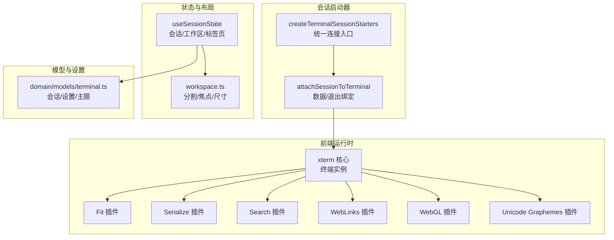
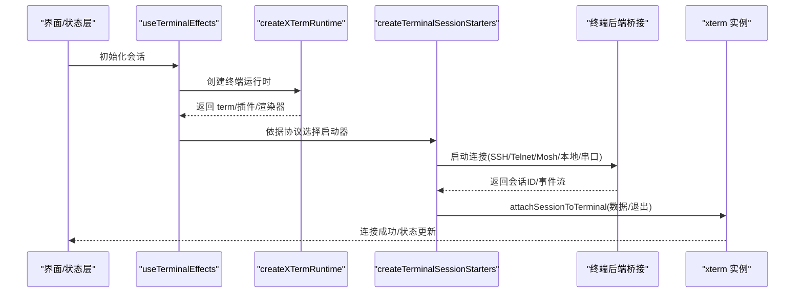
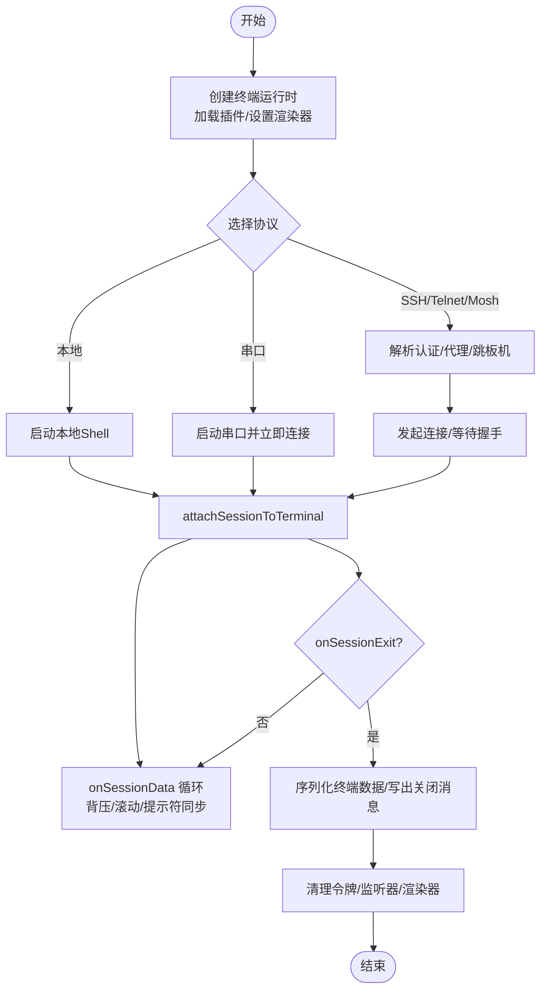
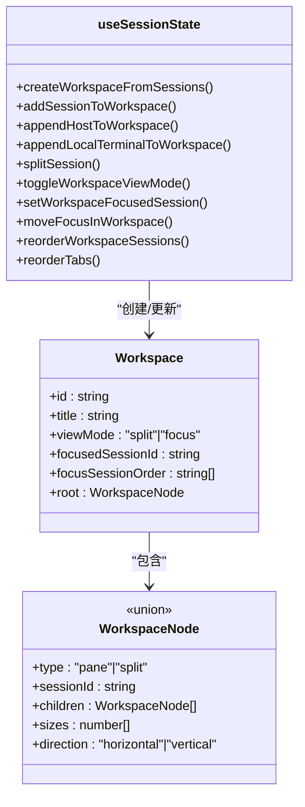
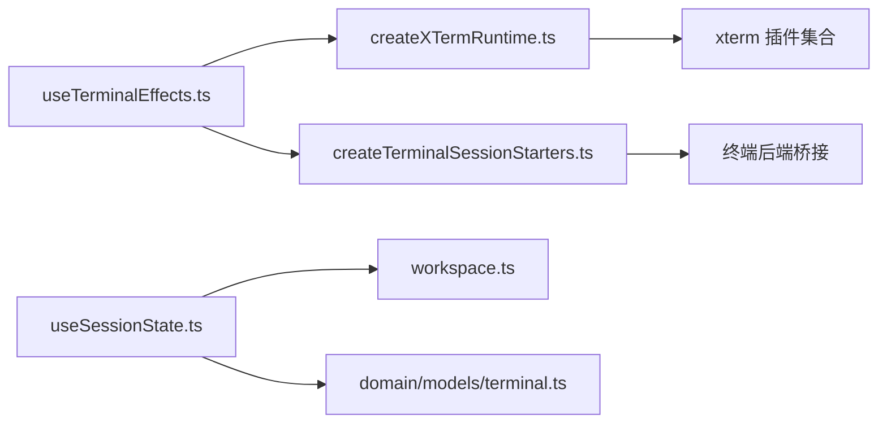

# 会话管理

<cite>
**本文引用的文件**
- [components/terminal/runtime/createTerminalSessionStarters.ts](file://components/terminal/runtime/createTerminalSessionStarters.ts)
- [components/terminal/runtime/terminalSessionAttachment.ts](file://components/terminal/runtime/terminalSessionAttachment.ts)
- [components/terminal/runtime/createXTermRuntime.ts](file://components/terminal/runtime/createXTermRuntime.ts)
- [components/terminal/useTerminalEffects.ts](file://components/terminal/useTerminalEffects.ts)
- [application/state/useSessionState.ts](file://application/state/useSessionState.ts)
- [domain/workspace.ts](file://domain/workspace.ts)
- [domain/models/terminal.ts](file://domain/models/terminal.ts)
- [components/terminal/runtime/terminalDistroDetection.ts](file://components/terminal/runtime/terminalDistroDetection.ts)
- [components/terminal/runtime/outputFlowController.ts](file://components/terminal/runtime/outputFlowController.ts)
- [components/terminal/runtime/terminalUserPaste.ts](file://components/terminal/runtime/terminalUserPaste.ts)
- [components/terminal/runtime/promptLineBreak.ts](file://components/terminal/runtime/promptLineBreak.ts)
- [components/terminal/runtime/terminalStartupCommands.ts](file://components/terminal/runtime/terminalStartupCommands.ts)
- [components/terminal/runtime/kittyKeyboardProtocol.ts](file://components/terminal/runtime/kittyKeyboardProtocol.ts)
- [components/terminal/runtime/rendererDprWatch.ts](file://components/terminal/runtime/rendererDprWatch.ts)
- [components/terminal/runtime/serialLineInput.ts](file://components/terminal/runtime/serialLineInput.ts)
- [components/terminal/runtime/terminalCommandExecution.ts](file://components/terminal/runtime/terminalCommandExecution.ts)
- [components/terminal/runtime/terminalAutocomplete.ts](file://components/terminal/runtime/terminalAutocomplete.ts)
- [components/terminal/runtime/terminalAutocompleteInput.ts](file://components/terminal/runtime/terminalAutocompleteInput.ts)
- [components/terminal/runtime/terminalAutocompleteLayout.ts](file://components/terminal/runtime/terminalAutocompleteLayout.ts)
- [components/terminal/runtime/terminalAutocompletePrompt.ts](file://components/terminal/runtime/terminalAutocompletePrompt.ts)
- [components/terminal/runtime/terminalAutocompleteKeyEvent.ts](file://components/terminal/runtime/terminalAutocompleteKeyEvent.ts)
- [components/terminal/runtime/terminalAutocomplete.test.ts](file://components/terminal/runtime/terminalAutocomplete.test.ts)
- [components/terminal/runtime/terminalAutocompleteLayout.test.ts](file://components/terminal/runtime/terminalAutocompleteLayout.test.ts)
- [components/terminal/runtime/terminalAutocompletePrompt.test.ts](file://components/terminal/runtime/terminalAutocompletePrompt.test.ts)
- [components/terminal/runtime/terminalAutocompleteKeyEvent.test.ts](file://components/terminal/runtime/terminalAutocompleteKeyEvent.test.ts)
- [components/terminal/runtime/terminalAutocompleteInput.test.ts](file://components/terminal/runtime/terminalAutocompleteInput.test.ts)
- [components/terminal/runtime/terminalAutocomplete.ts](file://components/terminal/runtime/terminalAutocomplete.ts)
- [components/terminal/runtime/terminalAutocomplete.ts](file://components/terminal/runtime/terminalAutocomplete.ts)
- [components/terminal/runtime/terminalAutocomplete.ts](file://components/terminal/runtime/terminalAutocomplete.ts)
- [components/terminal/runtime/terminalAutocomplete.ts](file://components/terminal/runtime/terminalAutocomplete.ts)
- [components/terminal/runtime/terminalAutocomplete.ts](file://components/terminal/runtime/terminalAutocomplete.ts)
- [components/terminal/runtime/terminalAutocomplete.ts](file://components/terminal/runtime/terminalAutocomplete.ts)
- [components/terminal/runtime/terminalAutocomplete.ts](file://components/terminal/runtime/terminalAutocomplete.ts)
- [components/terminal/runtime/terminalAutocomplete.ts](file://components/terminal/runtime/terminalAutocomplete.ts)
- [components/terminal/runtime/terminalAutocomplete.ts](file://components/terminal/runtime/terminalAutocomplete.ts)
- [components/terminal/runtime/terminalAutocomplete.ts](file://components/terminal/runtime/terminalAutocomplete.ts)
- [components/terminal/runtime/terminalAutocomplete.ts](file://components/terminal/runtime/terminalAutocomplete.ts)
- [components/terminal/runtime/terminalAutocomplete.ts](file://components/terminal/runtime/terminalAutocomplete.ts)
- [components/terminal/runtime/terminalAutocomplete.ts](file://components/terminal/runtime/terminalAutocomplete.ts)
- [components/terminal/runtime/terminalAutocomplete.ts](file://components/terminal/runtime/terminalAutocomplete.ts)
- [components/terminal/runtime/terminalAutocomplete.ts](file://components/terminal/runtime/terminalAutocomplete.ts)
- [components/terminal/runtime/terminalAutocomplete.ts](file://components/terminal/runtime/terminalAutocomplete.ts)
- [components/terminal/runtime/terminalAutocomplete.ts](file://components/terminal/runtime/terminalAutocomplete.ts)
- [components/terminal/runtime/terminalAutocomplete.ts](file://components/terminal/runtime/terminalAutocomplete.ts)
- [components/terminal/runtime/terminalAutocomplete.ts](file://components/terminal/runtime/terminalAutocomplete.ts)
- [components/terminal/runtime/terminalAutocomplete.ts](file://components/terminal/runtime/terminalAutocomplete.ts)
- [components/terminal/runtime/terminalAutocomplete.ts](file://components/terminal/runtime/terminalAutocomplete.ts)
- [components/terminal/runtime/terminalAutocomplete.ts](file://components/......)
</cite>

## 目录
1. [简介](#简介)
2. [项目结构](#项目结构)
3. [核心组件](#核心组件)
4. [架构总览](#架构总览)
5. [详细组件分析](#详细组件分析)
6. [依赖关系分析](#依赖关系分析)
7. [性能考量](#性能考量)
8. [故障排除指南](#故障排除指南)
9. [结论](#结论)
10. [附录](#附录)

## 简介
本文件面向终端会话管理功能，系统性阐述会话生命周期（创建、连接、状态监控、资源清理）、多会话布局与分割（水平/垂直分割、标签页、工作区视图模式）、会话状态持久化与恢复（日志捕获、断线重连、状态同步）、性能优化（内存与渲染、网络传输）以及安全机制（会话隔离、权限控制、数据保护）。文档以代码级分析为基础，辅以可视化图示，帮助开发者与运维人员快速理解并高效使用该能力。

## 项目结构
终端会话管理由“前端运行时”“会话启动器”“状态与布局”“模型与设置”四层协同构成：
- 前端运行时：负责 xterm 实例创建、渲染器选择、事件处理、粘贴与键盘协议、自动补全、输出背压等。
- 会话启动器：封装 SSH/Telnet/Mosh/本地/串口五类连接的启动逻辑，统一接入后端桥接层。
- 状态与布局：维护会话列表、工作区树形结构、分割尺寸、焦点顺序、广播模式、标签页顺序等。
- 模型与设置：定义会话数据结构、终端设置、主题、关键字高亮规则等。

图表来源
- [components/terminal/runtime/createXTermRuntime.ts:195-475](file://components/terminal/runtime/createXTermRuntime.ts#L195-L475)
- [components/terminal/runtime/createTerminalSessionStarters.ts:32-873](file://components/terminal/runtime/createTerminalSessionStarters.ts#L32-L873)
- [components/terminal/runtime/terminalSessionAttachment.ts:180-249](file://components/terminal/runtime/terminalSessionAttachment.ts#L180-L249)
- [application/state/useSessionState.ts:22-990](file://application/state/useSessionState.ts#L22-L990)
- [domain/workspace.ts:1-489](file://domain/workspace.ts#L1-L489)
- [domain/models/terminal.ts:316-339](file://domain/models/terminal.ts#L316-L339)

章节来源
- [components/terminal/runtime/createXTermRuntime.ts:195-475](file://components/terminal/runtime/createXTermRuntime.ts#L195-L475)
- [components/terminal/runtime/createTerminalSessionStarters.ts:32-873](file://components/terminal/runtime/createTerminalSessionStarters.ts#L32-L873)
- [components/terminal/runtime/terminalSessionAttachment.ts:180-249](file://components/terminal/runtime/terminalSessionAttachment.ts#L180-L249)
- [application/state/useSessionState.ts:22-990](file://application/state/useSessionState.ts#L22-L990)
- [domain/workspace.ts:1-489](file://domain/workspace.ts#L1-L489)
- [domain/models/terminal.ts:316-339](file://domain/models/terminal.ts#L316-L339)

## 核心组件
- 终端运行时与渲染器
  - 创建 xterm 实例、加载插件（fit/serialize/search/web-links/webgl/unicode），按平台与设备内存自动选择渲染器类型，支持动态恢复与纹理图集清理。
  - 关键路径：[createXTermRuntime.ts:195-475](file://components/terminal/runtime/createXTermRuntime.ts#L195-L475)、[rendererDprWatch.ts](file://components/terminal/runtime/rendererDprWatch.ts)、[xtermPerformance.ts:136-172](file://infrastructure/config/xtermPerformance.ts#L136-L172)。
- 会话启动器
  - 统一处理 SSH/Telnet/Mosh/本地/串口连接，构建环境变量、代理/跳板机链路、认证回退、进度日志、启动命令调度、连接后探测与适配。
  - 关键路径：[createTerminalSessionStarters.ts:32-873](file://components/terminal/runtime/createTerminalSessionStarters.ts#L32-L873)、[terminalDistroDetection.ts:1-31](file://components/terminal/runtime/terminalDistroDetection.ts#L1-L31)、[terminalStartupCommands.ts](file://components/terminal/runtime/terminalStartupCommands.ts)。
- 会话附件与数据流
  - 将后端数据流写入终端，处理串口换行转换、输出背压、自动滚动、提示符换行同步、退出回调与日志捕获。
  - 关键路径：[terminalSessionAttachment.ts:180-249](file://components/terminal/runtime/terminalSessionAttachment.ts#L180-L249)、[outputFlowController.ts](file://components/terminal/runtime/outputFlowController.ts)。
- 会话生命周期与效果
  - 初始化运行时、字体/主题/滚动/粘贴/搜索等设置应用、连接超时与进度、可见性变化恢复、窗口大小变化适配、自动聚焦等。
  - 关键路径：[useTerminalEffects.ts:1-749](file://components/terminal/useTerminalEffects.ts#L1-L749)。
- 多会话布局与分割
  - 通过工作区树形结构支持水平/垂直分割、焦点顺序、尺寸比例、视图模式（分屏/专注），并提供复制会话、拆分会话、追加到工作区等操作。
  - 关键路径：[useSessionState.ts:22-990](file://application/state/useSessionState.ts#L22-L990)、[workspace.ts:1-489](file://domain/workspace.ts#L1-L489)。
- 数据模型与设置
  - 定义会话结构、终端设置、主题、关键字高亮规则、默认值归一化与迁移策略。
  - 关键路径：[domain/models/terminal.ts:23-339](file://domain/models/terminal.ts#L23-L339)。

章节来源
- [components/terminal/runtime/createXTermRuntime.ts:195-475](file://components/terminal/runtime/createXTermRuntime.ts#L195-L475)
- [components/terminal/runtime/createTerminalSessionStarters.ts:32-873](file://components/terminal/runtime/createTerminalSessionStarters.ts#L32-L873)
- [components/terminal/runtime/terminalSessionAttachment.ts:180-249](file://components/terminal/runtime/terminalSessionAttachment.ts#L180-L249)
- [components/terminal/useTerminalEffects.ts:1-749](file://components/terminal/useTerminalEffects.ts#L1-L749)
- [application/state/useSessionState.ts:22-990](file://application/state/useSessionState.ts#L22-L990)
- [domain/workspace.ts:1-489](file://domain/workspace.ts#L1-L489)
- [domain/models/terminal.ts:23-339](file://domain/models/terminal.ts#L23-L339)

## 架构总览
下图展示从用户触发到会话连接完成的关键调用链与数据流：

图表来源
- [components/terminal/useTerminalEffects.ts:173-298](file://components/terminal/useTerminalEffects.ts#L173-L298)
- [components/terminal/runtime/createXTermRuntime.ts:195-475](file://components/terminal/runtime/createXTermRuntime.ts#L195-L475)
- [components/terminal/runtime/createTerminalSessionStarters.ts:32-873](file://components/terminal/runtime/createTerminalSessionStarters.ts#L32-L873)
- [components/terminal/runtime/terminalSessionAttachment.ts:180-249](file://components/terminal/runtime/terminalSessionAttachment.ts#L180-L249)

## 详细组件分析

### 会话生命周期管理
- 创建阶段
  - 运行时初始化：字体、主题、滚动、光标、链接行为、插件加载、渲染器选择与恢复。
  - 设置应用：字体权重自适应、平滑滚动、自动输入滚动、选项键词组跳转、括号粘贴开关等。
  - 关键路径：[createXTermRuntime.ts:195-475](file://components/terminal/runtime/createXTermRuntime.ts#L195-L475)、[useTerminalEffects.ts:347-428](file://components/terminal/useTerminalEffects.ts#L347-L428)。
- 连接阶段
  - 协议选择：根据主机协议与设置选择 SSH/Telnet/Mosh/本地/串口；串口即时连接并更新进度。
  - 认证与代理：解析用户名/密钥/密码占位符、代理与跳板机链路、凭据不可用时的交互提示。
  - 进度与日志：多跳连接的进度条与日志、超时与重试策略。
  - 关键路径：[createTerminalSessionStarters.ts:39-486](file://components/terminal/runtime/createTerminalSessionStarters.ts#L39-L486)、[terminalDistroDetection.ts:1-31](file://components/terminal/runtime/terminalDistroDetection.ts#L1-L31)。
- 状态监控
  - 数据流：后端 onSessionData -> 写入终端 -> 自动滚动/提示符换行同步/粘贴残留清理。
  - 退出与清理：onSessionExit -> 写出关闭消息 -> 捕获终端序列化数据 -> 清理连接令牌。
  - 关键路径：[terminalSessionAttachment.ts:180-249](file://components/terminal/runtime/terminalSessionAttachment.ts#L180-L249)、[useTerminalEffects.ts:285-297](file://components/terminal/useTerminalEffects.ts#L285-L297)。
- 资源清理
  - 卸载时序列化终端内容、释放监听器、停止渲染器、清理背压控制器。
  - 关键路径：[useTerminalEffects.ts:285-297](file://components/terminal/useTerminalEffects.ts#L285-L297)、[terminalSessionAttachment.ts:231-247](file://components/terminal/runtime/terminalSessionAttachment.ts#L231-L247)。

图表来源
- [components/terminal/runtime/createXTermRuntime.ts:195-475](file://components/terminal/runtime/createXTermRuntime.ts#L195-L475)
- [components/terminal/runtime/createTerminalSessionStarters.ts:39-486](file://components/terminal/runtime/createTerminalSessionStarters.ts#L39-L486)
- [components/terminal/runtime/terminalSessionAttachment.ts:180-249](file://components/terminal/runtime/terminalSessionAttachment.ts#L180-L249)
- [components/terminal/useTerminalEffects.ts:285-297](file://components/terminal/useTerminalEffects.ts#L285-L297)

章节来源
- [components/terminal/runtime/createXTermRuntime.ts:195-475](file://components/terminal/runtime/createXTermRuntime.ts#L195-L475)
- [components/terminal/runtime/createTerminalSessionStarters.ts:39-486](file://components/terminal/runtime/createTerminalSessionStarters.ts#L39-L486)
- [components/terminal/runtime/terminalSessionAttachment.ts:180-249](file://components/terminal/runtime/terminalSessionAttachment.ts#L180-L249)
- [components/terminal/useTerminalEffects.ts:173-298](file://components/terminal/useTerminalEffects.ts#L173-L298)

### 会话分割与布局管理
- 分割与插入
  - 支持在现有工作区或新建工作区中进行水平/垂直分割，插入新面板并保持等比或按原比例归一化。
  - 关键路径：[workspace.ts:103-132](file://domain/workspace.ts#L103-L132)、[workspace.ts:158-173](file://domain/workspace.ts#L158-L173)。
- 视图模式与焦点
  - 切换分屏/专注模式，维护焦点会话顺序，支持键盘方向移动焦点。
  - 关键路径：[useSessionState.ts:658-731](file://application/state/useSessionState.ts#L658-L731)。
- 标签页与重排
  - 维护标签页顺序，支持拖拽重排与跨工作区移动。
  - 关键路径：[useSessionState.ts:895-936](file://application/state/useSessionState.ts#L895-L936)。
- 追加与复制
  - 将主机或本地终端追加到工作区根部，或复制现有会话创建新会话。
  - 关键路径：[useSessionState.ts:452-556](file://application/state/useSessionState.ts#L452-L556)、[useSessionState.ts:790-860](file://application/state/useSessionState.ts#L790-L860)。

图表来源
- [domain/workspace.ts:1-489](file://domain/workspace.ts#L1-L489)
- [application/state/useSessionState.ts:22-990](file://application/state/useSessionState.ts#L22-L990)

章节来源
- [domain/workspace.ts:1-489](file://domain/workspace.ts#L1-L489)
- [application/state/useSessionState.ts:22-990](file://application/state/useSessionState.ts#L22-L990)

### 会话状态持久化与恢复
- 日志捕获与序列化
  - 连接期间实时记录日志，断开时序列化终端内容，用于后续回放与审计。
  - 关键路径：[terminalSessionAttachment.ts:231-247](file://components/terminal/runtime/terminalSessionAttachment.ts#L231-L247)、[useTerminalEffects.ts:287-296](file://components/terminal/useTerminalEffects.ts#L287-L296)。
- 断线重连与进度
  - 连接失败时显示错误与进度日志，必要时触发重连；多跳连接的进度与错误信息逐跳上报。
  - 关键路径：[createTerminalSessionStarters.ts:254-314](file://components/terminal/runtime/createTerminalSessionStarters.ts#L254-L314)、[useTerminalEffects.ts:302-336](file://components/terminal/useTerminalEffects.ts#L302-L336)。
- 状态同步与恢复
  - 通过外部存储与桥接层实现跨窗口状态同步，确保断线后可恢复到最近一次有效状态。
  - 关键路径：[cloudSync/stateAndSecurityMethods.ts:129-243](file://infrastructure/services/cloudSync/stateAndSecurityMethods.ts#L129-L243)、[cloudSync/syncAllStorageMethods.ts:495-515](file://infrastructure/services/cloudSync/syncAllStorageMethods.ts#L495-L515)。

章节来源
- [components/terminal/runtime/terminalSessionAttachment.ts:231-247](file://components/terminal/runtime/terminalSessionAttachment.ts#L231-L247)
- [components/terminal/useTerminalEffects.ts:287-296](file://components/terminal/useTerminalEffects.ts#L287-L296)
- [components/terminal/runtime/createTerminalSessionStarters.ts:254-314](file://components/terminal/runtime/createTerminalSessionStarters.ts#L254-L314)
- [infrastructure/services/cloudSync/stateAndSecurityMethods.ts:129-243](file://infrastructure/services/cloudSync/stateAndSecurityMethods.ts#L129-L243)
- [infrastructure/services/cloudSync/syncAllStorageMethods.ts:495-515](file://infrastructure/services/cloudSync/syncAllStorageMethods.ts#L495-L515)

### 性能优化实现方案
- 渲染器选择与恢复
  - 基于平台与设备内存自动选择 DOM/WebGL，低内存设备优先 DOM；检测设备像素比变化并清理纹理图集。
  - 关键路径：[createXTermRuntime.ts:212-216](file://components/terminal/runtime/createXTermRuntime.ts#L212-L216)、[createXTermRuntime.ts:419-436](file://components/terminal/runtime/createXTermRuntime.ts#L419-L436)。
- 输出背压与缓冲
  - 高水位暂停、低水位恢复，避免渲染器无法减速导致缓冲无限增长。
  - 关键路径：[outputFlowController.ts](file://components/terminal/runtime/outputFlowController.ts)、[terminalSessionAttachment.ts:95-118](file://components/terminal/runtime/terminalSessionAttachment.ts#L95-L118)。
- 字体与渲染优化
  - 字体加载完成后重新测量与适配，避免“花屏”；启用 Unicode 图元宽度计算提升 CJK/表情宽度准确性。
  - 关键路径：[createXTermRuntime.ts:467-473](file://components/terminal/runtime/createXTermRuntime.ts#L467-L473)、[useTerminalEffects.ts:461-525](file://components/terminal/useTerminalEffects.ts#L461-L525)。
- 网络传输效率
  - 通过后端桥接层对会话数据进行暂停/恢复控制，结合高/低水位阈值减少拥塞。
  - 关键路径：[terminalSessionAttachment.ts:103-117](file://components/terminal/runtime/terminalSessionAttachment.ts#L103-L117)。

章节来源
- [components/terminal/runtime/createXTermRuntime.ts:212-216](file://components/terminal/runtime/createXTermRuntime.ts#L212-L216)
- [components/terminal/runtime/createXTermRuntime.ts:419-436](file://components/terminal/runtime/createXTermRuntime.ts#L419-L436)
- [components/terminal/runtime/outputFlowController.ts](file://components/terminal/runtime/outputFlowController.ts)
- [components/terminal/runtime/terminalSessionAttachment.ts:95-118](file://components/terminal/runtime/terminalSessionAttachment.ts#L95-L118)
- [components/terminal/useTerminalEffects.ts:461-525](file://components/terminal/useTerminalEffects.ts#L461-L525)

### 安全考虑
- 会话隔离
  - 每个会话独立绑定终端实例与后端连接，退出时清理令牌与监听器，避免跨会话干扰。
  - 关键路径：[terminalSessionAttachment.ts:240-247](file://components/terminal/runtime/terminalSessionAttachment.ts#L240-L247)。
- 权限控制
  - 主机密钥验证、代理/跳板机凭据检查、认证失败时进入交互式重试流程。
  - 关键路径：[createTerminalSessionStarters.ts:122-240](file://components/terminal/runtime/createTerminalSessionStarters.ts#L122-L240)、[useTerminalEffects.ts:137-156](file://components/terminal/useTerminalEffects.ts#L137-L156)。
- 数据保护
  - 云同步采用加密存储与跨窗口同步，提供序列化日志捕获与安全传输。
  - 关键路径：[cloudSync/stateAndSecurityMethods.ts:129-158](file://infrastructure/services/cloudSync/stateAndSecurityMethods.ts#L129-L158)、[cloudSync/syncAllStorageMethods.ts:495-515](file://infrastructure/services/cloudSync/syncAllStorageMethods.ts#L495-L515)。

章节来源
- [components/terminal/runtime/terminalSessionAttachment.ts:240-247](file://components/terminal/runtime/terminalSessionAttachment.ts#L240-L247)
- [components/terminal/runtime/createTerminalSessionStarters.ts:122-240](file://components/terminal/runtime/createTerminalSessionStarters.ts#L122-L240)
- [components/terminal/useTerminalEffects.ts:137-156](file://components/terminal/useTerminalEffects.ts#L137-L156)
- [infrastructure/services/cloudSync/stateAndSecurityMethods.ts:129-158](file://infrastructure/services/cloudSync/stateAndSecurityMethods.ts#L129-L158)
- [infrastructure/services/cloudSync/syncAllStorageMethods.ts:495-515](file://infrastructure/services/cloudSync/syncAllStorageMethods.ts#L495-L515)

## 依赖关系分析
- 组件耦合
  - useTerminalEffects 依赖 createXTermRuntime 与 createTerminalSessionStarters，二者均依赖后端桥接层。
  - useSessionState 依赖 workspace.ts 的树形结构算法，同时与 domain/models/terminal.ts 的数据模型强关联。
- 外部依赖
  - xterm 及其插件（fit/serialize/search/web-links/webgl/unicode）。
  - 平台与设备信息（deviceMemory、matchMedia）用于渲染器决策。
- 循环依赖规避
  - 通过弱映射（WeakMap）缓存 flow 控制器与写队列，避免跨模块循环引用。

图表来源
- [components/terminal/useTerminalEffects.ts:1-749](file://components/terminal/useTerminalEffects.ts#L1-L749)
- [components/terminal/runtime/createXTermRuntime.ts:195-475](file://components/terminal/runtime/createXTermRuntime.ts#L195-L475)
- [components/terminal/runtime/createTerminalSessionStarters.ts:32-873](file://components/terminal/runtime/createTerminalSessionStarters.ts#L32-L873)
- [application/state/useSessionState.ts:22-990](file://application/state/useSessionState.ts#L22-L990)
- [domain/workspace.ts:1-489](file://domain/workspace.ts#L1-L489)
- [domain/models/terminal.ts:23-339](file://domain/models/terminal.ts#L23-L339)

章节来源
- [components/terminal/useTerminalEffects.ts:1-749](file://components/terminal/useTerminalEffects.ts#L1-L749)
- [components/terminal/runtime/createXTermRuntime.ts:195-475](file://components/terminal/runtime/createXTermRuntime.ts#L195-L475)
- [components/terminal/runtime/createTerminalSessionStarters.ts:32-873](file://components/terminal/runtime/createTerminalSessionStarters.ts#L32-L873)
- [application/state/useSessionState.ts:22-990](file://application/state/useSessionState.ts#L22-L990)
- [domain/workspace.ts:1-489](file://domain/workspace.ts#L1-L489)
- [domain/models/terminal.ts:23-339](file://domain/models/terminal.ts#L23-L339)

## 性能考量
- 渲染器选择
  - 低内存设备优先 DOM，避免 WebGL 开销；高内存设备优先 WebGL 提升吞吐。
- 背压控制
  - 高水位暂停、低水位恢复，防止渲染器过载。
- 字体与 DPI
  - 字体加载完成后重测与适配，DPI 变化时清理纹理图集并重新 fit。
- 网络与 I/O
  - 后端桥接层对会话数据流进行暂停/恢复控制，降低拥塞风险。

[本节为通用指导，无需特定文件引用]

## 故障排除指南
- 连接超时
  - 现象：连接状态长时间停留在“connecting”，进度条缓慢推进。
  - 排查：检查网络、代理、防火墙；查看链路进度日志；确认超时阈值与平台差异。
  - 参考路径：[useTerminalEffects.ts:302-336](file://components/terminal/useTerminalEffects.ts#L302-L336)、[createTerminalSessionStarters.ts:254-314](file://components/terminal/runtime/createTerminalSessionStarters.ts#L254-L314)。
- 认证失败
  - 现象：提示认证失败，需要重新输入凭据。
  - 排查：确认用户名/密码/密钥是否正确；检查代理/跳板机凭据可用性；必要时切换为密码认证。
  - 参考路径：[createTerminalSessionStarters.ts:92-101](file://components/terminal/runtime/createTerminalSessionStarters.ts#L92-L101)、[createTerminalSessionStarters.ts:461-485](file://components/terminal/runtime/createTerminalSessionStarters.ts#L461-L485)。
- 串口显示异常
  - 现象：串口输出呈现阶梯状。
  - 排查：启用 LF->CRLF 转换；检查串口参数（波特率、数据位、停止位、奇偶校验）。
  - 参考路径：[terminalSessionAttachment.ts:197-204](file://components/terminal/runtime/terminalSessionAttachment.ts#L197-L204)、[serialLineInput.ts](file://components/terminal/runtime/serialLineInput.ts)。
- 渲染器问题
  - 现象：出现“花屏”或字符错位。
  - 排查：切换渲染器类型；清理纹理图集；检查 DPI 变化与字体加载。
  - 参考路径：[createXTermRuntime.ts:370-392](file://components/terminal/runtime/createXTermRuntime.ts#L370-L392)、[createXTermRuntime.ts:406-413](file://components/terminal/runtime/createXTermRuntime.ts#L406-L413)、[rendererDprWatch.ts](file://components/terminal/runtime/rendererDprWatch.ts)。
- 日志缺失或不完整
  - 现象：断开后无法回放或捕获日志。
  - 排查：确认序列化钩子是否触发；检查存储与同步状态；验证跨窗口事件监听。
  - 参考路径：[terminalSessionAttachment.ts:231-247](file://components/terminal/runtime/terminalSessionAttachment.ts#L231-L247)、[cloudSync/stateAndSecurityMethods.ts:160-166](file://infrastructure/services/cloudSync/stateAndSecurityMethods.ts#L160-L166)。

章节来源
- [components/terminal/useTerminalEffects.ts:302-336](file://components/terminal/useTerminalEffects.ts#L302-L336)
- [components/terminal/runtime/createTerminalSessionStarters.ts:92-101](file://components/terminal/runtime/createTerminalSessionStarters.ts#L92-L101)
- [components/terminal/runtime/createTerminalSessionStarters.ts:461-485](file://components/terminal/runtime/createTerminalSessionStarters.ts#L461-L485)
- [components/terminal/runtime/terminalSessionAttachment.ts:197-204](file://components/terminal/runtime/terminalSessionAttachment.ts#L197-L204)
- [components/terminal/runtime/serialLineInput.ts](file://components/terminal/runtime/serialLineInput.ts)
- [components/terminal/runtime/createXTermRuntime.ts:370-392](file://components/terminal/runtime/createXTermRuntime.ts#L370-L392)
- [components/terminal/runtime/createXTermRuntime.ts:406-413](file://components/terminal/runtime/createXTermRuntime.ts#L406-L413)
- [components/terminal/runtime/rendererDprWatch.ts](file://components/terminal/runtime/rendererDprWatch.ts)
- [components/terminal/runtime/terminalSessionAttachment.ts:231-247](file://components/terminal/runtime/terminalSessionAttachment.ts#L231-L247)
- [infrastructure/services/cloudSync/stateAndSecurityMethods.ts:160-166](file://infrastructure/services/cloudSync/stateAndSecurityMethods.ts#L160-L166)

## 结论
终端会话管理通过“运行时渲染器 + 统一会话启动器 + 状态与布局 + 数据模型”的分层设计，实现了从创建、连接、监控到资源清理的完整生命周期闭环；借助输出背压、渲染器自适应、日志捕获与跨窗口同步等机制，在保证用户体验的同时兼顾了性能与安全性。对于多会话场景，工作区树形结构与标签页系统提供了灵活的布局与切换能力，满足复杂运维与开发需求。

[本节为总结性内容，无需特定文件引用]

## 附录
- 关键实现路径速览
  - 运行时与渲染器：[createXTermRuntime.ts:195-475](file://components/terminal/runtime/createXTermRuntime.ts#L195-L475)
  - 会话启动器：[createTerminalSessionStarters.ts:32-873](file://components/terminal/runtime/createTerminalSessionStarters.ts#L32-L873)
  - 会话附件与数据流：[terminalSessionAttachment.ts:180-249](file://components/terminal/runtime/terminalSessionAttachment.ts#L180-L249)
  - 生命周期与效果：[useTerminalEffects.ts:1-749](file://components/terminal/useTerminalEffects.ts#L1-L749)
  - 多会话布局与分割：[useSessionState.ts:22-990](file://application/state/useSessionState.ts#L22-L990)、[workspace.ts:1-489](file://domain/workspace.ts#L1-L489)
  - 数据模型与设置：[domain/models/terminal.ts:23-339](file://domain/models/terminal.ts#L23-L339)

[本节为补充索引，无需特定文件引用]