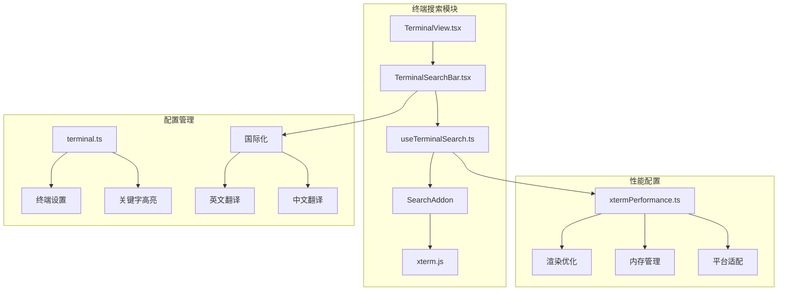
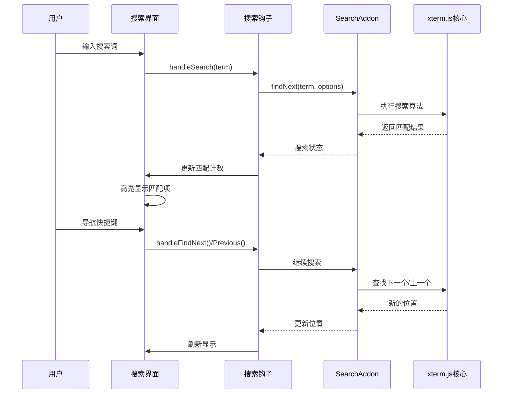
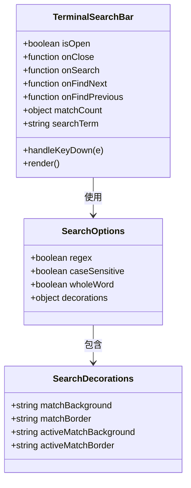
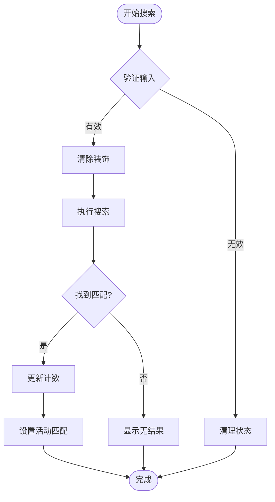
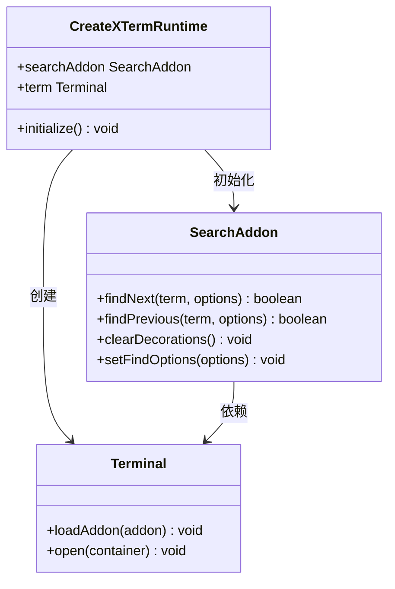
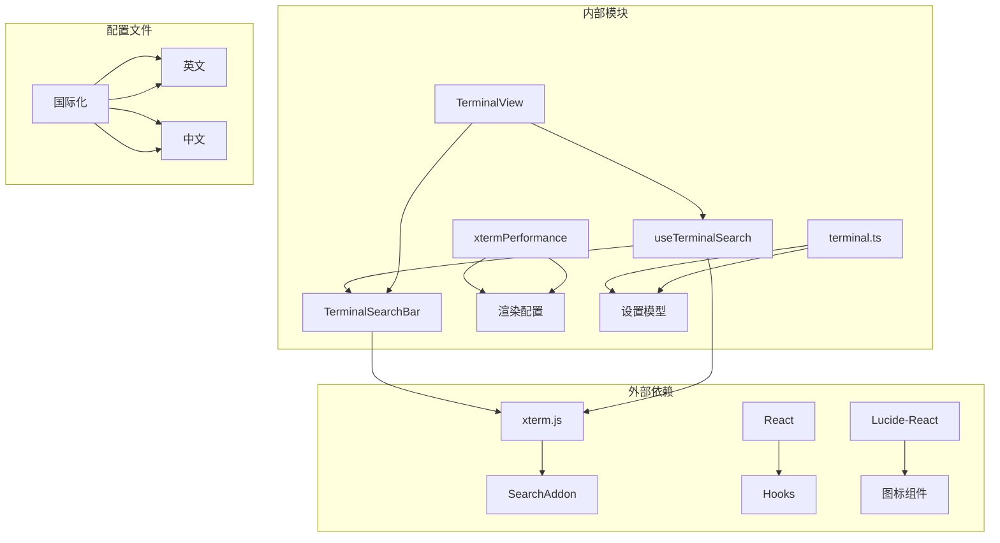

# 终端搜索功能

<cite>
**本文档引用的文件**
- [TerminalSearchBar.tsx](file://components/terminal/TerminalSearchBar.tsx)
- [useTerminalSearch.ts](file://components/terminal/hooks/useTerminalSearch.ts)
- [TerminalView.tsx](file://components/terminal/TerminalView.tsx)
- [createXTermRuntime.ts](file://components/terminal/runtime/createXTermRuntime.ts)
- [xtermPerformance.ts](file://infrastructure/config/xtermPerformance.ts)
- [terminal.ts](file://domain/models/terminal.ts)
- [terminal.ts（英文）](file://application/i18n/locales/en/terminal.ts)
- [terminal.ts（中文）](file://application/i18n/locales/zh-CN/terminal.ts)
</cite>

## 目录
1. [简介](#简介)
2. [项目结构](#项目结构)
3. [核心组件](#核心组件)
4. [架构概览](#架构概览)
5. [详细组件分析](#详细组件分析)
6. [依赖关系分析](#依赖关系分析)
7. [性能考虑](#性能考虑)
8. [故障排除指南](#故障排除指南)
9. [结论](#结论)

## 简介

终端搜索功能是 Netcatty 应用程序中的一个重要特性，它为用户提供了在终端会话的滚动缓冲区内进行高效搜索的能力。该功能基于 xterm.js 的搜索插件构建，集成了现代化的用户界面设计和高性能的搜索算法。

该搜索系统支持多种搜索模式，包括文本搜索、正则表达式匹配、区分大小写选项和整个单词匹配等高级功能。系统还提供了直观的用户界面，包括实时搜索反馈、结果导航和高亮显示等功能。

## 项目结构

终端搜索功能主要分布在以下模块中：

**图表来源**
- [TerminalView.tsx:465-476](file://components/terminal/TerminalView.tsx#L465-L476)
- [TerminalSearchBar.tsx:20-27](file://components/terminal/TerminalSearchBar.tsx#L20-L27)
- [useTerminalSearch.ts:24-30](file://components/terminal/hooks/useTerminalSearch.ts#L24-L30)

**章节来源**
- [TerminalView.tsx:1-638](file://components/terminal/TerminalView.tsx#L1-L638)
- [TerminalSearchBar.tsx:1-173](file://components/terminal/TerminalSearchBar.tsx#L1-L173)
- [useTerminalSearch.ts:1-103](file://components/terminal/hooks/useTerminalSearch.ts#L1-L103)

## 核心组件

### 搜索栏组件 (TerminalSearchBar)

搜索栏组件是用户界面的核心部分，提供了完整的搜索交互体验：

- **实时搜索反馈**：输入时自动触发搜索操作
- **键盘快捷键支持**：支持 Enter、Shift+Enter、F3 等快捷键
- **结果指示器**：显示搜索结果数量和状态
- **导航按钮**：提供上一个和下一个匹配项的导航

### 搜索钩子 (useTerminalSearch)

搜索钩子负责管理搜索状态和逻辑：

- **搜索状态管理**：跟踪搜索词、匹配计数和装饰效果
- **搜索算法封装**：提供统一的搜索接口
- **装饰效果控制**：管理搜索结果的高亮显示
- **键盘事件处理**：处理各种导航快捷键

### xterm.js 集成

系统深度集成了 xterm.js 的搜索功能：

- **SearchAddon**：提供底层搜索算法支持
- **装饰系统**：实现搜索结果的视觉高亮
- **性能优化**：利用 xterm.js 的优化特性

**章节来源**
- [TerminalSearchBar.tsx:11-18](file://components/terminal/TerminalSearchBar.tsx#L11-L18)
- [useTerminalSearch.ts:24-30](file://components/terminal/hooks/useTerminalSearch.ts#L24-L30)
- [createXTermRuntime.ts:358-359](file://components/terminal/runtime/createXTermRuntime.ts#L358-L359)

## 架构概览

终端搜索功能采用分层架构设计，确保了良好的可维护性和扩展性：

**图表来源**
- [TerminalSearchBar.tsx:42-49](file://components/terminal/TerminalSearchBar.tsx#L42-L49)
- [useTerminalSearch.ts:47-69](file://components/terminal/hooks/useTerminalSearch.ts#L47-L69)
- [useTerminalSearch.ts:71-83](file://components/terminal/hooks/useTerminalSearch.ts#L71-L83)

## 详细组件分析

### 搜索界面组件

搜索界面组件提供了完整的用户交互体验：

**图表来源**
- [TerminalSearchBar.tsx:20-27](file://components/terminal/TerminalSearchBar.tsx#L20-L27)
- [useTerminalSearch.ts:17-22](file://components/terminal/hooks/useTerminalSearch.ts#L17-L22)

#### 搜索选项配置

系统提供了灵活的搜索选项配置：

- **正则表达式支持**：通过 `regex` 选项启用
- **大小写敏感**：通过 `caseSensitive` 控制
- **整词匹配**：通过 `wholeWord` 实现
- **装饰样式**：自定义匹配项的视觉效果

#### 键盘事件处理

搜索界面支持多种键盘快捷键：

- **Esc**：关闭搜索界面
- **Enter**：查找下一个匹配项
- **Shift+Enter**：查找上一个匹配项
- **F3**：重复上次搜索

**章节来源**
- [TerminalSearchBar.tsx:51-70](file://components/terminal/TerminalSearchBar.tsx#L51-L70)
- [useTerminalSearch.ts:17-22](file://components/terminal/hooks/useTerminalSearch.ts#L17-L22)

### 搜索钩子实现

搜索钩子提供了核心的搜索逻辑和状态管理：

**图表来源**
- [useTerminalSearch.ts:47-69](file://components/terminal/hooks/useTerminalSearch.ts#L47-L69)

#### 状态管理

搜索钩子负责管理以下状态：

- **搜索开关**：控制搜索界面的显示/隐藏
- **匹配计数**：跟踪当前和总匹配数量
- **搜索词缓存**：保存最后一次搜索的词
- **装饰效果**：管理搜索结果的视觉高亮

#### 性能优化策略

系统采用了多种性能优化策略：

- **即时搜索**：输入时立即响应
- **装饰清理**：避免重复渲染
- **状态缓存**：减少不必要的计算

**章节来源**
- [useTerminalSearch.ts:31-45](file://components/terminal/hooks/useTerminalSearch.ts#L31-L45)
- [useTerminalSearch.ts:35-37](file://components/terminal/hooks/useTerminalSearch.ts#L35-L37)

### xterm.js 集成实现

系统与 xterm.js 的集成确保了高性能的搜索体验：

**图表来源**
- [createXTermRuntime.ts:358-359](file://components/terminal/runtime/createXTermRuntime.ts#L358-L359)
- [createXTermRuntime.ts:948-953](file://components/terminal/runtime/createXTermRuntime.ts#L948-L953)

#### 插件初始化

xterm.js 插件的初始化过程：

- **SearchAddon 创建**：实例化搜索功能
- **终端集成**：将搜索插件加载到终端实例
- **事件绑定**：设置必要的事件处理器

#### 性能配置

系统提供了全面的性能配置选项：

- **渲染器选择**：自动选择最适合的渲染方式
- **内存管理**：优化滚动缓冲区的内存使用
- **平台适配**：针对不同平台进行性能优化

**章节来源**
- [createXTermRuntime.ts:358-359](file://components/terminal/runtime/createXTermRuntime.ts#L358-L359)
- [xtermPerformance.ts:142-198](file://infrastructure/config/xtermPerformance.ts#L142-L198)

## 依赖关系分析

终端搜索功能的依赖关系如下：

**图表来源**
- [TerminalSearchBar.tsx:5-8](file://components/terminal/TerminalSearchBar.tsx#L5-L8)
- [useTerminalSearch.ts:1-3](file://components/terminal/hooks/useTerminalSearch.ts#L1-L3)
- [xtermPerformance.ts:10-106](file://infrastructure/config/xtermPerformance.ts#L10-L106)

### 核心依赖

系统的主要依赖关系：

- **xterm.js**：提供基础的终端功能和搜索能力
- **React Hooks**：管理组件状态和生命周期
- **Lucide-React**：提供现代化的图标系统

### 配置依赖

系统配置的相互依赖：

- **性能配置**：影响渲染和内存使用
- **终端设置**：控制搜索行为和外观
- **国际化**：提供多语言支持

**章节来源**
- [TerminalView.tsx:465-476](file://components/terminal/TerminalView.tsx#L465-L476)
- [xtermPerformance.ts:113-131](file://infrastructure/config/xtermPerformance.ts#L113-L131)

## 性能考虑

终端搜索功能在设计时充分考虑了性能优化：

### 内存管理策略

系统采用了多种内存管理策略来确保高效的性能：

- **滚动缓冲区优化**：根据平台自动调整缓冲区大小
- **装饰缓存**：缓存搜索结果的装饰信息
- **垃圾回收**：及时释放不再使用的资源

### 渲染性能优化

为了提供流畅的用户体验，系统实现了多项渲染优化：

- **WebGL 优先**：在支持的平台上使用 WebGL 加速
- **DOM 回退**：在低内存设备上使用 DOM 渲染
- **平滑滚动**：优化滚动性能和用户体验

### 搜索算法优化

搜索算法经过专门优化以处理大量数据：

- **增量搜索**：支持实时搜索反馈
- **结果缓存**：缓存搜索结果避免重复计算
- **智能匹配**：优化匹配算法的性能

**章节来源**
- [xtermPerformance.ts:11-106](file://infrastructure/config/xtermPerformance.ts#L11-L106)
- [useTerminalSearch.ts:8-15](file://components/terminal/hooks/useTerminalSearch.ts#L8-L15)

## 故障排除指南

### 常见问题及解决方案

#### 搜索功能无法正常工作

**症状**：输入搜索词后无任何反应

**可能原因**：
- xterm.js 实例未正确初始化
- SearchAddon 未正确加载
- 终端实例为空

**解决方法**：
1. 检查终端实例的状态
2. 确认 SearchAddon 已正确初始化
3. 验证终端容器的可见性

#### 搜索结果不准确

**症状**：搜索结果与预期不符

**可能原因**：
- 搜索选项配置错误
- 正则表达式语法问题
- 编码问题导致的匹配失败

**解决方法**：
1. 检查搜索选项的设置
2. 验证正则表达式的正确性
3. 确认终端编码设置

#### 性能问题

**症状**：搜索操作响应缓慢

**可能原因**：
- 滚动缓冲区过大
- 装饰效果过多
- 平台性能限制

**解决方法**：
1. 调整滚动缓冲区大小
2. 减少装饰效果的复杂度
3. 考虑使用 DOM 渲染替代 WebGL

### 调试技巧

#### 开发者工具使用

使用浏览器开发者工具可以有效地调试搜索功能：

- **控制台日志**：查看搜索操作的详细信息
- **性能面板**：分析搜索操作的性能影响
- **内存面板**：监控内存使用情况

#### 日志记录

系统提供了详细的日志记录功能：

- **搜索状态**：记录搜索词和匹配结果
- **性能指标**：记录搜索操作的时间消耗
- **错误信息**：捕获和报告异常情况

**章节来源**
- [useTerminalSearch.ts:35-37](file://components/terminal/hooks/useTerminalSearch.ts#L35-L37)
- [xtermPerformance.ts:71-93](file://infrastructure/config/xtermPerformance.ts#L71-L93)

## 结论

终端搜索功能是一个高度优化且用户友好的特性，它成功地结合了现代前端技术和成熟的终端处理框架。通过合理的架构设计和性能优化策略，该功能能够在各种环境下提供流畅的用户体验。

### 主要优势

- **易用性**：直观的用户界面和丰富的快捷键支持
- **性能**：基于 xterm.js 的高性能搜索算法
- **可扩展性**：模块化的架构设计便于功能扩展
- **跨平台**：针对不同平台进行专门优化

### 技术亮点

- **实时搜索反馈**：输入时即时响应
- **智能装饰系统**：提供清晰的视觉反馈
- **平台适配**：自动选择最优的渲染方式
- **内存优化**：有效的资源管理和清理策略

该搜索功能为用户提供了强大而便捷的终端内容检索能力，是 Netcatty 应用程序的重要组成部分。