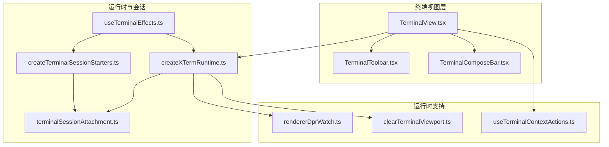
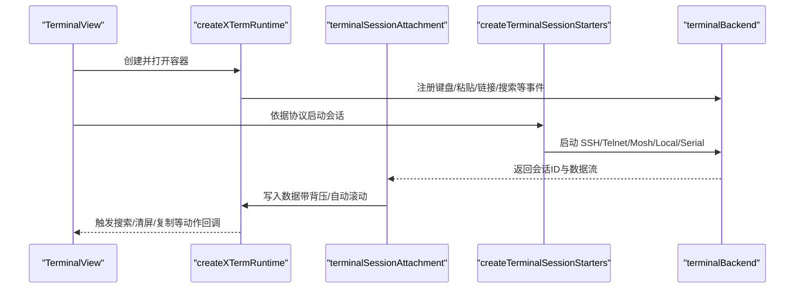
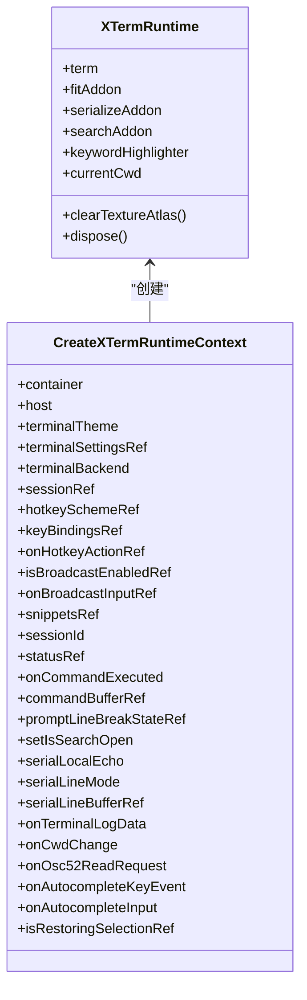
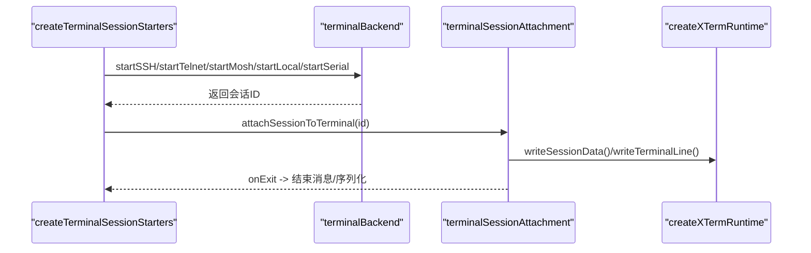
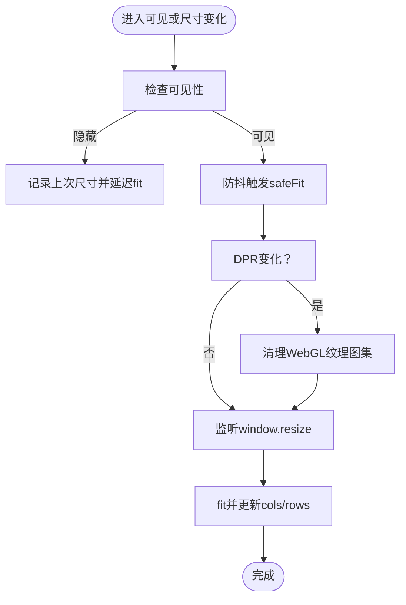
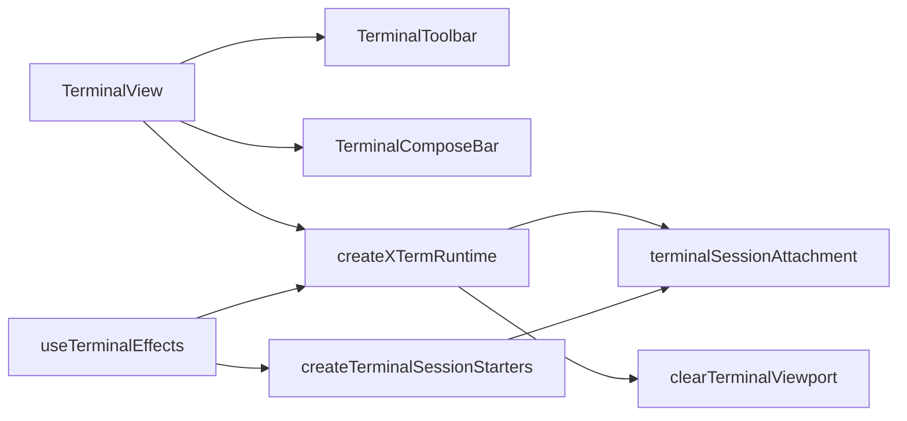

# 终端视图操作

<cite>
**本文引用的文件**
- [TerminalView.tsx](file://components/terminal/TerminalView.tsx)
- [TerminalToolbar.tsx](file://components/terminal/TerminalToolbar.tsx)
- [TerminalComposeBar.tsx](file://components/terminal/TerminalComposeBar.tsx)
- [createXTermRuntime.ts](file://components/terminal/runtime/createXTermRuntime.ts)
- [useTerminalEffects.ts](file://components/terminal/useTerminalEffects.ts)
- [terminalSessionAttachment.ts](file://components/terminal/runtime/terminalSessionAttachment.ts)
- [createTerminalSessionStarters.ts](file://components/terminal/runtime/createTerminalSessionStarters.ts)
- [rendererDprWatch.ts](file://components/terminal/runtime/rendererDprWatch.ts)
- [clearTerminalViewport.ts](file://components/terminal/clearTerminalViewport.ts)
- [useTerminalContextActions.ts](file://components/terminal/hooks/useTerminalContextActions.ts)
</cite>

## 目录
1. [简介](#简介)
2. [项目结构](#项目结构)
3. [核心组件](#核心组件)
4. [架构总览](#架构总览)
5. [详细组件分析](#详细组件分析)
6. [依赖关系分析](#依赖关系分析)
7. [性能考量](#性能考量)
8. [故障排查指南](#故障排查指南)
9. [结论](#结论)
10. [附录](#附录)

## 简介
本文件面向“终端视图操作”功能，系统化阐述终端组件的架构与实现要点，覆盖以下主题：
- XTerm 实例管理：创建、渲染器选择、插件加载、事件绑定与销毁
- 会话生命周期控制：连接启动、数据流背压、输出写入、退出处理
- 容器布局适配：窗口尺寸变化、高DPI缩放、可见性恢复、Fit自适应
- 工具栏功能：复制/粘贴/选择/清屏、搜索、广播、聚焦模式、关闭等
- 组合栏（Compose Bar）：命令输入、会话广播、快捷操作
- 响应式布局与高DPI优化：设备像素比监听、纹理图集修复、滚动条主题
- 初始化与配置示例：如何正确挂载与配置终端组件
- 常见问题与解决方案：粘贴冲突、花屏、字体度量、自动滚动

## 项目结构
终端相关代码主要位于 components/terminal 及其子目录 runtime、hooks 中；会话启动逻辑在 runtime 下的多个模块中协作完成。

图表来源
- [TerminalView.tsx:1-638](file://components/terminal/TerminalView.tsx#L1-L638)
- [TerminalToolbar.tsx:1-271](file://components/terminal/TerminalToolbar.tsx#L1-L271)
- [TerminalComposeBar.tsx:1-149](file://components/terminal/TerminalComposeBar.tsx#L1-L149)
- [createXTermRuntime.ts:1-998](file://components/terminal/runtime/createXTermRuntime.ts#L1-L998)
- [terminalSessionAttachment.ts:1-249](file://components/terminal/runtime/terminalSessionAttachment.ts#L1-L249)
- [createTerminalSessionStarters.ts:1-873](file://components/terminal/runtime/createTerminalSessionStarters.ts#L1-L873)
- [useTerminalEffects.ts:1-749](file://components/terminal/useTerminalEffects.ts#L1-L749)
- [rendererDprWatch.ts:1-73](file://components/terminal/runtime/rendererDprWatch.ts#L1-L73)
- [clearTerminalViewport.ts:1-86](file://components/terminal/clearTerminalViewport.ts#L1-L86)
- [useTerminalContextActions.ts:1-110](file://components/terminal/hooks/useTerminalContextActions.ts#L1-L110)

章节来源
- [TerminalView.tsx:1-638](file://components/terminal/TerminalView.tsx#L1-L638)
- [TerminalToolbar.tsx:1-271](file://components/terminal/TerminalToolbar.tsx#L1-L271)
- [TerminalComposeBar.tsx:1-149](file://components/terminal/TerminalComposeBar.tsx#L1-L149)
- [createXTermRuntime.ts:1-998](file://components/terminal/runtime/createXTermRuntime.ts#L1-L998)
- [useTerminalEffects.ts:1-749](file://components/terminal/useTerminalEffects.ts#L1-L749)
- [terminalSessionAttachment.ts:1-249](file://components/terminal/runtime/terminalSessionAttachment.ts#L1-L249)
- [createTerminalSessionStarters.ts:1-873](file://components/terminal/runtime/createTerminalSessionStarters.ts#L1-L873)
- [rendererDprWatch.ts:1-73](file://components/terminal/runtime/rendererDprWatch.ts#L1-L73)
- [clearTerminalViewport.ts:1-86](file://components/terminal/clearTerminalViewport.ts#L1-L86)
- [useTerminalContextActions.ts:1-110](file://components/terminal/hooks/useTerminalContextActions.ts#L1-L110)

## 核心组件
- 终端视图容器：负责布局、状态栏、搜索栏、拖拽覆盖、ZMODEM 传输提示、OSC-52 提示框等 UI 层交互与承载
- 工具栏：提供高频操作入口（复制/粘贴/清屏/搜索/广播/聚焦/关闭）
- 组合栏：沉浸式命令输入，支持广播指示与多行输入
- XTerm 运行时：创建并配置 xterm.js，加载插件（fit/search/serialize/webgl/links/unicode），处理键盘与鼠标事件，维护关键字高亮
- 会话启动器：根据协议（SSH/Telnet/Mosh/Local/Serial）建立连接，注入环境变量与启动命令，处理链路进度与错误
- 会话附件：将后端数据流写入终端，应用回压策略，处理自动滚动与换行
- 效果钩子：统一处理字体、主题、尺寸、可见性、DPR 变化、搜索栏开闭、选区变化等副作用
- 上下文动作：封装复制/粘贴/选择/清屏等上下文菜单行为，并支持广播

章节来源
- [TerminalView.tsx:1-638](file://components/terminal/TerminalView.tsx#L1-L638)
- [TerminalToolbar.tsx:1-271](file://components/terminal/TerminalToolbar.tsx#L1-L271)
- [TerminalComposeBar.tsx:1-149](file://components/terminal/TerminalComposeBar.tsx#L1-L149)
- [createXTermRuntime.ts:1-998](file://components/terminal/runtime/createXTermRuntime.ts#L1-L998)
- [createTerminalSessionStarters.ts:1-873](file://components/terminal/runtime/createTerminalSessionStarters.ts#L1-L873)
- [terminalSessionAttachment.ts:1-249](file://components/terminal/runtime/terminalSessionAttachment.ts#L1-L249)
- [useTerminalEffects.ts:1-749](file://components/terminal/useTerminalEffects.ts#L1-L749)
- [useTerminalContextActions.ts:1-110](file://components/terminal/hooks/useTerminalContextActions.ts#L1-L110)

## 架构总览
终端从“视图层”到“运行时”，再到“会话启动与数据流”的分层架构如下：

图表来源
- [TerminalView.tsx:1-638](file://components/terminal/TerminalView.tsx#L1-L638)
- [createXTermRuntime.ts:1-998](file://components/terminal/runtime/createXTermRuntime.ts#L1-L998)
- [terminalSessionAttachment.ts:1-249](file://components/terminal/runtime/terminalSessionAttachment.ts#L1-L249)
- [createTerminalSessionStarters.ts:1-873](file://components/terminal/runtime/createTerminalSessionStarters.ts#L1-L873)

## 详细组件分析

### 终端视图容器（TerminalView）
- 布局与状态栏：顶部状态栏显示主机名、状态点、服务器统计（CPU/内存/磁盘/网络）、工具栏按钮
- 搜索栏：可展开/收起，配合终端运行时进行查找
- 终端容器：绝对定位的 xterm 容器，支持搜索栏开启时的偏移
- 自动补全：独立组件，通过 ref 与运行时联动
- 连接对话框：认证、主机密钥验证、重试/取消/关闭会话
- ZMODEM 传输：进度指示与覆盖确认
- 组合栏：单一会话模式下的沉浸式输入条

章节来源
- [TerminalView.tsx:1-638](file://components/terminal/TerminalView.tsx#L1-L638)

### 终端工具栏（TerminalToolbar）
- 功能按钮：打开 SFTP（仅非本地/串口）、组合栏开关、搜索开关、更多菜单（脚本、主题、编码切换）
- 编码切换：仅对 SSH/Telnet/串口生效，避免本地/摩斯（Mosh）后端不可控
- 更多菜单：脚本、主题、编码子菜单，支持子菜单点击不误关父级弹层

章节来源
- [TerminalToolbar.tsx:1-271](file://components/terminal/TerminalToolbar.tsx#L1-L271)

### 终端组合栏（TerminalComposeBar）
- 输入行为：Enter 发送、Shift+Enter 插入换行、Esc 关闭
- 广播指示：当广播启用时显示脉冲图标
- 主题适配：基于主题颜色计算边框与前景色
- 自动高度：根据内容动态调整高度，限制最大高度

章节来源
- [TerminalComposeBar.tsx:1-149](file://components/terminal/TerminalComposeBar.tsx#L1-L149)

### XTerm 运行时（createXTermRuntime）
- 实例创建：按平台与设备内存选择渲染器（WebGL/DOM），设置字体、主题、光标、行距、对比度、平滑滚动等
- 插件加载：fit、serialize、search、web-links、unicode-graphemes；可选 webgl 插件
- 键盘与热键：全局热键、终端内动作（复制/粘贴/全选/清屏/搜索）；Kitty 键盘协议、Option+箭头词跳转
- 鼠标与粘贴：中键粘贴、Bracketed Paste、用户粘贴滚动策略
- OSC 处理：OSC 7（当前工作目录）、OSC 52（剪贴板读写）
- 尺寸与DPR：监听设备像素比变化，清理 WebGL 纹理图集并重新 fit
- 清屏策略：区分擦除视口与擦除滚动缓冲，尊重用户偏好
- 关闭与清理：释放所有插件与事件监听

图表来源
- [createXTermRuntime.ts:69-150](file://components/terminal/runtime/createXTermRuntime.ts#L69-L150)
- [createXTermRuntime.ts:195-998](file://components/terminal/runtime/createXTermRuntime.ts#L195-L998)

章节来源
- [createXTermRuntime.ts:1-998](file://components/terminal/runtime/createXTermRuntime.ts#L1-L998)

### 会话生命周期（createTerminalSessionStarters + terminalSessionAttachment）
- 环境构建：TERM 等环境变量注入
- 启动流程：
  - SSH：支持代理/跳板、凭据回退、链路进度回调、错误分类与重试路径
  - Telnet：用户名/密码自动登录等待、代理限制
  - Mosh：不支持代理与跳板链、凭据处理
  - Local/Serial：本地进程与串口启动
- 数据流：
  - 回压控制器：根据未渲染字节阈值暂停/恢复源流
  - 输出写入：统一处理换行、粘贴残留清理、提示符断行同步
  - 自动滚动：根据设置决定是否滚动到底部
- 退出处理：写入会话结束消息、序列化终端数据、清理连接令牌

图表来源
- [createTerminalSessionStarters.ts:32-873](file://components/terminal/runtime/createTerminalSessionStarters.ts#L32-L873)
- [terminalSessionAttachment.ts:180-249](file://components/terminal/runtime/terminalSessionAttachment.ts#L180-L249)

章节来源
- [createTerminalSessionStarters.ts:1-873](file://components/terminal/runtime/createTerminalSessionStarters.ts#L1-L873)
- [terminalSessionAttachment.ts:1-249](file://components/terminal/runtime/terminalSessionAttachment.ts#L1-L249)

### 响应式布局与高DPI优化
- 设备像素比监听：匹配特定 DPR 的媒体查询，变更时清理 WebGL 纹理图集并重新 fit
- 字体度量：等待字体加载完成后 remeasure 并再次 fit，修正粗体权重
- 可见性恢复：面板隐藏再显示时强制同步重绘，修复“花屏”
- 窗口尺寸变化：ResizeObserver 与 window.resize 防抖触发 fit

图表来源
- [useTerminalEffects.ts:528-548](file://components/terminal/useTerminalEffects.ts#L528-L548)
- [useTerminalEffects.ts:714-734](file://components/terminal/useTerminalEffects.ts#L714-L734)
- [rendererDprWatch.ts:34-73](file://components/terminal/runtime/rendererDprWatch.ts#L34-L73)

章节来源
- [useTerminalEffects.ts:1-749](file://components/terminal/useTerminalEffects.ts#L1-L749)
- [rendererDprWatch.ts:1-73](file://components/terminal/runtime/rendererDprWatch.ts#L1-L73)

### 工具栏与上下文动作
- 工具栏按钮：复制、粘贴、粘贴选择、全选、清屏、搜索、广播、聚焦、关闭
- 上下文动作：封装复制/粘贴/选择/清屏，支持广播粘贴数据
- 右键行为：根据设置决定是否拦截并执行粘贴/选词

章节来源
- [TerminalToolbar.tsx:1-271](file://components/terminal/TerminalToolbar.tsx#L1-L271)
- [useTerminalContextActions.ts:1-110](file://components/terminal/hooks/useTerminalContextActions.ts#L1-L110)

## 依赖关系分析
- TerminalView 依赖 TerminalToolbar、TerminalComposeBar、XTerm 运行时与上下文动作
- XTerm 运行时依赖会话附件与会话启动器提供的数据流与环境
- useTerminalEffects 统一协调字体、主题、尺寸、DPR、可见性、搜索栏、选区变化等副作用
- 清屏与 OSC 处理由运行时与附件共同实现

图表来源
- [TerminalView.tsx:1-638](file://components/terminal/TerminalView.tsx#L1-L638)
- [createXTermRuntime.ts:1-998](file://components/terminal/runtime/createXTermRuntime.ts#L1-L998)
- [terminalSessionAttachment.ts:1-249](file://components/terminal/runtime/terminalSessionAttachment.ts#L1-L249)
- [createTerminalSessionStarters.ts:1-873](file://components/terminal/runtime/createTerminalSessionStarters.ts#L1-L873)
- [useTerminalEffects.ts:1-749](file://components/terminal/useTerminalEffects.ts#L1-L749)
- [clearTerminalViewport.ts:1-86](file://components/terminal/clearTerminalViewport.ts#L1-L86)

章节来源
- [TerminalView.tsx:1-638](file://components/terminal/TerminalView.tsx#L1-L638)
- [createXTermRuntime.ts:1-998](file://components/terminal/runtime/createXTermRuntime.ts#L1-L998)
- [terminalSessionAttachment.ts:1-249](file://components/terminal/runtime/terminalSessionAttachment.ts#L1-L249)
- [createTerminalSessionStarters.ts:1-873](file://components/terminal/runtime/createTerminalSessionStarters.ts#L1-L873)
- [useTerminalEffects.ts:1-749](file://components/terminal/useTerminalEffects.ts#L1-L749)
- [clearTerminalViewport.ts:1-86](file://components/terminal/clearTerminalViewport.ts#L1-L86)

## 性能考量
- 渲染器选择：根据平台与设备内存自动选择 WebGL 或 DOM 渲染器
- 字体与度量：等待字体加载后再 remeasure，避免度量错误导致的重排
- 背压控制：输出流超过阈值暂停上游，缓解内存压力
- 自动滚动：可配置平滑滚动与原生自动滚动，减少不必要的重绘
- WebGL 纹理图集：DPR 变化与字体变化后主动清理，避免“花屏”

## 故障排查指南
- 粘贴冲突与重复写入
  - 现象：选区复制触发剪贴板写入，可能与自动选择复制冲突
  - 处理：通过“正在恢复选区”标志抑制冗余写入
  - 参考
    - [useTerminalEffects.ts:618-636](file://components/terminal/useTerminalEffects.ts#L618-L636)
    - [useTerminalContextActions.ts:61-75](file://components/terminal/hooks/useTerminalContextActions.ts#L61-L75)
- “花屏/乱码”
  - 现象：字体变化、DPR 变化后出现字符错位
  - 处理：调用清理纹理图集并重新 fit；可见性恢复时强制同步重绘
  - 参考
    - [createXTermRuntime.ts:406-436](file://components/terminal/runtime/createXTermRuntime.ts#L406-L436)
    - [useTerminalEffects.ts:431-458](file://components/terminal/useTerminalEffects.ts#L431-L458)
    - [rendererDprWatch.ts:34-73](file://components/terminal/runtime/rendererDprWatch.ts#L34-L73)
- 清屏行为异常
  - 现象：清屏后历史被擦除或保留不一致
  - 处理：区分擦除视口与擦除滚动缓冲，尊重用户设置
  - 参考
    - [clearTerminalViewport.ts:52-86](file://components/terminal/clearTerminalViewport.ts#L52-L86)
    - [createXTermRuntime.ts:792-804](file://components/terminal/runtime/createXTermRuntime.ts#L792-L804)
- 搜索栏开闭导致滚动位置丢失
  - 处理：保存滚动位置并在 fit 后恢复到底部或原位置
  - 参考
    - [useTerminalEffects.ts:577-594](file://components/terminal/useTerminalEffects.ts#L577-L594)
- OSC 52 读取权限
  - 现象：远程请求读取剪贴板被拒绝
  - 处理：根据设置允许“只写/读写/提示”三种模式，提示模式需用户确认
  - 参考
    - [createXTermRuntime.ts:860-926](file://components/terminal/runtime/createXTermRuntime.ts#L860-L926)

章节来源
- [useTerminalEffects.ts:618-636](file://components/terminal/useTerminalEffects.ts#L618-L636)
- [useTerminalContextActions.ts:61-75](file://components/terminal/hooks/useTerminalContextActions.ts#L61-L75)
- [createXTermRuntime.ts:406-436](file://components/terminal/runtime/createXTermRuntime.ts#L406-L436)
- [rendererDprWatch.ts:34-73](file://components/terminal/runtime/rendererDprWatch.ts#L34-L73)
- [clearTerminalViewport.ts:52-86](file://components/terminal/clearTerminalViewport.ts#L52-L86)
- [createXTermRuntime.ts:792-804](file://components/terminal/runtime/createXTermRuntime.ts#L792-L804)
- [useTerminalEffects.ts:577-594](file://components/terminal/useTerminalEffects.ts#L577-L594)
- [createXTermRuntime.ts:860-926](file://components/terminal/runtime/createXTermRuntime.ts#L860-L926)

## 结论
该终端视图操作体系以清晰的分层设计实现了高性能、可扩展且易维护的终端体验。XTerm 运行时负责底层渲染与事件处理，会话启动器与附件模块分别承担连接与数据流管理，效果钩子统一处理布局与主题等副作用。工具栏与组合栏提供了直观的操作入口，配合 OSC、DPR 监听与回压控制，确保在复杂场景下仍保持稳定与流畅。

## 附录

### 初始化与配置示例（步骤说明）
- 在视图层传入上下文参数，包含容器引用、主题、设置、会话引用、后端接口、热键方案与绑定、广播开关与回调、片段命令等
- 使用 useTerminalEffects 完成运行时创建、会话启动、尺寸与可见性适配、DPR 变化处理、搜索栏与选区副作用
- 通过 TerminalToolbar 与 TerminalComposeBar 提供工具栏与组合栏能力
- 通过 useTerminalContextActions 将复制/粘贴/清屏等动作接入右键菜单

章节来源
- [TerminalView.tsx:1-638](file://components/terminal/TerminalView.tsx#L1-L638)
- [useTerminalEffects.ts:173-299](file://components/terminal/useTerminalEffects.ts#L173-L299)
- [TerminalToolbar.tsx:1-271](file://components/terminal/TerminalToolbar.tsx#L1-L271)
- [TerminalComposeBar.tsx:1-149](file://components/terminal/TerminalComposeBar.tsx#L1-L149)
- [useTerminalContextActions.ts:26-109](file://components/terminal/hooks/useTerminalContextActions.ts#L26-L109)