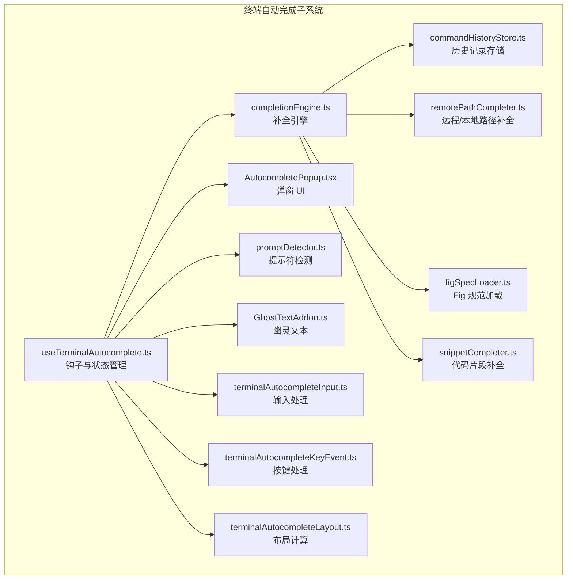
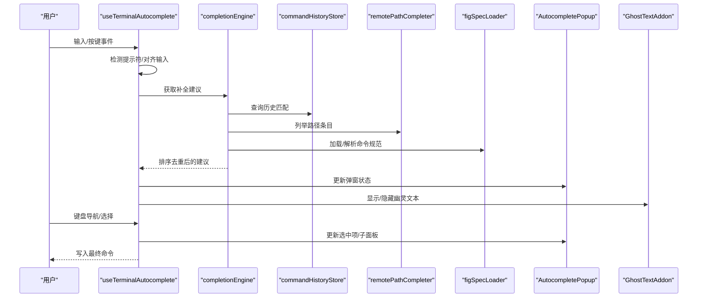
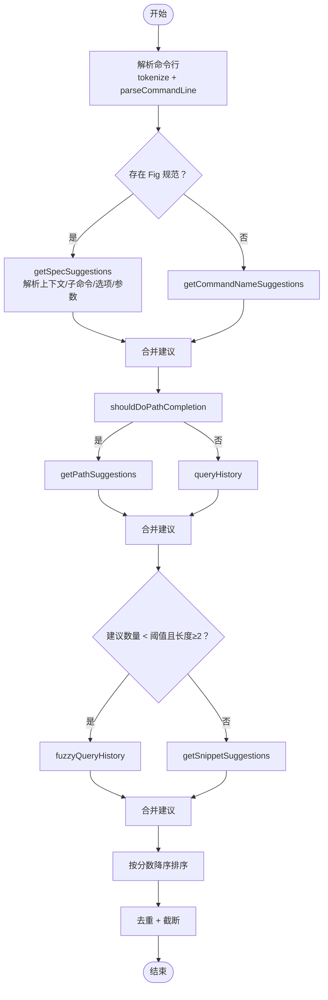
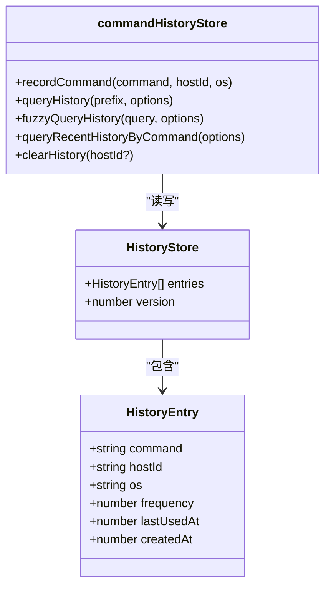
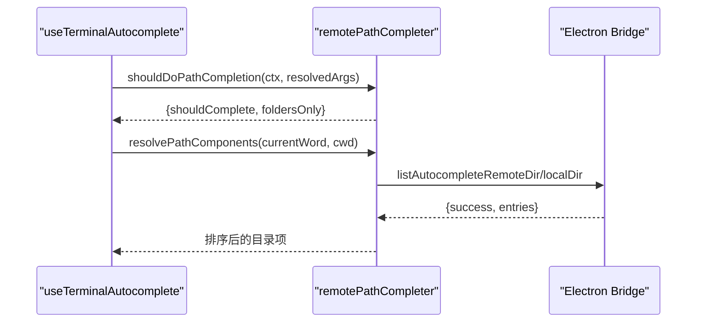
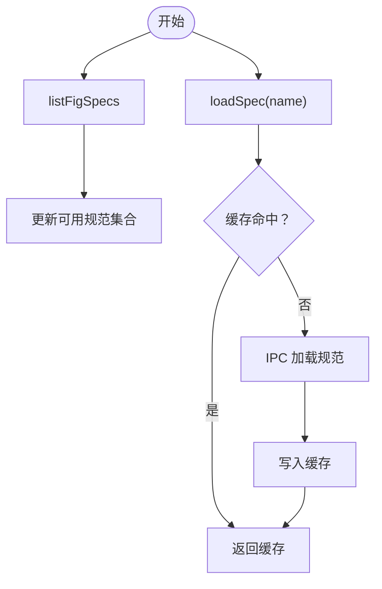
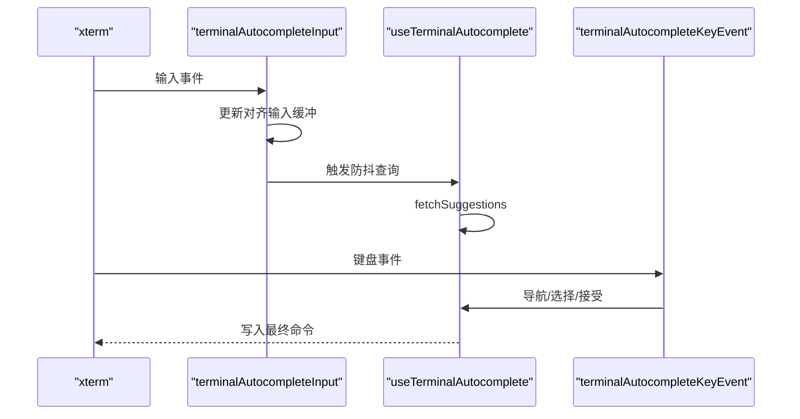
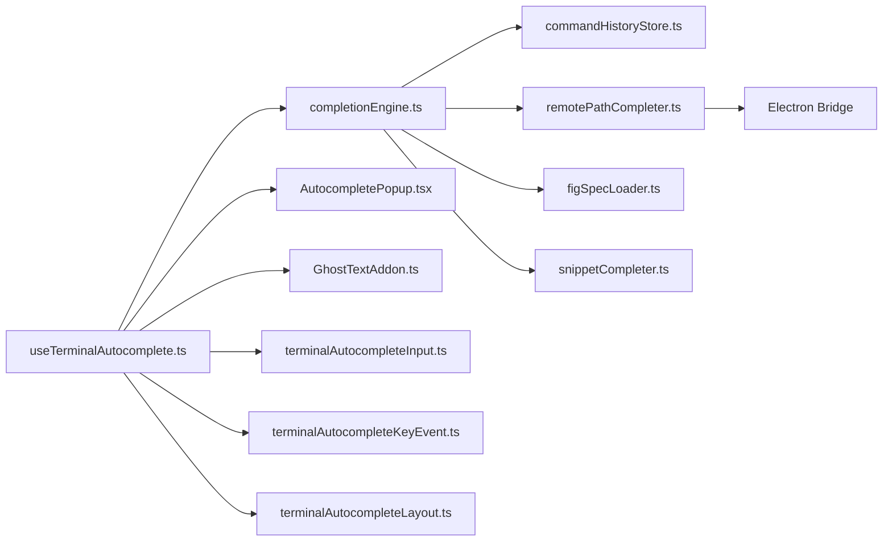

# 自动完成功能

<cite>
**本文档引用的文件**
- [completionEngine.ts](file://components/terminal/autocomplete/completionEngine.ts)
- [AutocompletePopup.tsx](file://components/terminal/autocomplete/AutocompletePopup.tsx)
- [commandHistoryStore.ts](file://components/terminal/autocomplete/commandHistoryStore.ts)
- [snippetCompleter.ts](file://components/terminal/autocomplete/snippetCompleter.ts)
- [remotePathCompleter.ts](file://components/terminal/autocomplete/remotePathCompleter.ts)
- [figSpecLoader.ts](file://components/terminal/autocomplete/figSpecLoader.ts)
- [useTerminalAutocomplete.ts](file://components/terminal/autocomplete/useTerminalAutocomplete.ts)
- [terminalAutocompleteInput.ts](file://components/terminal/autocomplete/terminalAutocompleteInput.ts)
- [terminalAutocompleteKeyEvent.ts](file://components/terminal/autocomplete/terminalAutocompleteKeyEvent.ts)
- [terminalAutocompleteLayout.ts](file://components/terminal/autocomplete/terminalAutocompleteLayout.ts)
- [promptDetector.ts](file://components/terminal/autocomplete/promptDetector.ts)
- [GhostTextAddon.ts](file://components/terminal/autocomplete/GhostTextAddon.ts)
- [ghostSuggestionPolicy.ts](file://components/terminal/autocomplete/ghostSuggestionPolicy.ts)
- [livePreviewSequence.ts](file://components/terminal/autocomplete/livePreviewSequence.ts)
- [TerminalAutocomplete.tsx](file://components/terminal/TerminalAutocomplete.tsx)
</cite>

## 目录
1. [简介](#简介)
2. [项目结构](#项目结构)
3. [核心组件](#核心组件)
4. [架构总览](#架构总览)
5. [详细组件分析](#详细组件分析)
6. [依赖关系分析](#依赖关系分析)
7. [性能考虑](#性能考虑)
8. [故障排除指南](#故障排除指南)
9. [结论](#结论)
10. [附录](#附录)

## 简介
本文件面向终端自动完成功能的技术文档，系统性阐述自动完成系统的架构设计与实现细节，包括补全引擎工作原理、建议生成算法、缓存机制、补全类型（命令历史、远程路径、代码片段、参数）实现、配置选项、触发机制（键盘事件、上下文检测、建议列表渲染）、使用示例、性能优化与常见问题排查。

## 项目结构
自动完成功能主要位于 components/terminal/autocomplete 目录下，采用“模块化 + 分层”的组织方式：
- 补全引擎：解析命令行、聚合多数据源、排序去重
- 历史记录：持久化存储、评分与查询
- 路径补全：本地/远程目录枚举、缓存与过滤
- Fig 规范加载：命令规范解析与预加载
- 弹窗渲染：React 组件负责 UI 呈现与交互
- 输入/按键处理：统一的输入与键盘事件处理逻辑
- 提示检测：从 xterm 缓冲区中识别提示符与用户输入
- 幽灵文本：内联建议渲染，避免修改终端缓冲区

**图表来源**
- [useTerminalAutocomplete.ts:140-928](file://components/terminal/autocomplete/useTerminalAutocomplete.ts#L140-L928)
- [completionEngine.ts:163-323](file://components/terminal/autocomplete/completionEngine.ts#L163-L323)
- [AutocompletePopup.tsx:121-510](file://components/terminal/autocomplete/AutocompletePopup.tsx#L121-L510)
- [promptDetector.ts:505-589](file://components/terminal/autocomplete/promptDetector.ts#L505-L589)

**章节来源**
- [useTerminalAutocomplete.ts:140-928](file://components/terminal/autocomplete/useTerminalAutocomplete.ts#L140-L928)
- [completionEngine.ts:163-323](file://components/terminal/autocomplete/completionEngine.ts#L163-L323)

## 核心组件
- 补全引擎：解析命令行、聚合历史、路径、Fig 规范、代码片段，按分数排序并去重
- 历史记录存储：基于 localStorage 的持久化，带频率与时间衰减评分
- 路径补全：支持本地/远程目录枚举，带缓存、过滤与相对/绝对路径解析
- Fig 规范加载：IPC 加载命令规范，批量预加载与缓存
- 弹窗 UI：浮动菜单、详情面板、子目录级联面板、主题色适配
- 提示符检测：从 xterm 缓冲区识别当前行提示符与用户输入，解决主题污染问题
- 幽灵文本：在光标后以半透明文本显示建议，提升输入效率
- 输入/按键处理：统一处理输入、粘贴、退格、控制键、快速打字抑制
- 布局计算：根据光标位置与可用空间决定弹窗方向与尺寸

**章节来源**
- [completionEngine.ts:39-71](file://components/terminal/autocomplete/completionEngine.ts#L39-L71)
- [commandHistoryStore.ts:13-29](file://components/terminal/autocomplete/commandHistoryStore.ts#L13-L29)
- [remotePathCompleter.ts:10-18](file://components/terminal/autocomplete/remotePathCompleter.ts#L10-L18)
- [figSpecLoader.ts:7-46](file://components/terminal/autocomplete/figSpecLoader.ts#L7-L46)
- [AutocompletePopup.tsx:30-53](file://components/terminal/autocomplete/AutocompletePopup.tsx#L30-L53)
- [promptDetector.ts:13-26](file://components/terminal/autocomplete/promptDetector.ts#L13-L26)
- [GhostTextAddon.ts:50-68](file://components/terminal/autocomplete/GhostTextAddon.ts#L50-L68)

## 架构总览
自动完成功能通过 useTerminalAutocomplete 钩子串联各模块，形成“输入检测 → 上下文解析 → 建议生成 → 渲染/交互”的闭环。建议生成由补全引擎统一调度，UI 层通过弹窗与幽灵文本呈现，历史与路径补全通过独立模块提供数据源。

**图表来源**
- [useTerminalAutocomplete.ts:579-709](file://components/terminal/autocomplete/useTerminalAutocomplete.ts#L579-L709)
- [completionEngine.ts:163-323](file://components/terminal/autocomplete/completionEngine.ts#L163-L323)
- [commandHistoryStore.ts:154-191](file://components/terminal/autocomplete/commandHistoryStore.ts#L154-L191)
- [remotePathCompleter.ts:197-222](file://components/terminal/autocomplete/remotePathCompleter.ts#L197-L222)
- [figSpecLoader.ts:97-130](file://components/terminal/autocomplete/figSpecLoader.ts#L97-L130)
- [AutocompletePopup.tsx:121-510](file://components/terminal/autocomplete/AutocompletePopup.tsx#L121-L510)
- [GhostTextAddon.ts:149-176](file://components/terminal/autocomplete/GhostTextAddon.ts#L149-L176)

## 详细组件分析

### 补全引擎（completionEngine）
- 功能职责
  - 解析命令行，识别当前词与上下文（命令、子命令、选项、参数）
  - 聚合多数据源：历史命令、路径、Fig 规范、代码片段
  - 评分与排序：基于来源权重与相关性进行降序排列
  - 去重与上限：按插入文本去重并限制结果数量
- 关键流程
  - tokenize → parseCommandLine → getSpecSuggestions（Fig 规范）
  - shouldDoPathCompletion → getPathSuggestions（路径）
  - queryHistory/fuzzyQueryHistory（历史）
  - getSnippetSuggestions（代码片段）
  - 合并结果、排序、去重、截断
- 数据结构
  - CompletionContext：命令行、当前词、词索引、令牌、命令名、是否选项参数
  - CompletionSuggestion：插入文本、显示文本、描述、来源、分数、频率、文件类型、片段对象

**图表来源**
- [completionEngine.ts:89-157](file://components/terminal/autocomplete/completionEngine.ts#L89-L157)
- [completionEngine.ts:163-323](file://components/terminal/autocomplete/completionEngine.ts#L163-L323)
- [completionEngine.ts:336-469](file://components/terminal/autocomplete/completionEngine.ts#L336-L469)

**章节来源**
- [completionEngine.ts:39-71](file://components/terminal/autocomplete/completionEngine.ts#L39-L71)
- [completionEngine.ts:89-157](file://components/terminal/autocomplete/completionEngine.ts#L89-L157)
- [completionEngine.ts:163-323](file://components/terminal/autocomplete/completionEngine.ts#L163-L323)
- [completionEngine.ts:336-469](file://components/terminal/autocomplete/completionEngine.ts#L336-L469)

### 历史记录存储（commandHistoryStore）
- 存储结构：基于 localStorage 的 HistoryStore，条目含命令、主机 ID、OS、频率、时间戳
- 评分策略：指数时间衰减（每 24 小时半衰），频率加权
- 查询接口：
  - queryHistory：前缀匹配，去重，限制数量
  - fuzzyQueryHistory：模糊匹配（子序列），结合评分排序
  - queryRecentHistoryByCommand：按命令名检索最近历史，用于路径参数补全
- 持久化与限流：全局与按主机上限，存储满时按评分淘汰

**图表来源**
- [commandHistoryStore.ts:13-29](file://components/terminal/autocomplete/commandHistoryStore.ts#L13-L29)
- [commandHistoryStore.ts:154-191](file://components/terminal/autocomplete/commandHistoryStore.ts#L154-L191)
- [commandHistoryStore.ts:198-236](file://components/terminal/autocomplete/commandHistoryStore.ts#L198-L236)
- [commandHistoryStore.ts:243-292](file://components/terminal/autocomplete/commandHistoryStore.ts#L243-L292)

**章节来源**
- [commandHistoryStore.ts:13-29](file://components/terminal/autocomplete/commandHistoryStore.ts#L13-L29)
- [commandHistoryStore.ts:154-191](file://components/terminal/autocomplete/commandHistoryStore.ts#L154-L191)
- [commandHistoryStore.ts:198-236](file://components/terminal/autocomplete/commandHistoryStore.ts#L198-L236)
- [commandHistoryStore.ts:243-292](file://components/terminal/autocomplete/commandHistoryStore.ts#L243-L292)

### 远程/本地路径补全（remotePathCompleter）
- 触发判定：shouldDoPathCompletion（路径前缀、Fig 模板、硬编码命令集、非选项参数）
- 路径解析：resolvePathComponents（引号剥离、相对/绝对路径、解码转义）
- 目录枚举：listDirectoryEntries（IPC 调用，共享缓存、过滤缓存、在途请求去重）
- 缓存策略：全量目录缓存（5 秒 TTL）、前缀过滤缓存、最大容量限制
- 结果排序：目录优先、符号链接次之、文件最后，大小写不敏感排序

**图表来源**
- [remotePathCompleter.ts:89-129](file://components/terminal/autocomplete/remotePathCompleter.ts#L89-L129)
- [remotePathCompleter.ts:134-176](file://components/terminal/autocomplete/remotePathCompleter.ts#L134-L176)
- [remotePathCompleter.ts:227-335](file://components/terminal/autocomplete/remotePathCompleter.ts#L227-L335)

**章节来源**
- [remotePathCompleter.ts:89-129](file://components/terminal/autocomplete/remotePathCompleter.ts#L89-L129)
- [remotePathCompleter.ts:134-176](file://components/terminal/autocomplete/remotePathCompleter.ts#L134-L176)
- [remotePathCompleter.ts:197-222](file://components/terminal/autocomplete/remotePathCompleter.ts#L197-L222)
- [remotePathCompleter.ts:227-335](file://components/terminal/autocomplete/remotePathCompleter.ts#L227-L335)

### Fig 规范加载（figSpecLoader）
- IPC 加载：listFigSpecs/loadFigSpec，失败不缓存空值
- 预加载：preloadCommonSpecs 批量加载常用命令规范，避免 IPC 压力
- 缓存：Map 缓存已加载规范，去重并发加载

**图表来源**
- [figSpecLoader.ts:71-91](file://components/terminal/autocomplete/figSpecLoader.ts#L71-L91)
- [figSpecLoader.ts:97-130](file://components/terminal/autocomplete/figSpecLoader.ts#L97-L130)
- [figSpecLoader.ts:149-182](file://components/terminal/autocomplete/figSpecLoader.ts#L149-L182)

**章节来源**
- [figSpecLoader.ts:71-91](file://components/terminal/autocomplete/figSpecLoader.ts#L71-L91)
- [figSpecLoader.ts:97-130](file://components/terminal/autocomplete/figSpecLoader.ts#L97-L130)
- [figSpecLoader.ts:149-182](file://components/terminal/autocomplete/figSpecLoader.ts#L149-L182)

### 代码片段补全（snippetCompleter）
- 适用场景：仅在命令名位置生效，匹配片段标签或首行命令
- 评分策略：高于历史（2000），前缀匹配额外加分
- 过滤条件：按目标主机过滤，支持多主机

**章节来源**
- [snippetCompleter.ts:19-49](file://components/terminal/autocomplete/snippetCompleter.ts#L19-L49)

### 弹窗 UI（AutocompletePopup）
- 主要功能：浮动建议列表、详情面板、子目录级联面板、主题色适配
- 交互细节：悬停高亮、选中行强调、历史频率徽标、路径文件类型图标、键位提示
- 定位策略：根据光标位置与容器尺寸自动向上/向下展开，避免遮挡

**章节来源**
- [AutocompletePopup.tsx:121-510](file://components/terminal/autocomplete/AutocompletePopup.tsx#L121-L510)
- [terminalAutocompleteLayout.ts:122-168](file://components/terminal/autocomplete/terminalAutocompleteLayout.ts#L122-L168)

### 提示符检测（promptDetector）
- 核心能力：从 xterm 缓冲区识别提示符边界，区分主题装饰与真实输入
- 处理策略：包裹行、PUA 字符、变量引用、嵌入式提示符、主题装饰等边界情况
- 对齐机制：当存在可靠输入缓冲时，将检测到的 userInput 与缓冲对齐，避免主题污染导致的历史污染

**章节来源**
- [promptDetector.ts:505-589](file://components/terminal/autocomplete/promptDetector.ts#L505-L589)
- [promptDetector.ts:786-800](file://components/terminal/autocomplete/promptDetector.ts#L786-L800)

### 幽灵文本（GhostTextAddon）
- 实现要点：CSS overlay 渲染，不修改终端缓冲；基于字符宽度（含 CJK/Emoji）计算列宽
- 对齐策略：锚点（show 时捕获光标）+ 预测偏移，避免 SSH 回显延迟导致的错位
- 一致性保障：实时检测真实行是否已有未跟踪输入，必要时隐藏

**章节来源**
- [GhostTextAddon.ts:50-68](file://components/terminal/autocomplete/GhostTextAddon.ts#L50-L68)
- [GhostTextAddon.ts:149-176](file://components/terminal/autocomplete/GhostTextAddon.ts#L149-L176)
- [GhostTextAddon.ts:319-373](file://components/terminal/autocomplete/GhostTextAddon.ts#L319-L373)

### 输入与按键处理（terminalAutocompleteInput / terminalAutocompleteKeyEvent）
- 输入处理：统一维护“对齐输入缓冲”，处理 Enter、Ctrl+C、Ctrl+U、退格、Ctrl+W、Bracketed Paste、控制键等
- 快速打字抑制：根据两次按键间隔动态延长防抖时间，避免频繁请求
- 按键处理：右箭头接受幽灵文本/进入子目录、Ctrl+右/Alt+右扩展单词、Tab 不拦截（让原生补全接管）、上下左右导航、Esc 关闭、Enter 接受

**图表来源**
- [terminalAutocompleteInput.ts:26-256](file://components/terminal/autocomplete/terminalAutocompleteInput.ts#L26-L256)
- [terminalAutocompleteKeyEvent.ts:25-320](file://components/terminal/autocomplete/terminalAutocompleteKeyEvent.ts#L25-L320)
- [useTerminalAutocomplete.ts:579-709](file://components/terminal/autocomplete/useTerminalAutocomplete.ts#L579-L709)

**章节来源**
- [terminalAutocompleteInput.ts:26-256](file://components/terminal/autocomplete/terminalAutocompleteInput.ts#L26-L256)
- [terminalAutocompleteKeyEvent.ts:25-320](file://components/terminal/autocomplete/terminalAutocompleteKeyEvent.ts#L25-L320)
- [useTerminalAutocomplete.ts:579-709](file://components/terminal/autocomplete/useTerminalAutocomplete.ts#L579-L709)

### 布局与定位（terminalAutocompleteLayout）
- CWD 解析：优先从提示符提取，其次回退到会话 CWD，Windows 下直接忽略
- 弹窗定位：根据光标行列与终端行数，自动选择向上/向下展开，计算最大高度

**章节来源**
- [terminalAutocompleteLayout.ts:6-45](file://components/terminal/autocomplete/terminalAutocompleteLayout.ts#L6-L45)
- [terminalAutocompleteLayout.ts:122-168](file://components/terminal/autocomplete/terminalAutocompleteLayout.ts#L122-L168)

### 钩子与集成（useTerminalAutocomplete / TerminalAutocomplete）
- 钩子职责：状态管理、建议查询、幽灵文本控制、弹窗渲染、子目录面板、历史记录写入
- 组件集成：TerminalAutocomplete 将钩子暴露的处理器注入 xterm 运行时，保证生命周期内持续工作

**章节来源**
- [useTerminalAutocomplete.ts:140-928](file://components/terminal/autocomplete/useTerminalAutocomplete.ts#L140-L928)
- [TerminalAutocomplete.tsx:51-119](file://components/terminal/TerminalAutocomplete.tsx#L51-L119)

## 依赖关系分析
- 模块耦合
  - useTerminalAutocomplete 是中枢，依赖 completionEngine、promptDetector、GhostTextAddon、AutocompletePopup、terminalAutocompleteInput、terminalAutocompleteKeyEvent、terminalAutocompleteLayout
  - completionEngine 依赖 commandHistoryStore、remotePathCompleter、figSpecLoader、snippetCompleter
  - remotePathCompleter 依赖 Electron Bridge（IPC）
- 可能的循环依赖
  - 通过函数引用与导出避免直接循环导入
- 外部依赖
  - xterm.js、Electron IPC、localStorage

**图表来源**
- [useTerminalAutocomplete.ts:140-928](file://components/terminal/autocomplete/useTerminalAutocomplete.ts#L140-L928)
- [completionEngine.ts:163-323](file://components/terminal/autocomplete/completionEngine.ts#L163-L323)
- [remotePathCompleter.ts:227-335](file://components/terminal/autocomplete/remotePathCompleter.ts#L227-L335)

**章节来源**
- [useTerminalAutocomplete.ts:140-928](file://components/terminal/autocomplete/useTerminalAutocomplete.ts#L140-L928)
- [completionEngine.ts:163-323](file://components/terminal/autocomplete/completionEngine.ts#L163-L323)

## 性能考虑
- 防抖与快速打字抑制：根据按键间隔动态延长防抖，减少不必要的查询
- 缓存策略：路径补全全量与过滤缓存、Fig 规范缓存、历史评分缓存
- 去重与截断：按插入文本去重，限制最大结果数，避免 UI 卡顿
- 异步取消：fetchVersion/subDirFetchVersion 版本号确保过期结果被丢弃
- 幽灵文本一致性：预测锚点与字符宽度计算，减少 DOM 重绘
- IPC 去重：在途请求缓存，避免重复网络调用

**章节来源**
- [terminalAutocompleteInput.ts:235-254](file://components/terminal/autocomplete/terminalAutocompleteInput.ts#L235-L254)
- [remotePathCompleter.ts:267-274](file://components/terminal/autocomplete/remotePathCompleter.ts#L267-L274)
- [useTerminalAutocomplete.ts:192-200](file://components/terminal/autocomplete/useTerminalAutocomplete.ts#L192-L200)
- [GhostTextAddon.ts:319-373](file://components/terminal/autocomplete/GhostTextAddon.ts#L319-L373)

## 故障排除指南
- 历史记录异常
  - 症状：历史记录缺失或重复
  - 排查：检查 localStorage 是否被清理；确认 recordCommand 调用时机；查看评分与去重逻辑
  - 参考
    - [commandHistoryStore.ts:71-120](file://components/terminal/autocomplete/commandHistoryStore.ts#L71-L120)
    - [commandHistoryStore.ts:154-191](file://components/terminal/autocomplete/commandHistoryStore.ts#L154-L191)
- 路径补全无响应
  - 症状：路径补全不触发或卡住
  - 排查：确认 shouldDoPathCompletion 判定；检查 IPC 是否可用；查看缓存与在途请求
  - 参考
    - [remotePathCompleter.ts:89-129](file://components/terminal/autocomplete/remotePathCompleter.ts#L89-L129)
    - [remotePathCompleter.ts:227-335](file://components/terminal/autocomplete/remotePathCompleter.ts#L227-L335)
- 幽灵文本错位或覆盖
  - 症状：幽灵文本与真实输入重叠
  - 排查：确认字符宽度计算；检查实时一致性检测；核对锚点与预测偏移
  - 参考
    - [GhostTextAddon.ts:319-373](file://components/terminal/autocomplete/GhostTextAddon.ts#L319-L373)
- 弹窗位置异常
  - 症状：弹窗遮挡内容或超出可视区域
  - 排查：检查 calculatePopupPosition 与容器尺寸；确认 expandUpward 计算
  - 参考
    - [terminalAutocompleteLayout.ts:122-168](file://components/terminal/autocomplete/terminalAutocompleteLayout.ts#L122-L168)
- 提示符误判
  - 症状：历史记录污染或补全上下文错误
  - 排查：确认 promptDetector 的边界判定；核对对齐输入缓冲
  - 参考
    - [promptDetector.ts:505-589](file://components/terminal/autocomplete/promptDetector.ts#L505-L589)
    - [promptDetector.ts:786-800](file://components/terminal/autocomplete/promptDetector.ts#L786-L800)

**章节来源**
- [commandHistoryStore.ts:71-120](file://components/terminal/autocomplete/commandHistoryStore.ts#L71-L120)
- [remotePathCompleter.ts:89-129](file://components/terminal/autocomplete/remotePathCompleter.ts#L89-L129)
- [GhostTextAddon.ts:319-373](file://components/terminal/autocomplete/GhostTextAddon.ts#L319-L373)
- [terminalAutocompleteLayout.ts:122-168](file://components/terminal/autocomplete/terminalAutocompleteLayout.ts#L122-L168)
- [promptDetector.ts:505-589](file://components/terminal/autocomplete/promptDetector.ts#L505-L589)

## 结论
该自动完成功能通过模块化设计实现了高性能、可扩展的终端补全体验。补全引擎统一调度多数据源，结合提示符检测、幽灵文本与弹窗 UI，提供了流畅的交互与准确的上下文感知。缓存与异步取消机制有效降低了资源消耗，适合在复杂网络环境与多样化 Shell 中稳定运行。

## 附录

### 配置选项与最佳实践
- 启用/禁用：enabled
- 幽灵文本开关：showGhostText（与弹窗互斥）
- 弹窗开关：showPopupMenu
- 防抖时间（毫秒）：debounceMs
- 最小字符数：minChars
- 最大建议数：maxSuggestions
- 快速打字阈值（毫秒）：fastTypingThresholdMs
- 最佳实践
  - 在高延迟网络中适当增大防抖时间，减少 IPC 压力
  - 合理设置 maxSuggestions，避免弹窗过大影响可读性
  - 使用 fastTypingThresholdMs 抑制快速输入抖动

**章节来源**
- [useTerminalAutocomplete.ts:35-54](file://components/terminal/autocomplete/useTerminalAutocomplete.ts#L35-L54)

### 补全类型实现要点
- 命令历史补全：queryHistory + fuzzyQueryHistory，结合频率与时间衰减评分
- 远程路径补全：shouldDoPathCompletion + listDirectoryEntries，支持本地/远程、缓存与过滤
- 代码片段补全：仅在命令名位置，匹配标签或首行命令
- 参数补全：Fig 规范解析，支持子命令、选项、参数建议

**章节来源**
- [completionEngine.ts:163-323](file://components/terminal/autocomplete/completionEngine.ts#L163-L323)
- [remotePathCompleter.ts:89-129](file://components/terminal/autocomplete/remotePathCompleter.ts#L89-L129)
- [snippetCompleter.ts:19-49](file://components/terminal/autocomplete/snippetCompleter.ts#L19-L49)
- [figSpecLoader.ts:97-130](file://components/terminal/autocomplete/figSpecLoader.ts#L97-L130)

### 触发机制与键盘事件
- 触发条件：提示符检测通过、光标位于行尾、达到最小字符数
- 键盘事件
  - 右箭头：接受幽灵文本或进入子目录
  - Ctrl+右/Alt+右：扩展单词
  - Tab：交由原生补全处理
  - 上下左右：导航弹窗与子目录面板
  - Enter：接受选中项或运行片段
  - Escape：关闭弹窗与幽灵文本

**章节来源**
- [terminalAutocompleteKeyEvent.ts:25-320](file://components/terminal/autocomplete/terminalAutocompleteKeyEvent.ts#L25-L320)
- [terminalAutocompleteInput.ts:26-256](file://components/terminal/autocomplete/terminalAutocompleteInput.ts#L26-L256)

### 实际使用示例
- 在命令行输入“git s”时，若存在“git status”历史记录，则历史补全提供高分建议
- 输入“cd /ho”时，路径补全列出以“/ho”为前缀的目录项，并自动添加斜杠
- 输入“ls -”时，Fig 规范提供选项建议（如 -l、-a 等）
- 输入“vim ”时，若存在代码片段标签匹配，则在命令名位置显示片段建议

**章节来源**
- [completionEngine.ts:163-323](file://components/terminal/autocomplete/completionEngine.ts#L163-L323)
- [remotePathCompleter.ts:197-222](file://components/terminal/autocomplete/remotePathCompleter.ts#L197-L222)
- [figSpecLoader.ts:97-130](file://components/terminal/autocomplete/figSpecLoader.ts#L97-L130)
- [snippetCompleter.ts:19-49](file://components/terminal/autocomplete/snippetCompleter.ts#L19-L49)