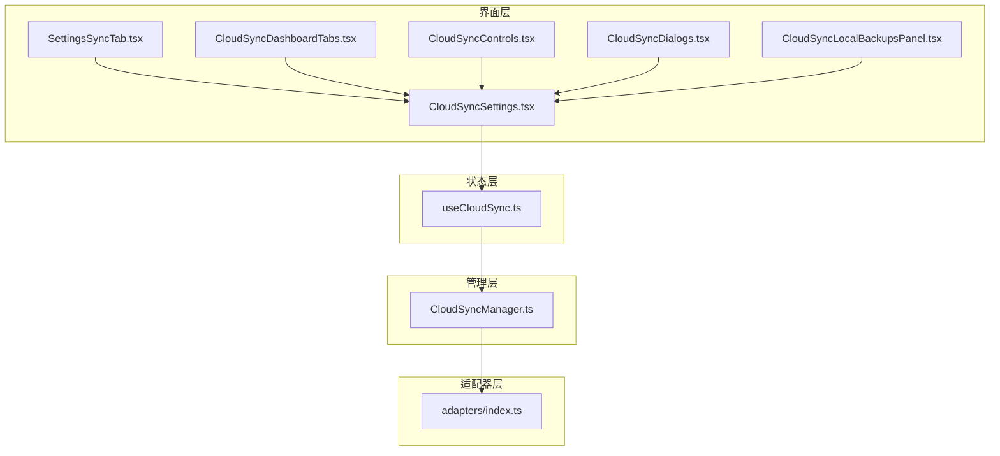
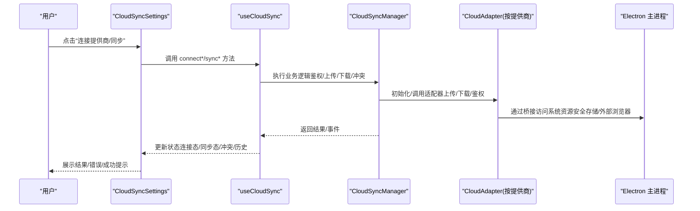
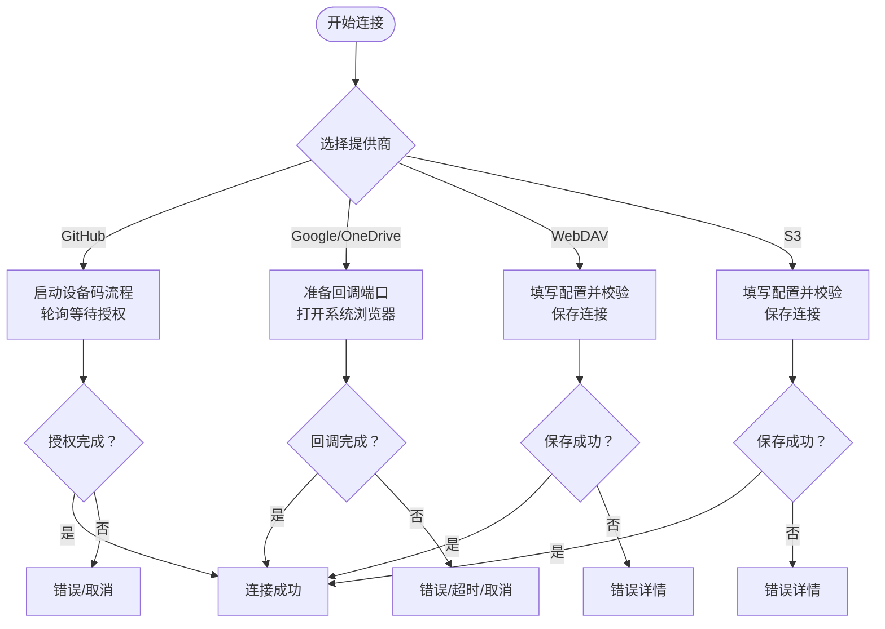
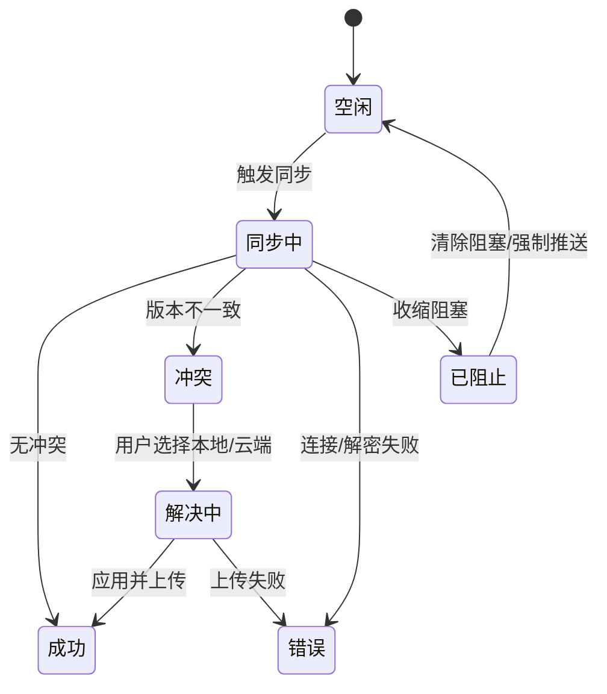
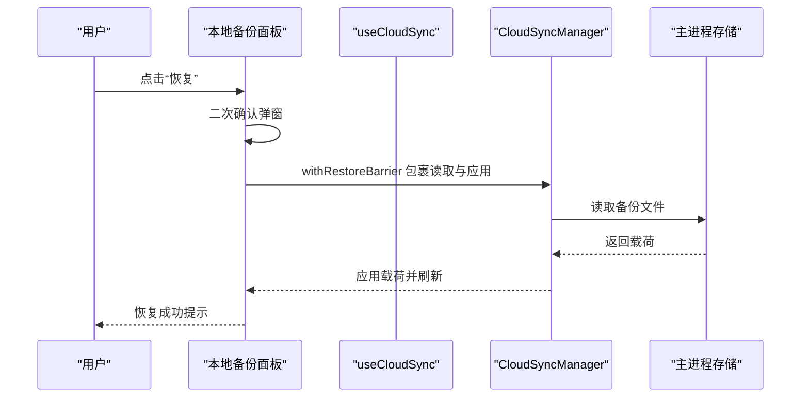
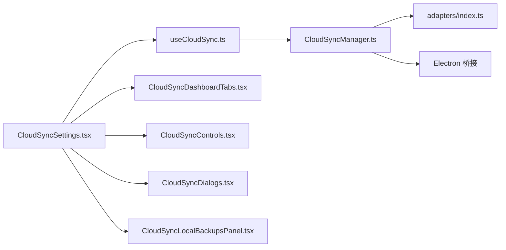

# 同步设置

<cite>
**本文引用的文件**
- [components/cloud-sync/CloudSyncSettings.tsx](file://components/cloud-sync/CloudSyncSettings.tsx)
- [components/cloud-sync/CloudSyncDashboardTabs.tsx](file://components/cloud-sync/CloudSyncDashboardTabs.tsx)
- [components/cloud-sync/CloudSyncControls.tsx](file://components/cloud-sync/CloudSyncControls.tsx)
- [components/cloud-sync/CloudSyncDialogs.tsx](file://components/cloud-sync/CloudSyncDialogs.tsx)
- [components/cloud-sync/CloudSyncLocalBackupsPanel.tsx](file://components/cloud-sync/CloudSyncLocalBackupsPanel.tsx)
- [components/settings/tabs/SettingsSyncTab.tsx](file://components/settings/tabs/SettingsSyncTab.tsx)
- [application/state/useCloudSync.ts](file://application/state/useCloudSync.ts)
- [infrastructure/services/CloudSyncManager.ts](file://infrastructure/services/CloudSyncManager.ts)
- [infrastructure/services/adapters/index.ts](file://infrastructure/services/adapters/index.ts)
- [application/state/settingsStateDefaults.ts](file://application/state/settingsStateDefaults.ts)
</cite>

## 目录
1. [简介](#简介)
2. [项目结构](#项目结构)
3. [核心组件](#核心组件)
4. [架构总览](#架构总览)
5. [详细组件分析](#详细组件分析)
6. [依赖关系分析](#依赖关系分析)
7. [性能考虑](#性能考虑)
8. [故障排除指南](#故障排除指南)
9. [结论](#结论)
10. [附录](#附录)

## 简介
本指南面向最终用户，系统讲解应用中的“同步设置”功能，涵盖以下主题：
- 云同步配置：支持 GitHub Gist、Google Drive、Microsoft OneDrive、WebDAV、S3 等云存储提供商的连接与配置。
- 同步策略：自动同步开关、同步频率、冲突检测与解决、三向合并与版本锚点。
- 备份与恢复：本地备份（含保留数量）、历史修订回滚、一键恢复、清理本地数据。
- 安全设置：主密钥（门禁）、密码强度校验、解锁/加解锁、跨窗口会话密码持久化。
- 同步状态监控：连接状态指示、最近同步时间、同步历史、错误日志与健康检查提示。
- 故障排除与性能优化：常见问题定位、网络错误映射、重试与取消机制、UI 响应优化。
- 最佳实践与数据安全：主密钥管理、最小权限原则、定期备份、升级迁移注意事项。

## 项目结构
同步设置由“界面层 + 状态钩子 + 管理器 + 适配器”四层构成：
- 界面层：负责用户交互、对话框、状态展示与操作入口。
- 状态钩子：封装 useCloudSync，统一暴露安全态、同步态、提供商连接态与操作方法。
- 管理器：CloudSyncManager 负责状态机、事件分发、自动同步调度、冲突检测与解决、历史记录与锚点。
- 适配器：各云提供商的上传/下载/鉴权实现，按需动态加载。

图示来源
- [components/cloud-sync/CloudSyncSettings.tsx:1-876](file://components/cloud-sync/CloudSyncSettings.tsx#L1-L876)
- [components/cloud-sync/CloudSyncDashboardTabs.tsx:1-279](file://components/cloud-sync/CloudSyncDashboardTabs.tsx#L1-L279)
- [components/cloud-sync/CloudSyncControls.tsx:1-624](file://components/cloud-sync/CloudSyncControls.tsx#L1-L624)
- [components/cloud-sync/CloudSyncDialogs.tsx:1-904](file://components/cloud-sync/CloudSyncDialogs.tsx#L1-L904)
- [components/cloud-sync/CloudSyncLocalBackupsPanel.tsx:1-445](file://components/cloud-sync/CloudSyncLocalBackupsPanel.tsx#L1-L445)
- [components/settings/tabs/SettingsSyncTab.tsx:1-101](file://components/settings/tabs/SettingsSyncTab.tsx#L1-L101)
- [application/state/useCloudSync.ts:1-768](file://application/state/useCloudSync.ts#L1-L768)
- [infrastructure/services/CloudSyncManager.ts:1-830](file://infrastructure/services/CloudSyncManager.ts#L1-L830)
- [infrastructure/services/adapters/index.ts:1-64](file://infrastructure/services/adapters/index.ts#L1-L64)

章节来源
- [components/cloud-sync/CloudSyncSettings.tsx:1-876](file://components/cloud-sync/CloudSyncSettings.tsx#L1-L876)
- [application/state/useCloudSync.ts:1-768](file://application/state/useCloudSync.ts#L1-L768)
- [infrastructure/services/CloudSyncManager.ts:1-830](file://infrastructure/services/CloudSyncManager.ts#L1-L830)
- [infrastructure/services/adapters/index.ts:1-64](file://infrastructure/services/adapters/index.ts#L1-L64)

## 核心组件
- CloudSyncSettings：同步设置主面板，聚合所有子组件，处理错误详情构建、网络错误映射、提供商互斥连接、冲突与历史修订对话框、WebDAV/S3 配置保存、一键改密与解锁弹窗、本地备份面板与清理本地数据确认。
- CloudSyncDashboardTabs：提供者卡片与状态页签，展示连接状态、最近同步时间、自动同步开关、版本号与历史列表、本地备份面板、清理本地数据入口。
- CloudSyncControls：通用控件库，包含门禁屏（主密钥设置）、提供商卡片、状态点、GitHub 设备码流程模态、冲突解决模态。
- CloudSyncDialogs：对话框集合，包含 GitHub 设备码、冲突解决、Gist 历史修订预览与恢复、WebDAV 配置、S3 配置、改密、解锁、强制推送确认、清理本地数据确认。
- CloudSyncLocalBackupsPanel：本地备份管理，支持最大保留数设置、打开备份目录、备份列表与恢复、恢复前的“两步确认”与跨窗口恢复屏障。
- SettingsSyncTab：设置页同步标签，负责构建/应用同步载荷（含端口转发规则与已知主机），并提供清理本地数据能力。
- useCloudSync：React Hook，封装安全态（NO_KEY/LOCKED/UNLOCKED）、同步态（IDLE/SYNCING/CONFLICT/ERROR/BLOCKED）、提供商连接态、自动同步开关与间隔、版本号与时间戳、同步历史、事件订阅、锁屏/解锁/改密、提供商连接/断开/取消、同步与冲突解决、Gist 历史与修订下载。
- CloudSyncManager：多云同步中枢，维护状态快照、事件系统、自动同步定时器、提供者适配器、冲突检测与解决、签名与锚点、历史记录、跨窗口同步、主密钥生命周期。
- adapters/index：统一适配器接口与工厂，按提供商动态创建适配器实例（GitHub、Google、OneDrive、WebDAV、S3）。

章节来源
- [components/cloud-sync/CloudSyncSettings.tsx:1-876](file://components/cloud-sync/CloudSyncSettings.tsx#L1-L876)
- [components/cloud-sync/CloudSyncDashboardTabs.tsx:1-279](file://components/cloud-sync/CloudSyncDashboardTabs.tsx#L1-L279)
- [components/cloud-sync/CloudSyncControls.tsx:1-624](file://components/cloud-sync/CloudSyncControls.tsx#L1-L624)
- [components/cloud-sync/CloudSyncDialogs.tsx:1-904](file://components/cloud-sync/CloudSyncDialogs.tsx#L1-L904)
- [components/cloud-sync/CloudSyncLocalBackupsPanel.tsx:1-445](file://components/cloud-sync/CloudSyncLocalBackupsPanel.tsx#L1-L445)
- [components/settings/tabs/SettingsSyncTab.tsx:1-101](file://components/settings/tabs/SettingsSyncTab.tsx#L1-L101)
- [application/state/useCloudSync.ts:1-768](file://application/state/useCloudSync.ts#L1-L768)
- [infrastructure/services/CloudSyncManager.ts:1-830](file://infrastructure/services/CloudSyncManager.ts#L1-L830)
- [infrastructure/services/adapters/index.ts:1-64](file://infrastructure/services/adapters/index.ts#L1-L64)

## 架构总览
下图展示从用户操作到云端/本地执行的整体流程与关键节点。

图示来源
- [components/cloud-sync/CloudSyncSettings.tsx:300-540](file://components/cloud-sync/CloudSyncSettings.tsx#L300-L540)
- [application/state/useCloudSync.ts:313-764](file://application/state/useCloudSync.ts#L313-L764)
- [infrastructure/services/CloudSyncManager.ts:406-721](file://infrastructure/services/CloudSyncManager.ts#L406-L721)
- [infrastructure/services/adapters/index.ts:33-63](file://infrastructure/services/adapters/index.ts#L33-L63)

章节来源
- [components/cloud-sync/CloudSyncSettings.tsx:300-540](file://components/cloud-sync/CloudSyncSettings.tsx#L300-L540)
- [application/state/useCloudSync.ts:313-764](file://application/state/useCloudSync.ts#L313-L764)
- [infrastructure/services/CloudSyncManager.ts:406-721](file://infrastructure/services/CloudSyncManager.ts#L406-L721)
- [infrastructure/services/adapters/index.ts:33-63](file://infrastructure/services/adapters/index.ts#L33-L63)

## 详细组件分析

### 云同步配置（GitHub/Google/OneDrive/WebDAV/S3）
- GitHub 设备码流程：启动后返回设备码与验证地址；轮询等待用户授权；完成后关闭模态并提示成功。
- Google/OneDrive PKCE 流程：准备回调端口，打开系统浏览器完成授权，后台等待回调完成认证。
- WebDAV：支持基础/摘要/令牌三种认证方式，可选择明文显示凭据、允许不安全连接；保存时进行必填项校验与端点标准化。
- S3：支持 endpoint、region、bucket、accessKeyId、secretAccessKey、sessionToken、prefix、forcePathStyle；保存时进行必填项校验与端点标准化。
- 提供商互斥：同一时刻仅允许一个提供商处于“连接中”，其他已连接提供商在新连接开始前会被断开，避免凭据冲突。

图示来源
- [components/cloud-sync/CloudSyncSettings.tsx:302-517](file://components/cloud-sync/CloudSyncSettings.tsx#L302-L517)
- [components/cloud-sync/CloudSyncDialogs.tsx:426-517](file://components/cloud-sync/CloudSyncDialogs.tsx#L426-L517)
- [application/state/useCloudSync.ts:313-595](file://application/state/useCloudSync.ts#L313-L595)

章节来源
- [components/cloud-sync/CloudSyncSettings.tsx:302-517](file://components/cloud-sync/CloudSyncSettings.tsx#L302-L517)
- [components/cloud-sync/CloudSyncDialogs.tsx:426-517](file://components/cloud-sync/CloudSyncDialogs.tsx#L426-L517)
- [application/state/useCloudSync.ts:313-595](file://application/state/useCloudSync.ts#L313-L595)

### 同步策略（频率、冲突、增量）
- 自动同步：可在“状态”页签开启/关闭，并设置同步间隔（分钟）。管理器内部维护定时器，周期性触发同步。
- 冲突检测与解决：当远端与本地版本不一致时进入冲突态；提供“保留本地/使用云端”两种解决方式；解决后可重新上传或直接应用云端数据。
- 三向合并与锚点：管理器维护每个提供商的“版本锚点”与“同步基线”，确保崩溃/中断后仍能正确恢复与合并。
- 历史记录：记录每次同步动作（上传/下载/解决）的时间、版本、设备名与错误信息，便于审计与排错。

图示来源
- [infrastructure/services/CloudSyncManager.ts:545-721](file://infrastructure/services/CloudSyncManager.ts#L545-L721)
- [application/state/useCloudSync.ts:254-266](file://application/state/useCloudSync.ts#L254-L266)

章节来源
- [infrastructure/services/CloudSyncManager.ts:545-721](file://infrastructure/services/CloudSyncManager.ts#L545-L721)
- [application/state/useCloudSync.ts:254-266](file://application/state/useCloudSync.ts#L254-L266)

### 备份与恢复（本地/云端/迁移）
- 本地备份：
  - 保留数量：支持设置最大保留数（1..100），超出范围将拒绝保存并提示。
  - 列表与恢复：点击“恢复”进入二次确认，执行跨窗口恢复屏障，防止并发写入导致数据损坏。
  - 打开目录与刷新：支持打开备份目录与手动刷新列表。
- 云端备份（GitHub Gist）：
  - 历史修订：查看修订列表，支持预览实体数量，一键恢复至指定版本。
  - 解密失败：若因主密钥不同导致解密失败，会提示相应错误。
- 数据迁移：
  - 通过构建/应用同步载荷实现跨设备/跨平台的数据迁移；迁移前建议先做本地备份。

图示来源
- [components/cloud-sync/CloudSyncLocalBackupsPanel.tsx:138-176](file://components/cloud-sync/CloudSyncLocalBackupsPanel.tsx#L138-L176)
- [components/cloud-sync/CloudSyncDialogs.tsx:647-658](file://components/cloud-sync/CloudSyncDialogs.tsx#L647-L658)
- [components/settings/tabs/SettingsSyncTab.tsx:40-83](file://components/settings/tabs/SettingsSyncTab.tsx#L40-L83)

章节来源
- [components/cloud-sync/CloudSyncLocalBackupsPanel.tsx:82-176](file://components/cloud-sync/CloudSyncLocalBackupsPanel.tsx#L82-L176)
- [components/cloud-sync/CloudSyncDialogs.tsx:601-658](file://components/cloud-sync/CloudSyncDialogs.tsx#L601-L658)
- [components/settings/tabs/SettingsSyncTab.tsx:40-83](file://components/settings/tabs/SettingsSyncTab.tsx#L40-L83)

### 同步安全设置（加密、访问权限、数据保护）
- 主密钥（门禁）：首次使用需设置主密钥（至少8位），后续可通过“改密”更新；支持一次性解锁与跨窗口会话密码持久化。
- 加密与解密：所有同步数据均以加密形式存储于云端；解密失败将导致无法读取或应用远程数据。
- 权限与最小暴露：Google/OneDrive 使用 PKCE 授权，GitHub 使用设备码；WebDAV/S3 采用自定义凭据，避免泄露。
- 跨窗口一致性：通过“恢复屏障”与“状态快照”保证多窗口并发场景下的数据一致性与原子性。

章节来源
- [components/cloud-sync/CloudSyncControls.tsx:120-261](file://components/cloud-sync/CloudSyncControls.tsx#L120-L261)
- [components/cloud-sync/CloudSyncDialogs.tsx:608-726](file://components/cloud-sync/CloudSyncDialogs.tsx#L608-L726)
- [application/state/useCloudSync.ts:272-310](file://application/state/useCloudSync.ts#L272-L310)
- [infrastructure/services/CloudSyncManager.ts:290-317](file://infrastructure/services/CloudSyncManager.ts#L290-L317)

### 同步状态监控（进度、错误日志、健康检查）
- 状态点与颜色：根据提供商连接/同步/错误/阻塞状态显示不同颜色点，直观反映当前健康度。
- 最近同步时间：显示上次同步的相对时间与具体时间，支持“从未同步”“刚刚”“几分钟前”等人性化格式。
- 同步历史：记录每次动作类型、版本、设备名与错误信息，支持展开查看错误详情。
- 健康检查：当检测到收缩阻塞（如文件过小被拒）时，显示横幅提示并提供“恢复/强制推送”选项。

章节来源
- [components/cloud-sync/CloudSyncControls.tsx:94-114](file://components/cloud-sync/CloudSyncControls.tsx#L94-L114)
- [components/cloud-sync/CloudSyncDashboardTabs.tsx:161-249](file://components/cloud-sync/CloudSyncDashboardTabs.tsx#L161-L249)
- [infrastructure/services/CloudSyncManager.ts:133-139](file://infrastructure/services/CloudSyncManager.ts#L133-L139)

## 依赖关系分析
- 组件耦合：
  - CloudSyncSettings 是枢纽，协调 useCloudSync、CloudSyncDashboardTabs、CloudSyncControls、CloudSyncDialogs、CloudSyncLocalBackupsPanel。
  - useCloudSync 将 UI 与 CloudSyncManager 解耦，通过 useSyncExternalStore 实时同步状态。
- 外部依赖：
  - Electron 桥接用于系统浏览器打开、安全存储、OAuth 回调、崩溃日志等。
  - 各云提供商 SDK/HTTP 客户端由适配器封装，统一上传/下载/鉴权接口。
- 循环依赖：
  - 管理器内部通过模块化拆分（authMethods、providerSyncMethods、syncAllStorageMethods、stateAndSecurityMethods）避免循环引用。

图示来源
- [components/cloud-sync/CloudSyncSettings.tsx:1-876](file://components/cloud-sync/CloudSyncSettings.tsx#L1-L876)
- [application/state/useCloudSync.ts:1-768](file://application/state/useCloudSync.ts#L1-L768)
- [infrastructure/services/CloudSyncManager.ts:1-830](file://infrastructure/services/CloudSyncManager.ts#L1-L830)
- [infrastructure/services/adapters/index.ts:1-64](file://infrastructure/services/adapters/index.ts#L1-L64)

章节来源
- [components/cloud-sync/CloudSyncSettings.tsx:1-876](file://components/cloud-sync/CloudSyncSettings.tsx#L1-L876)
- [application/state/useCloudSync.ts:1-768](file://application/state/useCloudSync.ts#L1-L768)
- [infrastructure/services/CloudSyncManager.ts:1-830](file://infrastructure/services/CloudSyncManager.ts#L1-L830)
- [infrastructure/services/adapters/index.ts:1-64](file://infrastructure/services/adapters/index.ts#L1-L64)

## 性能考虑
- 自动同步频率：建议根据网络环境与设备性能设置合理间隔，避免频繁轮询造成资源占用。
- 并发控制：同一时刻仅允许一个提供商处于“连接中”，减少凭据竞争与资源争用。
- UI 响应：长耗时操作（如轮询、下载、解密）使用加载态与取消按钮，提升用户体验。
- 存储与序列化：状态快照深拷贝以确保 React 正确感知变更；历史记录与锚点采用键值存储，避免重复计算。

## 故障排除指南
- 网络错误映射：
  - GitHub 设备码：连接超时/网络错误映射为友好提示，避免显示底层异常栈。
  - WebDAV/S3：保存失败时输出上下文详情（端点、区域、桶、路径风格等），便于快速定位。
- 取消与重试：
  - 支持取消正在进行的 OAuth 流程（GitHub 设备码轮询、Google/OneDrive 回调）。
  - 提供“重新尝试”与“切换提供商”的路径，避免卡死在“连接中”状态。
- 冲突与阻塞：
  - 冲突解决后自动重新上传；若上传失败，保持模态以便用户重试或选择另一方案。
  - 收缩阻塞时提供“清除阻塞/强制推送”选项，必要时可绕过限制但需谨慎评估风险。
- 本地备份：
  - 若加密不可用（主进程拒绝），面板会提示不可用；修复后方可启用。
  - 恢复前二次确认与跨窗口恢复屏障可避免误操作导致的数据丢失。

章节来源
- [components/cloud-sync/CloudSyncSettings.tsx:98-108](file://components/cloud-sync/CloudSyncSettings.tsx#L98-L108)
- [components/cloud-sync/CloudSyncDialogs.tsx:426-517](file://components/cloud-sync/CloudSyncDialogs.tsx#L426-L517)
- [components/cloud-sync/CloudSyncLocalBackupsPanel.tsx:186-202](file://components/cloud-sync/CloudSyncLocalBackupsPanel.tsx#L186-L202)
- [application/state/useCloudSync.ts:363-595](file://application/state/useCloudSync.ts#L363-L595)

## 结论
本同步设置体系以“端到端加密 + 多云适配 + 强健的状态机 + 丰富的 UI 与工具链”为核心，覆盖从连接配置、策略设定、冲突处理、备份恢复到安全与监控的完整闭环。遵循最佳实践与故障排除建议，可显著提升数据安全性与用户体验。

## 附录
- 设置默认值参考：终端字体、SFTP 自动同步默认关闭、压缩上传默认开启等，有助于理解默认行为与可调整项。
- 术语说明：
  - “门禁”：指主密钥未设置时的初始状态。
  - “锁定/解锁”：指主密钥存在但未解锁或已解锁。
  - “收缩阻塞”：指因文件大小/内容特征被系统判定为可疑而暂时阻塞同步。

章节来源
- [application/state/settingsStateDefaults.ts:51-53](file://application/state/settingsStateDefaults.ts#L51-L53)
- [application/state/settingsStateDefaults.ts:52-54](file://application/state/settingsStateDefaults.ts#L52-L54)
- [application/state/settingsStateDefaults.ts:53-55](file://application/state/settingsStateDefaults.ts#L53-L55)