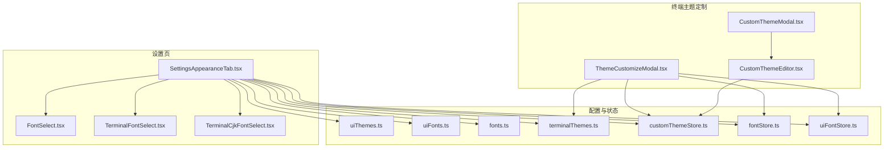
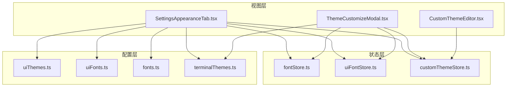
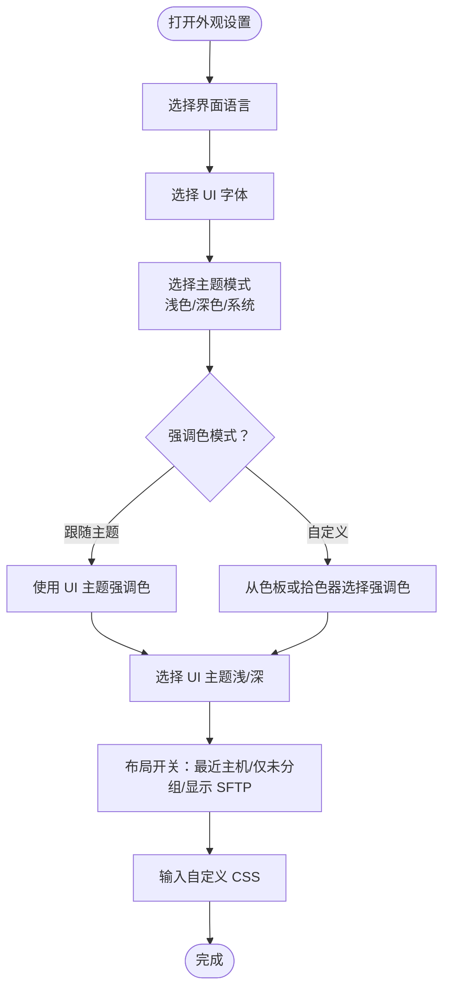
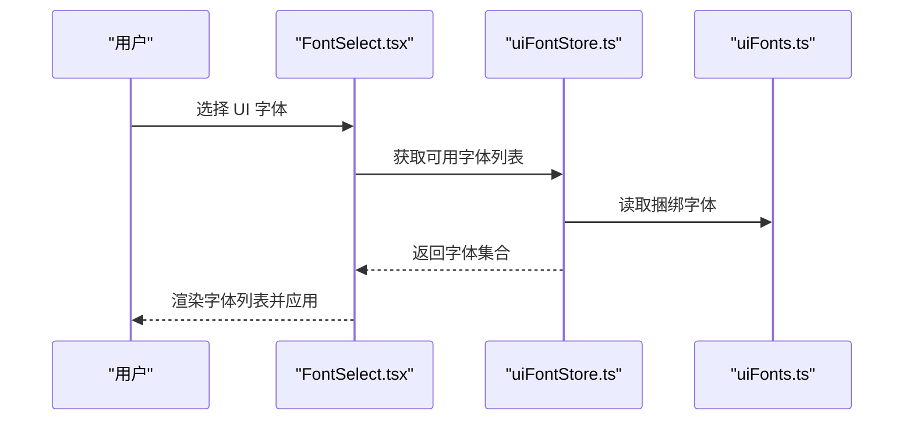
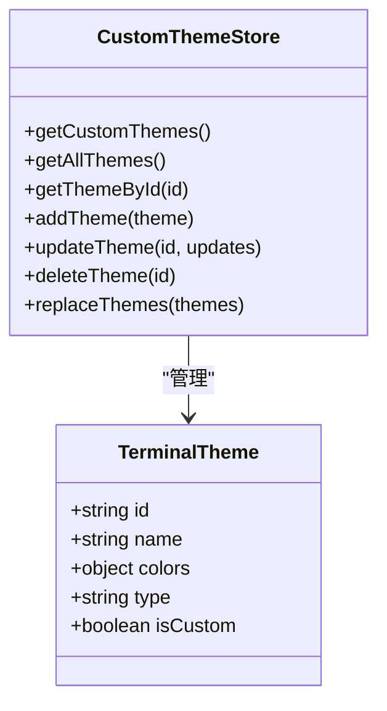
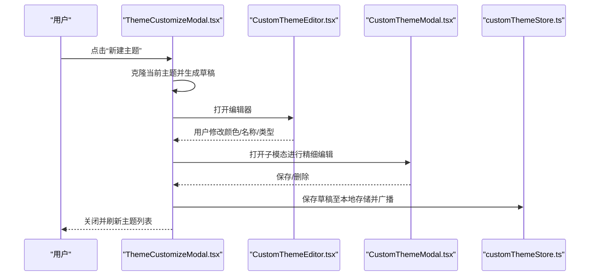
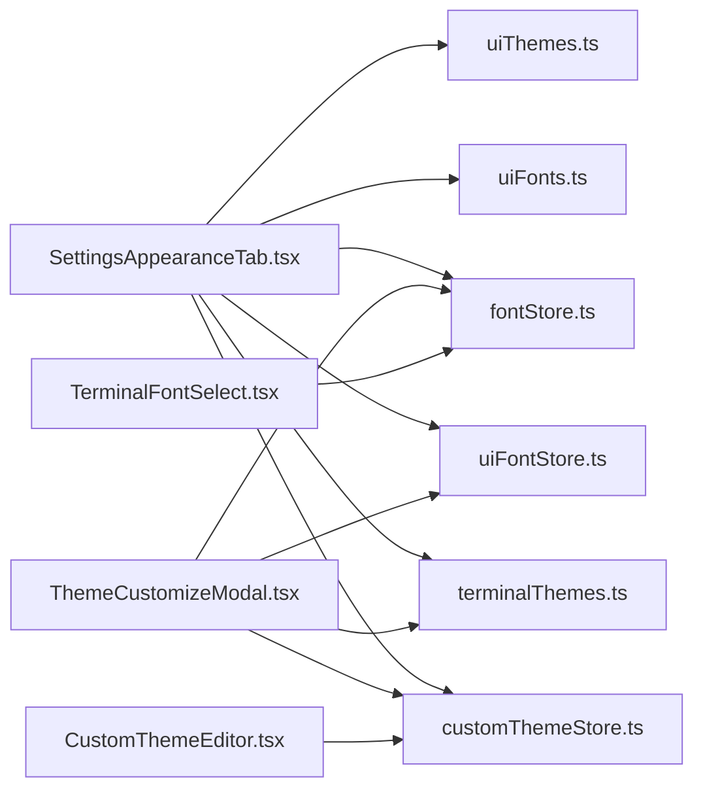

# 外观设置

<cite>
**本文引用的文件**
- [SettingsAppearanceTab.tsx](file://components/settings/tabs/SettingsAppearanceTab.tsx)
- [FontSelect.tsx](file://components/settings/FontSelect.tsx)
- [TerminalFontSelect.tsx](file://components/settings/TerminalFontSelect.tsx)
- [TerminalCjkFontSelect.tsx](file://components/settings/TerminalCjkFontSelect.tsx)
- [uiThemes.ts](file://infrastructure/config/uiThemes.ts)
- [uiFonts.ts](file://infrastructure/config/uiFonts.ts)
- [fonts.ts](file://infrastructure/config/fonts.ts)
- [terminalThemes.ts](file://infrastructure/config/terminalThemes.ts)
- [customThemeStore.ts](file://application/state/customThemeStore.ts)
- [ThemeCustomizeModal.tsx](file://components/terminal/ThemeCustomizeModal.tsx)
- [CustomThemeEditor.tsx](file://components/terminal/CustomThemeEditor.tsx)
- [CustomThemeModal.tsx](file://components/terminal/CustomThemeModal.tsx)
- [fontStore.ts](file://application/state/fontStore.ts)
- [uiFontStore.ts](file://application/state/uiFontStore.ts)
</cite>

## 目录
1. [简介](#简介)
2. [项目结构](#项目结构)
3. [核心组件](#核心组件)
4. [架构总览](#架构总览)
5. [详细组件分析](#详细组件分析)
6. [依赖关系分析](#依赖关系分析)
7. [性能考量](#性能考量)
8. [故障排查指南](#故障排查指南)
9. [结论](#结论)
10. [附录](#附录)

## 简介
本指南面向使用者与维护者，系统性讲解 Netcatty 的外观设置功能，涵盖以下方面：
- 主题系统：深色/浅色主题切换、UI 主题选择、强调色配置与自定义、自定义 CSS 覆盖
- 字体系统：UI 字体与终端字体选择、中文字体支持、字体大小调整
- 界面布局：侧边栏显示、最近主机显示、分组显示模式等
- 终端主题：内置主题、自定义主题创建与编辑、.itermcolors 导入、实时预览与保存
- 主题导入导出与分享：通过 .itermcolors 文件导入自定义主题
- 实时预览与效果演示：所见即所得的即时反馈

## 项目结构
外观设置相关代码主要分布在以下模块：
- 设置页外观标签：负责语言、UI 字体、主题、强调色、自定义 CSS、界面布局开关等
- 字体选择组件：UI 字体选择、终端字体选择（含本地字体可用性检测）、CJK 终端字体选择
- 主题配置：UI 主题集合、终端主题集合、自定义主题存储与持久化
- 终端主题定制模态：主题列表、字体与字号控制、自定义主题编辑器、.itermcolors 导入与保存

图表来源
- [SettingsAppearanceTab.tsx:12-321](file://components/settings/tabs/SettingsAppearanceTab.tsx#L12-L321)
- [FontSelect.tsx:15-78](file://components/settings/FontSelect.tsx#L15-L78)
- [TerminalFontSelect.tsx:22-116](file://components/settings/TerminalFontSelect.tsx#L22-L116)
- [TerminalCjkFontSelect.tsx:42-154](file://components/settings/TerminalCjkFontSelect.tsx#L42-L154)
- [uiThemes.ts:29-389](file://infrastructure/config/uiThemes.ts#L29-L389)
- [uiFonts.ts:36-147](file://infrastructure/config/uiFonts.ts#L36-L147)
- [fonts.ts:18-103](file://infrastructure/config/fonts.ts#L18-L103)
- [terminalThemes.ts:28-43](file://infrastructure/config/terminalThemes.ts#L28-L43)
- [customThemeStore.ts:22-141](file://application/state/customThemeStore.ts#L22-L141)
- [fontStore.ts:19-118](file://application/state/fontStore.ts#L19-L118)
- [uiFontStore.ts:24-149](file://application/state/uiFontStore.ts#L24-L149)
- [ThemeCustomizeModal.tsx:277-815](file://components/terminal/ThemeCustomizeModal.tsx#L277-L815)
- [CustomThemeEditor.tsx:109-188](file://components/terminal/CustomThemeEditor.tsx#L109-L188)
- [CustomThemeModal.tsx:92-231](file://components/terminal/CustomThemeModal.tsx#L92-L231)

章节来源
- [SettingsAppearanceTab.tsx:12-321](file://components/settings/tabs/SettingsAppearanceTab.tsx#L12-L321)
- [uiThemes.ts:29-389](file://infrastructure/config/uiThemes.ts#L29-L389)
- [fonts.ts:18-103](file://infrastructure/config/fonts.ts#L18-L103)
- [terminalThemes.ts:28-43](file://infrastructure/config/terminalThemes.ts#L28-L43)
- [customThemeStore.ts:22-141](file://application/state/customThemeStore.ts#L22-L141)
- [fontStore.ts:19-118](file://application/state/fontStore.ts#L19-L118)
- [uiFontStore.ts:24-149](file://application/state/uiFontStore.ts#L24-L149)
- [ThemeCustomizeModal.tsx:277-815](file://components/terminal/ThemeCustomizeModal.tsx#L277-L815)
- [CustomThemeEditor.tsx:109-188](file://components/terminal/CustomThemeEditor.tsx#L109-L188)
- [CustomThemeModal.tsx:92-231](file://components/terminal/CustomThemeModal.tsx#L92-L231)

## 核心组件
- 外观设置标签页：提供语言、UI 字体、主题、强调色、UI 主题、界面布局开关、自定义 CSS 等配置入口
- 字体选择组件：
  - UI 字体选择：基于系统字体与捆绑字体，支持中文字体回退栈
  - 终端字体选择：结合本地字体可用性检测，过滤不可用字体
  - CJK 终端字体选择：仅展示真等宽 CJK 字体，避免比例字体导致的网格错位
- 主题配置：
  - UI 主题：浅色与深色主题集合，支持按 ID 快速定位
  - 终端主题：内置主题集合与 UI 匹配主题集合，支持自定义主题持久化
- 自定义主题存储：本地存储 + 跨窗口同步，支持增删改与批量替换
- 终端主题定制模态：左右分栏，左侧列表/操作，右侧大屏预览；支持新建、编辑、导入 .itermcolors、保存

章节来源
- [SettingsAppearanceTab.tsx:12-321](file://components/settings/tabs/SettingsAppearanceTab.tsx#L12-L321)
- [FontSelect.tsx:15-78](file://components/settings/FontSelect.tsx#L15-L78)
- [TerminalFontSelect.tsx:22-116](file://components/settings/TerminalFontSelect.tsx#L22-L116)
- [TerminalCjkFontSelect.tsx:42-154](file://components/settings/TerminalCjkFontSelect.tsx#L42-L154)
- [uiThemes.ts:29-389](file://infrastructure/config/uiThemes.ts#L29-L389)
- [fonts.ts:18-103](file://infrastructure/config/fonts.ts#L18-L103)
- [terminalThemes.ts:28-43](file://infrastructure/config/terminalThemes.ts#L28-L43)
- [customThemeStore.ts:22-141](file://application/state/customThemeStore.ts#L22-L141)
- [ThemeCustomizeModal.tsx:277-815](file://components/terminal/ThemeCustomizeModal.tsx#L277-L815)

## 架构总览
外观设置的实现采用“配置 + 状态 + 视图”的分层设计：
- 配置层：集中于 infrastructure/config 下的主题与字体配置
- 状态层：application/state 提供字体与自定义主题的状态管理与持久化
- 视图层：components/settings 与 components/terminal 提供交互与预览

图表来源
- [SettingsAppearanceTab.tsx:12-321](file://components/settings/tabs/SettingsAppearanceTab.tsx#L12-L321)
- [ThemeCustomizeModal.tsx:277-815](file://components/terminal/ThemeCustomizeModal.tsx#L277-L815)
- [CustomThemeEditor.tsx:109-188](file://components/terminal/CustomThemeEditor.tsx#L109-L188)
- [fontStore.ts:19-118](file://application/state/fontStore.ts#L19-L118)
- [uiFontStore.ts:24-149](file://application/state/uiFontStore.ts#L24-L149)
- [customThemeStore.ts:22-141](file://application/state/customThemeStore.ts#L22-L141)
- [uiThemes.ts:29-389](file://infrastructure/config/uiThemes.ts#L29-L389)
- [uiFonts.ts:36-147](file://infrastructure/config/uiFonts.ts#L36-L147)
- [fonts.ts:18-103](file://infrastructure/config/fonts.ts#L18-L103)
- [terminalThemes.ts:28-43](file://infrastructure/config/terminalThemes.ts#L28-L43)

## 详细组件分析

### 外观设置标签页（SettingsAppearanceTab）
- 功能要点
  - 语言选择：支持多语言切换
  - UI 字体选择：使用 FontSelect，展示可用字体并应用到界面
  - 主题模式：浅色/深色/系统跟随三态切换
  - 强调色：支持“跟随主题”或“自定义”，内置一组 HSL 色板，支持拾色器
  - UI 主题：分别提供浅色与深色主题色板，点击即选
  - 界面布局：最近主机显示、仅根目录显示未分组主机、SFTP 标签显示
  - 自定义 CSS：文本域输入，用于覆盖样式
- 实现机制
  - 使用 useAvailableUIFonts 获取可用 UI 字体
  - 使用 HSL 值进行强调色与主题色板渲染
  - 布局开关通过 Toggle 控制布尔值

图表来源
- [SettingsAppearanceTab.tsx:12-321](file://components/settings/tabs/SettingsAppearanceTab.tsx#L12-L321)

章节来源
- [SettingsAppearanceTab.tsx:12-321](file://components/settings/tabs/SettingsAppearanceTab.tsx#L12-L321)
- [FontSelect.tsx:15-78](file://components/settings/FontSelect.tsx#L15-L78)
- [uiThemes.ts:29-389](file://infrastructure/config/uiThemes.ts#L29-L389)
- [uiFonts.ts:36-147](file://infrastructure/config/uiFonts.ts#L36-L147)

### 字体系统（UI 字体与终端字体）
- UI 字体
  - 基于 uiFonts.ts 的捆绑字体集合，并自动附加 CJK 回退栈
  - uiFontStore.ts 负责加载系统字体并通过 Local Font Access API 去重与补充
  - FontSelect.tsx 展示字体名称与预览效果
- 终端字体
  - fonts.ts 定义终端可用字体清单（仅真等宽字体）
  - fontStore.ts 初始化字体加载，合并默认与本地字体，去重并缓存
  - TerminalFontSelect.tsx 结合字体可用性检测，仅显示已安装字体
  - TerminalCjkFontSelect.tsx 专门列出真等宽 CJK 字体，避免比例字体破坏网格
- 字号控制
  - ThemeCustomizeModal.tsx 提供字体大小加减控件，范围受 MIN/MAX 限制

图表来源
- [FontSelect.tsx:15-78](file://components/settings/FontSelect.tsx#L15-L78)
- [uiFontStore.ts:24-149](file://application/state/uiFontStore.ts#L24-L149)
- [uiFonts.ts:36-147](file://infrastructure/config/uiFonts.ts#L36-L147)

章节来源
- [uiFonts.ts:36-147](file://infrastructure/config/uiFonts.ts#L36-L147)
- [uiFontStore.ts:24-149](file://application/state/uiFontStore.ts#L24-L149)
- [FontSelect.tsx:15-78](file://components/settings/FontSelect.tsx#L15-L78)
- [fonts.ts:18-103](file://infrastructure/config/fonts.ts#L18-L103)
- [fontStore.ts:19-118](file://application/state/fontStore.ts#L19-L118)
- [TerminalFontSelect.tsx:22-116](file://components/settings/TerminalFontSelect.tsx#L22-L116)
- [TerminalCjkFontSelect.tsx:42-154](file://components/settings/TerminalCjkFontSelect.tsx#L42-L154)
- [ThemeCustomizeModal.tsx:710-736](file://components/terminal/ThemeCustomizeModal.tsx#L710-L736)

### 主题系统（UI 主题与终端主题）
- UI 主题
  - uiThemes.ts 提供浅色与深色主题集合，每个主题以 HSL 形式的 tokens 表达
  - SettingsAppearanceTab.tsx 使用色板渲染与切换
- 终端主题
  - terminalThemes.ts 汇总内置主题，区分 UI 匹配主题与普通主题
  - customThemeStore.ts 管理自定义主题：增删改查、批量替换、跨窗口同步
  - ThemeCustomizeModal.tsx 展示主题列表、实时预览、新建/编辑/导入/保存

图表来源
- [customThemeStore.ts:22-141](file://application/state/customThemeStore.ts#L22-L141)
- [terminalThemes.ts:28-43](file://infrastructure/config/terminalThemes.ts#L28-L43)

章节来源
- [uiThemes.ts:29-389](file://infrastructure/config/uiThemes.ts#L29-L389)
- [SettingsAppearanceTab.tsx:12-321](file://components/settings/tabs/SettingsAppearanceTab.tsx#L12-L321)
- [terminalThemes.ts:28-43](file://infrastructure/config/terminalThemes.ts#L28-L43)
- [customThemeStore.ts:22-141](file://application/state/customThemeStore.ts#L22-L141)
- [ThemeCustomizeModal.tsx:277-815](file://components/terminal/ThemeCustomizeModal.tsx#L277-L815)

### 自定义主题创建与编辑
- 创建新主题：克隆当前主题，生成唯一 ID，进入编辑器
- 编辑器：支持修改名称、类型（明/暗）、各 ANSI 颜色通道；支持十六进制输入与拾色器
- 实时预览：右侧大屏预览终端效果；子模态提供更紧凑的编辑面板
- 导入 .itermcolors：解析 XML 并注入为自定义主题
- 保存：对比草稿与原始自定义主题差异，执行新增/更新/删除

图表来源
- [ThemeCustomizeModal.tsx:389-492](file://components/terminal/ThemeCustomizeModal.tsx#L389-L492)
- [CustomThemeEditor.tsx:109-188](file://components/terminal/CustomThemeEditor.tsx#L109-L188)
- [CustomThemeModal.tsx:92-231](file://components/terminal/CustomThemeModal.tsx#L92-L231)
- [customThemeStore.ts:109-141](file://application/state/customThemeStore.ts#L109-L141)

章节来源
- [ThemeCustomizeModal.tsx:389-492](file://components/terminal/ThemeCustomizeModal.tsx#L389-L492)
- [CustomThemeEditor.tsx:109-188](file://components/terminal/CustomThemeEditor.tsx#L109-L188)
- [CustomThemeModal.tsx:92-231](file://components/terminal/CustomThemeModal.tsx#L92-L231)
- [customThemeStore.ts:109-141](file://application/state/customThemeStore.ts#L109-L141)

## 依赖关系分析
- 外观设置标签页依赖 UI 主题与 UI 字体配置，以及字体加载状态
- 终端主题定制依赖终端主题集合与自定义主题存储
- 字体选择组件依赖字体可用性检测与字体加载状态
- 自定义主题存储依赖本地存储与跨窗口 IPC 同步

图表来源
- [SettingsAppearanceTab.tsx:12-321](file://components/settings/tabs/SettingsAppearanceTab.tsx#L12-L321)
- [ThemeCustomizeModal.tsx:277-815](file://components/terminal/ThemeCustomizeModal.tsx#L277-L815)
- [TerminalFontSelect.tsx:22-116](file://components/settings/TerminalFontSelect.tsx#L22-L116)
- [CustomThemeEditor.tsx:109-188](file://components/terminal/CustomThemeEditor.tsx#L109-L188)
- [uiThemes.ts:29-389](file://infrastructure/config/uiThemes.ts#L29-L389)
- [uiFonts.ts:36-147](file://infrastructure/config/uiFonts.ts#L36-L147)
- [fonts.ts:18-103](file://infrastructure/config/fonts.ts#L18-L103)
- [terminalThemes.ts:28-43](file://infrastructure/config/terminalThemes.ts#L28-L43)
- [customThemeStore.ts:22-141](file://application/state/customThemeStore.ts#L22-L141)
- [fontStore.ts:19-118](file://application/state/fontStore.ts#L19-L118)
- [uiFontStore.ts:24-149](file://application/state/uiFontStore.ts#L24-L149)

章节来源
- [SettingsAppearanceTab.tsx:12-321](file://components/settings/tabs/SettingsAppearanceTab.tsx#L12-L321)
- [ThemeCustomizeModal.tsx:277-815](file://components/terminal/ThemeCustomizeModal.tsx#L277-L815)
- [TerminalFontSelect.tsx:22-116](file://components/settings/TerminalFontSelect.tsx#L22-L116)
- [CustomThemeEditor.tsx:109-188](file://components/terminal/CustomThemeEditor.tsx#L109-L188)
- [uiThemes.ts:29-389](file://infrastructure/config/uiThemes.ts#L29-L389)
- [uiFonts.ts:36-147](file://infrastructure/config/uiFonts.ts#L36-L147)
- [fonts.ts:18-103](file://infrastructure/config/fonts.ts#L18-L103)
- [terminalThemes.ts:28-43](file://infrastructure/config/terminalThemes.ts#L28-L43)
- [customThemeStore.ts:22-141](file://application/state/customThemeStore.ts#L22-L141)
- [fontStore.ts:19-118](file://application/state/fontStore.ts#L19-L118)
- [uiFontStore.ts:24-149](file://application/state/uiFontStore.ts#L24-L149)

## 性能考量
- 字体加载策略
  - 字体加载采用 useSyncExternalStore 模式，首次使用触发初始化，避免重复加载
  - 本地字体查询通过 Local Font Access API 并行获取，提升可用性检测效率
- 自定义主题存储
  - 本地存储与跨窗口同步分离，变更后仅广播增量，减少不必要的重绘
  - 缓存合并后的主题数组，降低渲染抖动
- 实时预览
  - 终端主题与字体变更即时回调，避免阻塞主线程
  - 预览组件使用 memo 包裹，减少不必要重渲染

## 故障排查指南
- 字体未显示或无法选择
  - 检查字体可用性检测是否启用，确认浏览器支持 Local Font Access API
  - 若字体被过滤，请确认字体确实在系统中安装
- CJK 显示异常
  - 请使用 TerminalCjkFontSelect 中推荐的真等宽字体，避免比例字体导致的字符宽度问题
- 自定义主题未生效
  - 确认主题已保存并处于草稿列表中
  - 检查是否存在同名主题冲突或 ID 重复
- .itermcolors 导入失败
  - 确认文件为有效的 .itermcolors XML 格式
  - 查看控制台错误信息，确保文件可读且内容完整

章节来源
- [fontStore.ts:55-106](file://application/state/fontStore.ts#L55-L106)
- [uiFontStore.ts:53-93](file://application/state/uiFontStore.ts#L53-L93)
- [TerminalCjkFontSelect.tsx:73-92](file://components/settings/TerminalCjkFontSelect.tsx#L73-L92)
- [ThemeCustomizeModal.tsx:407-432](file://components/terminal/ThemeCustomizeModal.tsx#L407-L432)
- [customThemeStore.ts:34-44](file://application/state/customThemeStore.ts#L34-L44)

## 结论
外观设置提供了从 UI 到终端的全链路个性化能力：主题与强调色、字体与字号、布局与 CSS 覆盖，以及自定义主题的创建、编辑与导入。通过实时预览与稳定的配置持久化，用户可以快速获得理想的视觉体验。

## 附录
- 术语说明
  - HSL：色相、饱和度、亮度，用于统一表达 UI 主题与强调色
  - CJK：中文、日文、韩文，终端中需使用真等宽字体保证字符网格对齐
  - UI 主题：应用界面的整体配色方案
  - 终端主题：命令行终端的颜色方案
- 最佳实践
  - 优先使用真等宽 CJK 字体，避免比例字体导致的显示错位
  - 自定义主题建议先在编辑器中微调，再保存到草稿列表统一管理
  - 使用“系统”主题模式以适配系统深色/浅色偏好