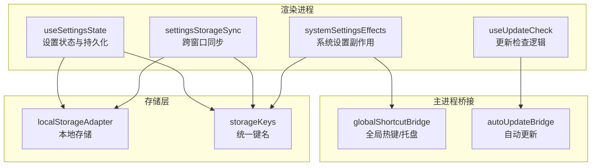
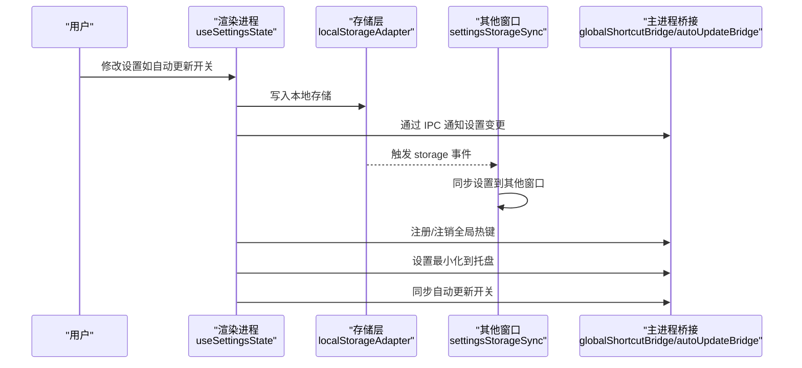
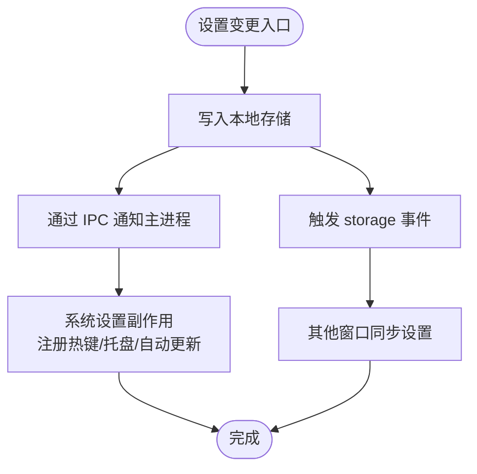
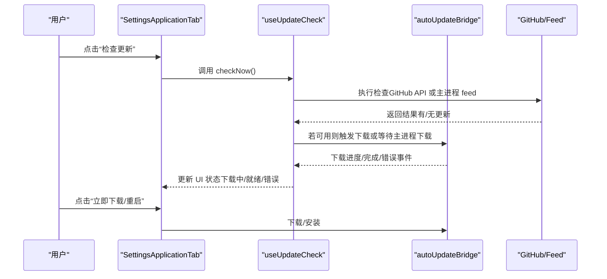
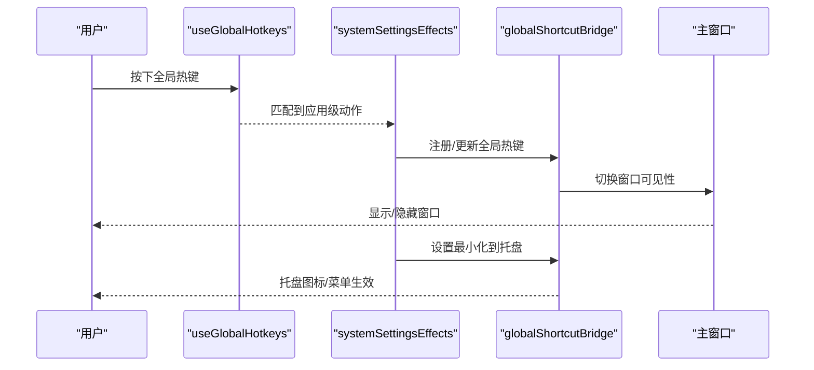
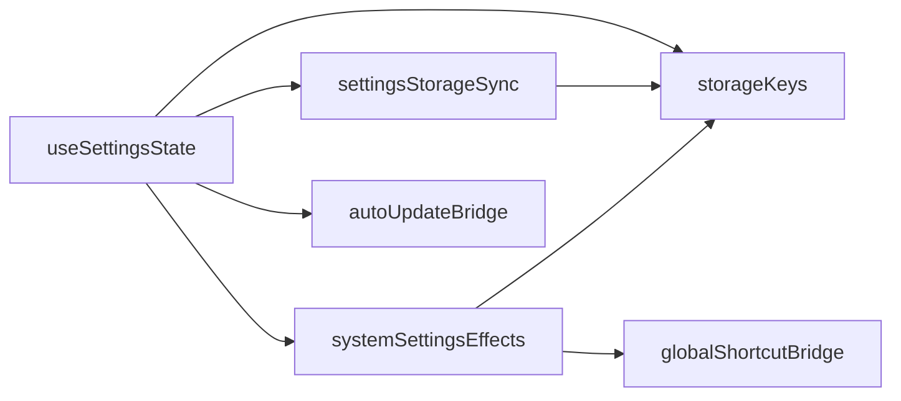

# 应用程序设置

<cite>
**本文档引用的文件**
- [settingsStateDefaults.ts](file://application/state/settingsStateDefaults.ts)
- [useSettingsState.ts](file://application/state/useSettingsState.ts)
- [systemSettingsEffects.ts](file://application/state/systemSettingsEffects.ts)
- [settingsStorageSync.ts](file://application/state/settingsStorageSync.ts)
- [storageKeys.ts](file://infrastructure/config/storageKeys.ts)
- [useUpdateCheck.ts](file://application/state/useUpdateCheck.ts)
- [SettingsApplicationTab.tsx](file://components/SettingsApplicationTab.tsx)
- [useWindowControls.ts](file://application/state/useWindowControls.ts)
- [useGlobalHotkeys.ts](file://application/state/useGlobalHotkeys.ts)
- [useApplicationBackend.ts](file://application/state/useApplicationBackend.ts)
- [globalShortcutBridge.cjs](file://electron/bridges/globalShortcutBridge.cjs)
- [autoUpdateBridge.cjs](file://electron/bridges/autoUpdateBridge.cjs)
</cite>

## 目录
1. [简介](#简介)
2. [项目结构](#项目结构)
3. [核心组件](#核心组件)
4. [架构总览](#架构总览)
5. [详细组件分析](#详细组件分析)
6. [依赖关系分析](#依赖关系分析)
7. [性能考量](#性能考量)
8. [故障排除指南](#故障排除指南)
9. [结论](#结论)
10. [附录](#附录)

## 简介
本指南面向最终用户与技术支持人员，系统性讲解应用程序的设置功能与行为配置。内容覆盖应用级配置（主题、字体、语言、终端外观）、自动更新机制（检查频率、通道与手动检查）、窗口控制与启动行为（最小化到托盘、窗口热键、全局快捷键）、系统集成（开机自启动、系统通知、崩溃报告）以及设置重置与恢复出厂设置的操作流程。文档以循序渐进的方式呈现，既适合初学者快速上手，也为高级用户提供深入的技术细节。

## 项目结构
应用程序设置由“渲染进程状态管理 + 主进程桥接 + 持久化存储”三层协同实现：
- 渲染进程通过状态钩子集中管理所有设置项，并写入本地存储与跨窗口同步。
- 主进程桥接负责系统级能力（全局热键、托盘、自动更新），并将状态变化广播给渲染进程。
- 存储键名统一定义在配置模块中，确保跨平台一致性与可维护性。

**图表来源**
- [useSettingsState.ts:1-800](file://application/state/useSettingsState.ts#L1-L800)
- [settingsStorageSync.ts:1-413](file://application/state/settingsStorageSync.ts#L1-L413)
- [systemSettingsEffects.ts:1-124](file://application/state/systemSettingsEffects.ts#L1-L124)
- [useUpdateCheck.ts:1-701](file://application/state/useUpdateCheck.ts#L1-L701)
- [storageKeys.ts:1-169](file://infrastructure/config/storageKeys.ts#L1-L169)
- [globalShortcutBridge.cjs:1-932](file://electron/bridges/globalShortcutBridge.cjs#L1-L932)
- [autoUpdateBridge.cjs:1-415](file://electron/bridges/autoUpdateBridge.cjs#L1-L415)

**章节来源**
- [useSettingsState.ts:1-800](file://application/state/useSettingsState.ts#L1-L800)
- [settingsStorageSync.ts:1-413](file://application/state/settingsStorageSync.ts#L1-L413)
- [systemSettingsEffects.ts:1-124](file://application/state/systemSettingsEffects.ts#L1-L124)
- [useUpdateCheck.ts:1-701](file://application/state/useUpdateCheck.ts#L1-L701)
- [storageKeys.ts:1-169](file://infrastructure/config/storageKeys.ts#L1-L169)

## 核心组件
本节概述与设置相关的关键组件及其职责：
- 设置状态与默认值：集中定义默认主题、字体、热键方案、SFTP 行为等，并提供校验与迁移逻辑。
- 设置持久化与跨窗口同步：将变更写入本地存储并通过 storage 事件在多窗口间同步。
- 系统设置副作用：注册全局热键、设置最小化到托盘、同步自动更新开关。
- 更新检查：封装自动检查、手动检查、下载与安装流程，支持平台差异与演示模式。
- 窗口控制与快捷键：提供窗口操作与应用级快捷键匹配逻辑。
- 主进程桥接：全局热键与托盘、自动更新的主进程实现。

**章节来源**
- [settingsStateDefaults.ts:1-159](file://application/state/settingsStateDefaults.ts#L1-L159)
- [useSettingsState.ts:1-800](file://application/state/useSettingsState.ts#L1-L800)
- [systemSettingsEffects.ts:1-124](file://application/state/systemSettingsEffects.ts#L1-L124)
- [useUpdateCheck.ts:1-701](file://application/state/useUpdateCheck.ts#L1-L701)
- [useWindowControls.ts:1-65](file://application/state/useWindowControls.ts#L1-L65)
- [useGlobalHotkeys.ts:1-54](file://application/state/useGlobalHotkeys.ts#L1-L54)
- [globalShortcutBridge.cjs:1-932](file://electron/bridges/globalShortcutBridge.cjs#L1-L932)
- [autoUpdateBridge.cjs:1-415](file://electron/bridges/autoUpdateBridge.cjs#L1-L415)

## 架构总览
下图展示从用户修改设置到系统响应的端到端流程，涵盖渲染进程状态、IPC 通信与主进程执行。

**图表来源**
- [useSettingsState.ts:353-359](file://application/state/useSettingsState.ts#L353-L359)
- [settingsStorageSync.ts:158-413](file://application/state/settingsStorageSync.ts#L158-L413)
- [systemSettingsEffects.ts:32-120](file://application/state/systemSettingsEffects.ts#L32-L120)
- [globalShortcutBridge.cjs:525-581](file://electron/bridges/globalShortcutBridge.cjs#L525-L581)
- [autoUpdateBridge.cjs:384-409](file://electron/bridges/autoUpdateBridge.cjs#L384-L409)

## 详细组件分析

### 应用程序设置状态与持久化
- 默认值与校验：主题、UI 字体、热键方案、SFTP 行为、编辑器与会话日志等均有明确默认值与有效性校验。
- 跨窗口同步：通过 storage 事件监听，将其他窗口的设置变更同步到当前窗口。
- IPC 广播：使用桥接接口向主进程广播设置变更，避免重复写入与冗余 IPC。

**图表来源**
- [useSettingsState.ts:353-359](file://application/state/useSettingsState.ts#L353-L359)
- [settingsStorageSync.ts:158-413](file://application/state/settingsStorageSync.ts#L158-L413)
- [systemSettingsEffects.ts:32-120](file://application/state/systemSettingsEffects.ts#L32-L120)

**章节来源**
- [settingsStateDefaults.ts:1-159](file://application/state/settingsStateDefaults.ts#L1-L159)
- [useSettingsState.ts:1-800](file://application/state/useSettingsState.ts#L1-L800)
- [settingsStorageSync.ts:1-413](file://application/state/settingsStorageSync.ts#L1-L413)

### 自动更新机制
- 检查策略：启动后延迟检查，避免阻塞启动；每小时最多一次；支持演示模式（开发调试）。
- 平台差异：仅在支持的打包格式（macOS dmg/AppImage、Windows NSIS）启用自动下载；不支持时回退到手动下载链接。
- 用户控制：可通过设置开关禁用自动更新；已忽略版本不会再次提示。
- 下载与安装：支持下载进度跟踪、错误上报、就绪状态提示与一键安装。

**图表来源**
- [SettingsApplicationTab.tsx:111-142](file://components/SettingsApplicationTab.tsx#L111-L142)
- [useUpdateCheck.ts:264-355](file://application/state/useUpdateCheck.ts#L264-L355)
- [useUpdateCheck.ts:357-485](file://application/state/useUpdateCheck.ts#L357-L485)
- [useUpdateCheck.ts:518-556](file://application/state/useUpdateCheck.ts#L518-L556)
- [autoUpdateBridge.cjs:255-334](file://electron/bridges/autoUpdateBridge.cjs#L255-L334)
- [autoUpdateBridge.cjs:336-357](file://electron/bridges/autoUpdateBridge.cjs#L336-L357)
- [autoUpdateBridge.cjs:364-381](file://electron/bridges/autoUpdateBridge.cjs#L364-L381)

**章节来源**
- [useUpdateCheck.ts:1-701](file://application/state/useUpdateCheck.ts#L1-L701)
- [SettingsApplicationTab.tsx:1-246](file://components/SettingsApplicationTab.tsx#L1-L246)
- [autoUpdateBridge.cjs:1-415](file://electron/bridges/autoUpdateBridge.cjs#L1-L415)

### 窗口控制与启动行为
- 窗口热键（“quake 模式”）：通过全局热键切换主窗口显示/隐藏；支持 macOS 全屏场景下的安全隐藏。
- 最小化到托盘：可配置关闭时是否进入系统托盘；托盘图标动态菜单展示会话与端口转发状态。
- 系统设置同步：窗口状态变更通过桥接同步到主进程，确保跨窗口一致。

**图表来源**
- [useGlobalHotkeys.ts:1-54](file://application/state/useGlobalHotkeys.ts#L1-L54)
- [systemSettingsEffects.ts:32-120](file://application/state/systemSettingsEffects.ts#L32-L120)
- [globalShortcutBridge.cjs:473-520](file://electron/bridges/globalShortcutBridge.cjs#L473-L520)
- [globalShortcutBridge.cjs:779-794](file://electron/bridges/globalShortcutBridge.cjs#L779-L794)

**章节来源**
- [useWindowControls.ts:1-65](file://application/state/useWindowControls.ts#L1-L65)
- [systemSettingsEffects.ts:1-124](file://application/state/systemSettingsEffects.ts#L1-L124)
- [globalShortcutBridge.cjs:1-932](file://electron/bridges/globalShortcutBridge.cjs#L1-L932)

### 系统集成设置
- 开机自启动：通过主进程桥接实现，不同平台适配。
- 系统通知：自动更新下载进度、就绪与错误通过 IPC 推送到渲染进程显示。
- 崩溃报告：通过桥接记录与上报，便于定位问题。

**章节来源**
- [autoUpdateBridge.cjs:1-415](file://electron/bridges/autoUpdateBridge.cjs#L1-L415)
- [globalShortcutBridge.cjs:1-932](file://electron/bridges/globalShortcutBridge.cjs#L1-L932)
- [useApplicationBackend.ts:1-45](file://application/state/useApplicationBackend.ts#L1-L45)

### 设置重置与恢复出厂设置
- 单项重置：针对特定设置项（如主题、字体、热键方案、SFTP 行为等）提供默认值回退。
- 全量重置：删除对应存储键值，使应用回到初始状态；跨窗口同步将同时生效。
- 注意事项：重置前建议备份重要配置；部分设置（如自动更新偏好）可能受主进程配置影响，需结合主进程文件进行清理。

**章节来源**
- [storageKeys.ts:1-169](file://infrastructure/config/storageKeys.ts#L1-L169)
- [useSettingsState.ts:418-489](file://application/state/useSettingsState.ts#L418-L489)

## 依赖关系分析
设置系统的关键依赖与耦合点如下：
- 渲染进程状态依赖本地存储与桥接服务，避免直接访问原生 API。
- 跨窗口同步依赖浏览器 storage 事件，减少 IPC 频率与复杂度。
- 系统设置副作用集中在系统设置效果钩子中，统一处理全局热键、托盘与自动更新。
- 主进程桥接承担平台差异与系统权限，保证行为一致性。

**图表来源**
- [useSettingsState.ts:1-800](file://application/state/useSettingsState.ts#L1-L800)
- [settingsStorageSync.ts:1-413](file://application/state/settingsStorageSync.ts#L1-L413)
- [systemSettingsEffects.ts:1-124](file://application/state/systemSettingsEffects.ts#L1-L124)
- [storageKeys.ts:1-169](file://infrastructure/config/storageKeys.ts#L1-L169)
- [globalShortcutBridge.cjs:1-932](file://electron/bridges/globalShortcutBridge.cjs#L1-L932)
- [autoUpdateBridge.cjs:1-415](file://electron/bridges/autoUpdateBridge.cjs#L1-L415)

**章节来源**
- [useSettingsState.ts:1-800](file://application/state/useSettingsState.ts#L1-L800)
- [settingsStorageSync.ts:1-413](file://application/state/settingsStorageSync.ts#L1-L413)
- [systemSettingsEffects.ts:1-124](file://application/state/systemSettingsEffects.ts#L1-L124)

## 性能考量
- 首次挂载保护：使用挂载标记避免初始渲染时的冗余 IPC 广播与存储写入。
- 版本签名与去重：终端设置与自定义快捷键采用签名与版本号机制，减少不必要的广播与渲染。
- 跨窗口同步优化：通过快照引用避免每次变更都重新绑定监听器，降低事件处理器开销。
- 更新检查节流：启动延迟与时间间隔限制，避免频繁网络请求与 UI 抖动。

[本节为通用指导，无需具体文件分析]

## 故障排除指南
- 全局热键无法注册
  - 检查热键字符串格式是否正确；确认未被系统或其他应用占用。
  - 查看注册失败错误信息并尝试更换组合键。
- 最小化到托盘无效
  - 确认已启用“最小化到托盘”设置；不同平台托盘行为存在差异。
  - 在 macOS 全屏场景下，隐藏逻辑包含特殊处理，若异常请重启应用。
- 自动更新不生效
  - 检查平台支持情况（仅 dmg/AppImage/NSIS 支持自动下载）。
  - 若主进程 feed 不可用，可使用“打开发布页面”进行手动下载。
  - 已忽略版本不会再次提示，请清除忽略记录或切换自动更新开关。
- 跨窗口设置未同步
  - 确认 storage 事件监听正常；检查是否有其他窗口正在编辑同一设置。
  - 如仍异常，尝试刷新页面或重启应用。

**章节来源**
- [systemSettingsEffects.ts:32-120](file://application/state/systemSettingsEffects.ts#L32-L120)
- [globalShortcutBridge.cjs:525-581](file://electron/bridges/globalShortcutBridge.cjs#L525-L581)
- [autoUpdateBridge.cjs:255-334](file://electron/bridges/autoUpdateBridge.cjs#L255-L334)

## 结论
应用程序设置体系以“渲染进程状态 + 主进程桥接 + 统一存储键名”为核心，实现了高内聚、低耦合的配置管理。通过跨窗口同步、系统设置副作用与自动更新机制，用户可在不同平台上获得一致且可控的使用体验。建议在日常使用中关注更新检查策略与托盘行为配置，以便在需要时快速定位问题并进行修复。

[本节为总结性内容，无需具体文件分析]

## 附录
- 快速参考
  - 自动更新：设置中开启/关闭自动更新；支持手动检查与下载。
  - 窗口热键：设置全局热键以快速唤起主窗口；支持 macOS 全屏安全隐藏。
  - 最小化到托盘：关闭时进入系统托盘；托盘菜单展示会话与端口转发状态。
  - 设置重置：删除对应存储键值即可恢复默认；注意部分设置受主进程影响。

[本节为辅助信息，无需具体文件分析]