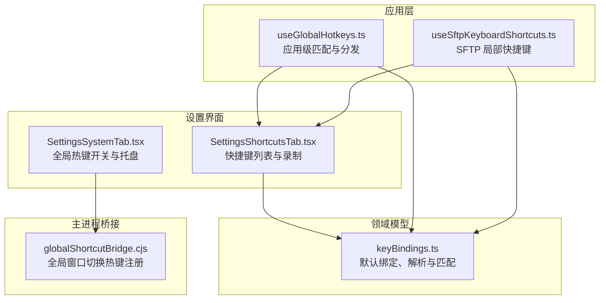
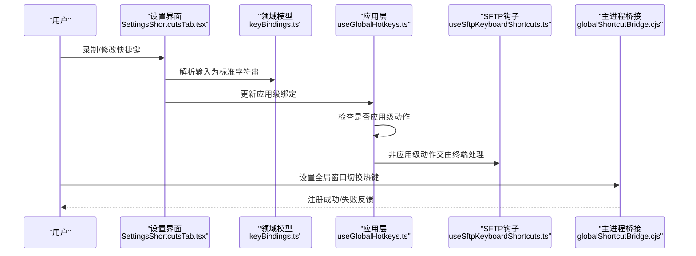
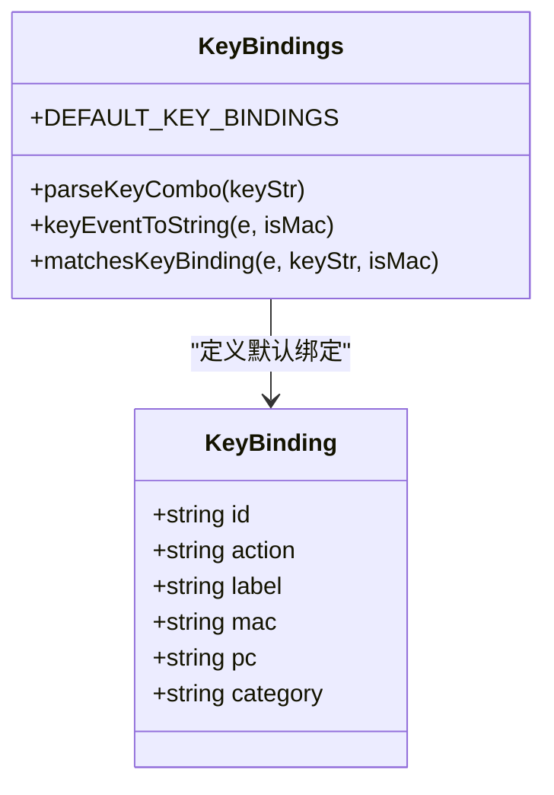
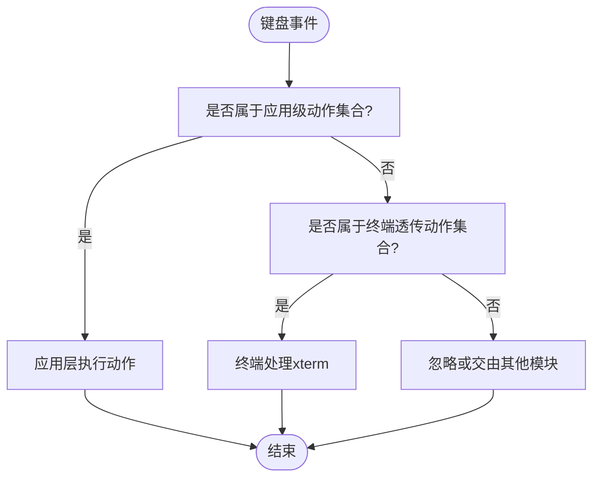
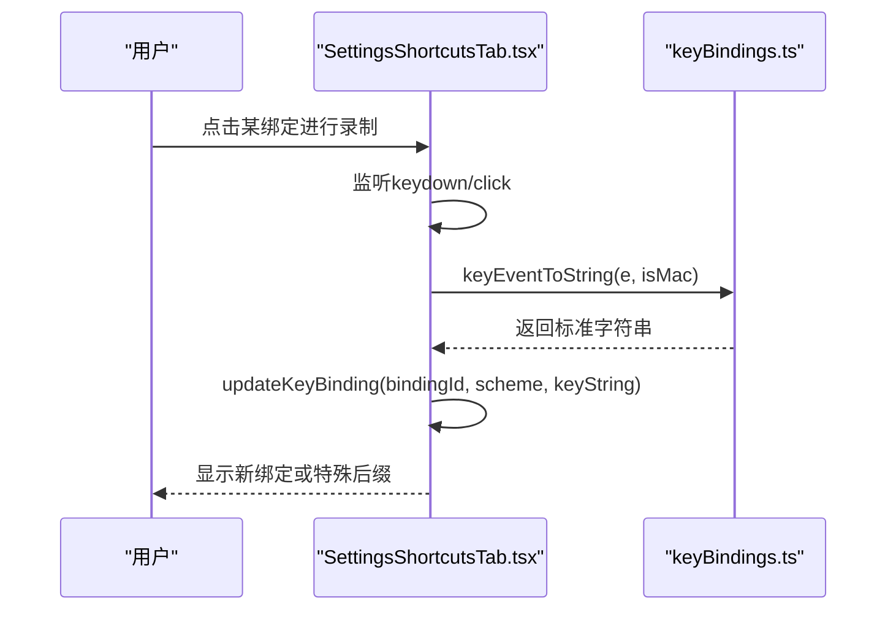
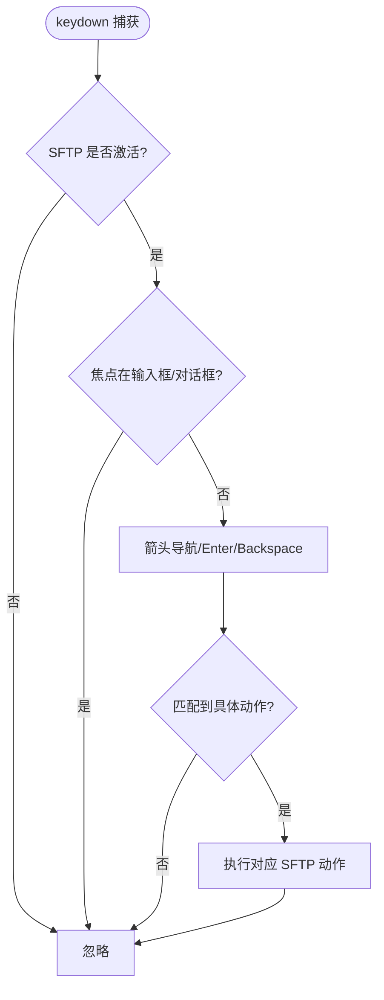
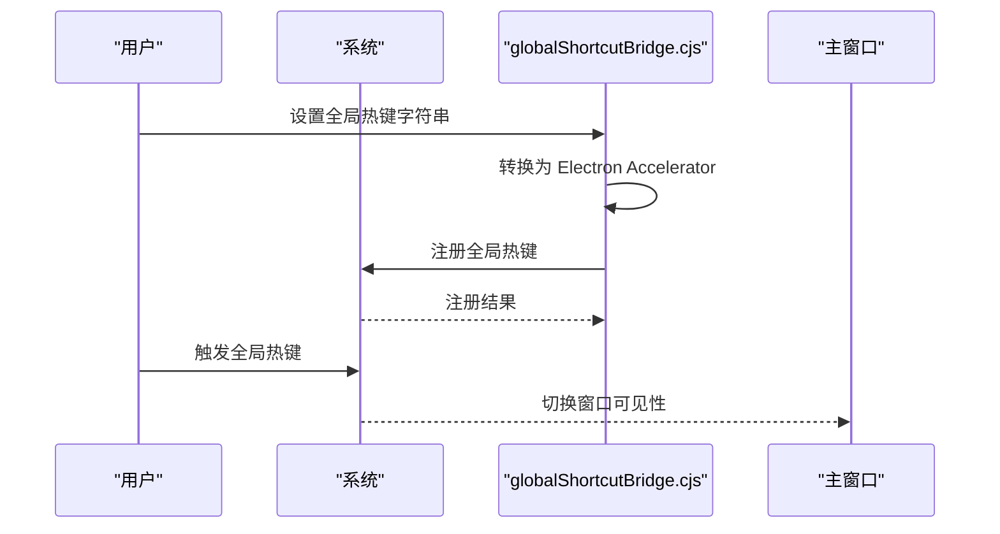
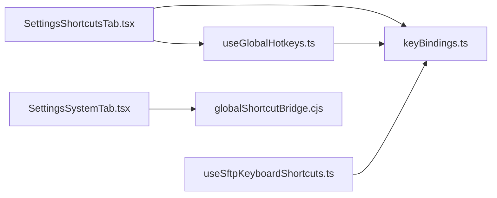

# 快捷键设置

<cite>
**本文引用的文件**
- [SettingsShortcutsTab.tsx](file://components/settings/tabs/SettingsShortcutsTab.tsx)
- [SettingsSystemTab.tsx](file://components/settings/tabs/SettingsSystemTab.tsx)
- [keyBindings.ts](file://domain/models/keyBindings.ts)
- [useGlobalHotkeys.ts](file://application/state/useGlobalHotkeys.ts)
- [useSftpKeyboardShortcuts.ts](file://components/sftp/hooks/useSftpKeyboardShortcuts.ts)
- [globalShortcutBridge.cjs](file://electron/bridges/globalShortcutBridge.cjs)
- [settingsStateDefaults.ts](file://application/state/settingsStateDefaults.ts)
- [AIChatSidePanel.tsx](file://components/AIChatSidePanel.tsx)
</cite>

## 目录
1. [简介](#简介)
2. [项目结构](#项目结构)
3. [核心组件](#核心组件)
4. [架构总览](#架构总览)
5. [详细组件分析](#详细组件分析)
6. [依赖关系分析](#依赖关系分析)
7. [性能考量](#性能考量)
8. [故障排查指南](#故障排查指南)
9. [结论](#结论)
10. [附录](#附录)

## 简介
本指南面向最终用户，系统讲解应用内的“快捷键设置”功能，涵盖以下方面：
- 全局快捷键：窗口切换、最小化到托盘等系统级热键
- 局部快捷键：标签页、终端、导航、应用功能、SFTP 等模块的快捷键
- 录制与冲突检测：按键组合捕获、特殊模式（数字键范围、方向键）处理、禁用与重置
- 方案管理：平台方案（mac 或 PC）切换、全部重置、默认值回退
- 冲突解决与最佳实践：避免与系统或第三方软件冲突、推荐组合
- 常用快捷键推荐与个性化配置

## 项目结构
快捷键设置涉及前端设置界面、领域模型、应用层逻辑以及 Electron 主进程桥接四部分协同工作。

图示来源
- [SettingsShortcutsTab.tsx:1-258](file://components/settings/tabs/SettingsShortcutsTab.tsx#L1-L258)
- [SettingsSystemTab.tsx:890-965](file://components/settings/tabs/SettingsSystemTab.tsx#L890-L965)
- [useGlobalHotkeys.ts:1-54](file://application/state/useGlobalHotkeys.ts#L1-L54)
- [useSftpKeyboardShortcuts.ts:1-605](file://components/sftp/hooks/useSftpKeyboardShortcuts.ts#L1-L605)
- [keyBindings.ts:1-241](file://domain/models/keyBindings.ts#L1-L241)
- [globalShortcutBridge.cjs:525-581](file://electron/bridges/globalShortcutBridge.cjs#L525-L581)

章节来源
- [SettingsShortcutsTab.tsx:1-258](file://components/settings/tabs/SettingsShortcutsTab.tsx#L1-L258)
- [SettingsSystemTab.tsx:890-965](file://components/settings/tabs/SettingsSystemTab.tsx#L890-L965)
- [useGlobalHotkeys.ts:1-54](file://application/state/useGlobalHotkeys.ts#L1-L54)
- [useSftpKeyboardShortcuts.ts:1-605](file://components/sftp/hooks/useSftpKeyboardShortcuts.ts#L1-L605)
- [keyBindings.ts:1-241](file://domain/models/keyBindings.ts#L1-L241)
- [globalShortcutBridge.cjs:525-581](file://electron/bridges/globalShortcutBridge.cjs#L525-L581)

## 核心组件
- 快捷键模型与默认绑定：定义快捷键类别、平台方案、默认绑定集与匹配算法
- 应用级快捷键匹配：区分应用级动作与终端透传动作，避免与 xterm 冲突
- 设置界面：展示与编辑快捷键，支持录制、禁用、重置、切换方案
- SFTP 局部快捷键：在激活状态下拦截键盘事件，执行复制/剪切/粘贴/选择/删除/刷新/新建等操作
- 全局热键桥接：注册系统级窗口切换热键，支持托盘关闭行为

章节来源
- [keyBindings.ts:1-241](file://domain/models/keyBindings.ts#L1-L241)
- [useGlobalHotkeys.ts:1-54](file://application/state/useGlobalHotkeys.ts#L1-L54)
- [SettingsShortcutsTab.tsx:1-258](file://components/settings/tabs/SettingsShortcutsTab.tsx#L1-L258)
- [useSftpKeyboardShortcuts.ts:1-605](file://components/sftp/hooks/useSftpKeyboardShortcuts.ts#L1-L605)
- [globalShortcutBridge.cjs:525-581](file://electron/bridges/globalShortcutBridge.cjs#L525-L581)

## 架构总览
快捷键从“设置界面”录入，经“领域模型”解析与匹配，再由“应用层”在合适时机触发对应动作；系统级热键通过“主进程桥接”注册并生效。

图示来源
- [SettingsShortcutsTab.tsx:50-108](file://components/settings/tabs/SettingsShortcutsTab.tsx#L50-L108)
- [keyBindings.ts:100-192](file://domain/models/keyBindings.ts#L100-L192)
- [useGlobalHotkeys.ts:5-17](file://application/state/useGlobalHotkeys.ts#L5-L17)
- [useSftpKeyboardShortcuts.ts:118-124](file://components/sftp/hooks/useSftpKeyboardShortcuts.ts#L118-L124)
- [globalShortcutBridge.cjs:525-581](file://electron/bridges/globalShortcutBridge.cjs#L525-L581)

## 详细组件分析

### 快捷键模型与默认绑定
- 类别与动作：按“标签页、终端、导航、应用、SFTP”分类，每个绑定包含平台方案（mac/pc）与可选的特殊模式（如数字键范围、方向键）
- 匹配算法：支持修饰键组合、符号键名映射、物理键码与可打印字符识别，兼容 Mac 符号与 PC 键位
- 默认绑定：覆盖常见操作，如切换标签、复制/粘贴、分割视图、打开侧边栏、SFTP 文件操作等

图示来源
- [keyBindings.ts:4-11](file://domain/models/keyBindings.ts#L4-L11)
- [keyBindings.ts:16-192](file://domain/models/keyBindings.ts#L16-L192)

章节来源
- [keyBindings.ts:1-241](file://domain/models/keyBindings.ts#L1-L241)

### 应用级快捷键匹配与终端透传
- 应用级动作集合：如切换标签、新建/关闭标签、打开主机/本地/设置等，这些动作由应用层直接处理
- 终端透传动作集合：如复制/粘贴/全选/清屏/搜索，这些动作应交由终端（xterm）处理
- 匹配流程：遍历当前绑定，使用统一匹配函数判断事件是否命中

图示来源
- [useGlobalHotkeys.ts:5-53](file://application/state/useGlobalHotkeys.ts#L5-L53)

章节来源
- [useGlobalHotkeys.ts:1-54](file://application/state/useGlobalHotkeys.ts#L1-L54)

### 设置界面：录制、禁用与重置
- 录制流程：捕获按键事件，过滤纯修饰键，生成标准字符串；对特殊模式（数字范围/方向键）单独处理
- 禁用与重置：支持将某绑定设为“Disabled”，或回退到默认值
- 方案切换：支持“禁用/平台方案（mac/pc）”，自动切换显示与匹配

图示来源
- [SettingsShortcutsTab.tsx:50-108](file://components/settings/tabs/SettingsShortcutsTab.tsx#L50-L108)
- [keyBindings.ts:61-98](file://domain/models/keyBindings.ts#L61-L98)

章节来源
- [SettingsShortcutsTab.tsx:1-258](file://components/settings/tabs/SettingsShortcutsTab.tsx#L1-L258)
- [keyBindings.ts:16-192](file://domain/models/keyBindings.ts#L16-L192)

### SFTP 局部快捷键
- 激活条件：仅当 SFTP 标签处于激活状态时才拦截键盘事件
- 基本导航：上下箭头移动选择，Shift+箭头扩展范围；Enter/Backspace 打开目录或返回上级
- 文件操作：复制/剪切/粘贴/全选/重命名/删除/刷新/新建文件夹/打开/跳转到所选目录
- 特殊限制：跨面板粘贴需源目标不同连接；同面板粘贴不支持

图示来源
- [useSftpKeyboardShortcuts.ts:125-596](file://components/sftp/hooks/useSftpKeyboardShortcuts.ts#L125-L596)

章节来源
- [useSftpKeyboardShortcuts.ts:1-605](file://components/sftp/hooks/useSftpKeyboardShortcuts.ts#L1-L605)

### 全局热键（系统级窗口切换）
- 注册与注销：将前端格式转换为主进程可识别的加速键，调用系统 API 注册/注销
- 行为：切换主窗口显示/隐藏，支持 macOS 全屏退出策略
- 托盘：可启用“最小化到托盘”，点击托盘图标显示托盘面板

图示来源
- [globalShortcutBridge.cjs:421-581](file://electron/bridges/globalShortcutBridge.cjs#L421-L581)
- [SettingsSystemTab.tsx:899-940](file://components/settings/tabs/SettingsSystemTab.tsx#L899-L940)

章节来源
- [globalShortcutBridge.cjs:525-581](file://electron/bridges/globalShortcutBridge.cjs#L525-L581)
- [SettingsSystemTab.tsx:890-965](file://components/settings/tabs/SettingsSystemTab.tsx#L890-L965)

## 依赖关系分析
- 设置界面依赖领域模型进行解析与显示，并通过应用层更新运行时绑定
- 应用层依赖领域模型进行匹配，区分应用级与终端透传动作
- SFTP 钩子依赖领域模型匹配动作，并在激活态下拦截键盘事件
- 全局热键依赖主进程桥接完成系统级注册

图示来源
- [SettingsShortcutsTab.tsx:1-258](file://components/settings/tabs/SettingsShortcutsTab.tsx#L1-L258)
- [keyBindings.ts:1-241](file://domain/models/keyBindings.ts#L1-L241)
- [useGlobalHotkeys.ts:1-54](file://application/state/useGlobalHotkeys.ts#L1-L54)
- [useSftpKeyboardShortcuts.ts:1-605](file://components/sftp/hooks/useSftpKeyboardShortcuts.ts#L1-L605)
- [SettingsSystemTab.tsx:890-965](file://components/settings/tabs/SettingsSystemTab.tsx#L890-L965)
- [globalShortcutBridge.cjs:525-581](file://electron/bridges/globalShortcutBridge.cjs#L525-L581)

章节来源
- [SettingsShortcutsTab.tsx:1-258](file://components/settings/tabs/SettingsShortcutsTab.tsx#L1-L258)
- [useGlobalHotkeys.ts:1-54](file://application/state/useGlobalHotkeys.ts#L1-L54)
- [useSftpKeyboardShortcuts.ts:1-605](file://components/sftp/hooks/useSftpKeyboardShortcuts.ts#L1-L605)
- [keyBindings.ts:1-241](file://domain/models/keyBindings.ts#L1-L241)
- [globalShortcutBridge.cjs:525-581](file://electron/bridges/globalShortcutBridge.cjs#L525-L581)
- [SettingsSystemTab.tsx:890-965](file://components/settings/tabs/SettingsSystemTab.tsx#L890-L965)

## 性能考量
- 快捷键匹配为轻量计算，主要成本在于 DOM 事件监听与字符串解析，通常无性能瓶颈
- 全局热键注册/注销为系统调用，频繁变更可能带来注册失败风险
- SFTP 局部快捷键仅在激活态监听，避免对其他页面造成干扰

## 故障排查指南
- 全局热键无效或被占用
  - 检查是否被系统或其他应用占用；尝试更换组合
  - 在设置中查看注册错误提示
- 录制无法完成
  - 确保未仅按下修饰键；仅在录制模式下允许捕获完整组合
  - 特殊模式（数字范围/方向键）需满足相应规则
- SFTP 快捷键不生效
  - 确认 SFTP 标签处于激活状态
  - 焦点不在输入框或对话框内
  - 同面板粘贴不支持，请跨面板使用
- 终端快捷键被吞掉
  - 检查是否属于应用级动作；应用级动作不会透传至终端
  - 若为终端透传动作，确认未被应用层拦截

章节来源
- [SettingsSystemTab.tsx:937-939](file://components/settings/tabs/SettingsSystemTab.tsx#L937-L939)
- [SettingsShortcutsTab.tsx:50-108](file://components/settings/tabs/SettingsShortcutsTab.tsx#L50-L108)
- [useSftpKeyboardShortcuts.ts:125-146](file://components/sftp/hooks/useSftpKeyboardShortcuts.ts#L125-L146)
- [useGlobalHotkeys.ts:19-53](file://application/state/useGlobalHotkeys.ts#L19-L53)

## 结论
本功能通过“设置界面 + 领域模型 + 应用层 + 主进程桥接”的分层设计，实现了灵活且可靠的快捷键体系。用户可在不同模块间自由定制，同时兼顾系统级热键与局部快捷键的协同工作。

## 附录

### 常用快捷键推荐与最佳实践
- 全局窗口切换
  - 建议使用系统保留组合，避免与常用应用冲突
- 标签页与导航
  - 使用方向键或 Ctrl/Cmd + 数字快速切换
- 终端
  - 复制/粘贴：遵循平台习惯（Mac Cmd，PC Ctrl+Shift）
  - 清屏：Ctrl/Cmd + Shift + K
- SFTP
  - 复制/剪切/粘贴：跨面板粘贴更安全
  - 刷新/新建：F5/ Ctrl+Shift+N
- AI 面板
  - 可通过设置界面打开/关闭侧栏，结合终端会话进行高效协作

章节来源
- [keyBindings.ts:194-240](file://domain/models/keyBindings.ts#L194-L240)
- [AIChatSidePanel.tsx:1-800](file://components/AIChatSidePanel.tsx#L1-L800)