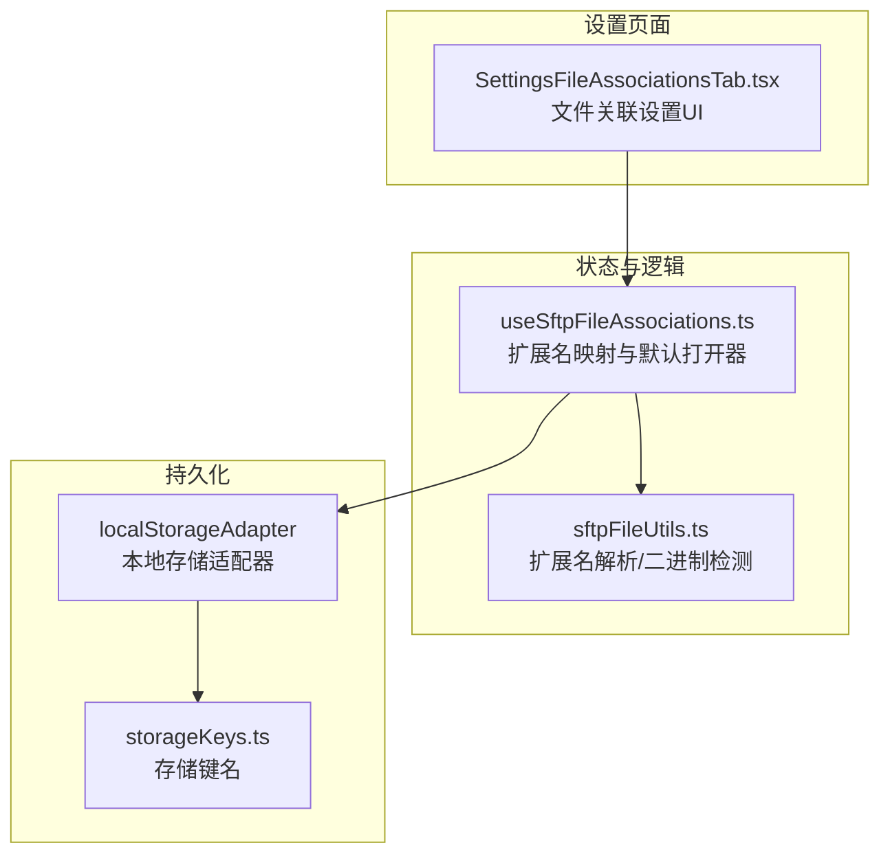
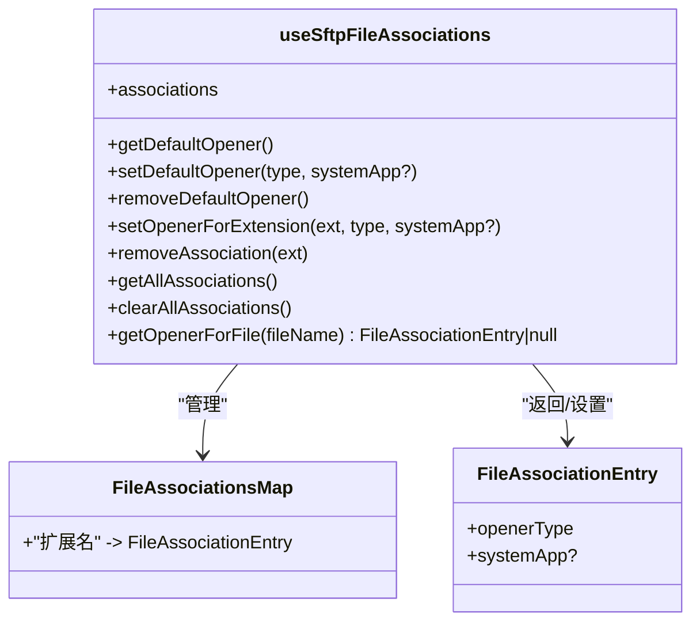
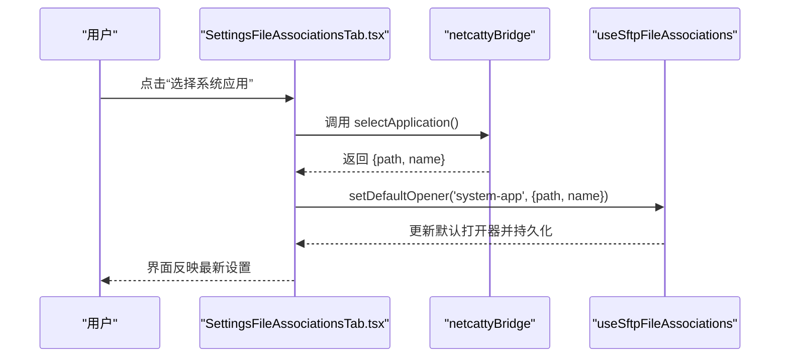
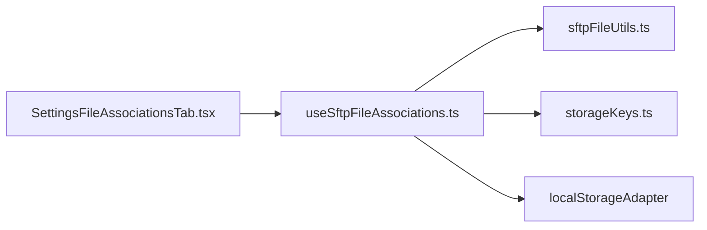

# 文件关联设置

<cite>
**本文引用的文件**
- [useSftpFileAssociations.ts](file://application/state/useSftpFileAssociations.ts)
- [SettingsFileAssociationsTab.tsx](file://components/settings/tabs/SettingsFileAssociationsTab.tsx)
- [sftpFileUtils.ts](file://lib/sftpFileUtils.ts)
- [storageKeys.ts](file://infrastructure/config/storageKeys.ts)
- [terminal.ts](file://application/i18n/locales/zh-CN/terminal.ts)
</cite>

## 目录
1. [简介](#简介)
2. [项目结构](#项目结构)
3. [核心组件](#核心组件)
4. [架构总览](#架构总览)
5. [详细组件分析](#详细组件分析)
6. [依赖关系分析](#依赖关系分析)
7. [性能考量](#性能考量)
8. [故障排除指南](#故障排除指南)
9. [结论](#结论)
10. [附录](#附录)

## 简介
本指南面向使用者与维护者，系统讲解“文件关联设置”功能，涵盖以下方面：
- 文件类型关联配置：扩展名映射、默认程序设置、编辑器选择
- 关联规则与优先级：默认回退、二进制文件例外、扩展名匹配
- 冲突与回退机制：默认打开器与扩展名专属打开器的优先级
- 特殊文件类型策略：配置文件、日志文件、脚本文件、二进制文件
- 导入导出能力：基于本地持久化的导入导出思路
- 最佳实践与常见场景

## 项目结构
文件关联设置位于应用的设置页面中，通过状态钩子管理扩展名到打开器的映射，并持久化到本地存储。UI 组件负责展示与编辑。

图表来源
- [SettingsFileAssociationsTab.tsx:30-581](file://components/settings/tabs/SettingsFileAssociationsTab.tsx#L30-L581)
- [useSftpFileAssociations.ts:1-208](file://application/state/useSftpFileAssociations.ts#L1-L208)
- [sftpFileUtils.ts:184-316](file://lib/sftpFileUtils.ts#L184-L316)
- [storageKeys.ts:76-78](file://infrastructure/config/storageKeys.ts#L76-L78)

章节来源
- [SettingsFileAssociationsTab.tsx:30-581](file://components/settings/tabs/SettingsFileAssociationsTab.tsx#L30-L581)
- [useSftpFileAssociations.ts:1-208](file://application/state/useSftpFileAssociations.ts#L1-L208)
- [sftpFileUtils.ts:184-316](file://lib/sftpFileUtils.ts#L184-L316)
- [storageKeys.ts:76-78](file://infrastructure/config/storageKeys.ts#L76-L78)

## 核心组件
- 扩展名映射与默认打开器：集中在一个自定义 Hook 中，提供增删改查、持久化与跨组件订阅。
- UI 设置页：提供“默认打开器”“按扩展名关联”两个维度的配置入口。
- 工具函数：扩展名提取、二进制文件判断、文本文件判断等。
- 存储键：统一管理扩展名映射与默认打开器的本地存储键名。

章节来源
- [useSftpFileAssociations.ts:98-207](file://application/state/useSftpFileAssociations.ts#L98-L207)
- [SettingsFileAssociationsTab.tsx:30-581](file://components/settings/tabs/SettingsFileAssociationsTab.tsx#L30-L581)
- [sftpFileUtils.ts:184-316](file://lib/sftpFileUtils.ts#L184-L316)
- [storageKeys.ts:76-78](file://infrastructure/config/storageKeys.ts#L76-L78)

## 架构总览
文件关联的决策流程如下：

图表来源
- [useSftpFileAssociations.ts:123-132](file://application/state/useSftpFileAssociations.ts#L123-L132)
- [sftpFileUtils.ts:298-301](file://lib/sftpFileUtils.ts#L298-L301)

章节来源
- [useSftpFileAssociations.ts:123-132](file://application/state/useSftpFileAssociations.ts#L123-L132)
- [sftpFileUtils.ts:298-301](file://lib/sftpFileUtils.ts#L298-L301)

## 详细组件分析

### 1) 扩展名映射与默认打开器（Hook）
- 数据结构
  - 扩展名映射：键为小写的扩展名字符串，值为打开器类型与系统应用信息。
  - 默认打开器：单独存储，作为“无专属关联”时的回退。
- 关键方法
  - 获取默认打开器：返回当前设置的默认打开器。
  - 设置/移除默认打开器：更新默认打开器并持久化。
  - 为扩展名设置打开器：更新扩展名专属映射。
  - 移除扩展名专属映射：从映射表中删除该项。
  - 获取全部映射：返回扁平数组，便于 UI 展示。
  - 清空全部映射：清空扩展名专属映射。
- 优先级与回退
  - 专属扩展名优先于默认打开器。
  - 若默认打开器为内置编辑器且文件为二进制，则不回退到内置编辑器。
- 持久化
  - 使用本地存储适配器，分别以扩展名映射键与默认打开器键进行读写。
  - 监听其他窗口的存储事件，保证多窗口一致。

图表来源
- [useSftpFileAssociations.ts:11-18](file://application/state/useSftpFileAssociations.ts#L11-L18)
- [useSftpFileAssociations.ts:98-207](file://application/state/useSftpFileAssociations.ts#L98-L207)

章节来源
- [useSftpFileAssociations.ts:28-92](file://application/state/useSftpFileAssociations.ts#L28-L92)
- [useSftpFileAssociations.ts:123-207](file://application/state/useSftpFileAssociations.ts#L123-L207)

### 2) UI 设置页（文件关联设置）
- 功能点
  - 默认打开器：可选择“每次询问”“内置编辑器”“系统应用”，并支持选择系统应用。
  - 按扩展名关联：展示现有映射，支持编辑与删除。
  - 其他 SFTP 相关设置：双击行为、默认视图模式、自动同步、显示隐藏文件、压缩上传、自动打开侧栏、传输并发等。
- 交互
  - 选择系统应用：通过桥接接口弹出系统文件选择器，返回路径与名称后写入映射。
  - 编辑/删除：对扩展名专属映射进行更新或移除。

图表来源
- [SettingsFileAssociationsTab.tsx:45-59](file://components/settings/tabs/SettingsFileAssociationsTab.tsx#L45-L59)
- [SettingsFileAssociationsTab.tsx:61-77](file://components/settings/tabs/SettingsFileAssociationsTab.tsx#L61-L77)
- [useSftpFileAssociations.ts:144-153](file://application/state/useSftpFileAssociations.ts#L144-L153)

章节来源
- [SettingsFileAssociationsTab.tsx:30-581](file://components/settings/tabs/SettingsFileAssociationsTab.tsx#L30-L581)

### 3) 工具函数与文件类型策略
- 扩展名提取：无扩展名或以点开头的文件统一归类为“无扩展名”。
- 文本/二进制检测：
  - 已知二进制扩展名集合：避免将图片、音频、视频、可执行文件、压缩包、数据库文件等误判为文本。
  - 内容探测：通过首段字节分析控制字符比例与高位字符比例，进一步提升准确性。
- 语言与语法高亮：扩展名到语言 ID 的映射，用于编辑器体验。

章节来源
- [sftpFileUtils.ts:184-316](file://lib/sftpFileUtils.ts#L184-L316)
- [sftpFileUtils.ts:105-178](file://lib/sftpFileUtils.ts#L105-L178)

### 4) 存储键与持久化
- 存储键
  - 扩展名映射：用于保存 per-extension 的关联映射。
  - 默认打开器：用于保存默认回退设置。
- 适配器
  - 通过本地存储适配器进行读写，支持跨窗口事件监听，保证一致性。

章节来源
- [storageKeys.ts:76-78](file://infrastructure/config/storageKeys.ts#L76-L78)
- [useSftpFileAssociations.ts:28-92](file://application/state/useSftpFileAssociations.ts#L28-L92)

## 依赖关系分析
- 组件耦合
  - UI 设置页依赖 Hook 提供的状态与方法。
  - Hook 依赖工具函数进行扩展名与二进制文件判断。
  - Hook 依赖存储键与本地存储适配器进行持久化。
- 外部集成
  - 系统应用选择通过桥接接口实现，UI 与桥接解耦。

图表来源
- [SettingsFileAssociationsTab.tsx:30-581](file://components/settings/tabs/SettingsFileAssociationsTab.tsx#L30-L581)
- [useSftpFileAssociations.ts:1-208](file://application/state/useSftpFileAssociations.ts#L1-L208)
- [sftpFileUtils.ts:184-316](file://lib/sftpFileUtils.ts#L184-L316)
- [storageKeys.ts:76-78](file://infrastructure/config/storageKeys.ts#L76-L78)

章节来源
- [SettingsFileAssociationsTab.tsx:30-581](file://components/settings/tabs/SettingsFileAssociationsTab.tsx#L30-L581)
- [useSftpFileAssociations.ts:1-208](file://application/state/useSftpFileAssociations.ts#L1-L208)
- [sftpFileUtils.ts:184-316](file://lib/sftpFileUtils.ts#L184-L316)
- [storageKeys.ts:76-78](file://infrastructure/config/storageKeys.ts#L76-L78)

## 性能考量
- 本地存储读写：扩展名映射与默认打开器均采用本地存储，读写成本低，适合频繁访问。
- 订阅与同步：使用 React 的 useSyncExternalStore 订阅存储变化，避免不必要的重渲染。
- 二进制检测：仅在需要时进行内容探测，扩展名阶段的快速过滤可显著降低误判与开销。

## 故障排除指南
- 问题：设置了默认打开器为“内置编辑器”，但打开二进制文件时无反应
  - 原因：内置编辑器对二进制文件有保护，会自动回退为空。
  - 处理：将该扩展名改为“系统应用”打开器，或为该扩展名单独设置打开器。
- 问题：设置了扩展名专属打开器，但未生效
  - 原因：扩展名大小写会被统一为小写；确认扩展名是否正确。
  - 处理：检查映射表中的键是否为小写，必要时重新设置。
- 问题：跨窗口设置不同步
  - 原因：未监听 storage 事件。
  - 处理：确认浏览器支持 storage 事件，或在新窗口中重新打开设置页。

章节来源
- [useSftpFileAssociations.ts:123-132](file://application/state/useSftpFileAssociations.ts#L123-L132)
- [useSftpFileAssociations.ts:28-42](file://application/state/useSftpFileAssociations.ts#L28-L42)

## 结论
文件关联设置提供了灵活而直观的扩展名映射与默认打开器配置，结合二进制文件保护与跨窗口同步，能够满足大多数 SFTP 场景下的文件打开需求。通过合理的扩展名策略与默认回退机制，用户可以高效地管理各类文件类型的打开方式。

## 附录

### A. 文件类型与策略建议
- 配置文件（如 .json/.yaml/.toml/.ini/.cfg/.env 等）
  - 建议：使用“内置编辑器”或“系统应用”打开，便于编辑与校验。
- 日志文件（如 .log）
  - 建议：使用“系统应用”或“内置编辑器”，注意大文件的性能影响。
- 脚本文件（如 .sh/.bash/.zsh/.ps1/.py/.pl 等）
  - 建议：使用“内置编辑器”以获得语法高亮与编辑体验。
- 二进制文件（如 .jpg/.png/.mp4/.zip/.exe 等）
  - 建议：不要设置为“内置编辑器”，可设置为“系统应用”的预览/播放器。

章节来源
- [sftpFileUtils.ts:8-84](file://lib/sftpFileUtils.ts#L8-L84)
- [sftpFileUtils.ts:298-301](file://lib/sftpFileUtils.ts#L298-L301)

### B. 导入导出说明
- 当前实现
  - 文件关联设置基于本地存储（扩展名映射与默认打开器），未提供专用的导入/导出界面。
- 推荐做法
  - 通过浏览器开发者工具或本地存储管理工具导出/导入扩展名映射与默认打开器键值。
  - 在新设备或新浏览器中恢复本地存储，以实现“导入/导出”效果。
- 注意事项
  - 仅在相同版本的应用中迁移，避免键名或数据结构变化导致不兼容。

章节来源
- [storageKeys.ts:76-78](file://infrastructure/config/storageKeys.ts#L76-L78)
- [useSftpFileAssociations.ts:28-92](file://application/state/useSftpFileAssociations.ts#L28-L92)

### C. 国际化与文案参考
- 设置页文案与提示信息来源于国际化资源，涵盖默认打开器、扩展名关联、SFTP 行为等模块。

章节来源
- [terminal.ts:40-57](file://application/i18n/locales/zh-CN/terminal.ts#L40-L57)