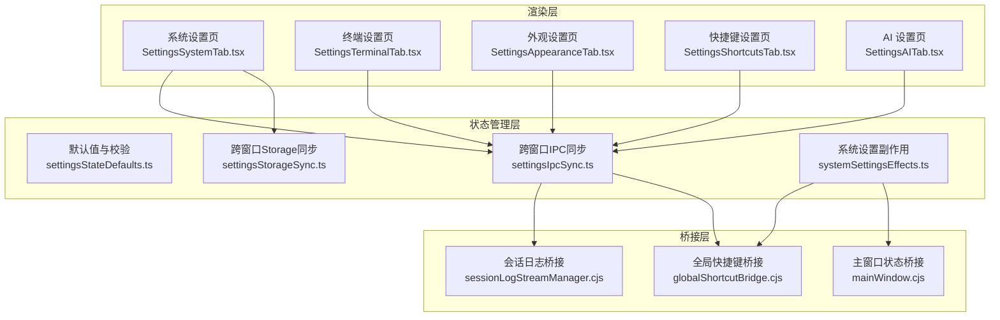
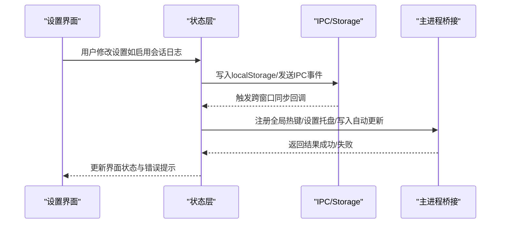
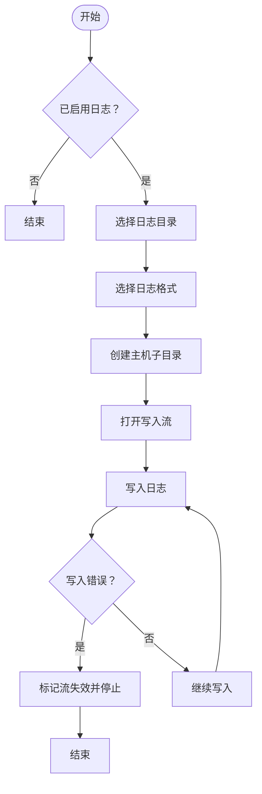
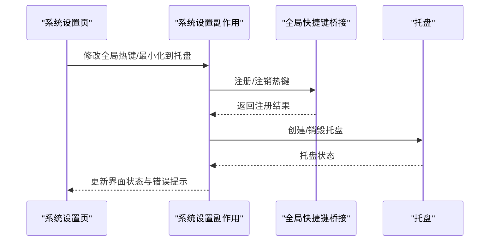
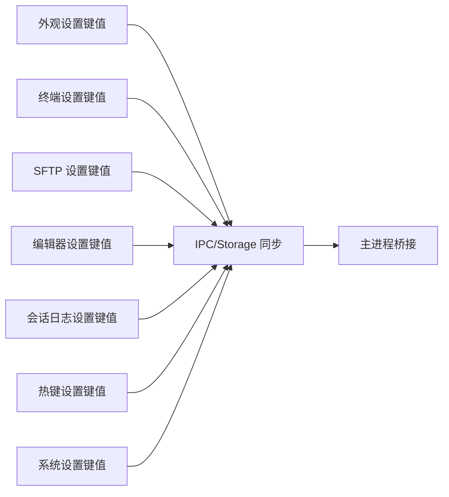

# 系统设置

<cite>
**本文引用的文件**
- [settingsStateDefaults.ts](file://application/state/settingsStateDefaults.ts)
- [systemSettingsEffects.ts](file://application/state/systemSettingsEffects.ts)
- [settingsIpcSync.ts](file://application/state/settingsIpcSync.ts)
- [settingsStorageSync.ts](file://application/state/settingsStorageSync.ts)
- [SettingsSystemTab.tsx](file://components/settings/tabs/SettingsSystemTab.tsx)
- [SettingsShortcutsTab.tsx](file://components/settings/tabs/SettingsShortcutsTab.tsx)
- [SettingsTerminalTab.tsx](file://components/settings/tabs/SettingsTerminalTab.tsx)
- [SettingsAppearanceTab.tsx](file://components/settings/tabs/SettingsAppearanceTab.tsx)
- [SettingsAITab.tsx](file://components/settings/tabs/SettingsAITab.tsx)
- [keyBindings.ts](file://domain/models/keyBindings.ts)
- [storageKeys.ts](file://infrastructure/config/storageKeys.ts)
- [sessionLogStreamManager.cjs](file://electron/bridges/sessionLogStreamManager.cjs)
- [globalShortcutBridge.cjs](file://electron/bridges/globalShortcutBridge.cjs)
- [mainWindow.cjs](file://electron/bridges/windowManager/mainWindow.cjs)
</cite>

## 目录
1. [简介](#简介)
2. [项目结构](#项目结构)
3. [核心组件](#核心组件)
4. [架构总览](#架构总览)
5. [详细组件分析](#详细组件分析)
6. [依赖关系分析](#依赖关系分析)
7. [性能考量](#性能考量)
8. [故障排除指南](#故障排除指南)
9. [结论](#结论)
10. [附录](#附录)

## 简介
本指南面向系统管理员与高级用户，全面讲解应用的“系统设置”功能，涵盖以下方面：
- 系统级配置：会话日志管理（启用/目录/格式）、临时目录清理、崩溃日志查看与清理、软件更新与自动更新、凭据保护可用性检测
- 窗口管理：全局热键（唤起窗口）、最小化到托盘、窗口状态保持（位置/大小/最大化）
- 系统集成：全局快捷键注册、开机自启动（平台相关）、系统通知（托盘）
- 调试与诊断：崩溃日志浏览、临时目录统计、凭据保护状态检查
- 性能优化：终端主题/字体/光标/键盘行为等可调参数；SFTP 传输并发度；工作区焦点样式
- 安全与隐私：凭据保护可用性提示；仅在本地持久化的调试开关；日志目录选择与清理
- 故障排除与维护：热键录制与冲突处理、跨窗口同步一致性、崩溃日志定位与上报

## 项目结构
系统设置功能由“渲染层设置界面 + 状态管理 + 桥接层（IPC）+ 主进程桥接”构成，数据通过 localStorage 与主进程偏好文件进行双向同步。

**图示来源**
- [SettingsSystemTab.tsx:1-965](file://components/settings/tabs/SettingsSystemTab.tsx#L1-L965)
- [SettingsTerminalTab.tsx:1-975](file://components/settings/tabs/SettingsTerminalTab.tsx#L1-L975)
- [SettingsAppearanceTab.tsx:1-321](file://components/settings/tabs/SettingsAppearanceTab.tsx#L1-L321)
- [SettingsShortcutsTab.tsx:1-258](file://components/settings/tabs/SettingsShortcutsTab.tsx#L1-L258)
- [SettingsAITab.tsx:1-823](file://components/settings/tabs/SettingsAITab.tsx#L1-L823)
- [settingsIpcSync.ts:1-236](file://application/state/settingsIpcSync.ts#L1-L236)
- [settingsStorageSync.ts:1-413](file://application/state/settingsStorageSync.ts#L1-L413)
- [systemSettingsEffects.ts:1-124](file://application/state/systemSettingsEffects.ts#L1-L124)
- [settingsStateDefaults.ts:1-159](file://application/state/settingsStateDefaults.ts#L1-L159)
- [sessionLogStreamManager.cjs:53-82](file://electron/bridges/sessionLogStreamManager.cjs#L53-L82)
- [globalShortcutBridge.cjs:779-801](file://electron/bridges/globalShortcutBridge.cjs#L779-L801)
- [mainWindow.cjs:166-206](file://electron/bridges/windowManager/mainWindow.cjs#L166-L206)

**章节来源**
- [SettingsSystemTab.tsx:1-965](file://components/settings/tabs/SettingsSystemTab.tsx#L1-L965)
- [SettingsTerminalTab.tsx:1-975](file://components/settings/tabs/SettingsTerminalTab.tsx#L1-L975)
- [SettingsAppearanceTab.tsx:1-321](file://components/settings/tabs/SettingsAppearanceTab.tsx#L1-L321)
- [SettingsShortcutsTab.tsx:1-258](file://components/settings/tabs/SettingsShortcutsTab.tsx#L1-L258)
- [SettingsAITab.tsx:1-823](file://components/settings/tabs/SettingsAITab.tsx#L1-L823)
- [settingsIpcSync.ts:1-236](file://application/state/settingsIpcSync.ts#L1-L236)
- [settingsStorageSync.ts:1-413](file://application/state/settingsStorageSync.ts#L1-L413)
- [systemSettingsEffects.ts:1-124](file://application/state/systemSettingsEffects.ts#L1-L124)
- [settingsStateDefaults.ts:1-159](file://application/state/settingsStateDefaults.ts#L1-L159)
- [sessionLogStreamManager.cjs:53-82](file://electron/bridges/sessionLogStreamManager.cjs#L53-L82)
- [globalShortcutBridge.cjs:779-801](file://electron/bridges/globalShortcutBridge.cjs#L779-L801)
- [mainWindow.cjs:166-206](file://electron/bridges/windowManager/mainWindow.cjs#L166-L206)

## 核心组件
- 系统设置页（SettingsSystemTab）：提供软件更新、凭据保护状态、崩溃日志、临时目录、会话日志目录与格式等入口。
- 终端设置页（SettingsTerminalTab）：主题/字体/光标/键盘/可访问性/行为/本地 Shell/连接参数等。
- 外观设置页（SettingsAppearanceTab）：UI 主题、强调色、UI 字体、语言、最近主机显示等。
- 快捷键设置页（SettingsShortcutsTab）：平台方案切换、自定义快捷键录制、重置。
- 状态管理：
  - 默认值与校验：主题/字体/热键方案/日志格式等默认值与合法性校验。
  - IPC 同步：跨窗口设置变更广播与接收。
  - Storage 同步：localStorage 变更监听与合并。
  - 系统设置副作用：全局热键注册、最小化到托盘、自动更新设置写入主进程。
- 桥接层：
  - 会话日志：按主机子目录与时间戳生成日志文件，支持 txt/raw/html。
  - 全局快捷键：注册/注销热键、托盘图标与菜单。
  - 主窗口：窗口状态保存与恢复、最小化到托盘策略。

**章节来源**
- [SettingsSystemTab.tsx:1-965](file://components/settings/tabs/SettingsSystemTab.tsx#L1-L965)
- [SettingsTerminalTab.tsx:1-975](file://components/settings/tabs/SettingsTerminalTab.tsx#L1-L975)
- [SettingsAppearanceTab.tsx:1-321](file://components/settings/tabs/SettingsAppearanceTab.tsx#L1-L321)
- [SettingsShortcutsTab.tsx:1-258](file://components/settings/tabs/SettingsShortcutsTab.tsx#L1-L258)
- [settingsStateDefaults.ts:1-159](file://application/state/settingsStateDefaults.ts#L1-L159)
- [settingsIpcSync.ts:1-236](file://application/state/settingsIpcSync.ts#L1-L236)
- [settingsStorageSync.ts:1-413](file://application/state/settingsStorageSync.ts#L1-L413)
- [systemSettingsEffects.ts:1-124](file://application/state/systemSettingsEffects.ts#L1-L124)
- [sessionLogStreamManager.cjs:53-82](file://electron/bridges/sessionLogStreamManager.cjs#L53-L82)
- [globalShortcutBridge.cjs:779-801](file://electron/bridges/globalShortcutBridge.cjs#L779-L801)
- [mainWindow.cjs:166-206](file://electron/bridges/windowManager/mainWindow.cjs#L166-L206)

## 架构总览
系统设置采用“渲染层 + 状态层 + 桥接层”的分层设计，确保设置项在多窗口间一致，并与主进程能力（托盘、全局热键、自动更新）协同。

**图示来源**
- [settingsIpcSync.ts:91-232](file://application/state/settingsIpcSync.ts#L91-L232)
- [settingsStorageSync.ts:158-409](file://application/state/settingsStorageSync.ts#L158-L409)
- [systemSettingsEffects.ts:22-121](file://application/state/systemSettingsEffects.ts#L22-L121)
- [globalShortcutBridge.cjs:779-801](file://electron/bridges/globalShortcutBridge.cjs#L779-L801)

**章节来源**
- [settingsIpcSync.ts:1-236](file://application/state/settingsIpcSync.ts#L1-L236)
- [settingsStorageSync.ts:1-413](file://application/state/settingsStorageSync.ts#L1-L413)
- [systemSettingsEffects.ts:1-124](file://application/state/systemSettingsEffects.ts#L1-L124)
- [globalShortcutBridge.cjs:779-801](file://electron/bridges/globalShortcutBridge.cjs#L779-L801)

## 详细组件分析

### 会话日志管理
- 功能要点
  - 启用/禁用：控制是否记录会话日志
  - 日志目录：选择存放路径，支持打开目录与浏览
  - 日志格式：txt/raw/html 三类，分别对应纯文本、原始输出、带渲染的 HTML
  - 文件命名：按主机名子目录与时间戳生成文件，避免覆盖
- 数据流
  - 渲染层读取/写入 localStorage 对应键值
  - 主进程根据目录与格式创建写入流，异常时自动禁用该会话流
- 建议
  - 使用独立磁盘分区或有配额限制的目录，定期清理
  - 生产环境建议使用 txt 或 raw，便于审计与自动化处理

**图示来源**
- [SettingsSystemTab.tsx:272-295](file://components/settings/tabs/SettingsSystemTab.tsx#L272-L295)
- [sessionLogStreamManager.cjs:53-82](file://electron/bridges/sessionLogStreamManager.cjs#L53-L82)
- [storageKeys.ts:100-103](file://infrastructure/config/storageKeys.ts#L100-L103)

**章节来源**
- [SettingsSystemTab.tsx:272-295](file://components/settings/tabs/SettingsSystemTab.tsx#L272-L295)
- [sessionLogStreamManager.cjs:53-82](file://electron/bridges/sessionLogStreamManager.cjs#L53-L82)
- [storageKeys.ts:100-103](file://infrastructure/config/storageKeys.ts#L100-L103)

### 窗口管理设置
- 全局热键（唤起窗口）
  - 支持录制新热键，平台自动识别（mac/pc），特殊键位（数字、方向键范围）处理
  - 注册/注销由主进程桥接完成，失败时返回错误信息
- 最小化到托盘
  - 开启后创建托盘图标，点击托盘弹出自定义面板；关闭则销毁托盘
  - 窗口关闭事件可被拦截以隐藏至托盘
- 窗口状态保持
  - 非最大化/非全屏状态下保存常规尺寸与位置，退出时持久化
  - 打开时从持久化状态恢复

**图示来源**
- [systemSettingsEffects.ts:22-121](file://application/state/systemSettingsEffects.ts#L22-L121)
- [globalShortcutBridge.cjs:779-801](file://electron/bridges/globalShortcutBridge.cjs#L779-L801)
- [mainWindow.cjs:166-206](file://electron/bridges/windowManager/mainWindow.cjs#L166-L206)

**章节来源**
- [systemSettingsEffects.ts:1-124](file://application/state/systemSettingsEffects.ts#L1-L124)
- [globalShortcutBridge.cjs:779-801](file://electron/bridges/globalShortcutBridge.cjs#L779-L801)
- [mainWindow.cjs:166-206](file://electron/bridges/windowManager/mainWindow.cjs#L166-L206)

### 系统集成设置
- 全局快捷键
  - 录制流程：捕获键盘事件，过滤修饰键，生成标准化字符串
  - 特殊模式：数字范围 [1..9] 与方向键模式
- 开机自启动
  - 自动更新开关与主进程偏好文件同步，渲染层写入 localStorage 并通过桥接写入主进程
- 系统通知
  - 托盘图标与菜单用于会话与端口转发状态展示

**章节来源**
- [SettingsShortcutsTab.tsx:1-258](file://components/settings/tabs/SettingsShortcutsTab.tsx#L1-L258)
- [keyBindings.ts:1-241](file://domain/models/keyBindings.ts#L1-L241)
- [systemSettingsEffects.ts:92-120](file://application/state/systemSettingsEffects.ts#L92-L120)
- [globalShortcutBridge.cjs:779-801](file://electron/bridges/globalShortcutBridge.cjs#L779-L801)

### 调试与诊断
- 崩溃日志
  - 列表加载、展开查看、清理、打开目录
  - 包含时间戳、来源、消息、堆栈、运行时元信息（版本、内存、会话数、运行时长等）
- 临时目录
  - 显示路径、文件数量、总大小；一键刷新、清理、打开目录
- 凭据保护可用性
  - 检测当前平台凭据保护能力，提供刷新与提示

**章节来源**
- [SettingsSystemTab.tsx:148-296](file://components/settings/tabs/SettingsSystemTab.tsx#L148-L296)
- [SettingsSystemTab.tsx:181-246](file://components/settings/tabs/SettingsSystemTab.tsx#L181-L246)

### 性能优化选项
- 终端主题/字体/光标/键盘/可访问性/行为
  - 主题跟随应用深浅色、自定义强调色；字体家族/大小/字重；行间距；模拟类型
  - 光标形状与闪烁；Alt 作为 Meta；Option+箭头词跳转
  - 最小对比度；行为开关（自动补全、粘贴选择等）
- SFTP 传输
  - 并发度（1–16），压缩上传开关，自动打开侧边栏，双击行为（打开/传输），默认视图（列表/树）
- 工作区焦点样式
  - dim/border 两种指示风格

**章节来源**
- [SettingsTerminalTab.tsx:1-975](file://components/settings/tabs/SettingsTerminalTab.tsx#L1-L975)
- [settingsStateDefaults.ts:50-58](file://application/state/settingsStateDefaults.ts#L50-L58)

### 安全与隐私
- 凭据保护可用性检测：提示当前平台是否支持系统级凭据保护
- 仅本地调试开关：开发者专用键值，不涉及持久化数据
- 日志目录选择：建议选择受控目录，避免敏感信息泄露

**章节来源**
- [SettingsSystemTab.tsx:167-179](file://components/settings/tabs/SettingsSystemTab.tsx#L167-L179)
- [storageKeys.ts:166-169](file://infrastructure/config/storageKeys.ts#L166-L169)

## 依赖关系分析
- 设置项与存储键值映射
  - 外观/主题/强调色/UI 字体/语言/自定义 CSS
  - 终端主题/字体/设置/跟随应用主题
  - SFTP 行为/视图/并发/压缩上传/自动打开侧边栏
  - 编辑器换行
  - 会话日志启用/目录/格式
  - 全局热键方案/自定义热键/热键录制
  - 全局热键开关/托盘关闭/自动更新
  - AI 提供商/模型/权限/工具集成/默认代理/命令超时/最大迭代/网络搜索
- 同步机制
  - IPC：跨窗口广播设置变更
  - Storage：同域多标签页同步
  - 主进程偏好：自动更新开关与主进程偏好文件保持一致

**图示来源**
- [storageKeys.ts:1-169](file://infrastructure/config/storageKeys.ts#L1-L169)
- [settingsIpcSync.ts:91-232](file://application/state/settingsIpcSync.ts#L91-L232)
- [settingsStorageSync.ts:158-409](file://application/state/settingsStorageSync.ts#L158-L409)

**章节来源**
- [storageKeys.ts:1-169](file://infrastructure/config/storageKeys.ts#L1-L169)
- [settingsIpcSync.ts:1-236](file://application/state/settingsIpcSync.ts#L1-L236)
- [settingsStorageSync.ts:1-413](file://application/state/settingsStorageSync.ts#L1-L413)

## 性能考量
- 终端渲染与字体
  - 合理设置字体大小与行间距，避免过度渲染导致掉帧
  - 在高对比度场景下适度提升对比度，兼顾可读性与性能
- SFTP 传输
  - 合理设置并发度，避免过多并发造成磁盘与网络抖动
  - 压缩上传在带宽受限时可减少传输时间，但会增加 CPU 占用
- 窗口状态保存
  - 窗口尺寸与位置变化频繁时，状态保存存在节流（定时器），避免高频写入

**章节来源**
- [SettingsTerminalTab.tsx:547-798](file://components/settings/tabs/SettingsTerminalTab.tsx#L547-L798)
- [mainWindow.cjs:166-206](file://electron/bridges/windowManager/mainWindow.cjs#L166-L206)

## 故障排除指南
- 全局热键无法注册
  - 检查热键是否与系统/其他应用冲突；尝试更换组合键
  - 查看错误提示，确认平台修饰键映射（mac/pc）
- 最小化到托盘无效
  - 确认托盘图标已创建；在 macOS 上左键通常触发自定义面板，右键才显示系统菜单
- 会话日志未生成
  - 确认已启用日志；检查日志目录是否存在且可写；查看主进程日志中的写入错误
- 崩溃日志无法清理
  - 确认文件权限；部分文件可能被占用，稍后再试
- 自动更新不生效
  - 检查主进程偏好文件与渲染层 localStorage 是否一致；必要时手动同步

**章节来源**
- [systemSettingsEffects.ts:32-68](file://application/state/systemSettingsEffects.ts#L32-L68)
- [globalShortcutBridge.cjs:779-801](file://electron/bridges/globalShortcutBridge.cjs#L779-L801)
- [sessionLogStreamManager.cjs:73-82](file://electron/bridges/sessionLogStreamManager.cjs#L73-L82)
- [SettingsSystemTab.tsx:223-246](file://components/settings/tabs/SettingsSystemTab.tsx#L223-L246)

## 结论
系统设置提供了从日志管理、窗口行为、系统集成到性能与安全的完整配置面。通过 IPC 与 Storage 的双重同步，确保多窗口一致性；借助主进程桥接实现全局热键、托盘与自动更新等系统级能力。建议结合实际使用场景调整日志目录与格式、SFTP 并发度与传输策略，并定期清理临时目录与崩溃日志，以维持系统稳定与性能。

## 附录
- 常用存储键值（节选）
  - 外观与主题：STORAGE_KEY_THEME、STORAGE_KEY_UI_THEME_LIGHT、STORAGE_KEY_UI_THEME_DARK、STORAGE_KEY_ACCENT_MODE、STORAGE_KEY_COLOR、STORAGE_KEY_UI_FONT_FAMILY、STORAGE_KEY_UI_LANGUAGE、STORAGE_KEY_CUSTOM_CSS
  - 终端：STORAGE_KEY_TERM_THEME、STORAGE_KEY_TERM_FOLLOW_APP_THEME、STORAGE_KEY_TERM_THEME_DARK、STORAGE_KEY_TERM_THEME_LIGHT、STORAGE_KEY_TERM_FONT_FAMILY、STORAGE_KEY_TERM_FONT_SIZE、STORAGE_KEY_TERM_SETTINGS
  - SFTP：STORAGE_KEY_SFTP_DOUBLE_CLICK_BEHAVIOR、STORAGE_KEY_SFTP_AUTO_SYNC、STORAGE_KEY_SFTP_SHOW_HIDDEN_FILES、STORAGE_KEY_SFTP_USE_COMPRESSED_UPLOAD、STORAGE_KEY_SFTP_AUTO_OPEN_SIDEBAR、STORAGE_KEY_SFTP_DEFAULT_VIEW_MODE、STORAGE_KEY_SFTP_TRANSFER_CONCURRENCY
  - 编辑器：STORAGE_KEY_EDITOR_WORD_WRAP
  - 会话日志：STORAGE_KEY_SESSION_LOGS_ENABLED、STORAGE_KEY_SESSION_LOGS_DIR、STORAGE_KEY_SESSION_LOGS_FORMAT
  - 系统：STORAGE_KEY_TOGGLE_WINDOW_HOTKEY、STORAGE_KEY_CLOSE_TO_TRAY、STORAGE_KEY_GLOBAL_HOTKEY_ENABLED、STORAGE_KEY_AUTO_UPDATE_ENABLED
  - AI：STORAGE_KEY_AI_PROVIDERS、STORAGE_KEY_AI_ACTIVE_PROVIDER、STORAGE_KEY_AI_ACTIVE_MODEL、STORAGE_KEY_AI_PERMISSION_MODE、STORAGE_KEY_AI_TOOL_INTEGRATION_MODE、STORAGE_KEY_AI_DEFAULT_AGENT、STORAGE_KEY_AI_COMMAND_BLOCKLIST、STORAGE_KEY_AI_COMMAND_TIMEOUT、STORAGE_KEY_AI_MAX_ITERATIONS、STORAGE_KEY_AI_WEB_SEARCH

**章节来源**
- [storageKeys.ts:1-169](file://infrastructure/config/storageKeys.ts#L1-L169)