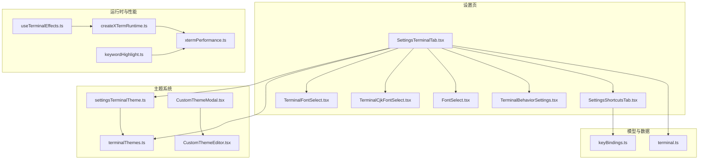
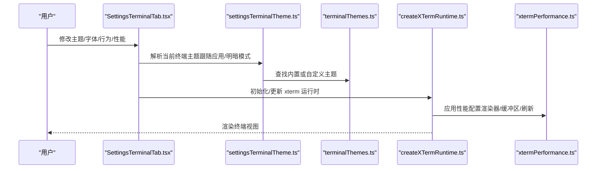
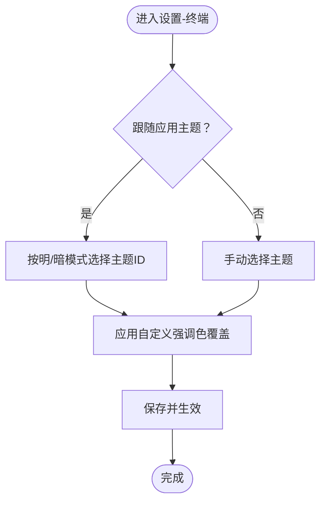
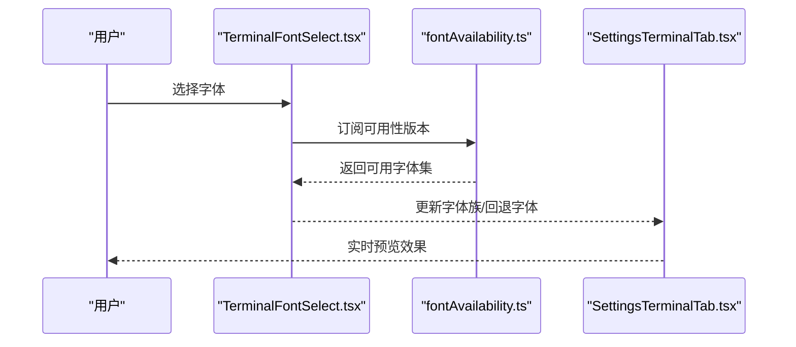
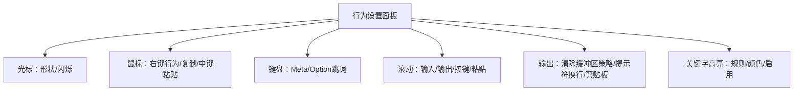
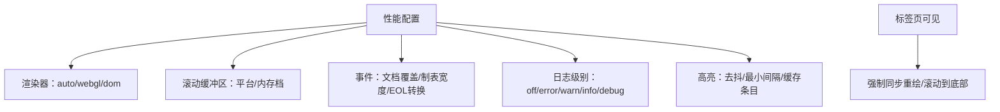
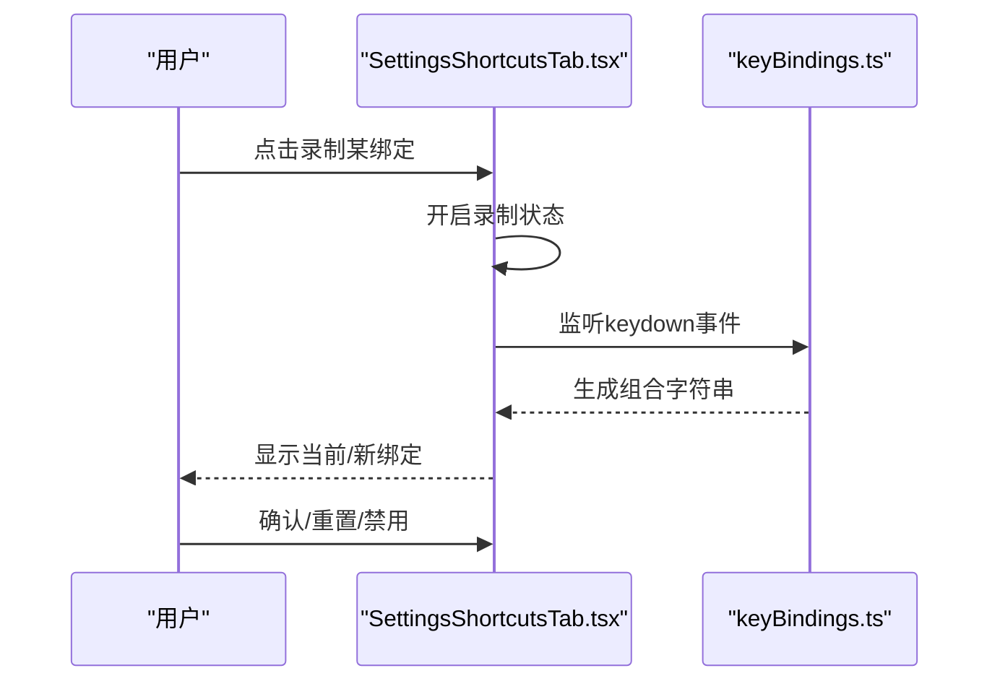
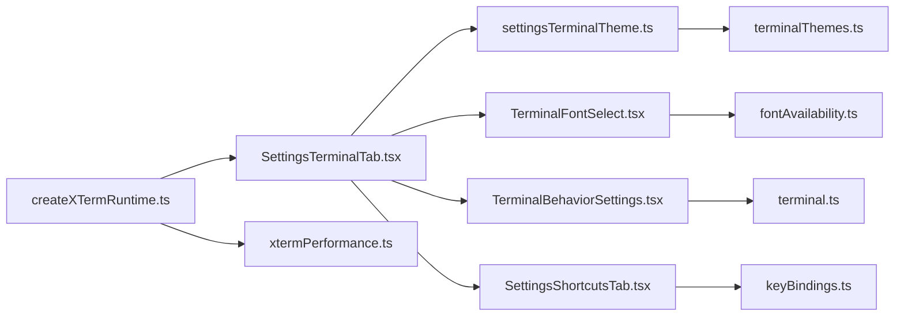

# 终端设置

<cite>
**本文引用的文件**
- [SettingsTerminalTab.tsx](file://components/settings/tabs/SettingsTerminalTab.tsx)
- [TerminalBehaviorSettings.tsx](file://components/settings/tabs/TerminalBehaviorSettings.tsx)
- [TerminalFontSelect.tsx](file://components/settings/TerminalFontSelect.tsx)
- [TerminalCjkFontSelect.tsx](file://components/settings/TerminalCjkFontSelect.tsx)
- [FontSelect.tsx](file://components/settings/FontSelect.tsx)
- [CustomThemeModal.tsx](file://components/terminal/CustomThemeModal.tsx)
- [CustomThemeEditor.tsx](file://components/terminal/CustomThemeEditor.tsx)
- [settingsTerminalTheme.ts](file://application/state/settingsTerminalTheme.ts)
- [terminalThemes.ts](file://infrastructure/config/terminalThemes.ts)
- [terminal.ts](file://domain/models/terminal.ts)
- [xtermPerformance.ts](file://infrastructure/config/xtermPerformance.ts)
- [createXTermRuntime.ts](file://components/terminal/runtime/createXTermRuntime.ts)
- [useTerminalEffects.ts](file://components/terminal/useTerminalEffects.ts)
- [SettingsShortcutsTab.tsx](file://components/settings/tabs/SettingsShortcutsTab.tsx)
- [keyBindings.ts](file://domain/models/keyBindings.ts)
- [keywordHighlight.ts](file://components/terminal/keywordHighlight.ts)
</cite>

## 目录
1. [简介](#简介)
2. [项目结构](#项目结构)
3. [核心组件](#核心组件)
4. [架构总览](#架构总览)
5. [详细组件分析](#详细组件分析)
6. [依赖关系分析](#依赖关系分析)
7. [性能考量](#性能考量)
8. [故障排查指南](#故障排查指南)
9. [结论](#结论)
10. [附录](#附录)

## 简介
本指南面向终端用户的“设置”界面，系统讲解如何配置终端主题（内置与自定义）、字体（字体族、字号、中日韩字体支持）、行为（光标、滚动、输出控制、提示符处理）、性能（渲染器、缓冲区、刷新策略）、快捷键（绑定与自定义），并提供最佳实践与常见问题解决方案。

## 项目结构
终端设置相关代码主要分布在以下模块：
- 设置页：终端主题、字体、行为、本地 Shell、连接参数等
- 主题系统：内置主题、自定义主题、跟随应用主题、强调色覆盖
- 字体系统：终端字体选择、CJK 字体回退、可用性检测
- 行为系统：鼠标/键盘交互、粘贴、滚动、关键字高亮
- 性能系统：渲染器选择、缓冲区大小、刷新策略、监控阈值
- 快捷键系统：平台方案、录制、重置、分类管理

图示来源
- [SettingsTerminalTab.tsx:1-975](file://components/settings/tabs/SettingsTerminalTab.tsx#L1-L975)
- [TerminalBehaviorSettings.tsx:1-198](file://components/settings/tabs/TerminalBehaviorSettings.tsx#L1-L198)
- [TerminalFontSelect.tsx:1-116](file://components/settings/TerminalFontSelect.tsx#L1-L116)
- [TerminalCjkFontSelect.tsx:1-154](file://components/settings/TerminalCjkFontSelect.tsx#L1-L154)
- [FontSelect.tsx:1-78](file://components/settings/FontSelect.tsx#L1-L78)
- [CustomThemeModal.tsx:1-231](file://components/terminal/CustomThemeModal.tsx#L1-L231)
- [CustomThemeEditor.tsx:1-188](file://components/terminal/CustomThemeEditor.tsx#L1-L188)
- [settingsTerminalTheme.ts:1-50](file://application/state/settingsTerminalTheme.ts#L1-L50)
- [terminalThemes.ts:1-43](file://infrastructure/config/terminalThemes.ts#L1-L43)
- [createXTermRuntime.ts:358-413](file://components/terminal/runtime/createXTermRuntime.ts#L358-L413)
- [xtermPerformance.ts:1-199](file://infrastructure/config/xtermPerformance.ts#L1-L199)
- [useTerminalEffects.ts:431-458](file://components/terminal/useTerminalEffects.ts#L431-L458)
- [keywordHighlight.ts:113-199](file://components/terminal/keywordHighlight.ts#L113-L199)
- [terminal.ts:1-339](file://domain/models/terminal.ts#L1-L339)
- [SettingsShortcutsTab.tsx:1-258](file://components/settings/tabs/SettingsShortcutsTab.tsx#L1-L258)
- [keyBindings.ts:1-241](file://domain/models/keyBindings.ts#L1-L241)

章节来源
- [SettingsTerminalTab.tsx:1-975](file://components/settings/tabs/SettingsTerminalTab.tsx#L1-L975)
- [terminal.ts:1-339](file://domain/models/terminal.ts#L1-L339)

## 核心组件
- 终端主题与跟随应用主题：支持按明暗模式分别选择主题，并可跟随应用主题自动切换；支持自定义强调色覆盖。
- 字体与 CJK 支持：提供终端字体选择器、字号微调、粗细权重、行间距、仿真类型（TERM）；提供 CJK 回退字体列表与可用性过滤。
- 行为与交互：右键行为、复制/粘贴、平滑滚动、链接修饰键、滚动到输入/输出/粘贴、清除缓冲区策略、强制提示符换行等。
- 性能与渲染：渲染器类型（自动/WebGL/DOM）、滚动缓冲区策略、事件处理、日志级别、关键字高亮刷新策略、上下文丢失处理。
- 快捷键：平台方案（禁用/mac/PC）、录制绑定、重置单个/全部、分类展示。

章节来源
- [SettingsTerminalTab.tsx:301-800](file://components/settings/tabs/SettingsTerminalTab.tsx#L301-L800)
- [TerminalBehaviorSettings.tsx:1-198](file://components/settings/tabs/TerminalBehaviorSettings.tsx#L1-L198)
- [xtermPerformance.ts:1-199](file://infrastructure/config/xtermPerformance.ts#L1-L199)
- [SettingsShortcutsTab.tsx:1-258](file://components/settings/tabs/SettingsShortcutsTab.tsx#L1-L258)

## 架构总览
终端设置由“设置页组件”驱动，通过状态与存储层解析当前主题、字体、行为与性能配置，并在运行时注入到 xterm 实例中生效。

图示来源
- [SettingsTerminalTab.tsx:1-975](file://components/settings/tabs/SettingsTerminalTab.tsx#L1-L975)
- [settingsTerminalTheme.ts:1-50](file://application/state/settingsTerminalTheme.ts#L1-L50)
- [terminalThemes.ts:1-43](file://infrastructure/config/terminalThemes.ts#L1-L43)
- [createXTermRuntime.ts:358-413](file://components/terminal/runtime/createXTermRuntime.ts#L358-L413)
- [xtermPerformance.ts:138-199](file://infrastructure/config/xtermPerformance.ts#L138-L199)

## 详细组件分析

### 终端主题配置
- 内置主题：从集中配置中加载，支持 UI 匹配主题与额外主题集合。
- 自定义主题：提供编辑器与预览面板，支持名称、类型（明/暗）、颜色字段批量修改。
- 跟随应用主题：按明/暗模式分别选择主题 ID，并在解析时应用自定义强调色覆盖。
- 导入 .itermcolors：解析后写入自定义主题库并选中。

图示来源
- [settingsTerminalTheme.ts:18-49](file://application/state/settingsTerminalTheme.ts#L18-L49)
- [terminalThemes.ts:28-43](file://infrastructure/config/terminalThemes.ts#L28-L43)
- [SettingsTerminalTab.tsx:307-451](file://components/settings/tabs/SettingsTerminalTab.tsx#L307-L451)
- [CustomThemeModal.tsx:92-231](file://components/terminal/CustomThemeModal.tsx#L92-L231)

章节来源
- [settingsTerminalTheme.ts:1-50](file://application/state/settingsTerminalTheme.ts#L1-L50)
- [terminalThemes.ts:1-43](file://infrastructure/config/terminalThemes.ts#L1-L43)
- [SettingsTerminalTab.tsx:307-451](file://components/settings/tabs/SettingsTerminalTab.tsx#L307-L451)
- [CustomThemeModal.tsx:1-231](file://components/terminal/CustomThemeModal.tsx#L1-L231)

### 字体设置
- 终端字体选择：基于可用性过滤，隐藏未安装字体，保留当前选中项以确保可见变化。
- CJK 字体回退：仅列出等宽 CJK 字体，避免比例字体导致网格错位；支持“自动”与已安装字体。
- 字号与粗细：提供 +/- 按钮与范围滑条；支持普通/粗体字重；行间距与仿真类型（TERM）可调。
- 字体可用性检测：订阅本地字体访问 API 的可用性版本，动态刷新下拉列表。

图示来源
- [TerminalFontSelect.tsx:1-116](file://components/settings/TerminalFontSelect.tsx#L1-L116)
- [TerminalCjkFontSelect.tsx:1-154](file://components/settings/TerminalCjkFontSelect.tsx#L1-L154)
- [SettingsTerminalTab.tsx:453-579](file://components/settings/tabs/SettingsTerminalTab.tsx#L453-L579)

章节来源
- [TerminalFontSelect.tsx:1-116](file://components/settings/TerminalFontSelect.tsx#L1-L116)
- [TerminalCjkFontSelect.tsx:1-154](file://components/settings/TerminalCjkFontSelect.tsx#L1-L154)
- [SettingsTerminalTab.tsx:453-579](file://components/settings/tabs/SettingsTerminalTab.tsx#L453-L579)

### 终端行为设置
- 光标样式与闪烁：块状/竖线/下划线，可开启/关闭闪烁。
- 鼠标与键盘：右键菜单/粘贴/选词；复制即选、中键粘贴；Option/Alt 作为 Meta 键；平滑滚动。
- 输出控制：滚动到输入/输出/按键/粘贴；清除缓冲区是否清空历史；强制提示符换行；OSC-52 剪贴板策略。
- 关键字高亮：开关与规则编辑（正则、颜色、启用状态），默认规则包含错误/警告/信息/调试与 URL/IP/MAC 模式。

图示来源
- [TerminalBehaviorSettings.tsx:1-198](file://components/settings/tabs/TerminalBehaviorSettings.tsx#L1-L198)
- [terminal.ts:23-116](file://domain/models/terminal.ts#L23-L116)

章节来源
- [TerminalBehaviorSettings.tsx:1-198](file://components/settings/tabs/TerminalBehaviorSettings.tsx#L1-L198)
- [terminal.ts:23-116](file://domain/models/terminal.ts#L23-L116)

### 终端性能优化
- 渲染器选择：自动/强制 WebGL 或 DOM；低内存设备优先 DOM；WebGL 上下文丢失处理。
- 缓冲区大小：按平台与内存档位设定默认滚动缓冲区；支持手动调整。
- 刷新与事件：请求动画帧适配隐藏标签页场景；事件路由优化；日志级别控制；关键字高亮刷新去抖与缓存。
- 可见性恢复：标签页可见时强制同步重绘与滚动到底部，修复“花屏”。

图示来源
- [xtermPerformance.ts:1-199](file://infrastructure/config/xtermPerformance.ts#L1-L199)
- [createXTermRuntime.ts:358-413](file://components/terminal/runtime/createXTermRuntime.ts#L358-L413)
- [useTerminalEffects.ts:431-458](file://components/terminal/useTerminalEffects.ts#L431-L458)
- [keywordHighlight.ts:113-199](file://components/terminal/keywordHighlight.ts#L113-L199)

章节来源
- [xtermPerformance.ts:1-199](file://infrastructure/config/xtermPerformance.ts#L1-L199)
- [createXTermRuntime.ts:358-413](file://components/terminal/runtime/createXTermRuntime.ts#L358-L413)
- [useTerminalEffects.ts:431-458](file://components/terminal/useTerminalEffects.ts#L431-L458)
- [keywordHighlight.ts:113-199](file://components/terminal/keywordHighlight.ts#L113-L199)

### 终端快捷键配置
- 平台方案：禁用、mac、PC；根据方案显示/录制对应符号。
- 录制流程：捕获键盘事件，排除纯修饰键，生成组合字符串；支持特殊模式（数字/箭头）。
- 分类管理：标签页、终端、导航、应用、SFTP；支持重置单个/全部绑定。

图示来源
- [SettingsShortcutsTab.tsx:1-258](file://components/settings/tabs/SettingsShortcutsTab.tsx#L1-L258)
- [keyBindings.ts:1-241](file://domain/models/keyBindings.ts#L1-L241)

章节来源
- [SettingsShortcutsTab.tsx:1-258](file://components/settings/tabs/SettingsShortcutsTab.tsx#L1-L258)
- [keyBindings.ts:1-241](file://domain/models/keyBindings.ts#L1-L241)

## 依赖关系分析
- 设置页依赖主题解析与字体可用性模块，行为设置依赖终端模型，性能配置依赖运行时初始化与性能配置模块。
- 快捷键设置依赖键位匹配与解析工具，用于录制与校验。

图示来源
- [SettingsTerminalTab.tsx:1-975](file://components/settings/tabs/SettingsTerminalTab.tsx#L1-L975)
- [settingsTerminalTheme.ts:1-50](file://application/state/settingsTerminalTheme.ts#L1-L50)
- [terminalThemes.ts:1-43](file://infrastructure/config/terminalThemes.ts#L1-L43)
- [TerminalFontSelect.tsx:1-116](file://components/settings/TerminalFontSelect.tsx#L1-L116)
- [TerminalBehaviorSettings.tsx:1-198](file://components/settings/tabs/TerminalBehaviorSettings.tsx#L1-L198)
- [SettingsShortcutsTab.tsx:1-258](file://components/settings/tabs/SettingsShortcutsTab.tsx#L1-L258)
- [terminal.ts:1-339](file://domain/models/terminal.ts#L1-L339)
- [keyBindings.ts:1-241](file://domain/models/keyBindings.ts#L1-L241)
- [createXTermRuntime.ts:358-413](file://components/terminal/runtime/createXTermRuntime.ts#L358-L413)
- [xtermPerformance.ts:1-199](file://infrastructure/config/xtermPerformance.ts#L1-L199)

章节来源
- [SettingsTerminalTab.tsx:1-975](file://components/settings/tabs/SettingsTerminalTab.tsx#L1-L975)
- [terminal.ts:1-339](file://domain/models/terminal.ts#L1-L339)

## 性能考量
- 渲染器选择：在低端设备或低内存场景建议使用 DOM 渲染器；现代 GPU 下优先 WebGL。
- 缓冲区大小：macOS 默认较小缓冲区以缓解内存压力；Windows 默认较大缓冲区；低内存设备进一步降低。
- 刷新策略：隐藏标签页使用定时器兜底刷新，避免 rAF 不触发导致高亮不更新。
- 日志与监控：生产环境建议关闭详细日志；设置慢渲染与大缓冲阈值以便诊断性能问题。

章节来源
- [xtermPerformance.ts:1-199](file://infrastructure/config/xtermPerformance.ts#L1-L199)
- [keywordHighlight.ts:113-199](file://components/terminal/keywordHighlight.ts#L113-L199)
- [useTerminalEffects.ts:431-458](file://components/terminal/useTerminalEffects.ts#L431-L458)

## 故障排查指南
- “花屏/字符错位”：在标签页切换后可见性恢复时会清理 WebGL 纹理图集并强制同步重绘，若仍异常请尝试切换渲染器（DOM/WebGL）。
- “高亮不更新/卡顿”：检查关键字高亮去抖与最小刷新间隔；适当降低滚动缓冲区或关闭高亮。
- “字体不生效/空白字符”：确认字体可用性过滤已显示该字体；对于 CJK 使用等宽字体回退；必要时切换为“自动”回退。
- “粘贴异常/方括号残留”：检查是否启用带框粘贴模式；如出现 ^[[200~ 等残留，请禁用带框粘贴。
- “快捷键无效”：确认平台方案与当前系统一致；录制时不要只按修饰键；检查是否被其他应用占用。

章节来源
- [createXTermRuntime.ts:358-413](file://components/terminal/runtime/createXTermRuntime.ts#L358-L413)
- [useTerminalEffects.ts:431-458](file://components/terminal/useTerminalEffects.ts#L431-L458)
- [xtermPerformance.ts:95-105](file://infrastructure/config/xtermPerformance.ts#L95-L105)
- [SettingsTerminalTab.tsx:471-476](file://components/settings/tabs/SettingsTerminalTab.tsx#L471-L476)
- [SettingsShortcutsTab.tsx:50-108](file://components/settings/tabs/SettingsShortcutsTab.tsx#L50-L108)

## 结论
通过设置页提供的主题、字体、行为与性能配置，结合快捷键自定义能力，用户可在不同平台与设备上获得稳定、高效且个性化的终端体验。建议优先采用“跟随应用主题”与“自动渲染器”，再根据实际使用场景微调字体、行为与性能参数。

## 附录
- 最佳实践
  - 明/暗主题：启用“跟随应用主题”，并在明/暗模式下分别挑选适合的颜色对比度主题。
  - 字体：优先等宽等宽字体；CJK 使用内置推荐回退；字号与行间距以阅读舒适为准。
  - 行为：启用复制即选与中键粘贴；根据工作流选择滚动到输入/输出；开启关键字高亮提升可观测性。
  - 性能：低端设备优先 DOM；避免超大滚动缓冲区；关闭不必要的日志与透明背景。
- 常见问题
  - 高亮卡顿：降低去抖时间或减少规则数量。
  - 粘贴异常：禁用带框粘贴或调整 OSC-52 策略。
  - 快捷键冲突：切换平台方案或重置冲突绑定。