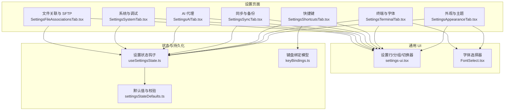
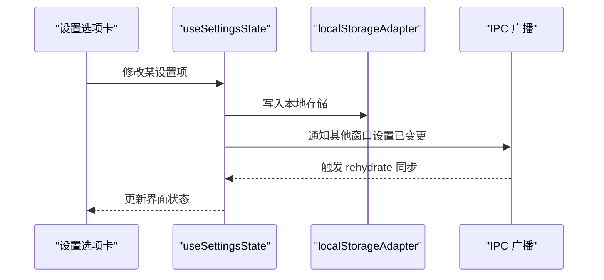
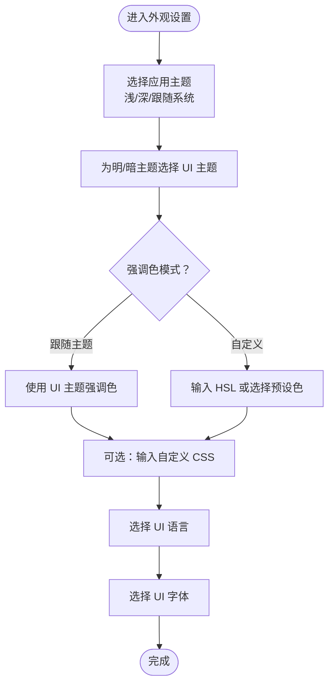
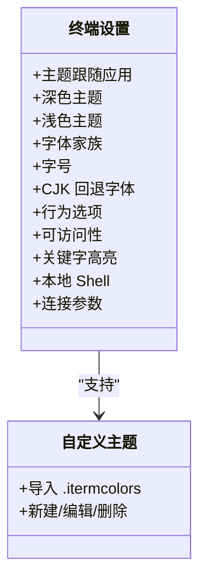
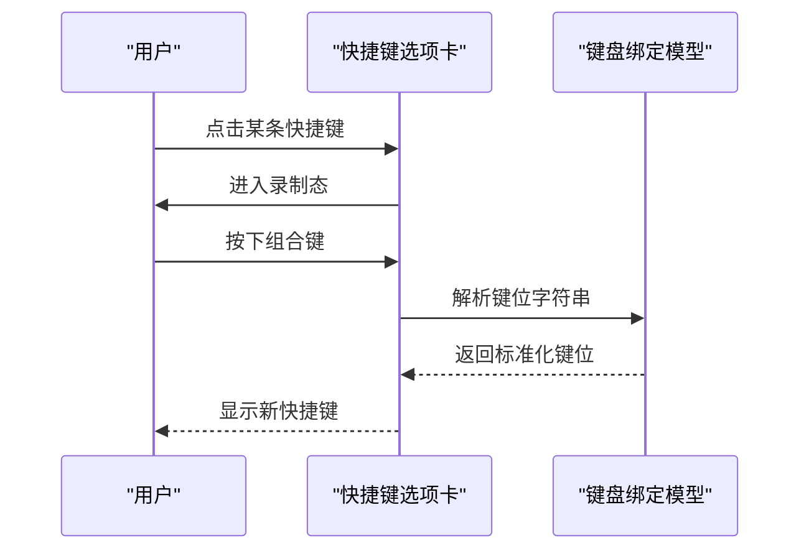
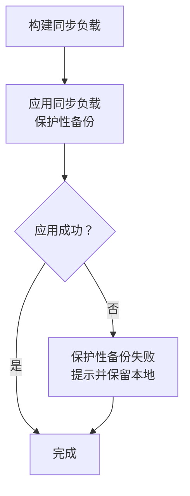
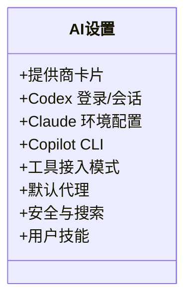
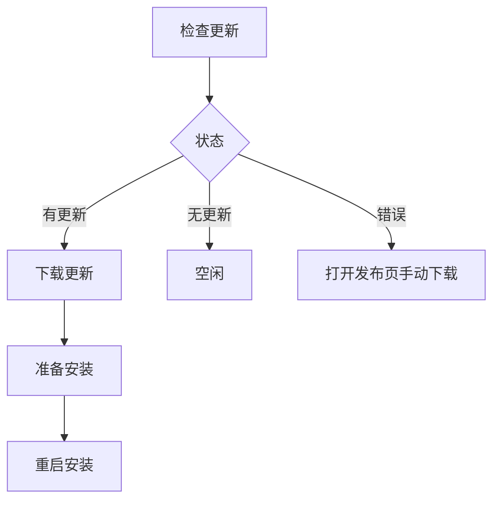
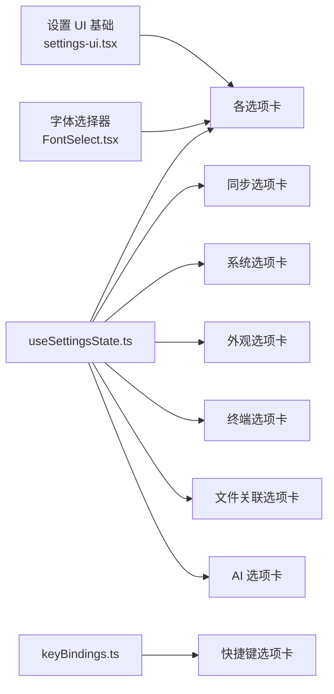

# 设置和配置

<cite>
**本文引用的文件**
- [SettingsAppearanceTab.tsx](file://components/settings/tabs/SettingsAppearanceTab.tsx)
- [SettingsTerminalTab.tsx](file://components/settings/tabs/SettingsTerminalTab.tsx)
- [SettingsShortcutsTab.tsx](file://components/settings/tabs/SettingsShortcutsTab.tsx)
- [SettingsSyncTab.tsx](file://components/settings/tabs/SettingsSyncTab.tsx)
- [SettingsAITab.tsx](file://components/settings/tabs/SettingsAITab.tsx)
- [SettingsSystemTab.tsx](file://components/settings/tabs/SettingsSystemTab.tsx)
- [SettingsFileAssociationsTab.tsx](file://components/settings/tabs/SettingsFileAssociationsTab.tsx)
- [settings-ui.tsx](file://components/settings/settings-ui.tsx)
- [FontSelect.tsx](file://components/settings/FontSelect.tsx)
- [TerminalFontSelect.tsx](file://components/settings/TerminalFontSelect.tsx)
- [TerminalCjkFontSelect.tsx](file://components/settings/TerminalCjkFontSelect.tsx)
- [useSettingsState.ts](file://application/state/useSettingsState.ts)
- [settingsStateDefaults.ts](file://application/state/settingsStateDefaults.ts)
- [keyBindings.ts](file://domain/models/keyBindings.ts)
- [SettingsTerminalTabControls.tsx](file://components/settings/tabs/SettingsTerminalTabControls.tsx)
- [TerminalBehaviorSettings.tsx](file://components/settings/tabs/TerminalBehaviorSettings.tsx)
</cite>

## 目录
1. [简介](#简介)
2. [项目结构](#项目结构)
3. [核心组件](#核心组件)
4. [架构总览](#架构总览)
5. [详细组件分析](#详细组件分析)
6. [依赖关系分析](#依赖关系分析)
7. [性能考量](#性能考量)
8. [故障排查指南](#故障排查指南)
9. [结论](#结论)
10. [附录](#附录)

## 简介
本指南面向使用者与维护者，系统性讲解应用的“设置与配置”功能。内容覆盖外观与主题、终端与字体、快捷键、同步与备份、AI 代理、系统与调试、以及设置迁移与恢复等。文档以“设置页面”的各选项卡为主线，结合状态管理与持久化机制，帮助你高效理解并使用各项配置。

## 项目结构
设置页面由多个独立的选项卡组成，每个选项卡负责一类配置，并通过统一的 UI 组件库与状态管理进行交互。

**图表来源**
- [SettingsAppearanceTab.tsx:1-321](file://components/settings/tabs/SettingsAppearanceTab.tsx#L1-L321)
- [SettingsTerminalTab.tsx:1-975](file://components/settings/tabs/SettingsTerminalTab.tsx#L1-L975)
- [SettingsShortcutsTab.tsx:1-258](file://components/settings/tabs/SettingsShortcutsTab.tsx#L1-L258)
- [SettingsSyncTab.tsx:1-101](file://components/settings/tabs/SettingsSyncTab.tsx#L1-L101)
- [SettingsAITab.tsx:1-764](file://components/settings/tabs/SettingsAITab.tsx#L1-L764)
- [SettingsSystemTab.tsx:1-965](file://components/settings/tabs/SettingsSystemTab.tsx#L1-L965)
- [SettingsFileAssociationsTab.tsx:1-581](file://components/settings/tabs/SettingsFileAssociationsTab.tsx#L1-L581)
- [settings-ui.tsx:1-141](file://components/settings/settings-ui.tsx#L1-L141)
- [FontSelect.tsx:1-78](file://components/settings/FontSelect.tsx#L1-L78)
- [useSettingsState.ts:1-970](file://application/state/useSettingsState.ts#L1-L970)
- [settingsStateDefaults.ts:1-159](file://application/state/settingsStateDefaults.ts#L1-L159)
- [keyBindings.ts:1-241](file://domain/models/keyBindings.ts#L1-L241)

**章节来源**
- [SettingsAppearanceTab.tsx:1-321](file://components/settings/tabs/SettingsAppearanceTab.tsx#L1-L321)
- [SettingsTerminalTab.tsx:1-975](file://components/settings/tabs/SettingsTerminalTab.tsx#L1-L975)
- [SettingsShortcutsTab.tsx:1-258](file://components/settings/tabs/SettingsShortcutsTab.tsx#L1-L258)
- [SettingsSyncTab.tsx:1-101](file://components/settings/tabs/SettingsSyncTab.tsx#L1-L101)
- [SettingsAITab.tsx:1-764](file://components/settings/tabs/SettingsAITab.tsx#L1-L764)
- [SettingsSystemTab.tsx:1-965](file://components/settings/tabs/SettingsSystemTab.tsx#L1-L965)
- [SettingsFileAssociationsTab.tsx:1-581](file://components/settings/tabs/SettingsFileAssociationsTab.tsx#L1-L581)
- [settings-ui.tsx:1-141](file://components/settings/settings-ui.tsx#L1-L141)
- [FontSelect.tsx:1-78](file://components/settings/FontSelect.tsx#L1-L78)
- [useSettingsState.ts:1-970](file://application/state/useSettingsState.ts#L1-L970)
- [settingsStateDefaults.ts:1-159](file://application/state/settingsStateDefaults.ts#L1-L159)
- [keyBindings.ts:1-241](file://domain/models/keyBindings.ts#L1-L241)

## 核心组件
- 设置 UI 基础：提供统一的设置行、分组标题、切换器、下拉选择等基础控件，确保各选项卡风格一致。
- 字体选择器：支持 UI 字体与终端字体的选择，包含本地与动态加载字体的处理。
- 设置状态钩子：集中管理所有设置项的状态、默认值、持久化与跨窗口同步。
- 键盘绑定模型：定义默认快捷键、平台方案（mac/pc/disabled）与匹配逻辑。

**章节来源**
- [settings-ui.tsx:1-141](file://components/settings/settings-ui.tsx#L1-L141)
- [FontSelect.tsx:1-78](file://components/settings/FontSelect.tsx#L1-L78)
- [useSettingsState.ts:1-970](file://application/state/useSettingsState.ts#L1-L970)
- [settingsStateDefaults.ts:1-159](file://application/state/settingsStateDefaults.ts#L1-L159)
- [keyBindings.ts:1-241](file://domain/models/keyBindings.ts#L1-L241)

## 架构总览
设置系统采用“选项卡 + 状态钩子 + 模型/持久化”的分层设计：
- 选项卡层：每个选项卡封装自身配置域的 UI 与交互。
- 状态层：useSettingsState 提供统一的状态读写、默认值校验、持久化与跨窗口广播。
- 模型层：如键盘绑定模型，提供解析、匹配与默认值。
- 持久化层：localStorageAdapter 负责本地存储；IPC 同步在多窗口间传播变更。

**图表来源**
- [useSettingsState.ts:539-602](file://application/state/useSettingsState.ts#L539-L602)
- [settings-ui.tsx:1-141](file://components/settings/settings-ui.tsx#L1-L141)

**章节来源**
- [useSettingsState.ts:539-602](file://application/state/useSettingsState.ts#L539-L602)

## 详细组件分析

### 外观与主题设置（外观）
- 主题与配色
  - 应用主题：浅色/深色/跟随系统三选，自动应用到根元素与原生窗口标题栏。
  - UI 主题：分别针对明/暗主题选择 UI 预设主题 ID。
  - 强调色：支持“跟随主题”或“自定义 HSL”，并根据当前主题自动计算强调前景色。
  - 自定义 CSS：支持注入自定义样式，即时生效。
- 语言与字体
  - UI 语言：从支持列表中选择，实时更新页面语言与 Electron 语言。
  - UI 字体：从可用字体列表中选择，动态设置根元素字体变量。
- 官方仓库与最近主机显示控制：可按需显示最近主机、仅显示根目录未分组主机、是否显示 SFTP 标签页。

**图表来源**
- [SettingsAppearanceTab.tsx:1-321](file://components/settings/tabs/SettingsAppearanceTab.tsx#L1-L321)
- [settingsStateDefaults.ts:115-157](file://application/state/settingsStateDefaults.ts#L115-L157)

**章节来源**
- [SettingsAppearanceTab.tsx:1-321](file://components/settings/tabs/SettingsAppearanceTab.tsx#L1-L321)
- [settingsStateDefaults.ts:1-159](file://application/state/settingsStateDefaults.ts#L1-L159)

### 终端与字体设置（终端）
- 主题与跟随
  - 可选择“跟随应用主题”或手动指定深/浅主题；支持为每种模式单独选择主题。
  - 支持导入 iTerm2 主题（.itermcolors），并可新建/编辑/删除自定义主题。
- 字体与字号
  - 终端字体家族与字号；CJK 字体回退；粗细与行间距；仿真类型（xterm 系列）。
- 行为与可访问性
  - 右键行为、复制/粘贴策略、括号粘贴、滚动策略、链接修饰键、最小对比度等。
- 关键字高亮
  - 支持添加/编辑/删除关键字高亮规则，支持正则表达式与颜色自定义。
- 本地 Shell
  - 默认 Shell 与起始目录的验证与提示；支持探测默认 Shell 并展示路径。
- 连接参数
  - KeepAlive 间隔与计数、X11 显示设置等。

**图表来源**
- [SettingsTerminalTab.tsx:1-975](file://components/settings/tabs/SettingsTerminalTab.tsx#L1-L975)
- [SettingsTerminalTabControls.tsx:1-296](file://components/settings/tabs/SettingsTerminalTabControls.tsx#L1-L296)
- [TerminalBehaviorSettings.tsx:1-198](file://components/settings/tabs/TerminalBehaviorSettings.tsx#L1-L198)

**章节来源**
- [SettingsTerminalTab.tsx:1-975](file://components/settings/tabs/SettingsTerminalTab.tsx#L1-L975)
- [SettingsTerminalTabControls.tsx:1-296](file://components/settings/tabs/SettingsTerminalTabControls.tsx#L1-L296)
- [TerminalBehaviorSettings.tsx:1-198](file://components/settings/tabs/TerminalBehaviorSettings.tsx#L1-L198)

### 快捷键设置（快捷键）
- 平台方案
  - 支持禁用、mac 方案、pc 方案三种；自动根据平台选择默认方案。
- 自定义绑定
  - 逐条修改快捷键，支持特殊组合（如 [1...9]、arrows）；支持重置单个或全部。
- 录制流程
  - 点击目标项后开始录制，按下组合键即保存；支持取消与错误提示。

**图表来源**
- [SettingsShortcutsTab.tsx:1-258](file://components/settings/tabs/SettingsShortcutsTab.tsx#L1-L258)
- [keyBindings.ts:16-192](file://domain/models/keyBindings.ts#L16-L192)

**章节来源**
- [SettingsShortcutsTab.tsx:1-258](file://components/settings/tabs/SettingsShortcutsTab.tsx#L1-L258)
- [keyBindings.ts:1-241](file://domain/models/keyBindings.ts#L1-L241)

### 同步与备份（同步）
- 云端同步
  - 通过 CloudSyncSettings 组件集成，支持构建/应用同步负载，保护性备份失败时给出明确提示。
- 本地备份与恢复
  - 支持构建本地负载、应用本地负载、清理本地数据，保障数据安全与可恢复性。
- 数据范围
  - 包含主机库、端口转发规则、已知主机等，按有效规则生成负载。

**图表来源**
- [SettingsSyncTab.tsx:1-101](file://components/settings/tabs/SettingsSyncTab.tsx#L1-L101)

**章节来源**
- [SettingsSyncTab.tsx:1-101](file://components/settings/tabs/SettingsSyncTab.tsx#L1-L101)

### AI 代理设置（AI）
- 提供商与模型
  - 添加/启用/编辑/移除提供商；激活提供商时自动同步默认模型。
- 代理 CLI 探测与登录
  - Codex、Claude、Copilot 的 CLI 路径探测、登录会话管理、环境配置（含 Claude 的 configDir/env 文本）。
- 工具与权限
  - 工具接入模式（MCP/Skills）、默认代理、命令超时、最大迭代次数、命令黑名单、Web 搜索配置。
- 用户技能
  - 加载/刷新用户技能状态、打开技能目录、查看技能警告信息。

**图表来源**
- [SettingsAITab.tsx:1-764](file://components/settings/tabs/SettingsAITab.tsx#L1-L764)

**章节来源**
- [SettingsAITab.tsx:1-764](file://components/settings/tabs/SettingsAITab.tsx#L1-L764)

### 系统与调试设置（系统）
- 软件更新
  - 自动检查/下载/安装；显示当前版本、最后检查时间、错误提示；支持手动打开发布页。
- 凭据保护
  - 检查平台凭据保护能力可用性，提供刷新与提示。
- 崩溃日志
  - 列出崩溃日志、展开查看条目、清空日志、打开日志目录。
- 临时目录
  - 展示路径、文件数量、总大小；一键刷新、清空临时文件并反馈结果。
- 全局热键与调试
  - 全局“切换窗口”热键录制与重置；会话日志开关、格式与目录选择；自动更新开关。

**图表来源**
- [SettingsSystemTab.tsx:1-965](file://components/settings/tabs/SettingsSystemTab.tsx#L1-L965)

**章节来源**
- [SettingsSystemTab.tsx:1-965](file://components/settings/tabs/SettingsSystemTab.tsx#L1-L965)

### 文件关联与 SFTP（文件关联）
- 双击行为：打开/传输二选一。
- 默认视图：列表/树形二选一。
- 自动同步：开启/关闭。
- 显示隐藏文件：开启/关闭。
- 压缩上传：开启/关闭。
- 自动展开侧边栏：开启/关闭。
- 传输并发：1–16 数值调节。
- 默认打开器：内置编辑器、系统应用或始终询问。
- 文件扩展名关联：增删改系统应用关联，支持系统应用选择与路径提示。

**章节来源**
- [SettingsFileAssociationsTab.tsx:1-581](file://components/settings/tabs/SettingsFileAssociationsTab.tsx#L1-L581)

## 依赖关系分析
- 选项卡对 UI 基础组件的依赖稳定且统一，保证一致性。
- useSettingsState 作为中枢，被所有选项卡依赖；其内部通过 localStorageAdapter 与 IPC 实现跨窗口同步。
- 键盘绑定模型独立于 UI，提供解析与匹配能力，供快捷键选项卡使用。
- 终端主题与字体选择器依赖基础设施中的字体与主题配置。

**图表来源**
- [settings-ui.tsx:1-141](file://components/settings/settings-ui.tsx#L1-L141)
- [FontSelect.tsx:1-78](file://components/settings/FontSelect.tsx#L1-L78)
- [useSettingsState.ts:1-970](file://application/state/useSettingsState.ts#L1-L970)
- [keyBindings.ts:1-241](file://domain/models/keyBindings.ts#L1-L241)
- [SettingsShortcutsTab.tsx:1-258](file://components/settings/tabs/SettingsShortcutsTab.tsx#L1-L258)
- [SettingsSyncTab.tsx:1-101](file://components/settings/tabs/SettingsSyncTab.tsx#L1-L101)
- [SettingsSystemTab.tsx:1-965](file://components/settings/tabs/SettingsSystemTab.tsx#L1-L965)
- [SettingsAppearanceTab.tsx:1-321](file://components/settings/tabs/SettingsAppearanceTab.tsx#L1-L321)
- [SettingsTerminalTab.tsx:1-975](file://components/settings/tabs/SettingsTerminalTab.tsx#L1-L975)
- [SettingsFileAssociationsTab.tsx:1-581](file://components/settings/tabs/SettingsFileAssociationsTab.tsx#L1-L581)
- [SettingsAITab.tsx:1-764](file://components/settings/tabs/SettingsAITab.tsx#L1-L764)

**章节来源**
- [useSettingsState.ts:1-970](file://application/state/useSettingsState.ts#L1-L970)

## 性能考量
- 状态持久化与跨窗口同步
  - 使用版本号与 origin 标识避免循环广播与重复写入；仅在必要时通过 IPC 通知其他窗口。
  - 对外观主题与自定义 CSS 的读取与应用做了“值未变化则跳过”的优化，减少 DOM 操作。
- 终端设置序列化
  - 将终端设置整体序列化用于 IPC 广播，避免多次小粒度通知。
- 字体与主题加载
  - UI 字体与本地字体动态加载，避免阻塞渲染；终端字体 ID 迁移与兼容处理降低异常风险。

**章节来源**
- [useSettingsState.ts:277-293](file://application/state/useSettingsState.ts#L277-L293)
- [useSettingsState.ts:352-359](file://application/state/useSettingsState.ts#L352-L359)
- [useSettingsState.ts:413-417](file://application/state/useSettingsState.ts#L413-L417)
- [settingsStateDefaults.ts:37-44](file://application/state/settingsStateDefaults.ts#L37-L44)

## 故障排查指南
- 快捷键无法注册
  - 检查平台方案与当前操作系统；若出现注册错误，可在系统设置中释放冲突按键。
- 终端主题/字体不生效
  - 确认主题/字体 ID 是否在可用列表中；若为自定义字体，确认字体文件已正确加载。
- 同步失败或数据丢失
  - 查看保护性备份失败提示，保留本地数据后再尝试重新应用；必要时导出/导入负载。
- 凭据保护不可用
  - 不同平台能力不同，若不可用请参考系统凭据管理器设置。
- 崩溃日志定位问题
  - 打开崩溃日志目录，查看最近日志条目，关注错误元数据与堆栈信息。

**章节来源**
- [SettingsSystemTab.tsx:1-965](file://components/settings/tabs/SettingsSystemTab.tsx#L1-L965)
- [SettingsSyncTab.tsx:1-101](file://components/settings/tabs/SettingsSyncTab.tsx#L1-L101)

## 结论
设置与配置模块以清晰的分层与统一的 UI 基础组件为基础，配合完善的默认值、校验与持久化机制，为用户提供了从外观到终端、从快捷键到同步与 AI 的全链路配置体验。通过保护性备份与跨窗口同步，既保证了易用性，也兼顾了安全性与一致性。

## 附录
- 设置迁移与恢复操作建议
  - 导出/导入：在同步选项卡中构建/应用负载，或使用系统提供的导入/导出功能。
  - 本地备份：利用保护性备份机制，在应用前先生成本地备份，失败时可回滚。
  - 字体与主题：若更换字体或主题导致显示异常，优先检查字体 ID 与可用性，必要时回退到默认主题/字体。