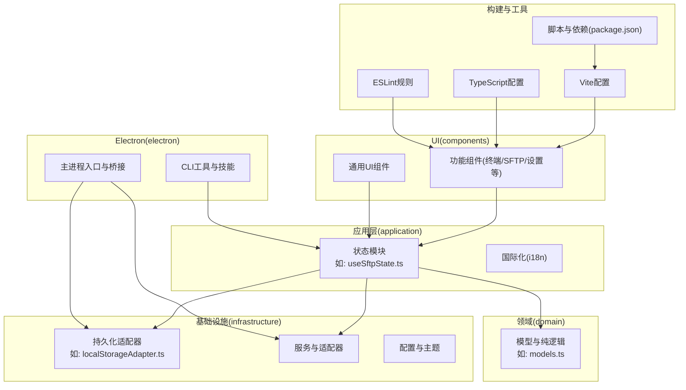
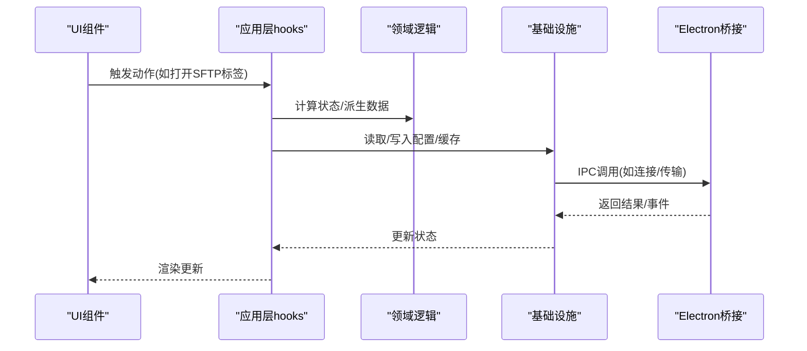
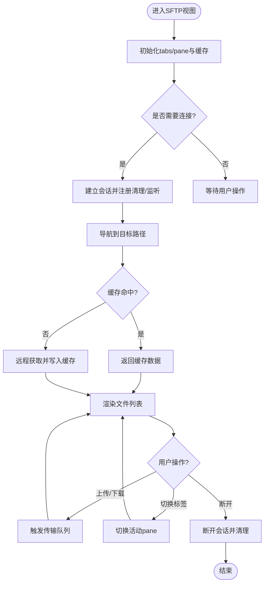
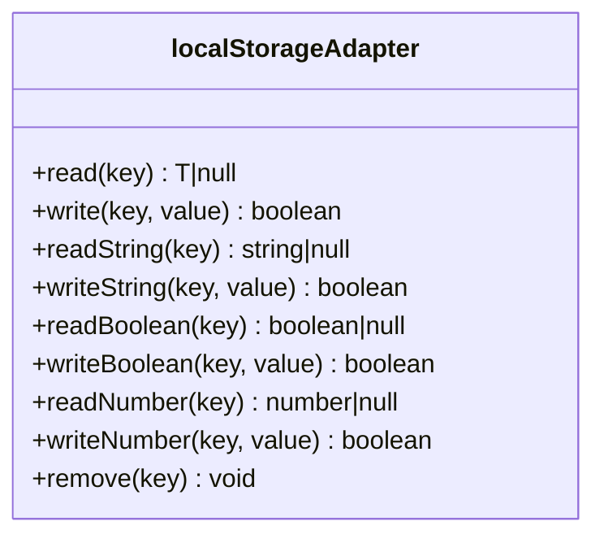

# 贡献指南

<cite>
**本文引用的文件**
- [package.json](file://package.json)
- [README.md](file://README.md)
- [eslint.config.js](file://eslint.config.js)
- [tsconfig.json](file://tsconfig.json)
- [vite.config.ts](file://vite.config.ts)
- [.gitignore](file://.gitignore)
- [electron-builder.config.cjs](file://electron-builder.config.cjs)
- [AGENTS.md](file://AGENTS.md)
- [SKILL.md](file://skills/netcatty-tool-cli/SKILL.md)
- [useSftpState.ts](file://application/state/useSftpState.ts)
- [localStorageAdapter.ts](file://infrastructure/persistence/localStorageAdapter.ts)
- [models.ts](file://domain/models.ts)
</cite>

## 目录
1. [简介](#简介)
2. [项目结构](#项目结构)
3. [核心组件](#核心组件)
4. [架构总览](#架构总览)
5. [详细组件分析](#详细组件分析)
6. [依赖分析](#依赖分析)
7. [性能考虑](#性能考虑)
8. [故障排查指南](#故障排查指南)
9. [结论](#结论)
10. [附录](#附录)

## 简介
本指南面向希望参与 Netcatty 开发与贡献的社区成员，覆盖从环境搭建、开发流程、代码规范、测试策略到文档贡献与沟通渠道的完整路径。Netcatty 是一款基于 Electron + React + xterm.js 的现代化 SSH 客户端与终端管理器，具备主机分组、SFTP、密钥管理、端口转发与丰富的 UI 能力，并内置 AI 助手能力。贡献者可从功能扩展、Bug 修复、测试完善、文档改进等多方面参与。

## 项目结构
项目采用“分层架构 + 模块化组件”的组织方式：
- 应用层（application）：状态与国际化（React hooks、i18n）
- 领域层（domain）：纯模型与业务逻辑（无副作用）
- 基础设施层（infrastructure）：外部服务与适配器（持久化、网络、配置）
- UI 层（components）：组件与页面
- Electron 主进程与桥接（electron）：IPC 桥接、打包配置、CLI 工具
- 构建与工具链（build、scripts、vite.config.ts、tsconfig.json、eslint.config.js）

图表来源
- [useSftpState.ts:1-200](file://application/state/useSftpState.ts#L1-L200)
- [localStorageAdapter.ts:1-107](file://infrastructure/persistence/localStorageAdapter.ts#L1-L107)
- [models.ts:1-8](file://domain/models.ts#L1-L8)
- [vite.config.ts:1-84](file://vite.config.ts#L1-L84)
- [tsconfig.json:1-36](file://tsconfig.json#L1-L36)
- [eslint.config.js:1-199](file://eslint.config.js#L1-L199)
- [package.json:1-120](file://package.json#L1-L120)

章节来源
- [README.md:315-333](file://README.md#L315-L333)
- [package.json:1-120](file://package.json#L1-L120)

## 核心组件
- 状态与生命周期：通过 React hooks 将 UI 与领域逻辑解耦，状态边界清晰，便于测试与维护。
- 持久化抽象：统一使用 localStorageAdapter 进行读写，避免直接访问浏览器存储 API。
- 类型系统：TypeScript 提供强类型约束，结合 ESLint 规则保障代码质量。
- 构建与打包：Vite 提供快速开发体验，electron-builder 支持多平台打包与发布。

章节来源
- [useSftpState.ts:1-200](file://application/state/useSftpState.ts#L1-L200)
- [localStorageAdapter.ts:1-107](file://infrastructure/persistence/localStorageAdapter.ts#L1-L107)
- [tsconfig.json:1-36](file://tsconfig.json#L1-L36)
- [eslint.config.js:1-199](file://eslint.config.js#L1-L199)
- [vite.config.ts:1-84](file://vite.config.ts#L1-L84)
- [package.json:1-120](file://package.json#L1-L120)

## 架构总览
Netcatty 的交互遵循“UI 调用应用层 hooks → hooks 调用领域逻辑/基础设施 → 组件不直接处理副作用”的分层原则。Electron 主进程通过桥接模块与前端通信，CLI 技能用于外部代理与会话操作。

图表来源
- [useSftpState.ts:1-200](file://application/state/useSftpState.ts#L1-L200)
- [localStorageAdapter.ts:1-107](file://infrastructure/persistence/localStorageAdapter.ts#L1-L107)

## 详细组件分析

### SFTP 状态与会话管理
- 设计要点：以 hooks 将 SFTP 会话、标签页、目录缓存、导航序列、重连控制等状态集中管理；通过 ref 与回调保持渲染性能与一致性。
- 关键职责：连接/断开、列表缓存、导航序列去重、错误处理与清理、文件监听与传输协调。
- 可测试性：将副作用隔离在 hooks 内部，便于单元测试与集成测试。

图表来源
- [useSftpState.ts:1-200](file://application/state/useSftpState.ts#L1-L200)

章节来源
- [useSftpState.ts:1-200](file://application/state/useSftpState.ts#L1-L200)

### 持久化适配器设计
- 设计要点：对 localStorage 的安全封装，包含类型解析、配额异常捕获、批量变更事件去抖，保证跨组件一致性与稳定性。
- 使用建议：所有本地存储访问必须通过该适配器，避免直接使用 localStorage。

图表来源
- [localStorageAdapter.ts:1-107](file://infrastructure/persistence/localStorageAdapter.ts#L1-L107)

章节来源
- [localStorageAdapter.ts:1-107](file://infrastructure/persistence/localStorageAdapter.ts#L1-L107)

### 类型与模块组织
- TypeScript 配置启用严格模式与 JSX 支持，路径别名 @/* 指向根目录，便于模块导入。
- ESLint 针对 TSX、组件导入限制、Electron 桥接文件进行专门规则，确保类型安全与架构边界。

章节来源
- [tsconfig.json:1-36](file://tsconfig.json#L1-L36)
- [eslint.config.js:1-199](file://eslint.config.js#L1-L199)

### 构建与打包
- Vite：开发服务器、HMR、产物优化与分包策略。
- electron-builder：多平台打包、签名与发布配置，包含 macOS 独特 UUID 处理与资源注入。

章节来源
- [vite.config.ts:1-84](file://vite.config.ts#L1-L84)
- [electron-builder.config.cjs:1-165](file://electron-builder.config.cjs#L1-L165)

## 依赖分析
- 开发脚本与任务：通过 npm scripts 统一管理开发、构建、打包、测试与预览。
- 依赖与版本：前端框架、终端、AI SDK、云同步、AWS S3、WebDAV 等生态依赖。
- 可选依赖：Windows 进程树工具，按需安装。

章节来源
- [package.json:1-120](file://package.json#L1-L120)

## 性能考虑
- 分包策略：将 Radix UI、xterm、AI SDK 等第三方库拆分为独立 vendor chunk，提升缓存命中率。
- 构建目标：ESNext，支持顶层 await，减少运行时转换成本。
- 源码映射：开发关闭，生产禁用，降低体积与调试负担。
- 会话与缓存：SFTP 目录缓存与导航序列去重，避免重复请求与回流。

章节来源
- [vite.config.ts:38-76](file://vite.config.ts#L38-L76)
- [useSftpState.ts:79-112](file://application/state/useSftpState.ts#L79-L112)

## 故障排查指南
- 开发启动失败
  - 确认 Node.js 版本满足要求，执行安装依赖后尝试启动。
  - 若出现 Monaco 源码映射告警，属于预期行为，不影响功能。
- 打包失败
  - macOS 需要签名与公证；确保 entitlements 与 notarize 配置正确。
  - Windows/Linux 平台需满足 electron-builder 的目标与权限要求。
- 测试失败
  - 使用内置测试脚本运行全量测试，定位失败用例并补充断言。
- 存储异常
  - 当 localStorage 配额不足时，适配器会记录警告日志，避免崩溃。

章节来源
- [README.md:297-313](file://README.md#L297-L313)
- [electron-builder.config.cjs:80-165](file://electron-builder.config.cjs#L80-L165)
- [package.json:34-36](file://package.json#L34-L36)
- [localStorageAdapter.ts:47-68](file://infrastructure/persistence/localStorageAdapter.ts#L47-L68)

## 结论
本指南提供了从环境准备到提交 PR 的全流程规范，强调了类型安全、分层架构、测试驱动与可维护性。欢迎贡献者依据规范开展工作，共同提升 Netcatty 的质量与体验。

## 附录

### 开发环境设置与启动
- 克隆仓库、安装依赖、启动开发模式与打包命令见项目自述文件中的“Getting Started”与“Build & Package”。

章节来源
- [README.md:280-350](file://README.md#L280-L350)

### 代码规范与提交流程
- 提交流程：Fork 仓库 → 创建特性分支 → 提交更改 → 推送到远端 → 发起 Pull Request。
- 代码风格：遵循 ESLint 规则与 TypeScript 配置；组件禁止直接导入基础设施层持久化/服务模块；避免直接访问 window.localStorage/sessionStorage。
- 提交流程：PR 需通过 Lint 与测试检查，至少一名维护者审核通过后合并。

章节来源
- [README.md:370-382](file://README.md#L370-L382)
- [eslint.config.js:127-175](file://eslint.config.js#L127-L175)
- [eslint.config.js:149-153](file://eslint.config.js#L149-L153)

### 代码审查标准与质量要求
- ESLint 规则重点
  - 禁止 any 类型、未使用变量与导入、React Hooks 依赖完整性。
  - 组件层禁止导入基础设施持久化/服务模块，避免破坏状态边界。
  - Electron 桥接文件启用 no-undef 保护。
- TypeScript 配置
  - 启用严格模式、JSX、路径别名，确保类型安全与模块解析一致。
- 测试要求
  - 使用内置测试脚本运行全量测试；为新增功能补充单元测试与集成测试。

章节来源
- [eslint.config.js:94-126](file://eslint.config.js#L94-L126)
- [eslint.config.js:155-175](file://eslint.config.js#L155-L175)
- [eslint.config.js:182-197](file://eslint.config.js#L182-L197)
- [tsconfig.json:1-36](file://tsconfig.json#L1-L36)
- [package.json:34-36](file://package.json#L34-L36)

### 编码约定与最佳实践
- 命名规范
  - hooks 以 use 前缀命名，导出函数以动词短语命名，常量全大写。
- 文件组织
  - 遵循分层结构：domain（纯逻辑）、application/state（状态与副作用）、infrastructure（适配器与服务）、components（UI）。
- 注释标准
  - 对复杂算法与边界条件添加注释；对外接口与变更点提供说明。
- 数据与存储
  - 使用 localStorageAdapter 统一读写；临时文件写入专用临时目录。

章节来源
- [AGENTS.md:31-51](file://AGENTS.md#L31-L51)
- [localStorageAdapter.ts:1-107](file://infrastructure/persistence/localStorageAdapter.ts#L1-L107)

### 测试策略与用例编写指南
- 单元测试：优先覆盖 domain 与 hooks；验证状态计算、缓存命中、错误路径。
- 集成测试：验证 hooks 与基础设施交互；模拟 IPC 与网络请求。
- 端到端测试：通过 CLI 技能与会话操作验证外部代理集成。

章节来源
- [package.json:34-36](file://package.json#L34-L36)
- [SKILL.md:1-48](file://skills/netcatty-tool-cli/SKILL.md#L1-L48)

### 文档贡献方法与格式要求
- 文档位置：README 与各模块 README（如 AGENTS.md、SKILL.md）。
- 格式要求：使用 Markdown，语言统一为中文；示例与截图请保持清晰与可复现。
- 提交流程：与代码 PR 同步提交，确保文档与实现一致。

章节来源
- [README.md:370-382](file://README.md#L370-L382)
- [AGENTS.md:1-181](file://AGENTS.md#L1-L181)
- [SKILL.md:1-48](file://skills/netcatty-tool-cli/SKILL.md#L1-L48)

### 社区行为准则与沟通渠道
- 行为准则：尊重与包容，禁止骚扰与歧视；维护友好开放的社区氛围。
- 沟通渠道：Issue 区讨论问题与需求；PR 区进行代码评审与协作。

章节来源
- [README.md:370-382](file://README.md#L370-L382)

### 新贡献者入门指导与学习资源
- 快速上手：参考“Getting Started”，完成环境搭建与首次运行。
- 架构理解：阅读 AGENTS.md，掌握三层架构与交互边界。
- 技能与 CLI：参考 SKILL.md，了解外部代理与会话操作流程。
- 贡献路径：从最小改动开始（修复文档、小缺陷），逐步深入功能模块。

章节来源
- [README.md:280-350](file://README.md#L280-L350)
- [AGENTS.md:1-52](file://AGENTS.md#L1-L52)
- [SKILL.md:1-48](file://skills/netcatty-tool-cli/SKILL.md#L1-L48)