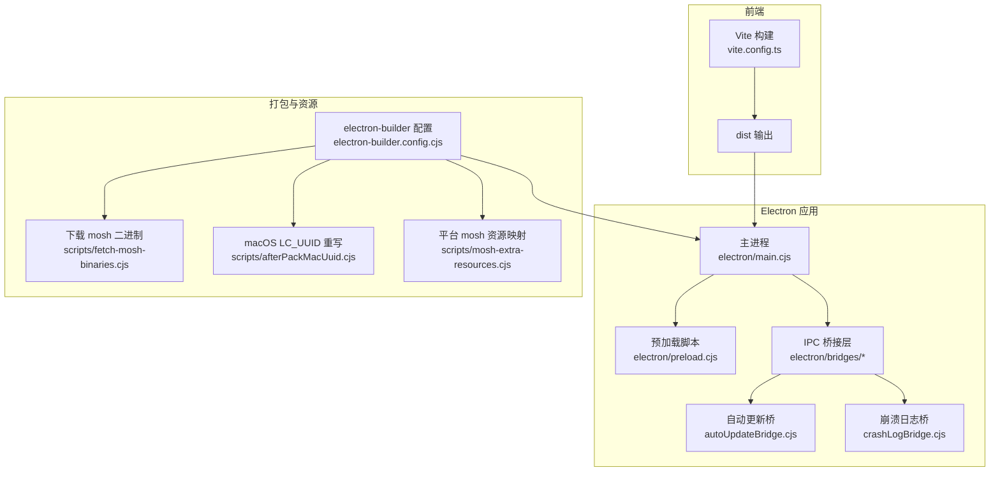
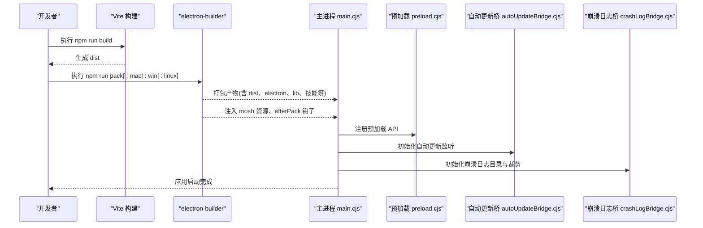
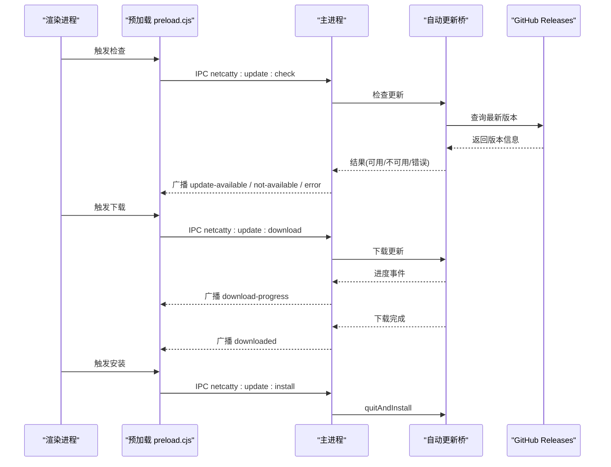
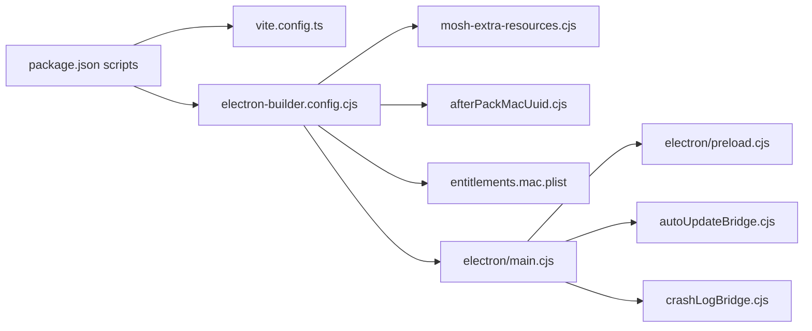

# 部署运维

<cite>
**本文引用的文件**
- [package.json](file://package.json)
- [electron-builder.config.cjs](file://electron-builder.config.cjs)
- [vite.config.ts](file://vite.config.ts)
- [scripts/electron-builder-config.test.cjs](file://scripts/electron-builder-config.test.cjs)
- [scripts/fetch-mosh-binaries.cjs](file://scripts/fetch-mosh-binaries.cjs)
- [scripts/afterPackMacUuid.cjs](file://scripts/afterPackMacUuid.cjs)
- [scripts/mosh-extra-resources.cjs](file://scripts/mosh-extra-resources.cjs)
- [electron/main.cjs](file://electron/main.cjs)
- [electron/preload.cjs](file://electron/preload.cjs)
- [electron/bridges/autoUpdateBridge.cjs](file://electron/bridges/autoUpdateBridge.cjs)
- [electron/bridges/crashLogBridge.cjs](file://electron/bridges/crashLogBridge.cjs)
- [electron/bridges/processErrorGuards.cjs](file://electron/bridges/processErrorGuards.cjs)
- [electron/entitlements.mac.plist](file://electron/entitlements.mac.plist)
- [README.md](file://README.md)
</cite>

## 目录
1. [简介](#简介)
2. [项目结构](#项目结构)
3. [核心组件](#核心组件)
4. [架构总览](#架构总览)
5. [详细组件分析](#详细组件分析)
6. [依赖关系分析](#依赖关系分析)
7. [性能考虑](#性能考虑)
8. [故障排除指南](#故障排除指南)
9. [结论](#结论)
10. [附录](#附录)

## 简介
本文件面向运维与发布工程师，系统化阐述 Netcatty 的构建、打包与发布流程，覆盖开发环境准备、生产构建、跨平台打包、自动更新机制、版本与发布最佳实践、故障排除、监控与日志、性能优化与内存管理等主题。目标是让运维人员能够独立完成从本地开发到多平台发布的全流程工作。

## 项目结构
- 前端采用 Vite + React + TypeScript 构建，产物输出至 dist。
- 主进程使用 Electron，入口为 electron/main.cjs；预加载脚本为 electron/preload.cjs。
- 打包配置由 electron-builder.config.cjs 统一管理，配合 scripts 目录下的辅助脚本（如 mosh 资源注入、macOS LC_UUID 重写、下载 mosh 客户端二进制等）。
- 自动更新通过 electron-updater 实现，主进程桥接模块负责 IPC 通信与状态广播。
- 日志与崩溃收集通过 crashLogBridge 模块持久化到用户数据目录，并提供清理与查看能力。

图表来源
- [vite.config.ts:1-84](file://vite.config.ts#L1-L84)
- [electron/main.cjs:1-879](file://electron/main.cjs#L1-L879)
- [electron/preload.cjs:1-708](file://electron/preload.cjs#L1-L708)
- [electron-builder.config.cjs:1-165](file://electron-builder.config.cjs#L1-L165)
- [scripts/fetch-mosh-binaries.cjs:1-465](file://scripts/fetch-mosh-binaries.cjs#L1-L465)
- [scripts/afterPackMacUuid.cjs:1-148](file://scripts/afterPackMacUuid.cjs#L1-L148)
- [scripts/mosh-extra-resources.cjs:1-87](file://scripts/mosh-extra-resources.cjs#L1-L87)

章节来源
- [README.md:336-351](file://README.md#L336-L351)
- [package.json:14-36](file://package.json#L14-L36)

## 核心组件
- 构建与打包
  - Vite 生产构建：关闭 Source Map、按 vendor 分包、设置目标为 esnext、优化 Rollup 分包策略。
  - electron-builder：统一配置产物命名、图标、平台目标、签名与公证、asarUnpack 列表、发布渠道等。
- 运行时与安全
  - 主进程注册 app:// 协议、权限白名单、GPU 加速开关、沙箱开关、窗口管理与菜单。
  - 预加载脚本暴露受控 API，严格限制可访问范围，避免上下文桥接泄露。
- 更新与日志
  - 自动更新桥：支持检查、下载、安装、状态同步、偏好持久化、平台支持检测。
  - 崩溃日志桥：JSONL 日志、按日期分文件、保留 30 天、提供列表/读取/清空/打开目录。
- 错误处理
  - 进程级错误守卫：区分启动期与运行期错误、网络类非致命错误、流断开等，决定忽略、抑制或致命处理。

章节来源
- [vite.config.ts:21-84](file://vite.config.ts#L21-L84)
- [electron-builder.config.cjs:6-165](file://electron-builder.config.cjs#L6-L165)
- [electron/main.cjs:169-708](file://electron/main.cjs#L169-L708)
- [electron/preload.cjs:595-708](file://electron/preload.cjs#L595-L708)
- [electron/bridges/autoUpdateBridge.cjs:1-415](file://electron/bridges/autoUpdateBridge.cjs#L1-L415)
- [electron/bridges/crashLogBridge.cjs:1-327](file://electron/bridges/crashLogBridge.cjs#L1-L327)
- [electron/bridges/processErrorGuards.cjs:1-194](file://electron/bridges/processErrorGuards.cjs#L1-L194)

## 架构总览
下图展示从构建到打包再到运行时交互的关键路径，以及自动更新与日志在主进程中的位置。

图表来源
- [package.json:23-30](file://package.json#L23-L30)
- [vite.config.ts:38-74](file://vite.config.ts#L38-L74)
- [electron-builder.config.cjs:32-79](file://electron-builder.config.cjs#L32-L79)
- [scripts/fetch-mosh-binaries.cjs:391-442](file://scripts/fetch-mosh-binaries.cjs#L391-L442)
- [scripts/afterPackMacUuid.cjs:108-140](file://scripts/afterPackMacUuid.cjs#L108-L140)
- [electron/main.cjs:352-397](file://electron/main.cjs#L352-L397)
- [electron/preload.cjs:595-708](file://electron/preload.cjs#L595-L708)
- [electron/bridges/autoUpdateBridge.cjs:224-227](file://electron/bridges/autoUpdateBridge.cjs#L224-L227)
- [electron/bridges/crashLogBridge.cjs:302-313](file://electron/bridges/crashLogBridge.cjs#L302-L313)

## 详细组件分析

### 构建与打包配置
- Vite 生产构建
  - 关闭 Source Map，减少缺失 map 文件告警。
  - 设置目标为 esnext，以支持 WASM/SharedArrayBuffer 场景。
  - 手动拆分 vendor 包，提升缓存命中率。
- electron-builder 配置
  - 产物命名模板、输出目录、构建资源目录。
  - asarUnpack 列表确保 node-pty、ssh2、ACPCli 等原生模块可被正确解包执行。
  - 平台目标：macOS(dmg/zip, arm64/x64)、Windows(NSIS/portable, x64/arm64)、Linux(AppImage/DEB/RPM)。
  - 硬化运行时、公证、权限声明、扩展 Info 字段、图标与 DMG 窗口布局。
  - 发布渠道：GitHub Releases。
- 辅助脚本
  - moshExtraResources：根据平台与架构动态注入 mosh-client 及 terminfo。
  - afterPackMacUuid：在签名前重写 LC_UUID，解决 macOS 本地网络隐私判定问题。
  - fetch-mosh-binaries：按 MOSH_BIN_RELEASE 下载对应平台二进制，校验 SHA256，解包并放置到 resources/mosh。

章节来源
- [vite.config.ts:38-74](file://vite.config.ts#L38-L74)
- [electron-builder.config.cjs:32-79](file://electron-builder.config.cjs#L32-L79)
- [electron-builder.config.cjs:80-150](file://electron-builder.config.cjs#L80-L150)
- [scripts/mosh-extra-resources.cjs:28-84](file://scripts/mosh-extra-resources.cjs#L28-L84)
- [scripts/afterPackMacUuid.cjs:108-140](file://scripts/afterPackMacUuid.cjs#L108-L140)
- [scripts/fetch-mosh-binaries.cjs:391-442](file://scripts/fetch-mosh-binaries.cjs#L391-L442)

### 自动更新机制
- 平台支持
  - macOS(zip/dmg)、Windows(NSIS)、Linux(AppImage) 支持自动更新；deb/rpm/snap 不支持。
- 生命周期
  - 启动后延迟触发一次自动检查；支持手动检查、下载、安装；状态持久化到用户数据目录。
- IPC 接口
  - 检查、下载、安装、获取状态、获取/设置自动更新偏好。
- 错误处理
  - 区分检查阶段与下载阶段错误；避免并发检查；下载中不可重复检查。

图表来源
- [electron/bridges/autoUpdateBridge.cjs:255-412](file://electron/bridges/autoUpdateBridge.cjs#L255-L412)
- [electron/main.cjs:637-661](file://electron/main.cjs#L637-L661)
- [electron/preload.cjs:352-401](file://electron/preload.cjs#L352-L401)

章节来源
- [electron/bridges/autoUpdateBridge.cjs:49-63](file://electron/bridges/autoUpdateBridge.cjs#L49-L63)
- [electron/bridges/autoUpdateBridge.cjs:177-211](file://electron/bridges/autoUpdateBridge.cjs#L177-L211)
- [electron/bridges/autoUpdateBridge.cjs:336-357](file://electron/bridges/autoUpdateBridge.cjs#L336-L357)
- [electron/bridges/autoUpdateBridge.cjs:364-381](file://electron/bridges/autoUpdateBridge.cjs#L364-L381)
- [electron/bridges/autoUpdateBridge.cjs:383-409](file://electron/bridges/autoUpdateBridge.cjs#L383-L409)

### 运行时安全与窗口管理
- app:// 协议注册与 MIME 映射，SPA 回退与路径校验。
- 权限白名单：仅允许 local-fonts、clipboard-read、clipboard-sanitized-write。
- GPU 加速与沙箱：默认启用硬件加速，可通过环境变量禁用沙箱用于调试。
- 窗口生命周期：单实例锁、Dock/任务栏点击聚焦、窗口关闭策略、退出前检查脏编辑器。

章节来源
- [electron/main.cjs:225-278](file://electron/main.cjs#L225-L278)
- [electron/main.cjs:524-635](file://electron/main.cjs#L524-L635)
- [electron/main.cjs:698-731](file://electron/main.cjs#L698-L731)

### 预加载与 IPC 通道
- 预加载脚本通过 contextBridge 暴露受控 API，限定可信来源（app://netcatty 或开发服务器），防止跨源注入。
- 统一注册大量 IPC 事件监听器，涵盖数据流、传输进度、认证回调、自动更新、压缩上传等。

章节来源
- [electron/preload.cjs:595-708](file://electron/preload.cjs#L595-L708)
- [electron/preload.cjs:147-201](file://electron/preload.cjs#L147-L201)
- [electron/preload.cjs:352-401](file://electron/preload.cjs#L352-L401)

### 崩溃日志与监控
- JSONL 日志：按日期分文件，保留 30 天，提供列表、读取尾部、清空、打开目录。
- 进程级错误分类：区分流断开、网络类非致命错误、启动期致命错误等，决定忽略/抑制/致命处理。
- 主进程错误守卫：在主窗口显示前抑制错误，显示后转为抑制或致命。

章节来源
- [electron/bridges/crashLogBridge.cjs:118-158](file://electron/bridges/crashLogBridge.cjs#L118-L158)
- [electron/bridges/crashLogBridge.cjs:302-313](file://electron/bridges/crashLogBridge.cjs#L302-L313)
- [electron/bridges/processErrorGuards.cjs:48-76](file://electron/bridges/processErrorGuards.cjs#L48-L76)
- [electron/bridges/processErrorGuards.cjs:106-133](file://electron/bridges/processErrorGuards.cjs#L106-L133)

## 依赖关系分析
- 构建链路
  - package.json 中的 scripts 定义了开发、构建、打包、测试、重建等命令。
  - vite.config.ts 控制前端构建行为；electron-builder.config.cjs 控制打包行为。
- 运行时依赖
  - electron-builder 在打包时启用 npmRebuild，确保 node-pty 等原生模块适配 Electron ABI。
  - asarUnpack 列表保障原生模块与 CLI 工具在解包状态下可执行。
- 平台差异
  - macOS 使用 hardenedRuntime、notarize、entitlements；Windows 使用 NSIS/portable；Linux 使用 AppImage/DEB/RPM。
  - mosh 资源按平台与架构注入，macOS 使用 universal，Linux/Windows 使用对应 arch。

图表来源
- [package.json:14-36](file://package.json#L14-L36)
- [electron-builder.config.cjs:32-79](file://electron-builder.config.cjs#L32-L79)
- [scripts/mosh-extra-resources.cjs:28-84](file://scripts/mosh-extra-resources.cjs#L28-L84)
- [scripts/afterPackMacUuid.cjs:108-140](file://scripts/afterPackMacUuid.cjs#L108-L140)
- [electron/entitlements.mac.plist:1-17](file://electron/entitlements.mac.plist#L1-L17)
- [electron/main.cjs:352-397](file://electron/main.cjs#L352-L397)

章节来源
- [package.json:31-36](file://package.json#L31-L36)
- [electron-builder.config.cjs:32-79](file://electron-builder.config.cjs#L32-L79)

## 性能考虑
- 前端构建
  - 关闭 Source Map，避免缺失 map 文件告警与调试体积。
  - 手动拆分 vendor 包，降低首屏加载时间，提升缓存命中。
  - 目标设为 esnext，支持 SharedArrayBuffer/WASM。
- 运行时
  - 默认启用硬件加速与零拷贝，必要时可通过环境变量禁用沙箱进行调试。
  - 预加载脚本严格限制来源，避免不必要的上下文桥接。
- 打包
  - asarUnpack 仅包含必要原生模块与 CLI，避免过度解包导致启动变慢。
  - Linux 使用 gzip 压缩 DEB，兼容性更佳。

章节来源
- [vite.config.ts:38-74](file://vite.config.ts#L38-L74)
- [electron/main.cjs:128-139](file://electron/main.cjs#L128-L139)
- [electron-builder.config.cjs:55-79](file://electron-builder.config.cjs#L55-L79)
- [electron-builder.config.cjs:151-155](file://electron-builder.config.cjs#L151-L155)

## 故障排除指南
- 构建失败
  - 缺少 mosh 二进制：确认已设置 MOSH_BIN_RELEASE 并执行下载脚本；或在未提供 release 时跳过 mosh 打包。
  - node-pty 原生模块不匹配：确保 npmRebuild 开启，或在 Linux 上提前执行 ensure-node-pty-linux.sh。
- 打包问题
  - macOS LC_UUID 未重写：afterPack 钩子需在签名前运行；若未找到 LC_UUID，会抛出错误提示。
  - Windows/Linux 图标/桌面集成异常：检查 icon 路径与平台目标配置。
- 运行时错误
  - 网络类非致命错误：进程级守卫会抑制；若影响业务，可在 UI 层记录并提示。
  - 崩溃日志定位：通过崩溃日志桥列出/读取/清空日志，定位最近错误堆栈与元信息。
  - 自动更新失败：检查平台支持、并发检查冲突、下载阶段错误；必要时禁用自动下载再手动下载。

章节来源
- [scripts/fetch-mosh-binaries.cjs:404-411](file://scripts/fetch-mosh-binaries.cjs#L404-L411)
- [scripts/afterPackMacUuid.cjs:122-139](file://scripts/afterPackMacUuid.cjs#L122-L139)
- [electron/bridges/processErrorGuards.cjs:1-41](file://electron/bridges/processErrorGuards.cjs#L1-L41)
- [electron/bridges/crashLogBridge.cjs:181-262](file://electron/bridges/crashLogBridge.cjs#L181-L262)
- [electron/bridges/autoUpdateBridge.cjs:255-334](file://electron/bridges/autoUpdateBridge.cjs#L255-L334)

## 结论
通过统一的构建与打包配置、严格的运行时安全策略、完善的自动更新与日志体系，Netcatty 能够在 macOS、Windows、Linux 多平台上稳定交付。运维人员可依据本文档完成从开发到发布的全链路操作，并基于内置的监控与日志工具快速定位问题。

## 附录

### 开发环境搭建
- 克隆仓库、安装依赖、启动开发模式。
- 若需要 mosh 功能，请先设置 MOSH_BIN_RELEASE 并执行 mosh 二进制下载脚本。

章节来源
- [README.md:280-314](file://README.md#L280-L314)
- [scripts/fetch-mosh-binaries.cjs:404-411](file://scripts/fetch-mosh-binaries.cjs#L404-L411)

### 生产构建与打包
- 生产构建：npm run build
- 当前平台打包：npm run pack
- 指定平台打包：
  - macOS：npm run pack:mac
  - Windows：npm run pack:win 或分别指定 x64/arm64
  - Linux：npm run pack:linux 或分别指定 x64/arm64

章节来源
- [README.md:336-351](file://README.md#L336-L351)
- [package.json:23-30](file://package.json#L23-L30)

### 自动更新配置要点
- 平台支持：macOS、Windows、Linux(AppImage) 支持；deb/rpm/snap 不支持。
- 首次启动后延迟 5 秒检查；支持手动检查、下载、安装。
- 偏好持久化：用户数据目录下保存启用状态；支持取消自动检查与重新调度。

章节来源
- [electron/bridges/autoUpdateBridge.cjs:49-63](file://electron/bridges/autoUpdateBridge.cjs#L49-L63)
- [electron/bridges/autoUpdateBridge.cjs:177-211](file://electron/bridges/autoUpdateBridge.cjs#L177-L211)
- [electron/main.cjs:637-641](file://electron/main.cjs#L637-L641)

### 版本与发布最佳实践
- 使用 GitHub Releases 作为发布渠道，确保 releaseType 为 release。
- 为 macOS dmg 提供标题、窗口尺寸、图标大小与布局。
- Linux DEB 使用 gzip 压缩，提升兼容性。
- Windows NSIS 提供可选安装目录、开始菜单/桌面快捷方式。

章节来源
- [electron-builder.config.cjs:156-163](file://electron-builder.config.cjs#L156-L163)
- [electron-builder.config.cjs:103-115](file://electron-builder.config.cjs#L103-L115)
- [electron-builder.config.cjs:151-155](file://electron-builder.config.cjs#L151-L155)
- [electron-builder.config.cjs:133-141](file://electron-builder.config.cjs#L133-L141)

### 监控与日志
- 崩溃日志：按日期分文件，保留 30 天；提供列表、读取尾部、清空、打开目录。
- 进程级错误分类：区分非致命网络错误、流断开、启动期致命错误等。
- 预加载脚本：严格限制来源，避免跨源注入风险。

章节来源
- [electron/bridges/crashLogBridge.cjs:118-158](file://electron/bridges/crashLogBridge.cjs#L118-L158)
- [electron/bridges/processErrorGuards.cjs:48-76](file://electron/bridges/processErrorGuards.cjs#L48-L76)
- [electron/preload.cjs:688-697](file://electron/preload.cjs#L688-L697)