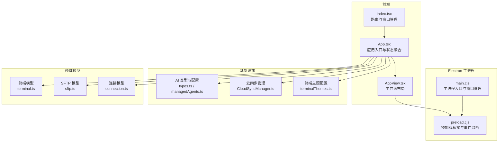
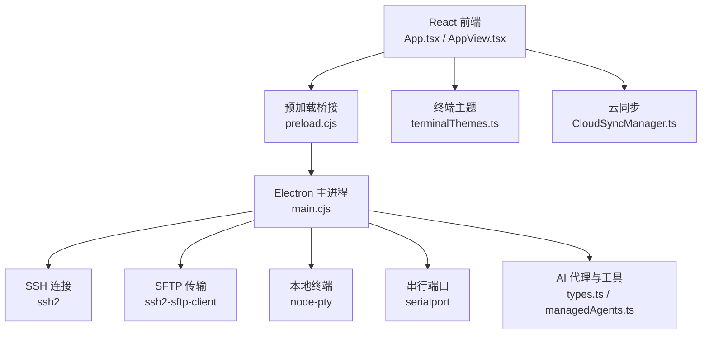
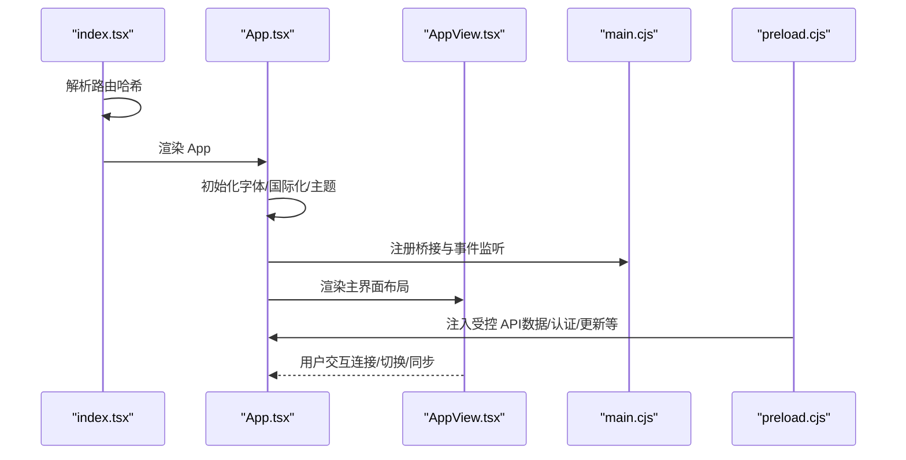
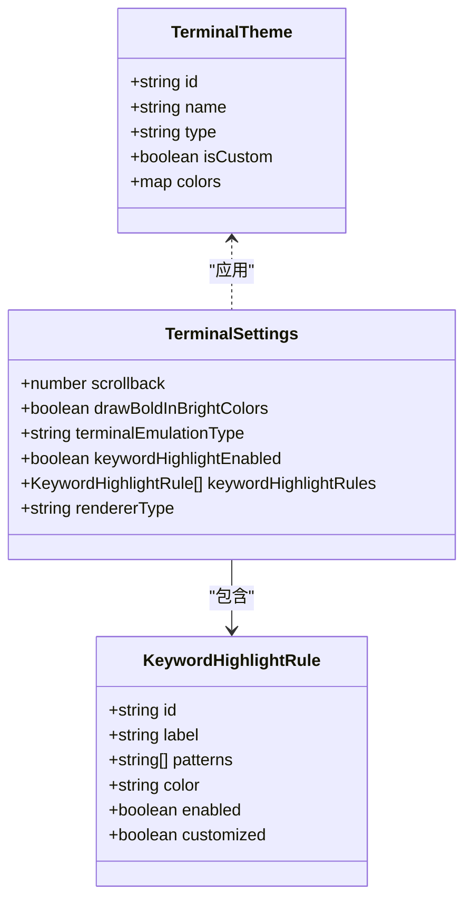
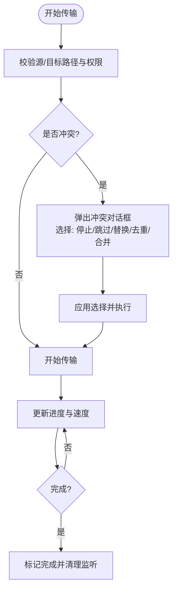
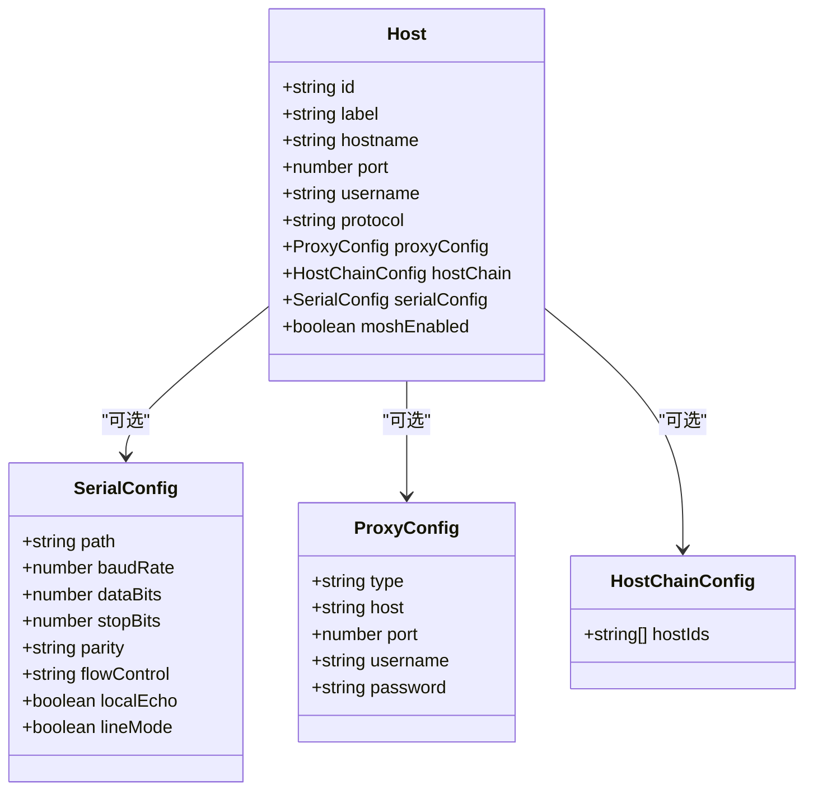
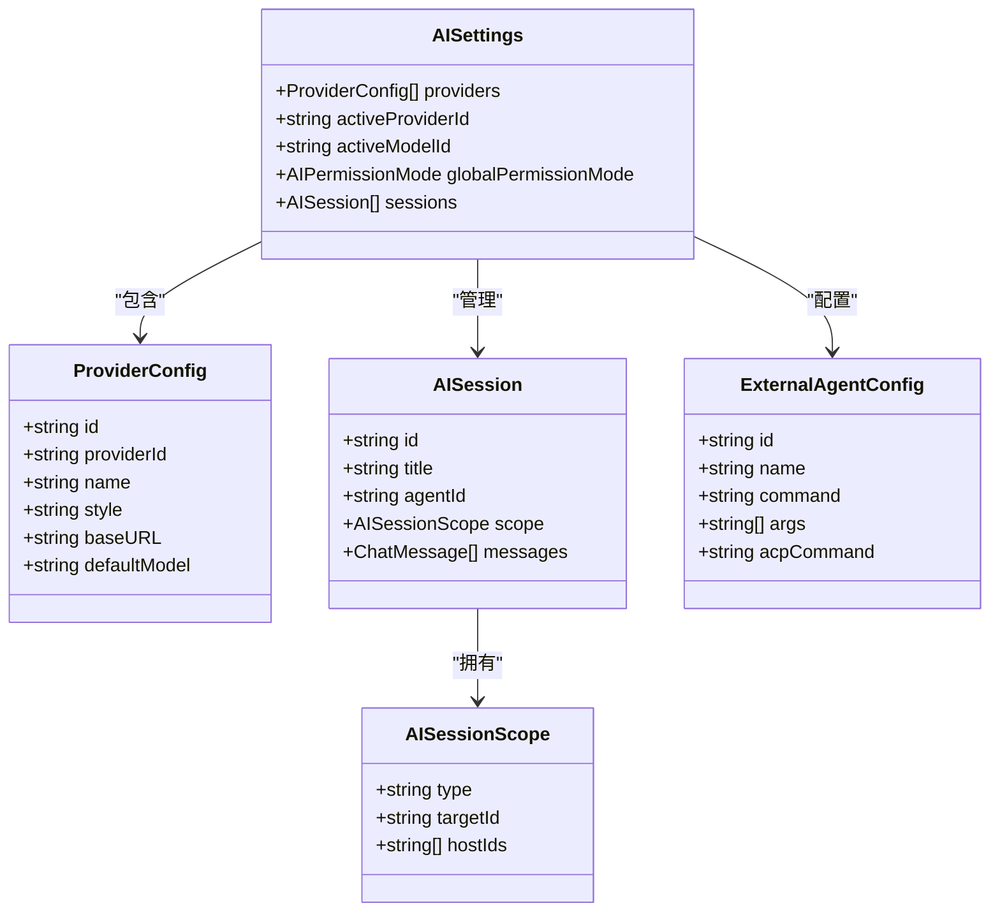
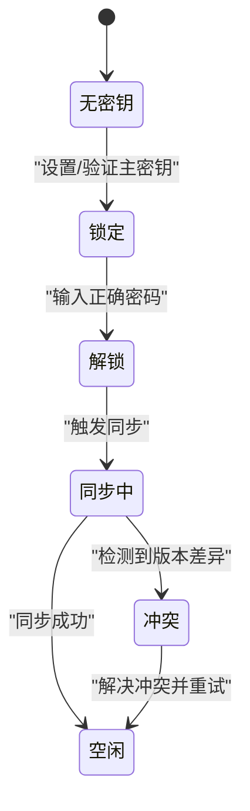
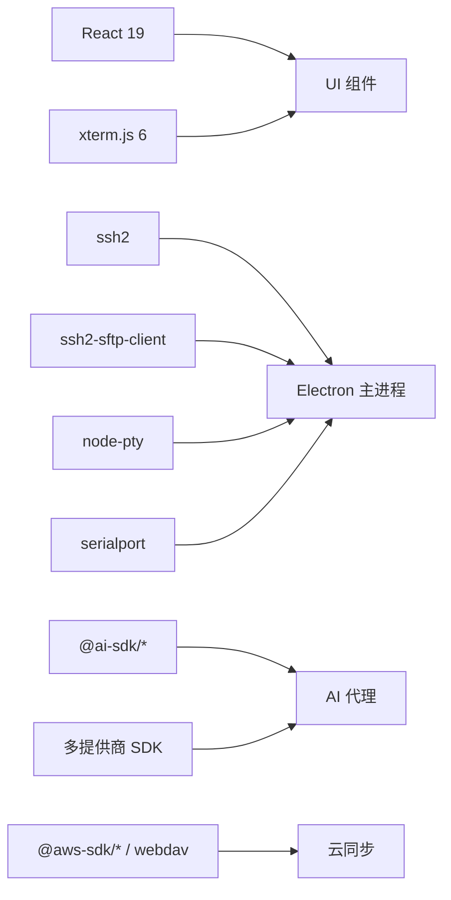

# 项目概述

<cite>
**本文档引用的文件**
- [README.md](file://README.md)
- [package.json](file://package.json)
- [App.tsx](file://App.tsx)
- [index.tsx](file://index.tsx)
- [main.cjs](file://electron/main.cjs)
- [preload.cjs](file://electron/preload.cjs)
- [AppView.tsx](file://application/app/AppView.tsx)
- [terminal.ts](file://domain/models/terminal.ts)
- [sftp.ts](file://domain/models/sftp.ts)
- [connection.ts](file://domain/models/connection.ts)
- [terminalThemes.ts](file://infrastructure/config/terminalThemes.ts)
- [managedAgents.ts](file://infrastructure/ai/managedAgents.ts)
- [types.ts](file://infrastructure/ai/types.ts)
- [CloudSyncManager.ts](file://infrastructure/services/CloudSyncManager.ts)
- [metadata.json](file://metadata.json)
</cite>

## 目录
1. [简介](#简介)
2. [项目结构](#项目结构)
3. [核心组件](#核心组件)
4. [架构总览](#架构总览)
5. [详细组件分析](#详细组件分析)
6. [依赖关系分析](#依赖关系分析)
7. [性能考虑](#性能考虑)
8. [故障排除指南](#故障排除指南)
9. [结论](#结论)
10. [附录](#附录)

## 简介
Netcatty 是一款基于 Electron + React + xterm.js 构建的现代化 SSH 客户端与终端管理器，集成了 AI 代理能力，支持多协议连接（SSH、Telnet、Mosh、本地终端、串行），提供终端工作空间管理、SFTP 文件传输与保管库（Vault）管理。其核心价值在于：
- AI 驱动的智能运维：通过内置 Catty Agent 实现自然语言服务器管理、实时诊断与多主机编排
- 工作流优先的设计：分割终端、标签页与会话管理，提升多任务并行效率
- 一体化的主机与文件管理：统一的保管库视图、内置编辑器与平滑的文件操作体验
- 跨平台支持：同时覆盖 macOS、Windows 与 Linux 桌面环境

## 项目结构
项目采用分层架构，前端以 React 组件为核心，后端通过 Electron 主进程桥接底层能力，基础设施层提供服务与适配器，领域模型定义业务实体。

**图表来源**
- [App.tsx:1-800](file://App.tsx#L1-L800)
- [AppView.tsx:1-554](file://application/app/AppView.tsx#L1-L554)
- [index.tsx:1-134](file://index.tsx#L1-L134)
- [main.cjs:1-879](file://electron/main.cjs#L1-L879)
- [preload.cjs:1-708](file://electron/preload.cjs#L1-L708)
- [types.ts:1-343](file://infrastructure/ai/types.ts#L1-L343)
- [managedAgents.ts:1-77](file://infrastructure/ai/managedAgents.ts#L1-L77)
- [CloudSyncManager.ts:1-830](file://infrastructure/services/CloudSyncManager.ts#L1-L830)
- [terminalThemes.ts:1-43](file://infrastructure/config/terminalThemes.ts#L1-L43)
- [terminal.ts:1-339](file://domain/models/terminal.ts#L1-L339)
- [sftp.ts:1-79](file://domain/models/sftp.ts#L1-L79)
- [connection.ts:1-283](file://domain/models/connection.ts#L1-L283)

**章节来源**
- [README.md:110-121](file://README.md#L110-L121)
- [package.json:1-120](file://package.json#L1-L120)
- [App.tsx:1-800](file://App.tsx#L1-L800)
- [index.tsx:1-134](file://index.tsx#L1-L134)

## 核心组件
- 应用入口与状态聚合：负责全局状态初始化、自动同步、托盘交互与热键处理，贯穿应用生命周期。
- 主界面布局：组织保管库、SFTP 视图、终端工作区与日志回放等模块，支持拖拽与批量关闭等高级交互。
- Electron 预加载桥：在安全上下文中暴露受控 API，处理数据流、认证与更新等事件回调。
- AI 与工具链：提供多提供商 AI 配置、外部代理发现与托管、命令阻断策略与工具集成模式。
- 云同步：实现多云提供商接入、冲突检测与解决、自动同步与历史版本回溯。
- 终端与 SFTP：定义终端设置、关键字高亮规则、SFTP 文件条目与传输任务类型，支撑高性能文件操作。

**章节来源**
- [App.tsx:1-800](file://App.tsx#L1-L800)
- [AppView.tsx:1-554](file://application/app/AppView.tsx#L1-L554)
- [preload.cjs:1-708](file://electron/preload.cjs#L1-L708)
- [types.ts:1-343](file://infrastructure/ai/types.ts#L1-L343)
- [managedAgents.ts:1-77](file://infrastructure/ai/managedAgents.ts#L1-L77)
- [CloudSyncManager.ts:1-830](file://infrastructure/services/CloudSyncManager.ts#L1-L830)
- [terminal.ts:1-339](file://domain/models/terminal.ts#L1-L339)
- [sftp.ts:1-79](file://domain/models/sftp.ts#L1-L79)

## 架构总览
Netcatty 的技术栈与运行时架构如下：
- 前端框架：React 19 + TypeScript，UI 使用 Tailwind CSS 4
- 终端渲染：xterm.js 6 及相关插件（fit/search/serialize/webgl/web-links）
- 连接与传输：ssh2、ssh2-sftp-client、node-pty、serialport
- 打包与分发：Electron 40 + Vite 7，支持多平台打包
- AI 集成：多提供商 SDK（OpenAI、Anthropic、Google）与外部代理（ACP）

**图表来源**
- [package.json:38-87](file://package.json#L38-L87)
- [main.cjs:103-126](file://electron/main.cjs#L103-L126)
- [preload.cjs:595-708](file://electron/preload.cjs#L595-L708)
- [types.ts:1-343](file://infrastructure/ai/types.ts#L1-L343)
- [terminalThemes.ts:1-43](file://infrastructure/config/terminalThemes.ts#L1-L43)
- [CloudSyncManager.ts:1-830](file://infrastructure/services/CloudSyncManager.ts#L1-L830)

**章节来源**
- [README.md:354-367](file://README.md#L354-L367)
- [package.json:38-87](file://package.json#L38-L87)

## 详细组件分析

### 应用入口与启动流程
应用入口负责初始化字体、国际化、主题与全局状态，并注册托盘与热键事件；随后根据路由渲染主界面或设置窗口。

**图表来源**
- [index.tsx:88-134](file://index.tsx#L88-L134)
- [App.tsx:1-800](file://App.tsx#L1-L800)
- [AppView.tsx:1-554](file://application/app/AppView.tsx#L1-L554)
- [main.cjs:352-397](file://electron/main.cjs#L352-L397)
- [preload.cjs:595-708](file://electron/preload.cjs#L595-L708)

**章节来源**
- [index.tsx:1-134](file://index.tsx#L1-L134)
- [App.tsx:1-800](file://App.tsx#L1-L800)

### 终端与主题系统
终端模型定义了丰富的设置项（滚动缓冲、光标形状、键盘行为、鼠标交互、关键字高亮、渲染器类型等），并提供默认规则与规范化逻辑；主题系统支持多种内置主题与 UI 匹配主题集合。

**图表来源**
- [terminal.ts:23-116](file://domain/models/terminal.ts#L23-L116)
- [terminal.ts:9-21](file://domain/models/terminal.ts#L9-L21)
- [terminal.ts:287-314](file://domain/models/terminal.ts#L287-L314)
- [terminalThemes.ts:28-43](file://infrastructure/config/terminalThemes.ts#L28-L43)

**章节来源**
- [terminal.ts:1-339](file://domain/models/terminal.ts#L1-L339)
- [terminalThemes.ts:1-43](file://infrastructure/config/terminalThemes.ts#L1-L43)

### SFTP 文件传输与冲突处理
SFTP 模型定义了文件条目、连接状态、传输任务与冲突处理策略；支持上传/下载/远程复制/本地复制，以及目录级传输与进度追踪。

**图表来源**
- [sftp.ts:4-79](file://domain/models/sftp.ts#L4-L79)

**章节来源**
- [sftp.ts:1-79](file://domain/models/sftp.ts#L1-L79)

### 多协议连接与串行支持
连接模型支持 SSH、Telnet、Mosh、本地与串行五种协议，提供代理配置、主机链（跳板机）、环境变量、字符集与算法覆盖等高级选项；串行端口配置涵盖波特率、数据位、停止位、奇偶校验与流控。

**图表来源**
- [connection.ts:84-179](file://domain/models/connection.ts#L84-L179)
- [connection.ts:55-64](file://domain/models/connection.ts#L55-L64)
- [connection.ts:9-23](file://domain/models/connection.ts#L9-L23)
- [connection.ts:26-28](file://domain/models/connection.ts#L26-L28)

**章节来源**
- [connection.ts:1-283](file://domain/models/connection.ts#L1-L283)

### AI 代理与工具链
AI 类型系统支持多提供商（OpenAI、Anthropic、Google、Ollama、OpenRouter、自定义），提供模型信息、聊天消息、工具调用与结果、会话范围与权限模式；托管代理发现与存储路径解析，支持命令阻断列表与超时控制。

**图表来源**
- [types.ts:23-40](file://infrastructure/ai/types.ts#L23-L40)
- [types.ts:264-277](file://infrastructure/ai/types.ts#L264-L277)
- [types.ts:160-176](file://infrastructure/ai/types.ts#L160-L176)
- [types.ts:171-176](file://infrastructure/ai/types.ts#L171-L176)
- [types.ts:203-215](file://infrastructure/ai/types.ts#L203-L215)
- [managedAgents.ts:5-76](file://infrastructure/ai/managedAgents.ts#L5-L76)

**章节来源**
- [types.ts:1-343](file://infrastructure/ai/types.ts#L1-L343)
- [managedAgents.ts:1-77](file://infrastructure/ai/managedAgents.ts#L1-L77)

### 云同步与冲突解决
云同步管理器实现主密钥安全状态机（无密钥→锁定→解锁）、同步状态机（空闲→同步中→冲突/错误）与多提供商适配器（GitHub、Google、OneDrive、WebDAV、S3），支持版本冲突检测与解决、自动同步调度与历史版本回溯。

**图表来源**
- [CloudSyncManager.ts:116-139](file://infrastructure/services/CloudSyncManager.ts#L116-L139)

**章节来源**
- [CloudSyncManager.ts:1-830](file://infrastructure/services/CloudSyncManager.ts#L1-L830)

## 依赖关系分析
- 前端依赖：React、xterm.js 生态、Monaco 编辑器、Radix UI 组件库、Tailwind CSS
- 连接与传输：ssh2、ssh2-sftp-client、node-pty、serialport
- AI 与工具：@ai-sdk/*、@agentclientprotocol/*、@mcpc-tech/acp-ai-provider、@zed-industries/codex-acp
- 打包与构建：Electron、Vite、electron-builder
- 云同步：@aws-sdk/client-s3、webdav、@google/genai 等

**图表来源**
- [package.json:38-87](file://package.json#L38-L87)
- [main.cjs:103-126](file://electron/main.cjs#L103-L126)

**章节来源**
- [package.json:1-120](file://package.json#L1-L120)

## 性能考虑
- 终端渲染优化：xterm.js 支持 WebGL 渲染与 DOM 回退，结合自动检测与用户偏好，平衡性能与兼容性。
- 文件传输：支持压缩上传与进度回调，减少网络拥塞与提升用户体验。
- 进程隔离：Electron 主进程与渲染进程分离，预加载桥限制权限，避免不必要资源占用。
- 自动同步：后台定时任务与跨窗口同步，降低手动干预成本。

## 故障排除指南
- 启动失败：检查主进程窗口创建与渲染就绪信号，确保静态资源存在且未损坏。
- 认证问题：处理键盘交互认证队列与密钥口令请求，支持超时与取消流程。
- 传输异常：监听传输进度与错误事件，清理监听器并提示用户。
- 更新问题：订阅更新事件并在 UI 中展示下载进度与可用状态。

**章节来源**
- [main.cjs:489-502](file://electron/main.cjs#L489-L502)
- [preload.cjs:247-401](file://electron/preload.cjs#L247-L401)
- [App.tsx:547-674](file://App.tsx#L547-L674)

## 结论
Netcatty 将现代桌面应用的工程化能力与 AI 驱动的运维体验相结合，通过 Electron + React + xterm.js 技术栈实现了跨平台的 SSH 客户端与终端管理器。其核心优势体现在：
- AI 代理集成：自然语言驱动的服务器管理与多主机编排
- 多协议连接：统一入口支持 SSH、Telnet、Mosh、本地与串行
- 终端工作空间：分割面板、标签页与会话管理，提升多任务效率
- SFTP 文件传输：内置编辑器与平滑文件操作
- 云同步与保管库：安全的多云备份与版本回溯

## 附录

### 目标用户与使用场景
- 开发者：快速连接与调试多台服务器，编写与执行脚本片段
- 系统管理员：集中管理主机、执行批量运维任务、监控与诊断
- DevOps 工程师：CI/CD 环境中的远程部署与配置管理

### 发展历程与社区
- 项目主页与发布页面提供最新版本与下载链接
- 社区支持通过 GitHub Issues 与讨论渠道进行
- 星标历史图表展示社区关注度趋势

**章节来源**
- [README.md:1-419](file://README.md#L1-L419)

### 许可证信息
- 项目采用 GPL-3.0 许可证，详情见 LICENSE 文件

**章节来源**
- [README.md:396-400](file://README.md#L396-L400)

### 系统要求与平台支持
- 平台：macOS（通用）、Windows（x64/arm64）、Linux（x64/arm64）
- 前置条件：Node.js 18+ 与 npm
- 硬件要求：满足各平台 Electron 应用常规需求

**章节来源**
- [README.md:280-300](file://README.md#L280-L300)
- [README.md:287-291](file://README.md#L287-L291)

### 应用元数据
- 名称与描述：用于应用商店与系统集成的元数据配置

**章节来源**
- [metadata.json:1-6](file://metadata.json#L1-L6)